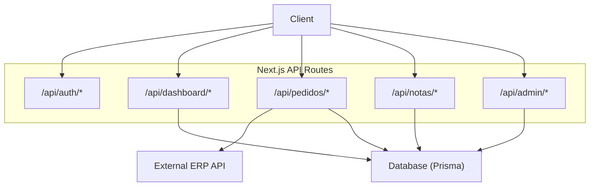
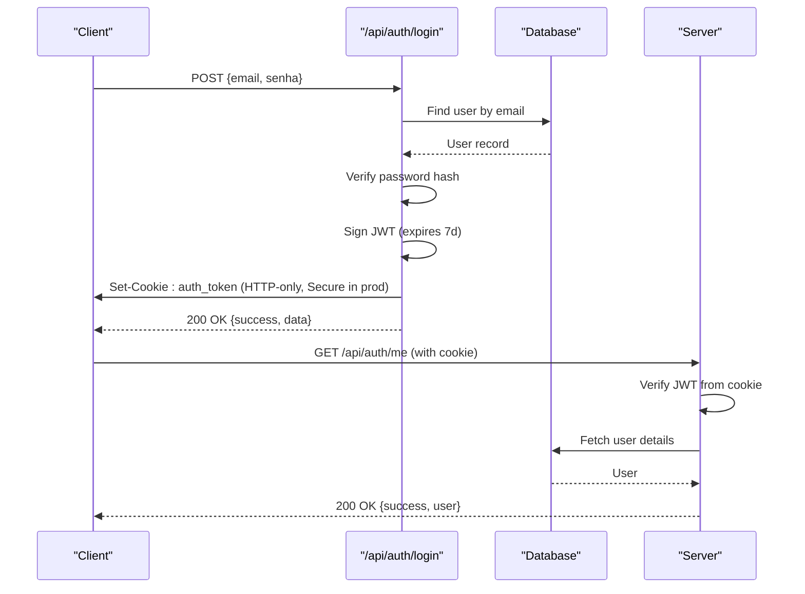
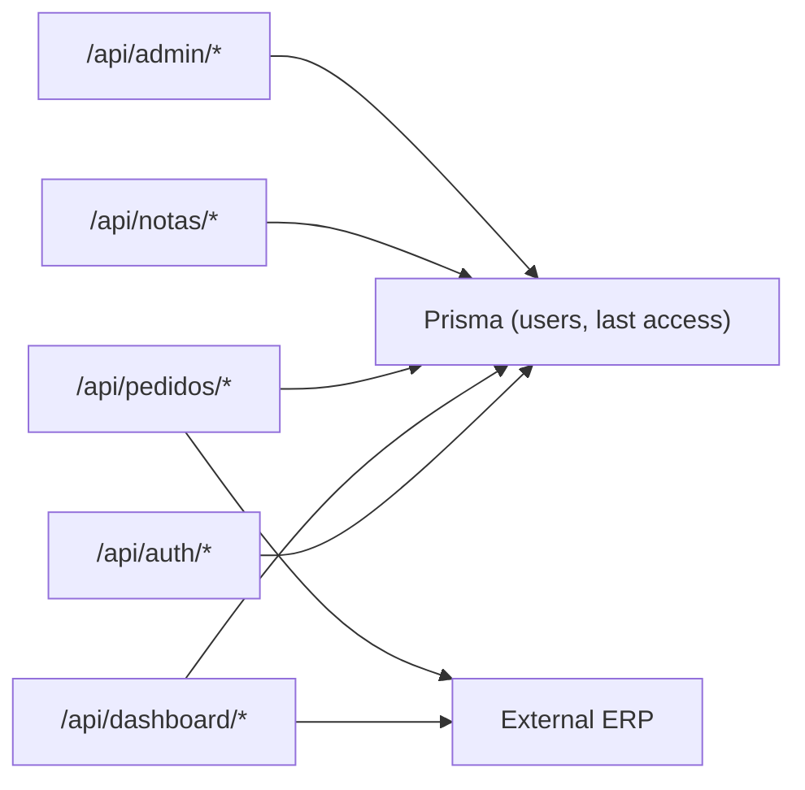

# API Reference

<cite>
**Referenced Files in This Document**
- [login.ts](file://pages/api/auth/login.ts)
- [logout.ts](file://pages/api/auth/logout.ts)
- [me.ts](file://pages/api/auth/me.ts)
- [stats.ts](file://pages/api/dashboard/stats.ts)
- [resumo-hoje.ts](file://pages/api/dashboard/resumo-hoje.ts)
- [index.ts](file://pages/api/notas/index.ts)
- [nota_by_id.ts](file://pages/api/notas/[id].ts)
- [salvar-multiplas.ts](file://pages/api/notas/salvar-multiplas.ts)
- [status.ts](file://pages/api/pedidos/status.ts)
- [exportar.ts](file://pages/api/pedidos/exportar.ts)
- [externos.ts](file://pages/api/pedidos/externos.ts)
- [dashboard.ts](file://pages/api/admin/dashboard.ts)
- [atividades-recentes.ts](file://pages/api/admin/atividades-recentes.ts)
- [configuracoes_index.ts](file://pages/api/admin/configuracoes/index.ts)
</cite>

## Table of Contents
1. Introduction
2. Project Structure
3. Core Components
4. Architecture Overview
5. Detailed Component Analysis
6. Dependency Analysis
7. Performance Considerations
8. Troubleshooting Guide
9. Conclusion

## Introduction
This document provides a comprehensive REST API reference for the Control Carga system. It covers authentication, dashboard data, order management, invoice processing, and administrative endpoints. For each endpoint, you will find HTTP methods, URL patterns, request/response schemas, authentication requirements, error handling, practical examples, and integration notes. Security considerations such as CORS, cookies, and token handling are included. Rate limiting is not implemented at the API layer; clients should implement client-side throttling where appropriate. Versioning is not explicitly versioned in URLs; changes are additive or backward-compatible when possible.

## Project Structure
The API is implemented as Next.js API routes under pages/api. Key groups:
- Authentication: /api/auth/*
- Dashboard: /api/dashboard/*
- Orders (Pedidos): /api/pedidos/*
- Invoices (Notas): /api/notas/*
- Admin: /api/admin/*

**Diagram sources**
- [login.ts:1-461](file://pages/api/auth/login.ts#L1-L461)
- [stats.ts:1-88](file://pages/api/dashboard/stats.ts#L1-L88)
- [resumo-hoje.ts:1-293](file://pages/api/dashboard/resumo-hoje.ts#L1-L293)
- [index.ts:1-87](file://pages/api/notas/index.ts#L1-L87)
- [nota_by_id.ts:1-69](file://pages/api/notas/[id].ts#L1-L69)
- [status.ts:1-52](file://pages/api/pedidos/status.ts#L1-L52)
- [exportar.ts:1-207](file://pages/api/pedidos/exportar.ts#L1-L207)
- [externos.ts:1-800](file://pages/api/pedidos/externos.ts#L1-L800)
- [dashboard.ts:1-46](file://pages/api/admin/dashboard.ts#L1-L46)
- [atividades-recentes.ts:1-55](file://pages/api/admin/atividades-recentes.ts#L1-L55)
- [configuracoes_index.ts:1-76](file://pages/api/admin/configuracoes/index.ts#L1-L76)

**Section sources**
- [login.ts:1-461](file://pages/api/auth/login.ts#L1-L461)
- [stats.ts:1-88](file://pages/api/dashboard/stats.ts#L1-L88)
- [resumo-hoje.ts:1-293](file://pages/api/dashboard/resumo-hoje.ts#L1-L293)
- [index.ts:1-87](file://pages/api/notas/index.ts#L1-L87)
- [nota_by_id.ts:1-69](file://pages/api/notas/[id].ts#L1-L69)
- [status.ts:1-52](file://pages/api/pedidos/status.ts#L1-L52)
- [exportar.ts:1-207](file://pages/api/pedidos/exportar.ts#L1-L207)
- [externos.ts:1-800](file://pages/api/pedidos/externos.ts#L1-L800)
- [dashboard.ts:1-46](file://pages/api/admin/dashboard.ts#L1-L46)
- [atividades-recentes.ts:1-55](file://pages/api/admin/atividades-recentes.ts#L1-L55)
- [configuracoes_index.ts:1-76](file://pages/api/admin/configuracoes/index.ts#L1-L76)

## Core Components
- Authentication: Login with email/password returns an HTTP-only cookie containing a JWT. Subsequent requests to protected endpoints rely on this cookie.
- Dashboard: Aggregates counts from local database and optionally enriches with external order data. Includes caching and stale-while-revalidate behavior.
- Orders: Provides status listing and export capabilities, primarily backed by an external ERP service with local filtering and pagination.
- Invoices: CRUD operations over fiscal notes with filtering by date range and identifiers.
- Admin: Dashboard summary, recent activities, and system configuration management.

**Section sources**
- [login.ts:1-461](file://pages/api/auth/login.ts#L1-L461)
- [me.ts:1-205](file://pages/api/auth/me.ts#L1-L205)
- [stats.ts:1-88](file://pages/api/dashboard/stats.ts#L1-L88)
- [resumo-hoje.ts:1-293](file://pages/api/dashboard/resumo-hoje.ts#L1-L293)
- [index.ts:1-87](file://pages/api/notas/index.ts#L1-L87)
- [nota_by_id.ts:1-69](file://pages/api/notas/[id].ts#L1-L69)
- [salvar-multiplas.ts:1-78](file://pages/api/notas/salvar-multiplas.ts#L1-L78)
- [status.ts:1-52](file://pages/api/pedidos/status.ts#L1-L52)
- [exportar.ts:1-207](file://pages/api/pedidos/exportar.ts#L1-L207)
- [externos.ts:1-800](file://pages/api/pedidos/externos.ts#L1-L800)
- [dashboard.ts:1-46](file://pages/api/admin/dashboard.ts#L1-L46)
- [atividades-recentes.ts:1-55](file://pages/api/admin/atividades-recentes.ts#L1-L55)
- [configuracoes_index.ts:1-76](file://pages/api/admin/configuracoes/index.ts#L1-L76)

## Architecture Overview
Authentication flow uses a secure HTTP-only cookie and JWT verification on subsequent calls. Dashboard and admin endpoints read from the local database. Order endpoints call an external ERP service and apply local filters and pagination.

**Diagram sources**
- [login.ts:1-461](file://pages/api/auth/login.ts#L1-L461)
- [me.ts:1-205](file://pages/api/auth/me.ts#L1-L205)

## Detailed Component Analysis

### Authentication Endpoints

#### POST /api/auth/login
- Purpose: Authenticate user and issue session cookie.
- Auth: None required.
- Request body:
  - email: string (valid format, non-empty)
  - senha: string (min length enforced)
- Response:
  - 200: { success: true, message: "...", data: { id, nome, email, tipo, ativo, dataCriacao, ultimoAcesso } }
  - 400: { success: false, message: "...", code: "MISSING_FIELDS" | "EMPTY_EMAIL" | "INVALID_EMAIL_FORMAT" | "INVALID_EMAIL_DOMAIN" | "PASSWORD_TOO_SHORT" }
  - 401: { success: false, message: "Credenciais inválidas", code: "INVALID_CREDENTIALS" }
  - 403: { success: false, message: "Conta desativada", code: "ACCOUNT_DISABLED" }
  - 405: { success: false, message: "Método não permitido", code: "METHOD_NOT_ALLOWED" }
  - 500: { success: false, message: "Erro interno do servidor", code: "INTERNAL_SERVER_ERROR" }
- Headers:
  - Set-Cookie: auth_token=<jwt>; HttpOnly; Secure (prod); SameSite=lax; Path=/; Max-Age=604800
  - CORS: Access-Control-Allow-Origin set to allowed origins; credentials enabled
- Notes:
  - Origin allowlist enforced for cross-origin requests.
  - Last access timestamp updated on successful login.

Example:
- curl -X POST https://your-domain/api/auth/login -H "Content-Type: application/json" -d '{"email":"user@example.com","senha":"yourpassword"}'

**Section sources**
- [login.ts:1-461](file://pages/api/auth/login.ts#L1-L461)

#### POST /api/auth/logout
- Purpose: Invalidate session by clearing the auth cookie.
- Auth: None required.
- Request: Empty body.
- Response:
  - 200: { success: true, message: "Logout realizado com sucesso" }
  - 405: { success: false, message: "Método não permitido" }
  - 500: { success: false, message: "Erro durante o logout" }
- Headers:
  - Set-Cookie: auth_token=; Expires=Thu, 01 Jan 1970 00:00:00 GMT; HttpOnly; Secure (prod); SameSite=lax; Path=/

Example:
- curl -X POST https://your-domain/api/auth/logout

**Section sources**
- [logout.ts:1-149](file://pages/api/auth/logout.ts#L1-L149)

#### GET /api/auth/me
- Purpose: Return current authenticated user profile.
- Auth: Required via cookie (auth_token).
- Response:
  - 200: { success: true, user: { id, nome, email, tipo, ativo, dataCriacao, ultimoAcesso, foto } }
  - 401: { success: false, message: "Não autenticado" | "Sessão inválida ou expirada" }
  - 404: { success: false, message: "Usuário não encontrado" }
  - 405: { success: false, message: "Método não permitido" }
  - 500: { success: false, message: "Erro interno do servidor" }
- Headers:
  - Security headers: Cache-Control no-store, X-Content-Type-Options nosniff, X-Frame-Options DENY, X-XSS-Protection, HSTS in production.

Example:
- curl -b "auth_token=<token>" https://your-domain/api/auth/me

**Section sources**
- [me.ts:1-205](file://pages/api/auth/me.ts#L1-L205)

### Dashboard Endpoints

#### GET /api/dashboard/stats
- Purpose: Aggregate counts for today and month for notas, controles, pedidos.
- Auth: Not enforced in route; consider protecting at gateway if needed.
- Query params: None.
- Response:
  - 200: { notasHoje, notasMes, controlesHoje, controlesMes, pedidosHoje, pedidosMes }
  - 405: { message: "Method not allowed" }
  - 500: { message: "Erro interno do servidor" }

Example:
- curl https://your-domain/api/dashboard/stats

**Section sources**
- [stats.ts:1-88](file://pages/api/dashboard/stats.ts#L1-L88)

#### GET /api/dashboard/resumo-hoje
- Purpose: Today’s dashboard summary with optional period filter and caching.
- Auth: Not enforced in route.
- Query params:
  - data_inicio: optional YYYY-MM-DD
  - data_fim: optional YYYY-MM-DD
  - force: optional "1" to bypass cache
- Response:
  - 200: { notasHoje, controlesHoje, pedidosHoje, pedidosEntregaHoje, pedidosRetiraAtoHoje, controlesPendentes, totalNotas, totalControles, cached?: boolean, stale?: boolean, warning?: string }
  - 400: { message: "Periodo informado invalido." | "Data inicial nao pode ser maior que a data final." }
  - 405: { message: "Method not allowed" }
- Behavior:
  - Uses in-memory cache with TTL and stale-while-revalidate semantics.
  - Enriches pedido counts from external ERP with timeout protection.

Example:
- curl "https://your-domain/api/dashboard/resumo-hoje?data_inicio=2024-01-01&data_fim=2024-01-31"

**Section sources**
- [resumo-hoje.ts:1-293](file://pages/api/dashboard/resumo-hoje.ts#L1-L293)

### Order Management Endpoints

#### GET /api/pedidos/status
- Purpose: List orders from external ERP with pagination.
- Auth: Not enforced in route.
- Query params:
  - limit: number (default 100, capped)
  - offset: number (default 0)
- Response:
  - 200: { data: Record<string, unknown>[], total: number, limit: number, offset: number }
  - 405: { data: [], total: 0, limit: 100, offset: 0, error: "Método não permitido" }
  - 500: { data: [], total: 0, limit: 100, offset: 0, error: "API externa não configurada" }
  - 502: { data: [], total: 0, limit, offset, error: "Falha ao consultar pedidos" }

Example:
- curl "https://your-domain/api/pedidos/status?limit=50&offset=0"

**Section sources**
- [status.ts:1-52](file://pages/api/pedidos/status.ts#L1-L52)

#### GET /api/pedidos/exportar
- Purpose: Export orders to Excel (.xlsx) with optional filters and monthly statistics sheet.
- Auth: Not enforced in route.
- Query params:
  - data_inicio: optional
  - data_fim: optional
  - tipo_data: "recebimento" | "entrega"
  - search: optional substring match across fields
  - status: optional "FECHADO"
  - tipo_entrega: optional comma-separated list
- Response:
  - 200: application/vnd.openxmlformats-officedocument.spreadsheetml.sheet file download
  - 200 JSON fallback: { message: "Download indisponível...", warning: true } if external credentials missing
  - 405: { message: "Método não permitido" }
  - 500: { message: "Erro ao exportar pedidos" }

Example:
- curl "https://your-domain/api/pedidos/exportar?tipo_data=recebimento&search=client" --output pedidos.xlsx

**Section sources**
- [exportar.ts:1-207](file://pages/api/pedidos/exportar.ts#L1-L207)

#### GET /api/pedidos/externos
- Purpose: Paginated query against external ERP with rich filtering and caching.
- Auth: Not enforced in route.
- Query params:
  - data_inicio, data_fim: optional
  - limit, offset: pagination
  - tipo_entrega, status, search: filters
  - tipo_data: "recebimento" | "entrega"
  - cidade, bairro: text filters
  - ordenacao_valor: optional
  - classificacao_logistica: optional
  - somente_recebidos, somente_entregas: flags
  - empresa_id: optional numeric filter
  - preload_month: "1" to warm cache
- Response:
  - 200: { data: any[], total: number, ... } (structure depends on external service mapping)
  - 405: { message: "Método não permitido" }
  - 200 with warning: { data: [], total: 0, warning: "Credenciais da API externa não configuradas..." }
- Behavior:
  - Implements multiple caches (in-memory and persisted via configuracaoSistema) with TTLs and staleness.
  - Applies local normalization and filtering after fetching from external service.

Example:
- curl "https://your-domain/api/pedidos/externos?limit=100&offset=0&tipo_data=recebimento&search=abc"

**Section sources**
- [externos.ts:1-800](file://pages/api/pedidos/externos.ts#L1-L800)

### Invoice Processing Endpoints

#### GET /api/notas
- Purpose: List fiscal notes with optional filters.
- Auth: Not enforced in route.
- Query params:
  - start, end: optional date range (YYYY-MM-DD)
  - numeroNota: optional substring
  - codigo: optional substring
- Response:
  - 200: Array of notaFiscal records with related controle and usuario selected
  - 405: { message: "Method not allowed" }
  - 500: { message: "Erro interno do servidor" }

Example:
- curl "https://your-domain/api/notas?start=2024-01-01&end=2024-01-31&codigo=ABC"

**Section sources**
- [index.ts:1-87](file://pages/api/notas/index.ts#L1-L87)

#### GET /api/notas/:id
- Purpose: Retrieve a single fiscal note by ID.
- Auth: Not enforced in route.
- Path param: id: string
- Response:
  - 200: notaFiscal object with related controle
  - 400: { message: "ID inválido" }
  - 404: { message: "Nota fiscal não encontrada" }
  - 405: { message: "Method not allowed" }
  - 500: { message: "Erro interno do servidor" }

Example:
- curl https://your-domain/api/notas/<id>

**Section sources**
- [nota_by_id.ts:1-69](file://pages/api/notas/[id].ts#L1-L69)

#### PUT /api/notas/:id
- Purpose: Update a fiscal note.
- Auth: Not enforced in route.
- Path param: id: string
- Request body:
  - codigo: string
  - numeroNota: string
  - volumes: string | number
  - controleId: string
  - usuarioId: string
- Response:
  - 200: Updated notaFiscal with related controle
  - 405: { message: "Method not allowed" }
  - 500: { message: "Erro interno do servidor" }

Example:
- curl -X PUT https://your-domain/api/notas/<id> -H "Content-Type: application/json" -d '{"codigo":"NEW","numeroNota":"N123","volumes":2,"controleId":"...","usuarioId":"..."}'

**Section sources**
- [nota_by_id.ts:1-69](file://pages/api/notas/[id].ts#L1-L69)

#### DELETE /api/notas/:id
- Purpose: Delete a fiscal note by ID.
- Auth: Not enforced in route.
- Path param: id: string
- Response:
  - 200: { message: "Nota fiscal deletada com sucesso" }
  - 405: { message: "Method not allowed" }
  - 500: { message: "Erro interno do servidor" }

Example:
- curl -X DELETE https://your-domain/api/notas/<id>

**Section sources**
- [nota_by_id.ts:1-69](file://pages/api/notas/[id].ts#L1-L69)

#### POST /api/notas/salvar-multiplas
- Purpose: Batch create fiscal notes with duplicate detection.
- Auth: Not enforced in route.
- Request body:
  - notas: array of { codigo, numeroNota, volumes?, usuarioId? }
- Response:
  - 201: { success: true, data: created notes[] }
  - 400: { message: "Nenhuma nota enviada" | "Código e número da nota são obrigatórios" | "Nota já escaneada anteriormente" }
  - 405: { message: "Method not allowed" }
  - 500: { message: "Erro interno do servidor" }

Example:
- curl -X POST https://your-domain/api/notas/salvar-multiplas -H "Content-Type: application/json" -d '{"notas":[{"codigo":"A","numeroNota":"N1"},{"codigo":"B","numeroNota":"N2"}]}'

**Section sources**
- [salvar-multiplas.ts:1-78](file://pages/api/notas/salvar-multiplas.ts#L1-L78)

### Administrative Endpoints

#### GET /api/admin/dashboard
- Purpose: Admin dashboard summary metrics.
- Auth: Not enforced in route.
- Response:
  - 200: { controlesFinalizados, controlesPendentes, totalUsuarios, totalMotoristas, notasProcessadas, etiquetasGeradas }
  - 405: { message: "Method not allowed" }
  - 500: { message: "Erro interno do servidor" }

Example:
- curl https://your-domain/api/admin/dashboard

**Section sources**
- [dashboard.ts:1-46](file://pages/api/admin/dashboard.ts#L1-L46)

#### GET /api/admin/atividades-recentes
- Purpose: Recent activity feed combining controls and notes updates.
- Auth: Not enforced in route.
- Response:
  - 200: Array of activity objects with id, user, action, time, type
  - 405: { message: "Method not allowed" }
  - 500: { message: "Erro interno do servidor" }

Example:
- curl https://your-domain/api/admin/atividades-recentes

**Section sources**
- [atividades-recentes.ts:1-55](file://pages/api/admin/atividades-recentes.ts#L1-L55)

#### GET /api/admin/configuracoes
- Purpose: Read editable system configurations.
- Auth: Not enforced in route.
- Response:
  - 200: { data: [{ id, chave, valor, descricao, tipo, opcoes, editavel }] }
  - 405: { message: "Method not allowed" }
  - 500: { message: "Erro ao buscar configurações" }

Example:
- curl https://your-domain/api/admin/configuracoes

**Section sources**
- [configuracoes_index.ts:1-76](file://pages/api/admin/configuracoes/index.ts#L1-L76)

#### PUT /api/admin/configuracoes
- Purpose: Bulk update system configurations.
- Auth: Not enforced in route.
- Request body:
  - configuracoes: array of { id, valor }
- Response:
  - 200: { message: "Configurações atualizadas com sucesso" }
  - 400: { message: "Formato inválido. Esperado array de configurações." }
  - 405: { message: "Method not allowed" }
  - 500: { message: "Erro ao salvar configurações" }

Example:
- curl -X PUT https://your-domain/api/admin/configuracoes -H "Content-Type: application/json" -d '{"configuracoes":[{"id":"key1","valor":"val1"}]}'

**Section sources**
- [configuracoes_index.ts:1-76](file://pages/api/admin/configuracoes/index.ts#L1-L76)

#### POST /api/admin/configuracoes
- Purpose: Create or upsert a single configuration by key.
- Auth: Not enforced in route.
- Request body:
  - chave: string
  - valor: any (will be stored as string)
- Response:
  - 200: Created/upserted configuration object
  - 400: { message: "Chave e valor são obrigatórios" }
  - 405: { message: "Method not allowed" }
  - 500: { message: "Erro ao salvar configuração" }

Example:
- curl -X POST https://your-domain/api/admin/configuracoes -H "Content-Type: application/json" -d '{"chave":"FEATURE_FLAG","valor":"true"}'

**Section sources**
- [configuracoes_index.ts:1-76](file://pages/api/admin/configuracoes/index.ts#L1-L76)

## Dependency Analysis
- Authentication relies on Prisma for user lookup and bcrypt for password comparison; issues a signed JWT and sets an HTTP-only cookie.
- Dashboard endpoints use Prisma to aggregate counts; resumo-hoje also integrates with external ERP for enriched order metrics with timeouts and caching.
- Order endpoints depend heavily on an external ERP service; they implement pagination, filtering, and multi-level caching (in-memory and persisted via configuracaoSistema).
- Invoice endpoints operate directly on Prisma-managed tables.
- Admin endpoints provide summaries and configuration management backed by Prisma.

**Diagram sources**
- [login.ts:1-461](file://pages/api/auth/login.ts#L1-L461)
- [stats.ts:1-88](file://pages/api/dashboard/stats.ts#L1-L88)
- [resumo-hoje.ts:1-293](file://pages/api/dashboard/resumo-hoje.ts#L1-L293)
- [status.ts:1-52](file://pages/api/pedidos/status.ts#L1-L52)
- [exportar.ts:1-207](file://pages/api/pedidos/exportar.ts#L1-L207)
- [externos.ts:1-800](file://pages/api/pedidos/externos.ts#L1-L800)
- [index.ts:1-87](file://pages/api/notas/index.ts#L1-L87)
- [nota_by_id.ts:1-69](file://pages/api/notas/[id].ts#L1-L69)
- [dashboard.ts:1-46](file://pages/api/admin/dashboard.ts#L1-L46)
- [atividades-recentes.ts:1-55](file://pages/api/admin/atividades-recentes.ts#L1-L55)
- [configuracoes_index.ts:1-76](file://pages/api/admin/configuracoes/index.ts#L1-L76)

**Section sources**
- [login.ts:1-461](file://pages/api/auth/login.ts#L1-L461)
- [resumo-hoje.ts:1-293](file://pages/api/dashboard/resumo-hoje.ts#L1-L293)
- [externos.ts:1-800](file://pages/api/pedidos/externos.ts#L1-L800)

## Performance Considerations
- Use pagination (limit/offset) on order endpoints to avoid large payloads.
- Leverage caching:
  - Dashboard resumo-hoje supports cached responses and stale-while-revalidate.
  - Pedidos externos implements in-memory and persisted caches with TTLs and staleness.
- External ERP calls have timeouts to prevent slow responses from blocking UI.
- Avoid unnecessary includes in queries; select only needed fields.

[No sources needed since this section provides general guidance]

## Troubleshooting Guide
Common errors and resolutions:
- 400 Invalid input: Validate email format, password length, and required fields on login; ensure correct date formats for dashboard filters.
- 401 Unauthorized: Ensure the auth cookie is present and valid; verify JWT secret and cookie settings.
- 403 Account disabled: Contact administrator to activate account.
- 404 Not found: Check IDs for notes or users.
- 405 Method not allowed: Use the correct HTTP method per endpoint.
- 500 Internal server error: Check server logs; database connectivity; external ERP credentials.
- External ERP not configured: Set API_EXTERNA_USERNAME and API_EXTERNA_PASSWORD environment variables for order endpoints.

**Section sources**
- [login.ts:1-461](file://pages/api/auth/login.ts#L1-L461)
- [me.ts:1-205](file://pages/api/auth/me.ts#L1-L205)
- [status.ts:1-52](file://pages/api/pedidos/status.ts#L1-L52)
- [exportar.ts:1-207](file://pages/api/pedidos/exportar.ts#L1-L207)
- [externos.ts:1-800](file://pages/api/pedidos/externos.ts#L1-L800)

## Conclusion
The Control Carga API provides robust endpoints for authentication, dashboard analytics, order management, invoice processing, and administration. Authentication uses secure cookies and JWTs. Order endpoints integrate with an external ERP with strong caching and filtering. Dashboard and admin endpoints offer efficient aggregations and configuration management. Follow the documented request/response schemas and error codes for reliable integrations. Implement client-side rate limiting and respect CORS and security headers.

[No sources needed since this section summarizes without analyzing specific files]