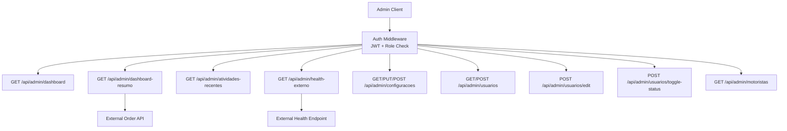
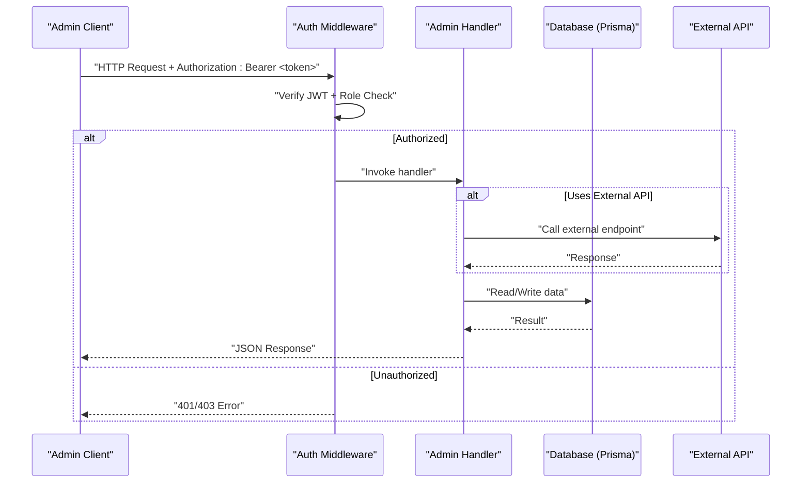
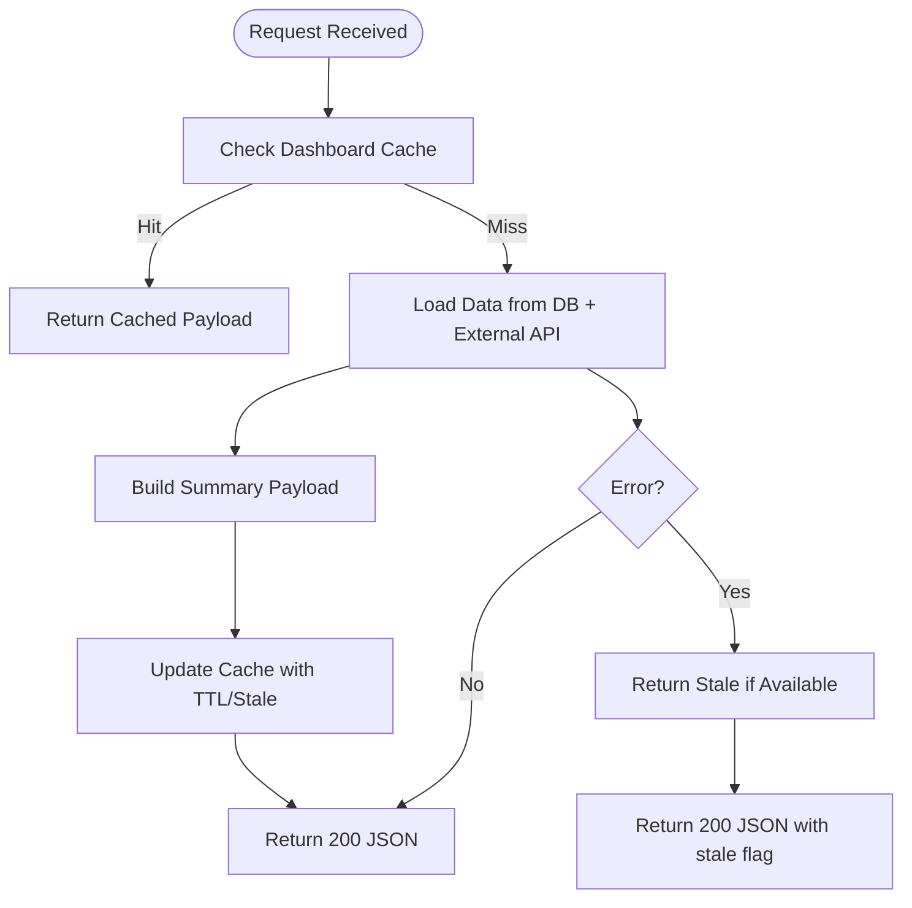
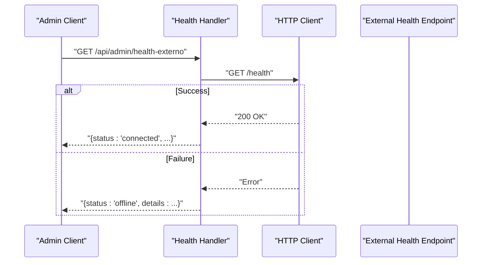
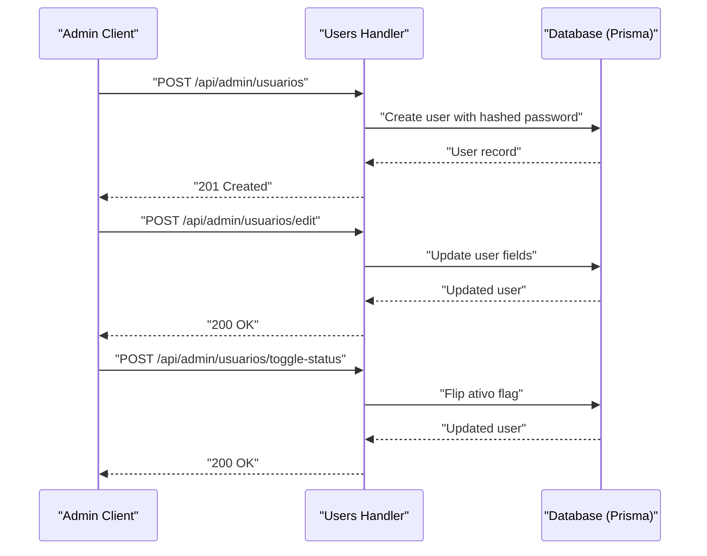
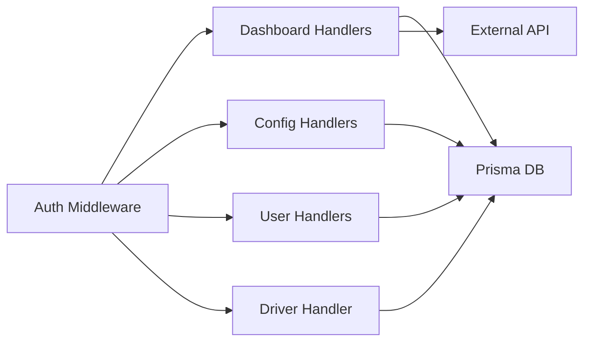

# Administrative API

<cite>
**Referenced Files in This Document**
- [auth.ts](file://middleware/auth.ts)
- [dashboard.ts](file://pages/api/admin/dashboard.ts)
- [dashboard-resumo.ts](file://pages/api/admin/dashboard-resumo.ts)
- [atividades-recentes.ts](file://pages/api/admin/atividades-recentes.ts)
- [health-externo.ts](file://pages/api/admin/health-externo.ts)
- [configuracoes/index.ts](file://pages/api/admin/configuracoes/index.ts)
- [configuracoes/[chave].ts](file://pages/api/admin/configuracoes/[chave].ts)
- [usuarios/index.ts](file://pages/api/admin/usuarios/index.ts)
- [usuarios/edit.ts](file://pages/api/admin/usuarios/edit.ts)
- [usuarios/toggle-status.ts](file://pages/api/admin/usuarios/toggle-status.ts)
- [motoristas/index.ts](file://pages/api/admin/motoristas/index.ts)
</cite>

## Table of Contents
1. [Introduction](#introduction)
2. [Project Structure](#project-structure)
3. [Core Components](#core-components)
4. [Architecture Overview](#architecture-overview)
5. [Detailed Component Analysis](#detailed-component-analysis)
6. [Dependency Analysis](#dependency-analysis)
7. [Performance Considerations](#performance-considerations)
8. [Troubleshooting Guide](#troubleshooting-guide)
9. [Conclusion](#conclusion)

## Introduction
This document provides comprehensive API documentation for administrative endpoints that support system monitoring, recent activity tracking, health checks, configuration management, driver administration, and user management. It specifies HTTP methods, authentication requirements, admin-only access controls, request/response schemas, and operational workflows with examples for system monitoring, user administration, and configuration management.

## Project Structure
Administrative endpoints are implemented as Next.js API routes under pages/api/admin. Authentication and authorization are enforced via middleware that validates JWT tokens and restricts access to administrators. Data is read from and written to the database through Prisma. Some endpoints integrate with an external API for order data and health status.

**Diagram sources**
- [auth.ts:16-87](file://middleware/auth.ts#L16-L87)
- [dashboard.ts:4-46](file://pages/api/admin/dashboard.ts#L4-L46)
- [dashboard-resumo.ts:197-270](file://pages/api/admin/dashboard-resumo.ts#L197-L270)
- [atividades-recentes.ts:4-55](file://pages/api/admin/atividades-recentes.ts#L4-L55)
- [health-externo.ts:4-42](file://pages/api/admin/health-externo.ts#L4-L42)
- [configuracoes/index.ts:4-76](file://pages/api/admin/configuracoes/index.ts#L4-L76)
- [usuarios/index.ts:5-76](file://pages/api/admin/usuarios/index.ts#L5-L76)
- [usuarios/edit.ts:5-45](file://pages/api/admin/usuarios/edit.ts#L5-L45)
- [usuarios/toggle-status.ts:4-35](file://pages/api/admin/usuarios/toggle-status.ts#L4-L35)
- [motoristas/index.ts:4-22](file://pages/api/admin/motoristas/index.ts#L4-L22)

**Section sources**
- [auth.ts:16-87](file://middleware/auth.ts#L16-L87)
- [dashboard.ts:4-46](file://pages/api/admin/dashboard.ts#L4-L46)
- [dashboard-resumo.ts:197-270](file://pages/api/admin/dashboard-resumo.ts#L197-L270)
- [atividades-recentes.ts:4-55](file://pages/api/admin/atividades-recentes.ts#L4-L55)
- [health-externo.ts:4-42](file://pages/api/admin/health-externo.ts#L4-L42)
- [configuracoes/index.ts:4-76](file://pages/api/admin/configuracoes/index.ts#L4-L76)
- [usuarios/index.ts:5-76](file://pages/api/admin/usuarios/index.ts#L5-L76)
- [usuarios/edit.ts:5-45](file://pages/api/admin/usuarios/edit.ts#L5-L45)
- [usuarios/toggle-status.ts:4-35](file://pages/api/admin/usuarios/toggle-status.ts#L4-L35)
- [motoristas/index.ts:4-22](file://pages/api/admin/motoristas/index.ts#L4-L22)

## Core Components
- Authentication and Authorization: JWT-based authentication with role enforcement (ADMIN required for admin endpoints).
- Database Access: Prisma client used across endpoints for reading and writing data.
- External Integrations: Optional integration with an external API for orders and health checks.
- Caching: In-memory caching for dashboard summary and order data to reduce external calls.

Key responsibilities:
- Validate requests and enforce admin-only access.
- Provide aggregated metrics for dashboards.
- Expose recent activities across entities.
- Manage system configuration values.
- Administer users and drivers.

**Section sources**
- [auth.ts:16-87](file://middleware/auth.ts#L16-L87)
- [dashboard-resumo.ts:24-43](file://pages/api/admin/dashboard-resumo.ts#L24-L43)
- [health-externo.ts:9-20](file://pages/api/admin/health-externo.ts#L9-L20)

## Architecture Overview
The administrative API follows a layered approach:
- Client sends authenticated requests with Bearer token.
- Middleware verifies JWT and ensures the user has ADMIN role.
- Handlers perform business logic using Prisma and optional external services.
- Responses include standardized success or error payloads.

**Diagram sources**
- [auth.ts:16-87](file://middleware/auth.ts#L16-L87)
- [dashboard-resumo.ts:108-166](file://pages/api/admin/dashboard-resumo.ts#L108-L166)
- [health-externo.ts:22-40](file://pages/api/admin/health-externo.ts#L22-L40)

## Detailed Component Analysis

### Authentication and Authorization
- Mechanism: JWT verification with secret from environment; extracts userId and loads user details from database.
- Roles: Enforces allowed roles per endpoint; admin endpoints require ADMIN role.
- Errors: Returns 401 for missing/invalid tokens or inactive users; returns 403 when roles do not match.

Usage pattern:
- Wrap handlers with requireAdmin to ensure only administrators can execute sensitive operations.

**Section sources**
- [auth.ts:16-87](file://middleware/auth.ts#L16-L87)

### System Dashboard
- Endpoint: GET /api/admin/dashboard
- Purpose: Aggregates key metrics such as completed controls, pending controls, total users, total drivers, processed invoices, and generated labels.
- Access Control: Requires authentication and ADMIN role.
- Response Schema:
  - controlesFinalizados: number
  - controlesPendentes: number
  - totalUsuarios: number
  - totalMotoristas: number
  - notasProcessadas: number
  - etiquetasGeradas: number
- Example: Retrieve current dashboard metrics for operational overview.

**Section sources**
- [dashboard.ts:4-46](file://pages/api/admin/dashboard.ts#L4-L46)

### Dashboard Summary (Optimized)
- Endpoint: GET /api/admin/dashboard-resumo
- Purpose: Provides a summarized view including total users, active users, total controls, pending controls, today’s and month’s orders, and recent users. Includes cached responses and stale indicators.
- Access Control: Requires authentication and ADMIN role.
- Caching:
  - In-memory cache for dashboard payload with TTL and staleness windows.
  - Separate cache for external order data with refresh coalescing.
- Response Schema:
  - totalUsuarios: number
  - usuariosAtivos: number
  - totalControles: number
  - controlesPendentes: number
  - pedidosHoje: number
  - pedidosMes: number
  - ultimosUsuarios: array of { id, nome, email, ultimoAcesso }
  - cached?: boolean
  - stale?: boolean
  - warning?: string
- Example: Fetch dashboard summary with cache headers and optional stale fallback.

**Diagram sources**
- [dashboard-resumo.ts:24-43](file://pages/api/admin/dashboard-resumo.ts#L24-L43)
- [dashboard-resumo.ts:108-166](file://pages/api/admin/dashboard-resumo.ts#L108-L166)
- [dashboard-resumo.ts:197-270](file://pages/api/admin/dashboard-resumo.ts#L197-L270)

**Section sources**
- [dashboard-resumo.ts:197-270](file://pages/api/admin/dashboard-resumo.ts#L197-L270)

### Recent Activities
- Endpoint: GET /api/admin/atividades-recentes
- Purpose: Lists recent activities combining updates to controls and additions of invoices, sorted by time.
- Access Control: Requires authentication and ADMIN role.
- Response Schema: Array of activity objects with fields like id, user, action, time, type.
- Example: Display a feed of recent administrative actions.

**Section sources**
- [atividades-recentes.ts:4-55](file://pages/api/admin/atividades-recentes.ts#L4-L55)

### Health Check (External API)
- Endpoint: GET /api/admin/health-externo
- Purpose: Checks connectivity and status of the external API and its database connection.
- Access Control: Requires authentication and ADMIN role.
- Response Schema:
  - status: string ("connected", "online_no_credentials", "offline", "error_status")
  - api_online: boolean
  - credentials_configured: boolean
  - database_connected: boolean
  - timestamp: string (ISO)
  - details: string
- Example: Monitor external service availability and diagnose issues.

**Diagram sources**
- [health-externo.ts:22-40](file://pages/api/admin/health-externo.ts#L22-L40)

**Section sources**
- [health-externo.ts:4-42](file://pages/api/admin/health-externo.ts#L4-L42)

### Configuration Management
- Endpoints:
  - GET /api/admin/configuracoes
  - PUT /api/admin/configuracoes
  - POST /api/admin/configuracoes
  - GET/PUT /api/admin/configuracoes/[chave]
- Purpose: Read, update, and create system configuration values. Bulk updates supported via transactional writes.
- Access Control: Requires authentication and ADMIN role.
- Request/Response Schemas:
  - GET: Returns array of editable configurations with fields like id, chave, valor, descricao, tipo, opcoes, editavel.
  - PUT: Accepts array of configuration objects with id and valor; responds with success message.
  - POST: Creates or upserts a single configuration by chave; accepts chave and valor.
  - [chave]: Allows targeted retrieval/update by configuration key.
- Example: Bulk update multiple settings atomically; create a new setting if it does not exist.

**Section sources**
- [configuracoes/index.ts:4-76](file://pages/api/admin/configuracoes/index.ts#L4-L76)
- [configuracoes/[chave].ts](file://pages/api/admin/configuracoes/[chave].ts)

### Driver Administration
- Endpoint: GET /api/admin/motoristas
- Purpose: Retrieves all drivers ordered by name.
- Access Control: Requires authentication and ADMIN role.
- Response Schema: Array of driver records.
- Example: List drivers for assignment or review.

**Section sources**
- [motoristas/index.ts:4-22](file://pages/api/admin/motoristas/index.ts#L4-L22)

### User Management
- Endpoints:
  - GET /api/admin/usuarios
  - POST /api/admin/usuarios
  - POST /api/admin/usuarios/edit
  - POST /api/admin/usuarios/toggle-status
- Purpose: Administer users including listing, creation, editing, and toggling account status.
- Access Control: Requires authentication and ADMIN role.
- Request/Response Schemas:
  - GET: Returns list of users with fields like id, nome, email, tipo, ativo, dataCriacao, ultimoAcesso, foto.
  - POST (create): Accepts nome, email, senha, tipo, ativo; hashes password before storing; returns created user.
  - POST (edit): Accepts id and optional nome, tipo, senha, ativo; updates record and returns updated user.
  - POST (toggle-status): Accepts id and ativo; flips account status and returns updated user.
- Example: Create a new user, update their role and password, then deactivate the account.

**Diagram sources**
- [usuarios/index.ts:5-76](file://pages/api/admin/usuarios/index.ts#L5-L76)
- [usuarios/edit.ts:5-45](file://pages/api/admin/usuarios/edit.ts#L5-L45)
- [usuarios/toggle-status.ts:4-35](file://pages/api/admin/usuarios/toggle-status.ts#L4-L35)

**Section sources**
- [usuarios/index.ts:5-76](file://pages/api/admin/usuarios/index.ts#L5-L76)
- [usuarios/edit.ts:5-45](file://pages/api/admin/usuarios/edit.ts#L5-L45)
- [usuarios/toggle-status.ts:4-35](file://pages/api/admin/usuarios/toggle-status.ts#L4-L35)

## Dependency Analysis
- Authentication dependency: All admin endpoints rely on JWT validation and role checks provided by the auth middleware.
- Data dependencies: Endpoints depend on Prisma models for users, controls, invoices, drivers, and system configurations.
- External dependencies: Dashboard summary and health check optionally call external APIs for order data and health status.

**Diagram sources**
- [auth.ts:16-87](file://middleware/auth.ts#L16-L87)
- [dashboard-resumo.ts:108-166](file://pages/api/admin/dashboard-resumo.ts#L108-L166)
- [configuracoes/index.ts:4-76](file://pages/api/admin/configuracoes/index.ts#L4-L76)
- [usuarios/index.ts:5-76](file://pages/api/admin/usuarios/index.ts#L5-L76)
- [motoristas/index.ts:4-22](file://pages/api/admin/motoristas/index.ts#L4-L22)

**Section sources**
- [auth.ts:16-87](file://middleware/auth.ts#L16-L87)
- [dashboard-resumo.ts:108-166](file://pages/api/admin/dashboard-resumo.ts#L108-L166)
- [configuracoes/index.ts:4-76](file://pages/api/admin/configuracoes/index.ts#L4-L76)
- [usuarios/index.ts:5-76](file://pages/api/admin/usuarios/index.ts#L5-L76)
- [motoristas/index.ts:4-22](file://pages/api/admin/motoristas/index.ts#L4-L22)

## Performance Considerations
- Caching: Dashboard summary uses in-memory caching with TTL and staleness to minimize external API calls and database load.
- Batch Updates: Configuration updates use transactions to ensure atomicity and reduce round trips.
- Pagination: External order data retrieval uses pagination to handle large datasets efficiently.
- Selective Fields: Queries select only necessary fields to reduce payload size.

[No sources needed since this section provides general guidance]

## Troubleshooting Guide
Common issues and resolutions:
- 401 Unauthorized: Missing or invalid JWT token; verify Authorization header format and token validity.
- 403 Forbidden: Insufficient role; ensure the user has ADMIN role for admin endpoints.
- 500 Internal Server Error: Database or external API errors; check logs and connectivity.
- Stale Data: When external API is slow, dashboard may return stale cached data with a warning; retry later or clear cache.

Operational tips:
- Verify environment variables for external API credentials and JWT secret.
- Use health check endpoint to diagnose external service connectivity.
- Review recent activities to identify failed operations or anomalies.

**Section sources**
- [auth.ts:23-79](file://middleware/auth.ts#L23-L79)
- [dashboard-resumo.ts:258-270](file://pages/api/admin/dashboard-resumo.ts#L258-L270)
- [health-externo.ts:22-40](file://pages/api/admin/health-externo.ts#L22-L40)

## Conclusion
The administrative API provides secure, role-gated endpoints for monitoring system health, viewing recent activities, managing configurations, administering users and drivers, and obtaining optimized dashboard summaries with caching. Authentication is enforced via JWT and role checks, while data operations leverage Prisma and optional external integrations. Follow the documented schemas and workflows to implement robust administrative features.