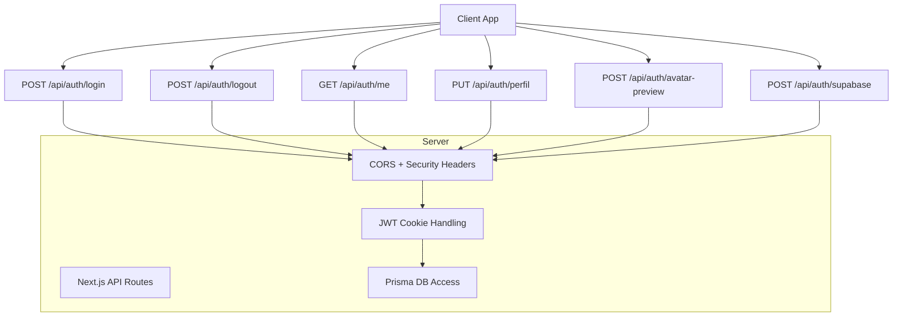
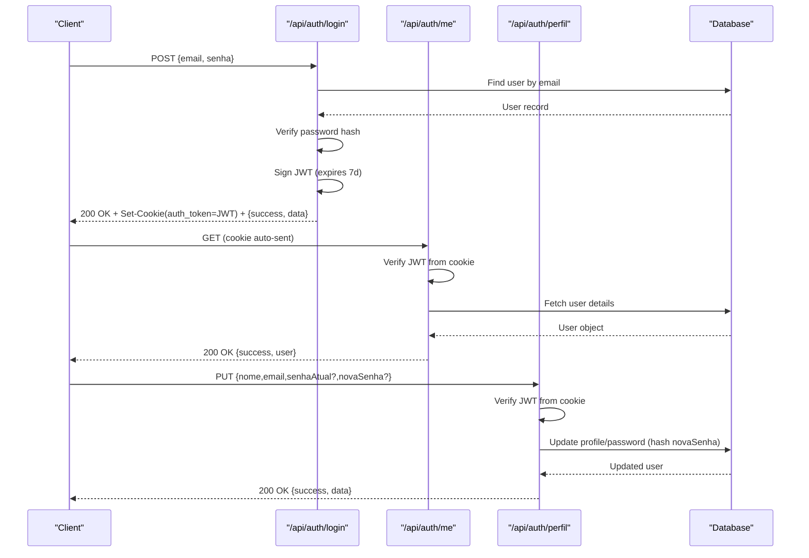
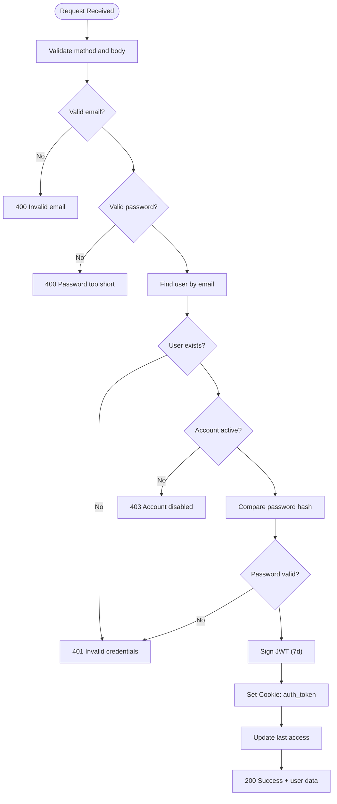
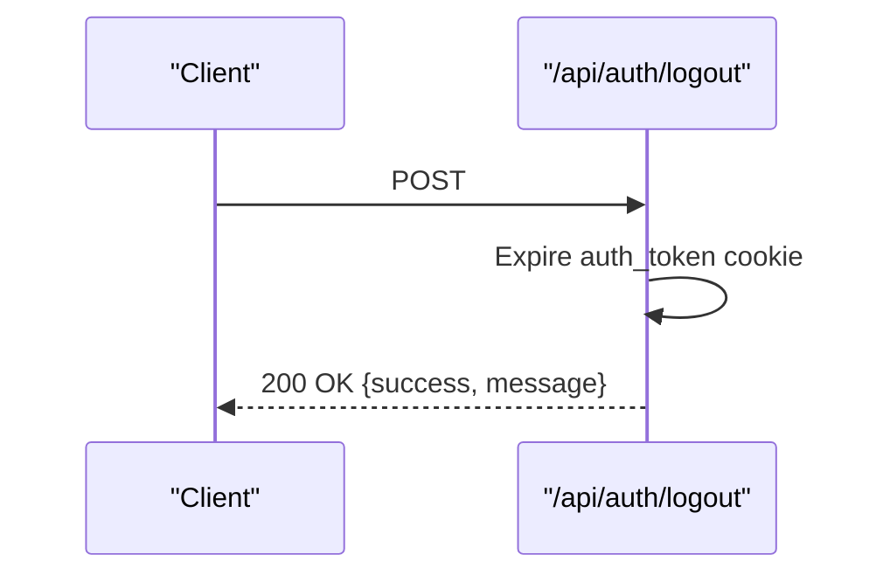
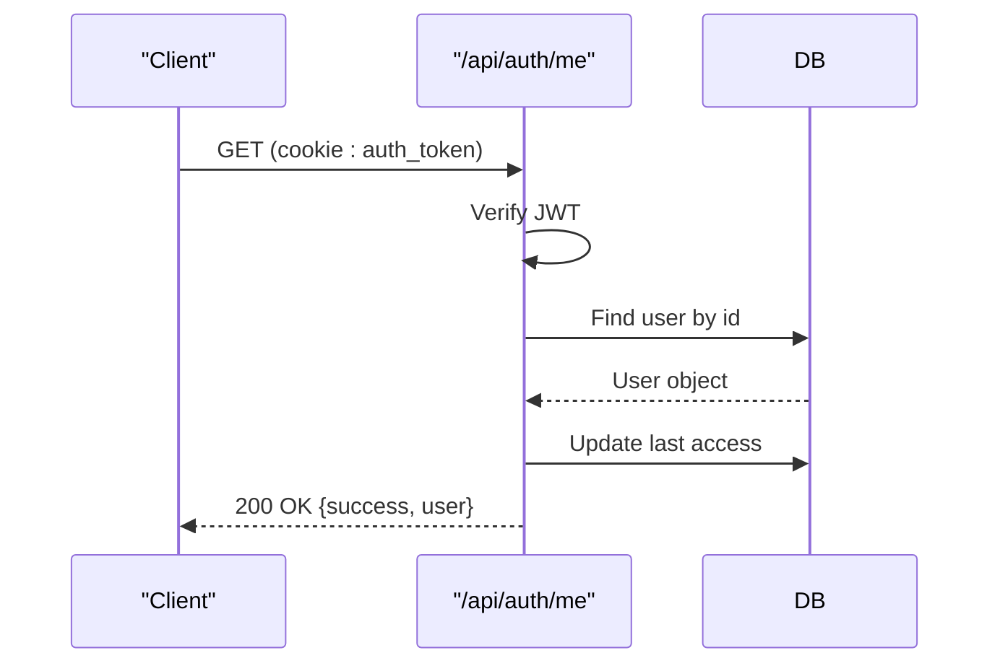
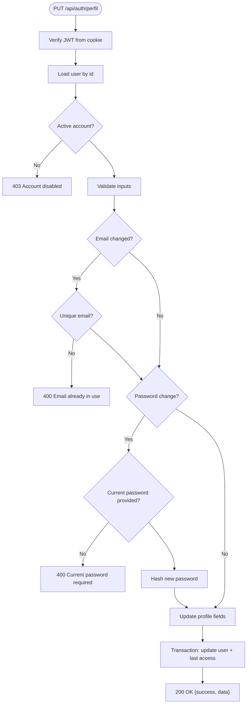
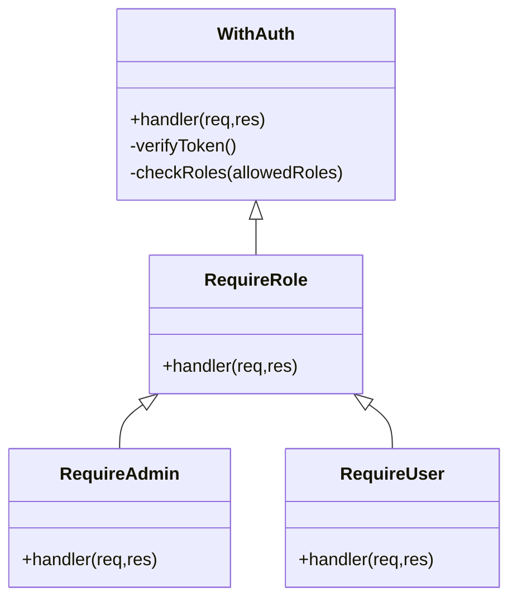
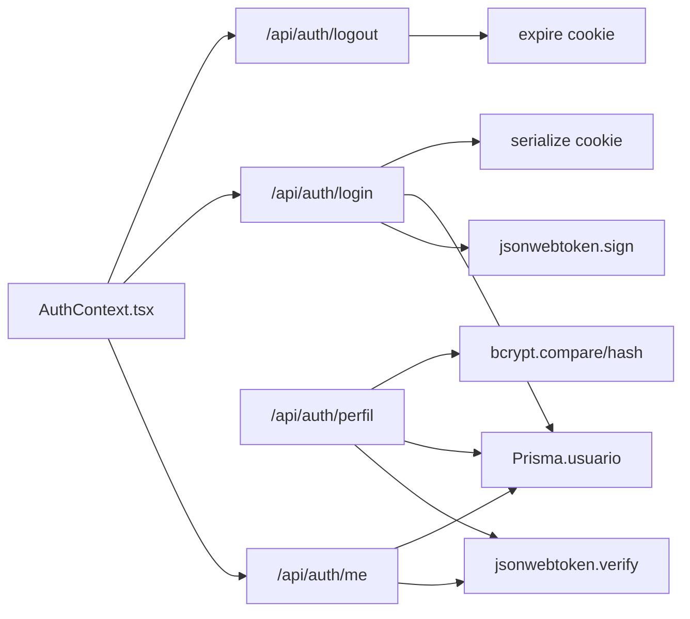

# Authentication API

<cite>
**Referenced Files in This Document**
- [login.ts](file://pages/api/auth/login.ts)
- [logout.ts](file://pages/api/auth/logout.ts)
- [me.ts](file://pages/api/auth/me.ts)
- [perfil.ts](file://pages/api/auth/perfil.ts)
- [avatar-preview.ts](file://pages/api/auth/avatar-preview.ts)
- [supabase.ts](file://pages/api/auth/supabase.ts)
- [auth.ts](file://middleware/auth.ts)
- [auth.ts](file://lib/auth.ts)
- [server-auth.ts](file://lib/server-auth.ts)
- [auth-types.ts](file://types/auth-types.ts)
- [AuthContext.tsx](file://contexts/AuthContext.tsx)
- [schema.prisma](file://prisma/schema.prisma)
</cite>

## Table of Contents
1. Introduction
2. Project Structure
3. Core Components
4. Architecture Overview
5. Detailed Component Analysis
6. Dependency Analysis
7. Performance Considerations
8. Troubleshooting Guide
9. Conclusion

## Introduction
This document provides comprehensive API documentation for authentication endpoints in the Control Carga system. It covers login, logout, current user retrieval, profile updates, avatar preview, and an optional Supabase-based login flow. For each endpoint, you will find HTTP methods, URL patterns, request/response schemas, JWT cookie handling, role-based access control, session management, security considerations, practical examples, error responses, and integration patterns.

## Project Structure
Authentication is implemented as Next.js API routes under pages/api/auth with supporting middleware and utilities:
- API routes: login, logout, me, perfil (profile), avatar-preview, supabase
- Middleware and utilities: withAuth, token extraction, server-side auth helpers
- Client context: AuthContext manages state, cookies, and redirects
- Data model: Usuario schema defines user fields used by authentication flows

**Diagram sources**
- [login.ts:1-461](file://pages/api/auth/login.ts#L1-L461)
- [logout.ts:1-149](file://pages/api/auth/logout.ts#L1-L149)
- [me.ts:1-205](file://pages/api/auth/me.ts#L1-L205)
- [perfil.ts:1-238](file://pages/api/auth/perfil.ts#L1-L238)
- [avatar-preview.ts:1-43](file://pages/api/auth/avatar-preview.ts#L1-L43)
- [supabase.ts:1-34](file://pages/api/auth/supabase.ts#L1-L34)

**Section sources**
- [login.ts:1-461](file://pages/api/auth/login.ts#L1-L461)
- [logout.ts:1-149](file://pages/api/auth/logout.ts#L1-L149)
- [me.ts:1-205](file://pages/api/auth/me.ts#L1-L205)
- [perfil.ts:1-238](file://pages/api/auth/perfil.ts#L1-L238)
- [avatar-preview.ts:1-43](file://pages/api/auth/avatar-preview.ts#L1-L43)
- [supabase.ts:1-34](file://pages/api/auth/supabase.ts#L1-L34)

## Core Components
- Login: Validates credentials, issues a secure HTTP-only cookie containing a JWT, returns user data.
- Logout: Expires the authentication cookie and sets security headers.
- Me: Reads the HTTP-only cookie, verifies JWT, returns current user info, updates last access time.
- Perfil: Updates user profile and optionally password with validation and hashing; requires valid session.
- Avatar Preview: Returns avatar URL and name for a given email without revealing existence precisely.
- Supabase Login: Optional alternative flow using Supabase auth.

Key security features:
- HTTP-only, SameSite=Lax, Secure in production cookies
- CORS allow-list per origin
- Input validation and sanitization
- Password hashing and complexity checks
- Role-based middleware for protected endpoints elsewhere in the app

**Section sources**
- [login.ts:1-461](file://pages/api/auth/login.ts#L1-L461)
- [logout.ts:1-149](file://pages/api/auth/logout.ts#L1-L149)
- [me.ts:1-205](file://pages/api/auth/me.ts#L1-L205)
- [perfil.ts:1-238](file://pages/api/auth/perfil.ts#L1-L238)
- [avatar-preview.ts:1-43](file://pages/api/auth/avatar-preview.ts#L1-L43)
- [auth.ts:1-121](file://lib/auth.ts#L1-L121)
- [server-auth.ts:1-41](file://lib/server-auth.ts#L1-L41)
- [auth-types.ts:1-56](file://types/auth-types.ts#L1-L56)

## Architecture Overview
The authentication architecture uses JWTs stored in HTTP-only cookies to maintain sessions across requests. The client authenticates via login, receives a Set-Cookie header, and subsequent requests automatically include the cookie. Protected routes validate the token and enforce roles when needed.

**Diagram sources**
- [login.ts:112-424](file://pages/api/auth/login.ts#L112-L424)
- [me.ts:98-192](file://pages/api/auth/me.ts#L98-L192)
- [perfil.ts:38-238](file://pages/api/auth/perfil.ts#L38-L238)

## Detailed Component Analysis

### Endpoint: POST /api/auth/login
- Purpose: Authenticate user by email and password, issue session cookie.
- Request body:
  - email: string (validated format and domain)
  - senha: string (min length enforced)
- Response on success:
  - status: 200
  - body: { success: true, message: "...", data: { id, nome, email, tipo, ativo, dataCriacao, ultimoAcesso } }
  - Set-Cookie: auth_token=JWT; HttpOnly; SameSite=Lax; Secure (in production); Max-Age=7 days; Path=/
- Error responses:
  - 400: Missing fields, invalid email format/domain, password too short
  - 401: Invalid credentials
  - 403: Account disabled
  - 500: Internal server errors (with optional dev-only details)
- Security:
  - CORS allow-list per origin
  - Strict input validation
  - Password comparison with bcrypt
  - HTTP-only cookie prevents XSS exposure
  - Last access timestamp updated on successful login

**Diagram sources**
- [login.ts:112-424](file://pages/api/auth/login.ts#L112-L424)

**Section sources**
- [login.ts:1-461](file://pages/api/auth/login.ts#L1-L461)

### Endpoint: POST /api/auth/logout
- Purpose: Invalidate session by expiring the authentication cookie.
- Request: None required.
- Response on success:
  - status: 200
  - body: { success: true, message: "Logout successful" }
  - Set-Cookie: auth_token=; expires=Thu, 01 Jan 1970 00:00:00 GMT; HttpOnly; SameSite=Lax; Secure (production); Path=/
- Security headers: Cache-Control, Pragma, Expires, X-Content-Type-Options, X-Frame-Options, X-XSS-Protection, HSTS (production)

**Diagram sources**
- [logout.ts:75-136](file://pages/api/auth/logout.ts#L75-L136)

**Section sources**
- [logout.ts:1-149](file://pages/api/auth/logout.ts#L1-L149)

### Endpoint: GET /api/auth/me
- Purpose: Retrieve current authenticated user information.
- Authentication: Requires valid auth_token cookie.
- Response on success:
  - status: 200
  - body: { success: true, user: { id, nome, email, tipo, ativo, dataCriacao, ultimoAcesso, foto } }
- Error responses:
  - 401: Not authenticated or invalid/expired session
  - 404: User not found
  - 500: Internal server error
- Behavior: Updates last access timestamp on successful retrieval.

**Diagram sources**
- [me.ts:98-192](file://pages/api/auth/me.ts#L98-L192)

**Section sources**
- [me.ts:1-205](file://pages/api/auth/me.ts#L1-L205)

### Endpoint: PUT /api/auth/perfil
- Purpose: Update user profile and optionally change password.
- Authentication: Requires valid auth_token cookie.
- Request body:
  - nome: string (optional)
  - email: string (optional; must be unique if changed)
  - senhaAtual: string (required if changing password)
  - novaSenha: string (optional; min length and complexity enforced)
- Validation:
  - Email uniqueness check against other users
  - Password change requires current password
  - New password must meet complexity rules (uppercase, lowercase, number, special character)
- Response on success:
  - status: 200
  - body: { success: true, data: updated user object }
- Error responses:
  - 400: Validation errors (missing current password, weak new password, email already in use)
  - 401: Not authenticated or invalid session
  - 403: Account disabled
  - 404: User not found
  - 500: Internal server error

**Diagram sources**
- [perfil.ts:38-238](file://pages/api/auth/perfil.ts#L38-L238)

**Section sources**
- [perfil.ts:1-238](file://pages/api/auth/perfil.ts#L1-L238)

### Endpoint: POST /api/auth/avatar-preview
- Purpose: Return avatar URL and user name for a given email without revealing precise existence.
- Request body:
  - email: string
- Response:
  - status: 200 always (to avoid enumeration)
  - body: { fotoUrl: string|null, nome: string|null }
- Notes:
  - Basic CORS enabled
  - Safe fallback returns null values on errors

**Section sources**
- [avatar-preview.ts:1-43](file://pages/api/auth/avatar-preview.ts#L1-L43)

### Endpoint: POST /api/auth/supabase
- Purpose: Alternative login using Supabase authentication.
- Request body:
  - email: string
  - senha: string
- Response on success:
  - status: 200
  - body: { user, session, error: null }
- Error response:
  - status: 401
  - body: { user: null, session: null, error: "..." }

**Section sources**
- [supabase.ts:1-34](file://pages/api/auth/supabase.ts#L1-L34)

### Role-Based Access Control (RBAC)
- Middleware: withAuth validates JWT from Authorization header (Bearer scheme) and attaches user to request.
- Roles:
  - Allowed roles configurable per route (default includes ADMIN, USUARIO)
  - Helpers: requireRole(role), requireAdmin(handler), requireUser(handler)
- Usage pattern: Wrap protected handlers with withAuth or requireAdmin/requireUser to enforce roles.

**Diagram sources**
- [auth.ts:16-90](file://middleware/auth.ts#L16-L90)

**Section sources**
- [auth.ts:1-91](file://middleware/auth.ts#L1-L91)

### Session Management and JWT Handling
- Cookie name: auth_token
- JWT payload includes user identity and role (id, email, tipo, nome)
- Expiration: 7 days for login cookie; client also tracks token validity and refreshes via /api/auth/me
- Security:
  - HttpOnly, SameSite=Lax, Secure in production
  - CORS configured per allowed origins
  - Strict input validation and error handling
- Utilities:
  - getTokenFromCookies: robust extraction from multiple cookie names and manual parsing
  - verifyToken: dynamic import and detailed error logging
  - getAuthenticatedUser: server-side helper to resolve user from cookie or Authorization header

**Section sources**
- [login.ts:317-424](file://pages/api/auth/login.ts#L317-L424)
- [logout.ts:83-136](file://pages/api/auth/logout.ts#L83-L136)
- [me.ts:127-192](file://pages/api/auth/me.ts#L127-L192)
- [auth.ts:10-121](file://lib/auth.ts#L10-L121)
- [server-auth.ts:11-41](file://lib/server-auth.ts#L11-L41)

### Database Model for Users
- Fields relevant to authentication:
  - id, nome, email (unique), senha (hashed), tipo (role enum), ativo (boolean), dataCriacao, ultimoAcesso, foto
- Enums:
  - TipoUsuario includes ADMIN, GERENTE, USUARIO, FUNCIONARIO, CLIENTE, SEPARADOR, CONFERENTE, AUDITOR

**Section sources**
- [schema.prisma:69-96](file://prisma/schema.prisma#L69-L96)
- [schema.prisma:323-332](file://prisma/schema.prisma#L323-L332)

## Dependency Analysis
- API routes depend on:
  - JSON Web Token library for signing/verifying tokens
  - Cookie serialization for setting/expiring cookies
  - Prisma client for database operations
  - bcryptjs for password hashing/comparison
  - CORS configuration per route
- Shared utilities:
  - lib/auth.ts: token extraction and verification helpers
  - lib/server-auth.ts: server-side authenticated user resolution
  - middleware/auth.ts: role-based protection middleware
- Client integration:
  - contexts/AuthContext.tsx: orchestrates login, logout, token validation, and redirects based on user type

**Diagram sources**
- [login.ts:1-461](file://pages/api/auth/login.ts#L1-L461)
- [me.ts:1-205](file://pages/api/auth/me.ts#L1-L205)
- [perfil.ts:1-238](file://pages/api/auth/perfil.ts#L1-L238)
- [logout.ts:1-149](file://pages/api/auth/logout.ts#L1-L149)
- [AuthContext.tsx:228-380](file://contexts/AuthContext.tsx#L228-L380)

**Section sources**
- [AuthContext.tsx:1-508](file://contexts/AuthContext.tsx#L1-L508)

## Performance Considerations
- Minimize database queries:
  - Use selective field projection in Prisma queries (e.g., only necessary fields)
  - Avoid unnecessary updates; last access updates are lightweight but should be considered at scale
- Token lifecycle:
  - 7-day cookie reduces frequent re-authentication
  - Periodic validation via /api/auth/me ensures session freshness
- CORS and preflight:
  - Efficient preflight handling avoids repeated OPTIONS overhead
- Logging:
  - Extensive logs aid debugging but may impact performance; consider environment-aware verbosity

[No sources needed since this section provides general guidance]

## Troubleshooting Guide
Common issues and resolutions:
- 401 Unauthorized:
  - Missing or invalid auth_token cookie; ensure login succeeded and cookies are accepted
  - Expired JWT; call /api/auth/me to refresh session state or re-login
- 403 Forbidden:
  - Account disabled; contact administrator
  - Insufficient roles for protected endpoints; use requireAdmin/requireUser appropriately
- 400 Bad Request:
  - Invalid email format or domain; correct input
  - Password too short or missing current password for changes; adjust accordingly
- 500 Internal Server Error:
  - Database connectivity or unexpected exceptions; check server logs and environment variables (e.g., JWT_SECRET, DATABASE_URL)

Integration tips:
- Ensure CORS allows your frontend origin; configure ALLOWED_ORIGINS accordingly
- In production, ensure HTTPS so Secure cookies are set correctly
- Handle 401 responses by redirecting to login and clearing local state

**Section sources**
- [login.ts:112-448](file://pages/api/auth/login.ts#L112-L448)
- [me.ts:98-192](file://pages/api/auth/me.ts#L98-L192)
- [perfil.ts:38-238](file://pages/api/auth/perfil.ts#L38-L238)
- [logout.ts:75-136](file://pages/api/auth/logout.ts#L75-L136)

## Conclusion
The Control Carga authentication system provides a robust, secure, and flexible approach to managing user sessions using JWTs in HTTP-only cookies. Endpoints cover the full lifecycle: login, session validation, profile updates, and logout. Role-based middleware enables fine-grained access control for protected resources. By following the documented schemas, security practices, and troubleshooting steps, integrators can reliably implement authentication flows that are safe and maintainable.

[No sources needed since this section summarizes without analyzing specific files]