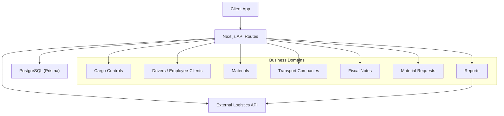
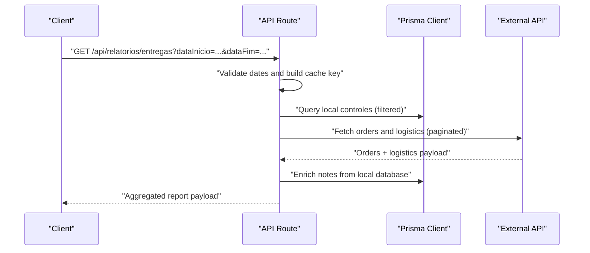
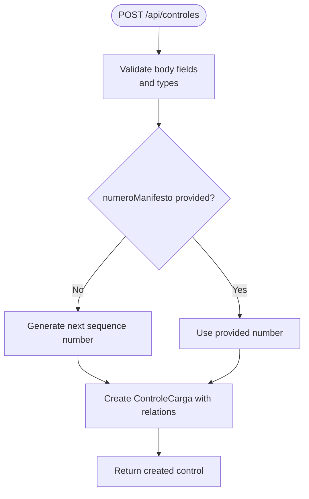
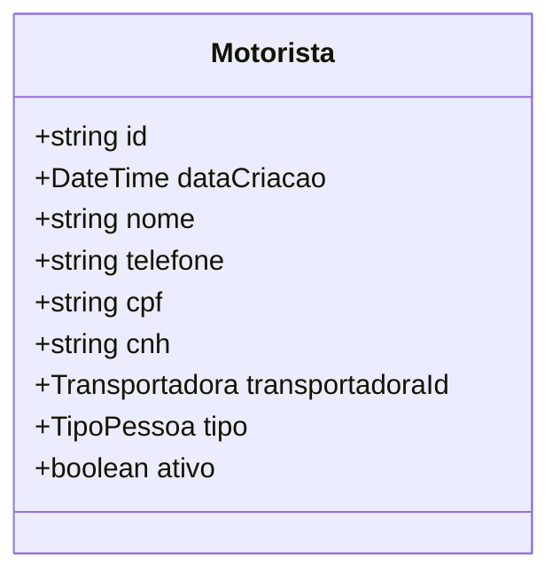
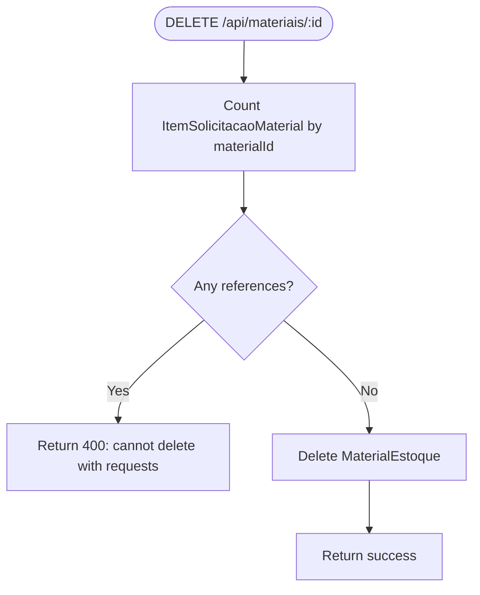
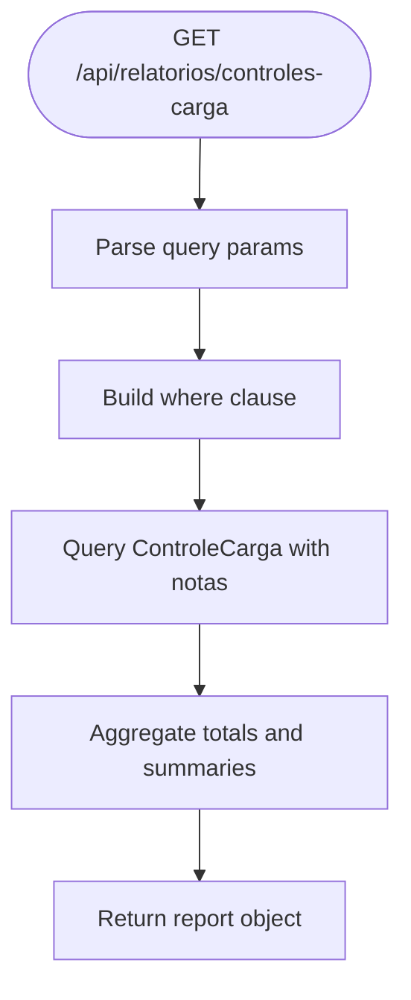
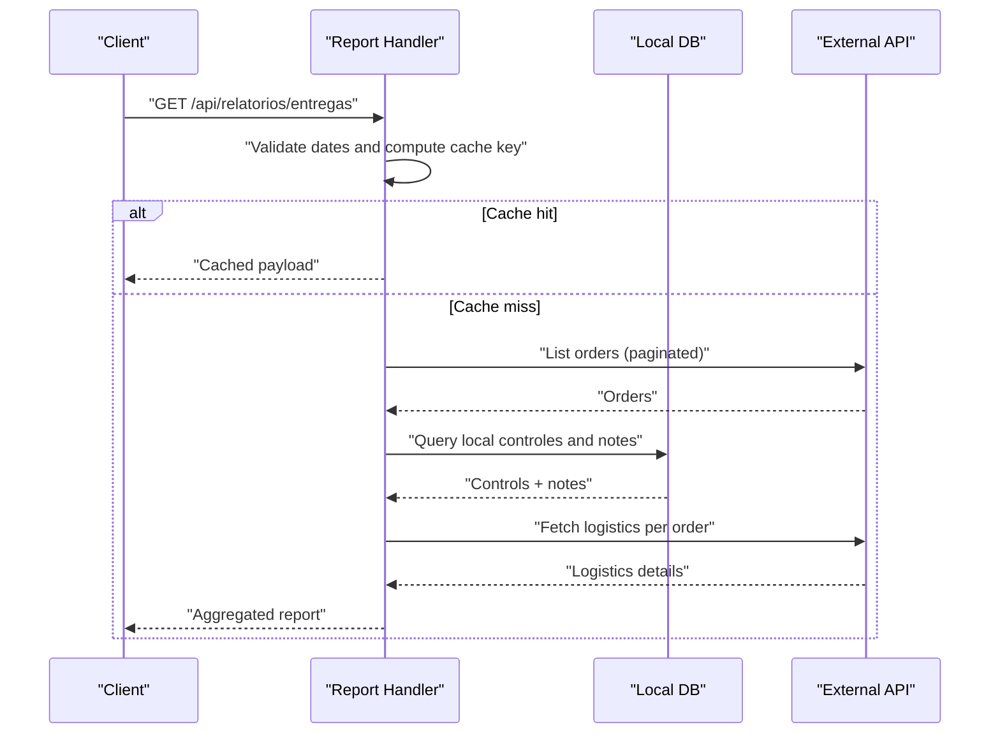
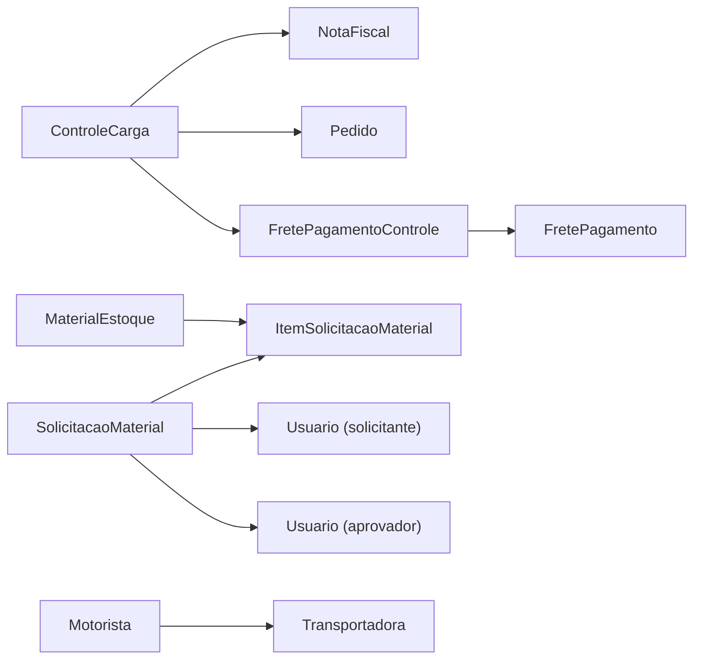

# Business Operations API

<cite>
**Referenced Files in This Document**
- [pages/api/controles/index.ts](file://pages/api/controles/index.ts)
- [pages/api/controles/[id].ts](file://pages/api/controles/[id].ts)
- [pages/api/funcionarios-clientes/index.ts](file://pages/api/funcionarios-clientes/index.ts)
- [pages/api/materiais/index.ts](file://pages/api/materiais/index.ts)
- [pages/api/materiais/[id].ts](file://pages/api/materiais/[id].ts)
- [pages/api/motoristas/index.ts](file://pages/api/motoristas/index.ts)
- [pages/api/motoristas/[id].ts](file://pages/api/motoristas/[id].ts)
- [pages/api/transportadoras/index.ts](file://pages/api/transportadoras/index.ts)
- [pages/api/notas/index.ts](file://pages/api/notas/index.ts)
- [pages/api/solicitacoes-material/index.ts](file://pages/api/solicitacoes-material/index.ts)
- [pages/api/relatorios/controles-carga.ts](file://pages/api/relatorios/controles-carga.ts)
- [pages/api/relatorios/materiais.ts](file://pages/api/relatorios/materiais.ts)
- [pages/api/relatorios/entregas.ts](file://pages/api/relatorios/entregas.ts)
- [prisma/schema.prisma](file://prisma/schema.prisma)
</cite>

## Table of Contents
1. Introduction
2. Project Structure
3. Core Components
4. Architecture Overview
5. Detailed Component Analysis
6. Dependency Analysis
7. Performance Considerations
8. Troubleshooting Guide
9. Conclusion

## Introduction
This document provides detailed API documentation for core business operations: cargo controls, employee-client relationships (drivers), material management, driver administration, transport companies, and reporting services. For each endpoint, it specifies HTTP methods, validation rules, data relationships, and reporting capabilities. It also includes examples of business workflows, data modeling, and report generation patterns grounded in the codebase.

## Project Structure
The application exposes a set of Next.js API routes under pages/api that implement CRUD and reporting endpoints. Data is persisted via Prisma against a PostgreSQL database defined in prisma/schema.prisma. Key areas include:
- Cargo Controls: create, list, update, delete, and link notes to cargo controls
- Drivers and Employee-Clients: manage drivers and classify them as employees or clients
- Materials: inventory items with stock levels and minimum thresholds
- Transport Companies: enumerated carriers used across the system
- Notes: fiscal notes linked to cargo controls
- Material Requests: workflowed requests for materials with approval states
- Reports: aggregated views over cargo controls, materials, and deliveries

**Diagram sources**
- [pages/api/controles/index.ts:1-121](file://pages/api/controles/index.ts#L1-L121)
- [pages/api/relatorios/entregas.ts:109-425](file://pages/api/relatorios/entregas.ts#L109-L425)
- [prisma/schema.prisma:11-67](file://prisma/schema.prisma#L11-L67)

**Section sources**
- [prisma/schema.prisma:11-67](file://prisma/schema.prisma#L11-L67)

## Core Components
- Cargo Controls: Manage outbound shipments, pallets, signatures, freight info, and links to fiscal notes. Supports filtering by date range, carrier, note number, driver, and responsible person.
- Drivers and Employee-Clients: Unified driver registry with type classification (driver, employee, client). Includes search and status filters.
- Materials: Inventory catalog with unit of measure, stock quantity, minimum stock, and value. Supports active/inactive filtering.
- Transport Companies: Enumerated list of carriers with human-readable labels.
- Fiscal Notes: Queryable records with optional linkage to cargo controls and user context.
- Material Requests: Create and retrieve requests with items, approver, and requester details; supports filtering by owner and status.
- Reports: Aggregated analytics for cargo controls, materials, and deliveries, including summaries, timelines, and external logistics integration.

**Section sources**
- [pages/api/controles/index.ts:1-121](file://pages/api/controles/index.ts#L1-L121)
- [pages/api/funcionarios-clientes/index.ts:1-103](file://pages/api/funcionarios-clientes/index.ts#L1-L103)
- [pages/api/materiais/index.ts:1-59](file://pages/api/materiais/index.ts#L1-L59)
- [pages/api/transportadoras/index.ts:1-29](file://pages/api/transportadoras/index.ts#L1-L29)
- [pages/api/notas/index.ts:1-87](file://pages/api/notas/index.ts#L1-L87)
- [pages/api/solicitacoes-material/index.ts:1-127](file://pages/api/solicitacoes-material/index.ts#L1-L127)
- [pages/api/relatorios/controles-carga.ts:1-203](file://pages/api/relatorios/controles-carga.ts#L1-L203)
- [pages/api/relatorios/materiais.ts:1-123](file://pages/api/relatorios/materiais.ts#L1-L123)
- [pages/api/relatorios/entregas.ts:109-425](file://pages/api/relatorios/entregas.ts#L109-L425)

## Architecture Overview
The API layer uses Next.js route handlers to process HTTP requests, validate inputs, enforce business rules, and interact with Prisma for persistence. Reports may integrate with an external logistics service for enriched delivery data and use caching strategies to optimize performance.

**Diagram sources**
- [pages/api/relatorios/entregas.ts:109-425](file://pages/api/relatorios/entregas.ts#L109-L425)
- [pages/api/relatorios/controles-carga.ts:1-203](file://pages/api/relatorios/controles-carga.ts#L1-L203)

## Detailed Component Analysis

### Cargo Controls API
Endpoints:
- GET /api/controles
  - Purpose: List cargo controls with optional filters.
  - Query parameters: start, end, transportadora, notaFiscal, motorista, responsavel, limit.
  - Validation: Date range parsing; case-insensitive substring matching for note numbers, driver, and responsible; enum validation for transportadora when provided.
  - Response: Array of cargo controls including related notas.
- POST /api/controles
  - Purpose: Create a new cargo control.
  - Body fields: motorista, responsavel, transportadora, numeroManifesto (optional; auto-increment if missing), qtdPallets, observacao, cpfMotorista, placaVeiculo, qtdPalletsLevados, qtdPalletsDevolvidos, freteInformado, valorFrete, notasIds (array of note IDs to connect).
  - Validation: Numeric conversions; boolean flags; connects multiple notas via relation.
  - Response: Created cargo control with included notas.
- GET /api/controles/:id
  - Purpose: Retrieve a single cargo control by ID.
  - Response: Single record or 404.
- PUT /api/controles/:id
  - Purpose: Update fields on an existing cargo control.
  - Validation: transportadora must be a valid enum; numeric and boolean conversions applied selectively.
  - Response: Updated record with included notas.
- DELETE /api/controles/:id
  - Purpose: Delete a cargo control.
  - Response: 204 No Content on success.

Business logic highlights:
- Auto-numbering for manifesto when not provided.
- Optional linking of multiple fiscal notes at creation time.
- Freight tracking fields (freteInformado, valorFrete, fretePago, fretePagoEm, fretePagamentoId).

**Diagram sources**
- [pages/api/controles/index.ts:64-116](file://pages/api/controles/index.ts#L64-L116)

**Section sources**
- [pages/api/controles/index.ts:1-121](file://pages/api/controles/index.ts#L1-L121)
- [pages/api/controles/[id].ts:1-93](file://pages/api/controles/[id].ts#L1-L93)
- [prisma/schema.prisma:11-42](file://prisma/schema.prisma#L11-L42)

### Drivers and Employee-Clients API
Endpoints:
- GET /api/funcionarios-clientes
  - Purpose: List drivers/employees/clients with filters.
  - Query parameters: tipo (MOTORISTA/FUNCIONARIO/CLIENTE), ativo (true/false), search (name, CPF, phone, CNH).
  - Validation: Normalizes tipo to enum; resolves default transportadora based on type; case-insensitive search across multiple fields.
  - Response: Paginated-like array of motorist records.
- POST /api/funcionarios-clientes
  - Purpose: Create a new driver/employee/client.
  - Body fields: nome, cpf, telefone, cnh, transportadoraId, tipo, ativo.
  - Validation: Required name and CPF; default type to FUNCIONARIO if missing; default transportadora based on type; unique CPF enforced by DB.
  - Response: Created record or error (e.g., duplicate CPF).

Business logic highlights:
- Transportadora resolution defaults to RETIRA_CLIENTE for CLIENT type or RETIRA_VENDEDOR fallback.
- Type normalization maps “RESPONSAVEL” to FUNCIONARIO.

**Diagram sources**
- [prisma/schema.prisma:178-188](file://prisma/schema.prisma#L178-L188)

**Section sources**
- [pages/api/funcionarios-clientes/index.ts:1-103](file://pages/api/funcionarios-clientes/index.ts#L1-L103)
- [pages/api/motoristas/index.ts:1-51](file://pages/api/motoristas/index.ts#L1-L51)
- [pages/api/motoristas/[id].ts:1-70](file://pages/api/motoristas/[id].ts#L1-L70)
- [prisma/schema.prisma:178-188](file://prisma/schema.prisma#L178-L188)

### Materials Management API
Endpoints:
- GET /api/materiais
  - Purpose: List materials with optional active filter.
  - Query parameters: ativo (true/false).
  - Response: Array of materials ordered by name.
- POST /api/materiais
  - Purpose: Create a new material.
  - Body fields: nome, descricao, unidadeMedida, quantidadeEstoque, estoqueMinimo, valor, ativo.
  - Validation: Required nome and unidadeMedida; numeric conversions; optional valor.
  - Response: Created material.
- GET /api/materiais/:id
  - Purpose: Retrieve a single material by ID.
  - Response: Single record or 404.
- PUT /api/materiais/:id
  - Purpose: Update material fields.
  - Validation: Selective updates; numeric conversions; boolean flag handling.
  - Response: Updated material.
- DELETE /api/materiais/:id
  - Purpose: Delete a material.
  - Validation: Prevent deletion if associated with any request items.
  - Response: Success message or error.

Business logic highlights:
- Stock and minimum stock thresholds tracked per material.
- Deletion safety check prevents referential integrity issues.

**Diagram sources**
- [pages/api/materiais/[id].ts:52-70](file://pages/api/materiais/[id].ts#L52-L70)

**Section sources**
- [pages/api/materiais/index.ts:1-59](file://pages/api/materiais/index.ts#L1-L59)
- [pages/api/materiais/[id].ts:1-75](file://pages/api/materiais/[id].ts#L1-L75)
- [prisma/schema.prisma:334-351](file://prisma/schema.prisma#L334-L351)

### Driver Administration API
Endpoints:
- GET /api/motoristas
  - Purpose: List all drivers ordered by name.
  - Response: Array of motorist records.
- POST /api/motoristas
  - Purpose: Create a new driver.
  - Body fields: nome, telefone, cpf, cnh, transportadoraId, tipo (defaults to MOTORISTA).
  - Validation: Required fields; unique CPF enforced by DB.
  - Response: Created driver.
- GET /api/motoristas/:id
  - Purpose: Retrieve a single driver by ID.
  - Response: Single record or 404.
- PUT /api/motoristas/:id
  - Purpose: Update driver fields.
  - Validation: Selective updates; unique CPF enforcement.
  - Response: Updated driver.
- DELETE /api/motoristas/:id
  - Purpose: Delete a driver.
  - Response: 204 No Content on success.

**Section sources**
- [pages/api/motoristas/index.ts:1-51](file://pages/api/motoristas/index.ts#L1-L51)
- [pages/api/motoristas/[id].ts:1-70](file://pages/api/motoristas/[id].ts#L1-L70)
- [prisma/schema.prisma:178-188](file://prisma/schema.prisma#L178-L188)

### Transport Companies API
Endpoints:
- GET /api/transportadoras
  - Purpose: Retrieve available transport companies with labels.
  - Response: Array of objects containing id and nome/descricao derived from Transportadora enum.

Business logic highlights:
- Uses Transportadora enum values to generate a stable list of carriers.

**Section sources**
- [pages/api/transportadoras/index.ts:1-29](file://pages/api/transportadoras/index.ts#L1-L29)
- [prisma/schema.prisma:292-302](file://prisma/schema.prisma#L292-L302)

### Fiscal Notes API
Endpoints:
- GET /api/notas
  - Purpose: List fiscal notes with optional filters.
  - Query parameters: start, end, numeroNota, codigo.
  - Validation: Date range parsing; case-insensitive substring matching for note number and code.
  - Response: Array of notes with optional controle and usuario relations.

**Section sources**
- [pages/api/notas/index.ts:1-87](file://pages/api/notas/index.ts#L1-L87)
- [prisma/schema.prisma:55-67](file://prisma/schema.prisma#L55-L67)

### Material Requests API
Endpoints:
- GET /api/solicitacoes-material
  - Purpose: List material requests with optional filters.
  - Query parameters: minhas (true/false to filter by current user), status (filter by status).
  - Response: Array of requests including itens, aprovador, solicitante.
- POST /api/solicitacoes-material
  - Purpose: Create a new material request.
  - Body fields: itens (array of {materialId, quantidade, observacao}), observacao.
  - Validation: At least one item; validates material existence and active status; ensures quantities > 0.
  - Response: Created request with included itens and relations.

Business logic highlights:
- Enforces active materials only.
- Sets initial status to PENDENTE.

**Section sources**
- [pages/api/solicitacoes-material/index.ts:1-127](file://pages/api/solicitacoes-material/index.ts#L1-L127)
- [prisma/schema.prisma:353-391](file://prisma/schema.prisma#L353-L391)

### Reporting Services

#### Cargo Controls Report
Endpoint:
- GET /api/relatorios/controles-carga
  - Purpose: Generate aggregated report for cargo controls.
  - Query parameters: dataInicio, dataFim, transportadora, motorista, status (FINALIZADO/PENDENTE).
  - Processing: Filters controls by date range, carrier, driver, and status; computes totals, timelines, and summaries by carrier and driver; includes freight totals and payment indicators.
  - Response: Object containing controles, resumoTransportadoras, resumoMotoristas, dadosGrafico, totais.

**Diagram sources**
- [pages/api/relatorios/controles-carga.ts:1-203](file://pages/api/relatorios/controles-carga.ts#L1-L203)

**Section sources**
- [pages/api/relatorios/controles-carga.ts:1-203](file://pages/api/relatorios/controles-carga.ts#L1-L203)

#### Materials Report
Endpoint:
- GET /api/relatorios/materiais
  - Purpose: Generate aggregated report for material requests within a period.
  - Query parameters: dataInicio, dataFim (required).
  - Processing: Retrieves solicitacoes within date range; aggregates totals by material and requester; counts distinct materials per requester.
  - Response: Object containing totaisPorMaterial, totaisPorSolicitante, resumo.

**Section sources**
- [pages/api/relatorios/materiais.ts:1-123](file://pages/api/relatorios/materiais.ts#L1-L123)

#### Deliveries Report
Endpoint:
- GET /api/relatorios/entregas
  - Purpose: Generate comprehensive delivery report combining local controls and external logistics data.
  - Query parameters: dataInicio, dataFim (date strings).
  - Processing: Validates period; applies in-memory and persistent caching; paginates external orders; enriches with logistics details; merges local notes; computes totals and cuts by time window; returns aggregated payload.
  - Response: Object containing periodo, totais, corte, pedidos, controles.

**Diagram sources**
- [pages/api/relatorios/entregas.ts:109-425](file://pages/api/relatorios/entregas.ts#L109-L425)

**Section sources**
- [pages/api/relatorios/entregas.ts:109-425](file://pages/api/relatorios/entregas.ts#L109-L425)

## Dependency Analysis
Key dependencies and relationships:
- Cargo Controls depend on NotaFiscal and Pedido relations; freight payments are modeled via FretePagamento and FretePagamentoControle.
- Drivers (Motorista) have a transportadoraId referencing the Transportadora enum.
- Materials (MaterialEstoque) relate to ItemSolicitacaoMaterial and HistoricoEstoque.
- Material Requests (SolicitacaoMaterial) involve solicitante and aprovador users and contain multiple itens.
- Reports aggregate data from multiple models and optionally call external APIs for enrichment.

**Diagram sources**
- [prisma/schema.prisma:11-42](file://prisma/schema.prisma#L11-L42)
- [prisma/schema.prisma:55-67](file://prisma/schema.prisma#L55-L67)
- [prisma/schema.prisma:178-188](file://prisma/schema.prisma#L178-L188)
- [prisma/schema.prisma:263-290](file://prisma/schema.prisma#L263-L290)
- [prisma/schema.prisma:334-391](file://prisma/schema.prisma#L334-L391)

**Section sources**
- [prisma/schema.prisma:11-42](file://prisma/schema.prisma#L11-L42)
- [prisma/schema.prisma:55-67](file://prisma/schema.prisma#L55-L67)
- [prisma/schema.prisma:178-188](file://prisma/schema.prisma#L178-L188)
- [prisma/schema.prisma:263-290](file://prisma/schema.prisma#L263-L290)
- [prisma/schema.prisma:334-391](file://prisma/schema.prisma#L334-L391)

## Performance Considerations
- Pagination and limits: Many endpoints support limiting results (e.g., controles limit parameter) to reduce payload size.
- Caching: The deliveries report implements in-memory and persistent caching with TTLs to minimize repeated heavy computations and external API calls.
- Concurrency: Parallel fetching of external logistics data is bounded to avoid saturating the external service.
- Indexing: Database indexes exist on frequently filtered fields such as dataCriacao, finalizado, and others to improve query performance.

[No sources needed since this section provides general guidance]

## Troubleshooting Guide
Common errors and resolutions:
- Duplicate CPF: When creating drivers or employee-clients, a unique constraint violation returns a specific error indicating duplicate CPF.
- Invalid transportadora: Updating cargo controls with an invalid carrier enum returns a validation error.
- Missing required fields: Creating materials requires nome and unidadeMedida; creating drivers requires nome and cpf; creating material requests requires at least one valid item.
- Date parsing issues: Report endpoints validate date ranges and return errors for invalid periods.
- External API configuration: Deliveries report requires configured credentials; otherwise returns an error indicating missing configuration.

**Section sources**
- [pages/api/funcionarios-clientes/index.ts:66-98](file://pages/api/funcionarios-clientes/index.ts#L66-L98)
- [pages/api/motoristas/index.ts:20-46](file://pages/api/motoristas/index.ts#L20-L46)
- [pages/api/materiais/index.ts:30-54](file://pages/api/materiais/index.ts#L30-L54)
- [pages/api/controles/[id].ts:28-77](file://pages/api/controles/[id].ts#L28-L77)
- [pages/api/relatorios/materiais.ts:14-27](file://pages/api/relatorios/materiais.ts#L14-L27)
- [pages/api/relatorios/entregas.ts:137-139](file://pages/api/relatorios/entregas.ts#L137-L139)

## Conclusion
The Business Operations API provides robust endpoints for managing cargo controls, drivers, materials, transport companies, and generating comprehensive reports. Validation rules ensure data integrity, while reporting services offer deep insights through aggregation and external integrations. Proper use of these endpoints enables efficient operational workflows and informed decision-making.

[No sources needed since this section summarizes without analyzing specific files]