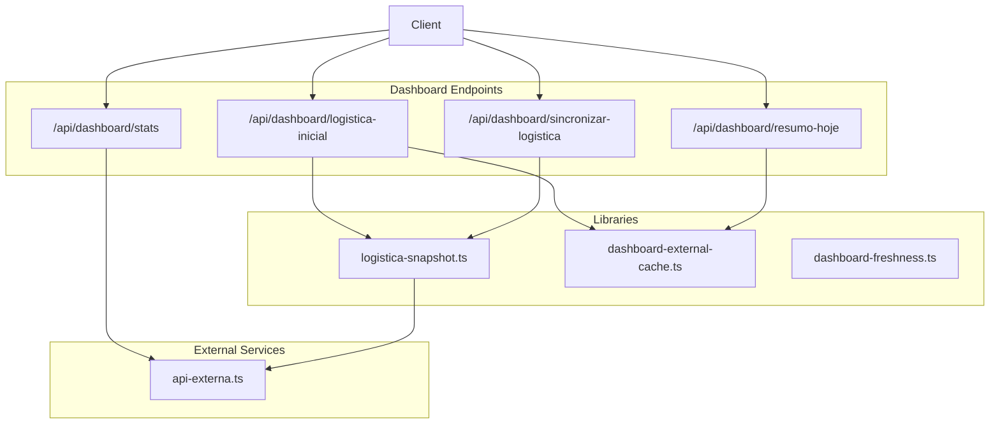
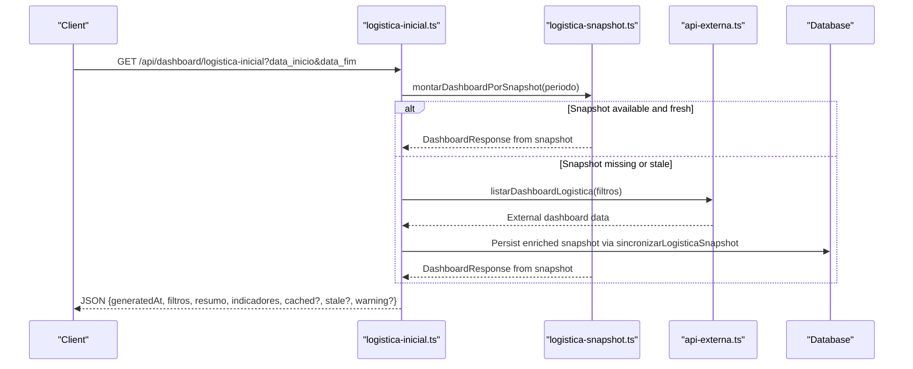
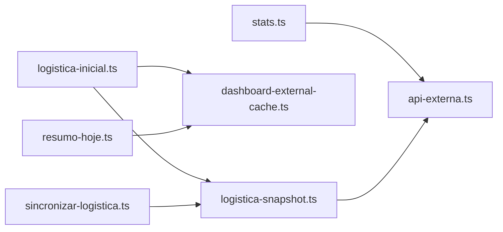

# Dashboard API

<cite>
**Referenced Files in This Document**
- [logistica-inicial.ts](file://pages/api/dashboard/logistica-inicial.ts)
- [resumo-hoje.ts](file://pages/api/dashboard/resumo-hoje.ts)
- [stats.ts](file://pages/api/dashboard/stats.ts)
- [sincronizar-logistica.ts](file://pages/api/dashboard/sincronizar-logistica.ts)
- [dashboard-external-cache.ts](file://lib/dashboard-external-cache.ts)
- [logistica-snapshot.ts](file://lib/logistica-snapshot.ts)
- [api-externa.ts](file://services/api-externa.ts)
- [dashboard-freshness.ts](file://lib/dashboard-freshness.ts)
</cite>

## Table of Contents
1. Introduction
2. Project Structure
3. Core Components
4. Architecture Overview
5. Detailed Component Analysis
6. Dependency Analysis
7. Performance Considerations
8. Troubleshooting Guide
9. Conclusion
10. Appendices

## Introduction
This document provides detailed API documentation for dashboard endpoints that deliver real-time logistics monitoring data. It covers:
- Initial logistics data endpoint
- Daily summary endpoint
- Statistics endpoint
- Synchronization operations endpoint

For each endpoint, you will find HTTP methods, request parameters, response schemas (including order statuses and metrics), caching strategies, performance considerations, filtering options, and real-time update mechanisms.

## Project Structure
The dashboard APIs are implemented as Next.js API routes under pages/api/dashboard. Supporting libraries provide external API integration, caching, snapshot synchronization, and freshness checks.

**Diagram sources**
- [logistica-inicial.ts:1-15](file://pages/api/dashboard/logistica-inicial.ts#L1-L15)
- [resumo-hoje.ts:1-25](file://pages/api/dashboard/resumo-hoje.ts#L1-L25)
- [stats.ts:1-15](file://pages/api/dashboard/stats.ts#L1-L15)
- [sincronizar-logistica.ts:1-20](file://pages/api/dashboard/sincronizar-logistica.ts#L1-L20)
- [logistica-snapshot.ts:1-20](file://lib/logistica-snapshot.ts#L1-L20)
- [dashboard-external-cache.ts:1-15](file://lib/dashboard-external-cache.ts#L1-L15)
- [api-externa.ts:1-15](file://services/api-externa.ts#L1-L15)

**Section sources**
- [logistica-inicial.ts:1-15](file://pages/api/dashboard/logistica-inicial.ts#L1-L15)
- [resumo-hoje.ts:1-25](file://pages/api/dashboard/resumo-hoje.ts#L1-L25)
- [stats.ts:1-15](file://pages/api/dashboard/stats.ts#L1-L15)
- [sincronizar-logistica.ts:1-20](file://pages/api/dashboard/sincronizar-logistica.ts#L1-L20)

## Core Components
- logistica-inicial: Provides the main dashboard payload with status indicators, summaries, and per-order details. Supports period filters and caching.
- resumo-hoje: Returns daily counts for notes, controls, orders, and delivery types with short TTL cache.
- stats: Aggregates counts for today and this month across notes, controls, and orders.
- sincronizar-logistica: Authorised sync job that refreshes a local snapshot used by the dashboard to serve fast, consistent reads.

Key shared concepts:
- Order statuses include new, in picking, picked, shipped, loaded into control, pending issues, and alerts for not separated, not checked, not shipped.
- Caching is implemented per-period with expiration and stale windows; some endpoints return cached/stale flags.
- Real-time updates are achieved via periodic synchronization that persists snapshots and enriches them with current shipping/control info.

**Section sources**
- [logistica-inicial.ts:15-82](file://pages/api/dashboard/logistica-inicial.ts#L15-L82)
- [resumo-hoje.ts:6-23](file://pages/api/dashboard/resumo-hoje.ts#L6-L23)
- [stats.ts:5-15](file://pages/api/dashboard/stats.ts#L5-L15)
- [sincronizar-logistica.ts:23-31](file://pages/api/dashboard/sincronizar-logistica.ts#L23-L31)

## Architecture Overview
The dashboard architecture combines direct database queries, external ERP/logistics API calls, and an internal snapshot layer to balance freshness and performance.

**Diagram sources**
- [logistica-inicial.ts:782-800](file://pages/api/dashboard/logistica-inicial.ts#L782-L800)
- [logistica-snapshot.ts:839-880](file://lib/logistica-snapshot.ts#L839-L880)
- [logistica-snapshot.ts:543-600](file://lib/logistica-snapshot.ts#L543-L600)
- [api-externa.ts:569-600](file://services/api-externa.ts#L569-L600)

## Detailed Component Analysis

### Endpoint: Initial Logistics Data
- Path: GET /api/dashboard/logistica-inicial
- Purpose: Return the full dashboard view with status indicators, summaries, and per-order details for a given date range.
- Query Parameters:
  - data_inicio (optional): Start date (YYYY-MM-DD). If omitted, treated as “no start”.
  - data_fim (optional): End date (YYYY-MM-DD). If omitted, defaults far future.
  - force (optional): Set to 1 to bypass cache and force recomputation.
  - escopo (optional): When set to principal, may influence enrichment behavior.
- Response Schema:
  - generatedAt: ISO timestamp of generation.
  - filtros: { localProduto, dataInicio?, dataFim }
  - resumo: { totalPedidos, totalEmbarcados, totalPendentes, totalPendencias }
  - indicadores: Array of status buckets, each with codigo, titulo, descricao, statusSeparacao, total, pedidos[]
  - Optional flags: cached, stale, warning
- Status Codes:
  - PEDIDO_NOVO, PEDIDO_EM_SEPARACAO, PEDIDO_SEPARADO, PEDIDO_EMBARCADO, PEDIDOS_EMBARCADOS, PENDENCIAS, ALERTAS_NAO_SEPARADOS, ALERTAS_NAO_CONFERIDOS, ALERTAS_NAO_EMBARCADOS
- Per-order fields (in pedidos[]):
  - pedidoId, tipoEntrega, clienteNome, nomeFantasia, valorPedido, dataHoraRecebimento, previsaoEntrega, localNome, statusCodigo, statusDescricao, statusSeparacao, situacaoAtual, usuarioConfirmacaoNome, dataHoraConfirmacao, dataHoraControle, transportadoraNome, possuiProdutosFaltando, totalItensPendentes, produtosPendentes[]
- Caching Strategy:
  - In-memory cache keyed by period with TTL and stale window.
  - Cached responses include cached flag; stale responses include stale flag and optional warning.
- Performance Considerations:
  - Concurrency-limited enrichment of order details.
  - Timeout on external calls to avoid long waits.
  - Local snapshot fallback when external service is slow or unavailable.
- Filtering Options:
  - Date range filtering via data_inicio/data_fim.
  - Period-based cache keys ensure isolation between different ranges.
- Real-time Update Mechanism:
  - Uses synchronized snapshots persisted by the sync endpoint; reading can be served from snapshot for consistency and speed.
  - Freshness controlled by required recent sync window if configured.

Example Request:
- GET /api/dashboard/logistica-inicial?data_inicio=2025-01-01&data_fim=2025-01-31

Example Response Fields:
- generatedAt, filtros.dataInicio/filtro.dataFim, resumo totals, indicadores[].pedidos[].statusCodigo, etc.

Error Handling:
- Invalid dates return 400 with descriptive messages.
- External timeouts or failures degrade gracefully to cached/stale or empty dashboards with warnings.

**Section sources**
- [logistica-inicial.ts:15-82](file://pages/api/dashboard/logistica-inicial.ts#L15-L82)
- [logistica-inicial.ts:266-312](file://pages/api/dashboard/logistica-inicial.ts#L266-L312)
- [logistica-inicial.ts:782-800](file://pages/api/dashboard/logistica-inicial.ts#L782-L800)
- [logistica-snapshot.ts:839-1036](file://lib/logistica-snapshot.ts#L839-L1036)

### Endpoint: Daily Summary
- Path: GET /api/dashboard/resumo-hoje
- Purpose: Provide daily counts for notes, controls, orders, and delivery types within a specified period.
- Query Parameters:
  - data_inicio (optional): Start date (YYYY-MM-DD)
  - data_fim (optional): End date (YYYY-MM-DD)
  - force (optional): Set to 1 to bypass cache
- Response Schema:
  - notasHoje, controlesHoje, pedidosHoje, pedidosEntregaHoje, pedidosRetiraAtoHoje, controlesPendentes, totalNotas, totalControles
  - Optional flags: cached, stale, warning
- Caching Strategy:
  - Short TTL cache per period with stale-while-revalidate header.
  - On errors, returns last known good data marked as stale with warning.
- Performance Considerations:
  - Parallel database counts with timeout protection.
  - External order retrieval limited and time-bounded.
- Filtering Options:
  - Date range filters applied to counts and order aggregation.
- Real-time Update Mechanism:
  - Refreshed on demand unless cached; supports forced refresh.

Example Request:
- GET /api/dashboard/resumo-hoje?data_inicio=2025-01-01&data_fim=2025-01-01

Example Response:
- { notasHoje: number, controlesHoje: number, pedidosHoje: number, pedidosEntregaHoje: number, pedidosRetiraAtoHoje: number, controlesPendentes: number, totalNotas: number, totalControles: number, cached?: boolean, stale?: boolean, warning?: string }

Error Handling:
- Invalid periods return 400.
- Database timeouts return cached/stale data or empty with warning.

**Section sources**
- [resumo-hoje.ts:6-23](file://pages/api/dashboard/resumo-hoje.ts#L6-L23)
- [resumo-hoje.ts:75-119](file://pages/api/dashboard/resumo-hoje.ts#L75-L119)
- [resumo-hoje.ts:193-293](file://pages/api/dashboard/resumo-hoje.ts#L193-L293)

### Endpoint: Statistics
- Path: GET /api/dashboard/stats
- Purpose: Aggregate counts for today and this month across notes, controls, and orders.
- Query Parameters: None
- Response Schema:
  - notasHoje, notasMes, controlesHoje, controlesMes, pedidosHoje, pedidosMes
- Caching Strategy: No explicit cache; relies on database query performance.
- Performance Considerations:
  - Uses parallel queries for today/month metrics.
- Filtering Options: N/A
- Real-time Update Mechanism: Direct database read on each request.

Example Request:
- GET /api/dashboard/stats

Example Response:
- { notasHoje: number, notasMes: number, controlesHoje: number, controlesMes: number, pedidosHoje: number, pedidosMes: number }

Error Handling:
- Server errors return 500 with message.

**Section sources**
- [stats.ts:5-88](file://pages/api/dashboard/stats.ts#L5-L88)

### Endpoint: Synchronize Logistics
- Path: GET|POST /api/dashboard/sincronizar-logistica
- Purpose: Trigger or run synchronization to refresh the local snapshot used by the dashboard.
- Authorization:
  - Requires Bearer token via Authorization header or secret query parameter matching CRON_SECRET environment variable.
  - In non-production without CRON_SECRET, any call is allowed.
- Query Parameters:
  - data_inicio (optional): Start date (YYYY-MM-DD); defaults to 29 days ago if omitted.
  - data_fim (optional): End date (YYYY-MM-DD); defaults to today if omitted.
  - limit (optional): Number of records to process (1–500).
  - max_detalhes (optional): Max detail lookups per run (0–100).
- Response Schema:
  - ok: boolean
  - chave: sync key string
  - totalLidos: number of entries processed
  - totalValidos: number of valid entries
  - totalAtualizados: number of updated entries
  - totalComErro: number of errors encountered
  - detalhesUsados: number of detail lookups performed
- Caching Strategy: Not applicable; writes to persistent snapshot store.
- Performance Considerations:
  - Limits concurrency and detail lookups to prevent timeouts.
  - Timeouts and retries managed in external service calls.
- Real-time Update Mechanism:
  - Persists normalized snapshots and sync metadata; dashboard reads from these snapshots for fast serving.

Example Request:
- POST /api/dashboard/sincronizar-logistica?secret=YOUR_CRON_SECRET&data_inicio=2025-01-01&data_fim=2025-01-31&limit=500&max_detalhes=20

Example Response:
- { ok: true, chave: "dashboard:2025-01-01:2025-01-31", totalLidos: number, totalValidos: number, totalAtualizados: number, totalComErro: number, detalhesUsados: number }

Error Handling:
- Unauthorized returns 401.
- Missing credentials returns 500.
- External unavailability returns 503 with error details.

**Section sources**
- [sincronizar-logistica.ts:23-76](file://pages/api/dashboard/sincronizar-logistica.ts#L23-L76)
- [logistica-snapshot.ts:543-837](file://lib/logistica-snapshot.ts#L543-L837)

## Dependency Analysis
The dashboard endpoints depend on:
- External ERP/logistics API via api-externa.ts for live data and enrichment.
- Internal snapshot logic in logistica-snapshot.ts to normalize, deduplicate, and persist state.
- Caching utilities in dashboard-external-cache.ts for efficient order list retrieval.
- Freshness validation in dashboard-freshness.ts to decide whether to replace stored dashboard payloads.

**Diagram sources**
- [logistica-inicial.ts:1-15](file://pages/api/dashboard/logistica-inicial.ts#L1-L15)
- [resumo-hoje.ts:1-10](file://pages/api/dashboard/resumo-hoje.ts#L1-L10)
- [stats.ts:1-10](file://pages/api/dashboard/stats.ts#L1-L10)
- [sincronizar-logistica.ts:1-10](file://pages/api/dashboard/sincronizar-logistica.ts#L1-L10)
- [logistica-snapshot.ts:1-10](file://lib/logistica-snapshot.ts#L1-L10)
- [dashboard-external-cache.ts:1-10](file://lib/dashboard-external-cache.ts#L1-L10)
- [api-externa.ts:1-15](file://services/api-externa.ts#L1-L15)

**Section sources**
- [logistica-inicial.ts:1-15](file://pages/api/dashboard/logistica-inicial.ts#L1-L15)
- [logistica-snapshot.ts:1-20](file://lib/logistica-snapshot.ts#L1-L20)
- [dashboard-external-cache.ts:1-15](file://lib/dashboard-external-cache.ts#L1-L15)
- [api-externa.ts:1-15](file://services/api-externa.ts#L1-L15)

## Performance Considerations
- Caching:
  - logistica-inicial uses per-period caches with TTL and stale windows; returns cached/stale flags.
  - resumo-hoje uses short TTL cache with stale-while-revalidate headers.
- Timeouts:
  - External API calls are time-bounded to avoid blocking serverless functions.
- Concurrency:
  - Enrichment and snapshot processing use bounded concurrency to protect resources.
- Pagination and Limits:
  - Sync endpoint limits limit and max_detalhes to cap work per run.
- Read Path Optimization:
  - Snapshot reads avoid repeated external calls for alert-only views.
- Freshness Control:
  - Optional requirement for recent sync before serving dashboard data.

[No sources needed since this section provides general guidance]

## Troubleshooting Guide
Common issues and resolutions:
- Invalid date parameters:
  - Ensure data_inicio <= data_fim and valid date formats.
  - Errors return 400 with descriptive messages.
- External API unavailability:
  - Sync endpoint returns 503 with error details; dashboard may fall back to cached/stale data.
- Authentication failures:
  - Sync requires correct Bearer token or secret; unauthorized returns 401.
- Slow database:
  - resumo-hoje returns cached/stale data with warning when DB is slow.
- Empty dashboard during updates:
  - Freshness guard prevents replacing valid data with empty responses.

**Section sources**
- [resumo-hoje.ts:193-293](file://pages/api/dashboard/resumo-hoje.ts#L193-L293)
- [sincronizar-logistica.ts:32-76](file://pages/api/dashboard/sincronizar-logistica.ts#L32-L76)
- [dashboard-freshness.ts:6-24](file://lib/dashboard-freshness.ts#L6-L24)

## Conclusion
The dashboard API suite provides robust, real-time logistics monitoring through a combination of direct queries, external integrations, and a resilient snapshot layer. Endpoints support flexible filtering, caching, and clear status semantics to power operational dashboards efficiently. Use the sync endpoint to keep snapshots current and leverage cached/stale flags to manage client-side refresh strategies.

[No sources needed since this section summarizes without analyzing specific files]

## Appendices

### Order Status Reference
- PEDIDO_NOVO: New orders awaiting separation
- PEDIDO_EM_SEPARACAO: Orders in separation
- PEDIDO_SEPARADO: Separated orders awaiting inspection
- PEDIDO_EMBARCADO: Shipped orders awaiting loading into control
- PEDIDOS_EMBARCADOS: Orders loaded into a control
- PENDENCIAS: Orders with pending items/issues
- ALERTAS_NAO_SEPARADOS: Alerts for orders not separated beyond cutoff
- ALERTAS_NAO_CONFERIDOS: Alerts for orders not inspected beyond cutoff
- ALERTAS_NAO_EMBARCADOS: Alerts for orders not loaded beyond cutoff

**Section sources**
- [logistica-inicial.ts:15-25](file://pages/api/dashboard/logistica-inicial.ts#L15-L25)
- [logistica-snapshot.ts:8-18](file://lib/logistica-snapshot.ts#L8-L18)

### Caching and Real-Time Updates
- Caching:
  - Per-period in-memory cache with expiration and stale windows.
  - Headers like Cache-Control used where applicable.
- Real-time:
  - Periodic sync writes normalized snapshots; dashboard reads from snapshots for consistency.
  - Freshness checks prevent overwriting valid data with empty responses.

**Section sources**
- [logistica-inicial.ts:141-156](file://pages/api/dashboard/logistica-inicial.ts#L141-L156)
- [resumo-hoje.ts:20-37](file://pages/api/dashboard/resumo-hoje.ts#L20-L37)
- [dashboard-external-cache.ts:1-92](file://lib/dashboard-external-cache.ts#L1-L92)
- [dashboard-freshness.ts:6-24](file://lib/dashboard-freshness.ts#L6-L24)