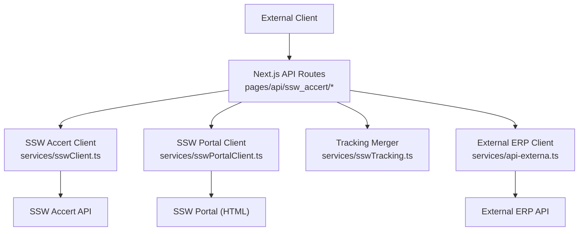
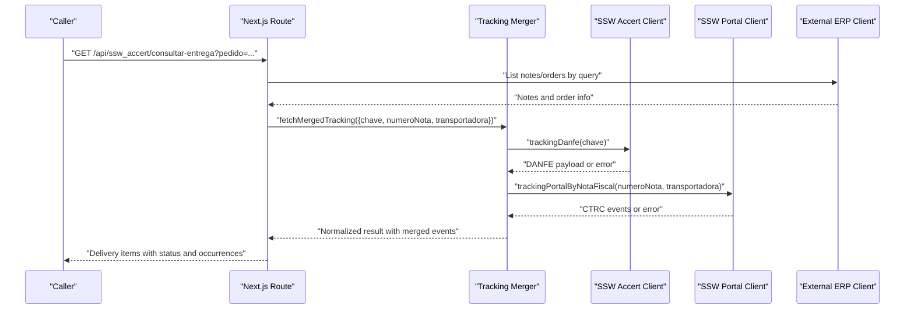
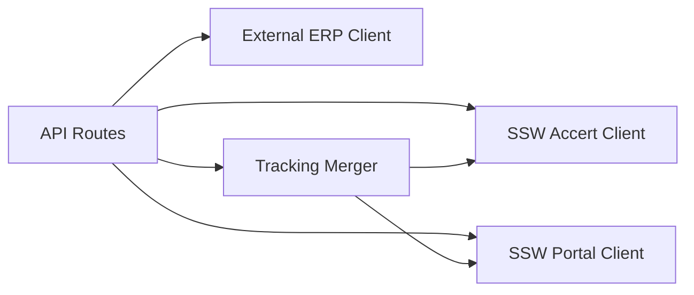

# External Integrations API

<cite>
**Referenced Files in This Document**
- [sswClient.ts](file://services/sswClient.ts)
- [sswPortalClient.ts](file://services/sswPortalClient.ts)
- [sswTracking.ts](file://services/sswTracking.ts)
- [consulta-clientes.ts](file://pages/api/ssw_accert/consulta-clientes.ts)
- [consulta-cep.ts](file://pages/api/ssw_accert/consulta-cep.ts)
- [consulta-prazo.ts](file://pages/api/ssw_accert/consulta-prazo.ts)
- [consultar-entrega.ts](file://pages/api/ssw_accert/consultar-entrega.ts)
- [public-ssw-photo.ts](file://pages/api/ssw_accert/public-ssw-photo.ts)
- [tracking-danfe.ts](file://pages/api/ssw_accert/tracking-danfe.ts)
- [cliente/[cliente_id].ts](file://pages/api/ssw_accert/notas-fiscais/cliente/[cliente_id].ts)
- [api-externa.ts](file://services/api-externa.ts)
</cite>

## Table of Contents
1. [Introduction](#introduction)
2. [Project Structure](#project-structure)
3. [Core Components](#core-components)
4. [Architecture Overview](#architecture-overview)
5. [Detailed Component Analysis](#detailed-component-analysis)
6. [Dependency Analysis](#dependency-analysis)
7. [Performance Considerations](#performance-considerations)
8. [Troubleshooting Guide](#troubleshooting-guide)
9. [Conclusion](#conclusion)

## Introduction
This document provides comprehensive API documentation for external system integrations exposed by the SSW Accert integration layer. It covers:
- Customer consultation (client and postal code lookup)
- Delivery tracking (DANFE tracking and portal-based CTRC tracking)
- Deadline queries (freight lead time estimation)
- Public photo access (secure delivery proof images)
- Notes fiscal listing per customer with optional tracking enrichment

For each endpoint, it documents HTTP methods, external API mappings, data transformation, error handling, and retry mechanisms, along with examples of communication patterns and troubleshooting guidance.

## Project Structure
The integration surface is implemented as Next.js API routes under pages/api/ssw_accert that delegate to service modules:
- sswClient.ts: SSW Accert token management and generic REST calls; also includes a secondary external ERP client for notes fiscal lookup.
- sswPortalClient.ts: Portal session management, HTML scraping for CTRC tracking, and secure image retrieval.
- sswTracking.ts: Normalization and merging of tracking results from multiple sources.
- api-externa.ts: Authenticated client for an external ERP system used for orders and notes fiscal data.

**Diagram sources**
- [consulta-clientes.ts:1-32](file://pages/api/ssw_accert/consulta-clientes.ts#L1-L32)
- [consulta-cep.ts:1-32](file://pages/api/ssw_accert/consulta-cep.ts#L1-L32)
- [consulta-prazo.ts:1-36](file://pages/api/ssw_accert/consulta-prazo.ts#L1-L36)
- [consultar-entrega.ts:1-720](file://pages/api/ssw_accert/consultar-entrega.ts#L1-L720)
- [public-ssw-photo.ts:1-50](file://pages/api/ssw_accert/public-ssw-photo.ts#L1-L50)
- [tracking-danfe.ts:1-32](file://pages/api/ssw_accert/tracking-danfe.ts#L1-L32)
- [sswClient.ts:1-445](file://services/sswClient.ts#L1-L445)
- [sswPortalClient.ts:1-578](file://services/sswPortalClient.ts#L1-L578)
- [sswTracking.ts:1-481](file://services/sswTracking.ts#L1-L481)
- [api-externa.ts:1-1058](file://services/api-externa.ts#L1-L1058)

**Section sources**
- [consulta-clientes.ts:1-32](file://pages/api/ssw_accert/consulta-clientes.ts#L1-L32)
- [consulta-cep.ts:1-32](file://pages/api/ssw_accert/consulta-cep.ts#L1-L32)
- [consulta-prazo.ts:1-36](file://pages/api/ssw_accert/consulta-prazo.ts#L1-L36)
- [consultar-entrega.ts:1-720](file://pages/api/ssw_accert/consultar-entrega.ts#L1-L720)
- [public-ssw-photo.ts:1-50](file://pages/api/ssw_accert/public-ssw-photo.ts#L1-L50)
- [tracking-danfe.ts:1-32](file://pages/api/ssw_accert/tracking-danfe.ts#L1-L32)
- [sswClient.ts:1-445](file://services/sswClient.ts#L1-L445)
- [sswPortalClient.ts:1-578](file://services/sswPortalClient.ts#L1-L578)
- [sswTracking.ts:1-481](file://services/sswTracking.ts#L1-L481)
- [api-externa.ts:1-1058](file://services/api-externa.ts#L1-L1058)

## Core Components
- SSW Accert Client: Token caching, generic GET/POST helpers, DANFE tracking, and a secondary external ERP client for notes fiscal lookup.
- SSW Portal Client: Session login, CTRC tracking via HTML parsing, and secure image fetching with signature validation.
- Tracking Merger: Normalizes events from different sources, merges them, and derives delivery status and photos.
- External ERP Client: Authenticated requests to an external ERP for orders, notes fiscal, and logistics summaries.

Key responsibilities:
- Authentication and token lifecycle management
- Input validation and normalization
- Error mapping and consistent response shapes
- Concurrency control and retries where applicable

**Section sources**
- [sswClient.ts:1-445](file://services/sswClient.ts#L1-L445)
- [sswPortalClient.ts:1-578](file://services/sswPortalClient.ts#L1-L578)
- [sswTracking.ts:1-481](file://services/sswTracking.ts#L1-L481)
- [api-externa.ts:1-1058](file://services/api-externa.ts#L1-L1058)

## Architecture Overview
The system exposes a set of stable internal endpoints that abstract external systems:
- SSW Accert REST endpoints for clients, CEP, deadlines, and DANFE tracking
- SSW Portal endpoints for CTRC tracking and secure image retrieval
- External ERP endpoints for order and notes fiscal data

**Diagram sources**
- [consultar-entrega.ts:1-720](file://pages/api/ssw_accert/consultar-entrega.ts#L1-L720)
- [sswTracking.ts:1-481](file://services/sswTracking.ts#L1-L481)
- [sswClient.ts:1-445](file://services/sswClient.ts#L1-L445)
- [sswPortalClient.ts:1-578](file://services/sswPortalClient.ts#L1-L578)
- [api-externa.ts:1-1058](file://services/api-externa.ts#L1-L1058)

## Detailed Component Analysis

### Endpoint: Consult Customers
- Method: GET
- Path: /api/ssw_accert/consulta-clientes
- Query parameters:
  - idCliente: string (digits only; 11 or 14 digits)
- External mapping: SSW Accert consultaClientes(idCliente)
- Data transformation:
  - Validates and strips non-digits from idCliente
  - Returns SSW response directly on success
- Error handling:
  - 405 for wrong method
  - 400 for invalid idCliente or SSW error flag
  - 500 for unexpected errors
- Retry mechanism: None at route level; relies on SSW token cache

Example request:
- GET /api/ssw_accert/consulta-clientes?idCliente=12345678901

**Section sources**
- [consulta-clientes.ts:1-32](file://pages/api/ssw_accert/consulta-clientes.ts#L1-L32)
- [sswClient.ts:155-157](file://services/sswClient.ts#L155-L157)

### Endpoint: Consult Postal Code (CEP)
- Method: GET
- Path: /api/ssw_accert/consulta-cep
- Query parameters:
  - idCep: string (digits only; 8 digits)
- External mapping: SSW Accert consultaCep(idCep)
- Data transformation:
  - Validates and strips non-digits from idCep
  - Returns SSW response on success
- Error handling:
  - 405 for wrong method
  - 400 for invalid idCep or SSW error flag
  - 500 for unexpected errors
- Retry mechanism: None at route level; relies on SSW token cache

Example request:
- GET /api/ssw_accert/consulta-cep?idCep=12345678

**Section sources**
- [consulta-cep.ts:1-32](file://pages/api/ssw_accert/consulta-cep.ts#L1-L32)
- [sswClient.ts:159-161](file://services/sswClient.ts#L159-L161)

### Endpoint: Consult Lead Time (Deadline)
- Method: GET
- Path: /api/ssw_accert/consulta-prazo
- Query parameters:
  - idCepRemetente: string (required)
  - idCepDestinatario: string (required)
  - idClienteRemetente: string (optional)
  - idClienteDestinatario: string (optional)
  - idClientePagador: string (optional)
  - tpFrete: string (optional)
  - idCodigoMercadoria: string (optional)
- External mapping: SSW Accert consultaPrazo(params)
- Data transformation:
  - Passes all provided parameters to SSW
- Error handling:
  - 405 for wrong method
  - 400 for missing required parameters or SSW error flag
  - 500 for unexpected errors
- Retry mechanism: None at route level; relies on SSW token cache

Example request:
- GET /api/ssw_accert/consulta-prazo?idCepRemetente=12345678&idCepDestinatario=87654321

**Section sources**
- [consulta-prazo.ts:1-36](file://pages/api/ssw_accert/consulta-prazo.ts#L1-L36)
- [sswClient.ts:163-181](file://services/sswClient.ts#L163-L181)

### Endpoint: Track Delivery (Merged)
- Method: GET
- Path: /api/ssw_accert/consultar-entrega
- Query parameters:
  - pedido: string (order number or CNPJ; one required)
  - cnpj: string (digits only; alternative to pedido)
- External mappings:
  - External ERP: list notes/orders by order number or CNPJ
  - SSW Accert: trackingDanfe(chaveNFe)
  - SSW Portal: trackingPortalByNotaFiscal(numeroNota, transportadora)
  - Local DB: Nota Fiscal and Control records for linkage
- Data transformation:
  - Enriches orders with notes fiscal data
  - Resolves NFe keys and numbers
  - Merges tracking events from DANFE and Portal
  - Derives delivery status, receiver name, delivery timestamp, and photo URL
  - Incorporates manual delivery confirmations stored locally
- Error handling:
  - 405 for wrong method
  - 400 for missing query parameters
  - 500 for configuration or unexpected errors
  - Graceful fallbacks when SSW services are unavailable
- Retry mechanism:
  - Concurrency-limited parallel tracking queries
  - Portal session refresh on failure
  - Request queuing per account to avoid concurrent logins

Response highlights:
- Array of delivery items with fields such as status, statusLabel, sswStatus, sswMensagem, occurrencias, fotoEntregaUrl, etc.

Example request:
- GET /api/ssw_accert/consultar-entrega?pedido=123456
- GET /api/ssw_accert/consultar-entrega?cnpj=12345678901234

**Section sources**
- [consultar-entrega.ts:1-720](file://pages/api/ssw_accert/consultar-entrega.ts#L1-L720)
- [sswTracking.ts:393-479](file://services/sswTracking.ts#L393-L479)
- [sswClient.ts:183-222](file://services/sswClient.ts#L183-L222)
- [sswPortalClient.ts:534-577](file://services/sswPortalClient.ts#L534-L577)
- [api-externa.ts:344-425](file://services/api-externa.ts#L344-L425)

### Endpoint: Public SSW Photo
- Method: GET
- Path: /api/ssw_accert/public-ssw-photo
- Query parameters:
  - token: base64url-encoded payload containing accountKey, reference, expiresAt
  - signature: HMAC-SHA256(token, account.password) encoded as base64url
- Behavior:
  - Validates token and signature against configured accounts
  - Proxies image retrieval from SSW Portal using authenticated session
  - Detects loading placeholders and returns 404 with descriptive error
  - Sets appropriate content-type and cache headers
- Error handling:
  - 405 for wrong method
  - 400 for missing token/signature
  - 404 for expired/invalid links or unavailable images
  - 404 with details for other failures

Example request:
- GET /api/ssw_accert/public-ssw-photo?token=...&signature=...

**Section sources**
- [public-ssw-photo.ts:1-50](file://pages/api/ssw_accert/public-ssw-photo.ts#L1-L50)
- [sswPortalClient.ts:243-255](file://services/sswPortalClient.ts#L243-L255)
- [sswPortalClient.ts:343-378](file://services/sswPortalClient.ts#L343-L378)
- [sswPortalClient.ts:380-483](file://services/sswPortalClient.ts#L380-L483)

### Endpoint: Track DANFE
- Method: POST
- Path: /api/ssw_accert/tracking-danfe
- Body:
  - chave_nfe: string (44 digits)
- External mapping: SSW Accert trackingdanfe(chaveNFe)
- Data transformation:
  - Validates and strips non-digits from chave_nfe
  - Returns raw SSW response on success
- Error handling:
  - 405 for wrong method
  - 400 for invalid chave_nfe or SSW error flag
  - 500 for unexpected errors
- Retry mechanism: None at route level; relies on SSW token cache

Example request:
- POST /api/ssw_accert/tracking-danfe
- Body: { "chave_nfe": "12345678901234567890123456789012345678901234" }

**Section sources**
- [tracking-danfe.ts:1-32](file://pages/api/ssw_accert/tracking-danfe.ts#L1-L32)
- [sswClient.ts:183-222](file://services/sswClient.ts#L183-L222)

### Endpoint: Customer Notes Fiscal with Optional Tracking
- Method: GET
- Path: /api/ssw_accert/notas-fiscais/cliente/{cliente_id}
- Query parameters:
  - limit: integer (default 50, max 100)
  - offset: integer (default 0)
  - days: integer (default 30, max 365)
  - include_tracking: boolean (default true)
- External mappings:
  - External ERP: list notes fiscal for a customer with pagination
  - SSW Accert: trackingDanfe(chaveNFe) per note when include_tracking is enabled
- Data transformation:
  - Paginates through ERP notes within date window
  - Sorts by issuance/protocol date
  - Optionally enriches each note with DANFE tracking
- Error handling:
  - 405 for wrong method
  - 400 for invalid cliente_id or parameter constraints
  - 500 for unexpected errors
- Retry mechanism:
  - Concurrency-limited tracking enrichment (3 workers)

Example request:
- GET /api/ssw_accert/notas-fiscais/cliente/123?limit=50&offset=0&days=30&include_tracking=true

**Section sources**
- [cliente/[cliente_id].ts:1-217](file://pages/api/ssw_accert/notas-fiscais/cliente/[cliente_id].ts#L1-L217)
- [sswClient.ts:183-222](file://services/sswClient.ts#L183-L222)

## Dependency Analysis
High-level dependencies between components:
- Next.js routes depend on service modules for external communication
- sswTracking depends on both sswClient and sswPortalClient to merge results
- sswPortalClient manages sessions and performs HTML scraping
- sswClient handles token caching and direct SSW REST calls
- api-externa provides authenticated access to external ERP

**Diagram sources**
- [consultar-entrega.ts:1-720](file://pages/api/ssw_accert/consultar-entrega.ts#L1-L720)
- [sswTracking.ts:1-481](file://services/sswTracking.ts#L1-L481)
- [sswClient.ts:1-445](file://services/sswClient.ts#L1-L445)
- [sswPortalClient.ts:1-578](file://services/sswPortalClient.ts#L1-L578)
- [api-externa.ts:1-1058](file://services/api-externa.ts#L1-L1058)

**Section sources**
- [consultar-entrega.ts:1-720](file://pages/api/ssw_accert/consultar-entrega.ts#L1-L720)
- [sswTracking.ts:1-481](file://services/sswTracking.ts#L1-L481)
- [sswClient.ts:1-445](file://services/sswClient.ts#L1-L445)
- [sswPortalClient.ts:1-578](file://services/sswPortalClient.ts#L1-L578)
- [api-externa.ts:1-1058](file://services/api-externa.ts#L1-L1058)

## Performance Considerations
- Token caching:
  - SSW Accert token cached with validity derived from response; reduces auth overhead
  - External ERP token cached with TTL and retry backoff on auth failures
- Concurrency:
  - Tracking queries run concurrently with bounded concurrency to avoid overloading external systems
  - Portal requests queued per account to serialize session usage
- Pagination and limits:
  - ERP notes fiscal listing uses pagination with capped page sizes
  - Customer notes endpoint enforces maximum limits to prevent large payloads
- Image retrieval:
  - Robust fallback chain for image endpoints with placeholder detection and retries

[No sources needed since this section provides general guidance]

## Troubleshooting Guide
Common issues and resolutions:
- Missing credentials:
  - Ensure SSW_ACCERT_DOMAIN, SSW_ACCERT_USERNAME, SSW_ACCERT_PASSWORD, and SSW_ACCERT_CNPJ_EDI are set
  - For portal features, ensure domain-specific credentials are configured
- Invalid inputs:
  - Validate idCliente (11 or 14 digits), idCep (8 digits), chave_nfe (44 digits)
  - For consultar-entrega, provide either pedido or cnpj
- Authentication failures:
  - Check external ERP credentials and network connectivity
  - Review token expiration and retry blocks in logs
- Portal session issues:
  - If image retrieval fails, verify signature generation and token expiry
  - Use public-ssw-photo endpoint with valid token and signature
- Tracking not found:
  - Verify NFe key and note number correctness
  - Check transportadora mapping if using portal tracking

**Section sources**
- [sswClient.ts:41-48](file://services/sswClient.ts#L41-L48)
- [consulta-clientes.ts:1-32](file://pages/api/ssw_accert/consulta-clientes.ts#L1-L32)
- [consulta-cep.ts:1-32](file://pages/api/ssw_accert/consulta-cep.ts#L1-L32)
- [tracking-danfe.ts:1-32](file://pages/api/ssw_accert/tracking-danfe.ts#L1-L32)
- [public-ssw-photo.ts:1-50](file://pages/api/ssw_accert/public-ssw-photo.ts#L1-L50)
- [api-externa.ts:167-231](file://services/api-externa.ts#L167-L231)

## Conclusion
The SSW Accert integration layer provides a robust set of APIs to interact with external systems for customer data, delivery tracking, deadline estimation, and secure image access. It emphasizes input validation, normalized responses, resilient authentication, and performance-conscious design. Use the documented endpoints and parameters to integrate reliably, and consult the troubleshooting guide for common operational issues.

[No sources needed since this section summarizes without analyzing specific files]