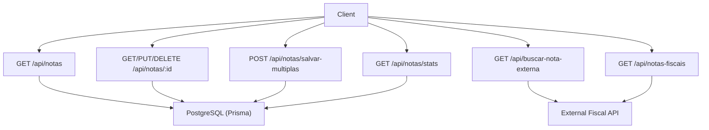
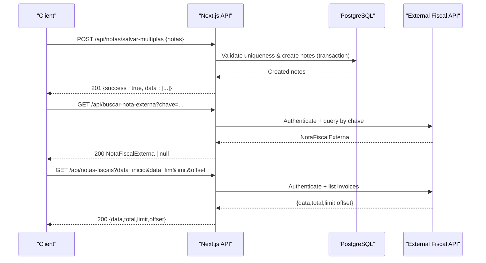
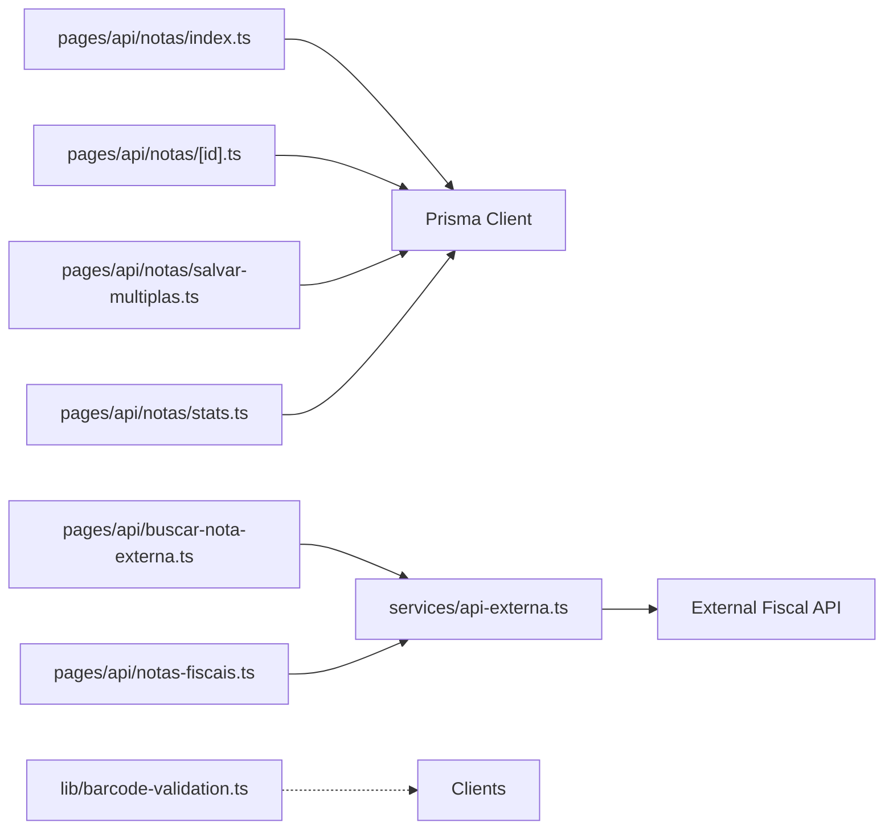

# Invoice Processing API

<cite>
**Referenced Files in This Document**
- [pages/api/notas/index.ts](file://pages/api/notas/index.ts)
- [pages/api/notas/[id].ts](file://pages/api/notas/[id].ts)
- [pages/api/notas/salvar-multiplas.ts](file://pages/api/notas/salvar-multiplas.ts)
- [pages/api/notas/stats.ts](file://pages/api/notas/stats.ts)
- [pages/api/buscar-nota-externa.ts](file://pages/api/buscar-nota-externa.ts)
- [pages/api/notas-fiscais.ts](file://pages/api/notas-fiscais.ts)
- [services/api-externa.ts](file://services/api-externa.ts)
- [lib/barcode-validation.ts](file://lib/barcode-validation.ts)
- [prisma/schema.prisma](file://prisma/schema.prisma)
</cite>

## Table of Contents
1. [Introduction](#introduction)
2. [Project Structure](#project-structure)
3. [Core Components](#core-components)
4. [Architecture Overview](#architecture-overview)
5. [Detailed Component Analysis](#detailed-component-analysis)
6. [Dependency Analysis](#dependency-analysis)
7. [Performance Considerations](#performance-considerations)
8. [Troubleshooting Guide](#troubleshooting-guide)
9. [Conclusion](#conclusion)

## Introduction
This document provides detailed API documentation for invoice (Nota Fiscal) processing endpoints, including CRUD operations, batch saving, statistics, external invoice lookup, and fiscal note management. It specifies HTTP methods, request/response schemas, validation rules, error handling, barcode-related validations, and integration with external fiscal systems.

## Project Structure
Invoice-related endpoints are implemented as Next.js API routes under pages/api/notas and related files:
- List invoices: GET /api/notas
- Single invoice CRUD: GET/PUT/DELETE /api/notas/:id
- Batch save: POST /api/notas/salvar-multiplas
- Statistics: GET /api/notas/stats
- External invoice lookup: GET /api/buscar-nota-externa
- External invoice listing: GET /api/notas-fiscais

Barcode validation utilities are provided in lib/barcode-validation.ts to support barcode type detection and checksum validation for EAN-13/EAN-8 formats.

**Diagram sources**
- [pages/api/notas/index.ts:1-87](file://pages/api/notas/index.ts#L1-L87)
- [pages/api/notas/[id].ts:1-69](file://pages/api/notas/[id].ts#L1-L69)
- [pages/api/notas/salvar-multiplas.ts:1-78](file://pages/api/notas/salvar-multiplas.ts#L1-L78)
- [pages/api/notas/stats.ts:1-45](file://pages/api/notas/stats.ts#L1-L45)
- [pages/api/buscar-nota-externa.ts:1-37](file://pages/api/buscar-nota-externa.ts#L1-L37)
- [pages/api/notas-fiscais.ts:1-60](file://pages/api/notas-fiscais.ts#L1-L60)

**Section sources**
- [pages/api/notas/index.ts:1-87](file://pages/api/notas/index.ts#L1-L87)
- [pages/api/notas/[id].ts:1-69](file://pages/api/notas/[id].ts#L1-L69)
- [pages/api/notas/salvar-multiplas.ts:1-78](file://pages/api/notas/salvar-multiplas.ts#L1-L78)
- [pages/api/notas/stats.ts:1-45](file://pages/api/notas/stats.ts#L1-L45)
- [pages/api/buscar-nota-externa.ts:1-37](file://pages/api/buscar-nota-externa.ts#L1-L37)
- [pages/api/notas-fiscais.ts:1-60](file://pages/api/notas-fiscais.ts#L1-L60)

## Core Components
- NotaFiscal model: Stores invoice records with fields such as id, dataCriacao, codigo, numeroNota, volumes, controleId, usuarioId.
- Barcode validation: Utility functions to validate EAN-13/EAN-8 barcodes and detect format.
- External service: Handles authentication and calls to an external fiscal system for invoice queries and listings.

Key responsibilities:
- CRUD operations on local invoice storage via Prisma.
- Batch creation with deduplication and transactional writes.
- Aggregated statistics for daily/monthly counts.
- External invoice lookup by key or number/series.
- Paginated listing of external invoices.

**Section sources**
- [prisma/schema.prisma:55-67](file://prisma/schema.prisma#L55-L67)
- [lib/barcode-validation.ts:1-89](file://lib/barcode-validation.ts#L1-L89)
- [services/api-externa.ts:117-248](file://services/api-externa.ts#L117-L248)

## Architecture Overview
The system exposes REST endpoints that either read/write the local PostgreSQL database through Prisma or call an external fiscal API using a token-based authenticated client. Barcode validation is available as a utility for clients to pre-validate inputs before submission.

**Diagram sources**
- [pages/api/notas/salvar-multiplas.ts:1-78](file://pages/api/notas/salvar-multiplas.ts#L1-L78)
- [pages/api/buscar-nota-externa.ts:1-37](file://pages/api/buscar-nota-externa.ts#L1-L37)
- [pages/api/notas-fiscais.ts:1-60](file://pages/api/notas-fiscais.ts#L1-L60)
- [services/api-externa.ts:167-248](file://services/api-externa.ts#L167-L248)

## Detailed Component Analysis

### List Invoices
- Endpoint: GET /api/notas
- Query parameters:
  - start: string (YYYY-MM-DD) inclusive start date
  - end: string (YYYY-MM-DD) inclusive end date
  - numeroNota: string (case-insensitive contains match)
  - codigo: string (case-insensitive contains match)
- Response: Array of NotaFiscal objects with included controle and usuario summaries
- Errors:
  - 405 if method not allowed
  - 500 on internal errors

Validation rules:
- Dates are parsed to UTC boundaries; invalid dates are ignored.
- Filters use case-insensitive substring matching when provided.

Example response shape:
- Array of NotaFiscal entries with nested controle.id, controle.dataCriacao, usuario.id, usuario.nome, usuario.email.

**Section sources**
- [pages/api/notas/index.ts:1-87](file://pages/api/notas/index.ts#L1-L87)

### Single Invoice CRUD
- Endpoints:
  - GET /api/notas/:id
  - PUT /api/notas/:id
  - DELETE /api/notas/:id
- Path parameter:
  - id: string (UUID)
- Request body (PUT):
  - codigo: string
  - numeroNota: string
  - volumes: string|number
  - controleId: string (optional)
  - usuarioId: string (optional)
- Responses:
  - GET: 200 NotaFiscal with controle included; 404 if not found
  - PUT: 200 updated NotaFiscal with controle included
  - DELETE: 200 success message
- Errors:
  - 400 if id is invalid
  - 405 if method not allowed
  - 500 on internal errors

**Section sources**
- [pages/api/notas/[id].ts:1-69](file://pages/api/notas/[id].ts#L1-L69)

### Batch Save Invoices
- Endpoint: POST /api/notas/salvar-multiplas
- Request body:
  - notas: array of NotaPayload
    - codigo: string (required)
    - numeroNota: string (required)
    - volumes: string|number (default "1")
    - usuarioId: string (optional)
- Validation:
  - At least one nota required
  - codigo and numeroNota must be present
  - Duplicate within the same batch is rejected
  - Existing records in DB with same codigo+numeroNota are rejected
- Response:
  - 201 { success: true, data: [created Notas] }
- Errors:
  - 400 for validation failures
  - 405 if method not allowed
  - 500 on internal errors

Batch processing pattern:
- Normalizes input fields
- Deduplicates within the batch
- Checks existence against DB
- Creates all records atomically via transaction

**Section sources**
- [pages/api/notas/salvar-multiplas.ts:1-78](file://pages/api/notas/salvar-multiplas.ts#L1-L78)

### Statistics
- Endpoint: GET /api/notas/stats
- Response:
  - notasHoje: number (count for current day)
  - notasMes: number (count for current month)
- Errors:
  - 405 if method not allowed
  - 500 on internal errors

**Section sources**
- [pages/api/notas/stats.ts:1-45](file://pages/api/notas/stats.ts#L1-L45)

### External Invoice Lookup
- Endpoint: GET /api/buscar-nota-externa
- Query parameters:
  - chave: string (NFe key)
  - numero: string (invoice number)
  - serie: string (series, default "1" if omitted)
- Behavior:
  - Requires API_EXTERNA_USERNAME and API_EXTERNA_PASSWORD
  - If chave provided, looks up by chave
  - Else if numero provided, looks up by numero+serie
  - Returns 200 with NotaFiscalExterna object or null if not found
- Errors:
  - 405 if method not allowed
  - 500 if credentials missing or server error

Integration details:
- Uses services/api-externa.ts for authentication and remote calls
- Supports fallback strategies for different remote endpoints

**Section sources**
- [pages/api/buscar-nota-externa.ts:1-37](file://pages/api/buscar-nota-externa.ts#L1-L37)
- [services/api-externa.ts:250-347](file://services/api-externa.ts#L250-L347)

### External Invoice Listing
- Endpoint: GET /api/notas-fiscais
- Query parameters:
  - data_inicio: string (start date)
  - data_fim: string (end date)
  - limit: number (default 50)
  - offset: number (default 0)
- Behavior:
  - Requires API_EXTERNA_USERNAME and API_EXTERNA_PASSWORD
  - Calls external service to list invoices with pagination
  - Returns { data, total, limit, offset }
  - If credentials missing, returns empty data with warning
- Errors:
  - 405 if method not allowed
  - 500 on internal errors

**Section sources**
- [pages/api/notas-fiscais.ts:1-60](file://pages/api/notas-fiscais.ts#L1-L60)
- [services/api-externa.ts:569-609](file://services/api-externa.ts#L569-L609)

### Barcode Validation Utilities
- Functions:
  - isValidEan13(value): validates EAN-13 format and checksum
  - isValidEan8(value): validates EAN-8 format and checksum
  - detectBarcodeType(value): returns 'EAN13', 'EAN8', 'CODE128', or 'UNSUPPORTED'
  - analyzeBarcode(value): returns analysis result with isValid, type, normalizedValue, reason
- Usage:
  - Clients can pre-validate barcode inputs before sending to endpoints
  - Helps prevent invalid submissions and improve UX

Complexity:
- O(n) where n is length of barcode string
- Constant-time checksum calculations

**Section sources**
- [lib/barcode-validation.ts:1-89](file://lib/barcode-validation.ts#L1-L89)

## Dependency Analysis
- Local data persistence uses Prisma with PostgreSQL schema defined in prisma/schema.prisma.
- External integrations rely on services/api-externa.ts which manages authentication and HTTP calls to the external fiscal API.
- Barcode validation is independent and can be used by any client code.

**Diagram sources**
- [pages/api/notas/index.ts:1-87](file://pages/api/notas/index.ts#L1-L87)
- [pages/api/notas/[id].ts:1-69](file://pages/api/notas/[id].ts#L1-L69)
- [pages/api/notas/salvar-multiplas.ts:1-78](file://pages/api/notas/salvar-multiplas.ts#L1-L78)
- [pages/api/notas/stats.ts:1-45](file://pages/api/notas/stats.ts#L1-L45)
- [pages/api/buscar-nota-externa.ts:1-37](file://pages/api/buscar-nota-externa.ts#L1-L37)
- [pages/api/notas-fiscais.ts:1-60](file://pages/api/notas-fiscais.ts#L1-L60)
- [services/api-externa.ts:117-248](file://services/api-externa.ts#L117-L248)

**Section sources**
- [prisma/schema.prisma:55-67](file://prisma/schema.prisma#L55-L67)
- [services/api-externa.ts:117-248](file://services/api-externa.ts#L117-L248)

## Performance Considerations
- Use pagination for large external invoice lists via limit/offset to avoid heavy payloads.
- Batch saving uses transactions to ensure atomicity and reduce round-trips.
- Date filtering on the server side reduces client-side processing.
- External API calls include timeouts and retry blocking to mitigate cascading failures.

[No sources needed since this section provides general guidance]

## Troubleshooting Guide
Common issues and resolutions:
- Method not allowed: Ensure correct HTTP method per endpoint.
- Invalid ID: For single invoice endpoints, pass a valid UUID string.
- Missing credentials: External endpoints require API_EXTERNA_USERNAME and API_EXTERNA_PASSWORD; configure environment variables.
- Duplicate notes: Batch save rejects duplicates within the same request and existing records in DB.
- Barcode validation: Use analyzeBarcode to validate EAN-13/EAN-8 before submission; invalid checksums will be flagged.

Error responses:
- 400: Validation errors (e.g., missing required fields, duplicates)
- 404: Resource not found (single invoice GET)
- 405: Unsupported HTTP method
- 500: Internal server errors (database or external API failures)

**Section sources**
- [pages/api/notas/index.ts:1-87](file://pages/api/notas/index.ts#L1-L87)
- [pages/api/notas/[id].ts:1-69](file://pages/api/notas/[id].ts#L1-L69)
- [pages/api/notas/salvar-multiplas.ts:1-78](file://pages/api/notas/salvar-multiplas.ts#L1-L78)
- [pages/api/notas/stats.ts:1-45](file://pages/api/notas/stats.ts#L1-L45)
- [pages/api/buscar-nota-externa.ts:1-37](file://pages/api/buscar-nota-externa.ts#L1-L37)
- [pages/api/notas-fiscais.ts:1-60](file://pages/api/notas-fiscais.ts#L1-L60)
- [lib/barcode-validation.ts:1-89](file://lib/barcode-validation.ts#L1-L89)

## Conclusion
The Invoice Processing API provides comprehensive capabilities for managing local invoice records and integrating with external fiscal systems. It supports robust CRUD operations, efficient batch processing, useful statistics, and reliable external lookups with proper error handling and validation. Barcode utilities help ensure data quality at ingestion time.

[No sources needed since this section summarizes without analyzing specific files]