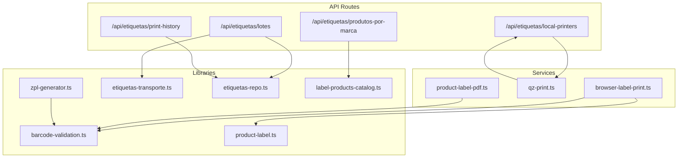
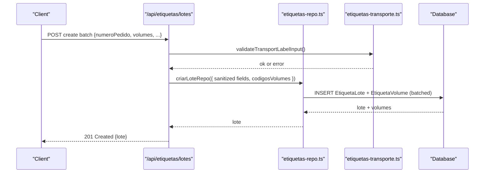
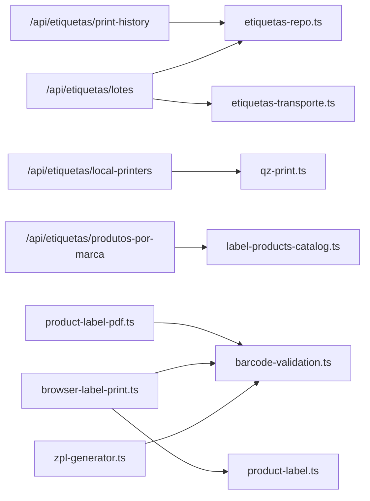

# Labels & Printing API

<cite>
**Referenced Files in This Document**
- [lotes.ts](file://pages/api/etiquetas/lotes.ts)
- [print-history.ts](file://pages/api/etiquetas/print-history.ts)
- [local-printers.ts](file://pages/api/etiquetas/local-printers.ts)
- [produtos-por-marca.ts](file://pages/api/etiquetas/produtos-por-marca.ts)
- [zpl-generator.ts](file://lib/zpl-generator.ts)
- [product-label.ts](file://lib/product-label.ts)
- [etiquetas-repo.ts](file://lib/etiquetas-repo.ts)
- [etiquetas-transporte.ts](file://lib/etiquetas-transporte.ts)
- [barcode-validation.ts](file://lib/barcode-validation.ts)
- [label-products-catalog.ts](file://lib/label-products-catalog.ts)
- [browser-label-print.ts](file://services/browser-label-print.ts)
- [qz-print.ts](file://services/qz-print.ts)
- [product-label-pdf.ts](file://services/product-label-pdf.ts)
- [labels.ts](file://types/labels.ts)
</cite>

## Table of Contents
1. Introduction
2. Project Structure
3. Core Components
4. Architecture Overview
5. Detailed Component Analysis
6. Dependency Analysis
7. Performance Considerations
8. Troubleshooting Guide
9. Conclusion
10. Appendices

## Introduction
This document provides comprehensive API documentation for label generation and printing endpoints, covering batch operations, product labels, printer management, print history, and brand-specific products. It explains HTTP methods, ZPL generation, printer selection, batch processing, and print job management with examples of data structures and integration patterns.

## Project Structure
The labeling system is implemented as Next.js API routes under pages/api/etiquetas, supported by libraries for ZPL generation, barcode validation, transport label utilities, and persistence via a repository layer. Client-side services handle browser-based printing and QZ Tray integration for raw ZPL printing to local printers.

**Diagram sources**
- [lotes.ts:17-36](file://pages/api/etiquetas/lotes.ts#L17-L36)
- [print-history.ts:8-47](file://pages/api/etiquetas/print-history.ts#L8-L47)
- [local-printers.ts:16-49](file://pages/api/etiquetas/local-printers.ts#L16-L49)
- [produtos-por-marca.ts:7-27](file://pages/api/etiquetas/produtos-por-marca.ts#L7-L27)
- [zpl-generator.ts:149-170](file://lib/zpl-generator.ts#L149-L170)
- [barcode-validation.ts:42-88](file://lib/barcode-validation.ts#L42-L88)
- [etiquetas-transporte.ts:84-128](file://lib/etiquetas-transporte.ts#L84-L128)
- [etiquetas-repo.ts:176-226](file://lib/etiquetas-repo.ts#L176-L226)
- [label-products-catalog.ts:31-53](file://lib/label-products-catalog.ts#L31-L53)
- [browser-label-print.ts:109-184](file://services/browser-label-print.ts#L109-L184)
- [qz-print.ts:85-157](file://services/qz-print.ts#L85-L157)
- [product-label-pdf.ts:101-225](file://services/product-label-pdf.ts#L101-L225)

**Section sources**
- [lotes.ts:17-36](file://pages/api/etiquetas/lotes.ts#L17-L36)
- [print-history.ts:8-47](file://pages/api/etiquetas/print-history.ts#L8-L47)
- [local-printers.ts:16-49](file://pages/api/etiquetas/local-printers.ts#L16-L49)
- [produtos-por-marca.ts:7-27](file://pages/api/etiquetas/produtos-por-marca.ts#L7-L27)

## Core Components
- Transport label batches: Create and list batches with unique volume codes per order.
- Product labels: Generate ZPL or A4/PDF labels for single or multiple products.
- Printer management: Discover local printers (QZ Tray or Windows fallback).
- Print history: Record successful or failed print attempts with metadata.
- Brand-specific products: Search product catalog by brand and generate multi-product labels.

Key responsibilities:
- Validation and sanitization of inputs (order numbers, barcodes, transporters).
- Unique code generation for volumes to avoid collisions across reprints.
- ZPL generation for thermal printers and HTML/PDF for A4 formats.
- Browser-based printing workflows and QZ Tray integration for raw ZPL.

**Section sources**
- [etiquetas-transporte.ts:50-128](file://lib/etiquetas-transporte.ts#L50-L128)
- [zpl-generator.ts:149-170](file://lib/zpl-generator.ts#L149-L170)
- [browser-label-print.ts:109-184](file://services/browser-label-print.ts#L109-L184)
- [qz-print.ts:85-157](file://services/qz-print.ts#L85-L157)
- [product-label-pdf.ts:101-225](file://services/product-label-pdf.ts#L101-L225)
- [labels.ts:1-121](file://types/labels.ts#L1-L121)

## Architecture Overview
The system exposes REST-like endpoints for creating/listing transport label batches, recording print history, listing local printers, and searching products by brand. ZPL generation is handled server-side for thermal printers; client-side services support browser printing and QZ Tray integration. The repository layer abstracts database interactions and ensures compatibility even when optional columns are missing.

**Diagram sources**
- [lotes.ts:39-88](file://pages/api/etiquetas/lotes.ts#L39-L88)
- [etiquetas-transporte.ts:110-128](file://lib/etiquetas-transporte.ts#L110-L128)
- [etiquetas-repo.ts:176-226](file://lib/etiquetas-repo.ts#L176-L226)

**Section sources**
- [lotes.ts:17-36](file://pages/api/etiquetas/lotes.ts#L17-L36)
- [etiquetas-repo.ts:176-226](file://lib/etiquetas-repo.ts#L176-L226)

## Detailed Component Analysis

### Endpoint: Create Transport Label Batch
- Path: /api/etiquetas/lotes
- Method: POST
- Authentication: Required (active user with allowed roles)
- Request body: TransportLabelInput
  - numeroPedido: string (sanitized)
  - volumes: number (integer > 0, max limit enforced)
  - cliente?: string
  - cnpj?: string
  - transportadora?: string (validated against allowed enum; defaults to ACCERT)
  - numeroNota?: string
  - codigoBarras?: string
  - observacoes?: string
- Response: 201 Created with lote object including volumesEtiquetas
- Error handling:
  - 400: Validation errors (missing order number, invalid volumes)
  - 409: Duplicate barcode conflict
  - 500: Internal server error

Batch processing details:
- Generates unique volume codes using gerarCodigosVolumes to ensure uniqueness even on reprints.
- Cleans old batches from previous days before creation.
- Persists batch and volumes in bulk to avoid parameter limits.

ZPL generation:
- Not directly used here; this endpoint creates transport batches. Use browser service to print transport labels per volume.

Printer selection:
- Not applicable at this endpoint; use /api/etiquetas/local-printers or QZ Tray client functions to select printers.

Example request payload:
- { "numeroPedido": "12345", "volumes": 3, "cliente": "ACME Corp", "cnpj": "12.345.678/0001-99", "transportadora": "ACCERT", "numeroNota": "NF-001", "observacoes": "Handle with care" }

**Section sources**
- [lotes.ts:17-88](file://pages/api/etiquetas/lotes.ts#L17-L88)
- [etiquetas-transporte.ts:84-128](file://lib/etiquetas-transporte.ts#L84-L128)
- [etiquetas-repo.ts:176-226](file://lib/etiquetas-repo.ts#L176-L226)
- [labels.ts:111-121](file://types/labels.ts#L111-L121)

### Endpoint: List Transport Label Batches
- Path: /api/etiquetas/lotes
- Method: GET
- Query parameters:
  - numeroPedido?: string (optional filter)
  - limite?: number (1..100, default 20)
- Response: Array of lote objects with volumesEtiquetas
- Behavior:
  - Cleans old batches before listing.
  - Filters by today’s creation date and optional order number.
  - Returns up to the specified limit.

**Section sources**
- [lotes.ts:91-111](file://pages/api/etiquetas/lotes.ts#L91-L111)
- [etiquetas-repo.ts:261-309](file://lib/etiquetas-repo.ts#L261-L309)

### Endpoint: Record Print History
- Path: /api/etiquetas/print-history
- Method: POST
- Authentication: Required (active user with allowed roles)
- Request body: LabelPrintHistoryInput
  - produtoId: string
  - codigoAdm: string
  - nomeProduto: string
  - marcaProduto?: string | null
  - codigoBarras: string
  - quantidade: number
  - impressora: string
  - resultado: 'SUCESSO' | 'ERRO'
  - mensagemErro?: string | null
- Response: 201 Created with created history entry
- Error handling:
  - 400: Invalid history data
  - 401/403: Unauthorized or forbidden
  - 500: Server error

Use cases:
- Log successful or failed prints for auditability.
- Track printer names and error messages for troubleshooting.

**Section sources**
- [print-history.ts:8-47](file://pages/api/etiquetas/print-history.ts#L8-L47)
- [labels.ts:55-65](file://types/labels.ts#L55-L65)

### Endpoint: List Local Printers
- Path: /api/etiquetas/local-printers
- Method: GET
- Authentication: Required (active user with allowed roles)
- Response: { printers: string[] }
- Behavior:
  - Executes PowerShell command to enumerate Windows printers.
  - Returns unique printer names.
  - Fallback mechanism integrated in client via QZ Tray service.

Integration pattern:
- Used by qz-print.ts listLocalPrinters as a fallback when QZ Tray cannot list printers.

**Section sources**
- [local-printers.ts:16-49](file://pages/api/etiquetas/local-printers.ts#L16-L49)
- [qz-print.ts:65-83](file://services/qz-print.ts#L65-L83)

### Endpoint: Search Products by Brand
- Path: /api/etiquetas/produtos-por-marca
- Method: GET
- Query parameters:
  - marca: string (minimum 2 characters)
- Response: { marca, produtos[], total, catalogo? }
- Behavior:
  - Searches product catalog by normalized brand name.
  - Returns active products with images under /products/erp/.
  - Includes catalog info (total count and latest update timestamp).

Use cases:
- Build UI to browse products by brand.
- Generate multi-product labels for selected items.

**Section sources**
- [produtos-por-marca.ts:7-27](file://pages/api/etiquetas/produtos-por-marca.ts#L7-L27)
- [label-products-catalog.ts:31-53](file://lib/label-products-catalog.ts#L31-L53)
- [labels.ts:23-46](file://types/labels.ts#L23-L46)

### ZPL Generation for Product Labels
- Function: generateZplLabels(produto, quantidade, labelType)
- Supported label types: UNITARIA, CAIXA_FECHADA
- Output:
  - UNITARIA: Pages with up to 3 unit labels per page (thermal printer layout)
  - CAIXA_FECHADA: Single closed-box label per page
- Barcode handling:
  - Validates EAN13/EAN8/CODE128 via analyzeBarcode.
  - Builds appropriate ZPL barcode fields with correct dimensions.
- Text formatting:
  - Splits long titles into lines with truncation.
  - Centers text within label width.

Usage pattern:
- Send generated ZPL to QZ Tray printRawZpl for direct printing to compatible printers.

**Section sources**
- [zpl-generator.ts:149-170](file://lib/zpl-generator.ts#L149-L170)
- [zpl-generator.ts:48-97](file://lib/zpl-generator.ts#L48-L97)
- [barcode-validation.ts:42-88](file://lib/barcode-validation.ts#L42-L88)

### Browser-Based Printing (HTML/PDF)
- Functions:
  - printProductLabelsInBrowser(produtos, printerName, labelType, outputMode, options)
  - printLabelsInBrowser(produto, quantidade, printerName, labelType, outputMode)
  - printTransportLabelsInBrowser(lote, volumes, printerName)
- Features:
  - Opens a popup with formatted labels suitable for browser print or PDF export.
  - Supports A4 horizontal/vertical layouts and double-density vertical.
  - Generates SVG barcodes using JsBarcode.
  - For transport labels, one label per volume with CODE128 barcode.

Integration pattern:
- Use outputMode 'pdf' to save as PDF; 'print' to open print dialog.
- Provide copiesPerProduct to duplicate labels per item.

**Section sources**
- [browser-label-print.ts:109-184](file://services/browser-label-print.ts#L109-L184)
- [browser-label-print.ts:675-745](file://services/browser-label-print.ts#L675-L745)

### QZ Tray Integration (Raw ZPL Printing)
- Functions:
  - listLocalPrinters(): Returns available printers and suggested printer (auto-match Zebra/ZD220).
  - printRawZpl(printerName, zpl): Sends raw ZPL commands to the selected printer.
  - detectQzStatus(): Checks connection status and returns standardized status.
- Security:
  - Configures certificate and signature endpoints via environment variables.
- Fallback:
  - If QZ Tray cannot list printers, falls back to Windows printer enumeration via /api/etiquetas/local-printers.

Workflow:
- Ensure QZ Tray is connected.
- List printers and choose one (preferred or auto-detected).
- Generate ZPL and send via printRawZpl.

**Section sources**
- [qz-print.ts:85-157](file://services/qz-print.ts#L85-L157)
- [qz-print.ts:159-205](file://services/qz-print.ts#L159-L205)
- [local-printers.ts:16-49](file://pages/api/etiquetas/local-printers.ts#L16-L49)

### PDF Generation for Product Labels
- Functions:
  - downloadProductLabelsPdf(produto, quantidade): Downloads a PDF with two labels per A4 page.
  - openProductLabelsPdfForPrint(produto, quantidade): Opens a popup with the generated PDF for printing.
  - downloadBrandProductLabelsPdf(produtos, marca): Downloads a multi-product PDF for brand selection.
- Features:
  - Embeds product images and barcodes.
  - Formats text with adaptive font sizing and wrapping.
  - Handles multiple products in a single PDF.

**Section sources**
- [product-label-pdf.ts:101-225](file://services/product-label-pdf.ts#L101-L225)
- [product-label-pdf.ts:352-402](file://services/product-label-pdf.ts#L352-L402)

### Data Models and Types
- ProdutoEtiqueta: Represents a product eligible for label generation with barcode and packaging info.
- LabelPrintHistoryInput: Captures print attempt details for auditing.
- TransportLabelInput: Input schema for creating transport label batches.
- EtiquetaLoteData / EtiquetaVolumeData: Structures returned by batch operations.

**Section sources**
- [labels.ts:1-121](file://types/labels.ts#L1-L121)

## Dependency Analysis

**Diagram sources**
- [lotes.ts:39-88](file://pages/api/etiquetas/lotes.ts#L39-L88)
- [print-history.ts:23-43](file://pages/api/etiquetas/print-history.ts#L23-L43)
- [local-printers.ts:31-44](file://pages/api/etiquetas/local-printers.ts#L31-L44)
- [produtos-por-marca.ts:14-20](file://pages/api/etiquetas/produtos-por-marca.ts#L14-L20)
- [zpl-generator.ts:149-170](file://lib/zpl-generator.ts#L149-L170)
- [barcode-validation.ts:42-88](file://lib/barcode-validation.ts#L42-L88)
- [browser-label-print.ts:109-184](file://services/browser-label-print.ts#L109-L184)
- [product-label-pdf.ts:101-225](file://services/product-label-pdf.ts#L101-L225)

**Section sources**
- [lotes.ts:39-88](file://pages/api/etiquetas/lotes.ts#L39-L88)
- [print-history.ts:23-43](file://pages/api/etiquetas/print-history.ts#L23-L43)
- [local-printers.ts:31-44](file://pages/api/etiquetas/local-printers.ts#L31-L44)
- [produtos-por-marca.ts:14-20](file://pages/api/etiquetas/produtos-por-marca.ts#L14-L20)
- [zpl-generator.ts:149-170](file://lib/zpl-generator.ts#L149-L170)
- [barcode-validation.ts:42-88](file://lib/barcode-validation.ts#L42-L88)
- [browser-label-print.ts:109-184](file://services/browser-label-print.ts#L109-L184)
- [product-label-pdf.ts:101-225](file://services/product-label-pdf.ts#L101-L225)

## Performance Considerations
- Batch inserts: Volume records are inserted in blocks to avoid Postgres parameter limits.
- Barcode validation: Efficient checks for EAN13/EAN8 checksums and ASCII constraints.
- Printer discovery: QZ Tray lists printers quickly; fallback to Windows enumeration only when needed.
- PDF generation: Uses lazy imports for pdf-lib to reduce initial load time.
- ZPL darkness setting: Optimized for thermal printers to balance quality and speed.

[No sources needed since this section provides general guidance]

## Troubleshooting Guide
Common issues and resolutions:
- Unauthorized access: Ensure user is authenticated and has an allowed role.
- Invalid barcode: Validate barcode format and checksum before generating labels.
- Duplicate barcode: Handle 409 conflicts by regenerating or adjusting input.
- QZ Tray not installed: Detect status and prompt installation; configure certificate/signature endpoints.
- No printers found: Use fallback to list Windows printers via local-printers endpoint.
- Database column missing: Repository dynamically includes optional columns to prevent P2022 errors.

**Section sources**
- [lotes.ts:82-88](file://pages/api/etiquetas/lotes.ts#L82-L88)
- [print-history.ts:23-47](file://pages/api/etiquetas/print-history.ts#L23-L47)
- [qz-print.ts:159-205](file://services/qz-print.ts#L159-L205)
- [etiquetas-repo.ts:61-82](file://lib/etiquetas-repo.ts#L61-L82)

## Conclusion
The Labels & Printing API provides robust endpoints for creating transport label batches, recording print history, discovering printers, and generating product labels in both ZPL and PDF formats. It supports batch processing, brand-specific product searches, and integrates seamlessly with QZ Tray for direct thermal printing. Proper validation, unique code generation, and resilient database interactions ensure reliable operation across environments.

[No sources needed since this section summarizes without analyzing specific files]

## Appendices

### API Reference Summary

- Create Transport Label Batch
  - Method: POST
  - Path: /api/etiquetas/lotes
  - Body: TransportLabelInput
  - Response: 201 Created with lote

- List Transport Label Batches
  - Method: GET
  - Path: /api/etiquetas/lotes
  - Query: numeroPedido?, limite?
  - Response: Array of lotes

- Record Print History
  - Method: POST
  - Path: /api/etiquetas/print-history
  - Body: LabelPrintHistoryInput
  - Response: 201 Created with history entry

- List Local Printers
  - Method: GET
  - Path: /api/etiquetas/local-printers
  - Response: { printers: string[] }

- Search Products by Brand
  - Method: GET
  - Path: /api/etiquetas/produtos-por-marca
  - Query: marca (min 2 chars)
  - Response: { marca, produtos[], total, catalogo? }

**Section sources**
- [lotes.ts:17-36](file://pages/api/etiquetas/lotes.ts#L17-L36)
- [print-history.ts:8-47](file://pages/api/etiquetas/print-history.ts#L8-L47)
- [local-printers.ts:16-49](file://pages/api/etiquetas/local-printers.ts#L16-L49)
- [produtos-por-marca.ts:7-27](file://pages/api/etiquetas/produtos-por-marca.ts#L7-L27)