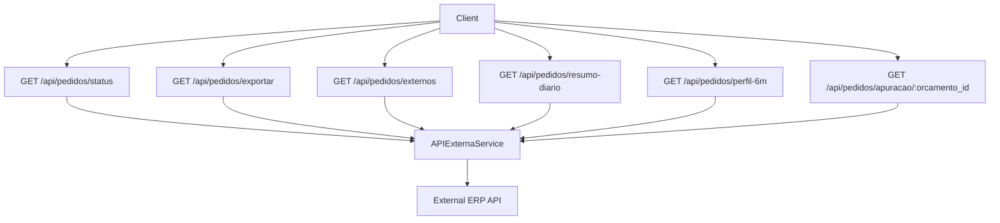
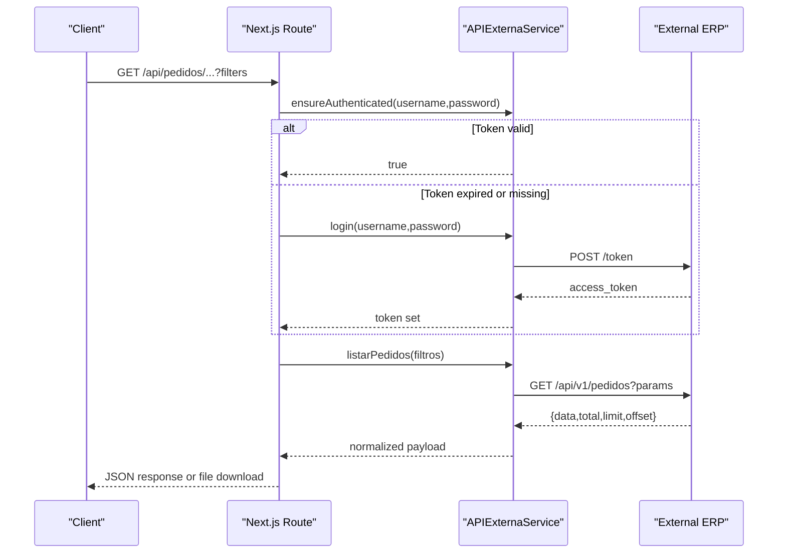
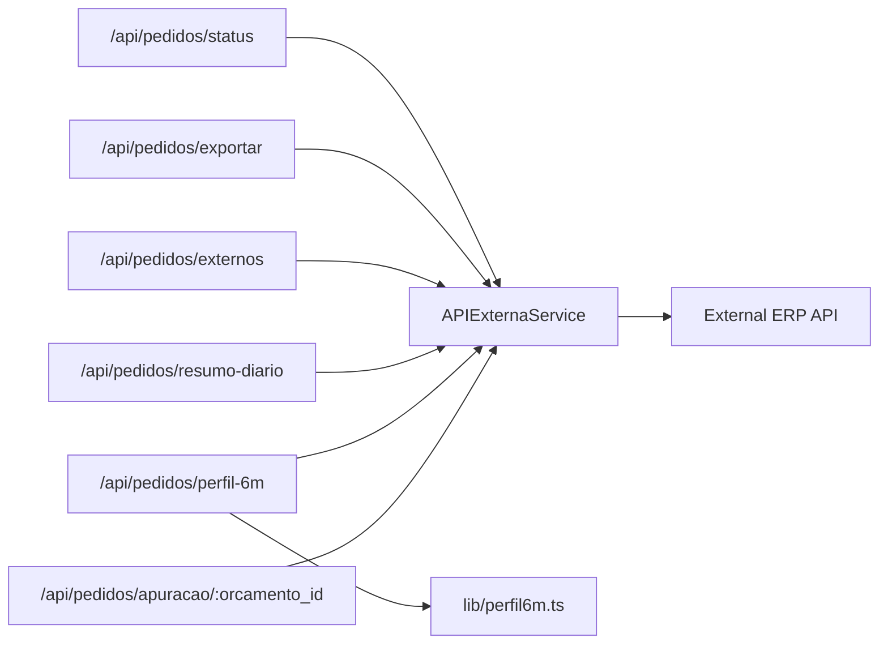

# Orders Management API

<cite>
**Referenced Files in This Document**
- [pages/api/pedidos/externos.ts](file://pages/api/pedidos/externos.ts)
- [pages/api/pedidos/exportar.ts](file://pages/api/pedidos/exportar.ts)
- [pages/api/pedidos/status.ts](file://pages/api/pedidos/status.ts)
- [pages/api/pedidos/resumo-diario.ts](file://pages/api/pedidos/resumo-diario.ts)
- [pages/api/pedidos/perfil-6m.ts](file://pages/api/pedidos/perfil-6m.ts)
- [pages/api/pedidos/apuracao/[orcamento_id].ts](file://pages/api/pedidos/apuracao/[orcamento_id].ts)
- [services/api-externa.ts](file://services/api-externa.ts)
- [lib/perfil6m.ts](file://lib/perfil6m.ts)
</cite>

## Table of Contents
1. Introduction
2. Project Structure
3. Core Components
4. Architecture Overview
5. Detailed Component Analysis
6. Dependency Analysis
7. Performance Considerations
8. Troubleshooting Guide
9. Conclusion

## Introduction
This document provides comprehensive API documentation for order management endpoints focused on:
- Order status tracking
- Export functionality
- External order integration
- Monthly profiles and daily summaries
- Quality assurance processes (e.g., Perfil 6M matching and apuração reconciliation)

It covers HTTP methods, request/response schemas, filtering and search capabilities, bulk operations, order lifecycle states, and integration patterns with the external ERP system.

## Project Structure
The orders management feature is implemented as Next.js API routes under pages/api/pedidos, with a shared external service layer in services/api-externa.ts and specialized logic in lib/perfil6m.ts.

**Diagram sources**
- [pages/api/pedidos/status.ts:14-50](file://pages/api/pedidos/status.ts#L14-L50)
- [pages/api/pedidos/exportar.ts:6-206](file://pages/api/pedidos/exportar.ts#L6-L206)
- [pages/api/pedidos/externos.ts:82-287](file://pages/api/pedidos/externos.ts#L82-L287)
- [pages/api/pedidos/resumo-diario.ts:5-43](file://pages/api/pedidos/resumo-diario.ts#L5-L43)
- [pages/api/pedidos/perfil-6m.ts:202-272](file://pages/api/pedidos/perfil-6m.ts#L202-L272)
- [pages/api/pedidos/apuracao/[orcamento_id].ts:15-73](file://pages/api/pedidos/apuracao/[orcamento_id].ts#L15-L73)
- [services/api-externa.ts:117-248](file://services/api-externa.ts#L117-L248)

**Section sources**
- [pages/api/pedidos/externos.ts:82-287](file://pages/api/pedidos/externos.ts#L82-L287)
- [services/api-externa.ts:117-248](file://services/api-externa.ts#L117-L248)

## Core Components
- External API client: Centralizes authentication, token management, and calls to the external ERP endpoints for orders, invoices, clients, and logistics.
- Order list and filters: Aggregates, normalizes, caches, and filters orders from the external system.
- Exporter: Generates an Excel workbook with orders and monthly statistics.
- Daily summary: Returns orders for a specific date.
- Perfil 6M: Matches order line items against a product reference catalog for quality assurance.
- Apuração: Retrieves invoice reconciliation data by order ID.

Key responsibilities:
- Authentication and token refresh via Bearer tokens.
- Robust parsing and normalization of heterogeneous fields across systems.
- Caching strategies for performance (in-memory and persisted).
- Filtering, search, and pagination.
- Bulk export and analytics.

**Section sources**
- [services/api-externa.ts:117-248](file://services/api-externa.ts#L117-L248)
- [pages/api/pedidos/externos.ts:82-287](file://pages/api/pedidos/externos.ts#L82-L287)
- [pages/api/pedidos/exportar.ts:6-206](file://pages/api/pedidos/exportar.ts#L6-L206)
- [pages/api/pedidos/resumo-diario.ts:5-43](file://pages/api/pedidos/resumo-diario.ts#L5-L43)
- [pages/api/pedidos/perfil-6m.ts:202-272](file://pages/api/pedidos/perfil-6m.ts#L202-L272)
- [pages/api/pedidos/apuracao/[orcamento_id].ts:15-73](file://pages/api/pedidos/apuracao/[orcamento_id].ts#L15-L73)

## Architecture Overview
The architecture follows a thin API route layer that delegates to a shared service for external communication. Routes handle validation, parameter mapping, caching, and response shaping. The external service manages OAuth-like password flow, token caching, and retries.

**Diagram sources**
- [services/api-externa.ts:167-248](file://services/api-externa.ts#L167-L248)
- [services/api-externa.ts:695-749](file://services/api-externa.ts#L695-L749)
- [pages/api/pedidos/externos.ts:147-156](file://pages/api/pedidos/externos.ts#L147-L156)

## Detailed Component Analysis

### Endpoint: GET /api/pedidos/status
Purpose: Dedicated endpoint for order status listing used by a specific UI page.

- Method: GET
- Query parameters:
  - limit: number (default 100; clamped between 1 and 100)
  - offset: number (default 0; must be >= 0)
- Response schema:
  - data: array of order objects
  - total: number
  - limit: number
  - offset: number
  - error?: string
- Behavior:
  - Validates method and environment credentials.
  - Delegates to external service to fetch orders with pagination.
  - Normalizes response shape for the UI.

Example request:
- GET /api/pedidos/status?limit=50&offset=0

Example response:
- { "data": [...], "total": 1234, "limit": 50, "offset": 0 }

Error handling:
- 405 if not GET
- 500 if credentials are missing
- 502 if external call fails

**Section sources**
- [pages/api/pedidos/status.ts:14-50](file://pages/api/pedidos/status.ts#L14-L50)

### Endpoint: GET /api/pedidos/exportar
Purpose: Export orders to Excel with optional filters and monthly statistics.

- Method: GET
- Query parameters:
  - data_inicio: string (YYYY-MM-DD)
  - data_fim: string (YYYY-MM-DD)
  - tipo_data: string ("recebimento" or "entrega"; default "recebimento")
  - search: string (substrings match on order ID, client name, seller name)
  - status: string ("FECHADO" supported; filters closed orders)
  - tipo_entrega: string (comma-separated list; supports multiple values)
- Response:
  - application/vnd.openxmlformats-officedocument.spreadsheetml.sheet file download
  - On missing credentials: returns JSON warning message instead of file
- Processing:
  - Paginated fetch from external service until all records are retrieved.
  - Local filtering for search, status, and delivery type.
  - Builds two sheets:
    - Pedidos: columns include order ID, reference date, client, seller, delivery type, status, value
    - Estatísticas por Mês: month/year, count, total value
  - Formats currency column.

Order status derivation:
- CANCELADO if cancel flag present
- FECHADO if closed flag present
- ABERTO otherwise

Example request:
- GET /api/pedidos/exportar?data_inicio=2025-01-01&data_fim=2025-01-31&tipo_data=recebimento&search=ABC&status=FECHADO&tipo_entrega=EPG,ENT

Notes:
- If credentials are not configured, returns a JSON warning rather than a file.

**Section sources**
- [pages/api/pedidos/exportar.ts:6-206](file://pages/api/pedidos/exportar.ts#L6-L206)

### Endpoint: GET /api/pedidos/externos
Purpose: Unified, highly optimized endpoint for listing orders with advanced filtering, search, and caching.

- Method: GET
- Query parameters:
  - data_inicio: string (YYYY-MM-DD)
  - data_fim: string (YYYY-MM-DD)
  - limit: number (default 100; capped at 100)
  - offset: number (default 0; must be > 0 when provided)
  - tipo_entrega: string
  - status: string
  - search: string (normalized substring match)
  - stats: boolean (optional)
  - tipo_data: string ("recebimento" or "entrega"; default "recebimento")
  - cidade: string (normalized city filter)
  - bairro: string (normalized neighborhood filter)
  - ordenacao_valor: string (value ordering hint)
  - classificacao_logistica: string (logistics classification)
  - somente_recebidos: "1" to include only received
  - somente_entregas: "1" to include only deliveries
  - empresa_id: number (company filter)
  - preload_month: "1" to warm monthly base cache
- Response schema:
  - data: array of normalized order objects
  - total: number
  - Additional metadata may be included depending on usage
- Behavior:
  - Validates credentials and maps query params to external service filters.
  - Applies local filters for search, city, neighborhood, delivery type, received/delivery flags, and company.
  - Uses multi-layer caching:
    - In-memory fast query cache with staleness
    - Persisted query cache stored in configuration table
    - Monthly base cache warmed on demand
  - Normalizes heterogeneous fields from external responses into consistent shapes.
  - Supports enrichment with logistics and apuração data where needed.

Order lifecycle states and derived fields:
- Received: determined by receipt flag and timestamp presence, possibly enriched by logistics data.
- Delivery: determined by delivery type and whether it is not “ato” or “ndf”.
- Closed/cancelled: derived from flags in the order object.

Example request:
- GET /api/pedidos/externos?data_inicio=2025-01-01&data_fim=2025-01-31&tipo_data=recebimento&search=client&status=FECHADO&cidade=Sao Paulo&empresa_id=1&preload_month=1

**Section sources**
- [pages/api/pedidos/externos.ts:82-287](file://pages/api/pedidos/externos.ts#L82-L287)
- [pages/api/pedidos/externos.ts:289-800](file://pages/api/pedidos/externos.ts#L289-L800)

### Endpoint: GET /api/pedidos/resumo-diario
Purpose: Return orders for a single day for daily summary views.

- Method: GET
- Query parameters:
  - data: string (YYYY-MM-DD)
- Response schema:
  - data: array of order objects
  - total: number
- Behavior:
  - Validates date format.
  - Calls external service with same-day range and tipo_data=recebimento.

Example request:
- GET /api/pedidos/resumo-diario?data=2025-01-15

Example response:
- { "data": [...], "total": 42 }

**Section sources**
- [pages/api/pedidos/resumo-diario.ts:5-43](file://pages/api/pedidos/resumo-diario.ts#L5-L43)

### Endpoint: GET /api/pedidos/perfil-6m
Purpose: Quality assurance endpoint that matches order line items against a predefined product reference catalog (Perfil 6M).

- Method: GET
- Query parameters:
  - orcamento_ids: comma-separated list of order IDs (also accepts orcamento_id and pedido_ids)
- Response schema:
  - data: map of pedidoId -> result object
    - hasPerfil6m: boolean
    - totalQuantidade: number
    - totalItensPedido: number
    - itens: array of matched items with itemId, produtoId, produtoNome, quantidade, codigoBarras, codigoOriginal, referencia, matchBy
  - meta:
    - totalPedidos: number
    - pedidosComPerfil6m: number
    - itensPerfil6m: number
    - generatedAt: ISO timestamp
- Behavior:
  - Parses and validates order IDs.
  - Fetches all line items per order with pagination.
  - Matches items using barcode, original code, or description against a static catalog.
  - Runs concurrent requests with bounded concurrency.

Example request:
- GET /api/pedidos/perfil-6m?orcamento_ids=12345,67890

Example response:
- {
    "data": {
      "12345": {
        "hasPerfil6m": true,
        "totalQuantidade": 10,
        "totalItensPedido": 12,
        "itens": [ ... ]
      }
    },
    "meta": {
      "totalPedidos": 2,
      "pedidosComPerfil6m": 1,
      "itensPerfil6m": 3,
      "generatedAt": "2025-01-15T12:34:56.789Z"
    }
  }

**Section sources**
- [pages/api/pedidos/perfil-6m.ts:202-272](file://pages/api/pedidos/perfil-6m.ts#L202-L272)
- [lib/perfil6m.ts:20-130](file://lib/perfil6m.ts#L20-L130)

### Endpoint: GET /api/pedidos/apuracao/:orcamento_id
Purpose: Retrieve invoice reconciliation (apuracao) data for a given order ID.

- Method: GET
- Path parameter:
  - orcamento_id: string (required)
- Response schema:
  - NUMERO_NOTA: string | null
  - IDENTIFICACAO_NFE: string | null
  - DATA_EMISSAO: string | null
  - VALOR_TOTAL_NOTA: number | null
- Behavior:
  - Validates input and credentials.
  - Fetches recent apurações and finds the one matching the order ID.
  - Returns invoice details if found.

Example request:
- GET /api/pedidos/apuracao/12345

Example response:
- {
    "NUMERO_NOTA": "NF-1234",
    "IDENTIFICACAO_NFE": "12345678901234567890123456789012345678901234",
    "DATA_EMISSAO": "2025-01-15",
    "VALOR_TOTAL_NOTA": 1234.56
  }

**Section sources**
- [pages/api/pedidos/apuracao/[orcamento_id].ts:15-73](file://pages/api/pedidos/apuracao/[orcamento_id].ts#L15-L73)

## Dependency Analysis
The following diagram shows how routes depend on the external service and internal utilities.

**Diagram sources**
- [pages/api/pedidos/status.ts:14-50](file://pages/api/pedidos/status.ts#L14-L50)
- [pages/api/pedidos/exportar.ts:6-206](file://pages/api/pedidos/exportar.ts#L6-L206)
- [pages/api/pedidos/externos.ts:82-287](file://pages/api/pedidos/externos.ts#L82-L287)
- [pages/api/pedidos/resumo-diario.ts:5-43](file://pages/api/pedidos/resumo-diario.ts#L5-L43)
- [pages/api/pedidos/perfil-6m.ts:202-272](file://pages/api/pedidos/perfil-6m.ts#L202-L272)
- [pages/api/pedidos/apuracao/[orcamento_id].ts:15-73](file://pages/api/pedidos/apuracao/[orcamento_id].ts#L15-L73)
- [services/api-externa.ts:117-248](file://services/api-externa.ts#L117-L248)
- [lib/perfil6m.ts:20-130](file://lib/perfil6m.ts#L20-L130)

**Section sources**
- [services/api-externa.ts:117-248](file://services/api-externa.ts#L117-L248)
- [pages/api/pedidos/externos.ts:82-287](file://pages/api/pedidos/externos.ts#L82-L287)

## Performance Considerations
- Pagination and limits:
  - All list endpoints enforce safe limits to avoid overloading the external system.
  - Exporter paginates internally to retrieve full datasets.
- Caching:
  - Fast query cache with staleness reduces repeated heavy computations.
  - Persisted query cache stores results in the configuration table for resilience.
  - Monthly base cache warms frequently accessed aggregates.
- Concurrency:
  - Perfil 6M uses bounded concurrency to parallelize item fetching without overwhelming the external API.
- Field normalization:
  - Robust parsers handle multiple field names and formats to minimize rework and retries.

[No sources needed since this section provides general guidance]

## Troubleshooting Guide
Common issues and resolutions:
- Missing credentials:
  - Symptoms: Empty lists or explicit warnings/errors indicating external API credentials are not configured.
  - Resolution: Set API_EXTERNA_USERNAME and API_EXTERNA_PASSWORD in environment variables.
- External API errors:
  - Symptoms: 502 responses or empty data arrays.
  - Resolution: Check external service availability and network connectivity; inspect logs for detailed error messages.
- Date parsing failures:
  - Symptoms: Filters not applied or unexpected results.
  - Resolution: Ensure dates are in YYYY-MM-DD format and within expected ranges.
- Token expiration:
  - Symptoms: Intermittent failures followed by successful calls.
  - Resolution: Service automatically handles token renewal; verify timeouts and retry behavior.

**Section sources**
- [pages/api/pedidos/status.ts:23-27](file://pages/api/pedidos/status.ts#L23-L27)
- [pages/api/pedidos/resumo-diario.ts:11-15](file://pages/api/pedidos/resumo-diario.ts#L11-L15)
- [pages/api/pedidos/exportar.ts:17-26](file://pages/api/pedidos/exportar.ts#L17-L26)
- [services/api-externa.ts:167-248](file://services/api-externa.ts#L167-L248)

## Conclusion
The Orders Management API provides a robust, secure, and performant interface for order status tracking, exporting, external integration, daily summaries, and quality assurance. It leverages strong caching, normalization, and concurrency controls to deliver reliable results while integrating seamlessly with the external ERP system.

[No sources needed since this section summarizes without analyzing specific files]