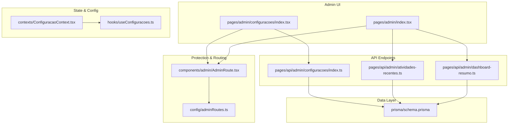
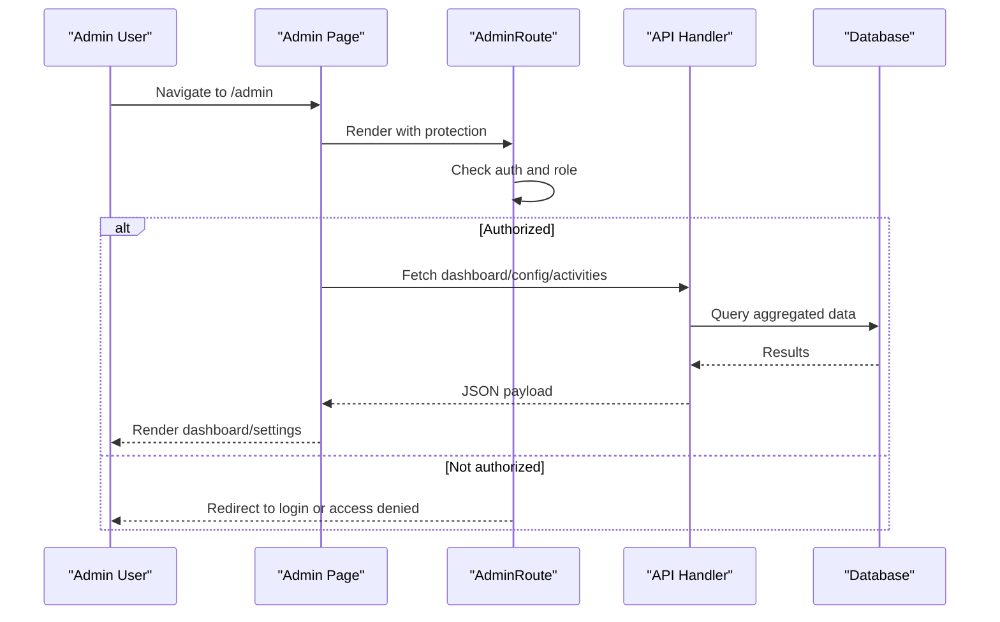
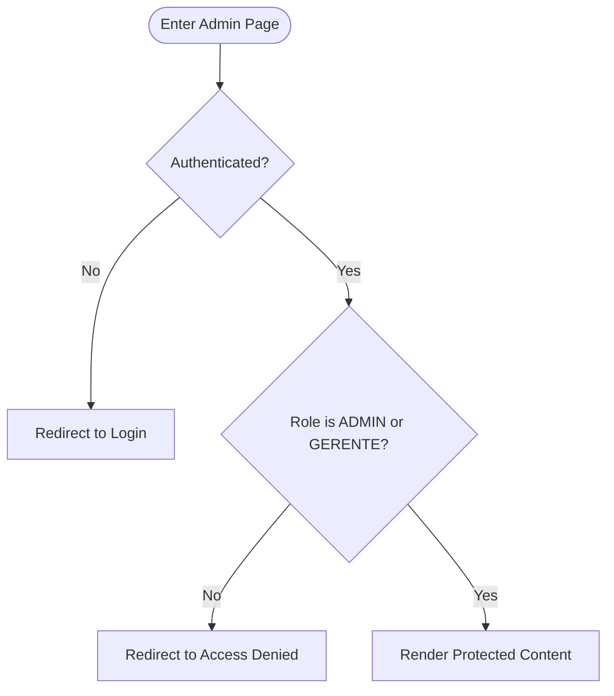
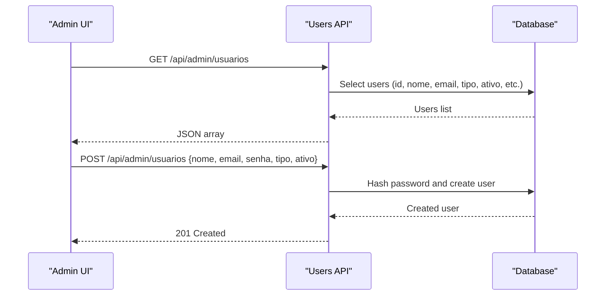
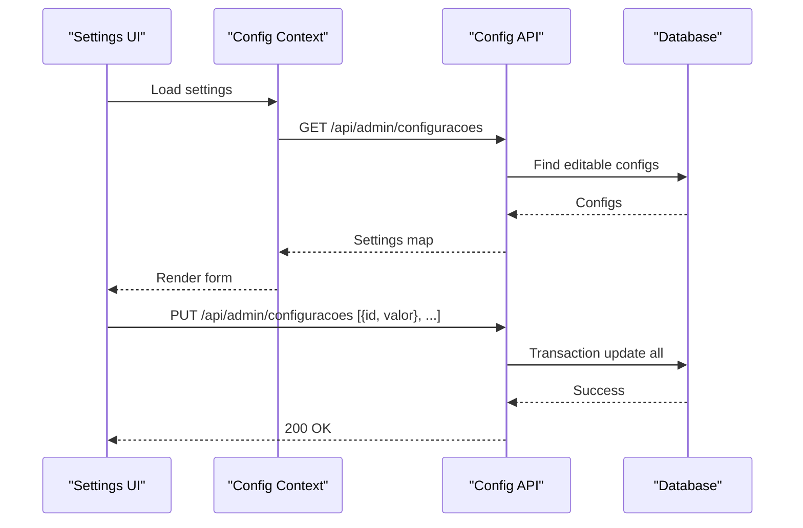
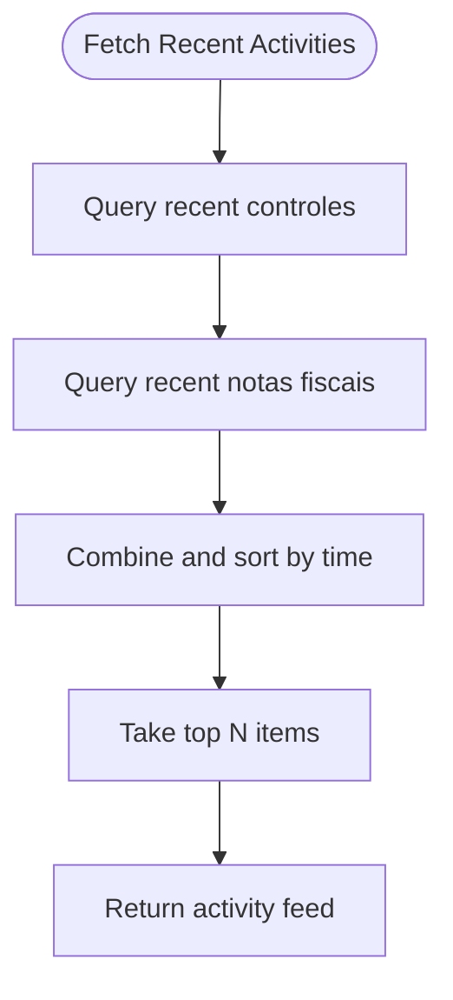
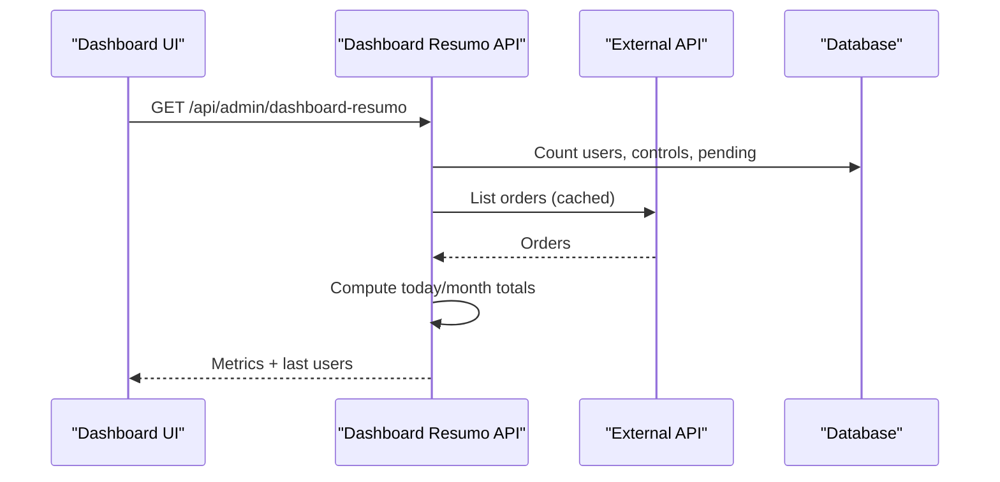
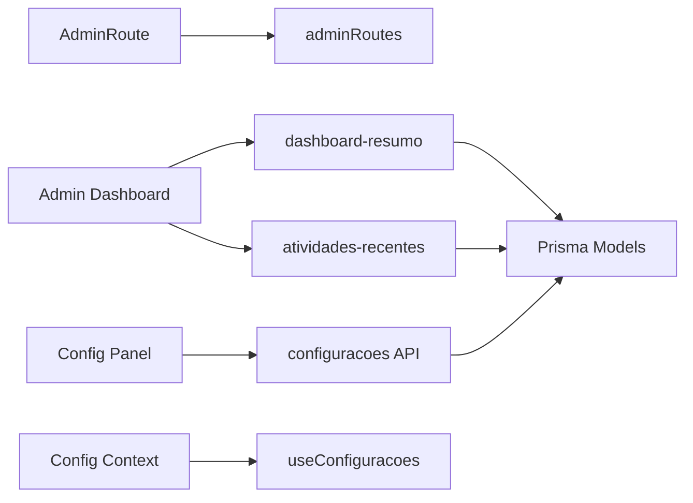

# Administration

<cite>
**Referenced Files in This Document**
- [pages/admin/index.tsx](file://pages/admin/index.tsx)
- [components/admin/AdminRoute.tsx](file://components/admin/AdminRoute.tsx)
- [config/adminRoutes.ts](file://config/adminRoutes.ts)
- [pages/api/admin/dashboard-resumo.ts](file://pages/api/admin/dashboard-resumo.ts)
- [pages/api/admin/atividades-recentes.ts](file://pages/api/admin/atividades-recentes.ts)
- [pages/api/admin/configuracoes/index.ts](file://pages/api/admin/configuracoes/index.ts)
- [pages/admin/configuracoes/index.tsx](file://pages/admin/configuracoes/index.tsx)
- [contexts/ConfiguracaoContext.tsx](file://contexts/ConfiguracaoContext.tsx)
- [hooks/useConfiguracoes.ts](file://hooks/useConfiguracoes.ts)
- [types/auth-types.ts](file://types/auth-types.ts)
- [prisma/schema.prisma](file://prisma/schema.prisma)
</cite>

## Table of Contents
1. Introduction
2. Project Structure
3. Core Components
4. Architecture Overview
5. Detailed Component Analysis
6. Dependency Analysis
7. Performance Considerations
8. Troubleshooting Guide
9. Conclusion

## Introduction
This document explains the administrative functions and system management features implemented in the application. It covers user management interfaces, system configuration panels, audit logging, and administrative dashboards. It also documents role-based access control for administrators, user creation and permission management, system settings configuration, monitoring capabilities, procedures for maintenance and recovery, performance monitoring, troubleshooting common tasks, security considerations, and best practices for system administration.

## Project Structure
Administrative functionality is organized into:
- Admin UI pages under pages/admin with protected routes via a shared component
- API endpoints under pages/api/admin for dashboard data, recent activities, and system configuration
- Shared routing and role checks via components/admin and config/adminRoutes
- Configuration context and hooks to load and persist system settings
- Data models defined in Prisma schema for users, configurations, and audit logs

**Diagram sources**
- [pages/admin/index.tsx:1-398](file://pages/admin/index.tsx#L1-L398)
- [components/admin/AdminRoute.tsx:1-59](file://components/admin/AdminRoute.tsx#L1-L59)
- [config/adminRoutes.ts:1-39](file://config/adminRoutes.ts#L1-L39)
- [pages/api/admin/dashboard-resumo.ts:1-272](file://pages/api/admin/dashboard-resumo.ts#L1-L272)
- [pages/api/admin/atividades-recentes.ts:1-55](file://pages/api/admin/atividades-recentes.ts#L1-L55)
- [pages/api/admin/configuracoes/index.ts:1-76](file://pages/api/admin/configuracoes/index.ts#L1-L76)
- [pages/admin/configuracoes/index.tsx:1-313](file://pages/admin/configuracoes/index.tsx#L1-L313)
- [contexts/ConfiguracaoContext.tsx:1-90](file://contexts/ConfiguracaoContext.tsx#L1-L90)
- [hooks/useConfiguracoes.ts:1-139](file://hooks/useConfiguracoes.ts#L1-L139)
- [prisma/schema.prisma:1-200](file://prisma/schema.prisma#L1-L200)

**Section sources**
- [pages/admin/index.tsx:1-398](file://pages/admin/index.tsx#L1-L398)
- [components/admin/AdminRoute.tsx:1-59](file://components/admin/AdminRoute.tsx#L1-L59)
- [config/adminRoutes.ts:1-39](file://config/adminRoutes.ts#L1-L39)
- [pages/api/admin/dashboard-resumo.ts:1-272](file://pages/api/admin/dashboard-resumo.ts#L1-L272)
- [pages/api/admin/atividades-recentes.ts:1-55](file://pages/api/admin/atividades-recentes.ts#L1-L55)
- [pages/api/admin/configuracoes/index.ts:1-76](file://pages/api/admin/configuracoes/index.ts#L1-L76)
- [pages/admin/configuracoes/index.tsx:1-313](file://pages/admin/configuracoes/index.tsx#L1-L313)
- [contexts/ConfiguracaoContext.tsx:1-90](file://contexts/ConfiguracaoContext.tsx#L1-L90)
- [hooks/useConfiguracoes.ts:1-139](file://hooks/useConfiguracoes.ts#L1-L139)
- [prisma/schema.prisma:1-200](file://prisma/schema.prisma#L1-L200)

## Core Components
- AdminRoute: Enforces authentication and role-based authorization for admin pages. Only users with ADMIN or GERENTE roles can access protected routes; others are redirected.
- Admin Dashboard (index): Displays key metrics such as total users, active users, controls, pending controls, orders today/month, and external health status. It periodically refreshes data and shows integration health indicators.
- System Configuration Panel: Allows administrators to view and edit editable system settings stored in the database. Supports multiple field types (text, number, boolean, selection) and batch updates via transactional writes.
- Configuration Context and Hooks: Centralize loading, caching, and updating of system settings across the app. Provide typed helpers to read and update individual keys.
- API Endpoints:
  - Dashboard summary: Aggregates counts from the database and computes order summaries using cached external data when available.
  - Recent activities: Compiles recent actions from controls and invoices to show an activity feed.
  - System configuration: GET returns editable settings; PUT performs batch updates; POST supports upsert for single keys.

**Section sources**
- [components/admin/AdminRoute.tsx:1-59](file://components/admin/AdminRoute.tsx#L1-L59)
- [pages/admin/index.tsx:1-398](file://pages/admin/index.tsx#L1-L398)
- [pages/admin/configuracoes/index.tsx:1-313](file://pages/admin/configuracoes/index.tsx#L1-L313)
- [contexts/ConfiguracaoContext.tsx:1-90](file://contexts/ConfiguracaoContext.tsx#L1-L90)
- [hooks/useConfiguracoes.ts:1-139](file://hooks/useConfiguracoes.ts#L1-L139)
- [pages/api/admin/dashboard-resumo.ts:1-272](file://pages/api/admin/dashboard-resumo.ts#L1-L272)
- [pages/api/admin/atividades-recentes.ts:1-55](file://pages/api/admin/atividades-recentes.ts#L1-L55)
- [pages/api/admin/configuracoes/index.ts:1-76](file://pages/api/admin/configuracoes/index.ts#L1-L76)

## Architecture Overview
The admin subsystem follows a layered architecture:
- Presentation layer: Next.js pages render admin UIs and orchestrate data fetching.
- Protection layer: AdminRoute enforces authentication and role checks before rendering protected content.
- Service/API layer: Serverless API handlers aggregate data from the database and optional external services, applying caching where appropriate.
- Data layer: Prisma models define entities like Usuario, ConfiguracaoSistema, AuditoriaAcesso, ControleCarga, NotaFiscal, and related relations.

**Diagram sources**
- [components/admin/AdminRoute.tsx:1-59](file://components/admin/AdminRoute.tsx#L1-L59)
- [pages/admin/index.tsx:1-398](file://pages/admin/index.tsx#L1-L398)
- [pages/api/admin/dashboard-resumo.ts:1-272](file://pages/api/admin/dashboard-resumo.ts#L1-L272)
- [pages/api/admin/configuracoes/index.ts:1-76](file://pages/api/admin/configuracoes/index.ts#L1-L76)
- [prisma/schema.prisma:1-200](file://prisma/schema.prisma#L1-L200)

## Detailed Component Analysis

### Role-Based Access Control (RBAC)
- AdminRoute validates authentication and ensures the user has ADMIN or GERENTE roles before allowing access to admin pages. Unauthorized users are redirected to login or an access-denied page.
- Route definitions in adminRoutes restrict certain paths to specific roles, enabling consistent navigation and menu filtering based on permissions.

**Diagram sources**
- [components/admin/AdminRoute.tsx:1-59](file://components/admin/AdminRoute.tsx#L1-L59)
- [config/adminRoutes.ts:1-39](file://config/adminRoutes.ts#L1-L39)
- [types/auth-types.ts:1-56](file://types/auth-types.ts#L1-L56)

**Section sources**
- [components/admin/AdminRoute.tsx:1-59](file://components/admin/AdminRoute.tsx#L1-L59)
- [config/adminRoutes.ts:1-39](file://config/adminRoutes.ts#L1-L39)
- [types/auth-types.ts:1-56](file://types/auth-types.ts#L1-L56)

### User Management Interface
- The admin dashboard aggregates user statistics and displays recent users. While the dedicated user management page is not included here, the dashboard demonstrates how to list users and compute active counts.
- The API endpoint for users supports listing and creating new users with hashed passwords and default roles.

**Diagram sources**
- [pages/admin/index.tsx:1-398](file://pages/admin/index.tsx#L1-L398)

**Section sources**
- [pages/admin/index.tsx:1-398](file://pages/admin/index.tsx#L1-L398)

### System Configuration Panel
- The configuration panel loads editable settings from the database and allows administrators to update them in bulk. Updates are performed within a transaction to ensure consistency.
- The configuration context provides a centralized way to fetch, cache, and update settings across the application, including typed getters and updaters.

**Diagram sources**
- [pages/admin/configuracoes/index.tsx:1-313](file://pages/admin/configuracoes/index.tsx#L1-L313)
- [pages/api/admin/configuracoes/index.ts:1-76](file://pages/api/admin/configuracoes/index.ts#L1-L76)
- [contexts/ConfiguracaoContext.tsx:1-90](file://contexts/ConfiguracaoContext.tsx#L1-L90)
- [hooks/useConfiguracoes.ts:1-139](file://hooks/useConfiguracoes.ts#L1-L139)
- [prisma/schema.prisma:1-200](file://prisma/schema.prisma#L1-L200)

**Section sources**
- [pages/admin/configuracoes/index.tsx:1-313](file://pages/admin/configuracoes/index.tsx#L1-L313)
- [pages/api/admin/configuracoes/index.ts:1-76](file://pages/api/admin/configuracoes/index.ts#L1-L76)
- [contexts/ConfiguracaoContext.tsx:1-90](file://contexts/ConfiguracaoContext.tsx#L1-L90)
- [hooks/useConfiguracoes.ts:1-139](file://hooks/useConfiguracoes.ts#L1-L139)
- [prisma/schema.prisma:1-200](file://prisma/schema.prisma#L1-L200)

### Audit Logging and Recent Activities
- Recent activities are compiled from recent controls and invoices, showing who performed actions and when. This provides visibility into system usage without a dedicated audit log table.
- The schema includes an audit model for access logs, which can be used to record administrative actions for compliance and troubleshooting.

**Diagram sources**
- [pages/api/admin/atividades-recentes.ts:1-55](file://pages/api/admin/atividades-recentes.ts#L1-L55)
- [prisma/schema.prisma:1-200](file://prisma/schema.prisma#L1-L200)

**Section sources**
- [pages/api/admin/atividades-recentes.ts:1-55](file://pages/api/admin/atividades-recentes.ts#L1-L55)
- [prisma/schema.prisma:1-200](file://prisma/schema.prisma#L1-L200)

### Administrative Dashboard
- The dashboard aggregates key metrics and integrates with external services to compute order summaries. It uses in-memory caching to reduce latency and external API calls.
- Health checks indicate whether external credentials are configured and if the database is connected, aiding operational monitoring.

**Diagram sources**
- [pages/admin/index.tsx:1-398](file://pages/admin/index.tsx#L1-L398)
- [pages/api/admin/dashboard-resumo.ts:1-272](file://pages/api/admin/dashboard-resumo.ts#L1-L272)

**Section sources**
- [pages/admin/index.tsx:1-398](file://pages/admin/index.tsx#L1-L398)
- [pages/api/admin/dashboard-resumo.ts:1-272](file://pages/api/admin/dashboard-resumo.ts#L1-L272)

## Dependency Analysis
- AdminRoute depends on authentication context and role constants to enforce access control.
- Admin pages depend on API endpoints for data aggregation and configuration updates.
- Configuration context and hooks depend on the configuration API and Prisma models to manage system settings.
- API endpoints depend on Prisma client and environment variables for external service integration.

**Diagram sources**
- [components/admin/AdminRoute.tsx:1-59](file://components/admin/AdminRoute.tsx#L1-L59)
- [config/adminRoutes.ts:1-39](file://config/adminRoutes.ts#L1-L39)
- [pages/admin/index.tsx:1-398](file://pages/admin/index.tsx#L1-L398)
- [pages/api/admin/dashboard-resumo.ts:1-272](file://pages/api/admin/dashboard-resumo.ts#L1-L272)
- [pages/api/admin/atividades-recentes.ts:1-55](file://pages/api/admin/atividades-recentes.ts#L1-L55)
- [pages/api/admin/configuracoes/index.ts:1-76](file://pages/api/admin/configuracoes/index.ts#L1-L76)
- [contexts/ConfiguracaoContext.tsx:1-90](file://contexts/ConfiguracaoContext.tsx#L1-L90)
- [hooks/useConfiguracoes.ts:1-139](file://hooks/useConfiguracoes.ts#L1-L139)
- [prisma/schema.prisma:1-200](file://prisma/schema.prisma#L1-L200)

**Section sources**
- [components/admin/AdminRoute.tsx:1-59](file://components/admin/AdminRoute.tsx#L1-L59)
- [config/adminRoutes.ts:1-39](file://config/adminRoutes.ts#L1-L39)
- [pages/admin/index.tsx:1-398](file://pages/admin/index.tsx#L1-L398)
- [pages/api/admin/dashboard-resumo.ts:1-272](file://pages/api/admin/dashboard-resumo.ts#L1-L272)
- [pages/api/admin/atividades-recentes.ts:1-55](file://pages/api/admin/atividades-recentes.ts#L1-L55)
- [pages/api/admin/configuracoes/index.ts:1-76](file://pages/api/admin/configuracoes/index.ts#L1-L76)
- [contexts/ConfiguracaoContext.tsx:1-90](file://contexts/ConfiguracaoContext.tsx#L1-L90)
- [hooks/useConfiguracoes.ts:1-139](file://hooks/useConfiguracoes.ts#L1-L139)
- [prisma/schema.prisma:1-200](file://prisma/schema.prisma#L1-L200)

## Performance Considerations
- In-memory caching for dashboard and order data reduces repeated external API calls and database queries. Cache TTLs and staleness thresholds balance freshness and performance.
- Batch updates for system configuration use transactions to minimize round trips and ensure atomicity.
- Pagination and limits are applied when fetching external order data to avoid large payloads and timeouts.
- Use of indexes in Prisma models improves query performance for frequently filtered fields.

[No sources needed since this section provides general guidance]

## Troubleshooting Guide
- Authentication and Authorization:
  - If admin pages redirect unexpectedly, verify that the user is authenticated and has ADMIN or GERENTE roles.
  - Ensure route definitions include the correct roles for each admin path.
- Configuration Panel Issues:
  - If settings fail to load or save, check network errors and server responses. The configuration API returns descriptive messages on validation failures.
  - Confirm that settings marked as editable are being updated; non-editable keys will not change.
- Dashboard and External Integration:
  - If external credentials are missing, the health indicator will show credentials absent. Configure required environment variables to enable synchronization.
  - If external API is slow or unavailable, the dashboard may return stale cached data with a warning flag.
- Audit and Activity Feed:
  - If recent activities are empty, verify that there are recent controls or invoices in the database.
  - For comprehensive audit trails, implement explicit logging to the audit model for sensitive administrative actions.

**Section sources**
- [components/admin/AdminRoute.tsx:1-59](file://components/admin/AdminRoute.tsx#L1-L59)
- [config/adminRoutes.ts:1-39](file://config/adminRoutes.ts#L1-L39)
- [pages/api/admin/configuracoes/index.ts:1-76](file://pages/api/admin/configuracoes/index.ts#L1-L76)
- [pages/api/admin/dashboard-resumo.ts:1-272](file://pages/api/admin/dashboard-resumo.ts#L1-L272)
- [pages/api/admin/atividades-recentes.ts:1-55](file://pages/api/admin/atividades-recentes.ts#L1-L55)

## Conclusion
The administrative subsystem provides robust role-based access control, a comprehensive dashboard with monitoring indicators, and a flexible system configuration interface backed by transactional updates. Audit logging is supported through both activity aggregation and a dedicated audit model. Operational reliability is enhanced by caching strategies and clear health indicators. Administrators should follow best practices for security, performance, and maintenance to ensure stable and secure operations.

[No sources needed since this section summarizes without analyzing specific files]