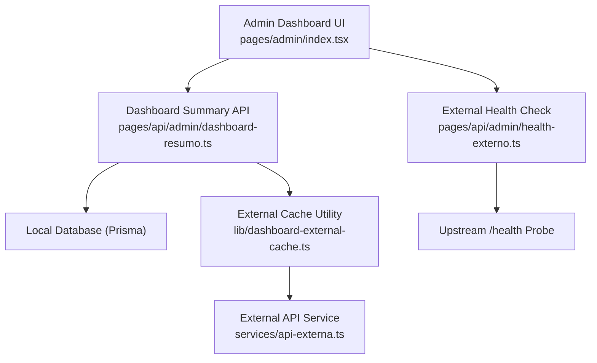
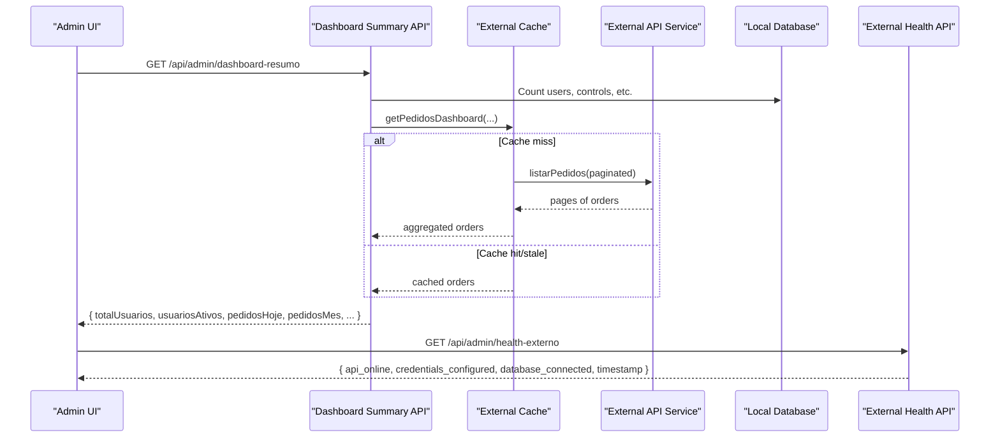
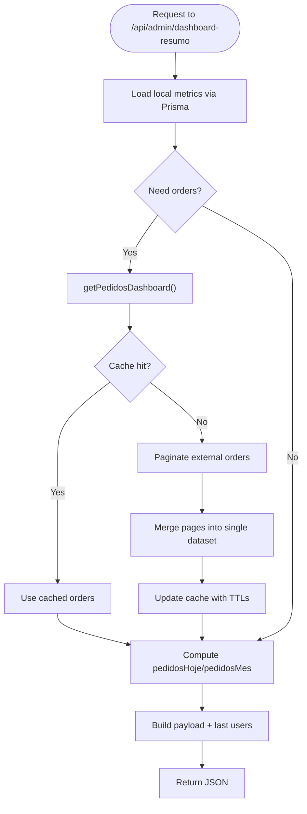
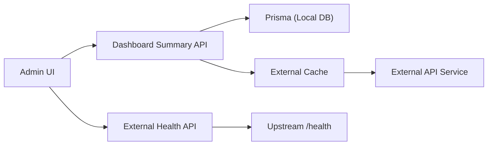

# Monitoring Dashboard

<cite>
**Referenced Files in This Document**
- [pages/admin/index.tsx](file://pages/admin/index.tsx)
- [pages/api/admin/dashboard-resumo.ts](file://pages/api/admin/dashboard-resumo.ts)
- [pages/api/admin/dashboard.ts](file://pages/api/admin/dashboard.ts)
- [pages/api/admin/atividades-recentes.ts](file://pages/api/admin/atividades-recentes.ts)
- [pages/api/admin/health-externo.ts](file://pages/api/admin/health-externo.ts)
- [lib/dashboard-freshness.ts](file://lib/dashboard-freshness.ts)
- [lib/dashboard-external-cache.ts](file://lib/dashboard-external-cache.ts)
- [services/api-externa.ts](file://services/api-externa.ts)
- [components/ui/StatCard.tsx](file://components/ui/StatCard.tsx)
- [components/dashboard/ResumoStatusPedidos.tsx](file://components/dashboard/ResumoStatusPedidos.tsx)
</cite>

## Table of Contents
1. Introduction
2. Project Structure
3. Core Components
4. Architecture Overview
5. Detailed Component Analysis
6. Dependency Analysis
7. Performance Considerations
8. Troubleshooting Guide
9. Conclusion

## Introduction
This document explains the administrative monitoring dashboard and system health monitoring capabilities. It covers real-time statistics display, system health checks, external API status monitoring, and activity tracking interfaces. It also details how dashboard metrics are calculated, how health check endpoints work, and how to interpret indicators for performance monitoring, external service connectivity, and troubleshooting.

## Project Structure
The monitoring dashboard is implemented as a Next.js application with:
- Admin UI page that renders KPI cards, recent users, and integration status
- Server-side API routes that aggregate local database metrics and fetch external order data
- Caching utilities to reduce load on external services and ensure responsive dashboards
- A dedicated external health endpoint to probe an upstream API and its database connectivity

**Diagram sources**
- [pages/admin/index.tsx:47-147](file://pages/admin/index.tsx#L47-L147)
- [pages/api/admin/dashboard-resumo.ts:197-270](file://pages/api/admin/dashboard-resumo.ts#L197-L270)
- [pages/api/admin/health-externo.ts:4-40](file://pages/api/admin/health-externo.ts#L4-L40)
- [lib/dashboard-external-cache.ts:15-91](file://lib/dashboard-external-cache.ts#L15-L91)
- [services/api-externa.ts:117-158](file://services/api-externa.ts#L117-L158)

**Section sources**
- [pages/admin/index.tsx:47-147](file://pages/admin/index.tsx#L47-L147)
- [pages/api/admin/dashboard-resumo.ts:197-270](file://pages/api/admin/dashboard-resumo.ts#L197-L270)
- [pages/api/admin/health-externo.ts:4-40](file://pages/api/admin/health-externo.ts#L4-L40)

## Core Components
- Admin Dashboard UI: Displays KPIs (users, active users, controls, pending controls, orders today/month), recent users list, and integration status. It periodically refreshes data and shows loading states.
- Dashboard Summary API: Aggregates counts from the local database and computes order summaries by fetching and caching external order data. Supports cache freshness and stale-while-revalidate behavior.
- External Health Check API: Probes an upstream API’s /health endpoint and reports online/offline status, credentials configuration, and database connectivity.
- Activity Tracking API: Returns recent activities combining control updates and invoice additions, sorted by time.
- External Cache Utility: Provides request coalescing, retries, and TTL-based caching for external order queries used by the dashboard.
- Freshness Guard: Prevents replacing valid dashboard snapshots with empty responses during updates.

**Section sources**
- [pages/admin/index.tsx:47-147](file://pages/admin/index.tsx#L47-L147)
- [pages/api/admin/dashboard-resumo.ts:197-270](file://pages/api/admin/dashboard-resumo.ts#L197-L270)
- [pages/api/admin/atividades-recentes.ts:4-54](file://pages/api/admin/atividades-recentes.ts#L4-L54)
- [pages/api/admin/health-externo.ts:4-40](file://pages/api/admin/health-externo.ts#L4-L40)
- [lib/dashboard-external-cache.ts:15-91](file://lib/dashboard-external-cache.ts#L15-L91)
- [lib/dashboard-freshness.ts:6-23](file://lib/dashboard-freshness.ts#L6-L23)

## Architecture Overview
The dashboard follows a client-server pattern with server-side aggregation and caching:
- The admin UI polls summary and health endpoints at intervals.
- The summary endpoint reads local metrics via Prisma and computes order counts using cached or freshly fetched external order data.
- The health endpoint probes an upstream service and returns a concise status object.
- Caching reduces repeated external calls and provides resilience when the upstream is slow or unavailable.

**Diagram sources**
- [pages/admin/index.tsx:53-147](file://pages/admin/index.tsx#L53-L147)
- [pages/api/admin/dashboard-resumo.ts:108-166](file://pages/api/admin/dashboard-resumo.ts#L108-L166)
- [pages/api/admin/dashboard-resumo.ts:197-270](file://pages/api/admin/dashboard-resumo.ts#L197-L270)
- [lib/dashboard-external-cache.ts:15-91](file://lib/dashboard-external-cache.ts#L15-L91)
- [services/api-externa.ts:695-749](file://services/api-externa.ts#L695-L749)
- [pages/api/admin/health-externo.ts:4-40](file://pages/api/admin/health-externo.ts#L4-L40)

## Detailed Component Analysis

### Admin Dashboard UI
- Loads summary stats and external health on mount and every 3 minutes.
- Renders stat cards with loading placeholders and animations.
- Shows integration status with live indicator for upstream API availability and credential configuration.

Key behaviors:
- Fetches /api/admin/dashboard-resumo and displays totals and recent users.
- Fetches /api/admin/health-externo and shows online/offline state and database connection status.
- Uses StatCard component for consistent metric presentation.

**Section sources**
- [pages/admin/index.tsx:47-147](file://pages/admin/index.tsx#L47-L147)
- [components/ui/StatCard.tsx:17-135](file://components/ui/StatCard.tsx#L17-L135)

### Dashboard Summary API
Responsibilities:
- Aggregate local metrics: total users, active users, total controls, pending controls.
- Compute orders today and orders this month by fetching external orders with pagination and caching.
- Return last 5 users with access timestamps.
- Apply cache headers and serve stale cache when upstream is slow.

Metrics calculation:
- Local counts use Prisma queries against user and control tables.
- Order counts filter by company ID, delivery type, closed status, and date ranges (today vs. month).
- Caching uses short TTL for freshness and longer TTL for staleness; background refresh avoids blocking responses.

**Diagram sources**
- [pages/api/admin/dashboard-resumo.ts:108-166](file://pages/api/admin/dashboard-resumo.ts#L108-L166)
- [pages/api/admin/dashboard-resumo.ts:168-195](file://pages/api/admin/dashboard-resumo.ts#L168-L195)
- [pages/api/admin/dashboard-resumo.ts:197-270](file://pages/api/admin/dashboard-resumo.ts#L197-L270)
- [lib/dashboard-external-cache.ts:15-91](file://lib/dashboard-external-cache.ts#L15-L91)

**Section sources**
- [pages/api/admin/dashboard-resumo.ts:197-270](file://pages/api/admin/dashboard-resumo.ts#L197-L270)
- [lib/dashboard-external-cache.ts:15-91](file://lib/dashboard-external-cache.ts#L15-L91)

### External Health Check API
Responsibilities:
- Probe upstream /health endpoint with timeout.
- Report whether the upstream API is online, if credentials are configured, and whether the upstream reports database connected.
- Provide timestamp and details for diagnostics.

Interpretation:
- api_online true indicates successful HTTP response from upstream /health.
- credentials_configured true means required environment variables are set.
- database_connected reflects upstream’s reported database status.

**Section sources**
- [pages/api/admin/health-externo.ts:4-40](file://pages/api/admin/health-externo.ts#L4-L40)

### Activity Tracking API
Responsibilities:
- Retrieve recent control updates and invoice additions.
- Combine into a unified timeline sorted by time.
- Include user names where available.

Usage:
- Can be integrated into an “Activity Feed” widget to show recent system actions.

**Section sources**
- [pages/api/admin/atividades-recentes.ts:4-54](file://pages/api/admin/atividades-recentes.ts#L4-L54)

### External Cache Utility
Responsibilities:
- Coalesce concurrent requests for the same key.
- Paginate external orders and retry failed offsets.
- Maintain fresh and stale windows to balance responsiveness and accuracy.
- Return null when no data is available unless stale cache exists within TTL.

Benefits:
- Reduces load on external API.
- Improves dashboard responsiveness under network issues.

**Section sources**
- [lib/dashboard-external-cache.ts:15-91](file://lib/dashboard-external-cache.ts#L15-L91)

### Freshness Guard
Responsibilities:
- Ensure a valid previous dashboard snapshot is not replaced by an empty response during updates.
- Compare generated timestamps and filter totals to decide replacement.

Usage:
- Protects UI from flickering to empty state when backend temporarily returns no data.

**Section sources**
- [lib/dashboard-freshness.ts:6-23](file://lib/dashboard-freshness.ts#L6-L23)

### Status Summary Component
Responsibilities:
- Render a grid of status tiles showing counts per status category.
- Filter out zero-count items except for specific alert categories.

Usage:
- Useful for displaying breakdowns like orders by status or pending tasks.

**Section sources**
- [components/dashboard/ResumoStatusPedidos.tsx:1-18](file://components/dashboard/ResumoStatusPedidos.tsx#L1-L18)

## Dependency Analysis
- Admin UI depends on:
  - Dashboard Summary API for metrics and recent users
  - External Health API for integration status
  - StatCard component for metric visualization
- Dashboard Summary API depends on:
  - Prisma for local metrics
  - External Cache Utility for order data
  - External API Service for authenticated requests
- External API Service handles:
  - Token management and retries
  - Multiple endpoints for notes, clients, and orders
  - Timeouts and error handling

**Diagram sources**
- [pages/admin/index.tsx:47-147](file://pages/admin/index.tsx#L47-L147)
- [pages/api/admin/dashboard-resumo.ts:197-270](file://pages/api/admin/dashboard-resumo.ts#L197-L270)
- [lib/dashboard-external-cache.ts:15-91](file://lib/dashboard-external-cache.ts#L15-L91)
- [services/api-externa.ts:117-158](file://services/api-externa.ts#L117-L158)
- [pages/api/admin/health-externo.ts:4-40](file://pages/api/admin/health-externo.ts#L4-L40)

**Section sources**
- [services/api-externa.ts:117-158](file://services/api-externa.ts#L117-L158)
- [pages/api/admin/dashboard-resumo.ts:197-270](file://pages/api/admin/dashboard-resumo.ts#L197-L270)
- [lib/dashboard-external-cache.ts:15-91](file://lib/dashboard-external-cache.ts#L15-L91)

## Performance Considerations
- Caching strategy:
  - Short TTL for freshness and longer TTL for staleness ensures quick UI updates while minimizing upstream calls.
  - Request coalescing prevents duplicate paginated fetches.
- Timeouts:
  - External API timeouts prevent long UI hangs; dashboard can fall back to stale cache.
- Pagination:
  - Paginated order retrieval limits memory usage and improves reliability.
- UI responsiveness:
  - Loading skeletons and animations improve perceived performance.
- Background refresh:
  - Stale cache triggers background refresh without blocking current response.

[No sources needed since this section provides general guidance]

## Troubleshooting Guide
Common issues and how to interpret dashboard indicators:

- Upstream API offline:
  - Indicator: api_online false in health endpoint response.
  - Action: Check network connectivity and upstream service status. Verify base URL and firewall rules.

- Missing credentials:
  - Indicator: credentials_configured false.
  - Action: Set API_EXTERNA_USERNAME and API_EXTERNA_PASSWORD in environment configuration.

- Upstream database disconnected:
  - Indicator: database_connected false.
  - Action: Investigate upstream database connectivity and health endpoint logic.

- Slow or unresponsive external API:
  - Indicator: Dashboard may show stale flag or warning message.
  - Action: Increase timeouts or adjust cache TTLs; monitor upstream latency.

- Empty dashboard metrics:
  - Indicator: Zero values for orders or controls.
  - Action: Verify filters and data sources; ensure external orders exist and match criteria (company ID, delivery type, closed status).

- Recent activities not updating:
  - Indicator: No entries in activity feed.
  - Action: Confirm recent updates in controls and invoices; verify database records and query logic.

**Section sources**
- [pages/api/admin/health-externo.ts:4-40](file://pages/api/admin/health-externo.ts#L4-L40)
- [pages/api/admin/dashboard-resumo.ts:197-270](file://pages/api/admin/dashboard-resumo.ts#L197-L270)
- [pages/api/admin/atividades-recentes.ts:4-54](file://pages/api/admin/atividades-recentes.ts#L4-L54)

## Conclusion
The administrative monitoring dashboard provides a comprehensive view of system health, operational metrics, and external integrations. By leveraging caching, timeouts, and clear health indicators, it enables operators to quickly assess performance, detect issues, and take corrective actions. Use the health endpoint to validate external connectivity, rely on cached order data for stable metrics, and monitor activity feeds for recent system changes.

[No sources needed since this section summarizes without analyzing specific files]