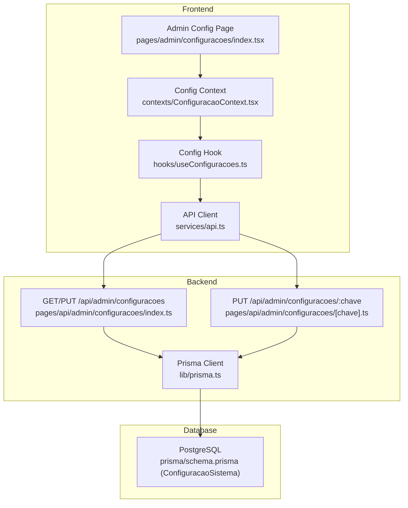
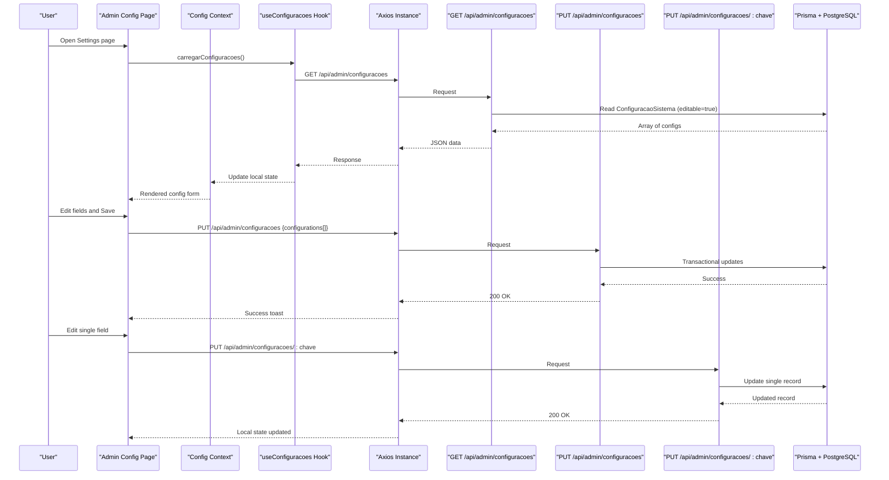
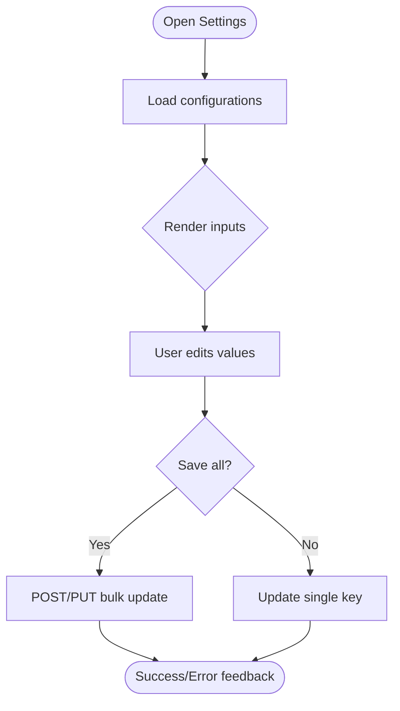
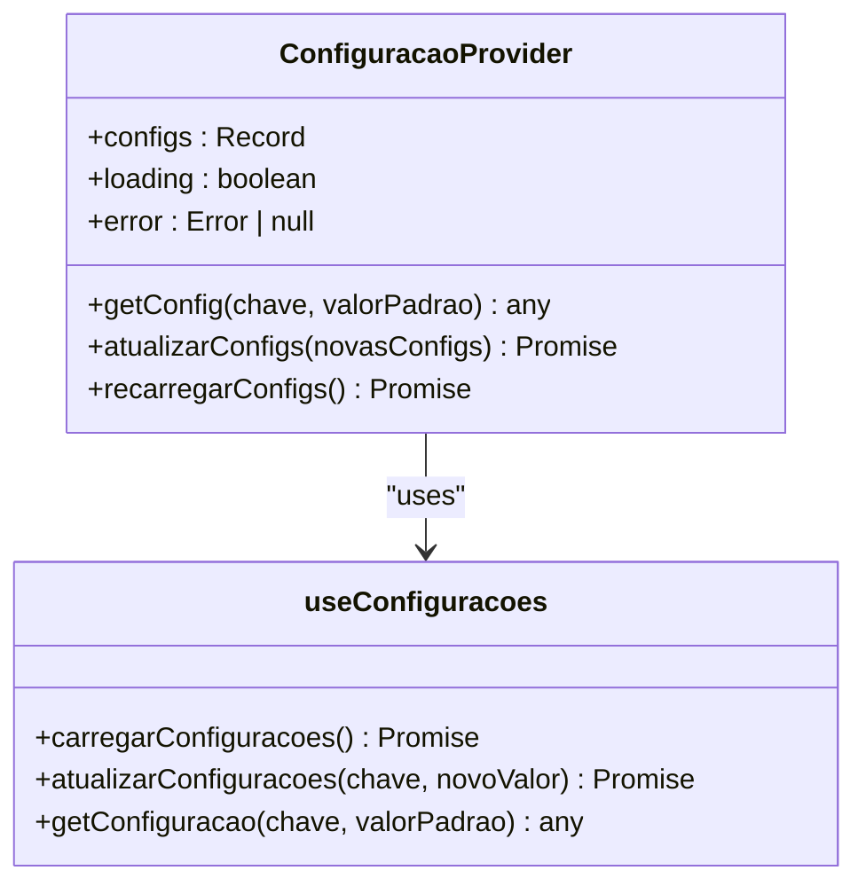
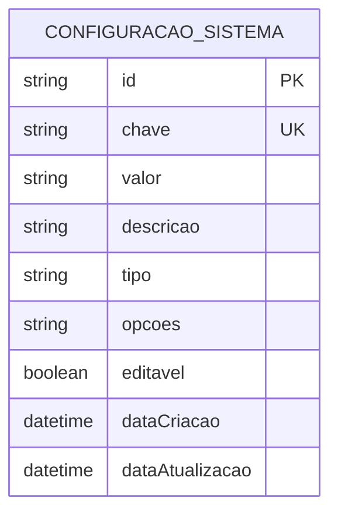
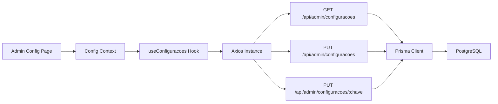

# System Configuration

<cite>
**Referenced Files in This Document**
- [pages/admin/configuracoes/index.tsx](file://pages/admin/configuracoes/index.tsx)
- [contexts/ConfiguracaoContext.tsx](file://contexts/ConfiguracaoContext.tsx)
- [hooks/useConfiguracoes.ts](file://hooks/useConfiguracoes.ts)
- [services/api.ts](file://services/api.ts)
- [pages/api/admin/configuracoes/index.ts](file://pages/api/admin/configuracoes/index.ts)
- [pages/api/admin/configuracoes/[chave].ts](file://pages/api/admin/configuracoes/[chave].ts)
- [prisma/schema.prisma](file://prisma/schema.prisma)
- [lib/prisma.ts](file://lib/prisma.ts)
- [env.example.txt](file://env.example.txt)
</cite>

## Table of Contents
1. Introduction
2. Project Structure
3. Core Components
4. Architecture Overview
5. Detailed Component Analysis
6. Dependency Analysis
7. Performance Considerations
8. Troubleshooting Guide
9. Conclusion

## Introduction
This document explains the system configuration management capabilities, including configuration panels for system settings, external service integrations, and application parameters. It covers how configurations are loaded, validated, persisted, and applied at runtime, as well as environment variable management and security considerations. It also provides procedures for configuring external APIs, managing system parameters, applying changes, and guidance on backup and rollback strategies.

## Project Structure
The configuration feature spans UI components, hooks, context providers, API routes, and database schema:
- Admin UI panel to view and edit system settings
- Context and hooks to load, cache, and update configuration values
- Next.js API routes to read and write configuration records
- Prisma model for persistent storage of key-value settings
- Environment variables for runtime configuration and secrets

**Diagram sources**
- [pages/admin/configuracoes/index.tsx:1-313](file://pages/admin/configuracoes/index.tsx#L1-L313)
- [contexts/ConfiguracaoContext.tsx:1-90](file://contexts/ConfiguracaoContext.tsx#L1-L90)
- [hooks/useConfiguracoes.ts:1-139](file://hooks/useConfiguracoes.ts#L1-L139)
- [services/api.ts:1-175](file://services/api.ts#L1-L175)
- [pages/api/admin/configuracoes/index.ts:1-76](file://pages/api/admin/configuracoes/index.ts#L1-L76)
- [pages/api/admin/configuracoes/[chave].ts:1-39](file://pages/api/admin/configuracoes/[chave].ts#L1-L39)
- [lib/prisma.ts:1-19](file://lib/prisma.ts#L1-L19)
- [prisma/schema.prisma:113-125](file://prisma/schema.prisma#L113-L125)

**Section sources**
- [pages/admin/configuracoes/index.tsx:1-313](file://pages/admin/configuracoes/index.tsx#L1-L313)
- [contexts/ConfiguracaoContext.tsx:1-90](file://contexts/ConfiguracaoContext.tsx#L1-L90)
- [hooks/useConfiguracoes.ts:1-139](file://hooks/useConfiguracoes.ts#L1-L139)
- [services/api.ts:1-175](file://services/api.ts#L1-L175)
- [pages/api/admin/configuracoes/index.ts:1-76](file://pages/api/admin/configuracoes/index.ts#L1-L76)
- [pages/api/admin/configuracoes/[chave].ts:1-39](file://pages/api/admin/configuracoes/[chave].ts#L1-L39)
- [lib/prisma.ts:1-19](file://lib/prisma.ts#L1-L19)
- [prisma/schema.prisma:113-125](file://prisma/schema.prisma#L113-L125)

## Core Components
- Admin Configuration Panel: Renders a form with dynamic inputs based on stored configuration metadata (type, options, description). Supports text, number, boolean, and selection fields. Submits all changes in one transactional batch or updates single keys.
- Configuration Context and Hooks: Provide typed access to configuration values, loading state, error handling, and methods to fetch and update individual or bulk settings.
- API Routes: Expose endpoints to list editable configurations, update them in bulk via a transaction, and update a single configuration by key.
- Persistence Layer: Uses Prisma to persist key-value pairs with type hints and metadata.

Key responsibilities:
- Load and cache configuration values client-side
- Validate input types before sending updates
- Persist changes atomically when possible
- Surface errors and user feedback

**Section sources**
- [pages/admin/configuracoes/index.tsx:25-98](file://pages/admin/configuracoes/index.tsx#L25-L98)
- [contexts/ConfiguracaoContext.tsx:15-68](file://contexts/ConfiguracaoContext.tsx#L15-L68)
- [hooks/useConfiguracoes.ts:14-121](file://hooks/useConfiguracoes.ts#L14-L121)
- [pages/api/admin/configuracoes/index.ts:4-76](file://pages/api/admin/configuracoes/index.ts#L4-L76)
- [pages/api/admin/configuracoes/[chave].ts:4-39](file://pages/api/admin/configuracoes/[chave].ts#L4-L39)
- [prisma/schema.prisma:113-125](file://prisma/schema.prisma#L113-L125)

## Architecture Overview
The configuration flow integrates frontend UI, context/hook layer, API routes, and database persistence.

**Diagram sources**
- [pages/admin/configuracoes/index.tsx:52-98](file://pages/admin/configuracoes/index.tsx#L52-L98)
- [hooks/useConfiguracoes.ts:20-97](file://hooks/useConfiguracoes.ts#L20-L97)
- [services/api.ts:21-41](file://services/api.ts#L21-L41)
- [pages/api/admin/configuracoes/index.ts:4-76](file://pages/api/admin/configuracoes/index.ts#L4-L76)
- [pages/api/admin/configuracoes/[chave].ts:4-39](file://pages/api/admin/configuracoes/[chave].ts#L4-L39)
- [lib/prisma.ts:1-19](file://lib/prisma.ts#L1-L19)
- [prisma/schema.prisma:113-125](file://prisma/schema.prisma#L113-L125)

## Detailed Component Analysis

### Admin Configuration Panel
- Loads all editable configurations from the backend and renders appropriate input controls based on each configuration’s type and options.
- Supports saving all changes in a single request using a transactional endpoint, or updating a single key directly.
- Provides user feedback via toast notifications and handles errors gracefully.

**Diagram sources**
- [pages/admin/configuracoes/index.tsx:52-98](file://pages/admin/configuracoes/index.tsx#L52-L98)
- [pages/api/admin/configuracoes/index.ts:29-76](file://pages/api/admin/configuracoes/index.ts#L29-L76)
- [pages/api/admin/configuracoes/[chave].ts:15-39](file://pages/api/admin/configuracoes/[chave].ts#L15-L39)

**Section sources**
- [pages/admin/configuracoes/index.tsx:52-98](file://pages/admin/configuracoes/index.tsx#L52-L98)
- [pages/api/admin/configuracoes/index.ts:29-76](file://pages/api/admin/configuracoes/index.ts#L29-L76)
- [pages/api/admin/configuracoes/[chave].ts:15-39](file://pages/api/admin/configuracoes/[chave].ts#L15-L39)

### Configuration Context and Hooks
- The context exposes methods to get configuration values with defaults, update configurations, and reload them.
- The hook loads configurations once authenticated, converts string values to proper types (number, boolean, json), and caches them locally.
- Single-key updates are supported via a dedicated endpoint.

**Diagram sources**
- [contexts/ConfiguracaoContext.tsx:15-68](file://contexts/ConfiguracaoContext.tsx#L15-L68)
- [hooks/useConfiguracoes.ts:14-121](file://hooks/useConfiguracoes.ts#L14-L121)

**Section sources**
- [contexts/ConfiguracaoContext.tsx:15-68](file://contexts/ConfiguracaoContext.tsx#L15-L68)
- [hooks/useConfiguracoes.ts:14-121](file://hooks/useConfiguracoes.ts#L14-L121)

### API Endpoints
- GET /api/admin/configuracoes: Returns all editable configurations with metadata (key, value, type, options, description).
- PUT /api/admin/configuracoes: Batch updates multiple configuration values within a transaction.
- PUT /api/admin/configuracoes/:chave: Updates a single configuration by key.

Validation and persistence:
- Input validation ensures correct payload structure.
- Bulk updates run inside a database transaction for consistency.
- Single updates validate existence before modifying.

**Section sources**
- [pages/api/admin/configuracoes/index.ts:4-76](file://pages/api/admin/configuracoes/index.ts#L4-L76)
- [pages/api/admin/configuracoes/[chave].ts:4-39](file://pages/api/admin/configuracoes/[chave].ts#L4-L39)

### Database Model
- ConfiguracaoSistema stores key-value pairs with type hints and metadata.
- Unique constraint on chave ensures one setting per key.
- editavel flag controls visibility/editability in the admin UI.

**Diagram sources**
- [prisma/schema.prisma:113-125](file://prisma/schema.prisma#L113-L125)

**Section sources**
- [prisma/schema.prisma:113-125](file://prisma/schema.prisma#L113-L125)

## Dependency Analysis
- Frontend depends on Axios instance configured with base URL and credentials.
- Context and hooks depend on API routes for data fetching and updates.
- API routes depend on Prisma client and PostgreSQL database.
- Environment variables drive API base URL and other runtime settings.

**Diagram sources**
- [services/api.ts:21-41](file://services/api.ts#L21-L41)
- [hooks/useConfiguracoes.ts:20-97](file://hooks/useConfiguracoes.ts#L20-L97)
- [pages/api/admin/configuracoes/index.ts:4-76](file://pages/api/admin/configuracoes/index.ts#L4-L76)
- [pages/api/admin/configuracoes/[chave].ts:4-39](file://pages/api/admin/configuracoes/[chave].ts#L4-L39)
- [lib/prisma.ts:1-19](file://lib/prisma.ts#L1-L19)

**Section sources**
- [services/api.ts:21-41](file://services/api.ts#L21-L41)
- [hooks/useConfiguracoes.ts:20-97](file://hooks/useConfiguracoes.ts#L20-L97)
- [pages/api/admin/configuracoes/index.ts:4-76](file://pages/api/admin/configuracoes/index.ts#L4-L76)
- [pages/api/admin/configuracoes/[chave].ts:4-39](file://pages/api/admin/configuracoes/[chave].ts#L4-L39)
- [lib/prisma.ts:1-19](file://lib/prisma.ts#L1-L19)

## Performance Considerations
- Use bulk updates to minimize network round-trips and ensure atomicity.
- Cache configuration values client-side to avoid repeated requests.
- Leverage unique constraints and indexes on configuration keys for fast lookups.
- Avoid unnecessary re-renders by comparing previous and new configuration states before updating.

[No sources needed since this section provides general guidance]

## Troubleshooting Guide
Common issues and resolutions:
- Authentication failures: Ensure cookies/tokens are present; the API client attaches Authorization headers and withCredentials.
- Permission errors: If not authenticated as admin, configuration endpoints may return 403; verify user role and session.
- Validation errors: Check payload format for bulk updates; ensure array of configuration objects with ids and values.
- Network errors: Verify NEXT_PUBLIC_API_URL and CORS settings; confirm server is reachable.

Operational checks:
- Confirm database connectivity and Prisma client initialization.
- Validate that configurations marked as editable are returned by the GET endpoint.
- Inspect logs for detailed error messages from API routes.

**Section sources**
- [services/api.ts:46-115](file://services/api.ts#L46-L115)
- [hooks/useConfiguracoes.ts:58-74](file://hooks/useConfiguracoes.ts#L58-L74)
- [pages/api/admin/configuracoes/index.ts:25-51](file://pages/api/admin/configuracoes/index.ts#L25-L51)
- [pages/api/admin/configuracoes/[chave].ts:15-39](file://pages/api/admin/configuracoes/[chave].ts#L15-L39)

## Conclusion
The system provides a robust configuration management solution with a user-friendly admin panel, typed client-side access, secure and efficient API endpoints, and reliable persistence via Prisma and PostgreSQL. Administrators can configure system settings, integrate external services through configurable parameters, and apply changes safely with transactional updates. Environment variables manage runtime configuration, while best practices around validation, caching, and error handling ensure stability and performance.

[No sources needed since this section summarizes without analyzing specific files]

## Appendices

### Procedures

#### Configure External APIs
- Add or update configuration entries in the admin panel for endpoints, tokens, timeouts, and flags.
- For new services, create corresponding configuration keys with appropriate types (string, number, boolean, json) and mark them editable if needed.
- Validate integration by triggering relevant actions and checking responses.

**Section sources**
- [pages/admin/configuracoes/index.tsx:110-170](file://pages/admin/configuracoes/index.tsx#L110-L170)
- [pages/api/admin/configuracoes/index.ts:4-28](file://pages/api/admin/configuracoes/index.ts#L4-L28)

#### Manage System Parameters
- Use the admin panel to adjust operational parameters such as rate limits, feature toggles, and behavior flags.
- Prefer bulk updates for multiple related parameters to maintain consistency.

**Section sources**
- [pages/admin/configuracoes/index.tsx:79-98](file://pages/admin/configuracoes/index.tsx#L79-L98)
- [pages/api/admin/configuracoes/index.ts:29-47](file://pages/api/admin/configuracoes/index.ts#L29-L47)

#### Apply Configuration Changes
- After editing, click Save to submit changes. Bulk saves use a transactional endpoint to ensure all updates succeed together.
- For single-field changes, the dedicated endpoint updates the specific key atomically.

**Section sources**
- [pages/admin/configuracoes/index.tsx:79-98](file://pages/admin/configuracoes/index.tsx#L79-L98)
- [pages/api/admin/configuracoes/[chave].ts:15-39](file://pages/api/admin/configuracoes/[chave].ts#L15-L39)

### Security
- Sensitive values should be stored in environment variables rather than configuration records where possible.
- Restrict access to configuration endpoints to authorized users; non-admin users receive empty sets or permission errors.
- Use HTTPS and secure cookies in production; ensure CORS is properly configured.

**Section sources**
- [env.example.txt:10-38](file://env.example.txt#L10-L38)
- [services/api.ts:32-41](file://services/api.ts#L32-L41)
- [hooks/useConfiguracoes.ts:58-74](file://hooks/useConfiguracoes.ts#L58-L74)

### Backup and Rollback
- Back up the ConfiguracaoSistema table regularly to preserve current settings.
- Maintain versioned snapshots of critical configuration sets before major changes.
- To rollback, restore the backed-up rows or reapply known-good configuration values via the admin panel or scripts.

[No sources needed since this section provides general guidance]