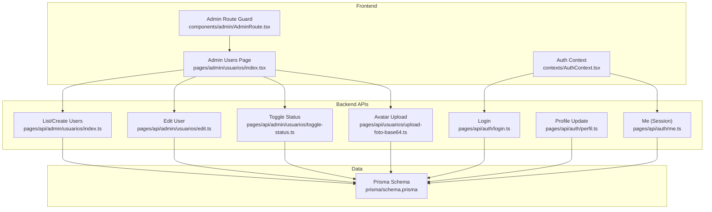
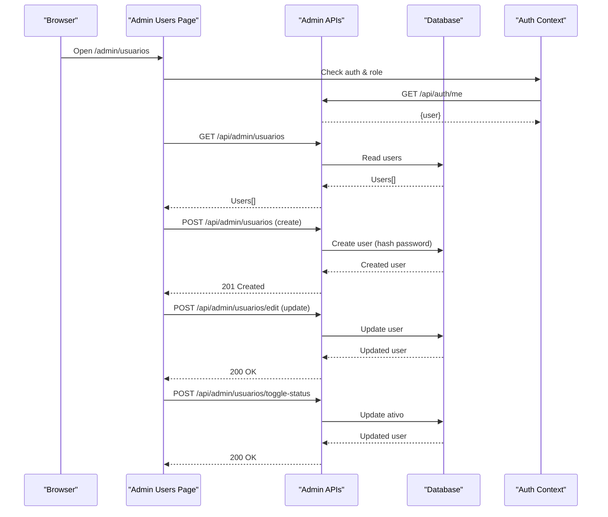
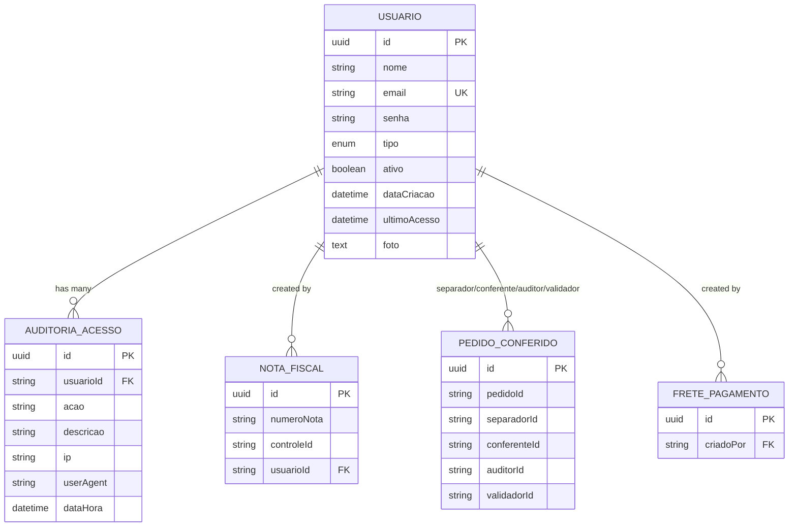
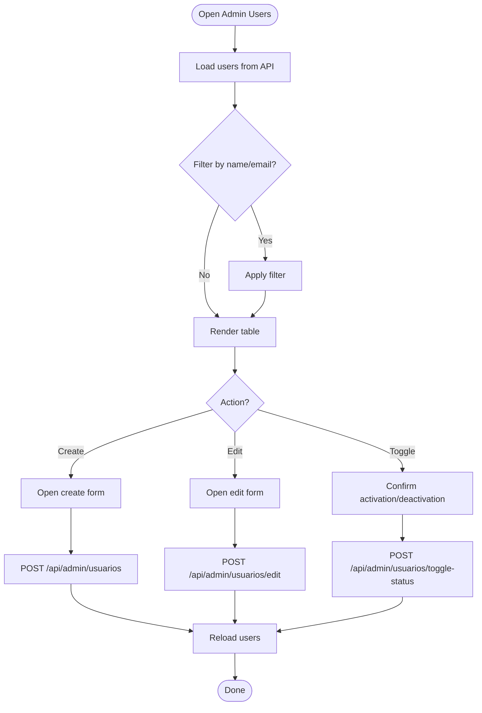
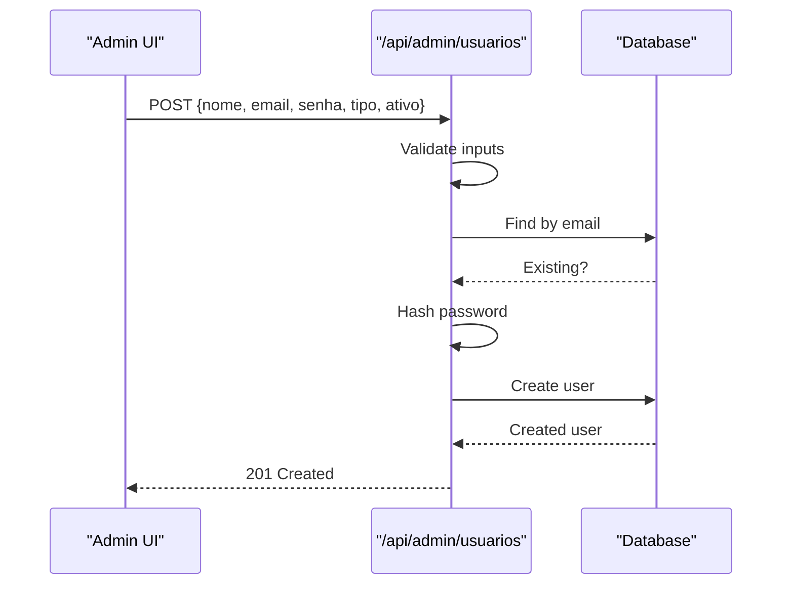
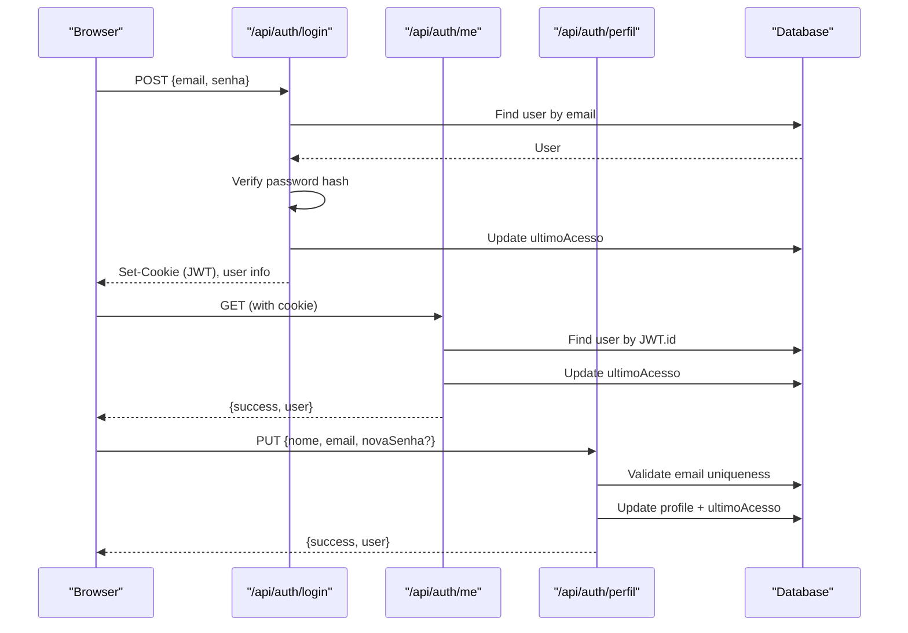
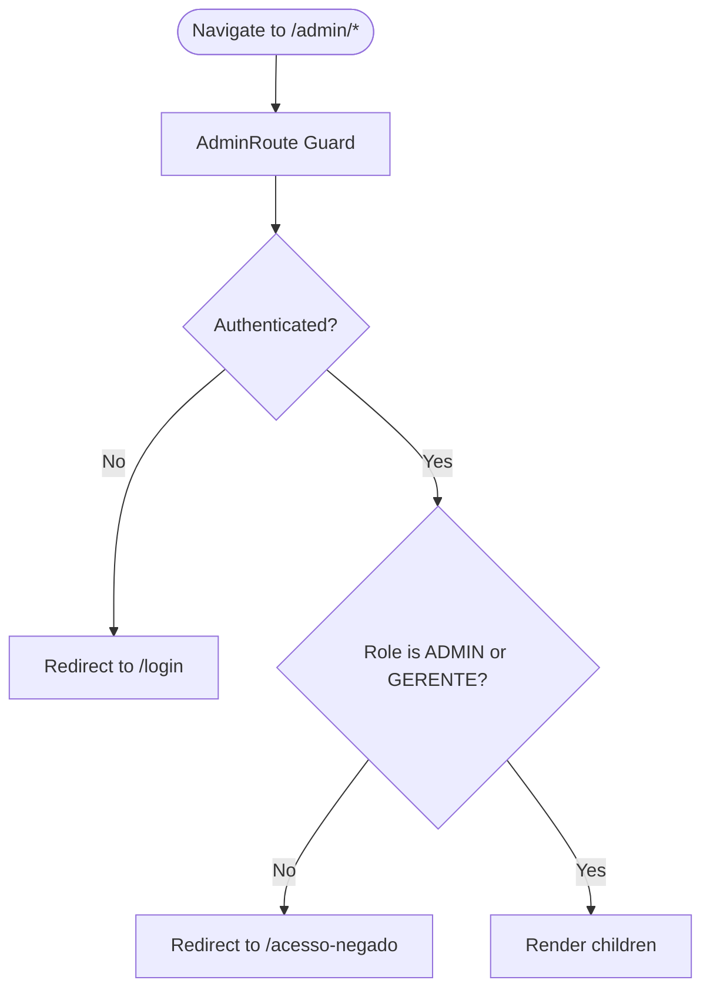
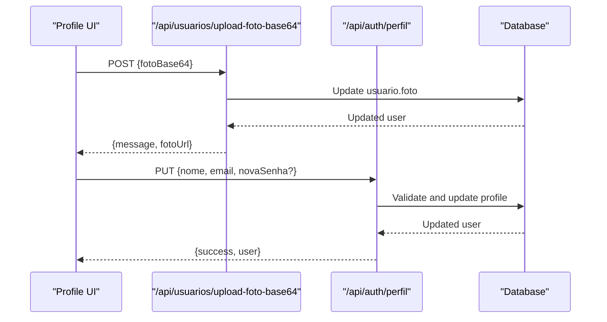
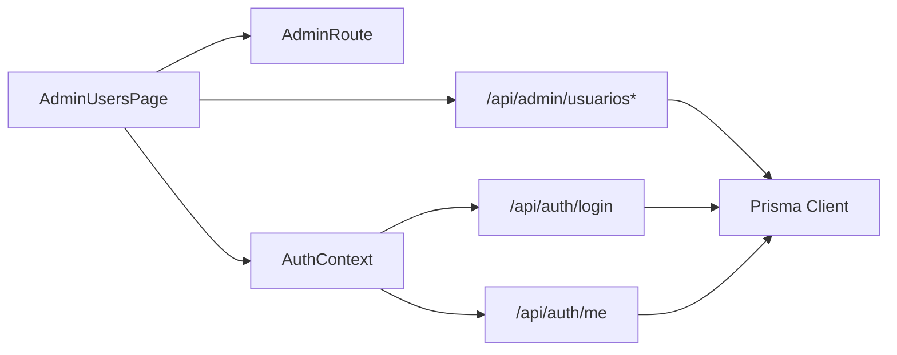

# User Management

<cite>
**Referenced Files in This Document**
- [schema.prisma](file://prisma/schema.prisma)
- [index.tsx](file://pages/admin/usuarios/index.tsx)
- [index.ts](file://pages/api/admin/usuarios/index.ts)
- [edit.ts](file://pages/api/admin/usuarios/edit.ts)
- [toggle-status.ts](file://pages/api/admin/usuarios/toggle-status.ts)
- [login.ts](file://pages/api/auth/login.ts)
- [me.ts](file://pages/api/auth/me.ts)
- [perfil.ts](file://pages/api/auth/perfil.ts)
- [upload-foto-base64.ts](file://pages/api/usuarios/upload-foto-base64.ts)
- [AuthContext.tsx](file://contexts/AuthContext.tsx)
- [AdminRoute.tsx](file://components/admin/AdminRoute.tsx)
- [auth-types.ts](file://types/auth-types.ts)
</cite>

## Table of Contents
1. Introduction
2. Project Structure
3. Core Components
4. Architecture Overview
5. Detailed Component Analysis
6. Dependency Analysis
7. Performance Considerations
8. Troubleshooting Guide
9. Conclusion

## Introduction
This document explains the user management functionality in the administrative system. It covers creating, modifying, and deactivating users; role-based access control; profile updates including avatar uploads; and activity tracking via last login timestamps. It also documents the data model for users, authentication integration using JWT cookies, and security considerations for user management operations.

## Project Structure
User management spans UI pages, API routes, context providers, and database models:
- Admin UI page for listing, creating, editing, and toggling user status
- Admin API endpoints for CRUD and status toggle
- Authentication endpoints for login, session validation, and profile update
- Avatar upload endpoint storing Base64 images in the user record
- Auth context managing client-side state and redirects based on roles
- Admin route guard enforcing admin/manager access to admin pages
- Prisma schema defining the user model and related audit fields

**Diagram sources**
- [index.tsx:51-104](file://pages/admin/usuarios/index.tsx#L51-L104)
- [index.ts:5-75](file://pages/api/admin/usuarios/index.ts#L5-L75)
- [edit.ts:5-44](file://pages/api/admin/usuarios/edit.ts#L5-L44)
- [toggle-status.ts:4-34](file://pages/api/admin/usuarios/toggle-status.ts#L4-L34)
- [login.ts:112-424](file://pages/api/auth/login.ts#L112-L424)
- [me.ts:98-193](file://pages/api/auth/me.ts#L98-L193)
- [perfil.ts:38-237](file://pages/api/auth/perfil.ts#L38-L237)
- [upload-foto-base64.ts:13-48](file://pages/api/usuarios/upload-foto-base64.ts#L13-L48)
- [schema.prisma:69-96](file://prisma/schema.prisma#L69-L96)

**Section sources**
- [index.tsx:51-104](file://pages/admin/usuarios/index.tsx#L51-L104)
- [schema.prisma:69-96](file://prisma/schema.prisma#L69-L96)

## Core Components
- Admin Users Page: Provides search, list, create, edit, and deactivate/activate actions with confirmation modals and toast feedback.
- Admin API Endpoints:
  - List/Create: Returns all users or creates a new user with hashed password.
  - Edit: Updates name, role, active status, and optional password change.
  - Toggle Status: Switches active/inactive flag.
- Authentication:
  - Login: Validates credentials, sets HTTP-only cookie with JWT, updates last access.
  - Me: Verifies session cookie, returns current user, updates last access.
  - Profile: Allows authenticated users to update name/email/password with validation.
- Avatar Upload: Accepts Base64 image and stores it directly in the user record.
- Role-Based Access Control:
  - Client-side guard restricts admin pages to ADMIN or GERENTE.
  - Roles are stored in the user type field and used for routing decisions.

**Section sources**
- [index.tsx:106-186](file://pages/admin/usuarios/index.tsx#L106-L186)
- [index.ts:31-75](file://pages/api/admin/usuarios/index.ts#L31-L75)
- [edit.ts:10-44](file://pages/api/admin/usuarios/edit.ts#L10-L44)
- [toggle-status.ts:9-34](file://pages/api/admin/usuarios/toggle-status.ts#L9-L34)
- [login.ts:112-424](file://pages/api/auth/login.ts#L112-L424)
- [me.ts:98-193](file://pages/api/auth/me.ts#L98-L193)
- [perfil.ts:38-237](file://pages/api/auth/perfil.ts#L38-L237)
- [upload-foto-base64.ts:13-48](file://pages/api/usuarios/upload-foto-base64.ts#L13-L48)
- [AdminRoute.tsx:11-58](file://components/admin/AdminRoute.tsx#L11-L58)

## Architecture Overview
The system uses a Next.js frontend with serverless API routes and a PostgreSQL database accessed via Prisma. Authentication is cookie-based with JWTs. The admin UI calls protected endpoints that enforce role checks at the component level and rely on session cookies for identity verification.

**Diagram sources**
- [index.tsx:93-161](file://pages/admin/usuarios/index.tsx#L93-L161)
- [index.ts:5-75](file://pages/api/admin/usuarios/index.ts#L5-L75)
- [edit.ts:10-44](file://pages/api/admin/usuarios/edit.ts#L10-L44)
- [toggle-status.ts:9-34](file://pages/api/admin/usuarios/toggle-status.ts#L9-L34)
- [me.ts:98-193](file://pages/api/auth/me.ts#L98-L193)

## Detailed Component Analysis

### Data Model: Usuario and Related Entities
- Usuario: Stores id, nome, email, senha (hashed), tipo (role), ativo (enabled/disabled), dataCriacao, ultimoAcesso, foto (Base64).
- Audit and relationships: Many entities reference Usuario (e.g., NotaFiscal, PedidoConferido, FretePagamento, etc.), enabling activity attribution.
- Last access tracking: ultimoAcesso updated on login and profile access.

**Diagram sources**
- [schema.prisma:69-96](file://prisma/schema.prisma#L69-L96)
- [schema.prisma:98-111](file://prisma/schema.prisma#L98-L111)
- [schema.prisma:55-67](file://prisma/schema.prisma#L55-L67)
- [schema.prisma:190-215](file://prisma/schema.prisma#L190-L215)
- [schema.prisma:263-278](file://prisma/schema.prisma#L263-L278)

**Section sources**
- [schema.prisma:69-96](file://prisma/schema.prisma#L69-L96)

### Admin Users Page (UI)
- Lists users with search by name or email.
- Creates new users via modal form with required fields: name, email, password, role, active flag.
- Edits existing users: name, role, active flag, optional password change.
- Toggles active/inactive status with confirmation dialog.
- Displays role badges and last access date/time.

**Diagram sources**
- [index.tsx:93-186](file://pages/admin/usuarios/index.tsx#L93-L186)
- [index.tsx:134-161](file://pages/admin/usuarios/index.tsx#L134-L161)
- [index.tsx:163-186](file://pages/admin/usuarios/index.tsx#L163-L186)

**Section sources**
- [index.tsx:93-186](file://pages/admin/usuarios/index.tsx#L93-L186)

### Admin API: Create User
- Validates required fields: name, email, password.
- Checks for duplicate email.
- Hashes password before saving.
- Returns created user without sensitive fields.

**Diagram sources**
- [index.ts:31-75](file://pages/api/admin/usuarios/index.ts#L31-L75)

**Section sources**
- [index.ts:31-75](file://pages/api/admin/usuarios/index.ts#L31-L75)

### Admin API: Edit User
- Updates name, role, active status.
- Optionally updates password if provided; hashes before saving.
- Returns updated user fields.

**Section sources**
- [edit.ts:10-44](file://pages/api/admin/usuarios/edit.ts#L10-L44)

### Admin API: Toggle User Status
- Flips the active flag for a given user ID.
- Returns updated user fields.

**Section sources**
- [toggle-status.ts:9-34](file://pages/api/admin/usuarios/toggle-status.ts#L9-L34)

### Authentication Integration
- Login:
  - Validates email format and password length.
  - Looks up user by email, checks active status, verifies password hash.
  - Issues JWT and sets HTTP-only cookie with secure flags in production.
  - Updates last access timestamp.
  - Returns user info without password.
- Session Validation (/api/auth/me):
  - Reads cookie, verifies JWT, fetches user, updates last access.
  - Enforces security headers and CORS configuration.
- Profile Update (/api/auth/perfil):
  - Requires valid session.
  - Validates email uniqueness and password complexity rules when changing password.
  - Updates name/email/password and last access atomically.

**Diagram sources**
- [login.ts:112-424](file://pages/api/auth/login.ts#L112-L424)
- [me.ts:98-193](file://pages/api/auth/me.ts#L98-L193)
- [perfil.ts:38-237](file://pages/api/auth/perfil.ts#L38-L237)

**Section sources**
- [login.ts:112-424](file://pages/api/auth/login.ts#L112-L424)
- [me.ts:98-193](file://pages/api/auth/me.ts#L98-L193)
- [perfil.ts:38-237](file://pages/api/auth/perfil.ts#L38-L237)

### Role-Based Access Control (RBAC)
- Roles are defined in the TipoUsuario enum and stored in the user record.
- Admin pages are guarded by a client-side wrapper that allows only ADMIN or GERENTE.
- Redirects unauthorized users to an access-denied page.

**Diagram sources**
- [AdminRoute.tsx:11-58](file://components/admin/AdminRoute.tsx#L11-L58)
- [auth-types.ts:46-56](file://types/auth-types.ts#L46-L56)

**Section sources**
- [AdminRoute.tsx:11-58](file://components/admin/AdminRoute.tsx#L11-L58)
- [auth-types.ts:46-56](file://types/auth-types.ts#L46-L56)

### User Profile Management and Avatar Uploads
- Profile updates: Name, email, and password changes are supported with validation and last access updates.
- Avatar storage: Base64-encoded images can be uploaded and stored directly in the user.foto field.

**Diagram sources**
- [upload-foto-base64.ts:13-48](file://pages/api/usuarios/upload-foto-base64.ts#L13-L48)
- [perfil.ts:38-237](file://pages/api/auth/perfil.ts#L38-L237)

**Section sources**
- [upload-foto-base64.ts:13-48](file://pages/api/usuarios/upload-foto-base64.ts#L13-L48)
- [perfil.ts:38-237](file://pages/api/auth/perfil.ts#L38-L237)

### User Activity Tracking
- Last access timestamp is updated on login and when fetching current user profile/session.
- Additional audit trail exists via AuditoriaAcesso for broader activity logging across the system.

**Section sources**
- [login.ts:350-362](file://pages/api/auth/login.ts#L350-L362)
- [me.ts:165-169](file://pages/api/auth/me.ts#L165-L169)
- [schema.prisma:98-111](file://prisma/schema.prisma#L98-L111)

## Dependency Analysis
- Frontend dependencies:
  - AdminUsersPage depends on AdminRoute for authorization and AuthContext for session state.
  - AuthContext calls /api/auth/login and /api/auth/me to manage sessions and redirect based on roles.
- Backend dependencies:
  - Admin APIs depend on Prisma for user CRUD and bcrypt for password hashing.
  - Auth endpoints depend on JWT for token verification and cookie parsing.
- Data dependencies:
  - All endpoints interact with the Usuario model and related relations.

**Diagram sources**
- [index.tsx:51-104](file://pages/admin/usuarios/index.tsx#L51-L104)
- [AdminRoute.tsx:11-58](file://components/admin/AdminRoute.tsx#L11-L58)
- [AuthContext.tsx:228-338](file://contexts/AuthContext.tsx#L228-L338)
- [index.ts:5-75](file://pages/api/admin/usuarios/index.ts#L5-L75)
- [login.ts:112-424](file://pages/api/auth/login.ts#L112-L424)
- [me.ts:98-193](file://pages/api/auth/me.ts#L98-L193)

**Section sources**
- [AuthContext.tsx:228-338](file://contexts/AuthContext.tsx#L228-L338)

## Performance Considerations
- Minimize payload size: Avoid sending large Base64 avatars frequently; consider external storage for large images.
- Efficient queries: Use Prisma select clauses to return only needed fields (already applied in several endpoints).
- Reduce re-renders: Debounce search input in the admin users page if the user list grows large.
- Connection reuse: Ensure Prisma client is reused across requests to avoid connection overhead.

[No sources needed since this section provides general guidance]

## Troubleshooting Guide
- Duplicate email on creation:
  - Symptom: 400 error indicating email already registered.
  - Resolution: Use a unique email or update existing user instead.
- Invalid credentials:
  - Symptom: 401 response during login.
  - Resolution: Verify email and password; ensure account is active.
- Account disabled:
  - Symptom: 403 response indicating account disabled.
  - Resolution: Activate user via admin toggle status.
- Token/session issues:
  - Symptom: 401 on /api/auth/me or profile updates.
  - Resolution: Re-login to refresh HTTP-only cookie; verify CORS and environment variables.
- Avatar upload failures:
  - Symptom: 400 invalid image format or 401 unauthorized.
  - Resolution: Ensure Base64 starts with data:image/ prefix and user is authenticated.

**Section sources**
- [index.ts:31-75](file://pages/api/admin/usuarios/index.ts#L31-L75)
- [login.ts:112-424](file://pages/api/auth/login.ts#L112-L424)
- [me.ts:98-193](file://pages/api/auth/me.ts#L98-L193)
- [upload-foto-base64.ts:13-48](file://pages/api/usuarios/upload-foto-base64.ts#L13-L48)

## Conclusion
The user management system provides a comprehensive set of features for administering user accounts, enforcing role-based access, updating profiles, and tracking activities. Security is implemented through hashed passwords, JWT-based sessions with HTTP-only cookies, and strict input validation. The architecture cleanly separates UI, API, and data layers, making it maintainable and extensible for future enhancements such as advanced RBAC policies or external avatar storage.