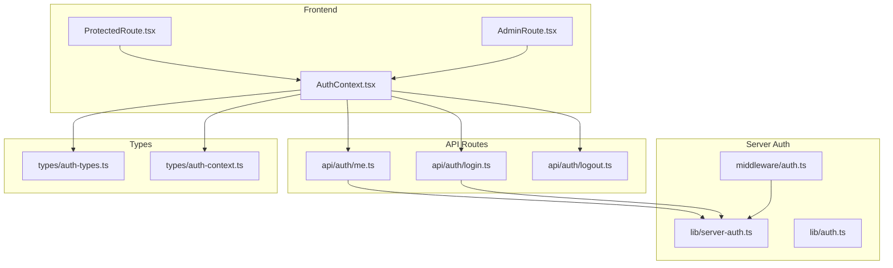
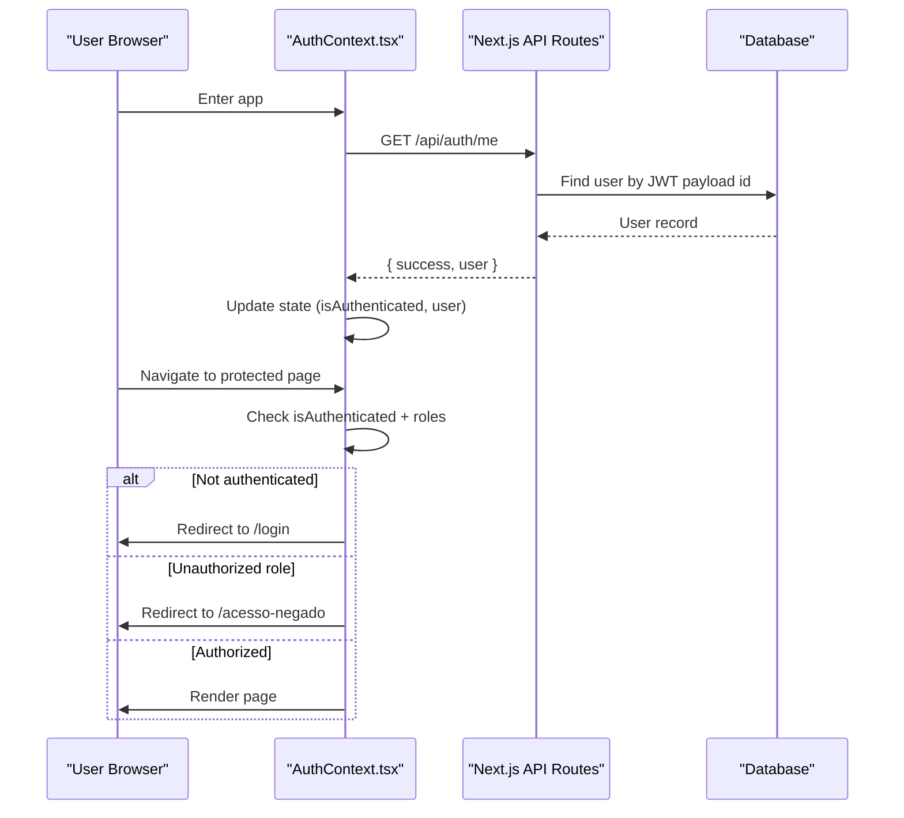
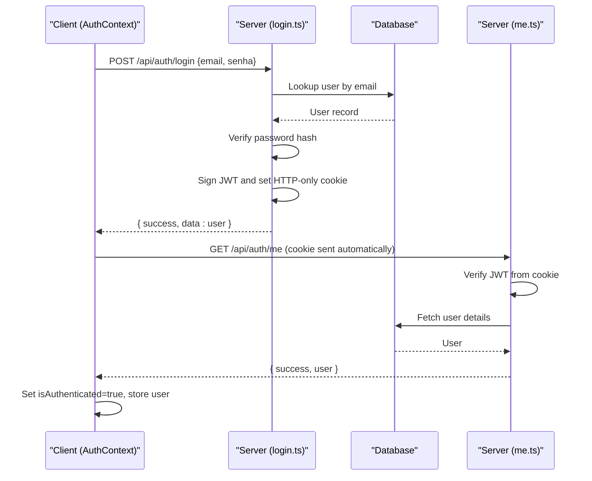
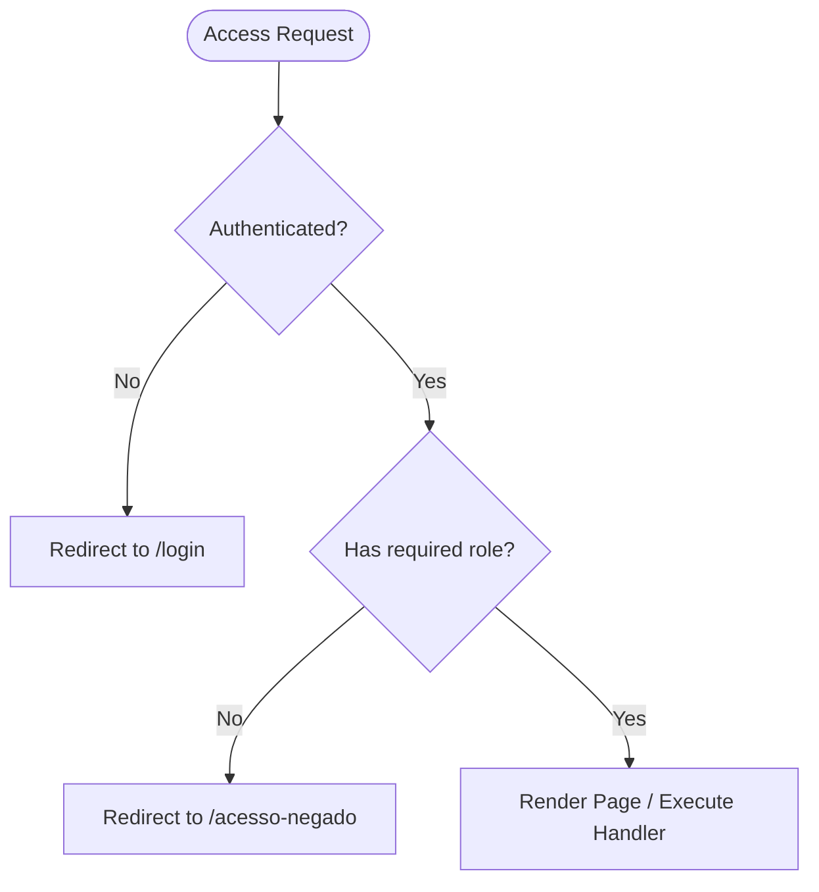
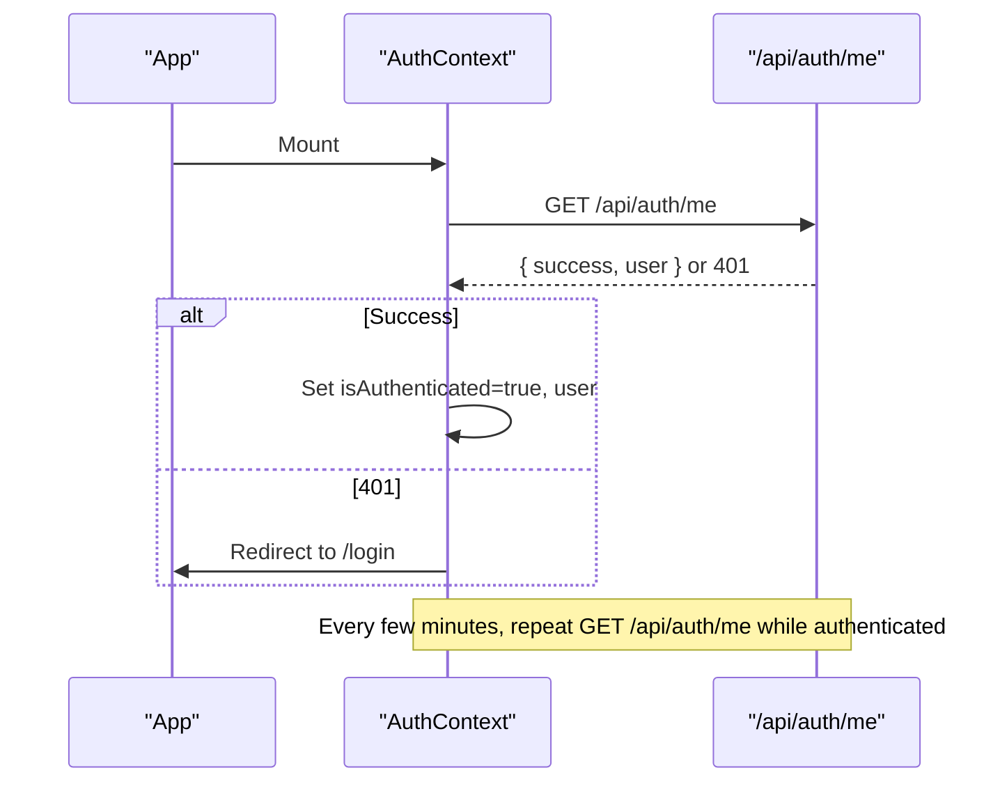
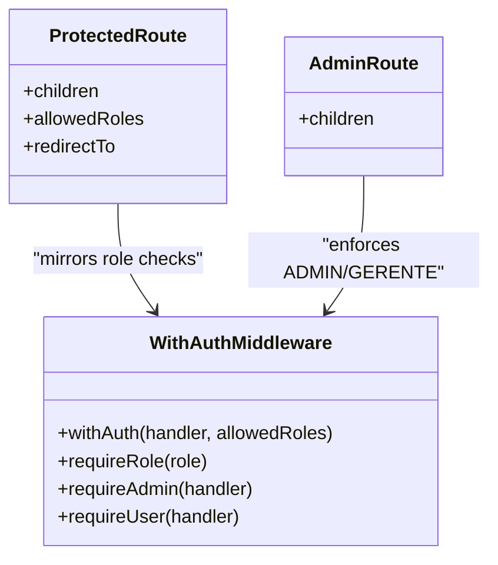
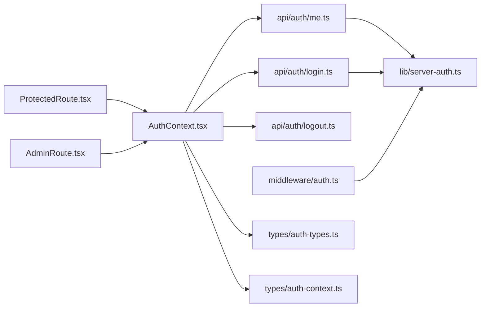

# Authentication & Authorization

<cite>
**Referenced Files in This Document**
- [AuthContext.tsx](file://contexts/AuthContext.tsx)
- [ProtectedRoute.tsx](file://components/ProtectedRoute.tsx)
- [AdminRoute.tsx](file://components/admin/AdminRoute.tsx)
- [login.ts](file://pages/api/auth/login.ts)
- [logout.ts](file://pages/api/auth/logout.ts)
- [me.ts](file://pages/api/auth/me.ts)
- [auth.ts (middleware)](file://middleware/auth.ts)
- [server-auth.ts](file://lib/server-auth.ts)
- [auth.ts (lib)](file://lib/auth.ts)
- [auth-types.ts](file://types/auth-types.ts)
- [auth-context.ts](file://types/auth-context.ts)
</cite>

## Table of Contents
1. Introduction
2. Project Structure
3. Core Components
4. Architecture Overview
5. Detailed Component Analysis
6. Dependency Analysis
7. Performance Considerations
8. Troubleshooting Guide
9. Conclusion

## Introduction
This document explains the authentication and authorization system for the application. It covers:
- JWT-based authentication flow using HTTP-only cookies
- User roles and role-based access control (RBAC)
- Frontend authentication context, protected routes, and middleware
- Login/logout flows, token handling, and security considerations
- Examples for implementing protected routes, checking permissions, and extending the system

## Project Structure
The authentication system spans frontend React components/hooks, Next.js API routes, and shared utilities/types:
- Frontend state and routing guards live in contexts and components
- API routes handle login, logout, and current user retrieval
- Middleware and helpers enforce server-side auth and RBAC
- Types define user model, roles, and context shape

**Diagram sources**
- [AuthContext.tsx:1-508](file://contexts/AuthContext.tsx#L1-L508)
- [ProtectedRoute.tsx:1-79](file://components/ProtectedRoute.tsx#L1-L79)
- [AdminRoute.tsx:1-59](file://components/admin/AdminRoute.tsx#L1-L59)
- [login.ts:1-461](file://pages/api/auth/login.ts#L1-L461)
- [me.ts:1-205](file://pages/api/auth/me.ts#L1-L205)
- [logout.ts:1-149](file://pages/api/auth/logout.ts#L1-L149)
- [auth.ts (middleware):1-91](file://middleware/auth.ts#L1-L91)
- [server-auth.ts:1-41](file://lib/server-auth.ts#L1-L41)
- [auth.ts (lib):1-121](file://lib/auth.ts#L1-L121)
- [auth-types.ts:1-56](file://types/auth-types.ts#L1-L56)
- [auth-context.ts:1-29](file://types/auth-context.ts#L1-L29)

**Section sources**
- [AuthContext.tsx:1-508](file://contexts/AuthContext.tsx#L1-L508)
- [ProtectedRoute.tsx:1-79](file://components/ProtectedRoute.tsx#L1-L79)
- [AdminRoute.tsx:1-59](file://components/admin/AdminRoute.tsx#L1-L59)
- [login.ts:1-461](file://pages/api/auth/login.ts#L1-L461)
- [me.ts:1-205](file://pages/api/auth/me.ts#L1-L205)
- [logout.ts:1-149](file://pages/api/auth/logout.ts#L1-L149)
- [auth.ts (middleware):1-91](file://middleware/auth.ts#L1-L91)
- [server-auth.ts:1-41](file://lib/server-auth.ts#L1-L41)
- [auth.ts (lib):1-121](file://lib/auth.ts#L1-L121)
- [auth-types.ts:1-56](file://types/auth-types.ts#L1-L56)
- [auth-context.ts:1-29](file://types/auth-context.ts#L1-L29)

## Core Components
- Authentication Context (frontend): Manages login/logout, session validation, redirects, and user state. Uses HTTP-only cookie-based sessions via API calls to /api/auth/* and periodic checks.
- Protected Route (frontend): Guards pages based on authentication and allowed roles; redirects unauthorized users.
- Admin Route (frontend): Restricts admin/manager areas to ADMIN or GERENTE roles.
- API Routes:
  - POST /api/auth/login: Validates credentials, issues an HTTP-only cookie with a signed JWT.
  - GET /api/auth/me: Reads the cookie, verifies the JWT, returns current user.
  - POST /api/auth/logout: Clears the HTTP-only cookie.
- Server Middleware and Helpers:
  - middleware/auth.ts: Reusable HOC to verify Bearer tokens and enforce roles on API handlers.
  - lib/server-auth.ts: Utility to extract and verify tokens from cookies or Authorization header and fetch user.
  - lib/auth.ts: Cookie parsing and JWT verification utilities with detailed logging.

**Section sources**
- [AuthContext.tsx:1-508](file://contexts/AuthContext.tsx#L1-L508)
- [ProtectedRoute.tsx:1-79](file://components/ProtectedRoute.tsx#L1-L79)
- [AdminRoute.tsx:1-59](file://components/admin/AdminRoute.tsx#L1-L59)
- [login.ts:1-461](file://pages/api/auth/login.ts#L1-L461)
- [me.ts:1-205](file://pages/api/auth/me.ts#L1-L205)
- [logout.ts:1-149](file://pages/api/auth/logout.ts#L1-L149)
- [auth.ts (middleware):1-91](file://middleware/auth.ts#L1-L91)
- [server-auth.ts:1-41](file://lib/server-auth.ts#L1-L41)
- [auth.ts (lib):1-121](file://lib/auth.ts#L1-L121)

## Architecture Overview
The system uses a hybrid approach:
- Frontend stores no tokens; it relies on HTTP-only cookies set by the server after successful login.
- The frontend periodically validates the session by calling /api/auth/me.
- API endpoints can be secured either by:
  - Reading the cookie and verifying the JWT (as done in /api/auth/me), or
  - Using the middleware that expects a Bearer token in the Authorization header and enforces roles.

**Diagram sources**
- [AuthContext.tsx:95-191](file://contexts/AuthContext.tsx#L95-L191)
- [ProtectedRoute.tsx:27-51](file://components/ProtectedRoute.tsx#L27-L51)
- [me.ts:98-182](file://pages/api/auth/me.ts#L98-L182)

## Detailed Component Analysis

### JWT-Based Authentication Flow
- Login:
  - Client sends email/password to POST /api/auth/login.
  - Server validates credentials, signs a JWT, and sets an HTTP-only cookie named auth_token with secure flags appropriate for environment.
  - Client then calls GET /api/auth/me to populate user state and redirect based on role.
- Session Validation:
  - GET /api/auth/me reads the cookie, verifies the JWT, and returns the current user.
  - Frontend periodically calls this endpoint to detect expired sessions and redirects to login if needed.
- Logout:
  - Client calls POST /api/auth/logout to clear the cookie.
  - Frontend clears local state and navigates to login.

**Diagram sources**
- [login.ts:112-424](file://pages/api/auth/login.ts#L112-L424)
- [me.ts:98-182](file://pages/api/auth/me.ts#L98-L182)

**Section sources**
- [login.ts:112-424](file://pages/api/auth/login.ts#L112-L424)
- [me.ts:98-182](file://pages/api/auth/me.ts#L98-L182)
- [logout.ts:75-136](file://pages/api/auth/logout.ts#L75-L136)
- [AuthContext.tsx:228-338](file://contexts/AuthContext.tsx#L228-L338)
- [AuthContext.tsx:340-380](file://contexts/AuthContext.tsx#L340-L380)
- [AuthContext.tsx:389-443](file://contexts/AuthContext.tsx#L389-L443)

### Roles and Role-Based Access Control (RBAC)
- Roles:
  - Defined in types and used across the app: ADMIN, GERENTE, USUARIO, plus others like SEPARADOR, AUDITOR, CONFERENTE.
- Frontend RBAC:
  - ProtectedRoute accepts allowedRoles and blocks access if the current user’s tipo is not included.
  - AdminRoute restricts to ADMIN or GERENTE.
- Backend RBAC:
  - middleware/auth.ts provides withAuth(handler, allowedRoles) to enforce roles on API handlers.
  - requireRole(role) and convenience wrappers (requireAdmin, requireUser) simplify route protection.

**Diagram sources**
- [ProtectedRoute.tsx:27-51](file://components/ProtectedRoute.tsx#L27-L51)
- [AdminRoute.tsx:16-39](file://components/admin/AdminRoute.tsx#L16-L39)
- [auth.ts (middleware):16-80](file://middleware/auth.ts#L16-L80)

**Section sources**
- [auth-types.ts:46-56](file://types/auth-types.ts#L46-L56)
- [ProtectedRoute.tsx:13-51](file://components/ProtectedRoute.tsx#L13-L51)
- [AdminRoute.tsx:11-39](file://components/admin/AdminRoute.tsx#L11-L39)
- [auth.ts (middleware):16-90](file://middleware/auth.ts#L16-L90)

### Authentication Context and Session Management
- State:
  - Tracks user, token presence, loading, error, and authentication status.
- Initialization:
  - On mount, attempts to load the current user via /api/auth/me. Public routes bypass this check.
- Periodic Checks:
  - While authenticated, periodically re-validates the session and redirects to login on failure.
- Logout:
  - Calls /api/auth/logout to clear the server cookie, resets local state, and navigates to login.

**Diagram sources**
- [AuthContext.tsx:95-191](file://contexts/AuthContext.tsx#L95-L191)
- [AuthContext.tsx:445-480](file://contexts/AuthContext.tsx#L445-L480)
- [me.ts:98-182](file://pages/api/auth/me.ts#L98-L182)

**Section sources**
- [AuthContext.tsx:65-191](file://contexts/AuthContext.tsx#L65-L191)
- [AuthContext.tsx:389-480](file://contexts/AuthContext.tsx#L389-L480)
- [auth-context.ts:1-29](file://types/auth-context.ts#L1-L29)

### Protected Routes and Middleware Security
- Frontend:
  - ProtectedRoute wraps pages requiring authentication and optional role checks.
  - AdminRoute further restricts to ADMIN or GERENTE.
- Backend:
  - Use withAuth(handler, allowedRoles) to protect API handlers.
  - Alternatively, use requireRole('ADMIN') or requireUser('USUARIO') for single-role protection.
  - For mixed APIs, combine cookie-based verification (via lib/server-auth.ts) with explicit role checks inside handlers.

**Diagram sources**
- [ProtectedRoute.tsx:13-51](file://components/ProtectedRoute.tsx#L13-L51)
- [AdminRoute.tsx:11-39](file://components/admin/AdminRoute.tsx#L11-L39)
- [auth.ts (middleware):16-90](file://middleware/auth.ts#L16-L90)

**Section sources**
- [ProtectedRoute.tsx:1-79](file://components/ProtectedRoute.tsx#L1-L79)
- [AdminRoute.tsx:1-59](file://components/admin/AdminRoute.tsx#L1-L59)
- [auth.ts (middleware):1-91](file://middleware/auth.ts#L1-L91)

### Token Handling and Security Considerations
- Tokens:
  - JWTs are signed server-side and stored in an HTTP-only cookie named auth_token.
  - Cookies are set with secure flags in production and SameSite=Lax.
- Verification:
  - GET /api/auth/me verifies the cookie token and returns user info.
  - lib/auth.ts and lib/server-auth.ts provide robust parsing and verification utilities.
- Security Notes:
  - Prefer HTTP-only cookies for sensitive tokens to mitigate XSS exposure.
  - Ensure CORS is configured to allow credentials only from trusted origins.
  - Validate and sanitize inputs on login (email format, password length).
  - Rotate secrets and avoid hardcoding secrets in code.

**Section sources**
- [login.ts:317-424](file://pages/api/auth/login.ts#L317-L424)
- [logout.ts:83-136](file://pages/api/auth/logout.ts#L83-L136)
- [me.ts:127-182](file://pages/api/auth/me.ts#L127-L182)
- [auth.ts (lib):10-66](file://lib/auth.ts#L10-L66)
- [server-auth.ts:11-41](file://lib/server-auth.ts#L11-L41)

### Implementing Protected Routes and Checking Permissions
- Wrap pages with ProtectedRoute and specify allowedRoles when necessary.
- For admin-only pages, use AdminRoute to restrict to ADMIN or GERENTE.
- On the backend, wrap handlers with withAuth and pass allowedRoles, or use requireRole for single-role protection.
- To extend roles:
  - Add new values to USER_TYPES in types/auth-types.ts.
  - Update frontend guards (ProtectedRoute, AdminRoute) and backend middleware usage accordingly.

**Section sources**
- [ProtectedRoute.tsx:13-51](file://components/ProtectedRoute.tsx#L13-L51)
- [AdminRoute.tsx:11-39](file://components/admin/AdminRoute.tsx#L11-L39)
- [auth.ts (middleware):16-90](file://middleware/auth.ts#L16-L90)
- [auth-types.ts:46-56](file://types/auth-types.ts#L46-L56)

## Dependency Analysis

**Diagram sources**
- [AuthContext.tsx:1-508](file://contexts/AuthContext.tsx#L1-L508)
- [ProtectedRoute.tsx:1-79](file://components/ProtectedRoute.tsx#L1-L79)
- [AdminRoute.tsx:1-59](file://components/admin/AdminRoute.tsx#L1-L59)
- [login.ts:1-461](file://pages/api/auth/login.ts#L1-L461)
- [me.ts:1-205](file://pages/api/auth/me.ts#L1-L205)
- [logout.ts:1-149](file://pages/api/auth/logout.ts#L1-L149)
- [auth.ts (middleware):1-91](file://middleware/auth.ts#L1-L91)
- [server-auth.ts:1-41](file://lib/server-auth.ts#L1-L41)
- [auth-types.ts:1-56](file://types/auth-types.ts#L1-L56)
- [auth-context.ts:1-29](file://types/auth-context.ts#L1-L29)

**Section sources**
- [AuthContext.tsx:1-508](file://contexts/AuthContext.tsx#L1-L508)
- [ProtectedRoute.tsx:1-79](file://components/ProtectedRoute.tsx#L1-L79)
- [AdminRoute.tsx:1-59](file://components/admin/AdminRoute.tsx#L1-L59)
- [login.ts:1-461](file://pages/api/auth/login.ts#L1-L461)
- [me.ts:1-205](file://pages/api/auth/me.ts#L1-L205)
- [logout.ts:1-149](file://pages/api/auth/logout.ts#L1-L149)
- [auth.ts (middleware):1-91](file://middleware/auth.ts#L1-L91)
- [server-auth.ts:1-41](file://lib/server-auth.ts#L1-L41)
- [auth-types.ts:1-56](file://types/auth-types.ts#L1-L56)
- [auth-context.ts:1-29](file://types/auth-context.ts#L1-L29)

## Performance Considerations
- Minimize frequent calls to /api/auth/me by batching or debouncing where possible.
- Cache user data locally within the session lifecycle to reduce redundant requests.
- Keep JWT payloads small to reduce cookie size and network overhead.
- Use efficient database queries in /api/auth/me and other protected endpoints.

[No sources needed since this section provides general guidance]

## Troubleshooting Guide
- Common Issues:
  - 401 Unauthorized: Missing or invalid cookie/token; ensure cookies are enabled and CORS allows credentials.
  - 403 Forbidden: Insufficient roles; verify user.tipo against allowedRoles.
  - Redirect loops: Check publicRoutes configuration and ensure /api/auth/me responds correctly.
- Debugging Tips:
  - Inspect cookies in browser dev tools to confirm auth_token presence and attributes (httpOnly, secure, sameSite).
  - Review server logs for JWT verification errors and database query failures.
  - Validate environment variables for JWT_SECRET and CORS origins.

**Section sources**
- [me.ts:127-182](file://pages/api/auth/me.ts#L127-L182)
- [auth.ts (middleware):23-80](file://middleware/auth.ts#L23-L80)
- [AuthContext.tsx:134-191](file://contexts/AuthContext.tsx#L134-L191)

## Conclusion
The system implements a secure, cookie-based JWT authentication flow with strong separation between frontend state and server-side session validation. Role-based access control is enforced both on the client (route guards) and server (middleware), providing defense-in-depth. By following the patterns outlined here, you can safely add new roles, protect additional routes, and extend the system with enhanced security measures such as refresh tokens, device binding, or audit logging.

[No sources needed since this section summarizes without analyzing specific files]