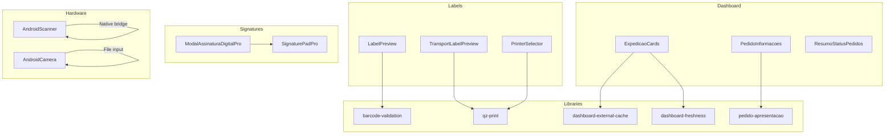
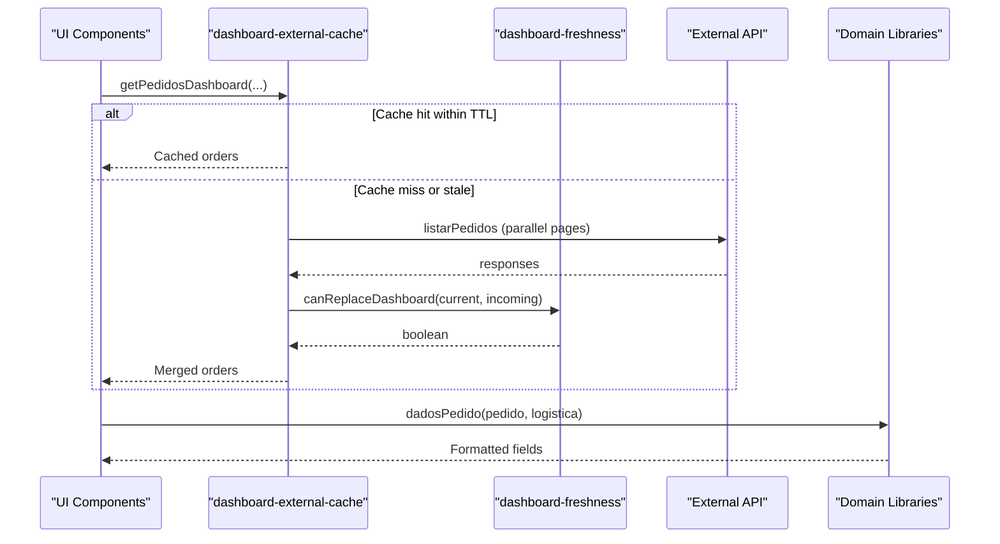
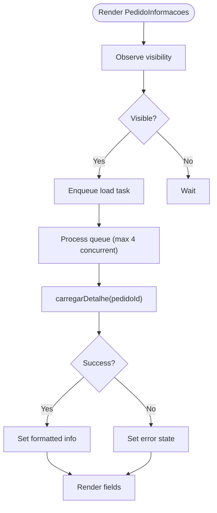
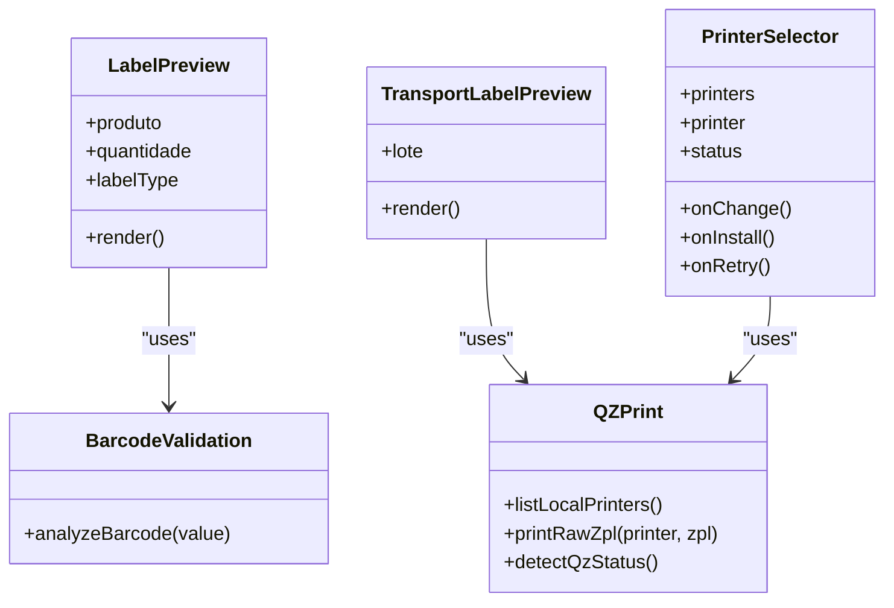
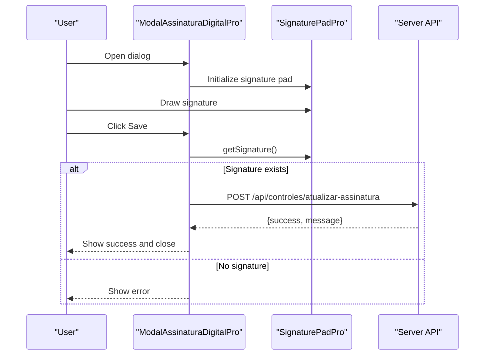
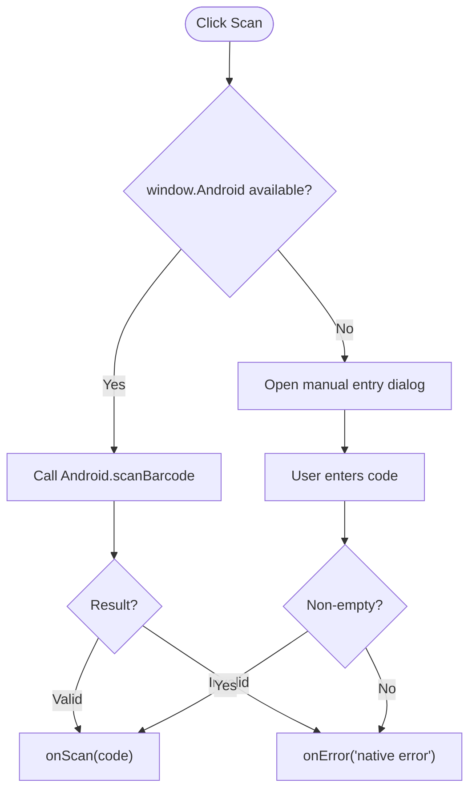
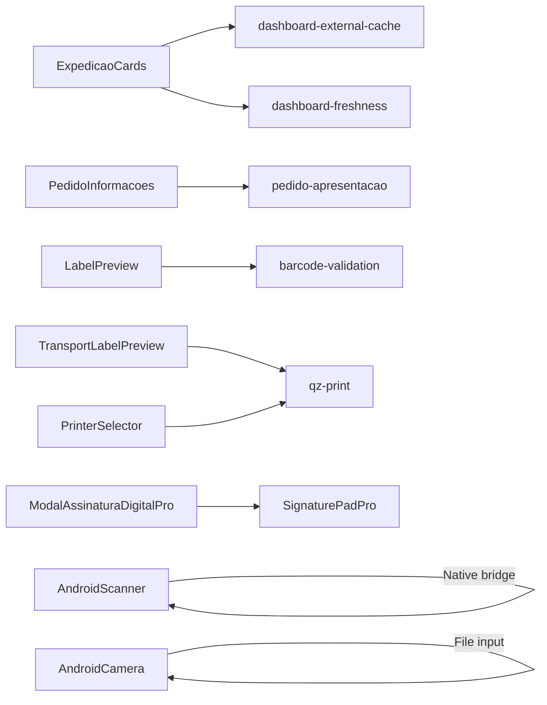

# Business Components

<cite>
**Referenced Files in This Document**
- [ExpedicaoCards.tsx](file://components/dashboard/ExpedicaoCards.tsx)
- [PedidoInformacoes.tsx](file://components/dashboard/PedidoInformacoes.tsx)
- [ResumoStatusPedidos.tsx](file://components/dashboard/ResumoStatusPedidos.tsx)
- [LabelPreview.tsx](file://components/labels/LabelPreview.tsx)
- [TransportLabelPreview.tsx](file://components/labels/TransportLabelPreview.tsx)
- [PrinterSelector.tsx](file://components/labels/PrinterSelector.tsx)
- [SignaturePadPro.tsx](file://components/SignaturePadPro.tsx)
- [ModalAssinaturaDigitalPro.tsx](file://components/ModalAssinaturaDigitalPro.tsx)
- [AndroidScanner.tsx](file://components/AndroidScanner.tsx)
- [AndroidCamera.tsx](file://components/AndroidCamera.tsx)
- [pedido-apresentacao.ts](file://lib/pedido-apresentacao.ts)
- [qz-print.ts](file://services/qz-print.ts)
- [barcode-validation.ts](file://lib/barcode-validation.ts)
- [dashboard-external-cache.ts](file://lib/dashboard-external-cache.ts)
- [dashboard-freshness.ts](file://lib/dashboard-freshness.ts)
</cite>

## Table of Contents
1. Introduction
2. Project Structure
3. Core Components
4. Architecture Overview
5. Detailed Component Analysis
6. Dependency Analysis
7. Performance Considerations
8. Troubleshooting Guide
9. Conclusion

## Introduction
This document provides comprehensive documentation for business-specific components that implement domain logic across four areas:
- Dashboard components for order and status visualization
- Label management components for product and transport labels
- Signature capture components for digital signatures
- Hardware integration components for barcode scanning and camera capture

It covers data binding patterns, state management, external service integrations, error handling strategies, and performance considerations specific to each domain.

## Project Structure
The business components are organized by feature area under the components directory:
- Dashboard: ExpedicaoCards, PedidoInformacoes, ResumoStatusPedidos
- Labels: LabelPreview, TransportLabelPreview, PrinterSelector
- Signatures: SignaturePadPro, ModalAssinaturaDigitalPro
- Hardware: AndroidScanner, AndroidCamera

Supporting libraries provide data shaping, caching, validation, and hardware integration utilities.

**Diagram sources**
- [ExpedicaoCards.tsx:118-277](file://components/dashboard/ExpedicaoCards.tsx#L118-L277)
- [PedidoInformacoes.tsx:28-79](file://components/dashboard/PedidoInformacoes.tsx#L28-L79)
- [ResumoStatusPedidos.tsx:3-17](file://components/dashboard/ResumoStatusPedidos.tsx#L3-L17)
- [LabelPreview.tsx:117-297](file://components/labels/LabelPreview.tsx#L117-L297)
- [TransportLabelPreview.tsx:164-185](file://components/labels/TransportLabelPreview.tsx#L164-L185)
- [PrinterSelector.tsx:16-95](file://components/labels/PrinterSelector.tsx#L16-L95)
- [SignaturePadPro.tsx:83-667](file://components/SignaturePadPro.tsx#L83-L667)
- [ModalAssinaturaDigitalPro.tsx:30-269](file://components/ModalAssinaturaDigitalPro.tsx#L30-L269)
- [AndroidScanner.tsx:32-223](file://components/AndroidScanner.tsx#L32-L223)
- [AndroidCamera.tsx:29-218](file://components/AndroidCamera.tsx#L29-L218)
- [pedido-apresentacao.ts:1-26](file://lib/pedido-apresentacao.ts#L1-L26)
- [qz-print.ts:1-205](file://services/qz-print.ts#L1-L205)
- [barcode-validation.ts:1-89](file://lib/barcode-validation.ts#L1-L89)
- [dashboard-external-cache.ts:1-92](file://lib/dashboard-external-cache.ts#L1-L92)
- [dashboard-freshness.ts:1-24](file://lib/dashboard-freshness.ts#L1-L24)

**Section sources**
- [ExpedicaoCards.tsx:118-277](file://components/dashboard/ExpedicaoCards.tsx#L118-L277)
- [PedidoInformacoes.tsx:28-79](file://components/dashboard/PedidoInformacoes.tsx#L28-L79)
- [ResumoStatusPedidos.tsx:3-17](file://components/dashboard/ResumoStatusPedidos.tsx#L3-L17)
- [LabelPreview.tsx:117-297](file://components/labels/LabelPreview.tsx#L117-L297)
- [TransportLabelPreview.tsx:164-185](file://components/labels/TransportLabelPreview.tsx#L164-L185)
- [PrinterSelector.tsx:16-95](file://components/labels/PrinterSelector.tsx#L16-L95)
- [SignaturePadPro.tsx:83-667](file://components/SignaturePadPro.tsx#L83-L667)
- [ModalAssinaturaDigitalPro.tsx:30-269](file://components/ModalAssinaturaDigitalPro.tsx#L30-L269)
- [AndroidScanner.tsx:32-223](file://components/AndroidScanner.tsx#L32-L223)
- [AndroidCamera.tsx:29-218](file://components/AndroidCamera.tsx#L29-L218)
- [pedido-apresentacao.ts:1-26](file://lib/pedido-apresentacao.ts#L1-L26)
- [qz-print.ts:1-205](file://services/qz-print.ts#L1-L205)
- [barcode-validation.ts:1-89](file://lib/barcode-validation.ts#L1-L89)
- [dashboard-external-cache.ts:1-92](file://lib/dashboard-external-cache.ts#L1-L92)
- [dashboard-freshness.ts:1-24](file://lib/dashboard-freshness.ts#L1-L24)

## Core Components
- Dashboard cards summarize operational stages, alerts, and pending items with responsive layouts and loading states.
- Order information component lazily loads details using an intersection observer and a concurrency-limited queue to avoid ERP overload.
- Status summary renders counts per status with filtering for alert categories.
- Label previews render product and transport labels with barcode analysis and dynamic layouts.
- Printer selector integrates with QZ Tray to list printers, detect compatibility, and guide installation/authorization.
- Signature pad provides canvas-based drawing, undo/redo history, resizing, and save callbacks.
- Digital signature modal orchestrates signature capture and persistence via API.
- Android scanner bridges to native barcode scanning or falls back to manual entry.
- Android camera captures images via file input with preview and validation.

**Section sources**
- [ExpedicaoCards.tsx:118-277](file://components/dashboard/ExpedicaoCards.tsx#L118-L277)
- [PedidoInformacoes.tsx:28-79](file://components/dashboard/PedidoInformacoes.tsx#L28-L79)
- [ResumoStatusPedidos.tsx:3-17](file://components/dashboard/ResumoStatusPedidos.tsx#L3-L17)
- [LabelPreview.tsx:117-297](file://components/labels/LabelPreview.tsx#L117-L297)
- [TransportLabelPreview.tsx:164-185](file://components/labels/TransportLabelPreview.tsx#L164-L185)
- [PrinterSelector.tsx:16-95](file://components/labels/PrinterSelector.tsx#L16-L95)
- [SignaturePadPro.tsx:83-667](file://components/SignaturePadPro.tsx#L83-L667)
- [ModalAssinaturaDigitalPro.tsx:30-269](file://components/ModalAssinaturaDigitalPro.tsx#L30-L269)
- [AndroidScanner.tsx:32-223](file://components/AndroidScanner.tsx#L32-L223)
- [AndroidCamera.tsx:29-218](file://components/AndroidCamera.tsx#L29-L218)

## Architecture Overview
The system composes UI components with domain utilities and services:
- Dashboard components consume cached or fresh data and present summaries.
- Label components rely on barcode validation and printer services for rendering and printing.
- Signature components encapsulate drawing logic and persist via API.
- Hardware components abstract device capabilities and provide fallbacks.

**Diagram sources**
- [dashboard-external-cache.ts:15-91](file://lib/dashboard-external-cache.ts#L15-L91)
- [dashboard-freshness.ts:6-23](file://lib/dashboard-freshness.ts#L6-L23)
- [pedido-apresentacao.ts:1-26](file://lib/pedido-apresentacao.ts#L1-L26)

**Section sources**
- [dashboard-external-cache.ts:15-91](file://lib/dashboard-external-cache.ts#L15-L91)
- [dashboard-freshness.ts:6-23](file://lib/dashboard-freshness.ts#L6-L23)
- [pedido-apresentacao.ts:1-26](file://lib/pedido-apresentacao.ts#L1-L26)

## Detailed Component Analysis

### Dashboard Components
- ExpedicaoCards: Renders stage cards, alerts, and pending items with animations and responsive grids. Uses props for stage data, alert totals, and pending lists. Loading states show spinners; alert indicators animate when counts are non-zero.
- PedidoInformacoes: Lazily loads order details using IntersectionObserver and a concurrency-limited queue to cap active requests. Displays city, neighborhood, separator, and checker names with fallbacks.
- ResumoStatusPedidos: Presents status counts, filtering out empty or alert-only categories.

**Diagram sources**
- [PedidoInformacoes.tsx:28-79](file://components/dashboard/PedidoInformacoes.tsx#L28-L79)

**Section sources**
- [ExpedicaoCards.tsx:118-277](file://components/dashboard/ExpedicaoCards.tsx#L118-L277)
- [PedidoInformacoes.tsx:28-79](file://components/dashboard/PedidoInformacoes.tsx#L28-L79)
- [ResumoStatusPedidos.tsx:3-17](file://components/dashboard/ResumoStatusPedidos.tsx#L3-L17)

### Label Management Components
- LabelPreview: Renders product labels in multiple formats (unit, closed box, A4 variants). Uses barcode analysis to determine format and displays product image, brand, code, description, and barcode. Supports compact mode and quantity repetition.
- TransportLabelPreview: Renders transport labels per volume with CODE128 barcodes generated client-side. Includes order number, transport company name, invoice number, client, CNPJ, and volume indices.
- PrinterSelector: Integrates with QZ Tray to list local printers, detect ZPL compatibility, and guide installation/authorization. Shows status alerts and allows selection.

**Diagram sources**
- [LabelPreview.tsx:117-297](file://components/labels/LabelPreview.tsx#L117-L297)
- [TransportLabelPreview.tsx:164-185](file://components/labels/TransportLabelPreview.tsx#L164-L185)
- [PrinterSelector.tsx:16-95](file://components/labels/PrinterSelector.tsx#L16-L95)
- [barcode-validation.ts:42-88](file://lib/barcode-validation.ts#L42-L88)
- [qz-print.ts:85-146](file://services/qz-print.ts#L85-L146)

**Section sources**
- [LabelPreview.tsx:117-297](file://components/labels/LabelPreview.tsx#L117-L297)
- [TransportLabelPreview.tsx:164-185](file://components/labels/TransportLabelPreview.tsx#L164-L185)
- [PrinterSelector.tsx:16-95](file://components/labels/PrinterSelector.tsx#L16-L95)
- [barcode-validation.ts:42-88](file://lib/barcode-validation.ts#L42-L88)
- [qz-print.ts:85-146](file://services/qz-print.ts#L85-L146)

### Signature Capture Components
- SignaturePadPro: Canvas-based signature capture with dynamic import of signature_pad library, responsive sizing, undo/redo history, and save callback. Exposes imperative methods (clear, isEmpty, getSignature, undo, redo). Handles errors and disabled states.
- ModalAssinaturaDigitalPro: Dialog wrapper around SignaturePadPro, validates presence of signature, posts to server endpoint, shows success/error feedback, and closes after saving.

**Diagram sources**
- [ModalAssinaturaDigitalPro.tsx:46-93](file://components/ModalAssinaturaDigitalPro.tsx#L46-L93)
- [SignaturePadPro.tsx:314-352](file://components/SignaturePadPro.tsx#L314-L352)

**Section sources**
- [SignaturePadPro.tsx:83-667](file://components/SignaturePadPro.tsx#L83-L667)
- [ModalAssinaturaDigitalPro.tsx:30-269](file://components/ModalAssinaturaDigitalPro.tsx#L30-L269)

### Hardware Integration Components
- AndroidScanner: Attempts native barcode scan via window.Android interface; if unavailable, opens a dialog for manual entry. Emits onScan with the captured or entered code.
- AndroidCamera: Triggers file input with capture="environment" to open rear camera on mobile. Validates image type and size, generates preview, and emits onCapture with the selected File.

**Diagram sources**
- [AndroidScanner.tsx:46-74](file://components/AndroidScanner.tsx#L46-L74)

**Section sources**
- [AndroidScanner.tsx:32-223](file://components/AndroidScanner.tsx#L32-L223)
- [AndroidCamera.tsx:29-218](file://components/AndroidCamera.tsx#L29-L218)

## Dependency Analysis
- Dashboard components depend on external cache and freshness utilities to manage data updates and prevent overfetching.
- Label components depend on barcode validation and printer services for accurate rendering and reliable printing.
- Signature components depend on a third-party drawing library and server API for persistence.
- Hardware components depend on browser APIs and optional native bridges.

**Diagram sources**
- [dashboard-external-cache.ts:15-91](file://lib/dashboard-external-cache.ts#L15-L91)
- [dashboard-freshness.ts:6-23](file://lib/dashboard-freshness.ts#L6-L23)
- [pedido-apresentacao.ts:1-26](file://lib/pedido-apresentacao.ts#L1-L26)
- [barcode-validation.ts:42-88](file://lib/barcode-validation.ts#L42-L88)
- [qz-print.ts:85-146](file://services/qz-print.ts#L85-L146)
- [SignaturePadPro.tsx:314-352](file://components/SignaturePadPro.tsx#L314-L352)
- [AndroidScanner.tsx:46-74](file://components/AndroidScanner.tsx#L46-L74)
- [AndroidCamera.tsx:43-77](file://components/AndroidCamera.tsx#L43-L77)

**Section sources**
- [dashboard-external-cache.ts:15-91](file://lib/dashboard-external-cache.ts#L15-L91)
- [dashboard-freshness.ts:6-23](file://lib/dashboard-freshness.ts#L6-L23)
- [pedido-apresentacao.ts:1-26](file://lib/pedido-apresentacao.ts#L1-L26)
- [barcode-validation.ts:42-88](file://lib/barcode-validation.ts#L42-L88)
- [qz-print.ts:85-146](file://services/qz-print.ts#L85-L146)
- [SignaturePadPro.tsx:314-352](file://components/SignaturePadPro.tsx#L314-L352)
- [AndroidScanner.tsx:46-74](file://components/AndroidScanner.tsx#L46-L74)
- [AndroidCamera.tsx:43-77](file://components/AndroidCamera.tsx#L43-L77)

## Performance Considerations
- Dashboard data fetching uses parallel page requests with retries and a short TTL cache to reduce latency and network load. Stale data is preserved during updates to avoid blank screens.
- Order detail loading employs an intersection observer and a concurrency-limited queue to prevent overwhelming the ERP with simultaneous requests.
- Signature pad dynamically imports the drawing library to minimize initial bundle size and resizes the canvas efficiently while preserving content.
- Label previews compute barcode types locally and render multiple copies without additional network calls.
- Printer listing includes fallback mechanisms to Windows printers when QZ Tray returns no results, improving reliability.

[No sources needed since this section provides general guidance]

## Troubleshooting Guide
- Dashboard data issues:
  - If dashboard appears empty during updates, the freshness utility prevents replacing valid data with empty responses. Verify filters and timestamps.
  - External cache may serve stale data; check TTL and stale thresholds.
- Order details:
  - If order info shows “Indisponível,” the request failed; ensure carregarDetalhe resolves successfully and the queue processes tasks.
- Label printing:
  - If QZ Tray reports not installed or authorization required, use the PrinterSelector actions to install or authorize. Ensure the correct port and certificate configuration.
  - For ZPL compatibility, prefer printers matching known patterns; otherwise, use browser print dialog.
- Signatures:
  - If save fails, inspect server response messages and ensure the signature exists before posting.
  - Undo/redo history is limited; if too many steps are recorded, older entries are trimmed.
- Hardware:
  - Scanner fallback opens manual entry when native bridge is unavailable; verify onScan is wired correctly.
  - Camera input validates image type and size; ensure onError handles invalid inputs gracefully.

**Section sources**
- [dashboard-freshness.ts:6-23](file://lib/dashboard-freshness.ts#L6-L23)
- [dashboard-external-cache.ts:15-91](file://lib/dashboard-external-cache.ts#L15-L91)
- [PedidoInformacoes.tsx:28-79](file://components/dashboard/PedidoInformacoes.tsx#L28-L79)
- [qz-print.ts:159-203](file://services/qz-print.ts#L159-L203)
- [PrinterSelector.tsx:39-70](file://components/labels/PrinterSelector.tsx#L39-L70)
- [ModalAssinaturaDigitalPro.tsx:46-93](file://components/ModalAssinaturaDigitalPro.tsx#L46-L93)
- [AndroidScanner.tsx:46-74](file://components/AndroidScanner.tsx#L46-L74)
- [AndroidCamera.tsx:49-77](file://components/AndroidCamera.tsx#L49-L77)

## Conclusion
The business components form a cohesive system that balances user experience with robust data handling and hardware integration. Dashboard components leverage caching and freshness controls to keep users informed efficiently. Label components integrate barcode validation and printer services for accurate output. Signature components encapsulate drawing and persistence with clear error feedback. Hardware components abstract device capabilities and provide resilient fallbacks. Together, they deliver a scalable, maintainable foundation for logistics operations.

[No sources needed since this section summarizes without analyzing specific files]