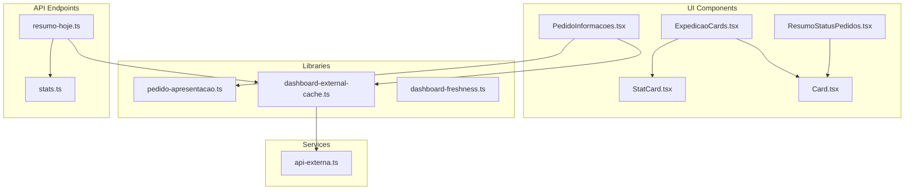
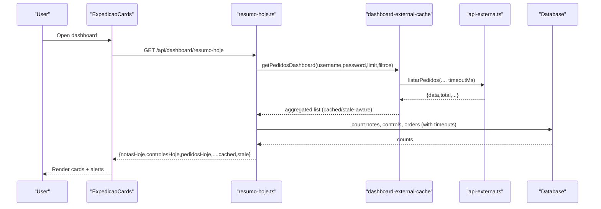
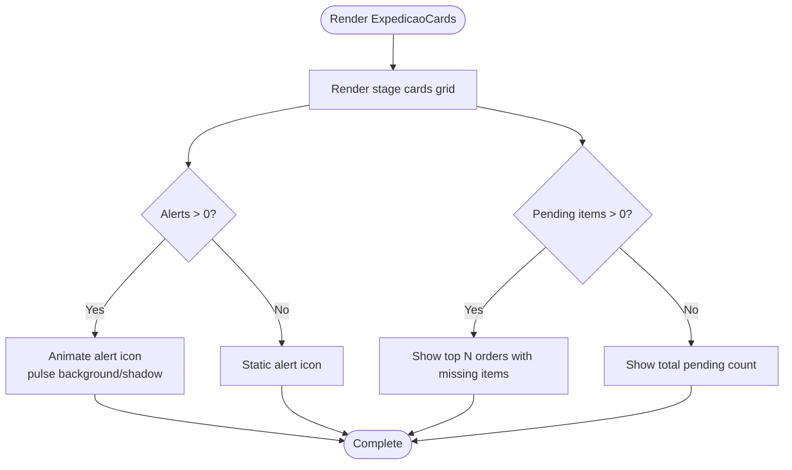
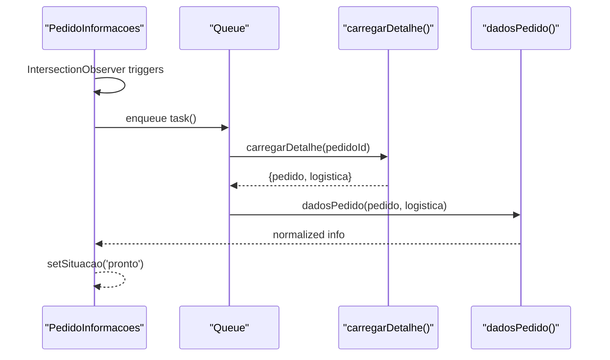
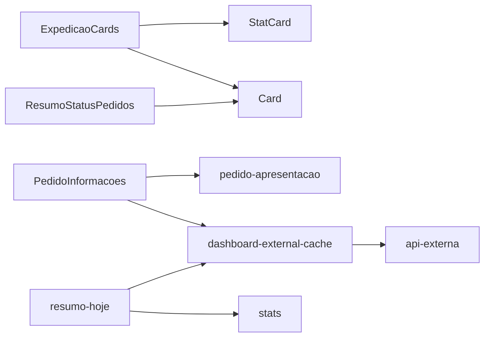

# Dashboard Components

<cite>
**Referenced Files in This Document**
- [ExpedicaoCards.tsx](file://components/dashboard/ExpedicaoCards.tsx)
- [PedidoInformacoes.tsx](file://components/dashboard/PedidoInformacoes.tsx)
- [ResumoStatusPedidos.tsx](file://components/dashboard/ResumoStatusPedidos.tsx)
- [pedido-apresentacao.ts](file://lib/pedido-apresentacao.ts)
- [dashboard-external-cache.ts](file://lib/dashboard-external-cache.ts)
- [dashboard-freshness.ts](file://lib/dashboard-freshness.ts)
- [api-externa.ts](file://services/api-externa.ts)
- [resumo-hoje.ts](file://pages/api/dashboard/resumo-hoje.ts)
- [stats.ts](file://pages/api/dashboard/stats.ts)
- [Card.tsx](file://components/ui/Card.tsx)
- [StatCard.tsx](file://components/ui/StatCard.tsx)
</cite>

## Table of Contents
1. Introduction
2. Project Structure
3. Core Components
4. Architecture Overview
5. Detailed Component Analysis
6. Dependency Analysis
7. Performance Considerations
8. Troubleshooting Guide
9. Conclusion

## Introduction
This document explains the dashboard business components that provide real-time logistics monitoring and order status visualization. It focuses on:
- ExpedicaoCards: stage-based order tracking with animated alerts and pending items display
- PedidoInformacoes: detailed order information presentation with lazy loading and concurrency control
- ResumoStatusPedidos: compact order status summary visualization

It also covers data binding patterns, state management approaches, animations using Framer Motion, responsive design, and integration with external APIs for real-time updates. Practical examples are included for customizing card layouts, handling loading states, managing alert notifications, and implementing interactive filtering capabilities.

## Project Structure
The dashboard is composed of three primary UI components under components/dashboard, supported by shared UI primitives and libraries for data transformation, caching, and API access. Server-side endpoints aggregate metrics and expose cached summaries.

**Diagram sources**
- [ExpedicaoCards.tsx:1-278](file://components/dashboard/ExpedicaoCards.tsx#L1-L278)
- [PedidoInformacoes.tsx:1-80](file://components/dashboard/PedidoInformacoes.tsx#L1-L80)
- [ResumoStatusPedidos.tsx:1-18](file://components/dashboard/ResumoStatusPedidos.tsx#L1-L18)
- [StatCard.tsx:1-135](file://components/ui/StatCard.tsx#L1-L135)
- [Card.tsx:1-39](file://components/ui/Card.tsx#L1-L39)
- [pedido-apresentacao.ts:1-26](file://lib/pedido-apresentacao.ts#L1-L26)
- [dashboard-external-cache.ts:1-92](file://lib/dashboard-external-cache.ts#L1-L92)
- [dashboard-freshness.ts:1-24](file://lib/dashboard-freshness.ts#L1-L24)
- [api-externa.ts:1-800](file://services/api-externa.ts#L1-L800)
- [resumo-hoje.ts:1-293](file://pages/api/dashboard/resumo-hoje.ts#L1-L293)
- [stats.ts:1-88](file://pages/api/dashboard/stats.ts#L1-L88)

**Section sources**
- [ExpedicaoCards.tsx:1-278](file://components/dashboard/ExpedicaoCards.tsx#L1-L278)
- [PedidoInformacoes.tsx:1-80](file://components/dashboard/PedidoInformacoes.tsx#L1-L80)
- [ResumoStatusPedidos.tsx:1-18](file://components/dashboard/ResumoStatusPedidos.tsx#L1-L18)
- [resumo-hoje.ts:1-293](file://pages/api/dashboard/resumo-hoje.ts#L1-L293)
- [stats.ts:1-88](file://pages/api/dashboard/stats.ts#L1-L88)

## Core Components
- ExpedicaoCards: Renders a grid of stage cards with animated entrance, plus two alert panels (overdue orders and missing products). Uses Framer Motion for staggered reveals and pulsing alert indicators. Supports wide layout mode and loading placeholders.
- PedidoInformacoes: Lazily loads enriched order details when visible, enqueues concurrent requests to avoid overwhelming the backend, and displays city/neighborhood/separators/conferente with graceful fallbacks.
- ResumoStatusPedidos: Displays a responsive grid of status tiles, filtering out empty or non-relevant categories.

Data binding and state:
- Props-driven rendering for all components; PedidoInformacoes uses local state for load status and computed values via pedido-apresentacao.
- External cache and freshness helpers ensure stable UI during network latency and stale data scenarios.

**Section sources**
- [ExpedicaoCards.tsx:40-47](file://components/dashboard/ExpedicaoCards.tsx#L40-L47)
- [PedidoInformacoes.tsx:28-64](file://components/dashboard/PedidoInformacoes.tsx#L28-L64)
- [ResumoStatusPedidos.tsx:1-18](file://components/dashboard/ResumoStatusPedidos.tsx#L1-L18)
- [pedido-apresentacao.ts:1-26](file://lib/pedido-apresentacao.ts#L1-L26)
- [dashboard-external-cache.ts:15-92](file://lib/dashboard-external-cache.ts#L15-L92)
- [dashboard-freshness.ts:6-24](file://lib/dashboard-freshness.ts#L6-L24)

## Architecture Overview
The dashboard integrates UI components with server endpoints and an external ERP service through a robust caching layer.

**Diagram sources**
- [resumo-hoje.ts:152-191](file://pages/api/dashboard/resumo-hoje.ts#L152-L191)
- [resumo-hoje.ts:193-293](file://pages/api/dashboard/resumo-hoje.ts#L193-L293)
- [dashboard-external-cache.ts:15-92](file://lib/dashboard-external-cache.ts#L15-L92)
- [api-externa.ts:695-749](file://services/api-externa.ts#L695-L749)
- [stats.ts:17-82](file://pages/api/dashboard/stats.ts#L17-L82)

## Detailed Component Analysis

### ExpedicaoCards
Purpose:
- Stage-based order tracking cards with animated entrance and hover effects.
- Alert panel for overdue orders with pulsing indicator when there are issues.
- Pending items panel listing missing products per order with scrollable detail.

Key behaviors:
- Staggered animation on mount using Framer Motion.
- Responsive grid switching between mobile/tablet/desktop and optional wideLayout.
- Loading states show spinners and placeholder text.
- Alert panel animates background color and box shadow when alerts exist.

Data model:
- StageCardItem: key, title, total, icon, colors, onClick
- AlertSummary: naoSeparado, naoConferido, naoEmbarcado, total, onClick
- PendenciasSummary: total, pedidos array with item-level details, onClick

Customization examples:
- Change card gradients and sizes via props (colorClass, backgroundColor, backgroundImage).
- Adjust grid density with wideLayout prop.
- Replace icons and titles to match your workflow stages.

Accessibility:
- Buttons include aria-label for loading spinner.
- High contrast text and clear visual hierarchy.

Performance:
- Minimal re-renders; animations use GPU-accelerated transforms.
- Avoid heavy computations inside render; pass precomputed totals.

**Diagram sources**
- [ExpedicaoCards.tsx:118-278](file://components/dashboard/ExpedicaoCards.tsx#L118-L278)

**Section sources**
- [ExpedicaoCards.tsx:5-47](file://components/dashboard/ExpedicaoCards.tsx#L5-L47)
- [ExpedicaoCards.tsx:59-116](file://components/dashboard/ExpedicaoCards.tsx#L59-L116)
- [ExpedicaoCards.tsx:118-278](file://components/dashboard/ExpedicaoCards.tsx#L118-L278)

### PedidoInformacoes
Purpose:
- Presents enriched order details (city, neighborhood, separator, conferente) based on merged order and logistics data.
- Implements IntersectionObserver-based lazy loading to reduce unnecessary requests.
- Enforces a bounded concurrency queue to prevent flooding the backend.

State and flow:
- Local state tracks loading/ready/error.
- On mount, schedules a request only when the element enters the viewport.
- Uses pedido-apresentacao to normalize fields from multiple sources.

Concurrency and safety:
- Global queue limits active queries to four at a time.
- Cancellation flag prevents stale updates after unmount or new id.

Integration:
- carregarDetalhe function is injected by the parent page to fetch order details from the appropriate source (often via api-externa).

**Diagram sources**
- [PedidoInformacoes.tsx:14-26](file://components/dashboard/PedidoInformacoes.tsx#L14-L26)
- [PedidoInformacoes.tsx:33-64](file://components/dashboard/PedidoInformacoes.tsx#L33-L64)
- [pedido-apresentacao.ts:1-26](file://lib/pedido-apresentacao.ts#L1-L26)

**Section sources**
- [PedidoInformacoes.tsx:28-79](file://components/dashboard/PedidoInformacoes.tsx#L28-L79)
- [pedido-apresentacao.ts:1-26](file://lib/pedido-apresentacao.ts#L1-L26)

### ResumoStatusPedidos
Purpose:
- Displays a responsive grid of status tiles with counts, hiding empty or irrelevant categories.

Behavior:
- Filters out zero-count items except where relevant.
- Clean, minimal styling suitable for dashboards.

Usage:
- Accepts an array of { codigo, titulo, total } and renders accordingly.

**Section sources**
- [ResumoStatusPedidos.tsx:1-18](file://components/dashboard/ResumoStatusPedidos.tsx#L1-L18)

## Dependency Analysis
- UI layer:
  - ExpedicaoCards depends on StatCard/Card for consistent card styling and uses Framer Motion for animations.
  - PedidoInformacoes depends on pedido-apresentacao for field normalization and a provided carregarDetalhe for data fetching.
  - ResumoStatusPedidos is self-contained and relies on Card for consistent borders/backgrounds.
- Data layer:
  - dashboard-external-cache coordinates pagination, retries, and TTL-based caching for external order lists.
  - dashboard-freshness ensures incoming payloads do not overwrite valid current data during updates.
  - api-externa handles authentication, token refresh, and calls to the external ERP system.
- API layer:
  - resumo-hoje aggregates database metrics and external order data with timeouts and cache fallbacks.
  - stats provides quick counts for notes, controls, and orders for today/month.

**Diagram sources**
- [ExpedicaoCards.tsx:1-278](file://components/dashboard/ExpedicaoCards.tsx#L1-L278)
- [PedidoInformacoes.tsx:1-80](file://components/dashboard/PedidoInformacoes.tsx#L1-L80)
- [ResumoStatusPedidos.tsx:1-18](file://components/dashboard/ResumoStatusPedidos.tsx#L1-L18)
- [StatCard.tsx:1-135](file://components/ui/StatCard.tsx#L1-L135)
- [Card.tsx:1-39](file://components/ui/Card.tsx#L1-L39)
- [pedido-apresentacao.ts:1-26](file://lib/pedido-apresentacao.ts#L1-L26)
- [dashboard-external-cache.ts:1-92](file://lib/dashboard-external-cache.ts#L1-L92)
- [api-externa.ts:1-800](file://services/api-externa.ts#L1-L800)
- [resumo-hoje.ts:1-293](file://pages/api/dashboard/resumo-hoje.ts#L1-L293)
- [stats.ts:1-88](file://pages/api/dashboard/stats.ts#L1-L88)

**Section sources**
- [dashboard-external-cache.ts:15-92](file://lib/dashboard-external-cache.ts#L15-L92)
- [dashboard-freshness.ts:6-24](file://lib/dashboard-freshness.ts#L6-L24)
- [api-externa.ts:117-248](file://services/api-externa.ts#L117-L248)
- [resumo-hoje.ts:193-293](file://pages/api/dashboard/resumo-hoje.ts#L193-L293)
- [stats.ts:17-82](file://pages/api/dashboard/stats.ts#L17-L82)

## Performance Considerations
- Lazy loading: PedidoInformacoes uses IntersectionObserver to defer requests until visible, reducing initial payload.
- Concurrency limit: A global queue caps simultaneous requests to four, preventing overload.
- Caching: dashboard-external-cache caches results with short TTL and staleness windows; resumo-hoje caches per period with timeouts.
- Timeouts: Both server endpoint and external cache enforce timeouts to keep UI responsive.
- Animations: Framer Motion uses transform-based animations for smooth performance.

[No sources needed since this section provides general guidance]

## Troubleshooting Guide
Common issues and resolutions:
- Empty or stale dashboard data:
  - Check if the external API credentials are configured and token is valid.
  - Verify cache TTL and stale window; force refresh via query parameter if needed.
- Slow or failing external API:
  - The endpoint returns cached/stale data with warnings when the database or external API is slow.
  - Inspect logs for timeout errors and adjust timeout thresholds if necessary.
- PedidoInformacoes shows “Indisponível”:
  - Indicates error state in carregarDetalhe; verify endpoint availability and response shape.
- Excessive network requests:
  - Ensure IntersectionObserver is working and queuing is enabled; confirm component unmount cancels tasks.

**Section sources**
- [resumo-hoje.ts:215-293](file://pages/api/dashboard/resumo-hoje.ts#L215-L293)
- [dashboard-external-cache.ts:32-92](file://lib/dashboard-external-cache.ts#L32-L92)
- [PedidoInformacoes.tsx:33-64](file://components/dashboard/PedidoInformacoes.tsx#L33-L64)

## Conclusion
The dashboard components deliver a responsive, animated, and resilient user experience for logistics monitoring. They combine efficient data fetching, caching, and presentation layers to keep operators informed about order statuses and exceptions. By following the customization and performance guidelines here, teams can adapt the cards, alerts, and summaries to their workflows while maintaining reliability and speed.

[No sources needed since this section summarizes without analyzing specific files]

## Appendices

### Data Binding Patterns
- Props-driven composition: All components accept explicit props for data and behavior, enabling reuse and testability.
- Normalized data: pedido-apresentacao consolidates disparate fields into a consistent shape for UI consumption.
- State hoisting: Parent pages manage fetching and caching; components focus on rendering and interactions.

**Section sources**
- [pedido-apresentacao.ts:1-26](file://lib/pedido-apresentacao.ts#L1-L26)
- [PedidoInformacoes.tsx:28-79](file://components/dashboard/PedidoInformacoes.tsx#L28-L79)

### Animation Implementations (Framer Motion)
- Staggered entrance: Cards animate opacity and vertical position with incremental delays.
- Alert pulse: Animated background color and box-shadow cycles when alerts exist.
- Hover effects: Subtle lift and enhanced shadows improve interactivity.

**Section sources**
- [ExpedicaoCards.tsx:71-116](file://components/dashboard/ExpedicaoCards.tsx#L71-L116)
- [ExpedicaoCards.tsx:141-197](file://components/dashboard/ExpedicaoCards.tsx#L141-L197)
- [ExpedicaoCards.tsx:199-273](file://components/dashboard/ExpedicaoCards.tsx#L199-L273)

### Responsive Design Patterns
- Grid adaptation: Multi-column grids collapse gracefully across breakpoints; wideLayout toggles denser layouts.
- Typography scaling: Text sizes scale with screen width for readability.
- Touch-friendly targets: Buttons and cards sized appropriately for touch devices.

**Section sources**
- [ExpedicaoCards.tsx:131-138](file://components/dashboard/ExpedicaoCards.tsx#L131-L138)
- [ResumoStatusPedidos.tsx:5-15](file://components/dashboard/ResumoStatusPedidos.tsx#L5-L15)

### Integration with External APIs
- Authentication and token management handled by api-externa with retry and block logic.
- Pagination and retries implemented in dashboard-external-cache for robust list retrieval.
- Server endpoint resumo-hoje combines internal DB metrics with external order data, applying timeouts and cache fallbacks.

**Section sources**
- [api-externa.ts:117-248](file://services/api-externa.ts#L117-L248)
- [dashboard-external-cache.ts:15-92](file://lib/dashboard-external-cache.ts#L15-L92)
- [resumo-hoje.ts:152-293](file://pages/api/dashboard/resumo-hoje.ts#L152-L293)

### Examples and Best Practices
- Customizing card layouts:
  - Provide custom colorClass, backgroundColor, backgroundImage, and icon to tailor each stage card’s appearance.
  - Use wideLayout for denser dashboards on large screens.
- Handling loading states:
  - Pass loadingStages/loadingSecondary flags to show spinners and placeholders.
- Managing alert notifications:
  - Compute alert totals upstream and pass them to alert panels; consider adding dismissible banners or drill-down views.
- Implementing interactive filtering:
  - Filter stage cards or status tiles by status codes or date ranges before rendering; leverage dashboard-external-cache filters for server-side reduction.

[No sources needed since this section provides general guidance]