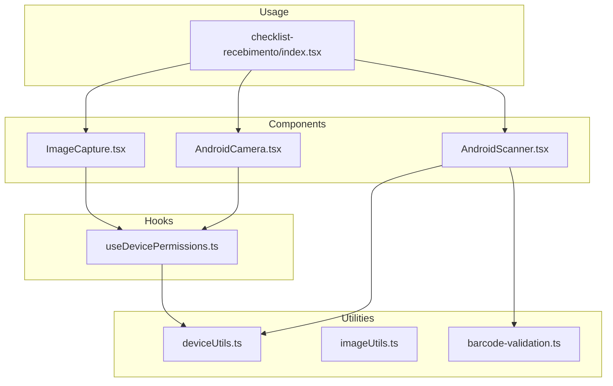
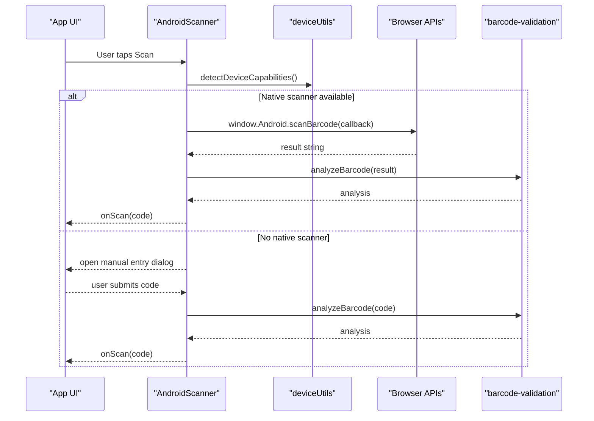
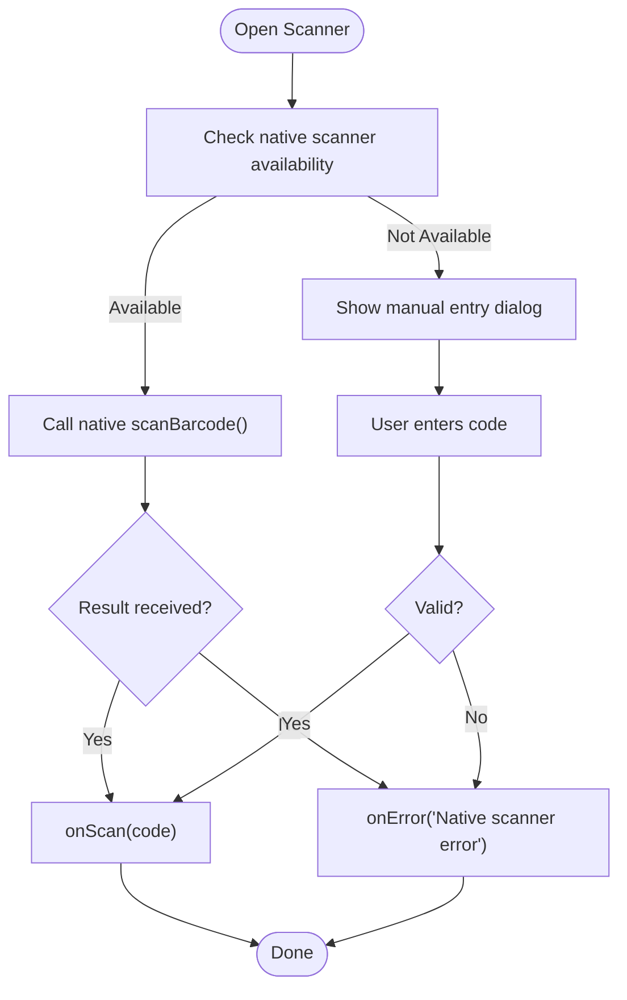
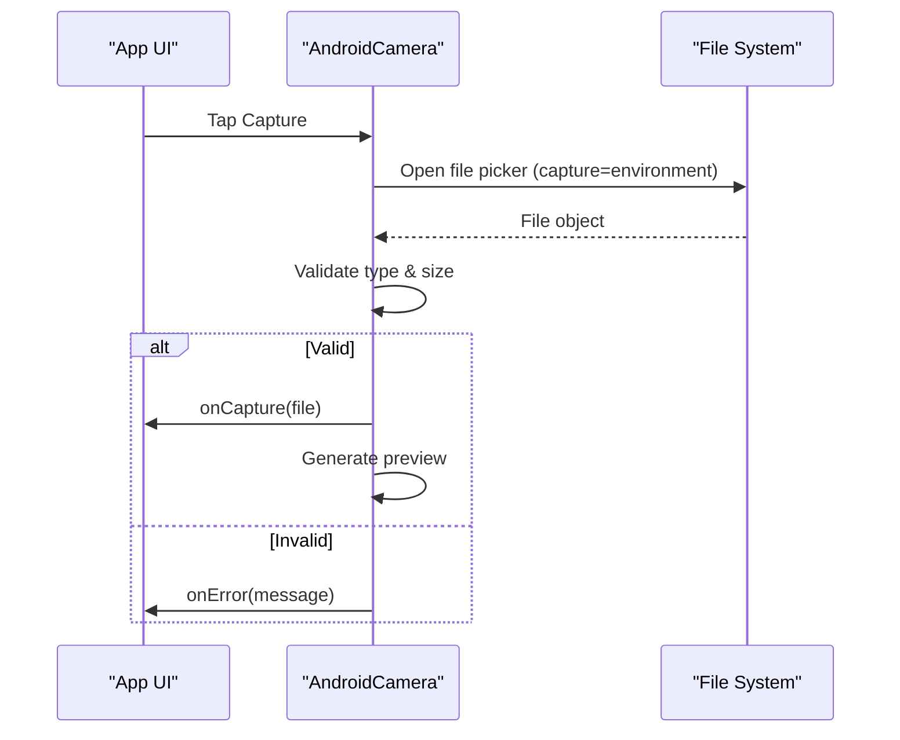
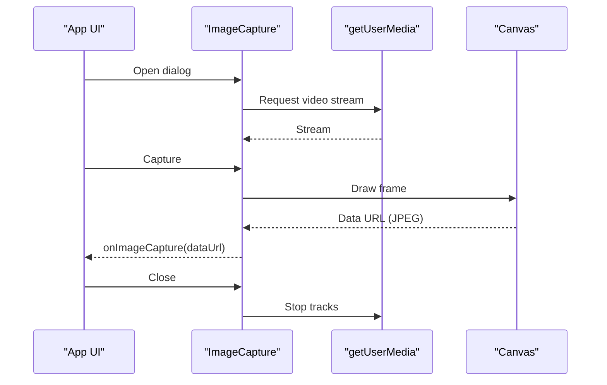
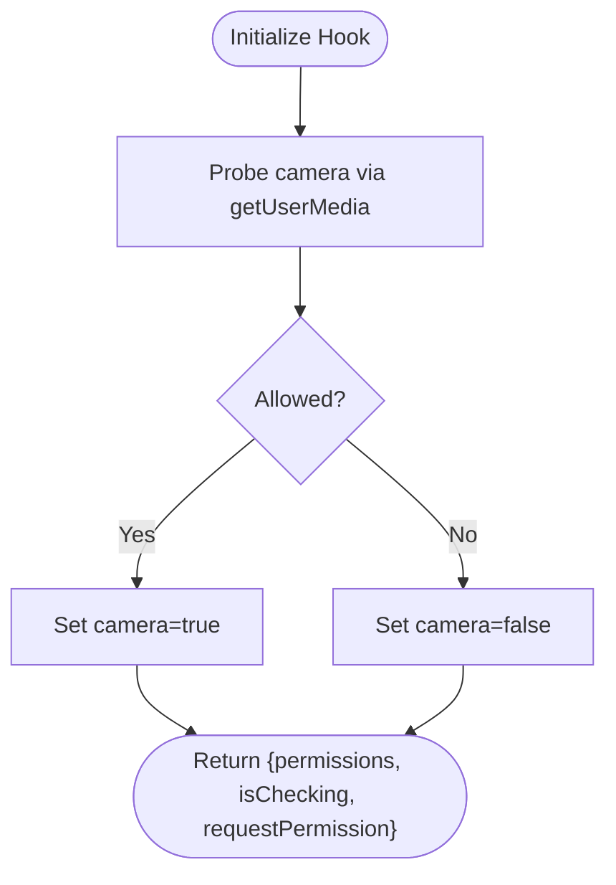
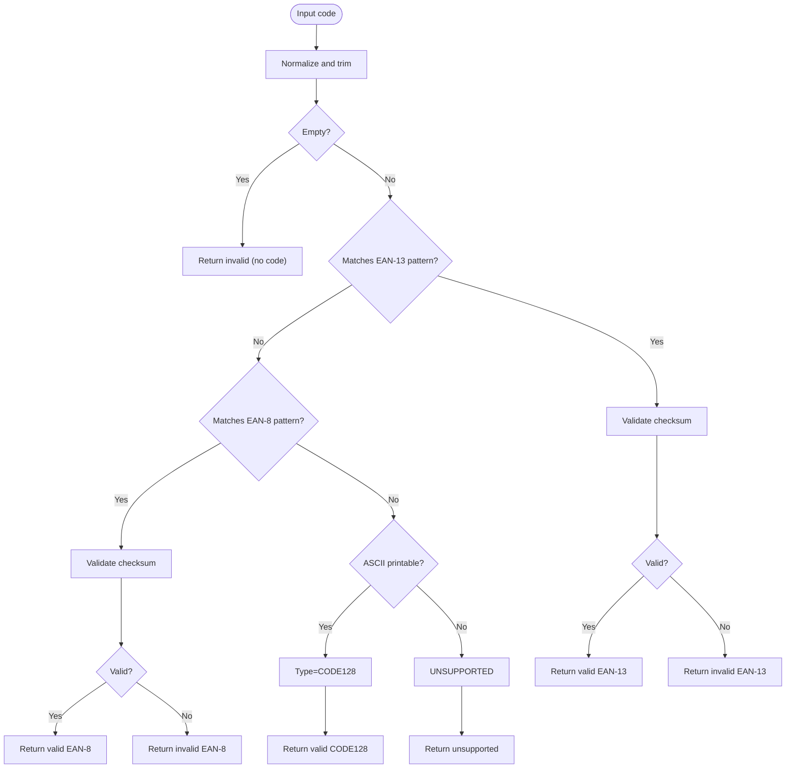
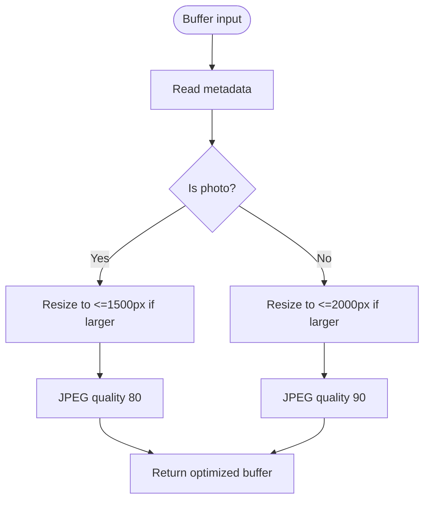
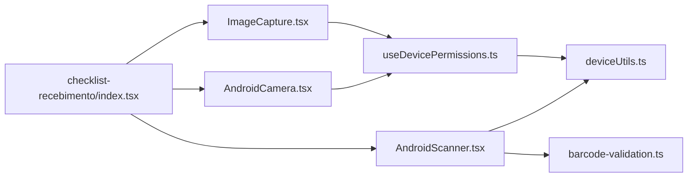

# Hardware Integration Components

<cite>
**Referenced Files in This Document**
- [AndroidScanner.tsx](file://components/AndroidScanner.tsx)
- [AndroidCamera.tsx](file://components/AndroidCamera.tsx)
- [ImageCapture.tsx](file://components/ImageCapture.tsx)
- [useDevicePermissions.ts](file://hooks/useDevicePermissions.ts)
- [deviceUtils.ts](file://lib/deviceUtils.ts)
- [imageUtils.ts](file://lib/imageUtils.ts)
- [barcode-validation.ts](file://lib/barcode-validation.ts)
- [checklist-recebimento/index.tsx](file://pages/checklist-recebimento/index.tsx)
</cite>

## Table of Contents
1. Introduction
2. Project Structure
3. Core Components
4. Architecture Overview
5. Detailed Component Analysis
6. Dependency Analysis
7. Performance Considerations
8. Troubleshooting Guide
9. Conclusion
10. Appendices

## Introduction
This document explains the hardware integration components that provide barcode scanning and image capture capabilities for mobile and desktop environments. It covers:
- AndroidScanner: integrated barcode scanning with native scanner fallbacks on Android devices.
- AndroidCamera: camera access and image capture using device file input with environment camera preference.
- ImageCapture: cross-platform image capture via browser APIs (getUserMedia), canvas, and gallery selection.
It also documents permission handling, camera API integration, barcode detection and validation, image optimization/compression, upload considerations, and error handling when hardware is unavailable.

## Project Structure
The hardware integration spans React components, hooks, and utilities:
- Components: AndroidScanner, AndroidCamera, ImageCapture
- Hooks: useDevicePermissions for capability and permission checks
- Utilities: deviceUtils for device capability detection; imageUtils for server-side image optimization; barcode-validation for format detection and checksum verification
- Usage examples: checklist-recebimento page integrates these components in a real workflow

**Diagram sources**
- [AndroidScanner.tsx:1-224](file://components/AndroidScanner.tsx#L1-L224)
- [AndroidCamera.tsx:1-219](file://components/AndroidCamera.tsx#L1-L219)
- [ImageCapture.tsx:1-234](file://components/ImageCapture.tsx#L1-L234)
- [useDevicePermissions.ts:1-69](file://hooks/useDevicePermissions.ts#L1-L69)
- [deviceUtils.ts:1-39](file://lib/deviceUtils.ts#L1-L39)
- [imageUtils.ts:1-38](file://lib/imageUtils.ts#L1-L38)
- [barcode-validation.ts:1-89](file://lib/barcode-validation.ts#L1-L89)
- [checklist-recebimento/index.tsx:500-699](file://pages/checklist-recebimento/index.tsx#L500-L699)

**Section sources**
- [AndroidScanner.tsx:1-224](file://components/AndroidScanner.tsx#L1-L224)
- [AndroidCamera.tsx:1-219](file://components/AndroidCamera.tsx#L1-L219)
- [ImageCapture.tsx:1-234](file://components/ImageCapture.tsx#L1-L234)
- [useDevicePermissions.ts:1-69](file://hooks/useDevicePermissions.ts#L1-L69)
- [deviceUtils.ts:1-39](file://lib/deviceUtils.ts#L1-L39)
- [imageUtils.ts:1-38](file://lib/imageUtils.ts#L1-L38)
- [barcode-validation.ts:1-89](file://lib/barcode-validation.ts#L1-L89)
- [checklist-recebimento/index.tsx:500-699](file://pages/checklist-recebimento/index.tsx#L500-L699)

## Core Components
- AndroidScanner: Attempts to use a native Android scanner bridge when available; otherwise opens a manual entry dialog. Emits scanned codes via onScan and errors via onError.
- AndroidCamera: Uses an invisible file input with capture="environment" to trigger the device camera on mobile; validates image type and size; shows preview and allows replacement.
- ImageCapture: Opens a modal with live camera stream via getUserMedia, captures frames to a canvas as JPEG, supports gallery selection, and emits base64 image data URLs.

Key responsibilities:
- Device capability detection and permission requests
- Camera stream lifecycle management
- Barcode scanning with fallbacks
- Image capture, preview, and basic validation
- Error reporting through callbacks

**Section sources**
- [AndroidScanner.tsx:22-85](file://components/AndroidScanner.tsx#L22-L85)
- [AndroidCamera.tsx:18-84](file://components/AndroidCamera.tsx#L18-L84)
- [ImageCapture.tsx:21-108](file://components/ImageCapture.tsx#L21-L108)
- [useDevicePermissions.ts:9-69](file://hooks/useDevicePermissions.ts#L9-L69)
- [deviceUtils.ts:1-39](file://lib/deviceUtils.ts#L1-L39)

## Architecture Overview
The system combines platform-specific shortcuts (native scanner bridge) with web standards (getUserMedia, File API) and utility services for validation and optimization.

**Diagram sources**
- [AndroidScanner.tsx:46-85](file://components/AndroidScanner.tsx#L46-L85)
- [deviceUtils.ts:8-39](file://lib/deviceUtils.ts#L8-L39)
- [barcode-validation.ts:35-89](file://lib/barcode-validation.ts#L35-L89)

## Detailed Component Analysis

### AndroidScanner
Responsibilities:
- Detect native scanner availability via device capabilities
- Invoke native scan if present; otherwise show manual entry dialog
- Validate and emit scanned codes; surface errors

Implementation highlights:
- Capability check uses deviceUtils to determine if a native scanner bridge exists on Android
- Fallback UI provides manual code entry with keyboard support
- Errors are reported via onError callback

**Diagram sources**
- [AndroidScanner.tsx:46-85](file://components/AndroidScanner.tsx#L46-L85)
- [deviceUtils.ts:8-39](file://lib/deviceUtils.ts#L8-L39)

Configuration and usage:
- Props include onScan, onError, buttonText, size, variant, color, disabled
- In pages, it is used to fill product fields by emitting scanned codes directly into form fields

**Section sources**
- [AndroidScanner.tsx:22-85](file://components/AndroidScanner.tsx#L22-L85)
- [AndroidScanner.tsx:86-224](file://components/AndroidScanner.tsx#L86-L224)
- [checklist-recebimento/index.tsx:507-512](file://pages/checklist-recebimento/index.tsx#L507-L512)

### AndroidCamera
Responsibilities:
- Trigger device camera on mobile using capture="environment"
- Validate selected images (type and size)
- Provide preview and replace functionality

Implementation highlights:
- Hidden file input with accept="image/*" and capture="environment"
- Size limit enforced (e.g., 10MB)
- Preview generated via FileReader; currentFile state supported

**Diagram sources**
- [AndroidCamera.tsx:43-77](file://components/AndroidCamera.tsx#L43-L77)

Configuration and usage:
- Props include onCapture, onError, currentFile, buttonText, size, variant, color, disabled
- Used in receiving checklist to capture overall receipt photos and individual product photos

**Section sources**
- [AndroidCamera.tsx:18-84](file://components/AndroidCamera.tsx#L18-L84)
- [AndroidCamera.tsx:94-219](file://components/AndroidCamera.tsx#L94-L219)
- [checklist-recebimento/index.tsx:542-610](file://pages/checklist-recebimento/index.tsx#L542-L610)

### ImageCapture
Responsibilities:
- Cross-platform camera capture via getUserMedia
- Canvas-based frame capture to JPEG
- Gallery selection fallback
- Stream lifecycle management

Implementation highlights:
- Starts camera stream with facingMode='environment'
- Captures frame to canvas and converts to JPEG base64
- Supports selecting from gallery via hidden file input
- Stops tracks on close to free resources

**Diagram sources**
- [ImageCapture.tsx:44-83](file://components/ImageCapture.tsx#L44-L83)
- [ImageCapture.tsx:85-108](file://components/ImageCapture.tsx#L85-L108)
- [ImageCapture.tsx:105-108](file://components/ImageCapture.tsx#L105-L108)

Configuration and usage:
- Props include open, onClose, onImageCapture, maxImages, currentImages
- Used in list controls flow to add images to records

**Section sources**
- [ImageCapture.tsx:21-108](file://components/ImageCapture.tsx#L21-L108)
- [ImageCapture.tsx:110-234](file://components/ImageCapture.tsx#L110-L234)

### Permission Handling and Device Capabilities
Responsibilities:
- Detect device capabilities (Android, Movfast, native scanner presence, camera access)
- Request and verify camera permissions
- Expose a hook to manage permissions across the app

Implementation highlights:
- detectDeviceCapabilities inspects UA and enumerates devices to infer capabilities
- useDevicePermissions performs a probe getUserMedia call to confirm camera permission
- Provides requestPermission helper to prompt and update state

**Diagram sources**
- [useDevicePermissions.ts:17-45](file://hooks/useDevicePermissions.ts#L17-L45)
- [deviceUtils.ts:8-39](file://lib/deviceUtils.ts#L8-L39)

**Section sources**
- [useDevicePermissions.ts:1-69](file://hooks/useDevicePermissions.ts#L1-L69)
- [deviceUtils.ts:1-39](file://lib/deviceUtils.ts#L1-L39)

### Barcode Detection and Validation
Responsibilities:
- Detect barcode type (EAN-8, EAN-13, CODE128)
- Validate checksums for EAN formats
- Normalize and return structured analysis

Implementation highlights:
- Validates length and digits for EAN-8/EAN-13
- Computes checksums and compares against provided digit
- Returns analysis including validity, type, normalized value, and reason for invalidity

**Diagram sources**
- [barcode-validation.ts:3-40](file://lib/barcode-validation.ts#L3-L40)
- [barcode-validation.ts:42-89](file://lib/barcode-validation.ts#L42-L89)

**Section sources**
- [barcode-validation.ts:1-89](file://lib/barcode-validation.ts#L1-L89)

### Image Optimization and Compression
Responsibilities:
- Optimize images for storage/transmission
- Resize large images while preserving aspect ratio
- Apply appropriate compression based on content type

Implementation highlights:
- Uses sharp to read metadata and resize if needed
- For photos, resizes to max 1500px and compresses to JPEG at quality 80
- For documents, resizes to max 2000px and compresses to JPEG at quality 90
- Returns original buffer on failure

**Diagram sources**
- [imageUtils.ts:3-38](file://lib/imageUtils.ts#L3-L38)

**Section sources**
- [imageUtils.ts:1-38](file://lib/imageUtils.ts#L1-L38)

## Dependency Analysis
- AndroidScanner depends on deviceUtils for capability detection and optionally on barcode-validation for post-scan analysis.
- AndroidCamera relies on browser File API and MUI components; no direct dependency on utilities but integrates with parent state.
- ImageCapture depends on browser mediaDevices and Canvas; no direct dependency on utilities but emits data URLs for downstream processing.
- useDevicePermissions depends on deviceUtils and browser APIs to report capabilities and permissions.
- The checklist page composes all three components to implement a complete receiving workflow.

**Diagram sources**
- [AndroidScanner.tsx:46-85](file://components/AndroidScanner.tsx#L46-L85)
- [deviceUtils.ts:8-39](file://lib/deviceUtils.ts#L8-L39)
- [barcode-validation.ts:35-89](file://lib/barcode-validation.ts#L35-L89)
- [AndroidCamera.tsx:43-77](file://components/AndroidCamera.tsx#L43-L77)
- [ImageCapture.tsx:44-83](file://components/ImageCapture.tsx#L44-L83)
- [useDevicePermissions.ts:17-45](file://hooks/useDevicePermissions.ts#L17-L45)
- [checklist-recebimento/index.tsx:507-610](file://pages/checklist-recebimento/index.tsx#L507-L610)

**Section sources**
- [AndroidScanner.tsx:46-85](file://components/AndroidScanner.tsx#L46-L85)
- [AndroidCamera.tsx:43-77](file://components/AndroidCamera.tsx#L43-L77)
- [ImageCapture.tsx:44-83](file://components/ImageCapture.tsx#L44-L83)
- [useDevicePermissions.ts:17-45](file://hooks/useDevicePermissions.ts#L17-L45)
- [deviceUtils.ts:8-39](file://lib/deviceUtils.ts#L8-L39)
- [barcode-validation.ts:35-89](file://lib/barcode-validation.ts#L35-L89)
- [checklist-recebimento/index.tsx:507-610](file://pages/checklist-recebimento/index.tsx#L507-L610)

## Performance Considerations
- Prefer native scanner bridges on Android when available to reduce latency and improve accuracy.
- Limit captured image sizes and apply compression to minimize network payload and storage costs.
- Reuse streams judiciously; always stop tracks when closing camera dialogs to avoid memory leaks.
- Use device capability detection to conditionally render features only when supported.

[No sources needed since this section provides general guidance]

## Troubleshooting Guide
Common issues and resolutions:
- Native scanner not available: AndroidScanner falls back to manual entry; ensure device capabilities are detected correctly.
- Camera permission denied: useDevicePermissions probes getUserMedia; handle denial by prompting users to enable permissions in OS settings.
- Invalid image selection: AndroidCamera validates type and size; guide users to select valid images under the size limit.
- Barcode validation failures: barcode-validation returns reasons for invalid EAN codes; display messages to users to re-scan or correct input.
- Stream not stopping: Ensure ImageCapture stops all tracks on close to release camera resources.

**Section sources**
- [AndroidScanner.tsx:46-85](file://components/AndroidScanner.tsx#L46-L85)
- [useDevicePermissions.ts:17-45](file://hooks/useDevicePermissions.ts#L17-L45)
- [AndroidCamera.tsx:49-77](file://components/AndroidCamera.tsx#L49-L77)
- [barcode-validation.ts:42-89](file://lib/barcode-validation.ts#L42-L89)
- [ImageCapture.tsx:60-65](file://components/ImageCapture.tsx#L60-L65)

## Conclusion
The hardware integration layer provides robust, cross-platform support for barcode scanning and image capture:
- AndroidScanner leverages native scanners with graceful fallbacks.
- AndroidCamera offers simple, reliable capture with preview and validation.
- ImageCapture delivers a full-featured modal experience for camera and gallery inputs.
- Permissions and capabilities are proactively checked and managed.
- Barcode validation ensures data integrity, and image utilities optimize payloads.
These components compose cleanly within application flows, as demonstrated in the receiving checklist page.

[No sources needed since this section summarizes without analyzing specific files]

## Appendices

### Configuration Examples
- AndroidScanner: Configure props like onScan, onError, buttonText, size, variant, color, disabled to fit your UI. See usage in checklist page for inline scanning into form fields.
- AndroidCamera: Configure onCapture, onError, currentFile, buttonText, size, variant, color, disabled. Use in sections requiring photo evidence.
- ImageCapture: Configure open, onClose, onImageCapture, maxImages, currentImages to control modal behavior and limits.

**Section sources**
- [AndroidScanner.tsx:22-40](file://components/AndroidScanner.tsx#L22-L40)
- [AndroidCamera.tsx:18-38](file://components/AndroidCamera.tsx#L18-L38)
- [ImageCapture.tsx:21-35](file://components/ImageCapture.tsx#L21-L35)
- [checklist-recebimento/index.tsx:507-610](file://pages/checklist-recebimento/index.tsx#L507-L610)

### Custom Barcode Formats
- Extend barcode-validation to recognize additional formats by adding pattern checks and checksum logic.
- Integrate custom detection in AndroidScanner’s post-scan flow to validate and normalize results before emitting.

**Section sources**
- [barcode-validation.ts:35-89](file://lib/barcode-validation.ts#L35-L89)
- [AndroidScanner.tsx:46-85](file://components/AndroidScanner.tsx#L46-L85)

### Optimizing Image Quality for Different Use Cases
- Photos: Use lower quality (e.g., 80%) and smaller max dimensions to reduce size while maintaining clarity.
- Documents: Use higher quality (e.g., 90%) and larger max dimensions to preserve text legibility.
- Adjust thresholds in imageUtils based on business requirements.

**Section sources**
- [imageUtils.ts:3-38](file://lib/imageUtils.ts#L3-L38)

### Implementing Fallback Mechanisms When Hardware Is Unavailable
- AndroidScanner: Always provide manual entry as fallback; ensure UX communicates unavailability clearly.
- ImageCapture: Offer gallery selection when camera is blocked or unavailable.
- useDevicePermissions: Surface permission status and offer guided prompts to resolve issues.

**Section sources**
- [AndroidScanner.tsx:46-85](file://components/AndroidScanner.tsx#L46-L85)
- [ImageCapture.tsx:85-108](file://components/ImageCapture.tsx#L85-L108)
- [useDevicePermissions.ts:17-45](file://hooks/useDevicePermissions.ts#L17-L45)