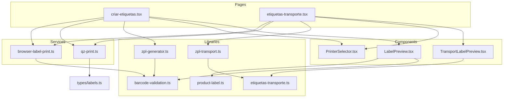
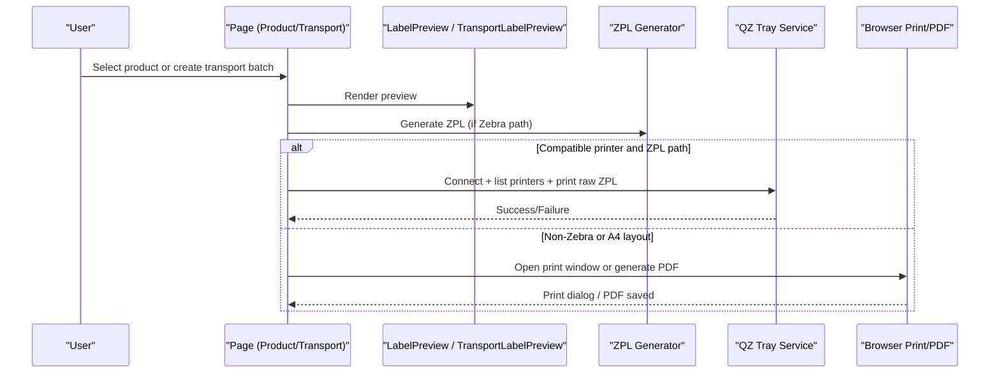
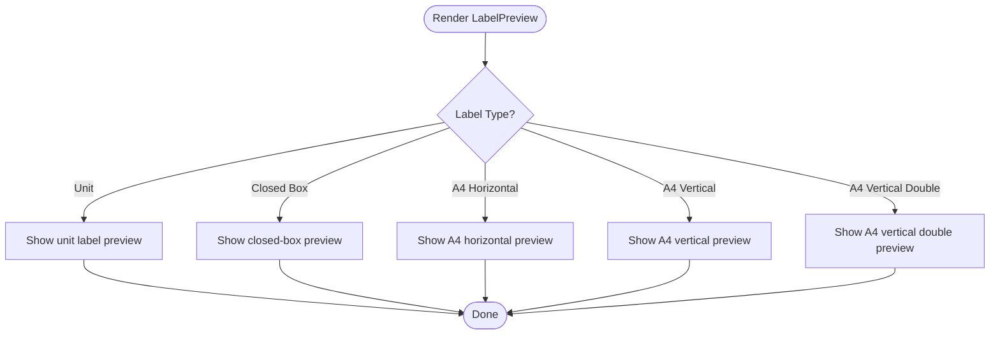
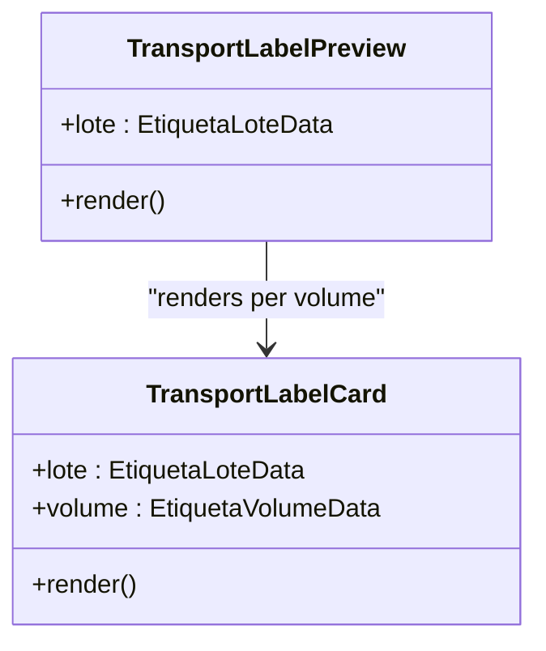
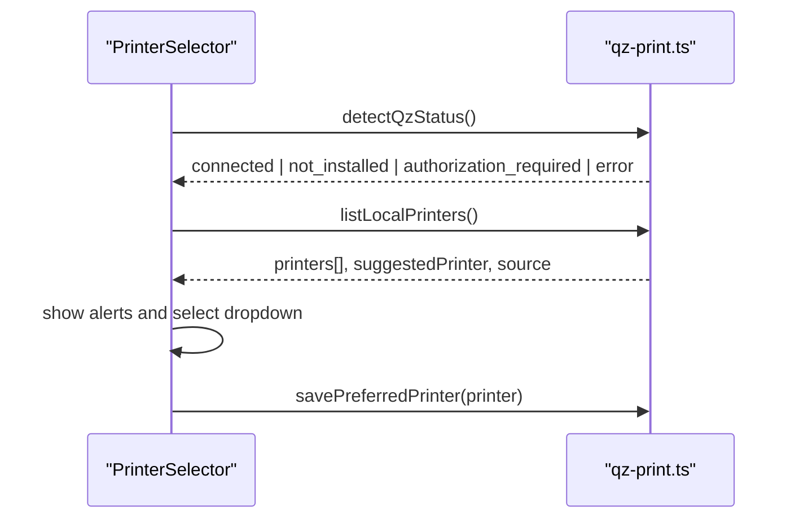
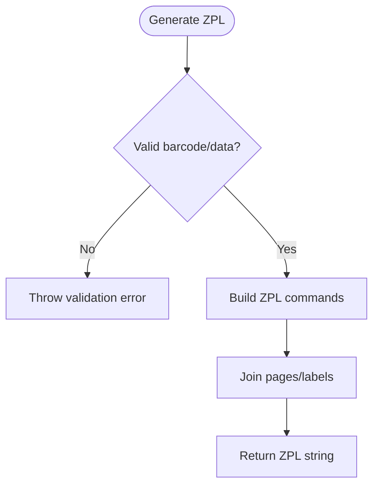
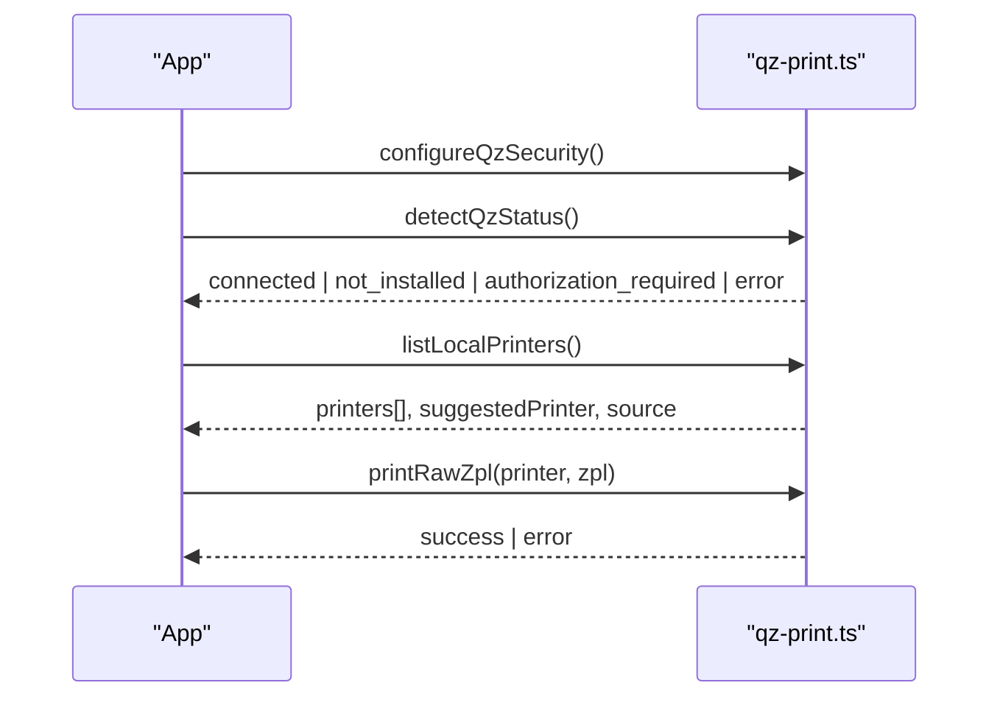
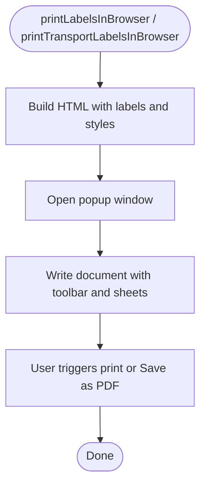
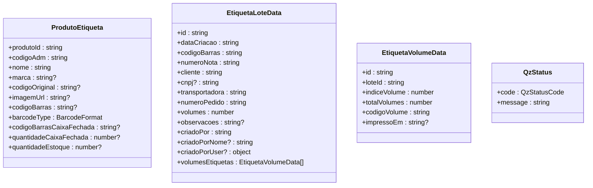
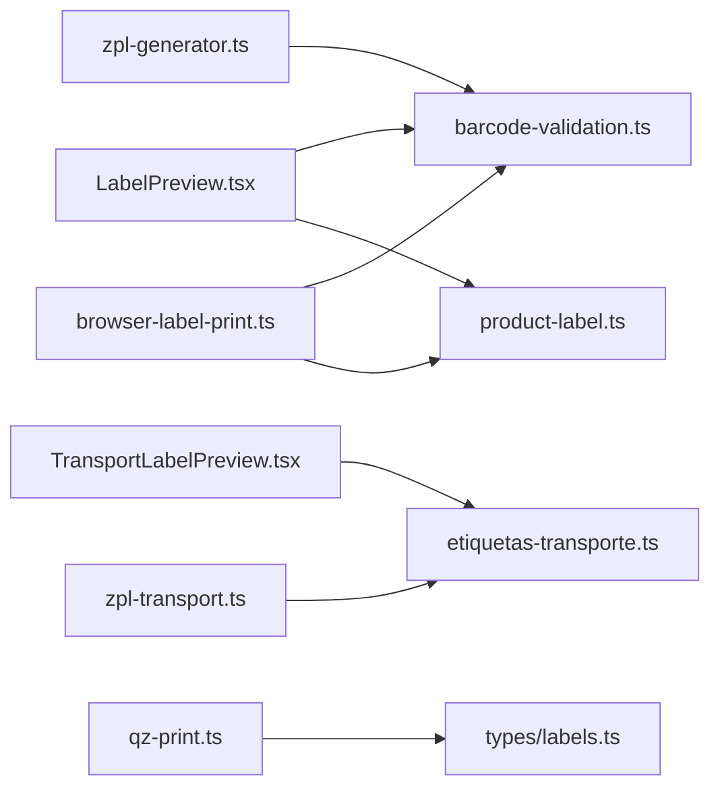

# Label Management Components

<cite>
**Referenced Files in This Document**
- [LabelPreview.tsx](file://components/labels/LabelPreview.tsx)
- [TransportLabelPreview.tsx](file://components/labels/TransportLabelPreview.tsx)
- [PrinterSelector.tsx](file://components/labels/PrinterSelector.tsx)
- [zpl-generator.ts](file://lib/zpl-generator.ts)
- [zpl-transport.ts](file://lib/zpl-transport.ts)
- [qz-print.ts](file://services/qz-print.ts)
- [browser-label-print.ts](file://services/browser-label-print.ts)
- [barcode-validation.ts](file://lib/barcode-validation.ts)
- [product-label.ts](file://lib/product-label.ts)
- [etiquetas-transporte.ts](file://lib/etiquetas-transporte.ts)
- [labels.ts](file://types/labels.ts)
- [criar-etiquetas.tsx](file://pages/criar-etiquetas.tsx)
- [etiquetas-transporte.tsx](file://pages/etiquetas-transporte.tsx)
</cite>

## Table of Contents
1. Introduction
2. Project Structure
3. Core Components
4. Architecture Overview
5. Detailed Component Analysis
6. Dependency Analysis
7. Performance Considerations
8. Troubleshooting Guide
9. Conclusion
10. Appendices

## Introduction
This document explains the label management components that generate, preview, and print product and transport labels. It covers:
- LabelPreview for standard product label rendering with ZPL support
- TransportLabelPreview for shipping labels with carrier-specific formatting
- PrinterSelector for device selection and print job management
It also documents ZPL code generation, printer connection handling via QZ Tray, label template customization, batch printing operations, error handling for connectivity issues, and browser-based fallback printing.

## Project Structure
The label system is composed of UI components, ZPL generators, a QZ Tray integration service, and browser fallback printing utilities. Pages orchestrate user flows to search products or create transport batches, then render previews and send print jobs.

**Diagram sources**
- [criar-etiquetas.tsx:1-558](file://pages/criar-etiquetas.tsx#L1-L558)
- [etiquetas-transporte.tsx:1-663](file://pages/etiquetas-transporte.tsx#L1-L663)
- [LabelPreview.tsx:1-298](file://components/labels/LabelPreview.tsx#L1-L298)
- [TransportLabelPreview.tsx:1-186](file://components/labels/TransportLabelPreview.tsx#L1-L186)
- [PrinterSelector.tsx:1-96](file://components/labels/PrinterSelector.tsx#L1-L96)
- [zpl-generator.ts:1-171](file://lib/zpl-generator.ts#L1-L171)
- [zpl-transport.ts:1-71](file://lib/zpl-transport.ts#L1-L71)
- [qz-print.ts:1-205](file://services/qz-print.ts#L1-L205)
- [browser-label-print.ts:1-800](file://services/browser-label-print.ts#L1-L800)
- [barcode-validation.ts:1-89](file://lib/barcode-validation.ts#L1-L89)
- [product-label.ts:1-7](file://lib/product-label.ts#L1-L7)
- [etiquetas-transporte.ts:1-350](file://lib/etiquetas-transporte.ts#L1-L350)
- [labels.ts:1-121](file://types/labels.ts#L1-L121)

**Section sources**
- [criar-etiquetas.tsx:1-558](file://pages/criar-etiquetas.tsx#L1-L558)
- [etiquetas-transporte.tsx:1-663](file://pages/etiquetas-transporte.tsx#L1-L663)

## Core Components
- LabelPreview: Renders a visual preview of product labels across multiple sizes (unit, closed box, A4 horizontal, A4 vertical, A4 vertical double). Uses barcode analysis and product formatting helpers to display accurate content.
- TransportLabelPreview: Renders shipping labels per volume with CODE128 barcodes, order number, carrier name, invoice number, client info, and CNPJ.
- PrinterSelector: Presents available printers, shows QZ Tray status, guides installation/authorization, and allows selecting a preferred printer.

Key responsibilities:
- Validate and analyze barcodes before generating output
- Generate ZPL for direct-to-Zebra printing when compatible
- Fallback to browser-based HTML/CSS print/PDF for non-Zebra devices
- Persist preferred printer and auto-suggest Zebra-compatible printers

**Section sources**
- [LabelPreview.tsx:1-298](file://components/labels/LabelPreview.tsx#L1-L298)
- [TransportLabelPreview.tsx:1-186](file://components/labels/TransportLabelPreview.tsx#L1-L186)
- [PrinterSelector.tsx:1-96](file://components/labels/PrinterSelector.tsx#L1-L96)

## Architecture Overview
The flow starts from pages that collect inputs, validate data, and decide between ZPL direct printing or browser-based printing. ZPL generators produce command strings for Zebra printers; QZ Tray handles low-level communication. Browser fallback uses JsBarcode and styled HTML to open a print dialog or PDF export.

**Diagram sources**
- [criar-etiquetas.tsx:235-262](file://pages/criar-etiquetas.tsx#L235-L262)
- [etiquetas-transporte.tsx:313-351](file://pages/etiquetas-transporte.tsx#L313-L351)
- [zpl-generator.ts:149-171](file://lib/zpl-generator.ts#L149-L171)
- [zpl-transport.ts:13-70](file://lib/zpl-transport.ts#L13-L70)
- [qz-print.ts:148-157](file://services/qz-print.ts#L148-L157)
- [browser-label-print.ts:675-684](file://services/browser-label-print.ts#L675-L684)

## Detailed Component Analysis

### LabelPreview
- Purpose: Visual preview of product labels for unit, closed box, and A4 variants.
- Behavior:
  - Chooses barcode based on label type (closed box vs unit)
  - Displays image placeholder if no image URL
  - Formats ADM code with thousands separators
  - Supports compact mode for multi-up A4 layouts
- Integration:
  - Uses barcode validation to determine format (EAN13/EAN8/CODE128)
  - Works alongside ZPL generator for actual printing

**Diagram sources**
- [LabelPreview.tsx:117-298](file://components/labels/LabelPreview.tsx#L117-L298)

**Section sources**
- [LabelPreview.tsx:1-298](file://components/labels/LabelPreview.tsx#L1-L298)
- [barcode-validation.ts:42-89](file://lib/barcode-validation.ts#L42-L89)
- [product-label.ts:1-7](file://lib/product-label.ts#L1-L7)

### TransportLabelPreview
- Purpose: Visual preview of shipping labels per volume with CODE128 barcodes.
- Behavior:
  - Renders order number, carrier name, invoice number, client, CNPJ
  - Generates CODE128 barcode per volume using JsBarcode
  - Shows volume index and total volumes
- Integration:
  - Uses transport label utilities for carrier name formatting and input validation

**Diagram sources**
- [TransportLabelPreview.tsx:15-186](file://components/labels/TransportLabelPreview.tsx#L15-L186)
- [etiquetas-transporte.ts:32-48](file://lib/etiquetas-transporte.ts#L32-L48)

**Section sources**
- [TransportLabelPreview.tsx:1-186](file://components/labels/TransportLabelPreview.tsx#L1-L186)
- [etiquetas-transporte.ts:1-350](file://lib/etiquetas-transporte.ts#L1-L350)

### PrinterSelector
- Purpose: Device selection and print job management UI with QZ Tray status.
- Behavior:
  - Shows alerts for not installed, authorization required, or no printers found
  - Provides install/download link and retry actions
  - Lists printers and marks Zebra/ZDesigner as recommended
  - Persists preferred printer via local storage

**Diagram sources**
- [PrinterSelector.tsx:16-96](file://components/labels/PrinterSelector.tsx#L16-L96)
- [qz-print.ts:18-30](file://services/qz-print.ts#L18-L30)
- [qz-print.ts:85-146](file://services/qz-print.ts#L85-L146)
- [qz-print.ts:194-205](file://services/qz-print.ts#L194-L205)

**Section sources**
- [PrinterSelector.tsx:1-96](file://components/labels/PrinterSelector.tsx#L1-L96)
- [qz-print.ts:1-205](file://services/qz-print.ts#L1-L205)

### ZPL Code Generation
- Product labels:
  - Builds ZPL commands for unit labels (multiple per page) and closed-box labels
  - Sanitizes text, splits long titles into lines, centers fields, sets darkness
  - Validates barcode type and value before building commands
- Transport labels:
  - Builds ZPL for each volume with order, carrier, invoice, client, CNPJ
  - Ensures at least one volume exists

**Diagram sources**
- [zpl-generator.ts:11-171](file://lib/zpl-generator.ts#L11-L171)
- [zpl-transport.ts:13-70](file://lib/zpl-transport.ts#L13-L70)
- [barcode-validation.ts:42-89](file://lib/barcode-validation.ts#L42-L89)

**Section sources**
- [zpl-generator.ts:1-171](file://lib/zpl-generator.ts#L1-L171)
- [zpl-transport.ts:1-71](file://lib/zpl-transport.ts#L1-L71)
- [barcode-validation.ts:1-89](file://lib/barcode-validation.ts#L1-L89)

### QZ Tray Integration and Printer Connection Handling
- Security configuration: certificate and signature endpoint setup
- Connection management: connect/reconnect with retries and keep-alive
- Printer discovery: prefers QZ Tray, falls back to Windows printers via API
- Status detection: maps errors to user-friendly states (not installed, authorization required, error)
- Printing: sends raw ZPL directly to selected printer

**Diagram sources**
- [qz-print.ts:32-56](file://services/qz-print.ts#L32-L56)
- [qz-print.ts:85-146](file://services/qz-print.ts#L85-L146)
- [qz-print.ts:148-157](file://services/qz-print.ts#L148-L157)
- [qz-print.ts:159-205](file://services/qz-print.ts#L159-L205)

**Section sources**
- [qz-print.ts:1-205](file://services/qz-print.ts#L1-L205)

### Browser-Based Printing (Fallback)
- Generates HTML/CSS with JsBarcode SVGs for product and transport labels
- Opens a new window with toolbar and print/PDF controls
- Supports A4 portrait/landscape layouts and multi-up sheets
- Validates barcodes and escapes HTML to prevent injection

**Diagram sources**
- [browser-label-print.ts:109-684](file://services/browser-label-print.ts#L109-L684)
- [browser-label-print.ts:691-800](file://services/browser-label-print.ts#L691-L800)

**Section sources**
- [browser-label-print.ts:1-800](file://services/browser-label-print.ts#L1-L800)

### Data Models and Types
- Barcode formats and label types define supported outputs
- Product and transport structures carry all necessary fields for rendering and printing
- QZ status codes unify error reporting across UI

**Diagram sources**
- [labels.ts:1-121](file://types/labels.ts#L1-L121)

**Section sources**
- [labels.ts:1-121](file://types/labels.ts#L1-L121)

## Dependency Analysis
- LabelPreview depends on barcode validation and product formatting
- TransportLabelPreview depends on transport label utilities for carrier names and validation
- ZPL generators depend on barcode validation and transport utilities
- QZ Tray service centralizes connection, printer discovery, and printing
- Browser fallback depends on JsBarcode and shared validation/formatting

**Diagram sources**
- [LabelPreview.tsx:1-298](file://components/labels/LabelPreview.tsx#L1-L298)
- [TransportLabelPreview.tsx:1-186](file://components/labels/TransportLabelPreview.tsx#L1-L186)
- [zpl-generator.ts:1-171](file://lib/zpl-generator.ts#L1-L171)
- [zpl-transport.ts:1-71](file://lib/zpl-transport.ts#L1-L71)
- [qz-print.ts:1-205](file://services/qz-print.ts#L1-L205)
- [browser-label-print.ts:1-800](file://services/browser-label-print.ts#L1-L800)
- [barcode-validation.ts:1-89](file://lib/barcode-validation.ts#L1-L89)
- [product-label.ts:1-7](file://lib/product-label.ts#L1-L7)
- [etiquetas-transporte.ts:1-350](file://lib/etiquetas-transporte.ts#L1-L350)
- [labels.ts:1-121](file://types/labels.ts#L1-L121)

**Section sources**
- [criar-etiquetas.tsx:1-558](file://pages/criar-etiquetas.tsx#L1-L558)
- [etiquetas-transporte.tsx:1-663](file://pages/etiquetas-transporte.tsx#L1-L663)

## Performance Considerations
- Batch ZPL generation:
  - Unit labels are grouped into pages with multiple items per row to reduce overhead
  - Closed-box labels generate one page per label
- Barcode validation:
  - Early validation prevents unnecessary processing and errors
- Printer discovery:
  - Multiple fallback strategies minimize latency and improve reliability
- Browser printing:
  - Efficient HTML generation and CSS grid layouts reduce reflows
  - JsBarcode renders lightweight SVGs for fast preview

[No sources needed since this section provides general guidance]

## Troubleshooting Guide
Common issues and resolutions:
- QZ Tray not installed:
  - Use the provided download link and follow guided steps to install and open the app
- Authorization required:
  - Authorize the site in QZ Tray settings; ensure certificate/signature endpoints are configured
- No printers found:
  - Refresh printer list; check Windows default printer; use fallback to Windows printers via API
- Invalid barcode:
  - Ensure EAN13/EAN8 checksums are correct; otherwise use CODE128-compatible values
- Print failures:
  - Verify printer compatibility; prefer Zebra/ZDesigner for direct ZPL; otherwise use browser print/PDF

**Section sources**
- [qz-print.ts:159-205](file://services/qz-print.ts#L159-L205)
- [criar-etiquetas.tsx:42-171](file://pages/criar-etiquetas.tsx#L42-L171)
- [etiquetas-transporte.tsx:114-180](file://pages/etiquetas-transporte.tsx#L114-L180)
- [barcode-validation.ts:42-89](file://lib/barcode-validation.ts#L42-L89)

## Conclusion
The label management system provides robust product and transport label workflows with:
- Accurate previews for multiple label sizes
- Direct ZPL printing to Zebra printers via QZ Tray
- Reliable browser-based fallback for non-Zebra devices
- Strong validation, error handling, and user guidance for connectivity and configuration issues

[No sources needed since this section summarizes without analyzing specific files]

## Appendices

### Examples and Best Practices
- Creating custom label templates:
  - For product labels, adjust ZPL dimensions and field positions in the generator to match physical label sizes
  - For transport labels, update carrier formatting and field placement in the transport generator
- Handling different label sizes:
  - Use A4 variants for browser print/PDF; use UNITARIA or CAIXA_FECHADA for ZPL direct printing
- Managing print queues:
  - Prefer ZPL direct printing for reliable queuing on Zebra printers; use browser print for ad-hoc jobs
- Integrating with QZ Tray:
  - Configure security certificate and signature endpoint; maintain QZ Tray running and authorized
- Troubleshooting common issues:
  - Check QZ Tray status and permissions; verify barcode validity; confirm printer compatibility

[No sources needed since this section provides general guidance]