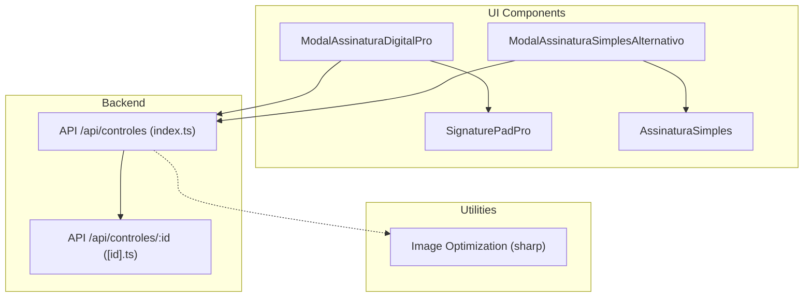
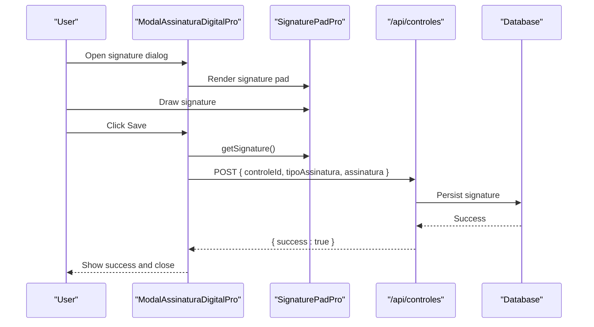
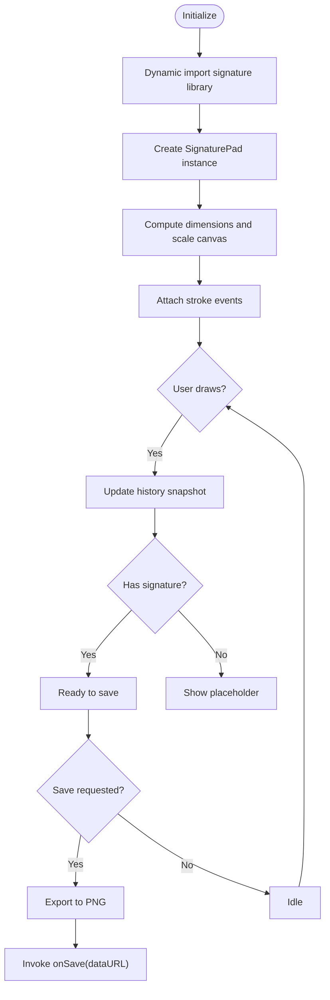
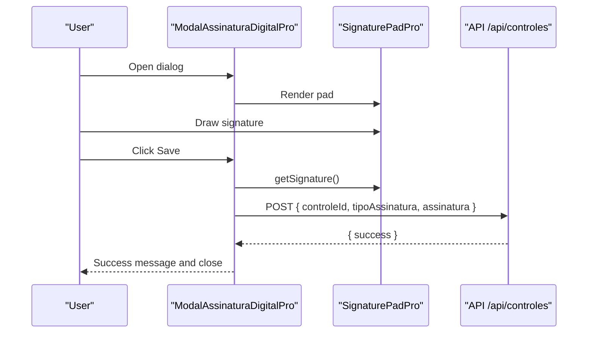
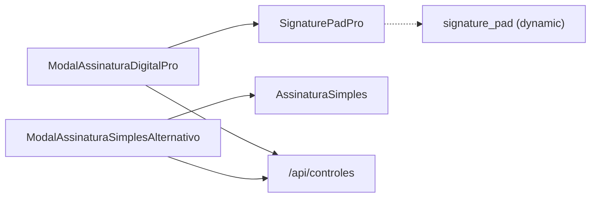

# Signature Capture Components

<cite>
**Referenced Files in This Document**
- [SignaturePadPro.tsx](file://components/SignaturePadPro.tsx)
- [ModalAssinaturaDigitalPro.tsx](file://components/ModalAssinaturaDigitalPro.tsx)
- [ModalAssinaturaSimplesAlternativo.tsx](file://components/ModalAssinaturaSimplesAlternativo.tsx)
- [AssinaturaSimples.tsx](file://components/AssinaturaSimples.tsx)
- [imageUtils.ts](file://lib/imageUtils.ts)
- [index.ts](file://pages/api/controles/index.ts)
- [id.ts](file://pages/api/controles/[id].ts)
</cite>

## Table of Contents
1. Introduction
2. Project Structure
3. Core Components
4. Architecture Overview
5. Detailed Component Analysis
6. Dependency Analysis
7. Performance Considerations
8. Troubleshooting Guide
9. Conclusion
10. Appendices

## Introduction
This document explains the signature capture components that provide digital signature collection and validation workflows across the application. It covers:
- SignaturePadPro: advanced canvas-based drawing with pressure sensitivity, stroke smoothing, undo/redo, responsive resizing, and export to PNG.
- ModalAssinaturaDigitalPro: modal wrapper around SignaturePadPro that validates input and persists signatures via a backend API.
- ModalAssinaturaSimplesAlternativo: alternative modal using a simpler signature pad for quick capture flows.
- AssinaturaSimples: lightweight canvas-based signature pad with mouse and touch support.

It also documents integration points with backend APIs, image optimization utilities, accessibility considerations, and customization options for appearance, verification, device handling, and storage.

## Project Structure
The signature capture features are implemented as React components under components/, with supporting utilities in lib/ and Next.js API routes under pages/api/. The modal components orchestrate user interactions and call backend endpoints to persist signatures.

**Diagram sources**
- [SignaturePadPro.tsx:1-668](file://components/SignaturePadPro.tsx#L1-L668)
- [ModalAssinaturaDigitalPro.tsx:1-270](file://components/ModalAssinaturaDigitalPro.tsx#L1-L270)
- [ModalAssinaturaSimplesAlternativo.tsx:1-225](file://components/ModalAssinaturaSimplesAlternativo.tsx#L1-L225)
- [AssinaturaSimples.tsx:1-235](file://components/AssinaturaSimples.tsx#L1-L235)
- [index.ts:1-121](file://pages/api/controles/index.ts#L1-L121)
- [id.ts:1-93](file://pages/api/controles/[id].ts#L1-L93)
- [imageUtils.ts:1-38](file://lib/imageUtils.ts#L1-L38)

**Section sources**
- [SignaturePadPro.tsx:1-668](file://components/SignaturePadPro.tsx#L1-L668)
- [ModalAssinaturaDigitalPro.tsx:1-270](file://components/ModalAssinaturaDigitalPro.tsx#L1-L270)
- [ModalAssinaturaSimplesAlternativo.tsx:1-225](file://components/ModalAssinaturaSimplesAlternativo.tsx#L1-L225)
- [AssinaturaSimples.tsx:1-235](file://components/AssinaturaSimples.tsx#L1-L235)
- [index.ts:1-121](file://pages/api/controles/index.ts#L1-L121)
- [id.ts:1-93](file://pages/api/controles/[id].ts#L1-L93)
- [imageUtils.ts:1-38](file://lib/imageUtils.ts#L1-L38)

## Core Components
- SignaturePadPro
  - Canvas-based drawing powered by an external library with configurable pen color, min/max width, velocity smoothing, and background color.
  - Responsive canvas sizing with high-DPI scaling; preserves content on resize.
  - Undo/Redo history with state snapshots; limits history size to control memory.
  - Export to PNG data URL; exposes imperative methods (clear, isEmpty, getSignature, undo, redo).
  - Error states and loading indicators; supports disabled mode.

- ModalAssinaturaDigitalPro
  - Dialog wrapper that composes SignaturePadPro, validates presence of a signature, and posts it to a backend endpoint.
  - Provides success/error feedback and optional callback on save completion.

- ModalAssinaturaSimplesAlternativo
  - Alternative modal using AssinaturaSimples for simpler capture flows.
  - Posts signature to the same backend endpoint and handles success/error states.

- AssinaturaSimples
  - Lightweight canvas implementation with mouse and touch event handling.
  - High-DPI canvas setup, white background, and basic controls (clear, save).

**Section sources**
- [SignaturePadPro.tsx:28-81](file://components/SignaturePadPro.tsx#L28-L81)
- [SignaturePadPro.tsx:116-175](file://components/SignaturePadPro.tsx#L116-L175)
- [SignaturePadPro.tsx:177-253](file://components/SignaturePadPro.tsx#L177-L253)
- [SignaturePadPro.tsx:255-352](file://components/SignaturePadPro.tsx#L255-L352)
- [SignaturePadPro.tsx:412-668](file://components/SignaturePadPro.tsx#L412-L668)
- [ModalAssinaturaDigitalPro.tsx:22-93](file://components/ModalAssinaturaDigitalPro.tsx#L22-L93)
- [ModalAssinaturaDigitalPro.tsx:123-269](file://components/ModalAssinaturaDigitalPro.tsx#L123-L269)
- [ModalAssinaturaSimplesAlternativo.tsx:19-91](file://components/ModalAssinaturaSimplesAlternativo.tsx#L19-L91)
- [ModalAssinaturaSimplesAlternativo.tsx:113-224](file://components/ModalAssinaturaSimplesAlternativo.tsx#L113-L224)
- [AssinaturaSimples.tsx:13-141](file://components/AssinaturaSimples.tsx#L13-L141)
- [AssinaturaSimples.tsx:143-235](file://components/AssinaturaSimples.tsx#L143-L235)

## Architecture Overview
The signature capture flow integrates UI components with backend persistence:

**Diagram sources**
- [ModalAssinaturaDigitalPro.tsx:46-93](file://components/ModalAssinaturaDigitalPro.tsx#L46-L93)
- [SignaturePadPro.tsx:340-352](file://components/SignaturePadPro.tsx#L340-L352)
- [index.ts:1-121](file://pages/api/controles/index.ts#L1-L121)

**Section sources**
- [ModalAssinaturaDigitalPro.tsx:46-93](file://components/ModalAssinaturaDigitalPro.tsx#L46-L93)
- [SignaturePadPro.tsx:340-352](file://components/SignaturePadPro.tsx#L340-L352)
- [index.ts:1-121](file://pages/api/controles/index.ts#L1-L121)

## Detailed Component Analysis

### SignaturePadPro
- Responsibilities
  - Initialize and manage a signature pad instance on a canvas element.
  - Handle responsive resizing while preserving drawn strokes.
  - Maintain undo/redo history with bounded size.
  - Export signature as PNG data URL and expose imperative API.
  - Provide UI controls (undo, redo, clear, optional save) and error feedback.

- Key behaviors
  - Dynamic import of the signature library to reduce initial bundle.
  - High-DPI canvas scaling for crisp rendering.
  - Event listeners for stroke begin/end to update state and history.
  - External value binding to pre-populate or reset the pad.
  - Disabled state toggles interactivity by enabling/disabling events.

- Data flow
  - Drawing events update internal state and history snapshots.
  - Save triggers export to PNG and invokes onSave callback.
  - Undo/Redo restore previous snapshot states from history.

**Diagram sources**
- [SignaturePadPro.tsx:177-253](file://components/SignaturePadPro.tsx#L177-L253)
- [SignaturePadPro.tsx:255-352](file://components/SignaturePadPro.tsx#L255-L352)
- [SignaturePadPro.tsx:314-338](file://components/SignaturePadPro.tsx#L314-L338)

**Section sources**
- [SignaturePadPro.tsx:177-253](file://components/SignaturePadPro.tsx#L177-L253)
- [SignaturePadPro.tsx:255-352](file://components/SignaturePadPro.tsx#L255-L352)
- [SignaturePadPro.tsx:314-338](file://components/SignaturePadPro.tsx#L314-L338)

### ModalAssinaturaDigitalPro
- Responsibilities
  - Orchestrate signature capture within a dialog.
  - Validate that a signature exists before saving.
  - Post signature to backend and handle success/error states.
  - Provide clear actions and disable controls during operations.

- Integration
  - Uses SignaturePadPro via ref to access imperative methods.
  - Calls a backend endpoint to persist signature data.

**Diagram sources**
- [ModalAssinaturaDigitalPro.tsx:46-93](file://components/ModalAssinaturaDigitalPro.tsx#L46-L93)
- [ModalAssinaturaDigitalPro.tsx:186-199](file://components/ModalAssinaturaDigitalPro.tsx#L186-L199)
- [index.ts:1-121](file://pages/api/controles/index.ts#L1-L121)

**Section sources**
- [ModalAssinaturaDigitalPro.tsx:46-93](file://components/ModalAssinaturaDigitalPro.tsx#L46-L93)
- [ModalAssinaturaDigitalPro.tsx:186-199](file://components/ModalAssinaturaDigitalPro.tsx#L186-L199)

### ModalAssinaturaSimplesAlternativo
- Responsibilities
  - Provide an alternative modal flow using AssinaturaSimples.
  - Validate signature presence and post to backend.
  - Manage loading, error, and success states.

- Integration
  - Directly calls the same backend endpoint used by the Pro modal.

**Section sources**
- [ModalAssinaturaSimplesAlternativo.tsx:41-91](file://components/ModalAssinaturaSimplesAlternativo.tsx#L41-L91)
- [ModalAssinaturaSimplesAlternativo.tsx:174-181](file://components/ModalAssinaturaSimplesAlternativo.tsx#L174-L181)

### AssinaturaSimples
- Responsibilities
  - Implement a simple canvas-based signature pad with mouse and touch support.
  - Set up high-DPI canvas and white background.
  - Provide clear and save actions with validation.

- Input handling
  - Unified event handler computes coordinates relative to canvas bounding rect.
  - Prevents default scrolling behavior on touch devices.

**Section sources**
- [AssinaturaSimples.tsx:30-51](file://components/AssinaturaSimples.tsx#L30-L51)
- [AssinaturaSimples.tsx:53-104](file://components/AssinaturaSimples.tsx#L53-L104)
- [AssinaturaSimples.tsx:118-141](file://components/AssinaturaSimples.tsx#L118-L141)

## Dependency Analysis
- Component dependencies
  - ModalAssinaturaDigitalPro depends on SignaturePadPro and a backend API route.
  - ModalAssinaturaSimplesAlternativo depends on AssinaturaSimples and the same backend API route.
  - SignaturePadPro dynamically imports the signature library at runtime.
  - AssinaturaSimples is self-contained with no external libraries beyond React and Material UI.

- Backend integration
  - Both modals post to /api/controles with payload containing controleId, tipoAssinatura, and assinatura.
  - Existing API routes handle CRUD for controles; signature updates should be handled by a dedicated route or extended logic.

**Diagram sources**
- [ModalAssinaturaDigitalPro.tsx:186-199](file://components/ModalAssinaturaDigitalPro.tsx#L186-L199)
- [ModalAssinaturaSimplesAlternativo.tsx:174-181](file://components/ModalAssinaturaSimplesAlternativo.tsx#L174-L181)
- [SignaturePadPro.tsx:190-197](file://components/SignaturePadPro.tsx#L190-L197)
- [index.ts:1-121](file://pages/api/controles/index.ts#L1-L121)

**Section sources**
- [ModalAssinaturaDigitalPro.tsx:186-199](file://components/ModalAssinaturaDigitalPro.tsx#L186-L199)
- [ModalAssinaturaSimplesAlternativo.tsx:174-181](file://components/ModalAssinaturaSimplesAlternativo.tsx#L174-L181)
- [SignaturePadPro.tsx:190-197](file://components/SignaturePadPro.tsx#L190-L197)
- [index.ts:1-121](file://pages/api/controles/index.ts#L1-L121)

## Performance Considerations
- Canvas rendering
  - Use high-DPI scaling to ensure crisp strokes on retina displays.
  - Limit history size to prevent excessive memory usage during undo/redo.
  - Debounce or throttle redraws if implementing custom smoothing beyond provided settings.

- Image compression and storage
  - Signatures are exported as PNG data URLs; consider converting to JPEG with controlled quality for smaller payloads when storing in databases or transmitting over networks.
  - Use server-side image optimization utilities to resize and compress images before persistence.

- Network efficiency
  - Batch multiple signature updates if applicable.
  - Retry failed requests with exponential backoff and surface user-friendly errors.

[No sources needed since this section provides general guidance]

## Troubleshooting Guide
- Common issues
  - Signature not saving: Ensure a signature exists before calling save; validate backend response and handle errors gracefully.
  - Canvas not responding: Verify touchAction and event prevention to avoid scroll interference on mobile.
  - Blurry strokes: Confirm high-DPI scaling and correct canvas dimensions relative to container size.
  - Undo/Redo not working: Check that history snapshots are updated after each stroke and that history bounds are respected.

- Diagnostics
  - Inspect console logs for initialization and resize events.
  - Validate network requests to the backend API and inspect payloads.
  - Test with different input devices (mouse, stylus, touch) to ensure consistent behavior.

**Section sources**
- [SignaturePadPro.tsx:177-253](file://components/SignaturePadPro.tsx#L177-L253)
- [SignaturePadPro.tsx:314-338](file://components/SignaturePadPro.tsx#L314-L338)
- [AssinaturaSimples.tsx:68-104](file://components/AssinaturaSimples.tsx#L68-L104)
- [ModalAssinaturaDigitalPro.tsx:46-93](file://components/ModalAssinaturaDigitalPro.tsx#L46-L93)
- [ModalAssinaturaSimplesAlternativo.tsx:41-91](file://components/ModalAssinaturaSimplesAlternativo.tsx#L41-L91)

## Conclusion
The signature capture components provide flexible, accessible, and robust solutions for collecting digital signatures across devices. SignaturePadPro offers advanced features like pressure sensitivity and stroke smoothing, while the modal wrappers streamline validation and persistence. AssinaturaSimples provides a lightweight alternative for simpler use cases. Integrating with backend APIs enables secure storage and retrieval, and image optimization utilities help manage payload sizes effectively.

[No sources needed since this section summarizes without analyzing specific files]

## Appendices

### Customization Examples
- Customize appearance
  - Adjust pen color, line width range, and smoothing parameters in SignaturePadPro props.
  - Style containers and buttons using Material UI theme overrides.

- Implement signature verification
  - On the backend, compare stored signatures with new submissions using pixel-based similarity or vectorized stroke comparison.
  - Optionally compute hashes of signature images for integrity checks.

- Handle different input devices
  - Ensure touchAction is set to none to prevent scrolling while drawing.
  - Normalize coordinates across mouse and touch events for consistent drawing behavior.

- Integrate with backend storage systems
  - Extend the existing API routes to accept signature payloads and persist them securely.
  - Use image optimization utilities to compress and store signatures efficiently.

[No sources needed since this section provides general guidance]