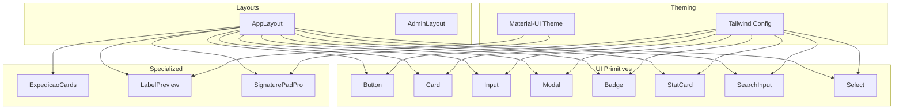
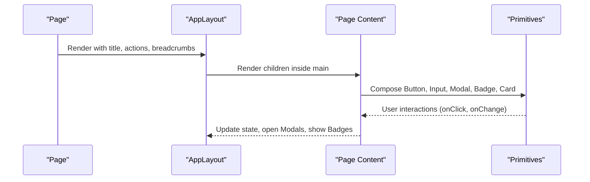
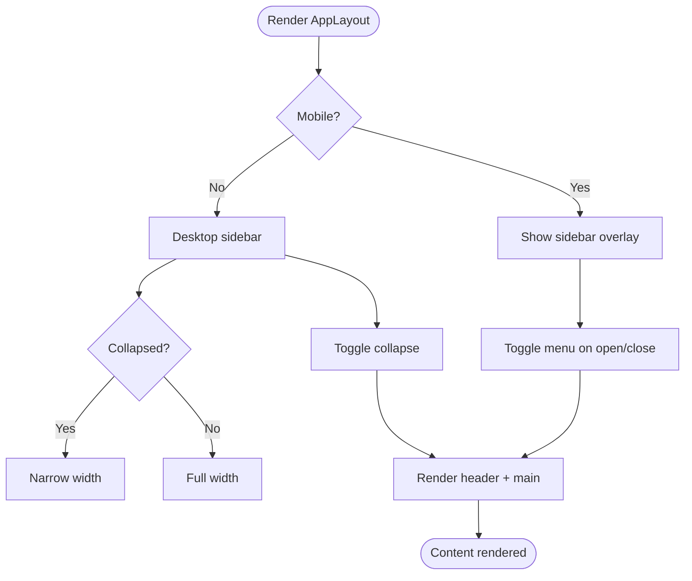
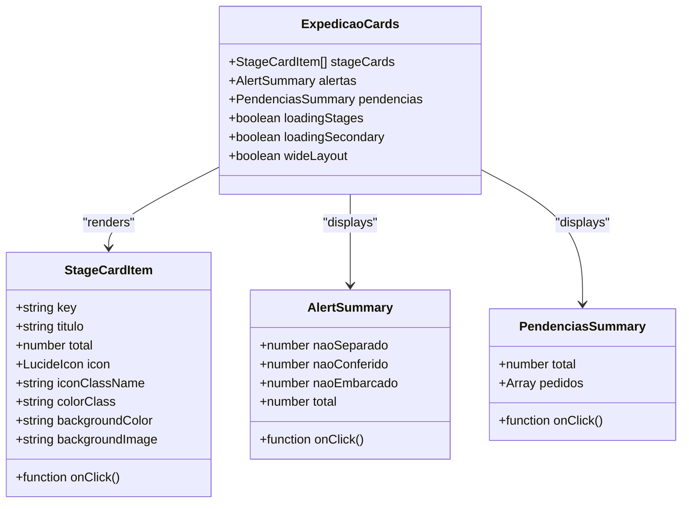
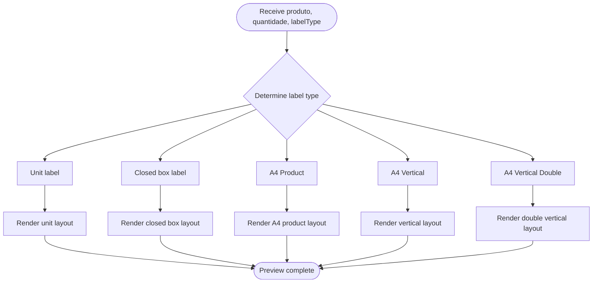
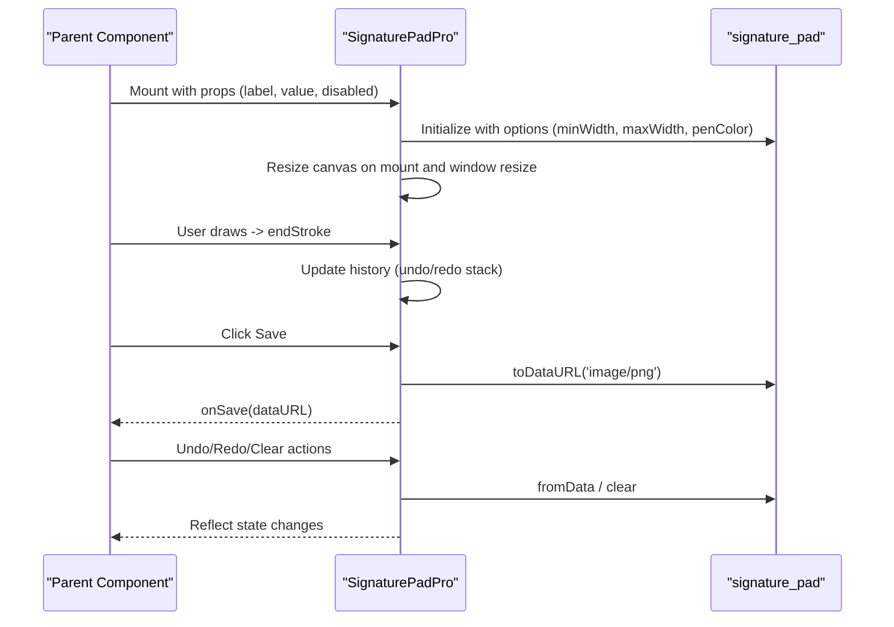
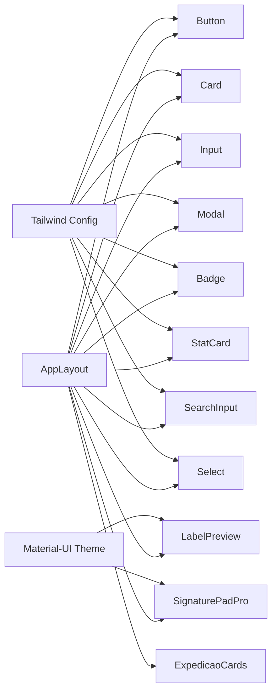

# Components Library

<cite>
**Referenced Files in This Document**
- [Button.tsx](file://components/ui/Button.tsx)
- [Card.tsx](file://components/ui/Card.tsx)
- [Input.tsx](file://components/ui/Input.tsx)
- [Modal.tsx](file://components/ui/Modal.tsx)
- [Badge.tsx](file://components/ui/Badge.tsx)
- [StatCard.tsx](file://components/ui/StatCard.tsx)
- [SearchInput.tsx](file://components/ui/SearchInput.tsx)
- [Select.tsx](file://components/ui/Select.tsx)
- [AppLayout.tsx](file://components/layout/AppLayout.tsx)
- [AdminLayout.tsx](file://components/admin/AdminLayout.tsx)
- [ExpedicaoCards.tsx](file://components/dashboard/ExpedicaoCards.tsx)
- [LabelPreview.tsx](file://components/labels/LabelPreview.tsx)
- [SignaturePadPro.tsx](file://components/SignaturePadPro.tsx)
- [theme.ts](file://styles/theme.ts)
- [tailwind.config.js](file://tailwind.config.js)
</cite>

## Table of Contents
1. Introduction
2. Project Structure
3. Core Components
4. Architecture Overview
5. Detailed Component Analysis
6. Dependency Analysis
7. Performance Considerations
8. Troubleshooting Guide
9. Conclusion
10. Appendices

## Introduction
This document describes the reusable component library used across the application. It covers UI primitives, layout components, and specialized components such as dashboard cards, label previews, and signature pads. For each component, you will find props/attributes, events, styling options, usage patterns, accessibility notes, responsive behavior, and customization guidelines. The theming system integrates Material-UI and Tailwind CSS to provide a consistent look and feel.

## Project Structure
The component library is organized by purpose:
- UI primitives: Button, Card, Input, Modal, Badge, StatCard, SearchInput, Select
- Layouts: AppLayout (primary), AdminLayout (compatibility wrapper)
- Specialized: Dashboard cards (ExpedicaoCards), Label preview (LabelPreview), Signature pad (SignaturePadPro)
- Theming: Material-UI theme configuration and Tailwind CSS custom tokens

**Diagram sources**
- [AppLayout.tsx:1-466](file://components/layout/AppLayout.tsx#L1-L466)
- [Button.tsx:1-65](file://components/ui/Button.tsx#L1-L65)
- [Card.tsx:1-39](file://components/ui/Card.tsx#L1-L39)
- [Input.tsx:1-24](file://components/ui/Input.tsx#L1-L24)
- [Modal.tsx:1-79](file://components/ui/Modal.tsx#L1-L79)
- [Badge.tsx:1-34](file://components/ui/Badge.tsx#L1-L34)
- [StatCard.tsx:1-135](file://components/ui/StatCard.tsx#L1-L135)
- [SearchInput.tsx:1-22](file://components/ui/SearchInput.tsx#L1-L22)
- [Select.tsx:1-29](file://components/ui/Select.tsx#L1-L29)
- [ExpedicaoCards.tsx:1-278](file://components/dashboard/ExpedicaoCards.tsx#L1-L278)
- [LabelPreview.tsx:1-298](file://components/labels/LabelPreview.tsx#L1-L298)
- [SignaturePadPro.tsx:1-668](file://components/SignaturePadPro.tsx#L1-L668)
- [theme.ts:1-515](file://styles/theme.ts#L1-L515)
- [tailwind.config.js:1-38](file://tailwind.config.js#L1-L38)

**Section sources**
- [AppLayout.tsx:1-466](file://components/layout/AppLayout.tsx#L1-L466)
- [tailwind.config.js:1-38](file://tailwind.config.js#L1-L38)
- [theme.ts:1-515](file://styles/theme.ts#L1-L515)

## Core Components
This section summarizes the core UI primitives with their props, events, styling, and usage guidance.

- Button
  - Purpose: Primary action button with variants and sizes; supports loading state and icons.
  - Props: variant (primary, secondary, danger, ghost, outline), size (sm, md, lg, icon), loading, iconLeft, iconRight, plus standard HTML button attributes.
  - Events: onClick via standard button event propagation.
  - Styling: Tailwind classes merged via utility function; rounded corners, transitions, disabled states.
  - Accessibility: Inherits native button semantics; ensure accessible names via children or aria-label when needed.
  - Usage example path: [Button.tsx:10-65](file://components/ui/Button.tsx#L10-L65)

- Card
  - Purpose: Container for grouped content with optional padding control.
  - Props: children, className, noPadding.
  - Events: None intrinsic; pass through to container.
  - Styling: White background, border, rounded corners; internal padding controlled by prop.
  - Accessibility: Semantic div; wrap meaningful content with appropriate headings if needed.
  - Usage example path: [Card.tsx:9-39](file://components/ui/Card.tsx#L9-L39)

- Input
  - Purpose: Styled text input with focus ring and disabled state.
  - Props: All standard input attributes via forwardRef; className support.
  - Events: onChange, onBlur, onFocus, etc., via standard input events.
  - Styling: Consistent borders, focus rings using primary color; placeholder styling.
  - Accessibility: Supports ref forwarding; pair with labels via htmlFor/id or aria-describedby.
  - Usage example path: [Input.tsx:4-24](file://components/ui/Input.tsx#L4-L24)

- Modal
  - Purpose: Accessible modal dialog with backdrop, header, body, footer, and sizes.
  - Props: isOpen, onClose, title, titleClassName, children, footer, size (sm, md, lg, xl).
  - Events: onClose triggered on backdrop click and close button.
  - Styling: Backdrop blur, rounded card, scrollable body, responsive sizing.
  - Accessibility: Focus trap not implemented here; ensure parent manages focus and keyboard interactions. Provide descriptive title and role attributes where applicable.
  - Usage example path: [Modal.tsx:10-79](file://components/ui/Modal.tsx#L10-L79)

- Badge
  - Purpose: Small status indicators with semantic variants.
  - Props: children, variant (success, warning, danger, info, neutral), className.
  - Events: None intrinsic.
  - Styling: Rounded pill with subtle borders and colors per variant.
  - Accessibility: Use aria-live or roles sparingly; avoid conveying critical info solely via color.
  - Usage example path: [Badge.tsx:9-34](file://components/ui/Badge.tsx#L9-L34)

- StatCard
  - Purpose: Animated metric card with gradient backgrounds, icon, trend indicator, and sizes.
  - Props: title, value, icon, color, trend, loading, delay, size (md, sm, xs).
  - Events: None intrinsic; composed from Card and motion elements.
  - Styling: Gradient backgrounds, hover lift effect, responsive typography.
  - Accessibility: Ensure numeric values are readable; consider aria-label for screen readers if needed.
  - Usage example path: [StatCard.tsx:6-135](file://components/ui/StatCard.tsx#L6-L135)

- SearchInput
  - Purpose: Input with integrated search icon.
  - Props: Extends InputProps; containerClassName for layout control.
  - Events: Delegates to underlying Input.
  - Styling: Icon overlay with left padding; consistent with Input styles.
  - Accessibility: Add aria-label or associate with a visible label.
  - Usage example path: [SearchInput.tsx:6-22](file://components/ui/SearchInput.tsx#L6-L22)

- Select
  - Purpose: Styled native select with chevron indicator.
  - Props: Standard select attributes via forwardRef; className support.
  - Events: onChange, onBlur, onFocus, etc.
  - Styling: Custom appearance with consistent borders and focus rings.
  - Accessibility: Pair with labels; ensure keyboard navigation works natively.
  - Usage example path: [Select.tsx:5-29](file://components/ui/Select.tsx#L5-L29)

**Section sources**
- [Button.tsx:10-65](file://components/ui/Button.tsx#L10-L65)
- [Card.tsx:9-39](file://components/ui/Card.tsx#L9-L39)
- [Input.tsx:4-24](file://components/ui/Input.tsx#L4-L24)
- [Modal.tsx:10-79](file://components/ui/Modal.tsx#L10-L79)
- [Badge.tsx:9-34](file://components/ui/Badge.tsx#L9-L34)
- [StatCard.tsx:6-135](file://components/ui/StatCard.tsx#L6-L135)
- [SearchInput.tsx:6-22](file://components/ui/SearchInput.tsx#L6-L22)
- [Select.tsx:5-29](file://components/ui/Select.tsx#L5-L29)

## Architecture Overview
The layout layer composes primitives into full-page experiences. AppLayout provides a responsive sidebar, header, breadcrumbs, and main content area. AdminLayout wraps AppLayout for backward compatibility. Specialized components like ExpedicaoCards, LabelPreview, and SignaturePadPro integrate with both Material-UI and Tailwind CSS depending on their domain needs.

**Diagram sources**
- [AppLayout.tsx:35-466](file://components/layout/AppLayout.tsx#L35-L466)
- [Button.tsx:10-65](file://components/ui/Button.tsx#L10-L65)
- [Modal.tsx:10-79](file://components/ui/Modal.tsx#L10-L79)
- [Badge.tsx:9-34](file://components/ui/Badge.tsx#L9-L34)
- [Card.tsx:9-39](file://components/ui/Card.tsx#L9-L39)

**Section sources**
- [AppLayout.tsx:35-466](file://components/layout/AppLayout.tsx#L35-L466)
- [AdminLayout.tsx:4-19](file://components/admin/AdminLayout.tsx#L4-L19)

## Detailed Component Analysis

### AppLayout
- Responsibilities: Sidebar navigation, collapsible menu, mobile overlay, sticky header, breadcrumbs, page title/subtitle/actions, fluid content width toggle.
- Props: children, title, subtitle?, showHeader?, breadcrumbs?, actions?, fluid?
- Behavior: 
  - Sidebar auto-closes after inactivity on desktop; persists collapsed state in localStorage.
  - Role-based menu filtering for admin-only items.
  - Responsive: mobile drawer with overlay; desktop static sidebar with collapse/expand.
- Accessibility: Uses semantic nav and link elements; ensure active states are clear; keyboard navigation supported by links/buttons.
- Styling: Tailwind utilities; uses app-wide color tokens.
- Composition: Wraps pages; can include any combination of primitives.

**Diagram sources**
- [AppLayout.tsx:54-210](file://components/layout/AppLayout.tsx#L54-L210)
- [AppLayout.tsx:212-466](file://components/layout/AppLayout.tsx#L212-L466)

**Section sources**
- [AppLayout.tsx:35-466](file://components/layout/AppLayout.tsx#L35-L466)

### AdminLayout
- Purpose: Compatibility wrapper around AppLayout for legacy usage.
- Props: children, title
- Notes: Deprecated; prefer AppLayout directly.

**Section sources**
- [AdminLayout.tsx:4-19](file://components/admin/AdminLayout.tsx#L4-L19)

### Button
- Props: variant, size, loading, iconLeft, iconRight, plus all HTML button attributes.
- Events: onClick via standard propagation.
- Styling: Variants map to Tailwind classes; sizes adjust height/padding/text; loading shows spinner.
- Accessibility: Disabled state handled; ensure accessible name via children or aria-label.
- Usage example path: [Button.tsx:10-65](file://components/ui/Button.tsx#L10-L65)

**Section sources**
- [Button.tsx:10-65](file://components/ui/Button.tsx#L10-L65)

### Card and CardHeader
- Card: Container with optional padding; use noPadding for edge-to-edge layouts.
- CardHeader: Title, optional subtitle, and actions slot; responsive alignment.
- Styling: Consistent borders, spacing, and typography.
- Usage example paths: [Card.tsx:9-39](file://components/ui/Card.tsx#L9-L39)

**Section sources**
- [Card.tsx:9-39](file://components/ui/Card.tsx#L9-L39)

### Input and SearchInput
- Input: Forwarded ref, focus ring, disabled state, placeholder styling.
- SearchInput: Adds search icon overlay; delegates to Input.
- Accessibility: Associate with labels; ensure focus management in forms.
- Usage example paths: [Input.tsx:4-24](file://components/ui/Input.tsx#L4-L24), [SearchInput.tsx:6-22](file://components/ui/SearchInput.tsx#L6-L22)

**Section sources**
- [Input.tsx:4-24](file://components/ui/Input.tsx#L4-L24)
- [SearchInput.tsx:6-22](file://components/ui/SearchInput.tsx#L6-L22)

### Modal
- Props: isOpen, onClose, title, titleClassName, children, footer, size.
- Events: onClose on backdrop and close button.
- Styling: Backdrop blur, rounded card, scrollable body, responsive sizes.
- Accessibility: Ensure focus management in parent; provide descriptive title.
- Usage example path: [Modal.tsx:10-79](file://components/ui/Modal.tsx#L10-L79)

**Section sources**
- [Modal.tsx:10-79](file://components/ui/Modal.tsx#L10-L79)

### Badge
- Props: children, variant, className.
- Styling: Pill shape with semantic color variants.
- Accessibility: Avoid relying solely on color for meaning; add text context.
- Usage example path: [Badge.tsx:9-34](file://components/ui/Badge.tsx#L9-L34)

**Section sources**
- [Badge.tsx:9-34](file://components/ui/Badge.tsx#L9-L34)

### StatCard
- Props: title, value, icon, color, trend, loading, delay, size.
- Styling: Gradient backgrounds, hover lift, responsive typography.
- Accessibility: Ensure numeric clarity; consider aria-label for screen readers.
- Usage example path: [StatCard.tsx:6-135](file://components/ui/StatCard.tsx#L6-L135)

**Section sources**
- [StatCard.tsx:6-135](file://components/ui/StatCard.tsx#L6-L135)

### Select
- Props: Standard select attributes via forwardRef; className.
- Styling: Chevron indicator, consistent borders/focus.
- Accessibility: Native select ensures keyboard support; pair with labels.
- Usage example path: [Select.tsx:5-29](file://components/ui/Select.tsx#L5-L29)

**Section sources**
- [Select.tsx:5-29](file://components/ui/Select.tsx#L5-L29)

### ExpedicaoCards (Dashboard Cards)
- Purpose: Visual summary of order stages and alerts; animated entrance; responsive grid.
- Props: stageCards[], alertas{}, pendencias{}, loadingStages?, loadingSecondary?, wideLayout?
- Events: onClick handlers passed via stageCards/alertas/pendencias for drill-down.
- Styling: Gradient cards, hover effects, responsive grids; animations via motion.
- Accessibility: Buttons with descriptive text; loading states indicated with spinners.
- Usage example path: [ExpedicaoCards.tsx:40-278](file://components/dashboard/ExpedicaoCards.tsx#L40-L278)

**Diagram sources**
- [ExpedicaoCards.tsx:5-47](file://components/dashboard/ExpedicaoCards.tsx#L5-L47)
- [ExpedicaoCards.tsx:118-278](file://components/dashboard/ExpedicaoCards.tsx#L118-L278)

**Section sources**
- [ExpedicaoCards.tsx:40-278](file://components/dashboard/ExpedicaoCards.tsx#L40-L278)

### LabelPreview
- Purpose: Preview product labels in multiple formats (unit, closed box, A4 variants).
- Props: produto (product data), quantidade (count), labelType (UNITARIA, CAIXA_FECHADA, A4_PRODUTO, A4_PRODUTO_VERTICAL, A4_PRODUTO_VERTICAL_DUPLA).
- Events: None intrinsic; renders based on props.
- Styling: Material-UI Box/Typography; aspect ratios and grid layouts; barcode visualization.
- Accessibility: Descriptive alt text for images; informative titles for sections.
- Usage example path: [LabelPreview.tsx:6-298](file://components/labels/LabelPreview.tsx#L6-L298)

**Diagram sources**
- [LabelPreview.tsx:117-298](file://components/labels/LabelPreview.tsx#L117-L298)

**Section sources**
- [LabelPreview.tsx:6-298](file://components/labels/LabelPreview.tsx#L6-L298)

### SignaturePadPro
- Purpose: Canvas-based signature capture with undo/redo, clear, save, and responsive resizing.
- Props: onSave, label, value?, disabled?, showSaveButton?, penColor?, minWidth?, maxWidth?, velocityFilterWeight?
- Events: onSave invoked with base64 image data; internal beginStroke/endStroke for history.
- Styling: Material-UI Paper, Typography, Buttons; responsive canvas sizing; error alerts.
- Accessibility: Labels for controls; tooltips for icons; keyboard-friendly buttons.
- Usage example path: [SignaturePadPro.tsx:28-668](file://components/SignaturePadPro.tsx#L28-L668)

**Diagram sources**
- [SignaturePadPro.tsx:177-352](file://components/SignaturePadPro.tsx#L177-L352)
- [SignaturePadPro.tsx:354-410](file://components/SignaturePadPro.tsx#L354-L410)
- [SignaturePadPro.tsx:412-668](file://components/SignaturePadPro.tsx#L412-L668)

**Section sources**
- [SignaturePadPro.tsx:28-668](file://components/SignaturePadPro.tsx#L28-L668)

## Dependency Analysis
- UI primitives depend on Tailwind CSS utilities and shared cn helper for class merging.
- Layout depends on Next.js router and auth context for navigation and user state.
- Specialized components mix Material-UI (LabelPreview, SignaturePadPro) with Tailwind (others).
- Theming:
  - Material-UI theme defines palette, typography, breakpoints, and component overrides.
  - Tailwind config extends colors, radii, and shadows used across components.

**Diagram sources**
- [tailwind.config.js:1-38](file://tailwind.config.js#L1-L38)
- [theme.ts:1-515](file://styles/theme.ts#L1-L515)
- [AppLayout.tsx:1-466](file://components/layout/AppLayout.tsx#L1-L466)
- [Button.tsx:1-65](file://components/ui/Button.tsx#L1-L65)
- [Card.tsx:1-39](file://components/ui/Card.tsx#L1-L39)
- [Input.tsx:1-24](file://components/ui/Input.tsx#L1-L24)
- [Modal.tsx:1-79](file://components/ui/Modal.tsx#L1-L79)
- [Badge.tsx:1-34](file://components/ui/Badge.tsx#L1-L34)
- [StatCard.tsx:1-135](file://components/ui/StatCard.tsx#L1-L135)
- [SearchInput.tsx:1-22](file://components/ui/SearchInput.tsx#L1-L22)
- [Select.tsx:1-29](file://components/ui/Select.tsx#L1-L29)
- [ExpedicaoCards.tsx:1-278](file://components/dashboard/ExpedicaoCards.tsx#L1-L278)
- [LabelPreview.tsx:1-298](file://components/labels/LabelPreview.tsx#L1-L298)
- [SignaturePadPro.tsx:1-668](file://components/SignaturePadPro.tsx#L1-L668)

**Section sources**
- [tailwind.config.js:1-38](file://tailwind.config.js#L1-L38)
- [theme.ts:1-515](file://styles/theme.ts#L1-L515)

## Performance Considerations
- Prefer memoization for expensive computations in specialized components (e.g., expedicao cards formatting).
- Use lazy imports for heavy libraries (e.g., signature_pad) to reduce initial bundle size.
- Debounce resize handlers where possible; the signature pad already uses ResizeObserver and throttled drawing.
- Minimize re-renders by lifting state up and passing stable references for callbacks.
- Use responsive grids to avoid layout thrashing on different screen sizes.

[No sources needed since this section provides general guidance]

## Troubleshooting Guide
- Modal does not close: Ensure isOpen state is managed by parent and onClose updates it; verify backdrop click handler is attached.
- Input not updating: Confirm onChange handler updates form state; check disabled prop preventing interaction.
- SignaturePadPro errors:
  - Initialization fails: Verify canvas element exists before initialization; check dynamic import success.
  - Resize issues: Ensure container has dimensions; listen to window resize and orientationchange; confirm ResizeObserver cleanup.
  - Undo/Redo not working: Validate history stack updates on endStroke; ensure fromData restores correctly.
- LabelPreview rendering: Ensure product data includes required fields (name, brand, codes); verify labelType mapping.

**Section sources**
- [Modal.tsx:20-79](file://components/ui/Modal.tsx#L20-L79)
- [Input.tsx:6-24](file://components/ui/Input.tsx#L6-L24)
- [SignaturePadPro.tsx:177-410](file://components/SignaturePadPro.tsx#L177-L410)
- [LabelPreview.tsx:117-298](file://components/labels/LabelPreview.tsx#L117-L298)

## Conclusion
The component library provides a cohesive set of UI primitives, robust layouts, and specialized components tailored for dashboards, labeling, and signature capture. Theming via Material-UI and Tailwind CSS ensures consistency and customization. Follow the documented props, events, and accessibility guidelines to compose reliable and user-friendly interfaces.

[No sources needed since this section summarizes without analyzing specific files]

## Appendices

### Theming System and Style Overrides
- Material-UI Theme: Defines palette, typography, breakpoints, and component-level overrides for buttons, cards, inputs, alerts, menus, and tables.
- Tailwind Config: Extends color tokens (primary, background, textMain, textMuted, danger, success, warning), border radius scale, and shadow utilities.
- Integration: Components use Tailwind classes for layout and styling; Material-UI components leverage theme overrides for consistent design language.

**Section sources**
- [theme.ts:1-515](file://styles/theme.ts#L1-L515)
- [tailwind.config.js:1-38](file://tailwind.config.js#L1-L38)

### Accessibility Checklist
- Use semantic elements (button, input, nav, link) appropriately.
- Provide accessible names for interactive elements (aria-label when text is insufficient).
- Ensure focus management in modals and complex widgets.
- Maintain sufficient color contrast; do not rely solely on color for meaning.
- Test keyboard navigation and screen reader announcements.

[No sources needed since this section provides general guidance]

### Responsive Design Guidelines
- Mobile-first layouts with conditional rendering for overlays and drawers.
- Grid systems adapt columns based on breakpoints; use Tailwind responsive prefixes.
- Touch-friendly targets for buttons and inputs; increase hit areas on small screens.
- Dynamic resizing for canvas-based components (signature pad) to maintain usability.

[No sources needed since this section provides general guidance]