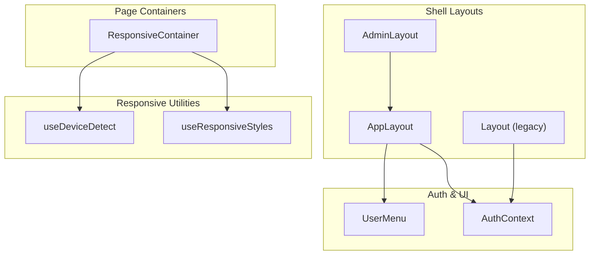
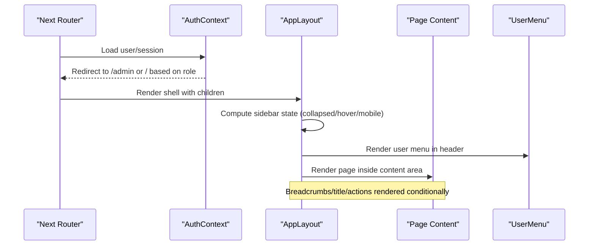
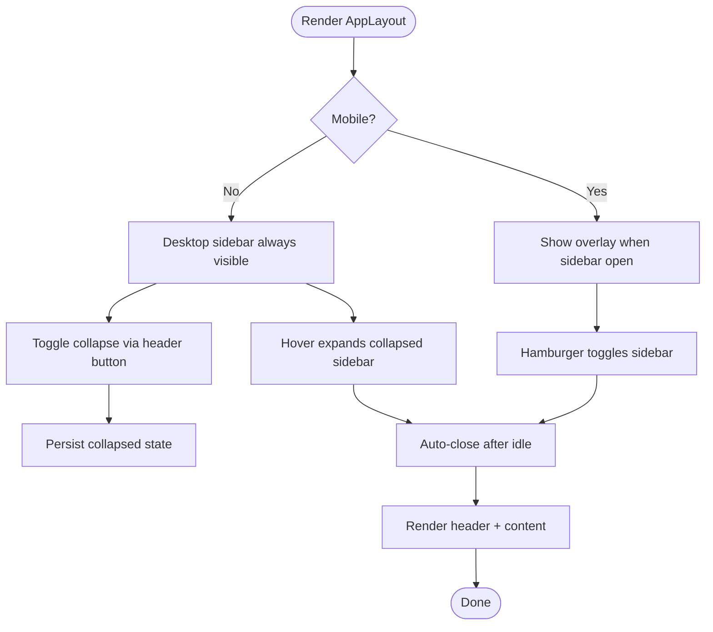
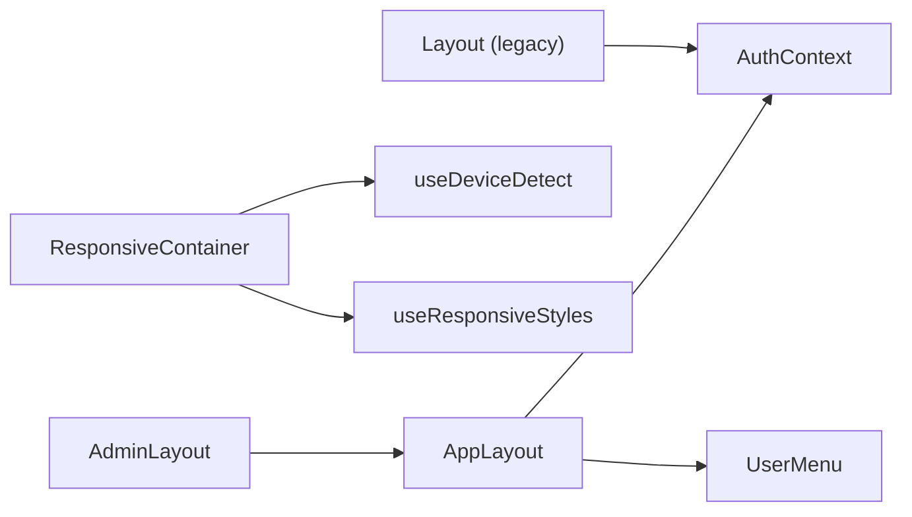

# Layout Components

<cite>
**Referenced Files in This Document**
- [AppLayout.tsx](file://components/layout/AppLayout.tsx)
- [AdminLayout.tsx](file://components/admin/AdminLayout.tsx)
- [ResponsiveContainer.tsx](file://components/ResponsiveContainer.tsx)
- [Layout.tsx](file://components/Layout.tsx)
- [AuthContext.tsx](file://contexts/AuthContext.tsx)
- [UserMenu.tsx](file://components/UserMenu.tsx)
- [useDeviceDetect.ts](file://hooks/useDeviceDetect.ts)
- [useResponsiveStyles.ts](file://hooks/useResponsiveStyles.ts)
</cite>

## Table of Contents
1. Introduction
2. Project Structure
3. Core Components
4. Architecture Overview
5. Detailed Component Analysis
6. Dependency Analysis
7. Performance Considerations
8. Troubleshooting Guide
9. Conclusion

## Introduction
This document explains the layout and container components that structure the application’s user interface. It covers:
- AppLayout for the main application shell (sidebar, header, content area)
- AdminLayout as a compatibility wrapper around AppLayout
- ResponsiveContainer for page-level containers with MUI-based responsive behavior
- The legacy Layout component using MUI Drawer and AppBar
- Navigation integration, sidebar management, header configuration, authentication-based layout switching, mobile responsiveness, and performance optimization techniques for large applications.

## Project Structure
The layout system is composed of several layers:
- Shell layouts: AppLayout and AdminLayout provide consistent chrome (sidebar, header, content).
- Page containers: ResponsiveContainer wraps page content with responsive spacing, breadcrumbs, and optional paper styling.
- Legacy layout: Layout provides an alternative MUI-based shell with drawer and app bar.
- Authentication context: AuthContext drives user state and redirects based on roles.
- User menu: UserMenu integrates profile and admin navigation from the header.
- Responsive utilities: useDeviceDetect and useResponsiveStyles supply device-aware values.

**Diagram sources**
- [AppLayout.tsx:1-466](file://components/layout/AppLayout.tsx#L1-L466)
- [AdminLayout.tsx:1-19](file://components/admin/AdminLayout.tsx#L1-L19)
- [ResponsiveContainer.tsx:1-155](file://components/ResponsiveContainer.tsx#L1-L155)
- [Layout.tsx:1-800](file://components/Layout.tsx#L1-L800)
- [AuthContext.tsx:1-508](file://contexts/AuthContext.tsx#L1-L508)
- [UserMenu.tsx:1-161](file://components/UserMenu.tsx#L1-L161)
- [useDeviceDetect.ts:1-58](file://hooks/useDeviceDetect.ts#L1-L58)
- [useResponsiveStyles.ts:1-71](file://hooks/useResponsiveStyles.ts#L1-L71)

**Section sources**
- [AppLayout.tsx:1-466](file://components/layout/AppLayout.tsx#L1-L466)
- [AdminLayout.tsx:1-19](file://components/admin/AdminLayout.tsx#L1-L19)
- [ResponsiveContainer.tsx:1-155](file://components/ResponsiveContainer.tsx#L1-L155)
- [Layout.tsx:1-800](file://components/Layout.tsx#L1-L800)
- [AuthContext.tsx:1-508](file://contexts/AuthContext.tsx#L1-L508)
- [UserMenu.tsx:1-161](file://components/UserMenu.tsx#L1-L161)
- [useDeviceDetect.ts:1-58](file://hooks/useDeviceDetect.ts#L1-L58)
- [useResponsiveStyles.ts:1-71](file://hooks/useResponsiveStyles.ts#L1-L71)

## Core Components
- AppLayout: Provides the primary application shell with a collapsible sidebar, sticky header, breadcrumbs, title/subtitle area, actions slot, and fluid or constrained content width. It includes role-based menu filtering and mobile overlay behavior.
- AdminLayout: A thin wrapper around AppLayout for backward compatibility; deprecated in favor of direct AppLayout usage.
- ResponsiveContainer: A page-level container using MUI Container with responsive padding, optional Paper, animated entrance, breadcrumbs, and typography scaling.
- Layout (legacy): An MUI-based shell with a fixed AppBar and a collapsible Drawer containing rich navigation, submenus, and user controls.

Key responsibilities:
- Sidebar management: toggle collapsed state, hover expansion, auto-close on idle, mobile overlay.
- Header configuration: sticky header with logo, subtitle, notifications, and user menu.
- Navigation integration: dynamic menu items with role-based visibility and active state detection.
- Responsive breakpoints: mobile-first behaviors with media queries and device detection hooks.

**Section sources**
- [AppLayout.tsx:35-161](file://components/layout/AppLayout.tsx#L35-L161)
- [AdminLayout.tsx:4-18](file://components/admin/AdminLayout.tsx#L4-L18)
- [ResponsiveContainer.tsx:15-155](file://components/ResponsiveContainer.tsx#L15-L155)
- [Layout.tsx:286-500](file://components/Layout.tsx#L286-L500)

## Architecture Overview
The layout architecture separates concerns into reusable shells and page containers:
- Shells (AppLayout, Layout) manage global chrome and navigation.
- Pages wrap content in ResponsiveContainer for consistent spacing and responsive behavior.
- AuthContext centralizes authentication state and routing decisions.
- UserMenu integrates profile and admin actions within headers.

**Diagram sources**
- [AuthContext.tsx:95-191](file://contexts/AuthContext.tsx#L95-L191)
- [AppLayout.tsx:212-463](file://components/layout/AppLayout.tsx#L212-L463)
- [UserMenu.tsx:27-161](file://components/UserMenu.tsx#L27-L161)

## Detailed Component Analysis

### AppLayout
Responsibilities:
- Sidebar: Fixed on desktop, slide-in overlay on mobile; supports collapse/expand, hover expansion, and auto-close after inactivity.
- Header: Sticky top bar with logo, subtitle, notification icon, and UserMenu.
- Content: Optional breadcrumbs, title/subtitle block, actions slot, and fluid or max-width content.
- Navigation: Centralized menu array with role-based filtering and active route detection.

Key behaviors:
- Role-based menu filtering: Items can be restricted by adminOnly or roles arrays.
- Active state: Uses router pathname matching to highlight current sections.
- Mobile UX: Overlay backdrop when sidebar is open; hamburger button toggles visibility.
- Persistence: Collapsed state persisted to localStorage.

**Diagram sources**
- [AppLayout.tsx:171-210](file://components/layout/AppLayout.tsx#L171-L210)
- [AppLayout.tsx:212-463](file://components/layout/AppLayout.tsx#L212-L463)

**Section sources**
- [AppLayout.tsx:35-161](file://components/layout/AppLayout.tsx#L35-L161)
- [AppLayout.tsx:171-210](file://components/layout/AppLayout.tsx#L171-L210)
- [AppLayout.tsx:212-463](file://components/layout/AppLayout.tsx#L212-L463)

### AdminLayout
- Purpose: Backward-compatible wrapper that delegates rendering to AppLayout.
- Usage: Accepts children and title props and passes them through to AppLayout.
- Deprecation note: Prefer using AppLayout directly for new code.

**Section sources**
- [AdminLayout.tsx:4-18](file://components/admin/AdminLayout.tsx#L4-L18)

### ResponsiveContainer
Responsibilities:
- Provides a responsive page container with configurable maxWidth, optional Paper background, and motion-based entrance animation.
- Renders optional breadcrumbs and title/subtitle with responsive typography.
- Adapts padding and elevation based on device size.

Usage patterns:
- Wrap page content to standardize spacing and visual hierarchy.
- Use breadcrumbs to reflect navigation context.
- Disable Paper for full-bleed pages or custom backgrounds.

**Section sources**
- [ResponsiveContainer.tsx:15-155](file://components/ResponsiveContainer.tsx#L15-L155)

### Layout (Legacy)
Responsibilities:
- MUI-based shell with a fixed AppBar and a collapsible Drawer.
- Rich navigation with submenus, role-based visibility, and active states.
- User menu integrated in the AppBar with logout and profile actions.

Behavior highlights:
- Drawer collapses on desktop and becomes a mobile drawer overlay.
- Submenus expand/collapse and auto-expand parent when needed.
- Role-based filtering for subitems and specific menus.

**Section sources**
- [Layout.tsx:286-500](file://components/Layout.tsx#L286-L500)
- [Layout.tsx:502-800](file://components/Layout.tsx#L502-L800)

### UserMenu
Responsibilities:
- Displays user avatar, name, and role in the header.
- Provides menu options: Profile, Settings, Admin Panel (if admin), Logout.
- Integrates with AuthContext for logout and navigation.

Integration points:
- Used in AppLayout header and potentially other shells.
- Conditional admin-only menu item based on user type.

**Section sources**
- [UserMenu.tsx:27-161](file://components/UserMenu.tsx#L27-L161)

### Authentication-Based Layout Switching
Routing and redirection:
- On load, AuthContext checks session and redirects authenticated users to appropriate routes based on role (e.g., ADMIN to /admin).
- Public routes bypass authentication checks.
- Unauthorized events trigger logout and redirect to login.

Implications for layout:
- Admin-specific features are gated by role checks in navigation and routes.
- UserMenu exposes admin panel access only for admins.

**Section sources**
- [AuthContext.tsx:95-191](file://contexts/AuthContext.tsx#L95-L191)
- [AuthContext.tsx:228-338](file://contexts/AuthContext.tsx#L228-L338)
- [AuthContext.tsx:340-380](file://contexts/AuthContext.tsx#L340-L380)
- [UserMenu.tsx:32-58](file://components/UserMenu.tsx#L32-L58)

### Responsive Breakpoints and Mobile Considerations
Breakpoints and device detection:
- useDeviceDetect uses MUI theme breakpoints to determine mobile view and detects platform capabilities (camera, scanner).
- useResponsiveStyles returns spacing, typography, and layout values tailored to mobile vs desktop.

Mobile UX patterns:
- AppLayout shows a slide-in sidebar with overlay on mobile; desktop keeps sidebar fixed.
- ResponsiveContainer adjusts padding, elevation, and typography for smaller screens.
- Legacy Layout switches between drawer and inline sidebar based on screen size.

Best practices:
- Use media queries consistently across components.
- Keep touch targets larger on mobile.
- Avoid heavy animations on low-end devices.

**Section sources**
- [useDeviceDetect.ts:12-58](file://hooks/useDeviceDetect.ts#L12-L58)
- [useResponsiveStyles.ts:36-71](file://hooks/useResponsiveStyles.ts#L36-L71)
- [AppLayout.tsx:212-238](file://components/layout/AppLayout.tsx#L212-L238)
- [ResponsiveContainer.tsx:37-50](file://components/ResponsiveContainer.tsx#L37-L50)
- [Layout.tsx:502-521](file://components/Layout.tsx#L502-L521)

## Dependency Analysis
Component relationships:
- AdminLayout depends on AppLayout.
- AppLayout depends on AuthContext for user data and navigation filtering, and renders UserMenu.
- ResponsiveContainer depends on MUI theme and hooks for responsive behavior.
- Legacy Layout depends on MUI components and AuthContext for user actions.

**Diagram sources**
- [AdminLayout.tsx:1-19](file://components/admin/AdminLayout.tsx#L1-L19)
- [AppLayout.tsx:1-466](file://components/layout/AppLayout.tsx#L1-L466)
- [ResponsiveContainer.tsx:1-155](file://components/ResponsiveContainer.tsx#L1-L155)
- [Layout.tsx:1-800](file://components/Layout.tsx#L1-L800)
- [AuthContext.tsx:1-508](file://contexts/AuthContext.tsx#L1-L508)
- [UserMenu.tsx:1-161](file://components/UserMenu.tsx#L1-L161)
- [useDeviceDetect.ts:1-58](file://hooks/useDeviceDetect.ts#L1-L58)
- [useResponsiveStyles.ts:1-71](file://hooks/useResponsiveStyles.ts#L1-L71)

**Section sources**
- [AppLayout.tsx:1-466](file://components/layout/AppLayout.tsx#L1-L466)
- [AdminLayout.tsx:1-19](file://components/admin/AdminLayout.tsx#L1-L19)
- [ResponsiveContainer.tsx:1-155](file://components/ResponsiveContainer.tsx#L1-L155)
- [Layout.tsx:1-800](file://components/Layout.tsx#L1-L800)
- [AuthContext.tsx:1-508](file://contexts/AuthContext.tsx#L1-L508)
- [UserMenu.tsx:1-161](file://components/UserMenu.tsx#L1-L161)
- [useDeviceDetect.ts:1-58](file://hooks/useDeviceDetect.ts#L1-L58)
- [useResponsiveStyles.ts:1-71](file://hooks/useResponsiveStyles.ts#L1-L71)

## Performance Considerations
Optimization techniques for large applications:
- Minimize re-renders in shells:
  - Memoize computed values like menu items and active states where possible.
  - Avoid unnecessary state updates in sidebar hover/auto-close logic.
- Lazy-load heavy components:
  - Defer non-critical UI (e.g., charts, maps) until they enter viewport.
- Reduce DOM thrashing:
  - Use CSS transitions instead of JS-driven animations for sidebar/header changes.
- Optimize images and avatars:
  - Serve appropriately sized images; consider lazy loading and caching strategies.
- Debounce/throttle interactions:
  - Apply to resize handlers or frequent mousemove events if used elsewhere.
- Prefer functional components and hooks:
  - Leverage React.memo for static parts of the shell (e.g., header icons).
- Keep navigation lightweight:
  - Avoid deep nesting in menus; flatten where possible for faster rendering.

[No sources needed since this section provides general guidance]

## Troubleshooting Guide
Common issues and resolutions:
- Sidebar not closing on mobile:
  - Ensure overlay click handler is attached and state updates correctly.
- Menu items not appearing:
  - Verify role-based filters (adminOnly, roles) match current user type.
- Incorrect active state:
  - Confirm route matching logic aligns with Next.js router paths.
- Header overflow on small screens:
  - Adjust flex wrapping and hide non-essential elements at lower breakpoints.
- Auth redirects looping:
  - Check public routes list and ensure protected routes are guarded properly.

**Section sources**
- [AppLayout.tsx:212-238](file://components/layout/AppLayout.tsx#L212-L238)
- [AppLayout.tsx:251-332](file://components/layout/AppLayout.tsx#L251-L332)
- [AuthContext.tsx:95-191](file://contexts/AuthContext.tsx#L95-L191)

## Conclusion
The layout system provides a robust, modular foundation for the application:
- AppLayout offers a modern, responsive shell with flexible sidebar and header configurations.
- AdminLayout maintains backward compatibility while encouraging migration to AppLayout.
- ResponsiveContainer standardizes page-level presentation with responsive design principles.
- Legacy Layout remains available for MUI-centric implementations.
- Authentication integration ensures secure, role-aware navigation and routing.
- Responsive utilities and device detection enable consistent experiences across devices.

Adopting these patterns will improve maintainability, scalability, and user experience as the application grows.

[No sources needed since this section summarizes without analyzing specific files]