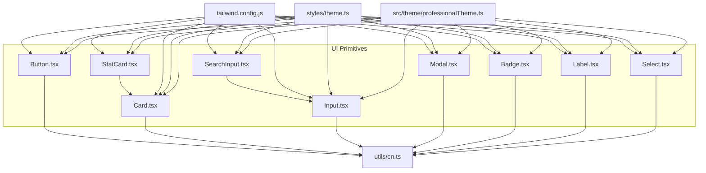
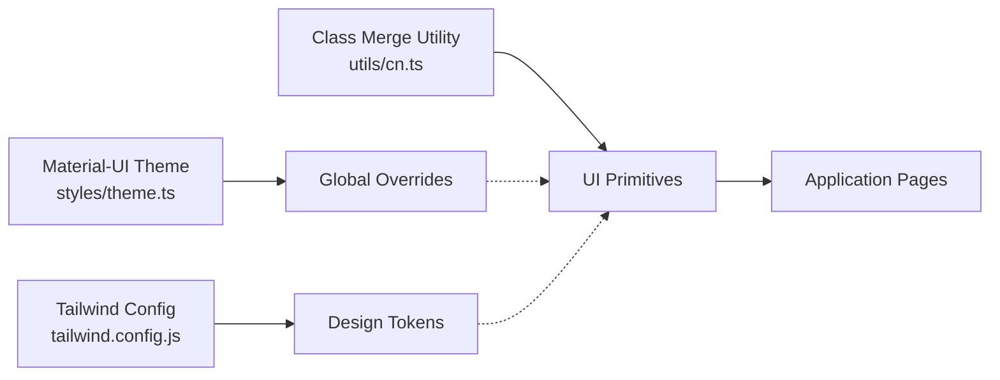
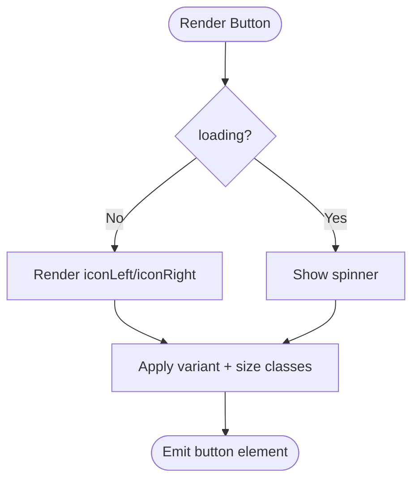
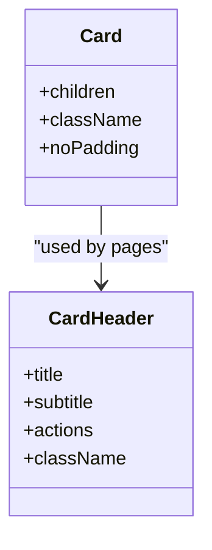
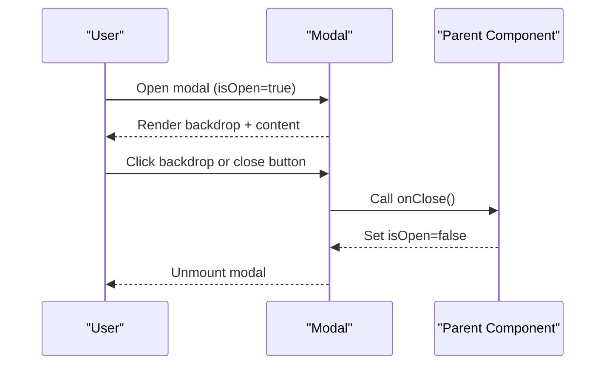
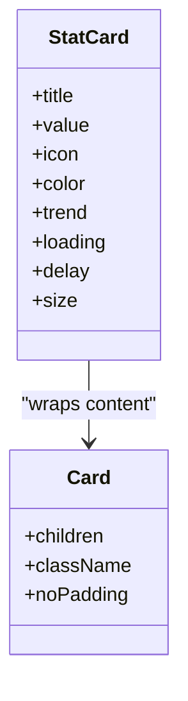
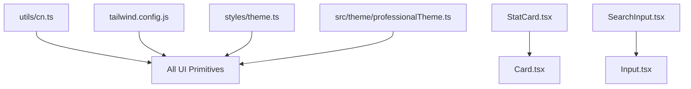

# UI Primitives

<cite>
**Referenced Files in This Document**
- [Button.tsx](file://components/ui/Button.tsx)
- [Card.tsx](file://components/ui/Card.tsx)
- [Input.tsx](file://components/ui/Input.tsx)
- [Modal.tsx](file://components/ui/Modal.tsx)
- [Badge.tsx](file://components/ui/Badge.tsx)
- [Label.tsx](file://components/ui/Label.tsx)
- [SearchInput.tsx](file://components/ui/SearchInput.tsx)
- [Select.tsx](file://components/ui/Select.tsx)
- [StatCard.tsx](file://components/ui/StatCard.tsx)
- [theme.ts](file://styles/theme.ts)
- [professionalTheme.ts](file://src/theme/professionalTheme.ts)
- [cn.ts](file://utils/cn.ts)
- [tailwind.config.js](file://tailwind.config.js)
</cite>

## Table of Contents
1. [Introduction](#introduction)
2. [Project Structure](#project-structure)
3. [Core Components](#core-components)
4. [Architecture Overview](#architecture-overview)
5. [Detailed Component Analysis](#detailed-component-analysis)
6. [Dependency Analysis](#dependency-analysis)
7. [Performance Considerations](#performance-considerations)
8. [Troubleshooting Guide](#troubleshooting-guide)
9. [Conclusion](#conclusion)
10. [Appendices](#appendices)

## Introduction
This document provides comprehensive documentation for the core UI primitive components used across the application. It covers each component’s prop interfaces, styling options, accessibility considerations, responsive behavior, customization capabilities, and integration with Material-UI theming and Tailwind CSS. It also explains composition patterns, event handling conventions, and best practices to maintain a consistent user interface throughout the application.

## Project Structure
The UI primitives are organized under a dedicated folder and rely on shared utilities for class merging and theme configuration:
- Primitive components live in components/ui.
- Shared utility for class merging is in utils/cn.
- Tailwind configuration defines design tokens (colors, spacing, radius).
- Material-UI themes define global styles and component overrides.

**Diagram sources**
- [Button.tsx:1-65](file://components/ui/Button.tsx#L1-L65)
- [Card.tsx:1-39](file://components/ui/Card.tsx#L1-L39)
- [Input.tsx:1-24](file://components/ui/Input.tsx#L1-L24)
- [Modal.tsx:1-79](file://components/ui/Modal.tsx#L1-L79)
- [Badge.tsx:1-34](file://components/ui/Badge.tsx#L1-L34)
- [Label.tsx:1-23](file://components/ui/Label.tsx#L1-L23)
- [SearchInput.tsx:1-22](file://components/ui/SearchInput.tsx#L1-L22)
- [Select.tsx:1-29](file://components/ui/Select.tsx#L1-L29)
- [StatCard.tsx:1-135](file://components/ui/StatCard.tsx#L1-L135)
- [cn.ts:1-7](file://utils/cn.ts#L1-L7)
- [tailwind.config.js:1-38](file://tailwind.config.js#L1-L38)
- [theme.ts:1-515](file://styles/theme.ts#L1-L515)
- [professionalTheme.ts:1-99](file://src/theme/professionalTheme.ts#L1-L99)

**Section sources**
- [Button.tsx:1-65](file://components/ui/Button.tsx#L1-L65)
- [Card.tsx:1-39](file://components/ui/Card.tsx#L1-L39)
- [Input.tsx:1-24](file://components/ui/Input.tsx#L1-L24)
- [Modal.tsx:1-79](file://components/ui/Modal.tsx#L1-L79)
- [Badge.tsx:1-34](file://components/ui/Badge.tsx#L1-L34)
- [Label.tsx:1-23](file://components/ui/Label.tsx#L1-L23)
- [SearchInput.tsx:1-22](file://components/ui/SearchInput.tsx#L1-L22)
- [Select.tsx:1-29](file://components/ui/Select.tsx#L1-L29)
- [StatCard.tsx:1-135](file://components/ui/StatCard.tsx#L1-L135)
- [cn.ts:1-7](file://utils/cn.ts#L1-L7)
- [tailwind.config.js:1-38](file://tailwind.config.js#L1-L38)
- [theme.ts:1-515](file://styles/theme.ts#L1-L515)
- [professionalTheme.ts:1-99](file://src/theme/professionalTheme.ts#L1-L99)

## Core Components
This section summarizes the purpose and key behaviors of each primitive:
- Button: A versatile action button with variants, sizes, loading state, and icons.
- Card: A container with optional padding and a header helper for titles, subtitles, and actions.
- Input: A styled text input with focus rings and disabled states.
- Modal: An accessible overlay modal with backdrop, header, body, and footer slots.
- Badge: A small status indicator with semantic color variants.
- Label: A semantic label element for form associations.
- SearchInput: A composite input with an embedded search icon.
- Select: A styled native select with a custom chevron indicator.
- StatCard: A gradient metric card with animated entrance, size variants, and trend display.

**Section sources**
- [Button.tsx:10-64](file://components/ui/Button.tsx#L10-L64)
- [Card.tsx:9-38](file://components/ui/Card.tsx#L9-L38)
- [Input.tsx:4-23](file://components/ui/Input.tsx#L4-L23)
- [Modal.tsx:10-78](file://components/ui/Modal.tsx#L10-L78)
- [Badge.tsx:9-33](file://components/ui/Badge.tsx#L9-L33)
- [Label.tsx:4-22](file://components/ui/Label.tsx#L4-L22)
- [SearchInput.tsx:6-21](file://components/ui/SearchInput.tsx#L6-L21)
- [Select.tsx:5-28](file://components/ui/Select.tsx#L5-L28)
- [StatCard.tsx:6-134](file://components/ui/StatCard.tsx#L6-L134)

## Architecture Overview
The primitives follow a consistent architecture:
- Styling via Tailwind classes merged with clsx/tailwind-merge through a shared cn utility.
- Theming via Material-UI theme overrides for global component aesthetics.
- Composition patterns where higher-level components build on lower-level ones (e.g., StatCard composes Card; SearchInput composes Input).
- Accessibility built-in through semantic elements and keyboard-friendly interactions.

**Diagram sources**
- [theme.ts:1-515](file://styles/theme.ts#L1-L515)
- [tailwind.config.js:1-38](file://tailwind.config.js#L1-L38)
- [cn.ts:1-7](file://utils/cn.ts#L1-L7)

**Section sources**
- [theme.ts:1-515](file://styles/theme.ts#L1-L515)
- [tailwind.config.js:1-38](file://tailwind.config.js#L1-L38)
- [cn.ts:1-7](file://utils/cn.ts#L1-L7)

## Detailed Component Analysis

### Button
- Purpose: Primary interactive control for actions.
- Props:
  - variant: 'primary' | 'secondary' | 'danger' | 'ghost' | 'outline'
  - size: 'sm' | 'md' | 'lg' | 'icon'
  - loading: boolean
  - iconLeft, iconRight: React.ReactNode
  - Standard HTML button attributes via inheritance
- Styling:
  - Variants map to distinct background/text/hover styles.
  - Sizes adjust height, padding, and font size.
  - Uses rounded corners, transitions, and active scale effects.
- Accessibility:
  - Disabled state prevents interaction when loading or disabled.
  - Inherits all standard button semantics.
- Responsive:
  - Size classes adapt to different screen contexts.
- Customization:
  - className prop allows additional overrides.
  - Icon slots enable flexible content placement.
- Event Handling:
  - Supports onClick and other standard events via props spread.

**Diagram sources**
- [Button.tsx:18-64](file://components/ui/Button.tsx#L18-L64)

**Section sources**
- [Button.tsx:10-64](file://components/ui/Button.tsx#L10-L64)

### Card
- Purpose: Content container with consistent padding and border.
- Props:
  - children: React.ReactNode
  - className?: string
  - noPadding?: boolean
- Subcomponent:
  - CardHeader: title, subtitle, actions, className
- Styling:
  - White background, rounded corners, subtle border.
  - Header uses responsive layout for title/subtitle and actions.
- Accessibility:
  - Semantic heading hierarchy in header.
- Responsive:
  - Header switches from stacked to row layout on medium screens.
- Customization:
  - className prop for further styling.
  - Actions slot enables buttons or controls.

**Diagram sources**
- [Card.tsx:9-38](file://components/ui/Card.tsx#L9-L38)

**Section sources**
- [Card.tsx:9-38](file://components/ui/Card.tsx#L9-L38)

### Input
- Purpose: Styled text input field.
- Props:
  - Extends standard HTML input attributes
- Styling:
  - Consistent height, border, focus ring, placeholder color, disabled state.
- Accessibility:
  - Focus-visible ring improves keyboard navigation visibility.
- Responsive:
  - Fluid width and readable font sizes.
- Customization:
  - className prop for overrides.
  - Type and other native attributes supported.

**Section sources**
- [Input.tsx:4-23](file://components/ui/Input.tsx#L4-L23)

### Modal
- Purpose: Overlay dialog for focused tasks.
- Props:
  - isOpen: boolean
  - onClose: () => void
  - title: string
  - titleClassName?: string
  - children: React.ReactNode
  - footer?: React.ReactNode
  - size: 'sm' | 'md' | 'lg' | 'xl'
- Styling:
  - Backdrop with blur, centered content, scrollable body, optional footer.
  - Size classes control max-width.
- Accessibility:
  - Focus management relies on parent; close button is keyboard accessible.
  - Backdrop click closes modal.
- Responsive:
  - Centered on desktop, bottom-aligned on mobile.
- Customization:
  - Title and footer slots allow rich content.
  - className not exposed directly; use titleClassName for header tweaks.

**Diagram sources**
- [Modal.tsx:10-78](file://components/ui/Modal.tsx#L10-L78)

**Section sources**
- [Modal.tsx:10-78](file://components/ui/Modal.tsx#L10-L78)

### Badge
- Purpose: Small status indicators.
- Props:
  - children: React.ReactNode
  - variant: 'success' | 'warning' | 'danger' | 'info' | 'neutral'
  - className?: string
- Styling:
  - Color-coded backgrounds and borders per variant.
- Accessibility:
  - Semantic span; pair with context for meaning.
- Customization:
  - className prop for overrides.

**Section sources**
- [Badge.tsx:9-33](file://components/ui/Badge.tsx#L9-L33)

### Label
- Purpose: Form label element.
- Props:
  - Extends standard HTML label attributes
- Styling:
  - Small, uppercase, tracking-wide style.
- Accessibility:
  - Semantic label associates with inputs via htmlFor or nesting.
- Customization:
  - className prop for overrides.

**Section sources**
- [Label.tsx:4-22](file://components/ui/Label.tsx#L4-L22)

### SearchInput
- Purpose: Input with embedded search icon.
- Props:
  - Extends InputProps
  - containerClassName?: string
- Styling:
  - Relative container with absolute positioned icon.
  - Left padding to avoid icon overlap.
- Composition:
  - Wraps Input component.
- Customization:
  - className passed to Input; containerClassName for wrapper.

**Section sources**
- [SearchInput.tsx:6-21](file://components/ui/SearchInput.tsx#L6-L21)
- [Input.tsx:4-23](file://components/ui/Input.tsx#L4-L23)

### Select
- Purpose: Styled native select dropdown.
- Props:
  - Extends standard HTML select attributes
- Styling:
  - Custom appearance removed, consistent border/focus/disabled states.
  - ChevronDown icon indicates dropdown affordance.
- Accessibility:
  - Native select ensures keyboard and screen reader support.
- Customization:
  - className prop for overrides.

**Section sources**
- [Select.tsx:5-28](file://components/ui/Select.tsx#L5-L28)

### StatCard
- Purpose: Metric card with gradient background, icon, value, and optional trend.
- Props:
  - title: string
  - value: string | number
  - icon: LucideIcon
  - color: 'blue' | 'green' | 'red' | 'indigo' | 'orange' | 'cyan' | 'purple' | 'amber'
  - trend?: string
  - loading?: boolean
  - delay?: number
  - size: 'md' | 'sm' | 'xs'
- Styling:
  - Gradient backgrounds mapped by color.
  - Size config adjusts typography, spacing, and icon size.
  - Hover lift effect and smooth entrance animation.
- Composition:
  - Composes Card component.
- Accessibility:
  - Semantic headings for value; ensure surrounding context clarifies meaning.
- Performance:
  - Uses motion for animations; consider disabling on low-power devices if needed.

**Diagram sources**
- [StatCard.tsx:6-134](file://components/ui/StatCard.tsx#L6-L134)
- [Card.tsx:9-38](file://components/ui/Card.tsx#L9-L38)

**Section sources**
- [StatCard.tsx:6-134](file://components/ui/StatCard.tsx#L6-L134)
- [Card.tsx:9-38](file://components/ui/Card.tsx#L9-L38)

## Dependency Analysis
- Class merging:
  - All primitives use a shared cn utility that merges clsx and tailwind-merge outputs.
- Tailwind integration:
  - Colors, radii, and shadows are defined in Tailwind config and consumed via utility classes.
- Material-UI theming:
  - Global overrides influence default components and can be referenced indirectly by custom components.
- Composition:
  - StatCard depends on Card.
  - SearchInput depends on Input.

**Diagram sources**
- [cn.ts:1-7](file://utils/cn.ts#L1-L7)
- [tailwind.config.js:1-38](file://tailwind.config.js#L1-L38)
- [theme.ts:1-515](file://styles/theme.ts#L1-L515)
- [professionalTheme.ts:1-99](file://src/theme/professionalTheme.ts#L1-L99)
- [StatCard.tsx:1-135](file://components/ui/StatCard.tsx#L1-L135)
- [Card.tsx:1-39](file://components/ui/Card.tsx#L1-L39)
- [SearchInput.tsx:1-22](file://components/ui/SearchInput.tsx#L1-L22)
- [Input.tsx:1-24](file://components/ui/Input.tsx#L1-L24)

**Section sources**
- [cn.ts:1-7](file://utils/cn.ts#L1-L7)
- [tailwind.config.js:1-38](file://tailwind.config.js#L1-L38)
- [theme.ts:1-515](file://styles/theme.ts#L1-L515)
- [professionalTheme.ts:1-99](file://src/theme/professionalTheme.ts#L1-L99)
- [StatCard.tsx:1-135](file://components/ui/StatCard.tsx#L1-L135)
- [Card.tsx:1-39](file://components/ui/Card.tsx#L1-L39)
- [SearchInput.tsx:1-22](file://components/ui/SearchInput.tsx#L1-L22)
- [Input.tsx:1-24](file://components/ui/Input.tsx#L1-L24)

## Performance Considerations
- Prefer minimal re-renders by memoizing expensive computations outside primitives.
- Use loading states to prevent redundant operations (e.g., Button loading disables interactions).
- Animations in StatCard add visual polish; consider reducing motion for users who prefer reduced motion.
- Avoid excessive nested className strings; leverage cn utility to keep styles predictable.

[No sources needed since this section provides general guidance]

## Troubleshooting Guide
- Modal does not close:
  - Ensure onClose is wired to set isOpen false and that the backdrop click triggers it.
- Input focus ring missing:
  - Verify focus-visible styles are applied and not overridden by custom className.
- Button disabled unexpectedly:
  - Check if loading or disabled props are true; confirm event handlers do not call preventDefault unnecessarily.
- SearchInput icon overlaps text:
  - Ensure left padding is applied to the underlying Input and that container has proper relative positioning.
- Select arrow not visible:
  - Confirm the chevron icon is rendered and pointer-events-none is set so clicks pass through to the select.

**Section sources**
- [Modal.tsx:42-73](file://components/ui/Modal.tsx#L42-L73)
- [Input.tsx:11-17](file://components/ui/Input.tsx#L11-L17)
- [Button.tsx:44-62](file://components/ui/Button.tsx#L44-L62)
- [SearchInput.tsx:11-19](file://components/ui/SearchInput.tsx#L11-L19)
- [Select.tsx:11-22](file://components/ui/Select.tsx#L11-L22)

## Conclusion
The UI primitives provide a cohesive, accessible, and customizable foundation for building consistent interfaces. They integrate seamlessly with Tailwind CSS for styling and Material-UI themes for global design tokens. By following the documented prop interfaces, composition patterns, and best practices, teams can maintain a unified look and feel while enabling efficient development and scalability.

[No sources needed since this section summarizes without analyzing specific files]

## Appendices

### Theming Integration Notes
- Tailwind colors and tokens are extended in the Tailwind config and consumed via utility classes across primitives.
- Material-UI theme overrides customize default components and can be leveraged by higher-level components.
- The shared cn utility ensures deterministic class resolution and avoids conflicts.

**Section sources**
- [tailwind.config.js:1-38](file://tailwind.config.js#L1-L38)
- [theme.ts:1-515](file://styles/theme.ts#L1-L515)
- [professionalTheme.ts:1-99](file://src/theme/professionalTheme.ts#L1-L99)
- [cn.ts:1-7](file://utils/cn.ts#L1-L7)