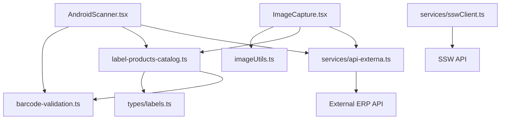
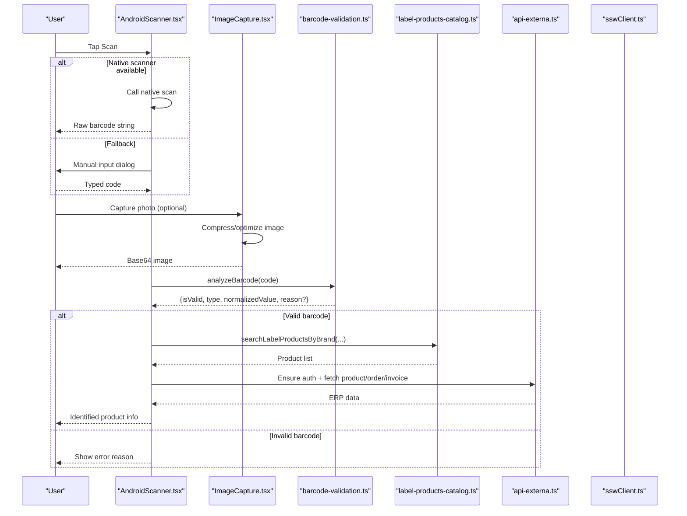
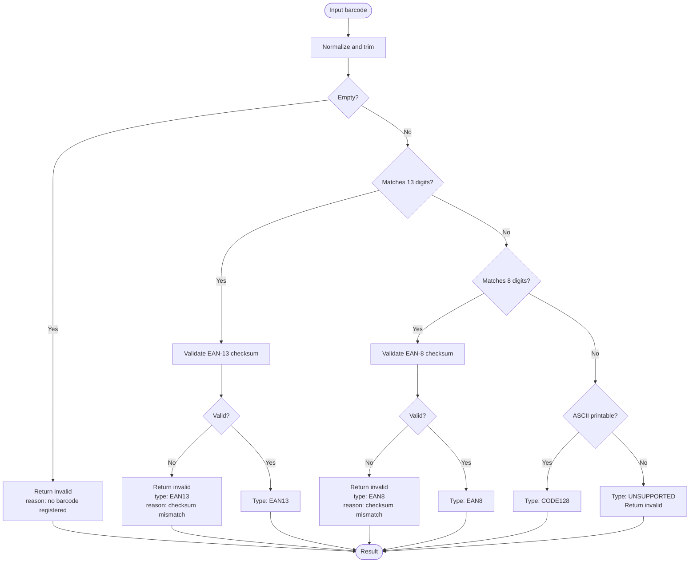
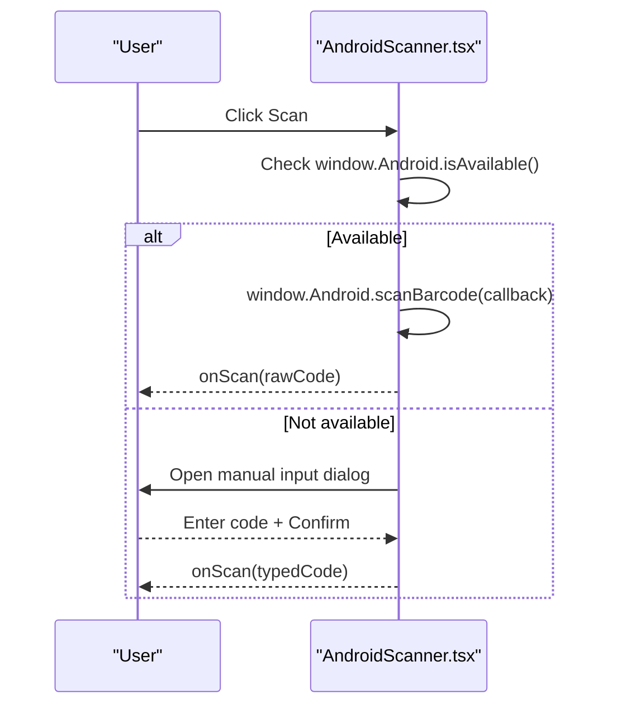
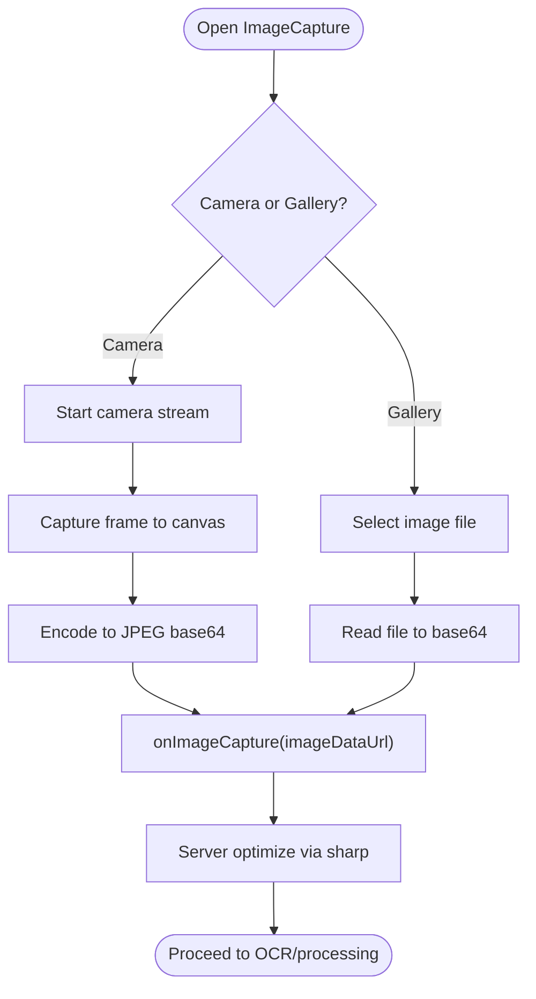
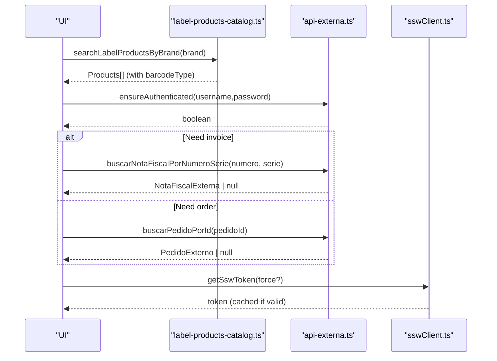
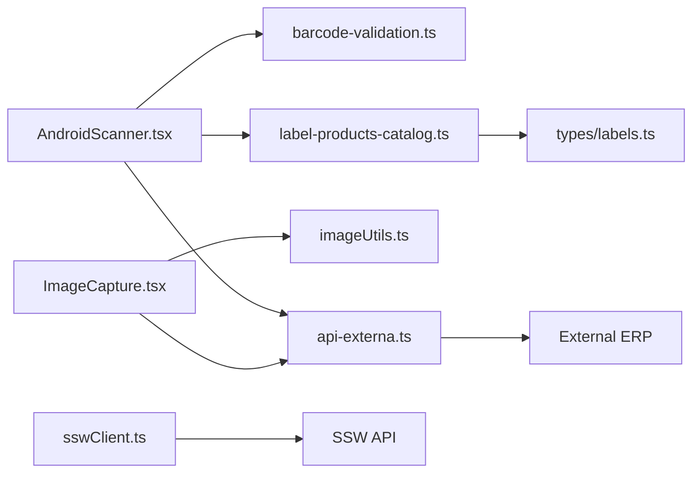

# Barcode Scanning & Validation

<cite>
**Referenced Files in This Document**
- [barcode-validation.ts](file://lib/barcode-validation.ts)
- [AndroidScanner.tsx](file://components/AndroidScanner.tsx)
- [ImageCapture.tsx](file://components/ImageCapture.tsx)
- [labels.ts](file://types/labels.ts)
- [label-products-catalog.ts](file://lib/label-products-catalog.ts)
- [api-externa.ts](file://services/api-externa.ts)
- [sswClient.ts](file://services/sswClient.ts)
- [imageUtils.ts](file://lib/imageUtils.ts)
</cite>

## Table of Contents
1. Introduction
2. Project Structure
3. Core Components
4. Architecture Overview
5. Detailed Component Analysis
6. Dependency Analysis
7. Performance Considerations
8. Troubleshooting Guide
9. Conclusion

## Introduction
This document explains the barcode scanning and validation system used to capture barcodes from hardware scanners or images, validate their format, identify supported types, and integrate with external ERP systems for product lookup. It covers:
- Supported barcode formats and validation rules
- Hardware scanner integration and fallbacks
- Image-based scanning workflow and image optimization
- Product catalog lookup and ERP integration endpoints
- Error handling strategies and troubleshooting guidance

## Project Structure
The barcode subsystem spans UI components (scanner and image capture), validation utilities, type definitions, a local product catalog helper, and services that call external APIs for ERP data.



**Diagram sources**
- [AndroidScanner.tsx:1-224](file://components/AndroidScanner.tsx#L1-L224)
- [ImageCapture.tsx:1-234](file://components/ImageCapture.tsx#L1-L234)
- [barcode-validation.ts:1-89](file://lib/barcode-validation.ts#L1-L89)
- [label-products-catalog.ts:1-54](file://lib/label-products-catalog.ts#L1-L54)
- [labels.ts:1-121](file://types/labels.ts#L1-L121)
- [api-externa.ts:1-800](file://services/api-externa.ts#L1-L800)
- [sswClient.ts:1-445](file://services/sswClient.ts#L1-L445)
- [imageUtils.ts:1-38](file://lib/imageUtils.ts#L1-L38)

**Section sources**
- [AndroidScanner.tsx:1-224](file://components/AndroidScanner.tsx#L1-L224)
- [ImageCapture.tsx:1-234](file://components/ImageCapture.tsx#L1-L234)
- [barcode-validation.ts:1-89](file://lib/barcode-validation.ts#L1-L89)
- [label-products-catalog.ts:1-54](file://lib/label-products-catalog.ts#L1-L54)
- [labels.ts:1-121](file://types/labels.ts#L1-L121)
- [api-externa.ts:1-800](file://services/api-externa.ts#L1-L800)
- [sswClient.ts:1-445](file://services/sswClient.ts#L1-L445)
- [imageUtils.ts:1-38](file://lib/imageUtils.ts#L1-L38)

## Core Components
- Barcode validation: Detects and validates EAN-13, EAN-8, and CODE128; returns structured analysis with reasons for invalid inputs.
- Scanner UI: Integrates with native Android scanner when available; falls back to manual input dialog.
- Image capture: Captures photos via camera or gallery, optimizes images server-side using sharp.
- Product catalog: Normalizes and filters products by brand; maps catalog entries to label product model with barcode type.
- External ERP integration: Authenticates and queries invoices, orders, and clients; includes robust fallbacks and timeouts.
- SSW client: Token caching and calls to logistics/tracking services.

**Section sources**
- [barcode-validation.ts:1-89](file://lib/barcode-validation.ts#L1-L89)
- [AndroidScanner.tsx:1-224](file://components/AndroidScanner.tsx#L1-L224)
- [ImageCapture.tsx:1-234](file://components/ImageCapture.tsx#L1-L234)
- [label-products-catalog.ts:1-54](file://lib/label-products-catalog.ts#L1-L54)
- [api-externa.ts:1-800](file://services/api-externa.ts#L1-L800)
- [sswClient.ts:1-445](file://services/sswClient.ts#L1-L445)
- [imageUtils.ts:1-38](file://lib/imageUtils.ts#L1-L38)

## Architecture Overview
End-to-end flow from capture to product identification:



**Diagram sources**
- [AndroidScanner.tsx:1-224](file://components/AndroidScanner.tsx#L1-L224)
- [ImageCapture.tsx:1-234](file://components/ImageCapture.tsx#L1-L234)
- [barcode-validation.ts:1-89](file://lib/barcode-validation.ts#L1-L89)
- [label-products-catalog.ts:1-54](file://lib/label-products-catalog.ts#L1-L54)
- [api-externa.ts:1-800](file://services/api-externa.ts#L1-L800)
- [sswClient.ts:1-445](file://services/sswClient.ts#L1-L445)

## Detailed Component Analysis

### Barcode Format Support and Validation
- Supported formats:
  - EAN-13: Validates length and checksum digit.
  - EAN-8: Validates length and checksum digit.
  - CODE128: Accepted if value is non-empty and contains only ASCII printable characters.
  - Unsupported: Any other input.
- Validation behavior:
  - Empty input returns an invalid result with a clear reason.
  - EAN-13/EAN-8 with wrong checksum return invalid with specific reason messages.
  - Non-printable or unsupported formats return invalid with a generic message.
- Output structure:
  - isValid, type, normalizedValue, and optional reason.



**Diagram sources**
- [barcode-validation.ts:1-89](file://lib/barcode-validation.ts#L1-L89)

**Section sources**
- [barcode-validation.ts:1-89](file://lib/barcode-validation.ts#L1-L89)
- [labels.ts:1-121](file://types/labels.ts#L1-L121)

### Hardware Scanner Integration (Android)
- Behavior:
  - Attempts to use native Android scanner via window.Android interface.
  - On success, forwards raw barcode string to onScan callback.
  - On failure or absence of native scanner, opens a manual input dialog.
- UX:
  - Supports button or icon rendering.
  - Provides keyboard support (Enter to submit).
  - Displays errors via onError callback when needed.



**Diagram sources**
- [AndroidScanner.tsx:1-224](file://components/AndroidScanner.tsx#L1-L224)

**Section sources**
- [AndroidScanner.tsx:1-224](file://components/AndroidScanner.tsx#L1-L224)

### Image-Based Scanning Fallback
- Capture options:
  - Camera stream with environment-facing preference.
  - Gallery selection.
- Processing:
  - Captured frames are drawn to a canvas and exported as JPEG base64.
  - Server-side optimization uses sharp to resize/compress images efficiently.
- Usage:
  - Useful when hardware scanners are unavailable or when users prefer uploading photos of labels.



**Diagram sources**
- [ImageCapture.tsx:1-234](file://components/ImageCapture.tsx#L1-L234)
- [imageUtils.ts:1-38](file://lib/imageUtils.ts#L1-L38)

**Section sources**
- [ImageCapture.tsx:1-234](file://components/ImageCapture.tsx#L1-L234)
- [imageUtils.ts:1-38](file://lib/imageUtils.ts#L1-L38)

### Product Lookup and ERP Integration
- Local catalog:
  - Normalizes brand names and filters active products with images under /products/erp/.
  - Maps catalog entries to a label product model including barcode type derived from validation.
- External ERP:
  - Authentication via token endpoint with retry blocking and timeout controls.
  - Robust methods to find invoices by number/series, NFe key, or NFe identification; includes fallbacks across endpoints.
  - Order and client retrieval with consistent error handling and status checks.
- SSW integration:
  - Token caching with validity parsing and safe expiration.
  - Tracking and generic queries with strict response validation.



**Diagram sources**
- [label-products-catalog.ts:1-54](file://lib/label-products-catalog.ts#L1-L54)
- [api-externa.ts:1-800](file://services/api-externa.ts#L1-L800)
- [sswClient.ts:1-445](file://services/sswClient.ts#L1-L445)

**Section sources**
- [label-products-catalog.ts:1-54](file://lib/label-products-catalog.ts#L1-L54)
- [api-externa.ts:1-800](file://services/api-externa.ts#L1-L800)
- [sswClient.ts:1-445](file://services/sswClient.ts#L1-L445)

### Data Models and Types
- BarcodeFormat: Enumerates supported formats and unsupported state.
- ProdutoEtiqueta: Represents a product suitable for label printing, including barcode metadata and box quantities.
- BarcodeAnalysis: Result of barcode validation with validity flag, detected type, normalized value, and optional reason.
- Transport and volume label models for shipping workflows.

```mermaid
classDiagram
class BarcodeFormat {
<<enum>>
"EAN13"
"EAN8"
"CODE128"
"UNSUPPORTED"
}
class BarcodeAnalysis {
+boolean isValid
+BarcodeFormat type
+string normalizedValue
+string reason
}
class ProdutoEtiqueta {
+string produtoId
+string codigoAdm
+string nome
+string marca
+string codigoOriginal
+string imagemUrl
+string codigoBarras
+BarcodeFormat barcodeType
+string codigoBarrasCaixaFechada
+number quantidadeCaixaFechada
+number quantidadeEstoque
}
BarcodeAnalysis --> BarcodeFormat : "uses"
ProdutoEtiqueta --> BarcodeFormat : "has"
```

**Diagram sources**
- [labels.ts:1-121](file://types/labels.ts#L1-L121)

**Section sources**
- [labels.ts:1-121](file://types/labels.ts#L1-L121)

## Dependency Analysis
- UI layer depends on:
  - Validation utility for barcode analysis.
  - Catalog helper for product filtering and mapping.
  - External services for ERP data and logistics tracking.
- Services:
  - api-externa.ts encapsulates authentication, retries, timeouts, and multiple fallback endpoints.
  - sswClient.ts manages token lifecycle and provides typed helpers for SSW endpoints.
- Utilities:
  - imageUtils.ts ensures efficient image processing before storage/transmission.



**Diagram sources**
- [AndroidScanner.tsx:1-224](file://components/AndroidScanner.tsx#L1-L224)
- [ImageCapture.tsx:1-234](file://components/ImageCapture.tsx#L1-L234)
- [barcode-validation.ts:1-89](file://lib/barcode-validation.ts#L1-L89)
- [label-products-catalog.ts:1-54](file://lib/label-products-catalog.ts#L1-L54)
- [labels.ts:1-121](file://types/labels.ts#L1-L121)
- [api-externa.ts:1-800](file://services/api-externa.ts#L1-L800)
- [sswClient.ts:1-445](file://services/sswClient.ts#L1-L445)
- [imageUtils.ts:1-38](file://lib/imageUtils.ts#L1-L38)

**Section sources**
- [AndroidScanner.tsx:1-224](file://components/AndroidScanner.tsx#L1-L224)
- [ImageCapture.tsx:1-234](file://components/ImageCapture.tsx#L1-L234)
- [barcode-validation.ts:1-89](file://lib/barcode-validation.ts#L1-L89)
- [label-products-catalog.ts:1-54](file://lib/label-products-catalog.ts#L1-L54)
- [labels.ts:1-121](file://types/labels.ts#L1-L121)
- [api-externa.ts:1-800](file://services/api-externa.ts#L1-L800)
- [sswClient.ts:1-445](file://services/sswClient.ts#L1-L445)
- [imageUtils.ts:1-38](file://lib/imageUtils.ts#L1-L38)

## Performance Considerations
- Barcode validation is O(n) over digits for checksum calculation; negligible overhead.
- Image optimization reduces payload size and improves upload speed; resizing capped at 1500px for photos and 2000px for documents.
- External API calls include timeouts and token caching to minimize latency and redundant auth requests.
- Catalog filtering normalizes strings once per query; consider precomputing normalized fields for large catalogs.

[No sources needed since this section provides general guidance]

## Troubleshooting Guide
- Invalid or missing barcodes:
  - Empty input yields a clear “no barcode registered” reason.
  - EAN-13/EAN-8 with incorrect checksum produce specific mismatch reasons.
  - Non-printable or unsupported formats return a generic invalid message.
- Scanner not available:
  - The component automatically opens a manual input dialog; verify permissions and device capabilities.
- Camera access issues:
  - Errors surface in the image capture dialog; check browser/device permissions and HTTPS context.
- External ERP connectivity:
  - Authentication failures trigger temporary login blocks and log detailed messages.
  - Endpoint fallbacks attempt alternative paths; inspect logs for which path succeeded or failed.
  - Timeouts and 4xx responses are handled gracefully; ensure environment variables for base URLs and credentials are set.
- SSW token problems:
  - Token generation requires domain, username, CNPJ_EDI, and optionally password; misconfiguration throws explicit errors.
  - Token validity is parsed and cached; force refresh if necessary.

**Section sources**
- [barcode-validation.ts:1-89](file://lib/barcode-validation.ts#L1-L89)
- [AndroidScanner.tsx:1-224](file://components/AndroidScanner.tsx#L1-L224)
- [ImageCapture.tsx:1-234](file://components/ImageCapture.tsx#L1-L234)
- [api-externa.ts:1-800](file://services/api-externa.ts#L1-L800)
- [sswClient.ts:1-445](file://services/sswClient.ts#L1-L445)

## Conclusion
The system provides a robust pipeline from barcode capture to product identification:
- Strong validation ensures only supported formats proceed.
- Flexible capture supports both hardware scanners and image uploads.
- Catalog and ERP integrations offer resilient lookups with fallbacks and caching.
- Clear error messaging and logging aid troubleshooting in production environments.

[No sources needed since this section summarizes without analyzing specific files]