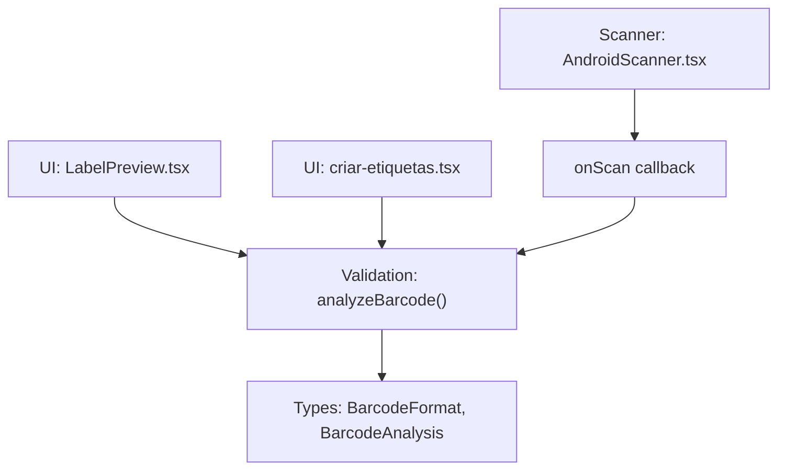
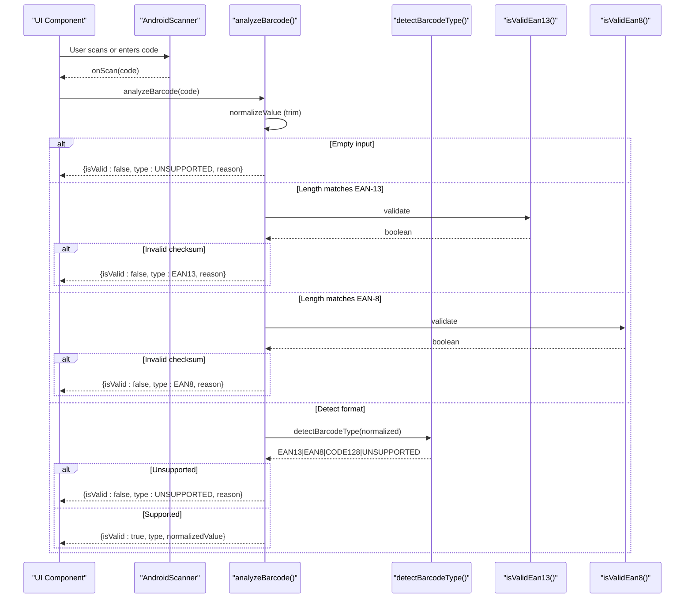
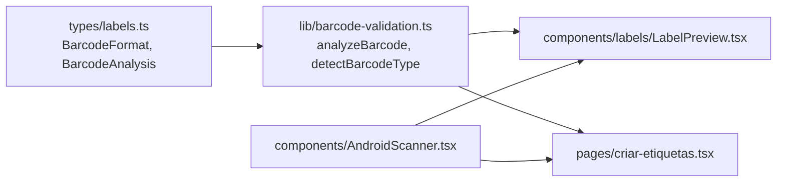

# Barcode Validation Engine

<cite>
**Referenced Files in This Document**
- [barcode-validation.ts](file://lib/barcode-validation.ts)
- [labels.ts](file://types/labels.ts)
- [LabelPreview.tsx](file://components/labels/LabelPreview.tsx)
- [criar-etiquetas.tsx](file://pages/criar-etiquetas.tsx)
- [AndroidScanner.tsx](file://components/AndroidScanner.tsx)
</cite>

## Table of Contents
1. [Introduction](#introduction)
2. [Project Structure](#project-structure)
3. [Core Components](#core-components)
4. [Architecture Overview](#architecture-overview)
5. [Detailed Component Analysis](#detailed-component-analysis)
6. [Dependency Analysis](#dependency-analysis)
7. [Performance Considerations](#performance-considerations)
8. [Troubleshooting Guide](#troubleshooting-guide)
9. [Conclusion](#conclusion)

## Introduction
This document explains the barcode validation engine used across the application to validate and classify barcodes during label generation and scanning workflows. It covers:
- EAN-13 and EAN-8 checksum algorithms
- Format detection logic (EAN-13, EAN-8, CODE128, UNSUPPORTED)
- ASCII filtering for CODE128
- Validation rules and error messaging
- The normalizeValue behavior within the analysis flow
- How the system integrates with UI components and scanners

The goal is to provide a clear understanding of how barcodes are validated, detected, and reported back to the user with actionable feedback.

## Project Structure
The barcode validation engine is implemented as a small, focused library module that exposes functions for validation and analysis. It is consumed by UI components that generate labels and display previews.

**Diagram sources**
- [LabelPreview.tsx:120-130](file://components/labels/LabelPreview.tsx#L120-L130)
- [criar-etiquetas.tsx:85-99](file://pages/criar-etiquetas.tsx#L85-L99)
- [AndroidScanner.tsx:46-74](file://components/AndroidScanner.tsx#L46-L74)
- [labels.ts:1-53](file://types/labels.ts#L1-L53)

**Section sources**
- [barcode-validation.ts:1-89](file://lib/barcode-validation.ts#L1-L89)
- [labels.ts:1-53](file://types/labels.ts#L1-L53)
- [LabelPreview.tsx:120-130](file://components/labels/LabelPreview.tsx#L120-L130)
- [criar-etiquetas.tsx:85-99](file://pages/criar-etiquetas.tsx#L85-L99)
- [AndroidScanner.tsx:46-74](file://components/AndroidScanner.tsx#L46-L74)

## Core Components
- Validation entry point: analyzeBarcode(value)
  - Normalizes input (trim), returns a structured result with validity, type, normalized value, and optional reason.
- Format detection: detectBarcodeType(value)
  - Returns one of: EAN13, EAN8, CODE128, UNSUPPORTED.
- Checksum calculators:
  - calculateEan13Checksum(base): computes EAN-13 check digit from first 12 digits.
  - calculateEan8Checksum(base): computes EAN-8 check digit from first 7 digits.
- Validators:
  - isValidEan13(value): validates length and checksum for EAN-13.
  - isValidEan8(value): validates length and checksum for EAN-8.
- ASCII filter: onlyAsciiPrintable(value)
  - Ensures CODE128 values contain only printable ASCII characters.

Supported formats:
- EAN-13: 13-digit numeric with valid check digit
- EAN-8: 8-digit numeric with valid check digit
- CODE128: any non-empty string containing only printable ASCII characters
- UNSUPPORTED: anything else

Normalization:
- Input is converted to string and trimmed before processing.

Error messages:
- Specific reasons are provided when EAN-13 or EAN-8 lengths match but checksums fail.
- Generic invalid message for unsupported formats.

**Section sources**
- [barcode-validation.ts:3-40](file://lib/barcode-validation.ts#L3-L40)
- [barcode-validation.ts:42-89](file://lib/barcode-validation.ts#L42-L89)
- [labels.ts:1-53](file://types/labels.ts#L1-L53)

## Architecture Overview
The validation engine is invoked whenever a barcode value is available in the UI. It normalizes the input, attempts format-specific validation, and returns a consistent analysis object used by the UI to enable/disable printing and to show feedback.

**Diagram sources**
- [barcode-validation.ts:25-40](file://lib/barcode-validation.ts#L25-L40)
- [barcode-validation.ts:42-89](file://lib/barcode-validation.ts#L42-L89)
- [AndroidScanner.tsx:46-74](file://components/AndroidScanner.tsx#L46-L74)

## Detailed Component Analysis

### EAN-13 Checksum Algorithm
- Input: base string of exactly 12 digits
- Weights: alternate 1 and 3 starting with 1 at index 0
- Sum = sum(digit * weight)
- Check digit = (10 - (sum % 10)) % 10
- Validation: compare computed check digit with the 13th digit

Complexity: O(n) where n=12; constant-time operations.

**Section sources**
- [barcode-validation.ts:7-14](file://lib/barcode-validation.ts#L7-L14)
- [barcode-validation.ts:25-28](file://lib/barcode-validation.ts#L25-L28)

### EAN-8 Checksum Algorithm
- Input: base string of exactly 7 digits
- Weights: alternate 3 and 1 starting with 3 at index 0
- Sum = sum(digit * weight)
- Check digit = (10 - (sum % 10)) % 10
- Validation: compare computed check digit with the 8th digit

Complexity: O(n) where n=7; constant-time operations.

**Section sources**
- [barcode-validation.ts:16-23](file://lib/barcode-validation.ts#L16-L23)
- [barcode-validation.ts:30-33](file://lib/barcode-validation.ts#L30-L33)

### Barcode Format Detection Logic
- If the value is 13 digits and passes EAN-13 checksum → EAN13
- Else if the value is 8 digits and passes EAN-8 checksum → EAN8
- Else if the value is non-empty and contains only printable ASCII → CODE128
- Else → UNSUPPORTED

ASCII filter:
- Uses a regex to ensure all characters are in the printable ASCII range.

Complexity: O(1) for fixed-length checks; O(n) for ASCII scan.

**Section sources**
- [barcode-validation.ts:3-5](file://lib/barcode-validation.ts#L3-L5)
- [barcode-validation.ts:35-40](file://lib/barcode-validation.ts#L35-L40)

### Validation Rules and Error Messages
- Empty input → UNSUPPORTED with a specific reason indicating no barcode registered
- EAN-13 length match but invalid checksum → EAN13 with reason about invalid check digit
- EAN-8 length match but invalid checksum → EAN8 with reason about invalid check digit
- Any other case → UNSUPPORTED with generic invalid message

These messages guide users to correct issues (e.g., wrong check digit).

**Section sources**
- [barcode-validation.ts:42-89](file://lib/barcode-validation.ts#L42-L89)

### Type Detection Algorithms Used Throughout Scanning Workflow
- The same detectBarcodeType function is used consistently to determine the format after normalization and preliminary checks.
- UI components rely on the returned type to adjust rendering and print behavior.

**Section sources**
- [barcode-validation.ts:35-40](file://lib/barcode-validation.ts#L35-L40)
- [LabelPreview.tsx:120-130](file://components/labels/LabelPreview.tsx#L120-L130)
- [criar-etiquetas.tsx:85-99](file://pages/criar-etiquetas.tsx#L85-L99)

### normalizeValue Behavior
- Converts input to string and trims whitespace
- Ensures consistent handling even if null or undefined is passed
- Applied early in analyzeBarcode to avoid downstream parsing errors

**Section sources**
- [barcode-validation.ts:42-44](file://lib/barcode-validation.ts#L42-L44)

### Integration Points and Usage Examples
- Label preview uses analyzeBarcode to compute the barcode type for display and layout decisions.
- Label creation page uses analyzeBarcode to gate printing based on validity and quantity.
- Android scanner provides scanned codes via onScan callback, which feed into the same validation pipeline.

Examples of scenarios:
- Valid EAN-13: returns isValid=true, type=EAN13
- Invalid EAN-13 checksum: returns isValid=false, type=EAN13, reason indicates mismatched check digit
- Valid EAN-8: returns isValid=true, type=EAN8
- Invalid EAN-8 checksum: returns isValid=false, type=EAN8, reason indicates mismatched check digit
- CODE128 (printable ASCII): returns isValid=true, type=CODE128
- Non-printable or empty: returns isValid=false, type=UNSUPPORTED, reason indicates invalid or missing barcode

**Section sources**
- [LabelPreview.tsx:120-130](file://components/labels/LabelPreview.tsx#L120-L130)
- [criar-etiquetas.tsx:85-99](file://pages/criar-etiquetas.tsx#L85-L99)
- [AndroidScanner.tsx:46-74](file://components/AndroidScanner.tsx#L46-L74)

## Dependency Analysis
The validation module depends on shared types for return structures and format enums. UI components depend on the validation module to drive business logic and user feedback.

**Diagram sources**
- [labels.ts:1-53](file://types/labels.ts#L1-L53)
- [barcode-validation.ts:1-89](file://lib/barcode-validation.ts#L1-L89)
- [LabelPreview.tsx:120-130](file://components/labels/LabelPreview.tsx#L120-L130)
- [criar-etiquetas.tsx:85-99](file://pages/criar-etiquetas.tsx#L85-L99)
- [AndroidScanner.tsx:46-74](file://components/AndroidScanner.tsx#L46-L74)

**Section sources**
- [labels.ts:1-53](file://types/labels.ts#L1-L53)
- [barcode-validation.ts:1-89](file://lib/barcode-validation.ts#L1-L89)

## Performance Considerations
- All validations are O(n) with very small constants (n ≤ 13), making them extremely fast.
- Regex-based ASCII check is efficient for typical barcode lengths.
- No external dependencies or heavy computations; suitable for frequent calls during scanning.

[No sources needed since this section provides general guidance]

## Troubleshooting Guide
Common issues and resolutions:
- EAN-13/EAN-8 invalid check digit:
  - Symptom: isValid=false with type set to EAN13/EAN8 and a reason indicating mismatched check digit.
  - Action: Verify the last digit against the calculated check digit using the respective algorithm.
- Unsupported format:
  - Symptom: isValid=false, type=UNSUPPORTED, reason indicates invalid barcode.
  - Action: Ensure the value is either a valid EAN-13/EAN-8 or printable ASCII for CODE128.
- Empty or missing barcode:
  - Symptom: isValid=false, type=UNSUPPORTED, reason indicates no barcode registered.
  - Action: Confirm that the product has a barcode configured in the system.

Operational tips:
- Use the UI’s preview to confirm the detected type before printing.
- When scanning fails, fall back to manual entry via the scanner dialog.

**Section sources**
- [barcode-validation.ts:42-89](file://lib/barcode-validation.ts#L42-L89)
- [AndroidScanner.tsx:46-74](file://components/AndroidScanner.tsx#L46-L74)

## Conclusion
The barcode validation engine provides robust, lightweight validation for EAN-13, EAN-8, and CODE128 formats with clear error reporting. Its design ensures consistent behavior across scanning and label generation workflows, enabling reliable user experiences and accurate label outputs.

[No sources needed since this section summarizes without analyzing specific files]