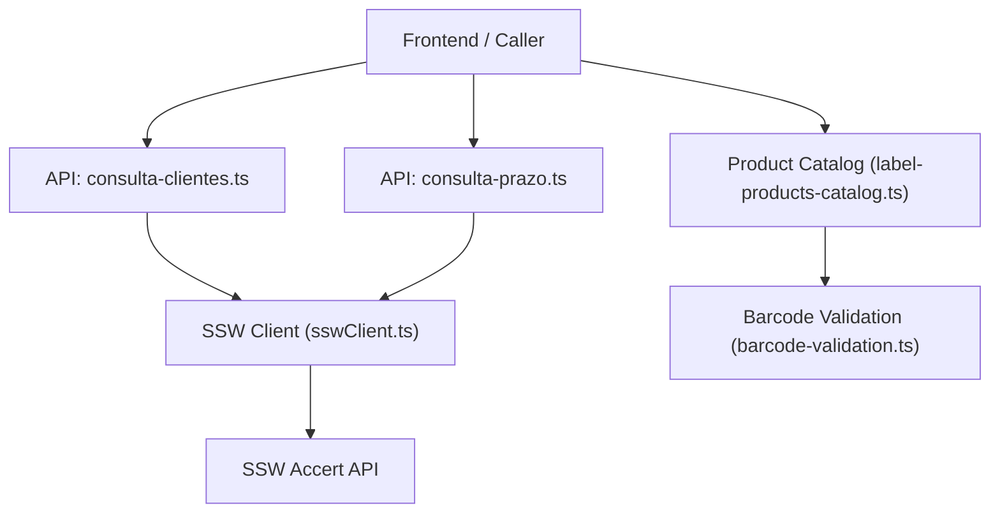
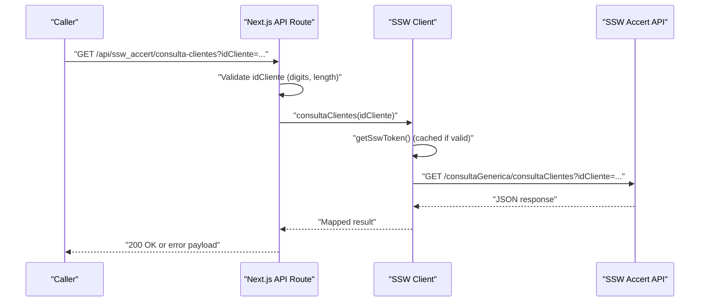
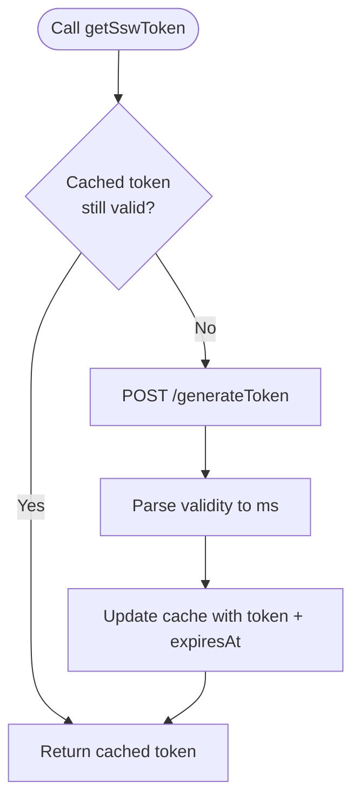
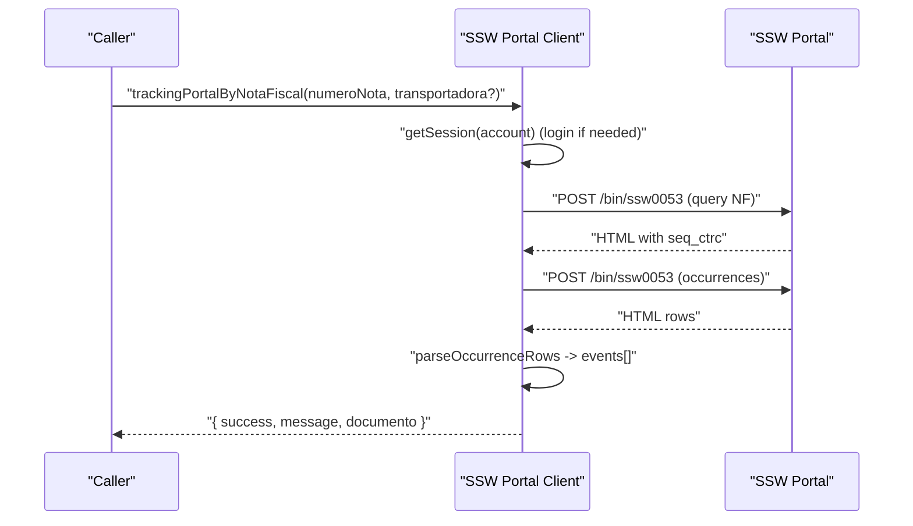
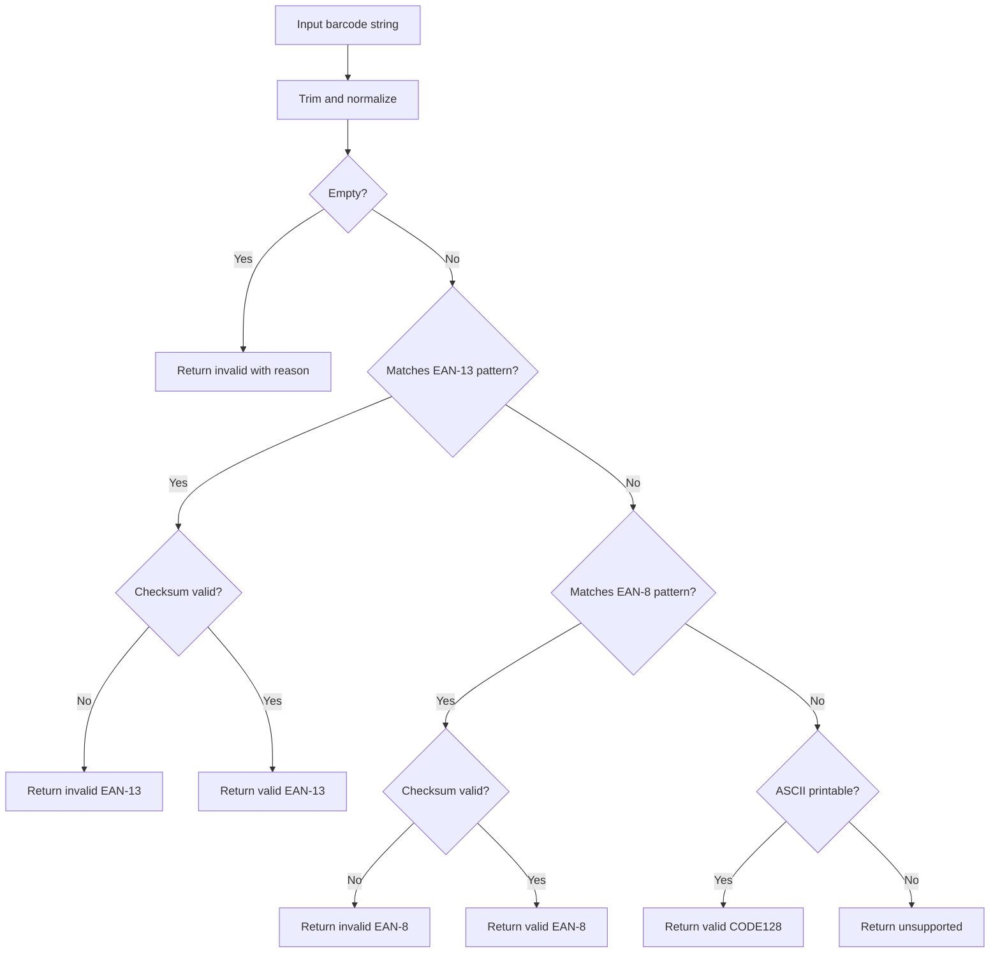
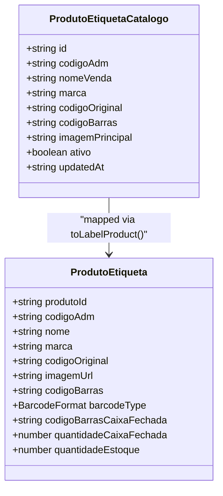
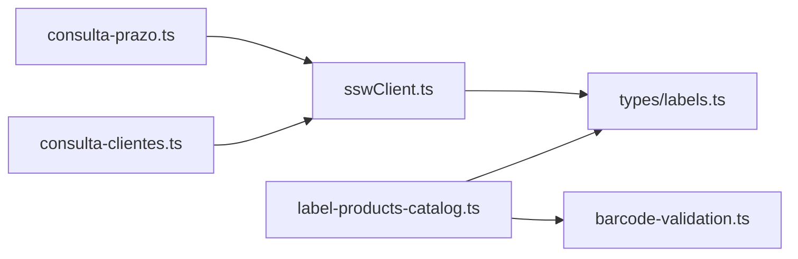

# External Product Lookup

<cite>
**Referenced Files in This Document**
- [sswClient.ts](file://services/sswClient.ts)
- [sswPortalClient.ts](file://services/sswPortalClient.ts)
- [barcode-validation.ts](file://lib/barcode-validation.ts)
- [label-products-catalog.ts](file://lib/label-products-catalog.ts)
- [consulta-clientes.ts](file://pages/api/ssw_accert/consulta-clientes.ts)
- [consulta-prazo.ts](file://pages/api/ssw_accert/consulta-prazo.ts)
- [labels.ts](file://types/labels.ts)
</cite>

## Table of Contents
1. Introduction
2. Project Structure
3. Core Components
4. Architecture Overview
5. Detailed Component Analysis
6. Dependency Analysis
7. Performance Considerations
8. Troubleshooting Guide
9. Conclusion

## Introduction
This document explains how the system integrates with external product lookup services, focusing on the SSW Accert ERP integration for retrieving product information using validated barcodes. It covers API communication flows, request/response handling, data mapping to internal models, error handling (including network failures and timeouts), caching strategies, and integration patterns with the barcode validation engine. It also provides examples of product lookup workflows and response structures used by the application.

## Project Structure
The external product lookup capability is implemented across a small set of focused modules:
- Services layer: HTTP clients for SSW Accert APIs and portal-based tracking.
- Validation layer: Barcode format detection and checksum validation.
- Catalog layer: Local product catalog normalization and search.
- API routes: Thin Next.js handlers that validate inputs and delegate to services.

**Diagram sources**
- [consulta-clientes.ts:1-32](file://pages/api/ssw_accert/consulta-clientes.ts#L1-L32)
- [consulta-prazo.ts:1-36](file://pages/api/ssw_accert/consulta-prazo.ts#L1-L36)
- [sswClient.ts:1-445](file://services/sswClient.ts#L1-L445)
- [label-products-catalog.ts:1-54](file://lib/label-products-catalog.ts#L1-L54)
- [barcode-validation.ts:1-89](file://lib/barcode-validation.ts#L1-L89)

**Section sources**
- [consulta-clientes.ts:1-32](file://pages/api/ssw_accert/consulta-clientes.ts#L1-L32)
- [consulta-prazo.ts:1-36](file://pages/api/ssw_accert/consulta-prazo.ts#L1-L36)
- [sswClient.ts:1-445](file://services/sswClient.ts#L1-L445)
- [label-products-catalog.ts:1-54](file://lib/label-products-catalog.ts#L1-L54)
- [barcode-validation.ts:1-89](file://lib/barcode-validation.ts#L1-L89)

## Core Components
- SSW Accert client: Handles token generation, caching, GET/POST requests, and specific endpoints such as client lookup and freight lead time queries.
- SSW Portal client: Provides session-based portal interactions and tracking retrieval via HTML scraping, with robust retry logic and image proof handling.
- Barcode validation: Validates EAN-13/EAN-8 formats and detects CODE128; returns analysis results used by catalog and label features.
- Product catalog: Normalizes local product data and maps it to an internal model suitable for labels and UI.
- API routes: Validate input parameters and forward calls to the appropriate service.

Key responsibilities:
- Authentication and token caching for SSW API calls.
- Input sanitization and validation before calling external systems.
- Mapping external responses into internal types for consistent consumption.
- Error propagation with user-friendly messages.

**Section sources**
- [sswClient.ts:1-445](file://services/sswClient.ts#L1-L445)
- [sswPortalClient.ts:1-578](file://services/sswPortalClient.ts#L1-L578)
- [barcode-validation.ts:1-89](file://lib/barcode-validation.ts#L1-L89)
- [label-products-catalog.ts:1-54](file://lib/label-products-catalog.ts#L1-L54)
- [consulta-clientes.ts:1-32](file://pages/api/ssw_accert/consulta-clientes.ts#L1-L32)
- [consulta-prazo.ts:1-36](file://pages/api/ssw_accert/consulta-prazo.ts#L1-L36)
- [labels.ts:1-121](file://types/labels.ts#L1-L121)

## Architecture Overview
The architecture separates concerns between API routing, service orchestration, and external integrations. The flow starts at Next.js API routes, which validate inputs and call service functions. Services manage authentication, retries, and response parsing. Data is mapped to internal models defined in shared types.

**Diagram sources**
- [consulta-clientes.ts:1-32](file://pages/api/ssw_accert/consulta-clientes.ts#L1-L32)
- [sswClient.ts:50-128](file://services/sswClient.ts#L50-L128)

**Section sources**
- [consulta-clientes.ts:1-32](file://pages/api/ssw_accert/consulta-clientes.ts#L1-L32)
- [sswClient.ts:50-128](file://services/sswClient.ts#L50-L128)

## Detailed Component Analysis

### SSW Accert Client
Responsibilities:
- Token lifecycle management with in-memory caching and validity parsing.
- Generic GET/POST helpers that attach Authorization headers and parse JSON.
- Specific endpoints: client lookup, postal code lookup, freight lead time, and NF tracking.

Authentication and caching:
- Token endpoint: POST to generate token with domain, username, password, CNPJ EDI, and force flag.
- Cache strategy: store token and expiration derived from validity string; subtract a safety margin before expiry.

Error handling:
- Non-OK HTTP status throws descriptive errors.
- Invalid JSON responses are caught and converted to user-friendly errors.

Data mapping:
- Returns generic objects; callers can map fields as needed. For example, client lookup returns a structure with optional erro/mensagem fields.

**Diagram sources**
- [sswClient.ts:33-99](file://services/sswClient.ts#L33-L99)

**Section sources**
- [sswClient.ts:1-445](file://services/sswClient.ts#L1-L445)

### SSW Portal Client
Responsibilities:
- Session-based login to the SSW portal with cookie management.
- Querying delivery tracking by invoice number and parsing occurrences into structured events.
- Secure photo retrieval with signed tokens and fallbacks to alternative endpoints.

Session management:
- Maintains per-account sessions with expiration and deduplicated login promises.
- Request queues per account to avoid concurrent conflicts.

Tracking workflow:
- Builds query body for date range and invoice number.
- Parses HTML rows into normalized events with dates, locations, descriptions, and images.

Security and resilience:
- Validates photo tokens with HMAC signatures and expiration checks.
- Retries multiple endpoints when images are not immediately available.

**Diagram sources**
- [sswPortalClient.ts:176-222](file://services/sswPortalClient.ts#L176-L222)
- [sswPortalClient.ts:485-532](file://services/sswPortalClient.ts#L485-L532)
- [sswPortalClient.ts:534-577](file://services/sswPortalClient.ts#L534-L577)

**Section sources**
- [sswPortalClient.ts:1-578](file://services/sswPortalClient.ts#L1-L578)

### Barcode Validation Engine
Responsibilities:
- Detect barcode type (EAN-13, EAN-8, CODE128).
- Validate checksums for EAN formats.
- Provide normalized values and reasons for invalid codes.

Integration points:
- Used by the product catalog to annotate products with barcode type.
- Can be used upstream to validate scanned barcodes before product lookup.

Complexity:
- O(n) over digits for checksum calculation; minimal overhead.

**Diagram sources**
- [barcode-validation.ts:7-88](file://lib/barcode-validation.ts#L7-L88)

**Section sources**
- [barcode-validation.ts:1-89](file://lib/barcode-validation.ts#L1-L89)

### Product Catalog
Responsibilities:
- Load local product data and normalize brand names.
- Map catalog entries to an internal label product model.
- Support searching by brand and returning metadata about the catalog.

Data mapping:
- Converts catalog fields to internal model fields including barcode type annotation.

Performance:
- In-memory filtering and sorting; suitable for moderate catalogs.

**Diagram sources**
- [label-products-catalog.ts:14-29](file://lib/label-products-catalog.ts#L14-L29)
- [labels.ts:9-21](file://types/labels.ts#L9-L21)
- [labels.ts:33-46](file://types/labels.ts#L33-L46)

**Section sources**
- [label-products-catalog.ts:1-54](file://lib/label-products-catalog.ts#L1-L54)
- [labels.ts:1-121](file://types/labels.ts#L1-L121)

### API Routes Integration
- consulta-clientes.ts:
  - Validates idCliente (digits only, expected lengths).
  - Delegates to SSW client and returns either success or error payloads.
- consulta-prazo.ts:
  - Validates required parameters (origin/destination zip codes).
  - Delegates to SSW client and returns lead time data or errors.

These routes ensure consistent error handling and provide a stable contract to callers.

**Section sources**
- [consulta-clientes.ts:1-32](file://pages/api/ssw_accert/consulta-clientes.ts#L1-L32)
- [consulta-prazo.ts:1-36](file://pages/api/ssw_accert/consulta-prazo.ts#L1-L36)

## Dependency Analysis
High-level dependencies:
- API routes depend on services for external communication.
- Services depend on environment configuration for credentials and base URLs.
- Catalog depends on barcode validation for type detection.
- Types define contracts consumed across layers.

**Diagram sources**
- [consulta-clientes.ts:1-32](file://pages/api/ssw_accert/consulta-clientes.ts#L1-L32)
- [consulta-prazo.ts:1-36](file://pages/api/ssw_accert/consulta-prazo.ts#L1-L36)
- [sswClient.ts:1-445](file://services/sswClient.ts#L1-L445)
- [label-products-catalog.ts:1-54](file://lib/label-products-catalog.ts#L1-L54)
- [barcode-validation.ts:1-89](file://lib/barcode-validation.ts#L1-L89)
- [labels.ts:1-121](file://types/labels.ts#L1-L121)

**Section sources**
- [consulta-clientes.ts:1-32](file://pages/api/ssw_accert/consulta-clientes.ts#L1-L32)
- [consulta-prazo.ts:1-36](file://pages/api/ssw_accert/consulta-prazo.ts#L1-L36)
- [sswClient.ts:1-445](file://services/sswClient.ts#L1-L445)
- [label-products-catalog.ts:1-54](file://lib/label-products-catalog.ts#L1-L54)
- [barcode-validation.ts:1-89](file://lib/barcode-validation.ts#L1-L89)
- [labels.ts:1-121](file://types/labels.ts#L1-L121)

## Performance Considerations
- Token caching: Reduces repeated authentication calls; validity parsed from server response with a safety margin to avoid late expiry.
- Session reuse: Portal client maintains cookies and deduplicates login attempts per account.
- Request queuing: Prevents concurrent requests to the same account, reducing contention.
- Image retrieval fallbacks: Multiple endpoints and retries improve reliability for dynamic content.
- Local catalog operations: Filtering and sorting occur in memory; consider pagination or indexing for very large catalogs.

[No sources needed since this section provides general guidance]

## Troubleshooting Guide
Common issues and resolutions:
- Missing or invalid credentials:
  - Ensure SSW_ACCERT_DOMAIN, SSW_ACCERT_USERNAME, SSW_ACCERT_CNPJ_EDI, and SSW_ACCERT_PASSWORD are configured where required.
  - For portal-based features, configure all desired accounts (ACCERT, Expresso Goias, Zanuello) with their respective domains and passwords.
- Network failures:
  - Non-OK HTTP statuses throw descriptive errors; check logs for status codes and messages.
  - For portal images, multiple endpoints are retried; if still failing, verify network access and referer policies.
- Timeouts:
  - No explicit timeout is set in fetch calls; consider adding timeouts at the platform level (e.g., serverless function limits) to prevent hanging requests.
- Invalid inputs:
  - API routes validate parameters; ensure idCliente has correct digit count and other required fields are present.
- Barcode validation errors:
  - Use analyzeBarcode to detect unsupported or invalid codes early; handle reasons returned by the validator.

**Section sources**
- [sswClient.ts:41-48](file://services/sswClient.ts#L41-L48)
- [sswClient.ts:77-99](file://services/sswClient.ts#L77-L99)
- [sswClient.ts:118-128](file://services/sswClient.ts#L118-L128)
- [sswPortalClient.ts:176-203](file://services/sswPortalClient.ts#L176-L203)
- [consulta-clientes.ts:13-29](file://pages/api/ssw_accert/consulta-clientes.ts#L13-L29)
- [consulta-prazo.ts:9-33](file://pages/api/ssw_accert/consulta-prazo.ts#L9-L33)
- [barcode-validation.ts:42-88](file://lib/barcode-validation.ts#L42-L88)

## Conclusion
The external product lookup system integrates tightly with SSW Accert through a robust client that manages authentication, caching, and error handling. Complementary components include a portal client for tracking and image proofs, a barcode validation engine for input integrity, and a local catalog for product metadata. API routes provide a clean interface for callers to retrieve client and logistics data. Together, these components enable reliable product lookup workflows with clear error signaling and performance optimizations.

[No sources needed since this section summarizes without analyzing specific files]