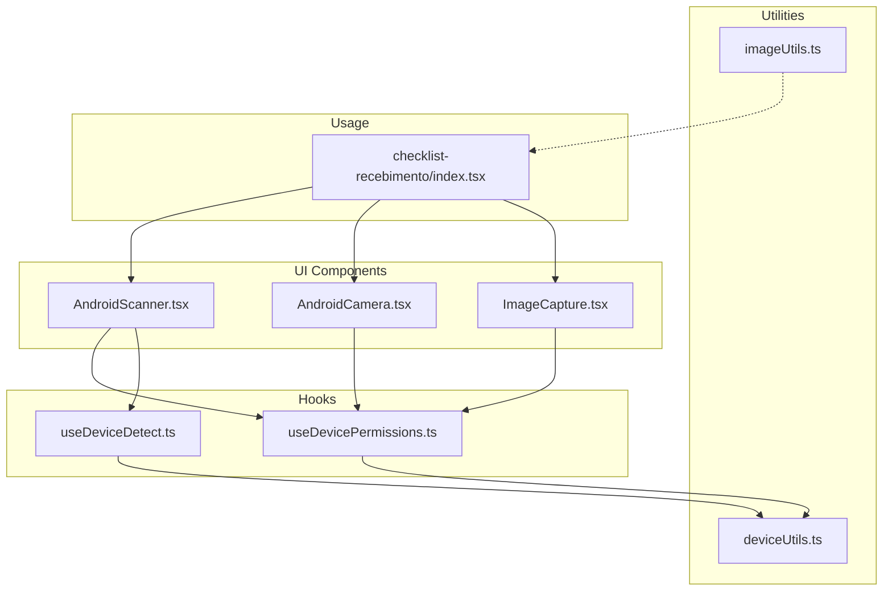
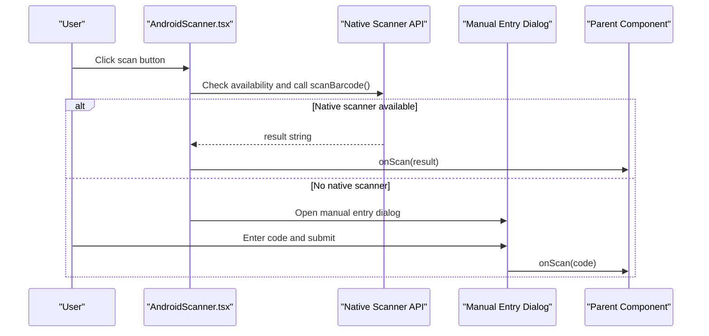
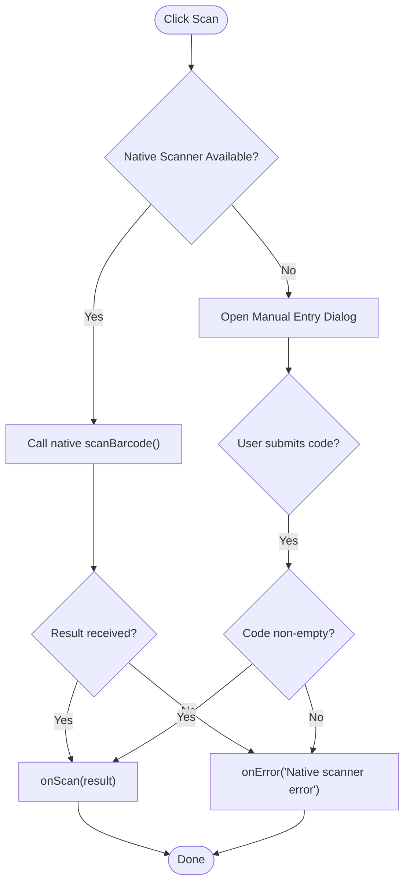
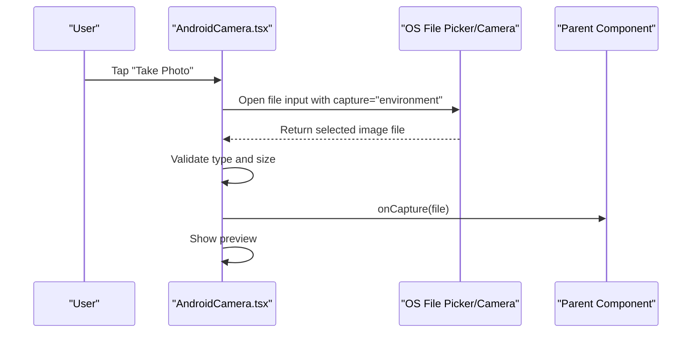
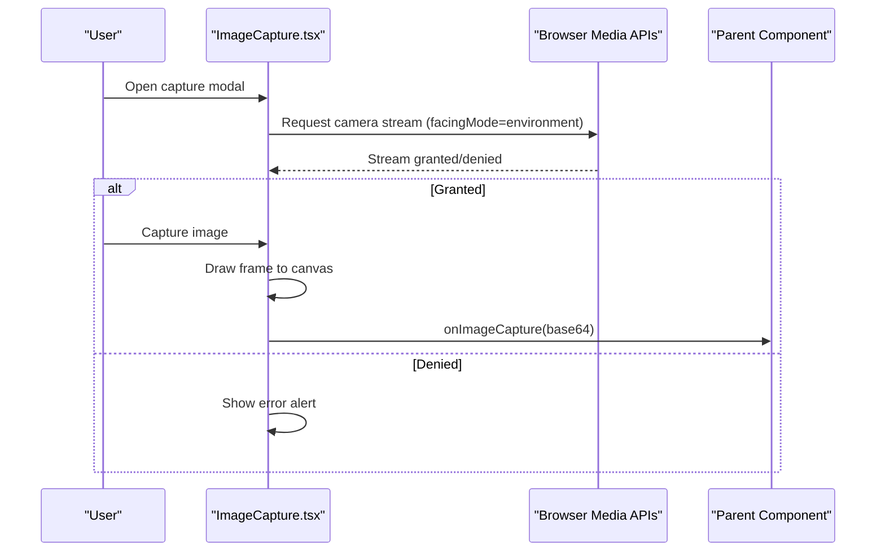
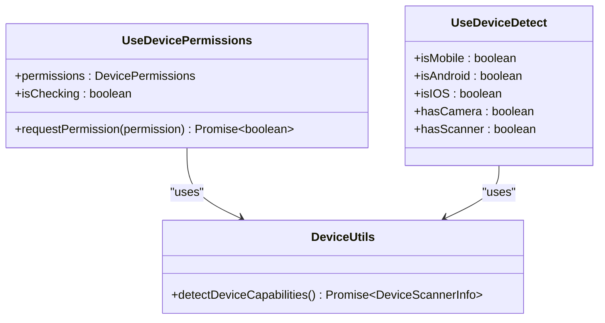
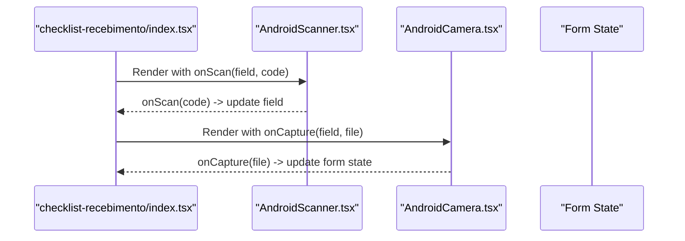
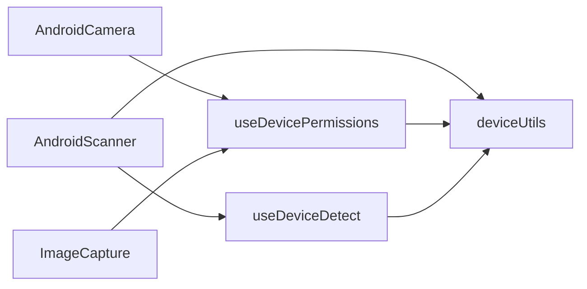

# Hardware Scanning Integration

<cite>
**Referenced Files in This Document**
- [AndroidScanner.tsx](file://components/AndroidScanner.tsx)
- [AndroidCamera.tsx](file://components/AndroidCamera.tsx)
- [ImageCapture.tsx](file://components/ImageCapture.tsx)
- [useDevicePermissions.ts](file://hooks/useDevicePermissions.ts)
- [useDeviceDetect.ts](file://hooks/useDeviceDetect.ts)
- [deviceUtils.ts](file://lib/deviceUtils.ts)
- [imageUtils.ts](file://lib/imageUtils.ts)
- [index.tsx (checklist-recebimento)](file://pages/checklist-recebimento/index.tsx)
</cite>

## Table of Contents
1. Introduction
2. Project Structure
3. Core Components
4. Architecture Overview
5. Detailed Component Analysis
6. Dependency Analysis
7. Performance Considerations
8. Troubleshooting Guide
9. Conclusion
10. Appendices

## Introduction
This document explains how the application integrates hardware scanning devices and camera-based image capture across Android and web environments. It covers the end-to-end workflow from device input to data processing, including permission handling, device detection, fallback mechanisms, image processing capabilities, OCR integration possibilities, error handling, setup instructions for different devices, configuration options, and troubleshooting common issues.

## Project Structure
The scanning and imaging features are implemented as reusable React components and hooks with supporting utilities:
- Scanning component that bridges native Android scanners or falls back to manual entry
- Camera components for capturing images via native file picker or browser media APIs
- Device capability detection and permission management hooks
- Image optimization utility for server-side processing

**Diagram sources**
- [AndroidScanner.tsx:1-224](file://components/AndroidScanner.tsx#L1-L224)
- [AndroidCamera.tsx:1-219](file://components/AndroidCamera.tsx#L1-L219)
- [ImageCapture.tsx:1-234](file://components/ImageCapture.tsx#L1-L234)
- [useDevicePermissions.ts:1-69](file://hooks/useDevicePermissions.ts#L1-L69)
- [useDeviceDetect.ts:1-58](file://hooks/useDeviceDetect.ts#L1-L58)
- [deviceUtils.ts:1-39](file://lib/deviceUtils.ts#L1-L39)
- [imageUtils.ts:1-38](file://lib/imageUtils.ts#L1-L38)
- [index.tsx (checklist-recebimento):500-699](file://pages/checklist-recebimento/index.tsx#L500-L699)

**Section sources**
- [AndroidScanner.tsx:1-224](file://components/AndroidScanner.tsx#L1-L224)
- [AndroidCamera.tsx:1-219](file://components/AndroidCamera.tsx#L1-L219)
- [ImageCapture.tsx:1-234](file://components/ImageCapture.tsx#L1-L234)
- [useDevicePermissions.ts:1-69](file://hooks/useDevicePermissions.ts#L1-L69)
- [useDeviceDetect.ts:1-58](file://hooks/useDeviceDetect.ts#L1-L58)
- [deviceUtils.ts:1-39](file://lib/deviceUtils.ts#L1-L39)
- [imageUtils.ts:1-38](file://lib/imageUtils.ts#L1-L38)
- [index.tsx (checklist-recebimento):500-699](file://pages/checklist-recebimento/index.tsx#L500-L699)

## Core Components
- AndroidScanner: Attempts to use a native Android scanner bridge; if unavailable, opens a dialog for manual code entry. Emits scanned codes via an onScan callback and reports errors via onError.
- AndroidCamera: Uses a hidden file input with capture="environment" to trigger the device camera on mobile; validates image type and size, shows preview, and emits captured files via onCapture.
- ImageCapture: Opens a modal to start the browser camera using getUserMedia, captures frames to a canvas, and also supports selecting images from the gallery. Emits base64 image data via onImageCapture.
- useDevicePermissions: Detects device capabilities and requests camera permissions; exposes scanner availability based on device detection.
- useDeviceDetect: Determines platform (mobile, Android, iOS), camera presence, and native scanner availability by inspecting user agent and window APIs.
- deviceUtils: Centralized capability detection for Android, Movfast/Ranger devices, native scanner presence, and camera access.
- imageUtils: Server-side image optimization using sharp for photos and documents, resizing and compressing to reduce payload sizes.

**Section sources**
- [AndroidScanner.tsx:22-74](file://components/AndroidScanner.tsx#L22-L74)
- [AndroidCamera.tsx:18-77](file://components/AndroidCamera.tsx#L18-L77)
- [ImageCapture.tsx:21-108](file://components/ImageCapture.tsx#L21-L108)
- [useDevicePermissions.ts:4-69](file://hooks/useDevicePermissions.ts#L4-L69)
- [useDeviceDetect.ts:4-58](file://hooks/useDeviceDetect.ts#L4-L58)
- [deviceUtils.ts:1-39](file://lib/deviceUtils.ts#L1-L39)
- [imageUtils.ts:1-38](file://lib/imageUtils.ts#L1-L38)

## Architecture Overview
The system follows a layered approach:
- UI layer: Components render controls for scanning and capturing.
- Capability layer: Hooks and utilities detect device capabilities and manage permissions.
- Integration layer: Native scanner bridge is invoked when available; otherwise, fallbacks are used.
- Processing layer: Captured images can be optimized server-side before storage or transmission.

**Diagram sources**
- [AndroidScanner.tsx:46-74](file://components/AndroidScanner.tsx#L46-L74)
- [deviceUtils.ts:8-23](file://lib/deviceUtils.ts#L8-L23)
- [index.tsx (checklist-recebimento):507-512](file://pages/checklist-recebimento/index.tsx#L507-L512)

## Detailed Component Analysis

### AndroidScanner
Responsibilities:
- Attempt native scanner invocation on Android devices where supported.
- Provide a manual entry fallback dialog when native scanner is not available.
- Emit scanned codes to parent via onScan and surface errors via onError.

Key behaviors:
- Checks for native scanner availability through window APIs and device detection.
- On success, forwards the scanned barcode string to the parent.
- On failure or unavailability, opens a dialog for manual input and validates non-empty entries.

**Diagram sources**
- [AndroidScanner.tsx:46-74](file://components/AndroidScanner.tsx#L46-L74)
- [AndroidScanner.tsx:108-151](file://components/AndroidScanner.tsx#L108-L151)

**Section sources**
- [AndroidScanner.tsx:22-74](file://components/AndroidScanner.tsx#L22-L74)
- [AndroidScanner.tsx:108-151](file://components/AndroidScanner.tsx#L108-L151)

### AndroidCamera
Responsibilities:
- Trigger device camera via a hidden file input with capture="environment".
- Validate image type and size limits.
- Generate preview and emit captured File objects to parent via onCapture.

Key behaviors:
- Uses accept="image/*" and capture="environment" to prefer rear camera on mobile.
- Enforces maximum file size and correct MIME type.
- Provides preview and re-capture UX.

**Diagram sources**
- [AndroidCamera.tsx:43-77](file://components/AndroidCamera.tsx#L43-L77)
- [AndroidCamera.tsx:94-213](file://components/AndroidCamera.tsx#L94-L213)

**Section sources**
- [AndroidCamera.tsx:18-77](file://components/AndroidCamera.tsx#L18-L77)
- [AndroidCamera.tsx:94-213](file://components/AndroidCamera.tsx#L94-L213)

### ImageCapture
Responsibilities:
- Provide a modal interface to start the browser camera, capture frames to a canvas, and optionally select images from the gallery.
- Emit base64 image data to parent via onImageCapture.

Key behaviors:
- Requests camera stream using navigator.mediaDevices.getUserMedia with facingMode set to environment.
- Draws video frame onto a canvas and converts to JPEG base64.
- Supports gallery selection and displays error alerts for permission failures.

**Diagram sources**
- [ImageCapture.tsx:44-83](file://components/ImageCapture.tsx#L44-L83)
- [ImageCapture.tsx:122-229](file://components/ImageCapture.tsx#L122-L229)

**Section sources**
- [ImageCapture.tsx:21-108](file://components/ImageCapture.tsx#L21-L108)
- [ImageCapture.tsx:122-229](file://components/ImageCapture.tsx#L122-L229)

### Permission and Device Detection
Responsibilities:
- Detect platform capabilities and camera/scanner availability.
- Request camera permissions and report results to UI.

Key behaviors:
- useDeviceDetect inspects user agent and enumerates devices to determine camera presence and scanner support.
- useDevicePermissions attempts to acquire camera permission and sets scanner availability based on device capabilities.
- deviceUtils centralizes checks for Android, Movfast/Ranger devices, and native scanner presence.

**Diagram sources**
- [useDeviceDetect.ts:12-58](file://hooks/useDeviceDetect.ts#L12-L58)
- [useDevicePermissions.ts:9-69](file://hooks/useDevicePermissions.ts#L9-L69)
- [deviceUtils.ts:8-39](file://lib/deviceUtils.ts#L8-L39)

**Section sources**
- [useDeviceDetect.ts:12-58](file://hooks/useDeviceDetect.ts#L12-L58)
- [useDevicePermissions.ts:9-69](file://hooks/useDevicePermissions.ts#L9-L69)
- [deviceUtils.ts:8-39](file://lib/deviceUtils.ts#L8-L39)

### Usage in Checklist Receiving Flow
The checklist receiving page integrates both scanning and camera capture:
- Uses AndroidScanner to fill product fields with scanned barcodes.
- Uses AndroidCamera to capture general receipt and return photos, plus per-product images.

**Diagram sources**
- [index.tsx (checklist-recebimento):507-512](file://pages/checklist-recebimento/index.tsx#L507-L512)
- [index.tsx (checklist-recebimento):542-573](file://pages/checklist-recebimento/index.tsx#L542-L573)
- [index.tsx (checklist-recebimento):597-609](file://pages/checklist-recebimento/index.tsx#L597-L609)

**Section sources**
- [index.tsx (checklist-recebimento):507-512](file://pages/checklist-recebimento/index.tsx#L507-L512)
- [index.tsx (checklist-recebimento):542-573](file://pages/checklist-recebimento/index.tsx#L542-L573)
- [index.tsx (checklist-recebimento):597-609](file://pages/checklist-recebimento/index.tsx#L597-L609)

## Dependency Analysis
- AndroidScanner depends on:
  - Native scanner bridge availability (window.Android.scanBarcode or similar).
  - Device detection to decide fallback behavior.
- AndroidCamera depends on:
  - HTML file input capture attribute for mobile camera.
  - Parent validation and preview rendering.
- ImageCapture depends on:
  - Browser mediaDevices API for camera access.
  - Canvas API for frame capture and conversion to base64.
- Permissions and detection depend on:
  - deviceUtils for centralized capability checks.
  - Navigator APIs for device enumeration and media streams.

**Diagram sources**
- [AndroidScanner.tsx:46-74](file://components/AndroidScanner.tsx#L46-L74)
- [AndroidCamera.tsx:43-77](file://components/AndroidCamera.tsx#L43-L77)
- [ImageCapture.tsx:44-83](file://components/ImageCapture.tsx#L44-L83)
- [useDevicePermissions.ts:17-69](file://hooks/useDevicePermissions.ts#L17-L69)
- [useDeviceDetect.ts:23-58](file://hooks/useDeviceDetect.ts#L23-L58)
- [deviceUtils.ts:8-39](file://lib/deviceUtils.ts#L8-L39)

**Section sources**
- [AndroidScanner.tsx:46-74](file://components/AndroidScanner.tsx#L46-L74)
- [AndroidCamera.tsx:43-77](file://components/AndroidCamera.tsx#L43-L77)
- [ImageCapture.tsx:44-83](file://components/ImageCapture.tsx#L44-L83)
- [useDevicePermissions.ts:17-69](file://hooks/useDevicePermissions.ts#L17-L69)
- [useDeviceDetect.ts:23-58](file://hooks/useDeviceDetect.ts#L23-L58)
- [deviceUtils.ts:8-39](file://lib/deviceUtils.ts#L8-L39)

## Performance Considerations
- Prefer native scanner bridge when available to minimize latency and improve reliability.
- Limit image sizes early in the capture flow to reduce memory usage and network overhead.
- Use server-side image optimization to resize and compress images before storage or upload.
- Avoid keeping long-lived camera streams; stop tracks promptly after capture to free resources.

[No sources needed since this section provides general guidance]

## Troubleshooting Guide
Common issues and resolutions:
- Native scanner not detected:
  - Ensure the device runs a compatible environment (e.g., Movfast/Ranger) and the bridge is exposed.
  - Verify device detection logic identifies the platform correctly.
- Camera permission denied:
  - Prompt the user to grant camera permissions; handle denial gracefully with clear messages.
  - Confirm HTTPS context if required by the browser.
- Image too large:
  - Enforce size limits in the camera component and optimize images server-side.
- Manual entry fallback:
  - If native scanner is unavailable, ensure the manual entry dialog is accessible and validates inputs.

**Section sources**
- [AndroidScanner.tsx:46-74](file://components/AndroidScanner.tsx#L46-L74)
- [ImageCapture.tsx:44-57](file://components/ImageCapture.tsx#L44-L57)
- [AndroidCamera.tsx:49-61](file://components/AndroidCamera.tsx#L49-L61)
- [imageUtils.ts:3-38](file://lib/imageUtils.ts#L3-L38)

## Conclusion
The application provides a robust, cross-platform scanning and imaging solution:
- Native scanner integration on supported Android devices with a reliable manual entry fallback.
- Flexible camera capture via native file picker or browser media APIs.
- Centralized device capability detection and permission management.
- Server-side image optimization to balance quality and performance.
These components enable efficient data capture workflows while maintaining usability across diverse devices and environments.

[No sources needed since this section summarizes without analyzing specific files]

## Appendices

### Setup Instructions by Device Type
- Android with native scanner (Movfast/Ranger):
  - Ensure the app runs within the supported environment exposing the native scanner bridge.
  - The AndroidScanner component will automatically attempt to use the bridge; if unavailable, it falls back to manual entry.
- Android without native scanner:
  - Use AndroidCamera to capture images; rely on manual entry for barcodes.
- Web browsers:
  - Use ImageCapture to request camera access; ensure HTTPS and proper permissions.
  - Gallery selection is supported as an alternative to live camera capture.

[No sources needed since this section provides general guidance]

### Configuration Options
- AndroidScanner:
  - buttonText: Label for the scan button; empty value renders an icon-only button.
  - size, variant, color: Styling options for the button.
  - disabled: Disables the scan action.
  - onScan: Callback emitting scanned codes.
  - onError: Callback for error messages.
- AndroidCamera:
  - buttonText: Label for the capture button.
  - size, variant, color: Styling options.
  - currentFile: Displays existing captured file status.
  - onCapture: Callback emitting captured File objects.
  - onError: Callback for error messages.
- ImageCapture:
  - open: Controls modal visibility.
  - onClose: Closes the modal and stops camera streams.
  - onImageCapture: Callback emitting base64 image data.
  - maxImages: Optional limit for number of images per session.
  - currentImages: Optional array of existing images for display.

**Section sources**
- [AndroidScanner.tsx:22-40](file://components/AndroidScanner.tsx#L22-L40)
- [AndroidCamera.tsx:18-38](file://components/AndroidCamera.tsx#L18-L38)
- [ImageCapture.tsx:21-35](file://components/ImageCapture.tsx#L21-L35)

### OCR Integration Possibilities
- After capturing images via AndroidCamera or ImageCapture, send them to a backend service for OCR processing.
- Use imageUtils to optimize images before sending to reduce bandwidth and improve OCR accuracy.
- Integrate with external OCR services or libraries to extract text from receipts, labels, or documents.
- Store extracted metadata alongside images for downstream processing.

[No sources needed since this section provides general guidance]