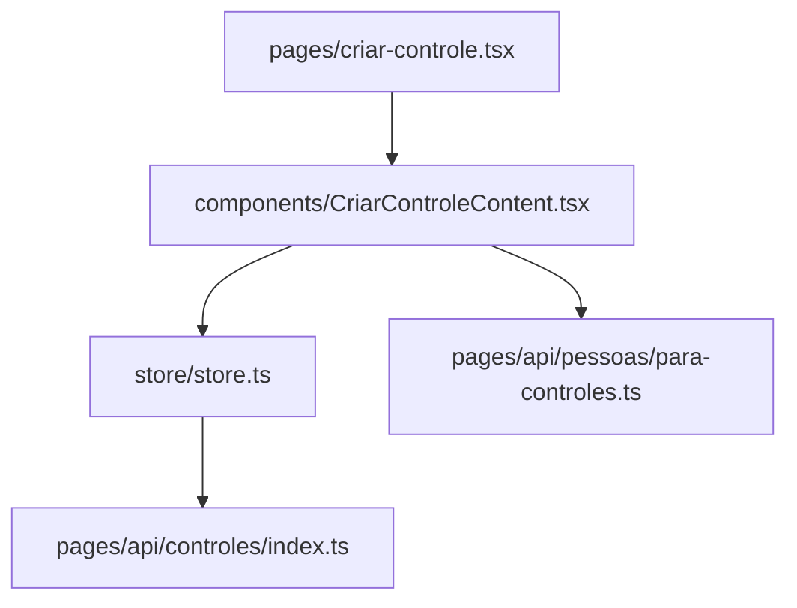
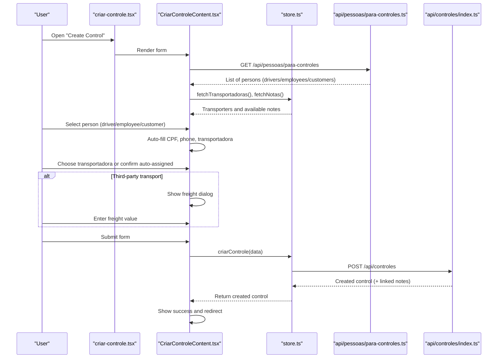
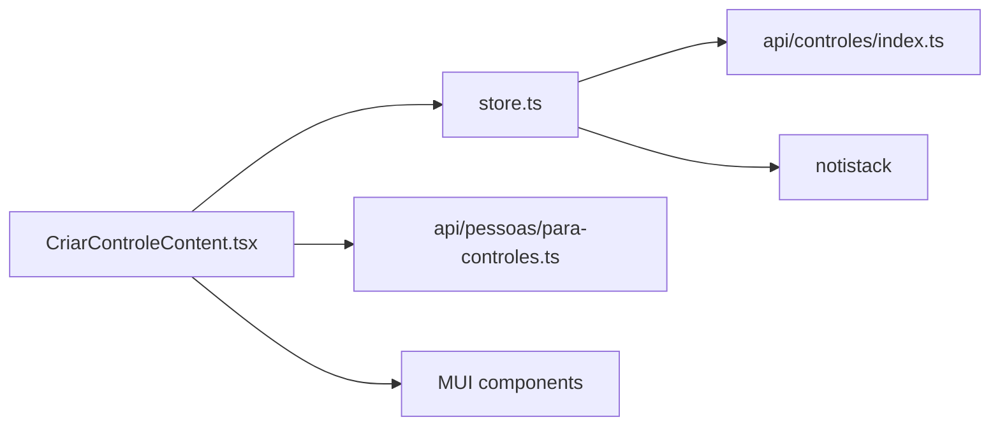

# Cargo Control Creation

<cite>
**Referenced Files in This Document**
- [criar-controle.tsx](file://pages/criar-controle.tsx)
- [CriarControleContent.tsx](file://components/CriarControleContent.tsx)
- [para-controles.ts](file://pages/api/pessoas/para-controles.ts)
- [store.ts](file://store/store.ts)
- [index.ts (controles API)](file://pages/api/controles/index.ts)
</cite>

## Table of Contents
1. [Introduction](#introduction)
2. [Project Structure](#project-structure)
3. [Core Components](#core-components)
4. [Architecture Overview](#architecture-overview)
5. [Detailed Component Analysis](#detailed-component-analysis)
6. [Dependency Analysis](#dependency-analysis)
7. [Performance Considerations](#performance-considerations)
8. [Troubleshooting Guide](#troubleshooting-guide)
9. [Conclusion](#conclusion)

## Introduction
This document explains the complete workflow for creating a cargo control, including driver selection, transport company assignment, vehicle information, pallet quantity management, and freight cost handling for third-party transports. It also covers validation rules for CPF and required fields, integration with person selection (drivers, employees, customers), automatic transport company assignment based on driver profiles, and examples for internal vs external transports.

## Project Structure
The cargo control creation spans a Next.js page that dynamically loads a content component, which orchestrates UI interactions, validations, and data persistence via a state store and backend APIs.

**Diagram sources**
- [criar-controle.tsx:9-12](file://pages/criar-controle.tsx#L9-L12)
- [CriarControleContent.tsx:124-244](file://components/CriarControleContent.tsx#L124-L244)
- [store.ts:269-397](file://store/store.ts#L269-L397)
- [para-controles.ts:10-47](file://pages/api/pessoas/para-controles.ts#L10-L47)
- [index.ts (controles API):64-112](file://pages/api/controles/index.ts#L64-L112)

**Section sources**
- [criar-controle.tsx:14-59](file://pages/criar-controle.tsx#L14-L59)
- [CriarControleContent.tsx:124-244](file://components/CriarControleContent.tsx#L124-L244)

## Core Components
- Page wrapper: Authenticates users and renders the creation form within an app layout.
- Form component: Manages driver/person selection, transport company, vehicle details, pallets, notes linking, and freight dialog.
- Store: Validates inputs, formats payloads, calls APIs to create controls and link notes, and updates lists.
- Person API: Provides drivers, employees, and customers with associated transport companies.
- Controls API: Persists new cargo controls and links notes.

Key responsibilities:
- Driver/person selection with auto-fill of CPF, phone, and transport company.
- Conditional freight dialog for third-party transports.
- Validation for required fields and numeric constraints.
- Note selection and linking after control creation.

**Section sources**
- [criar-controle.tsx:14-59](file://pages/criar-controle.tsx#L14-L59)
- [CriarControleContent.tsx:171-412](file://components/CriarControleContent.tsx#L171-L412)
- [store.ts:269-397](file://store/store.ts#L269-L397)
- [para-controles.ts:10-47](file://pages/api/pessoas/para-controles.ts#L10-L47)
- [index.ts (controles API):64-112](file://pages/api/controles/index.ts#L64-L112)

## Architecture Overview
The creation flow integrates UI, state, and backend services:

**Diagram sources**
- [CriarControleContent.tsx:221-244](file://components/CriarControleContent.tsx#L221-L244)
- [CriarControleContent.tsx:531-571](file://components/CriarControleContent.tsx#L531-L571)
- [CriarControleContent.tsx:727-779](file://components/CriarControleContent.tsx#L727-L779)
- [CriarControleContent.tsx:286-412](file://components/CriarControleContent.tsx#L286-L412)
- [store.ts:269-397](file://store/store.ts#L269-L397)
- [para-controles.ts:10-47](file://pages/api/pessoas/para-controles.ts#L10-L47)
- [index.ts (controles API):64-112](file://pages/api/controles/index.ts#L64-L112)

## Detailed Component Analysis

### Form Workflow and Data Binding
- Driver/person selection uses an autocomplete grouped by type (drivers, employees, customers). Selecting a person auto-fills CPF, phone, and sets the transport company from the person’s profile.
- Transport company can be manually changed; if set to third-party, a freight dialog appears.
- Vehicle plate is required; pallet quantities are validated as non-negative numbers.
- Notes can be selected and will be linked after control creation.

Validation highlights:
- Required fields: transportadora, motorista, responsavel, placaVeiculo.
- Pallet counts must be non-negative.
- For third-party transports, freight value is required when user chooses to inform it.

**Section sources**
- [CriarControleContent.tsx:531-571](file://components/CriarControleContent.tsx#L531-L571)
- [CriarControleContent.tsx:696-724](file://components/CriarControleContent.tsx#L696-L724)
- [CriarControleContent.tsx:727-779](file://components/CriarControleContent.tsx#L727-L779)
- [CriarControleContent.tsx:798-860](file://components/CriarControleContent.tsx#L798-L860)
- [CriarControleContent.tsx:876-959](file://components/CriarControleContent.tsx#L876-L959)
- [CriarControleContent.tsx:286-333](file://components/CriarControleContent.tsx#L286-L333)

### Person Selection and Automatic Transport Company Assignment
- The form fetches all eligible persons (drivers, employees, customers) via the person API.
- When a person is selected, the transport company is automatically assigned from their profile. If the selected person belongs to a third-party transporter, the freight dialog is triggered.

Data mapping:
- Person objects include id, name, CPF, phone, CNH, transportadoraId, type labels, and display names.
- The list is grouped and rendered with chips indicating type and transport company.

**Section sources**
- [para-controles.ts:10-47](file://pages/api/pessoas/para-controles.ts#L10-L47)
- [CriarControleContent.tsx:221-244](file://components/CriarControleContent.tsx#L221-L244)
- [CriarControleContent.tsx:531-571](file://components/CriarControleContent.tsx#L531-L571)
- [CriarControleContent.tsx:574-629](file://components/CriarControleContent.tsx#L574-L629)

### Freight Handling for Third-Party Transports
- When transportadora equals third-party, a dialog asks whether to inform freight now.
- If yes, a currency-formatted input allows entering the freight value with Brazilian formatting (thousands separator ".", decimal separator ",").
- On submit, freight is included only if informed; otherwise, it remains null.

Flow:
- Dialog triggers on selecting third-party or changing transport company to third-party.
- Currency parsing ensures valid numeric values before submission.

**Section sources**
- [CriarControleContent.tsx:256-269](file://components/CriarControleContent.tsx#L256-L269)
- [CriarControleContent.tsx:727-779](file://components/CriarControleContent.tsx#L727-L779)
- [CriarControleContent.tsx:1033-1051](file://components/CriarControleContent.tsx#L1033-L1051)
- [CriarControleContent.tsx:318-323](file://components/CriarControleContent.tsx#L318-L323)

### Validation Rules
CPF validation:
- A dedicated validator checks length, rejects repeated digits, and validates check digits.

Required fields:
- Transportadora, motorista, responsavel, placaVeiculo are mandatory.
- Pallet quantities must be non-negative.
- For third-party transports with freight informed, a valid numeric value is required.

Error handling:
- Errors are collected and displayed inline; snackbar notifications guide users to correct issues.

**Section sources**
- [CriarControleContent.tsx:86-112](file://components/CriarControleContent.tsx#L86-L112)
- [CriarControleContent.tsx:294-333](file://components/CriarControleContent.tsx#L294-L333)
- [CriarControleContent.tsx:384-412](file://components/CriarControleContent.tsx#L384-L412)

### Submission and Persistence
- The store validates required fields and allowed transportadora values, then posts to the controls API.
- The API creates the control, assigns a sequential number if none provided, and links selected notes.
- After successful creation, the store refreshes the controls list and returns the created control to the form.

Notes linking:
- Selected notes are attached during creation or via a separate link endpoint if needed.

**Section sources**
- [store.ts:269-397](file://store/store.ts#L269-L397)
- [index.ts (controles API):64-112](file://pages/api/controles/index.ts#L64-L112)

### Examples: Internal vs External Transports
- Internal transport (e.g., ACCERT, ACERT, VLOG, DETAFRA_TRANSPORTES):
  - No freight dialog unless explicitly set to third-party.
  - Freight field is not required.
  - Example: Select a driver from “Motoristas” group; transport company auto-assigned; enter vehicle plate and pallets; optionally link notes; submit.

- External transport (TERCEIRIZADA):
  - Freight dialog appears; user can choose to inform freight now.
  - If informing freight, a valid numeric value is required.
  - Example: Select a person whose profile indicates third-party; confirm freight dialog; enter freight value; submit.

These scenarios are supported by conditional logic in the form and store validation.

**Section sources**
- [CriarControleContent.tsx:256-269](file://components/CriarControleContent.tsx#L256-L269)
- [CriarControleContent.tsx:727-779](file://components/CriarControleContent.tsx#L727-L779)
- [store.ts:281-286](file://store/store.ts#L281-L286)

## Dependency Analysis
The creation process depends on several modules and endpoints:

Coupling and cohesion:
- The form component encapsulates UI logic and validation, delegating persistence to the store.
- The store centralizes API calls and state updates, improving cohesion around data operations.
- APIs are decoupled and focused: person listing and control CRUD.

Potential circular dependencies:
- None observed; dependencies are unidirectional from UI to store to APIs.

External integrations:
- MUI for UI primitives and dialogs.
- notistack for notifications.
- Prisma-backed database via Next.js API routes.

**Diagram sources**
- [CriarControleContent.tsx:1-64](file://components/CriarControleContent.tsx#L1-L64)
- [store.ts:1-74](file://store/store.ts#L1-L74)
- [para-controles.ts:1-53](file://pages/api/pessoas/para-controles.ts#L1-L53)
- [index.ts (controles API):1-121](file://pages/api/controles/index.ts#L1-L121)

**Section sources**
- [CriarControleContent.tsx:1-64](file://components/CriarControleContent.tsx#L1-L64)
- [store.ts:1-74](file://store/store.ts#L1-L74)
- [para-controles.ts:1-53](file://pages/api/pessoas/para-controles.ts#L1-L53)
- [index.ts (controles API):1-121](file://pages/api/controles/index.ts#L1-L121)

## Performance Considerations
- Parallel data loading: Transporters and notes are fetched concurrently to reduce initial load time.
- Debouncing search: Consider adding debounced search for large note lists to improve responsiveness.
- Caching: Avoid excessive re-renders by memoizing expensive computations and using stable references for options.
- Pagination: For large datasets, implement pagination or virtualization in note selection.

[No sources needed since this section provides general guidance]

## Troubleshooting Guide
Common issues and resolutions:
- Authentication errors:
  - If session expires, the store detects 401 responses and prompts login. Ensure credentials are included in requests.
- Invalid transportadora:
  - Only predefined values are accepted; ensure selection matches allowed enums.
- Missing required fields:
  - Validate transportadora, motorista, responsavel, placaVeiculo before submission.
- CPF validation failures:
  - Use the built-in validator to ensure correct format and check digits.
- Freight value errors:
  - For third-party transports, ensure a valid numeric value when freight is informed.

Error handling patterns:
- Inline error messages for form fields.
- Snackbar notifications for success and error feedback.
- Redirect to login on authentication failure.

**Section sources**
- [store.ts:200-267](file://store/store.ts#L200-L267)
- [store.ts:269-397](file://store/store.ts#L269-L397)
- [CriarControleContent.tsx:286-412](file://components/CriarControleContent.tsx#L286-L412)

## Conclusion
The cargo control creation workflow provides a robust, user-friendly experience for managing driver selection, transport company assignment, vehicle details, pallet quantities, and freight costs. Validation rules ensure data integrity, while automatic transport company assignment streamlines workflows. The modular architecture separates concerns between UI, state, and APIs, enabling maintainability and scalability.

[No sources needed since this section summarizes without analyzing specific files]