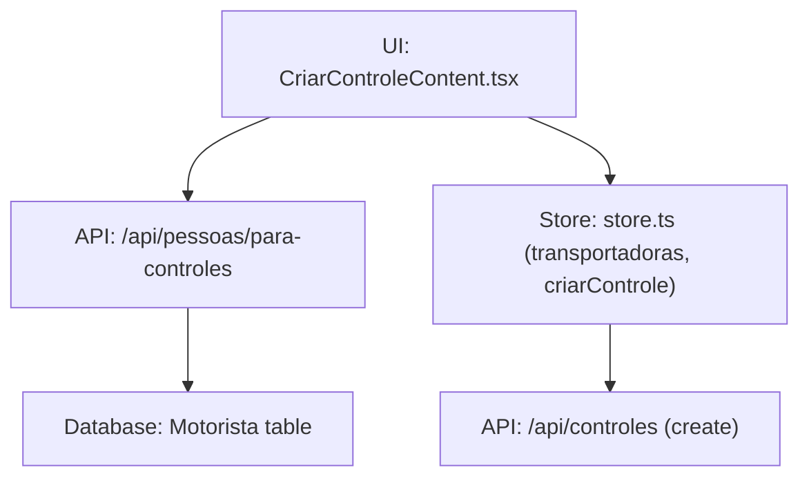
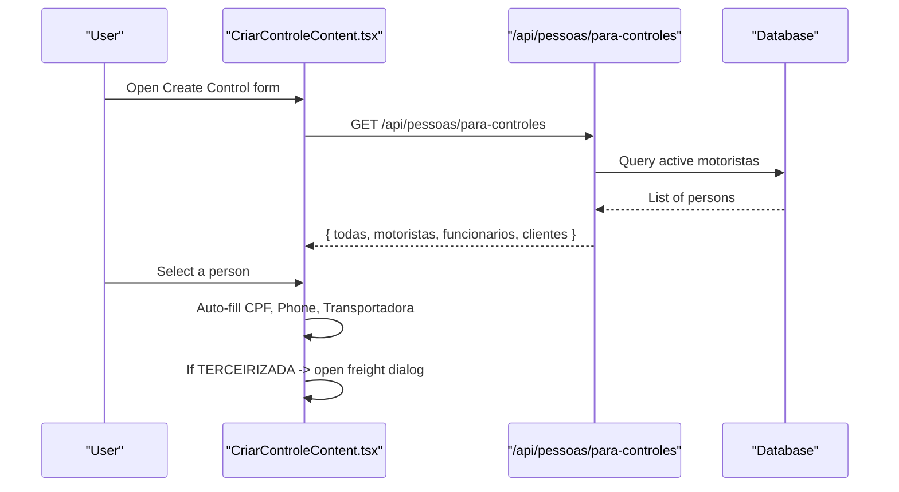
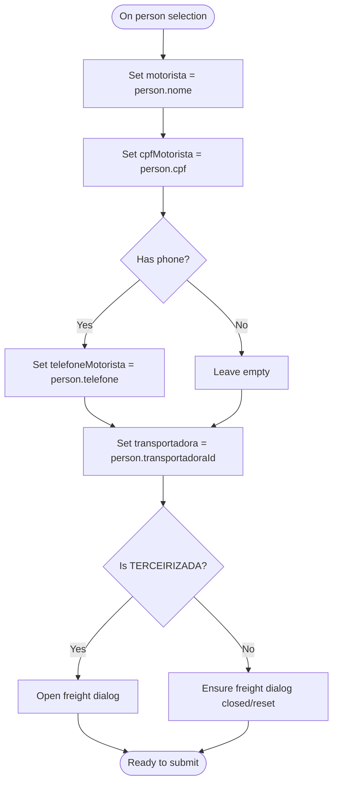
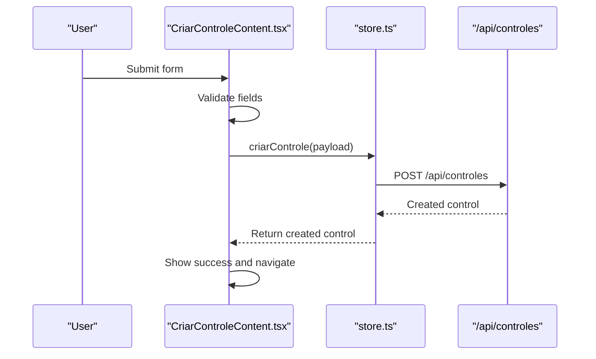
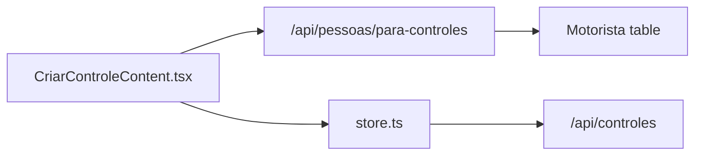

# Driver Selection and Person Management

<cite>
**Referenced Files in This Document**
- [CriarControleContent.tsx](file://components/CriarControleContent.tsx)
- [para-controles.ts](file://pages/api/pessoas/para-controles.ts)
- [store.ts](file://store/store.ts)
</cite>

## Table of Contents
1. [Introduction](#introduction)
2. [Project Structure](#project-structure)
3. [Core Components](#core-components)
4. [Architecture Overview](#architecture-overview)
5. [Detailed Component Analysis](#detailed-component-analysis)
6. [Dependency Analysis](#dependency-analysis)
7. [Performance Considerations](#performance-considerations)
8. [Troubleshooting Guide](#troubleshooting-guide)
9. [Conclusion](#conclusion)

## Introduction
This document explains how driver selection and person management work when creating a cargo control. It focuses on the Autocomplete component that lets users pick a person (driver, employee, or client), how filtering by type is implemented, and how selecting a person automatically fills CPF, phone, and transport company fields. It also describes the person data structure returned by the backend and provides examples of different person types and their associated transport companies.

## Project Structure
The functionality spans three main areas:
- UI: The “Create Control” form uses an Autocomplete to select a person and auto-fills related fields.
- API: A backend endpoint returns all persons (drivers, employees, clients) grouped by type for the dropdown.
- State: The store manages transporters and the creation flow, while the UI fetches persons directly from the API.

**Diagram sources**
- [CriarControleContent.tsx:221-244](file://components/CriarControleContent.tsx#L221-L244)
- [para-controles.ts:10-47](file://pages/api/pessoas/para-controles.ts#L10-L47)
- [store.ts:170-195](file://store/store.ts#L170-L195)
- [store.ts:269-397](file://store/store.ts#L269-L397)

**Section sources**
- [CriarControleContent.tsx:221-244](file://components/CriarControleContent.tsx#L221-L244)
- [para-controles.ts:10-47](file://pages/api/pessoas/para-controles.ts#L10-L47)
- [store.ts:170-195](file://store/store.ts#L170-L195)

## Core Components
- Person selection Autocomplete:
  - Loads all persons via the API.
  - Groups options by type: MOTORISTA, FUNCIONARIO, CLIENTE.
  - On selection, sets motorista name, cpfMotorista, telefoneMotorista, and transportadora based on the selected person’s profile.
  - If the selected person belongs to TERCEIRIZADA, opens a freight dialog to capture freight value.

- Backend person list:
  - Returns motoristas with active flag true.
  - Maps each record into a unified Pessoa shape including id, nome, cpf, telefone, cnh, transportadoraId, tipo, tipoLabel, displayName, and a minimal transportadora object.
  - Also returns typed arrays for motoristas, funcionarios, clientes.

- Form state and submission:
  - The form stores motorista, cpfMotorista, telefoneMotorista, transportadora, responsavel, and other fields.
  - On submit, it validates required fields and sends the payload to create a cargo control.

**Section sources**
- [CriarControleContent.tsx:531-651](file://components/CriarControleContent.tsx#L531-L651)
- [para-controles.ts:10-47](file://pages/api/pessoas/para-controles.ts#L10-L47)
- [CriarControleContent.tsx:286-412](file://components/CriarControleContent.tsx#L286-L412)

## Architecture Overview
The user selects a person from the Autocomplete. The UI maps the selection to form fields and may trigger additional steps (e.g., freight dialog). The backend supplies a normalized person dataset that includes the transport company linked to each person.

**Diagram sources**
- [CriarControleContent.tsx:221-244](file://components/CriarControleContent.tsx#L221-L244)
- [para-controles.ts:10-47](file://pages/api/pessoas/para-controles.ts#L10-L47)
- [CriarControleContent.tsx:539-571](file://components/CriarControleContent.tsx#L539-L571)

## Detailed Component Analysis

### Person Data Model
The UI expects a consistent Pessoa shape used by the Autocomplete and form logic:
- id: string
- nome: string
- cpf: string
- telefone: string
- cnh?: string | null
- transportadoraId: string
- tipo: 'MOTORISTA' | 'FUNCIONARIO' | 'CLIENTE'
- tipoLabel: string
- displayName: string
- transportadora?: { id: string; descricao: string }

The backend returns this shape by mapping database records and adding friendly labels and a minimal transportadora object.

**Section sources**
- [CriarControleContent.tsx:70-84](file://components/CriarControleContent.tsx#L70-L84)
- [para-controles.ts:20-40](file://pages/api/pessoas/para-controles.ts#L20-L40)

### Autocomplete Behavior and Filtering
- Options source: The entire list of persons is loaded once at mount.
- Grouping: Options are grouped by type using groupBy:
  - MOTORISTA → “Drivers”
  - FUNCIONARIO → “Employees”
  - CLIENTE → “Clients”
- Display: Each option shows name, type chip, CPF, phone, and the mapped transport company name.
- Search: MUI Autocomplete supports freeSolo and built-in text search across displayed labels.

**Section sources**
- [CriarControleContent.tsx:531-651](file://components/CriarControleContent.tsx#L531-L651)

### Automatic Field Population on Selection
When a person is selected:
- motorista is set to the person’s name.
- cpfMotorista is set to the person’s CPF.
- telefoneMotorista is set to the person’s phone if present.
- transportadora is set to the person’s transportadoraId.
- If transportadora equals TERCEIRIZADA, the freight dialog opens so the user can provide a freight value.

**Diagram sources**
- [CriarControleContent.tsx:539-571](file://components/CriarControleContent.tsx#L539-L571)

**Section sources**
- [CriarControleContent.tsx:539-571](file://components/CriarControleContent.tsx#L539-L571)

### Transport Company Mapping and Examples
The UI maps internal transportadoraId values to readable names for display and selection. Examples include:
- ACERT → ACERT Transportes
- ACCERT → ACCERT Transportes
- EXPRESSO_GOIAS → Expresso Goiás
- TERCEIRIZADA → Terceirizada
- DETAFRA_TRANSPORTES → Detafra Transportes
- RETIRA_VENDEDOR → Retira Vendedor
- RETIRA_CLIENTE → Retira Cliente
- VLOG → VLOG Transportes
- ZANUELO_TRANSPORTE_LOGISTICA → Zanuelo Transporte e Logistica

These mappings are used both in the Autocomplete option rendering and in the transport company dropdown.

**Section sources**
- [CriarControleContent.tsx:580-590](file://components/CriarControleContent.tsx#L580-L590)
- [CriarControleContent.tsx:696-722](file://components/CriarControleContent.tsx#L696-L722)

### Backend Person Endpoint
The endpoint queries active motoristas and returns:
- todas: full list
- motoristas: filtered by type MOTORISTA
- funcionarios: filtered by type FUNCIONARIO
- clientes: filtered by type CLIENTE

Each person includes id, nome, cpf, telefone, cnh, transportadoraId, tipo, tipoLabel, displayName, and a minimal transportadora object.

**Section sources**
- [para-controles.ts:10-47](file://pages/api/pessoas/para-controles.ts#L10-L47)

### Form Submission Flow
After selecting a person and filling required fields:
- Validation ensures required fields are present and valid.
- For TERCEIRIZADA with freight informed, validates freight value.
- Submits to create a cargo control via the store’s criarControle function.

**Diagram sources**
- [CriarControleContent.tsx:286-412](file://components/CriarControleContent.tsx#L286-L412)
- [store.ts:269-397](file://store/store.ts#L269-L397)

**Section sources**
- [CriarControleContent.tsx:286-412](file://components/CriarControleContent.tsx#L286-L412)
- [store.ts:269-397](file://store/store.ts#L269-L397)

## Dependency Analysis
- UI depends on:
  - Autocomplete from Material UI for person selection.
  - Local state for form fields and loading flags.
  - API call to /api/pessoas/para-controles for person data.
  - Store functions for transportadoras and creating controls.

- API depends on:
  - Prisma client to query motoristas and map to Pessoa shape.
  - Database constraints (ativo flag) to filter active persons.

- Store depends on:
  - API endpoints for transportadoras and control creation.
  - Optional note linking after control creation.

**Diagram sources**
- [CriarControleContent.tsx:221-244](file://components/CriarControleContent.tsx#L221-L244)
- [para-controles.ts:10-47](file://pages/api/pessoas/para-controles.ts#L10-L47)
- [store.ts:170-195](file://store/store.ts#L170-L195)
- [store.ts:269-397](file://store/store.ts#L269-L397)

**Section sources**
- [CriarControleContent.tsx:221-244](file://components/CriarControleContent.tsx#L221-L244)
- [para-controles.ts:10-47](file://pages/api/pessoas/para-controles.ts#L10-L47)
- [store.ts:170-195](file://store/store.ts#L170-L195)
- [store.ts:269-397](file://store/store.ts#L269-L397)

## Performance Considerations
- Single load of persons: All persons are fetched once on mount and cached in local state, reducing repeated network calls.
- Lightweight person objects: The backend returns only necessary fields and a minimal transportadora object to keep payloads small.
- Grouped Autocomplete: Grouping improves usability without extra requests.
- Debouncing/search: MUI Autocomplete handles client-side filtering efficiently for typical lists.

[No sources needed since this section provides general guidance]

## Troubleshooting Guide
- No persons appear in Autocomplete:
  - Ensure the API returns data and the UI receives it.
  - Verify motoristas have ativo set to true.

- Selected person does not fill CPF or phone:
  - Confirm the person record contains cpf and/or telefone.
  - Check the onChange handler sets these fields on selection.

- Wrong transport company assigned:
  - Verify the person’s transportadoraId matches the intended company.
  - Confirm the mapping in the UI displays the correct label.

- Freight dialog not opening for TERCEIRIZADA:
  - Ensure the selected person’s transportadoraId equals TERCEIRIZADA.
  - Check that the onChange handler triggers the dialog when applicable.

**Section sources**
- [para-controles.ts:10-47](file://pages/api/pessoas/para-controles.ts#L10-L47)
- [CriarControleContent.tsx:539-571](file://components/CriarControleContent.tsx#L539-L571)

## Conclusion
The driver selection and person management flow integrates a robust Autocomplete with a clean backend API to deliver a smooth experience. Selecting a person automatically populates key fields and assigns the correct transport company, with special handling for third-party logistics. The design balances simplicity, performance, and clarity for users creating cargo controls.