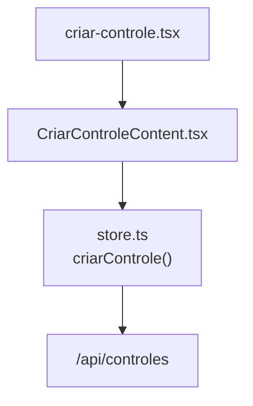
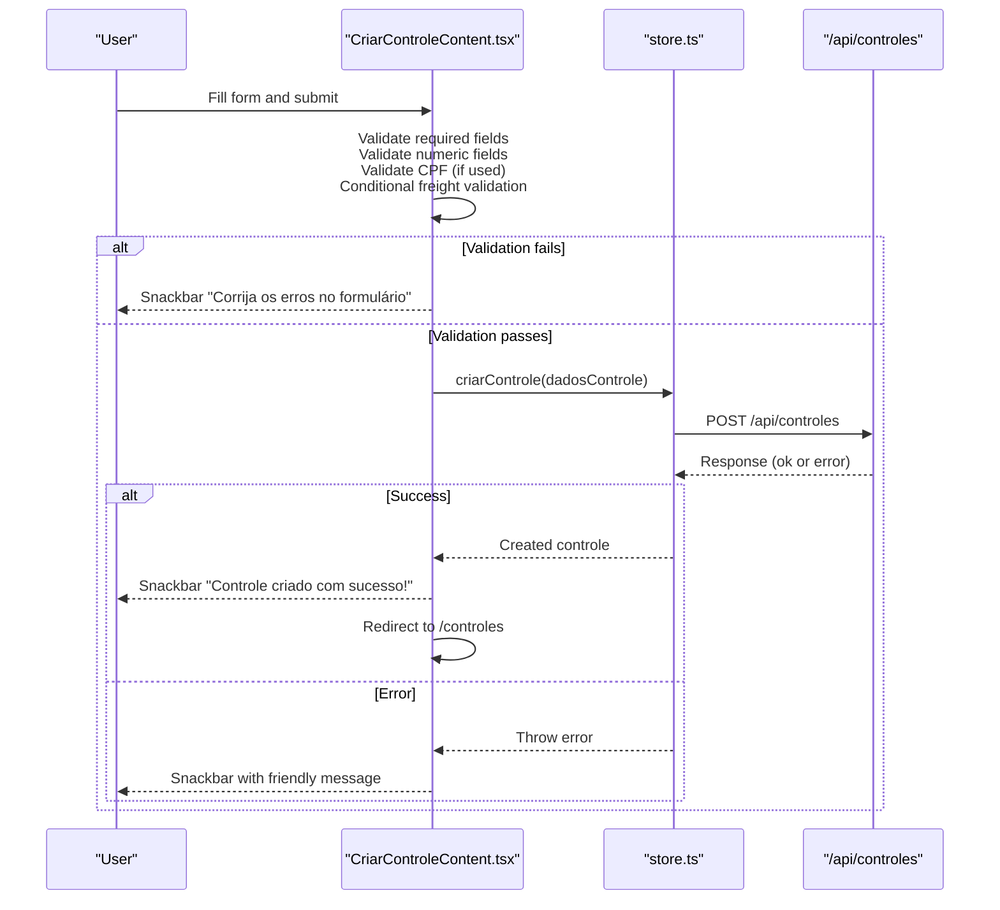
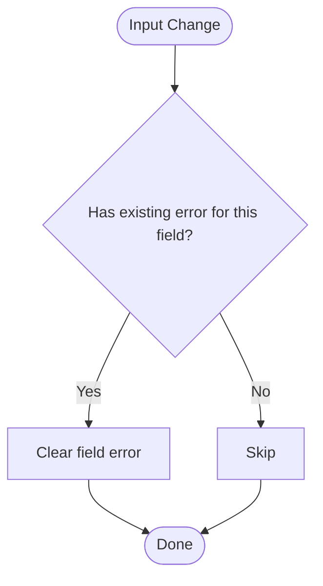
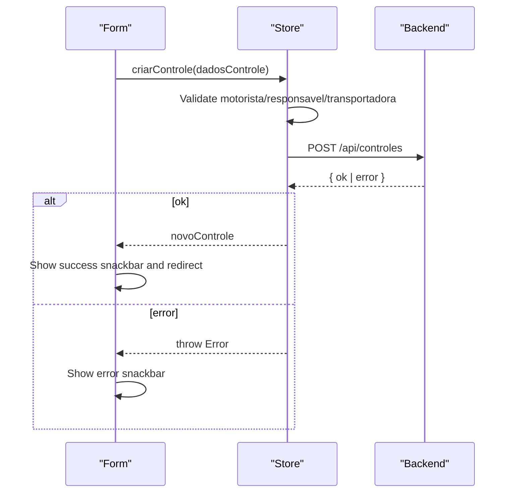
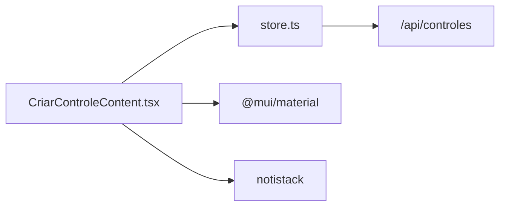

# Form Validation and Error Handling

<cite>
**Referenced Files in This Document**
- [CriarControleContent.tsx](file://components/CriarControleContent.tsx)
- [criar-controle.tsx](file://pages/criar-controle.tsx)
- [store.ts](file://store/store.ts)
</cite>

## Table of Contents
1. [Introduction](#introduction)
2. [Project Structure](#project-structure)
3. [Core Components](#core-components)
4. [Architecture Overview](#architecture-overview)
5. [Detailed Component Analysis](#detailed-component-analysis)
6. [Dependency Analysis](#dependency-analysis)
7. [Performance Considerations](#performance-considerations)
8. [Troubleshooting Guide](#troubleshooting-guide)
9. [Conclusion](#conclusion)

## Introduction
This document explains the comprehensive form validation system for creating a cargo control. It covers required fields, numeric field validation, CPF validation using the local validarCPF function, conditional freight cost validation, error state management, real-time error clearing, and user feedback via snackbar notifications. It also provides examples of validation scenarios and how errors are surfaced to users.

## Project Structure
The cargo control creation flow is implemented as a Next.js page that dynamically loads a React component responsible for rendering the form and handling validation:
- Page wrapper: handles authentication and layout
- Form component: holds form state, validation logic, UI, and submission flow
- Store: performs additional server-side validations and API calls

**Diagram sources**
- [criar-controle.tsx:9-12](file://pages/criar-controle.tsx#L9-L12)
- [CriarControleContent.tsx:124-142](file://components/CriarControleContent.tsx#L124-L142)
- [store.ts:269-314](file://store/store.ts#L269-L314)

**Section sources**
- [criar-controle.tsx:14-55](file://pages/criar-controle.tsx#L14-L55)
- [CriarControleContent.tsx:124-142](file://components/CriarControleContent.tsx#L124-L142)
- [store.ts:269-314](file://store/store.ts#L269-L314)

## Core Components
- CriarControleContent.tsx: Implements the form UI, local validation rules, real-time error clearing, and submission orchestration.
- store.ts: Provides criarControle which enforces additional business rules before calling the backend API.

Key responsibilities:
- Required fields: motorista, responsavel, transportadora, placaVeiculo
- Numeric fields: qtdPalletsLevados, qtdPalletsDevolvidos (must be non-negative)
- CPF validation: validarCPF function validates driver CPF format and checksum
- Conditional freight: when transportadora is TERCEIRIZADA and freteInformado is true, valorFrete must be a positive number
- Error state: centralized in an errors object; cleared on input changes
- User feedback: notistack snackbar messages for success and errors

**Section sources**
- [CriarControleContent.tsx:86-112](file://components/CriarControleContent.tsx#L86-L112)
- [CriarControleContent.tsx:173-195](file://components/CriarControleContent.tsx#L173-L195)
- [CriarControleContent.tsx:246-284](file://components/CriarControleContent.tsx#L246-L284)
- [CriarControleContent.tsx:286-333](file://components/CriarControleContent.tsx#L286-L333)
- [store.ts:269-286](file://store/store.ts#L269-L286)

## Architecture Overview
The validation and submission flow combines client-side checks with server-side enforcement:

**Diagram sources**
- [CriarControleContent.tsx:286-412](file://components/CriarControleContent.tsx#L286-L412)
- [store.ts:269-396](file://store/store.ts#L269-L396)

## Detailed Component Analysis

### Required Fields Validation
- motorista: Must be present and trimmed
- responsavel: Must be present and trimmed
- transportadora: Must be selected from allowed values
- placaVeiculo: Must be present and trimmed

These checks occur during form submission and populate the errors object with specific messages.

**Section sources**
- [CriarControleContent.tsx:296-316](file://components/CriarControleContent.tsx#L296-L316)
- [store.ts:273-286](file://store/store.ts#L273-L286)

### Numeric Field Validation
- qtdPalletsLevados: Must be non-negative
- qtdPalletsDevolvidos: Must be non-negative

Errors are set if either value is negative. The inputs are bound to numeric state and updated on change.

**Section sources**
- [CriarControleContent.tsx:246-255](file://components/CriarControleContent.tsx#L246-L255)
- [CriarControleContent.tsx:308-313](file://components/CriarControleContent.tsx#L308-L313)

### CPF Validation
- The validarCPF function validates CPF by:
  - Stripping non-digits
  - Ensuring length is 11
  - Rejecting repeated digits
  - Computing check digits and comparing them to the last two digits

Note: While the form includes a CPF field for the driver, the current submission path does not explicitly call validarCPF on submit. The function is available for reuse if needed.

**Section sources**
- [CriarControleContent.tsx:86-112](file://components/CriarControleContent.tsx#L86-L112)

### Conditional Freight Cost Validation
When transportadora equals TERCEIRIZADA and freteInformado is true:
- valorFrete must be provided and parseable to a positive number
- If invalid, an error is set for valorFrete

A dialog prompts whether to inform freight when TERCEIRIZADA is selected.

**Section sources**
- [CriarControleContent.tsx:256-269](file://components/CriarControleContent.tsx#L256-L269)
- [CriarControleContent.tsx:318-323](file://components/CriarControleContent.tsx#L318-L323)
- [CriarControleContent.tsx:727-779](file://components/CriarControleContent.tsx#L727-L779)
- [CriarControleContent.tsx:1033-1051](file://components/CriarControleContent.tsx#L1033-L1051)

### Error State Management and Real-Time Clearing
- Errors are stored in a single errors object keyed by field name
- On any input change, if there was a previous error for that field, it is cleared immediately
- On submit failure, all relevant errors are populated at once

**Diagram sources**
- [CriarControleContent.tsx:277-284](file://components/CriarControleContent.tsx#L277-L284)

**Section sources**
- [CriarControleContent.tsx:277-284](file://components/CriarControleContent.tsx#L277-L284)

### User Feedback via Snackbar Notifications
- Validation failures: show a snackbar prompting to fix errors
- Successful creation: show a success snackbar and redirect after a delay
- Network/server errors: show a friendly error snackbar based on error messages

**Section sources**
- [CriarControleContent.tsx:325-333](file://components/CriarControleContent.tsx#L325-L333)
- [CriarControleContent.tsx:373-382](file://components/CriarControleContent.tsx#L373-L382)
- [CriarControleContent.tsx:384-406](file://components/CriarControleContent.tsx#L384-L406)

### Submission Flow and Server-Side Validation
- The form builds dadosControle with sanitized values and sends it to the store’s criarControle
- The store validates required fields and transportadora enum, then posts to /api/controles
- After successful creation, notes can be linked and the controls list refreshed

**Diagram sources**
- [CriarControleContent.tsx:339-369](file://components/CriarControleContent.tsx#L339-L369)
- [store.ts:269-337](file://store/store.ts#L269-L337)

**Section sources**
- [CriarControleContent.tsx:339-369](file://components/CriarControleContent.tsx#L339-L369)
- [store.ts:269-337](file://store/store.ts#L269-L337)

## Dependency Analysis
- CriarControleContent depends on:
  - MUI components for form fields and feedback
  - notistack for snackbar notifications
  - zustand store for data operations
  - Next.js router for navigation
- store.ts depends on:
  - fetch to call /api/controles and related endpoints
  - Centralized error handling and response parsing

**Diagram sources**
- [CriarControleContent.tsx:1-49](file://components/CriarControleContent.tsx#L1-L49)
- [store.ts:269-314](file://store/store.ts#L269-L314)

**Section sources**
- [CriarControleContent.tsx:1-49](file://components/CriarControleContent.tsx#L1-L49)
- [store.ts:269-314](file://store/store.ts#L269-L314)

## Performance Considerations
- Client-side validation runs synchronously on submit and per-input change, avoiding unnecessary network calls
- Numeric inputs are parsed to numbers early to prevent type-related issues
- Conditional freight dialog reduces redundant validation until the user opts to provide freight
- Debouncing or throttling could be considered if adding more expensive validations

[No sources needed since this section provides general guidance]

## Troubleshooting Guide
Common issues and resolutions:
- Missing required fields: Ensure motorista, responsavel, transportadora, and placaVeiculo are filled
- Negative pallet counts: Adjust qtdPalletsLevados and qtdPalletsDevolvidos to zero or above
- Invalid freight amount: When TERCEIRIZADA and freteInformado is true, enter a positive numeric value
- CPF issues: Use the validarCPF function to validate CPF format and checksum if you choose to enforce it on submit
- Network errors: Friendly error messages are shown; check session/auth if “session expired” appears

**Section sources**
- [CriarControleContent.tsx:296-323](file://components/CriarControleContent.tsx#L296-L323)
- [CriarControleContent.tsx:384-406](file://components/CriarControleContent.tsx#L384-L406)
- [store.ts:273-286](file://store/store.ts#L273-L286)

## Conclusion
The cargo control creation form implements robust client-side validation for required fields, numeric constraints, and conditional freight costs, complemented by server-side checks in the store. Errors are managed centrally and cleared in real time as users edit fields. Users receive immediate feedback through snackbar notifications, and successful submissions trigger redirection to the controls list.

[No sources needed since this section summarizes without analyzing specific files]