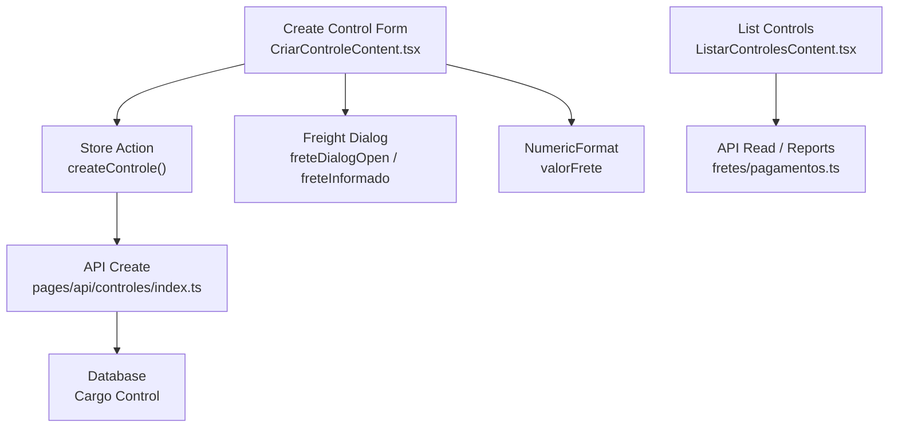
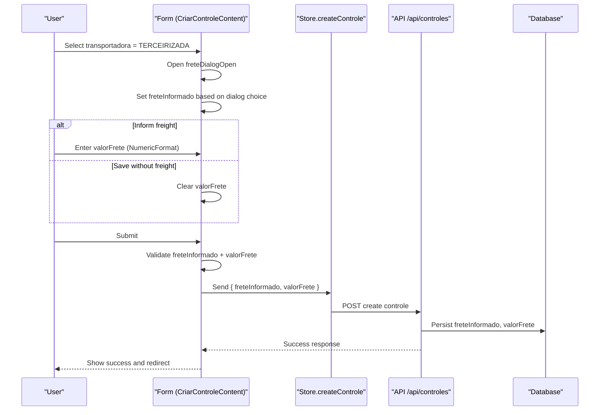
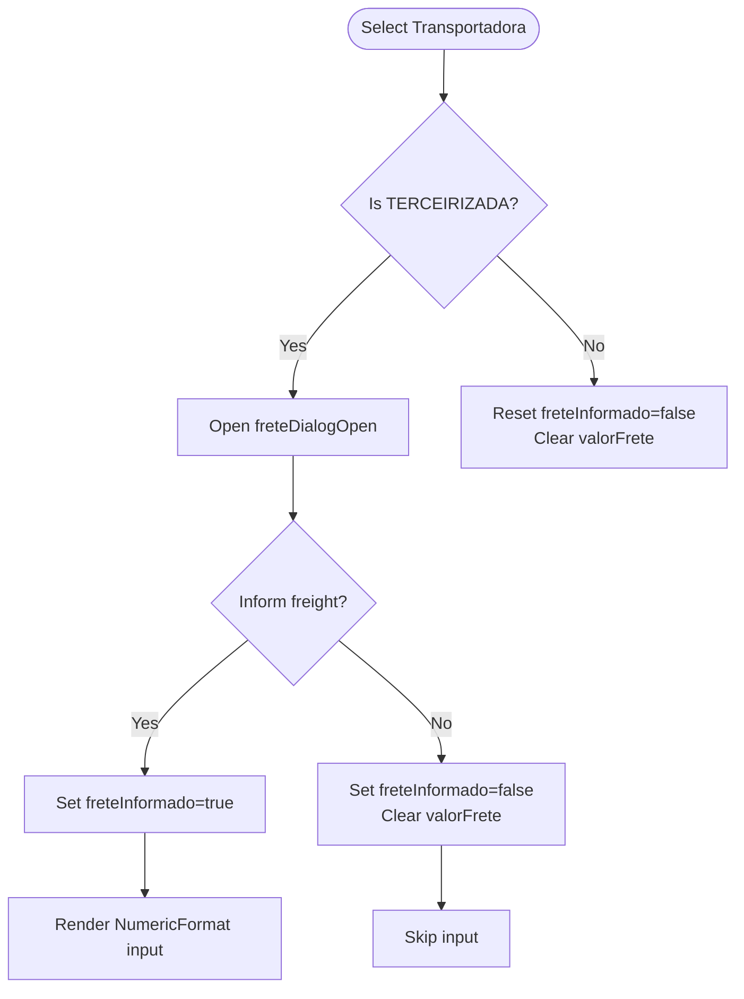
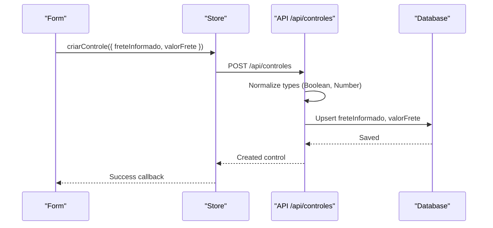
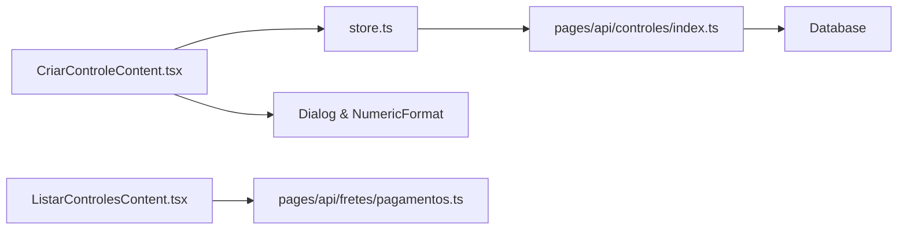

# Freight Cost Handling for Third-Party Transports

<cite>
**Referenced Files in This Document**
- [CriarControleContent.tsx](file://components/CriarControleContent.tsx)
- [store.ts](file://store/store.ts)
- [controles/index.ts](file://pages/api/controles/index.ts)
- [controles/[id].ts](file://pages/api/controles/[id].ts)
- [fretes/pagamentos.ts](file://pages/api/fretes/pagamentos.ts)
- [ListarControlesContent.tsx](file://components/ListarControlesContent.tsx)
</cite>

## Table of Contents
1. [Introduction](#introduction)
2. [Project Structure](#project-structure)
3. [Core Components](#core-components)
4. [Architecture Overview](#architecture-overview)
5. [Detailed Component Analysis](#detailed-component-analysis)
6. [Dependency Analysis](#dependency-analysis)
7. [Performance Considerations](#performance-considerations)
8. [Troubleshooting Guide](#troubleshooting-guide)
9. [Conclusion](#conclusion)

## Introduction
This document explains how freight cost handling works specifically for third-party transports (TERCEIRIZADA). It covers the conditional dialog that appears when TERCEIRIZADA is selected, currency input formatting with NumericFormat, validation rules for freight values, and how freight information is stored with the cargo control. It also documents state management for freteDialogOpen, freteInformado, and valorFrete, including examples of formatting and error handling scenarios.

## Project Structure
The freight flow spans UI components, store actions, and API endpoints:
- UI: Conditional dialog and numeric input are implemented in the create control form component.
- Store: The create action serializes freight fields into the payload sent to the backend.
- API: Endpoints accept and persist freteInformado and valorFrete on the cargo control.
- Display: Lists render freight values when available.

**Diagram sources**
- [CriarControleContent.tsx:196-198](file://components/CriarControleContent.tsx#L196-L198)
- [CriarControleContent.tsx:256-269](file://components/CriarControleContent.tsx#L256-L269)
- [CriarControleContent.tsx:318-357](file://components/CriarControleContent.tsx#L318-L357)
- [CriarControleContent.tsx:744-779](file://components/CriarControleContent.tsx#L744-L779)
- [CriarControleContent.tsx:1033-1051](file://components/CriarControleContent.tsx#L1033-L1051)
- [store.ts:30-49](file://store/store.ts#L30-L49)
- [store.ts:69-73](file://store/store.ts#L69-L73)
- [controles/index.ts:77-102](file://pages/api/controles/index.ts#L77-L102)
- [controles/[id].ts:42-67](file://pages/api/controles/[id].ts#L42-L67)
- [fretes/pagamentos.ts:34-89](file://pages/api/fretes/pagamentos.ts#L34-L89)
- [ListarControlesContent.tsx:1109-1114](file://components/ListarControlesContent.tsx#L1109-L1114)

**Section sources**
- [CriarControleContent.tsx:196-198](file://components/CriarControleContent.tsx#L196-L198)
- [store.ts:30-49](file://store/store.ts#L30-L49)
- [controles/index.ts:77-102](file://pages/api/controles/index.ts#L77-L102)

## Core Components
- Conditional dialog: When transportadora equals TERCEIRIZADA, a dialog opens asking whether to inform freight now or save without it.
- Currency input: NumericFormat renders a Brazilian currency field with thousand separator “.”, decimal separator “,”, two decimals, and no negative values.
- Validation: If freight is informed, the value must be present and parse to a positive number; otherwise an error is shown.
- Storage: On submit, freteInformado and valorFrete are included only when transportadora is TERCEIRIZADA and freight was informed.

Key behaviors:
- Selecting TERCEIRIZADA triggers the dialog immediately.
- Choosing “Inform freight” enables the NumericFormat input; choosing “Save without freight” clears any entered value.
- Submit validates and persists freight data accordingly.

**Section sources**
- [CriarControleContent.tsx:256-269](file://components/CriarControleContent.tsx#L256-L269)
- [CriarControleContent.tsx:318-357](file://components/CriarControleContent.tsx#L318-L357)
- [CriarControleContent.tsx:744-779](file://components/CriarControleContent.tsx#L744-L779)
- [CriarControleContent.tsx:1033-1051](file://components/CriarControleContent.tsx#L1033-L1051)

## Architecture Overview
The freight flow connects user interactions to persisted data through a clear sequence:

**Diagram sources**
- [CriarControleContent.tsx:256-269](file://components/CriarControleContent.tsx#L256-L269)
- [CriarControleContent.tsx:318-357](file://components/CriarControleContent.tsx#L318-L357)
- [controles/index.ts:77-102](file://pages/api/controles/index.ts#L77-L102)

## Detailed Component Analysis

### Conditional Dialog and State Management
- freteDialogOpen: Controls visibility of the freight dialog.
- freteInformado: Indicates whether freight will be saved with this control.
- valorFrete: Holds the formatted string from NumericFormat; parsed to a number before submission.

Behavior highlights:
- Selecting TERCEIRIZADA sets freteDialogOpen to true.
- responderFrete updates freteInformado and closes the dialog; if false, valorFrete is cleared.
- Changing transportadora away from TERCEIRIZADA resets frete states.

**Diagram sources**
- [CriarControleContent.tsx:256-269](file://components/CriarControleContent.tsx#L256-L269)
- [CriarControleContent.tsx:414-421](file://components/CriarControleContent.tsx#L414-L421)
- [CriarControleContent.tsx:1033-1051](file://components/CriarControleContent.tsx#L1033-L1051)

**Section sources**
- [CriarControleContent.tsx:196-198](file://components/CriarControleContent.tsx#L196-L198)
- [CriarControleContent.tsx:256-269](file://components/CriarControleContent.tsx#L256-L269)
- [CriarControleContent.tsx:414-421](file://components/CriarControleContent.tsx#L414-L421)
- [CriarControleContent.tsx:1033-1051](file://components/CriarControleContent.tsx#L1033-L1051)

### Currency Input Formatting with NumericFormat
- Format: Thousand separator “.”, decimal separator “,”, fixed two decimals, no negatives.
- Value binding: Controlled by valorFrete state; onValueChange updates both display and clears validation errors.
- Helper parsing: A local parser converts the formatted string to a numeric value for submission.

Examples of expected formatting:
- Input “150,00” displays as “R$ 150,00”.
- Input “1.234,56” displays as “R$ 1.234,56”.

Validation behavior:
- If freteInformado is true, submission requires a valid positive number; otherwise an error is set.

**Section sources**
- [CriarControleContent.tsx:114-122](file://components/CriarControleContent.tsx#L114-L122)
- [CriarControleContent.tsx:318-323](file://components/CriarControleContent.tsx#L318-L323)
- [CriarControleContent.tsx:744-779](file://components/CriarControleContent.tsx#L744-L779)

### Validation Rules for Freight Values
- Condition: Only enforced when transportadora is TERCEIRIZADA and freteInformado is true.
- Rules:
  - valorFrete must be present.
  - Must parse to a finite number.
  - Must be greater than zero.
- Error handling: Sets a specific error message and shows a snackbar; submission is aborted until corrected.

Submission payload:
- freteInformado: boolean indicating whether freight applies.
- valorFrete: numeric value when applicable; null otherwise.

**Section sources**
- [CriarControleContent.tsx:318-357](file://components/CriarControleContent.tsx#L318-L357)

### Data Flow to Storage
- Frontend: The form builds dadosControle including freteInformado and valorFrete based on conditions.
- Store: The create action sends the payload to the API.
- API: Accepts freteInformado and valorFrete, coerces types, and persists them to the cargo control record.
- Reading: Reports and lists use these fields to compute totals and display freight amounts.

**Diagram sources**
- [CriarControleContent.tsx:339-357](file://components/CriarControleContent.tsx#L339-L357)
- [controles/index.ts:77-102](file://pages/api/controles/index.ts#L77-L102)

**Section sources**
- [store.ts:30-49](file://store/store.ts#L30-L49)
- [store.ts:69-73](file://store/store.ts#L69-L73)
- [controles/index.ts:77-102](file://pages/api/controles/index.ts#L77-L102)
- [controles/[id].ts:42-67](file://pages/api/controles/[id].ts#L42-L67)

### Display and Reporting
- Lists show freight values when available using localized currency formatting.
- Payment/report endpoints aggregate freight totals and filter by freteInformado status.

**Section sources**
- [ListarControlesContent.tsx:1109-1114](file://components/ListarControlesContent.tsx#L1109-L1114)
- [fretes/pagamentos.ts:34-89](file://pages/api/fretes/pagamentos.ts#L34-L89)

## Dependency Analysis
- CriarControleContent depends on:
  - MUI components for dialog, alert, and numeric input.
  - react-number-format NumericFormat for currency formatting.
  - Zustand store for creating controls and loading transportadoras/notas.
- Store depends on:
  - API service for network calls.
  - Types for ControleCarga including freteInformado and valorFrete.
- API endpoints depend on:
  - Database schema to persist freteInformado and valorFrete.
  - Report/payment endpoints to read and aggregate freight data.

**Diagram sources**
- [CriarControleContent.tsx:196-198](file://components/CriarControleContent.tsx#L196-L198)
- [store.ts:30-49](file://store/store.ts#L30-L49)
- [controles/index.ts:77-102](file://pages/api/controles/index.ts#L77-L102)
- [fretes/pagamentos.ts:34-89](file://pages/api/fretes/pagamentos.ts#L34-L89)
- [ListarControlesContent.tsx:1109-1114](file://components/ListarControlesContent.tsx#L1109-L1114)

**Section sources**
- [store.ts:30-49](file://store/store.ts#L30-L49)
- [controles/index.ts:77-102](file://pages/api/controles/index.ts#L77-L102)
- [fretes/pagamentos.ts:34-89](file://pages/api/fretes/pagamentos.ts#L34-L89)

## Performance Considerations
- Avoid unnecessary re-renders by keeping freteDialogOpen, freteInformado, and valorFrete tightly scoped to the form.
- Debounce or limit expensive operations around freight calculations in reports if datasets grow large.
- Ensure NumericFormat does not trigger excessive validations; rely on controlled value changes.

[No sources needed since this section provides general guidance]

## Troubleshooting Guide
Common issues and resolutions:
- Dialog does not open when selecting TERCEIRIZADA:
  - Verify transportadora change handler sets freteDialogOpen to true.
  - Confirm the Autocomplete or Select triggers handleChange correctly.
- Freight value validation fails unexpectedly:
  - Ensure valorFrete is non-empty and parses to a positive number.
  - Check helper parser strips non-numeric characters and handles locale separators.
- Freight not saved:
  - Confirm freteInformado is true when submitting.
  - Verify API endpoint receives and persists freteInformado and valorFrete.
- Display shows incorrect currency format:
  - Use localized formatter when rendering values in lists/reports.

Error handling patterns:
- Form-level errors are collected and displayed via snackbar notifications.
- Submission aborts when validation errors exist; ensure errors are cleared on user input.

**Section sources**
- [CriarControleContent.tsx:256-269](file://components/CriarControleContent.tsx#L256-L269)
- [CriarControleContent.tsx:318-333](file://components/CriarControleContent.tsx#L318-L333)
- [controles/index.ts:77-102](file://pages/api/controles/index.ts#L77-L102)
- [ListarControlesContent.tsx:1109-1114](file://components/ListarControlesContent.tsx#L1109-L1114)

## Conclusion
Freight handling for TERCEIRIZADA is centered around a conditional dialog, robust currency input formatting, strict validation, and clear persistence of freteInformado and valorFrete with the cargo control. The flow ensures users can choose whether to capture freight at creation time, enforces data quality, and makes freight information available for reporting and payment workflows.

[No sources needed since this section summarizes without analyzing specific files]