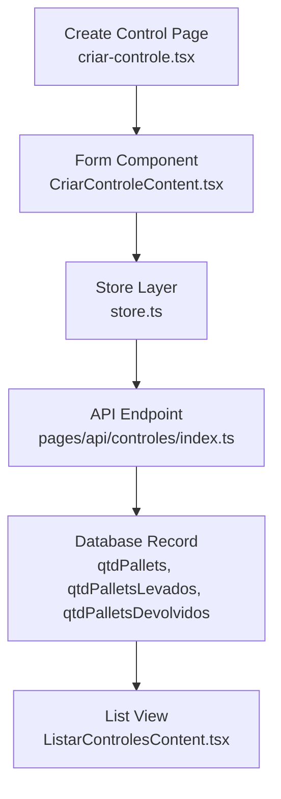
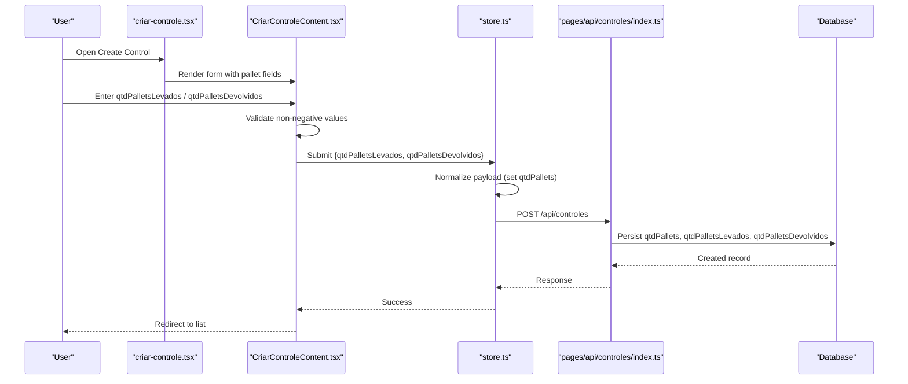
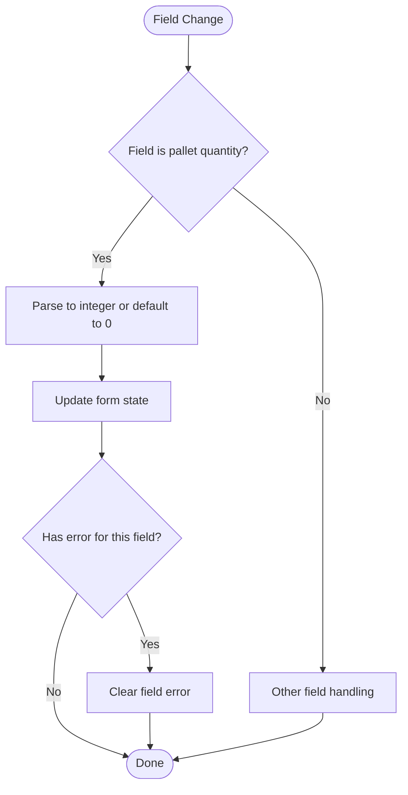
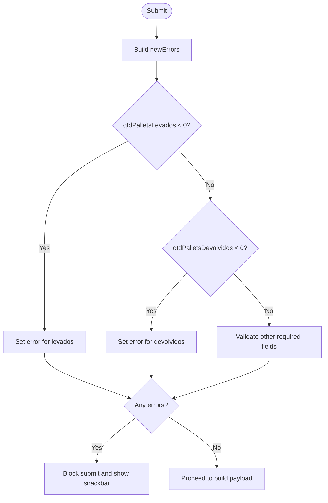
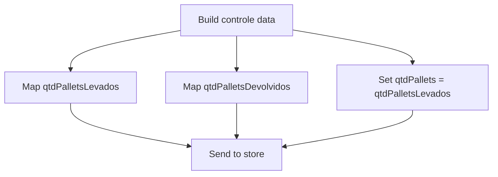
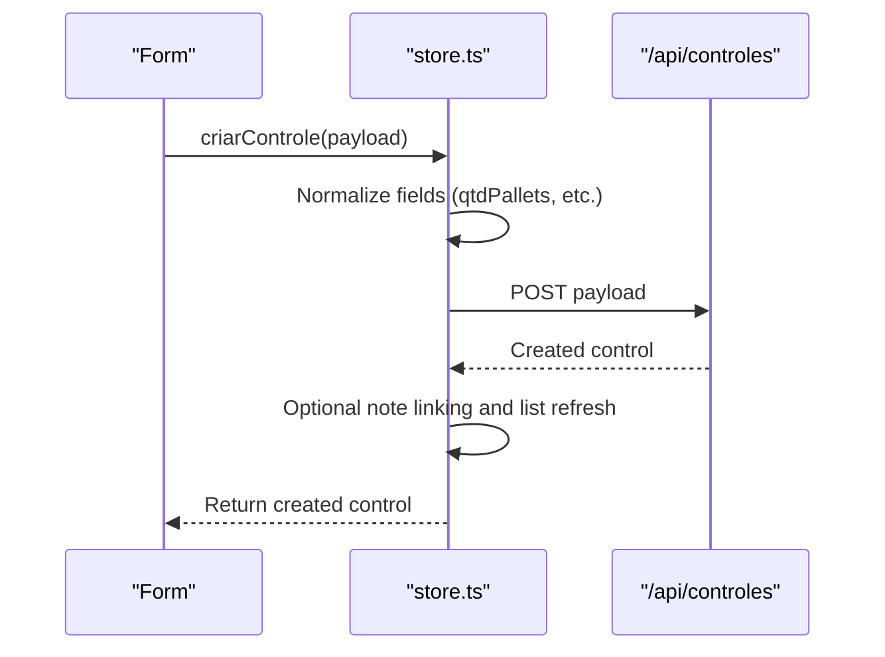
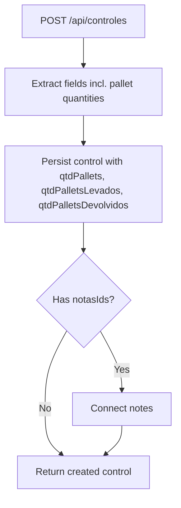
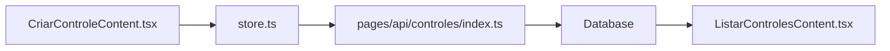

# Pallet Quantity Management

<cite>
**Referenced Files in This Document**
- [CriarControleContent.tsx](file://components/CriarControleContent.tsx)
- [criar-controle.tsx](file://pages/criar-controle.tsx)
- [store.ts](file://store/store.ts)
- [index.ts](file://pages/api/controles/index.ts)
- [ListarControlesContent.tsx](file://components/ListarControlesContent.tsx)
</cite>

## Table of Contents
1. [Introduction](#introduction)
2. [Project Structure](#project-structure)
3. [Core Components](#core-components)
4. [Architecture Overview](#architecture-overview)
5. [Detailed Component Analysis](#detailed-component-analysis)
6. [Dependency Analysis](#dependency-analysis)
7. [Performance Considerations](#performance-considerations)
8. [Troubleshooting Guide](#troubleshooting-guide)
9. [Conclusion](#conclusion)

## Introduction
This document explains pallet quantity management during cargo control creation, focusing on two key fields:
- qtdPalletsLevados (pallets taken)
- qtdPalletsDevolvidos (pallets returned)

It covers validation rules that prevent negative values, how these quantities are persisted, and how they relate to the total pallet count used for reporting and downstream processing. It also clarifies the business logic for net pallet movement as derived from these fields.

## Project Structure
The pallet quantity flow spans UI input, client-side validation, store normalization, and API persistence:
- The Create Control page renders numeric inputs for pallets taken and returned.
- The form validates non-negative values before submission.
- The store normalizes payload and posts to the backend.
- The API endpoint persists both detailed pallet fields and a total pallet count.
- The list view reads and displays these fields for existing controls.

**Diagram sources**
- [criar-controle.tsx:1-62](file://pages/criar-controle.tsx#L1-L62)
- [CriarControleContent.tsx:170-360](file://components/CriarControleContent.tsx#L170-L360)
- [store.ts:269-397](file://store/store.ts#L269-L397)
- [index.ts:64-116](file://pages/api/controles/index.ts#L64-L116)
- [ListarControlesContent.tsx:615-635](file://components/ListarControlesContent.tsx#L615-L635)

**Section sources**
- [criar-controle.tsx:1-62](file://pages/criar-controle.tsx#L1-L62)
- [CriarControleContent.tsx:170-360](file://components/CriarControleContent.tsx#L170-L360)
- [store.ts:269-397](file://store/store.ts#L269-L397)
- [index.ts:64-116](file://pages/api/controles/index.ts#L64-L116)
- [ListarControlesContent.tsx:615-635](file://components/ListarControlesContent.tsx#L615-L635)

## Core Components
- Form inputs and state:
  - Two numeric fields capture pallets taken and returned.
  - Input handling coerces values to integers and clears errors when editing begins.
- Validation:
  - Prevents negative values for both fields at submit time.
- Payload mapping:
  - Maps form fields to qtdPalletsLevados, qtdPalletsDevolvidos, and sets qtdPallets based on pallets taken.
- Persistence:
  - API endpoint stores all three fields into the database record.
- Display:
  - List view safely reads optional fields and includes them in PDF generation context.

**Section sources**
- [CriarControleContent.tsx:170-360](file://components/CriarControleContent.tsx#L170-L360)
- [CriarControleContent.tsx:820-860](file://components/CriarControleContent.tsx#L820-L860)
- [store.ts:269-397](file://store/store.ts#L269-L397)
- [index.ts:64-116](file://pages/api/controles/index.ts#L64-L116)
- [ListarControlesContent.tsx:615-635](file://components/ListarControlesContent.tsx#L615-L635)

## Architecture Overview
End-to-end flow for creating a cargo control with pallet quantities:

**Diagram sources**
- [criar-controle.tsx:1-62](file://pages/criar-controle.tsx#L1-L62)
- [CriarControleContent.tsx:286-360](file://components/CriarControleContent.tsx#L286-L360)
- [store.ts:269-397](file://store/store.ts#L269-L397)
- [index.ts:64-116](file://pages/api/controles/index.ts#L64-L116)

## Detailed Component Analysis

### Form Inputs and State Handling
- Numeric fields:
  - qtdPalletsLevados: number of pallets taken by the vehicle.
  - qtdPalletsDevolvidos: number of pallets returned.
- Input coercion:
  - Values are parsed to integers; invalid input defaults to zero.
- Error clearing:
  - Errors are cleared when the user starts typing in either field.

**Diagram sources**
- [CriarControleContent.tsx:246-284](file://components/CriarControleContent.tsx#L246-L284)

**Section sources**
- [CriarControleContent.tsx:246-284](file://components/CriarControleContent.tsx#L246-L284)
- [CriarControleContent.tsx:820-860](file://components/CriarControleContent.tsx#L820-L860)

### Validation Rules
- Negative value prevention:
  - Both qtdPalletsLevados and qtdPalletsDevolvidos must be greater than or equal to zero.
  - If negative, corresponding error messages are set and submission is blocked.
- Additional validations:
  - Required fields such as transportadora, motorista, responsavel, and placaVeiculo are validated alongside pallet fields.

**Diagram sources**
- [CriarControleContent.tsx:286-333](file://components/CriarControleContent.tsx#L286-L333)

**Section sources**
- [CriarControleContent.tsx:286-333](file://components/CriarControleContent.tsx#L286-L333)

### Payload Mapping and Total Pallet Count
- Field mapping:
  - qtdPalletsLevados maps directly to the database field.
  - qtdPalletsDevolvidos maps directly to the database field.
  - qtdPallets is set from qtdPalletsLevados as the total pallet count for this control.
- Rationale:
  - Using pallets taken as the baseline total aligns with outbound shipment accounting. Returned pallets are tracked separately for reconciliation.

**Diagram sources**
- [CriarControleContent.tsx:338-357](file://components/CriarControleContent.tsx#L338-L357)

**Section sources**
- [CriarControleContent.tsx:338-357](file://components/CriarControleContent.tsx#L338-L357)

### Store Normalization and API Submission
- Normalization:
  - Ensures qtdPallets is a number and trims text fields.
- Submission:
  - Posts to /api/controles with full payload including pallet fields.
- Post-create behavior:
  - Optionally links selected notes and refreshes the local controls list.

**Diagram sources**
- [store.ts:269-397](file://store/store.ts#L269-L397)

**Section sources**
- [store.ts:269-397](file://store/store.ts#L269-L397)

### API Persistence and Database Fields
- Accepted fields:
  - qtdPalletsLevados, qtdPalletsDevolvidos, and qtdPallets are explicitly handled.
- Persistence:
  - All three fields are stored in the control record.
- Notes linkage:
  - Related notes can be connected via notasIds.

**Diagram sources**
- [index.ts:64-116](file://pages/api/controles/index.ts#L64-L116)

**Section sources**
- [index.ts:64-116](file://pages/api/controles/index.ts#L64-L116)

### Display and Reporting Integration
- Safe reading:
  - The list component safely reads optional pallet fields and includes them in contexts like PDF generation.
- Impact:
  - Ensures reports and exports reflect both detailed movements and totals consistently.

**Section sources**
- [ListarControlesContent.tsx:615-635](file://components/ListarControlesContent.tsx#L615-L635)

## Dependency Analysis
- UI to Store:
  - CriarControleContent depends on store.criarControle to normalize and submit payloads.
- Store to API:
  - store.ts posts to /api/controles and handles success/failure flows.
- API to Data:
  - The API writes qtdPallets, qtdPalletsLevados, and qtdPalletsDevolvidos to the database.
- List to Data:
  - ListarControlesContent reads back records and uses pallet fields for display and PDF generation.

**Diagram sources**
- [CriarControleContent.tsx:286-360](file://components/CriarControleContent.tsx#L286-L360)
- [store.ts:269-397](file://store/store.ts#L269-L397)
- [index.ts:64-116](file://pages/api/controles/index.ts#L64-L116)
- [ListarControlesContent.tsx:615-635](file://components/ListarControlesContent.tsx#L615-L635)

**Section sources**
- [CriarControleContent.tsx:286-360](file://components/CriarControleContent.tsx#L286-L360)
- [store.ts:269-397](file://store/store.ts#L269-L397)
- [index.ts:64-116](file://pages/api/controles/index.ts#L64-L116)
- [ListarControlesContent.tsx:615-635](file://components/ListarControlesContent.tsx#L615-L635)

## Performance Considerations
- Client-side validation prevents unnecessary server calls with invalid data.
- Store normalizes numbers once to avoid repeated parsing.
- API writes are minimal and targeted to required fields.
- List rendering safely handles optional fields to avoid extra checks.

[No sources needed since this section provides general guidance]

## Troubleshooting Guide
- Negative values rejected:
  - Ensure both qtdPalletsLevados and qtdPalletsDevolvidos are zero or positive.
  - Errors appear inline and a snackbar indicates corrections are needed.
- Unexpected total mismatch:
  - qtdPallets is set from qtdPalletsLevados; if you need a different total, adjust the mapping in the form’s payload builder.
- Missing fields in reports:
  - Confirm the list component includes qtdPalletsLevados and qtdPalletsDevolvidos when generating outputs.

**Section sources**
- [CriarControleContent.tsx:286-333](file://components/CriarControleContent.tsx#L286-L333)
- [CriarControleContent.tsx:338-357](file://components/CriarControleContent.tsx#L338-L357)
- [ListarControlesContent.tsx:615-635](file://components/ListarControlesContent.tsx#L615-L635)

## Conclusion
Pallet quantity management in cargo control creation centers on two validated fields:
- qtdPalletsLevados (pallets taken)
- qtdPalletsDevolvidos (pallets returned)

Both are enforced to be non-negative and are persisted alongside a total pallet count (qtdPallets), which currently equals pallets taken. Net pallet movement can be calculated as:
- Net movement = qtdPalletsLevados − qtdPalletsDevolvidos

This approach ensures accurate tracking of outbound pallets and returns while maintaining consistent totals for reporting and downstream processes.

[No sources needed since this section summarizes without analyzing specific files]