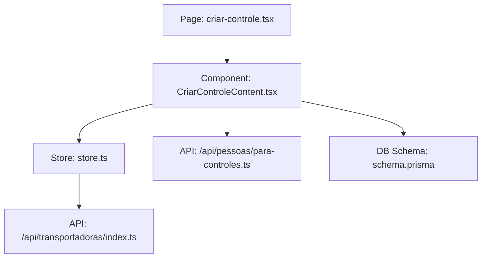
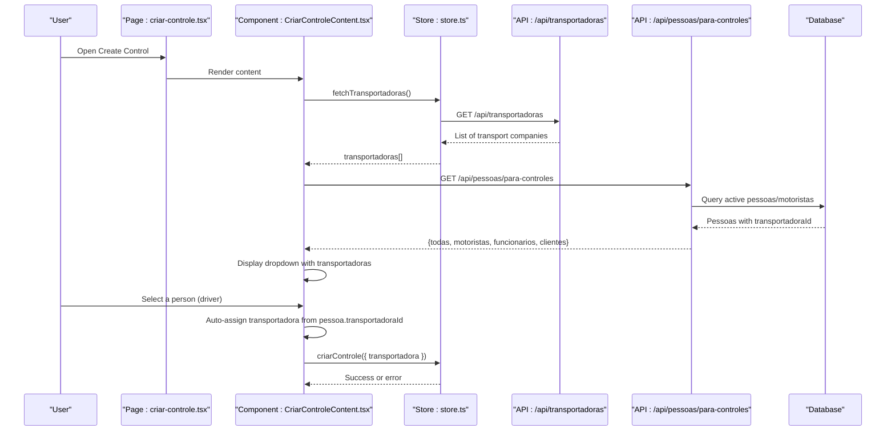
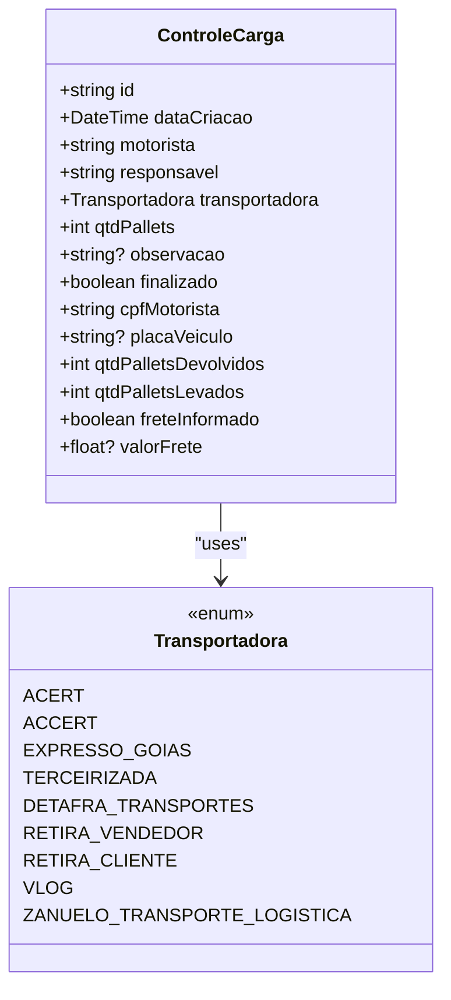
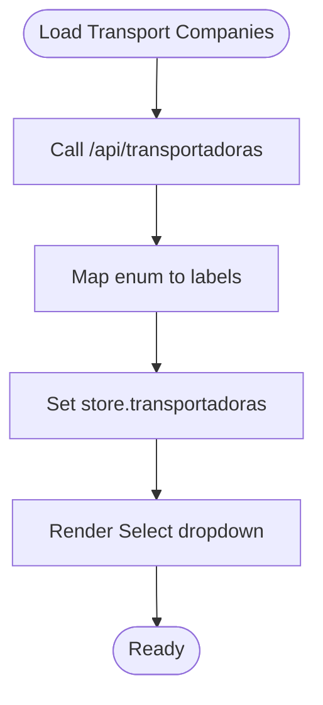
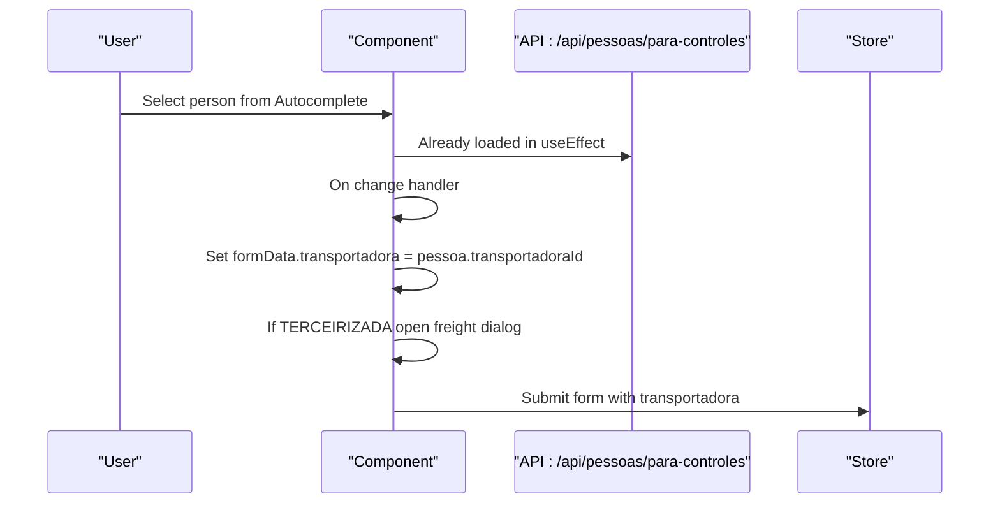
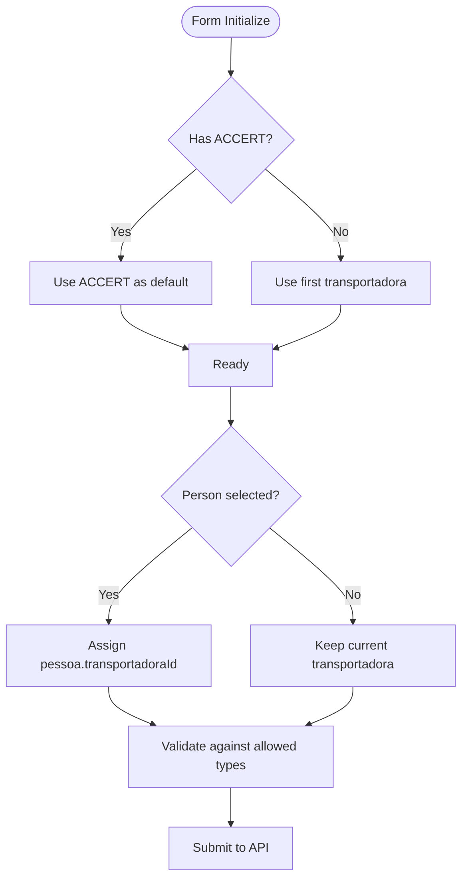
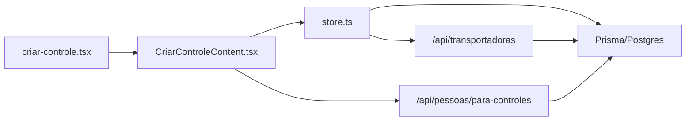

# Transport Company Assignment

<cite>
**Referenced Files in This Document**
- [criar-controle.tsx](file://pages/criar-controle.tsx)
- [CriarControleContent.tsx](file://components/CriarControleContent.tsx)
- [index.ts (transportadoras API)](file://pages/api/transportadoras/index.ts)
- [para-controles.ts](file://pages/api/pessoas/para-controles.ts)
- [store.ts](file://store/store.ts)
- [schema.prisma](file://prisma/schema.prisma)
</cite>

## Table of Contents
1. Introduction
2. Project Structure
3. Core Components
4. Architecture Overview
5. Detailed Component Analysis
6. Dependency Analysis
7. Performance Considerations
8. Troubleshooting Guide
9. Conclusion

## Introduction
This document explains how transport companies are managed during cargo control creation. It covers:
- How transport companies are loaded from the backend API
- How they are displayed in the dropdown
- The automatic assignment logic when a driver is selected
- Supported transport company types and their specific behaviors
- Default transport company selection and fallback mechanisms

## Project Structure
The feature spans UI, state management, and API layers:
- UI page entry point loads the content component
- Content component orchestrates data loading and user interactions
- Store manages transport company list and form submission
- API endpoints provide transport company options and people (drivers) with assigned transport companies
- Database schema defines the transport company enum and defaults

**Diagram sources**
- [criar-controle.tsx:9-12](file://pages/criar-controle.tsx#L9-L12)
- [CriarControleContent.tsx:124-244](file://components/CriarControleContent.tsx#L124-L244)
- [store.ts:170-195](file://store/store.ts#L170-L195)
- [index.ts (transportadoras API):16-28](file://pages/api/transportadoras/index.ts#L16-L28)
- [para-controles.ts:5-52](file://pages/api/pessoas/para-controles.ts#L5-L52)
- [schema.prisma:11-17](file://prisma/schema.prisma#L11-L17)

**Section sources**
- [criar-controle.tsx:9-12](file://pages/criar-controle.tsx#L9-L12)
- [CriarControleContent.tsx:124-244](file://components/CriarControleContent.tsx#L124-L244)
- [store.ts:170-195](file://store/store.ts#L170-L195)
- [index.ts (transportadoras API):16-28](file://pages/api/transportadoras/index.ts#L16-L28)
- [para-controles.ts:5-52](file://pages/api/pessoas/para-controles.ts#L5-L52)
- [schema.prisma:11-17](file://prisma/schema.prisma#L11-L17)

## Core Components
- Transport company enumeration and default:
  - Defined in the database schema with a default value for new records
  - Used by both backend and frontend to validate and display options
- Transport company listing API:
  - Returns all supported transport company values with human-readable labels
- People (driver) listing API:
  - Returns active drivers and other persons with their assigned transport company
- Form component:
  - Loads transport companies and people
  - Displays transport companies in a dropdown
  - Auto-assigns transport company based on selected person
  - Enforces validation and special handling for certain types

**Section sources**
- [schema.prisma:11-17](file://prisma/schema.prisma#L11-L17)
- [schema.prisma:292-302](file://prisma/schema.prisma#L292-L302)
- [index.ts (transportadoras API):16-28](file://pages/api/transportadoras/index.ts#L16-L28)
- [para-controles.ts:5-52](file://pages/api/pessoas/para-controles.ts#L5-L52)
- [CriarControleContent.tsx:124-244](file://components/CriarControleContent.tsx#L124-L244)

## Architecture Overview
End-to-end flow for transport company assignment in cargo control creation:

**Diagram sources**
- [CriarControleContent.tsx:221-244](file://components/CriarControleContent.tsx#L221-L244)
- [store.ts:170-195](file://store/store.ts#L170-L195)
- [index.ts (transportadoras API):16-28](file://pages/api/transportadoras/index.ts#L16-L28)
- [para-controles.ts:5-52](file://pages/api/pessoas/para-controles.ts#L5-L52)

## Detailed Component Analysis

### Transport Company Enumeration and Default
- Enumerated types include ACERT, ACCERT, EXPRESSO_GOIAS, TERCEIRIZADA, DETAFRA_TRANSPORTES, RETIRA_VENDEDOR, RETIRA_CLIENTE, VLOG, ZANUELO_TRANSPORTE_LOGISTICA
- Default for new cargo controls is ACCERT at the database level
- Frontend uses these values to validate and render options

**Diagram sources**
- [schema.prisma:11-17](file://prisma/schema.prisma#L11-L17)
- [schema.prisma:292-302](file://prisma/schema.prisma#L292-L302)

**Section sources**
- [schema.prisma:11-17](file://prisma/schema.prisma#L11-L17)
- [schema.prisma:292-302](file://prisma/schema.prisma#L292-L302)

### Loading Transport Companies into the Dropdown
- The store calls the transportadoras API to retrieve the list
- The API maps each enum value to a label/description
- The component renders a dropdown using this list

**Diagram sources**
- [store.ts:170-195](file://store/store.ts#L170-L195)
- [index.ts (transportadoras API):16-28](file://pages/api/transportadoras/index.ts#L16-L28)
- [CriarControleContent.tsx:695-725](file://components/CriarControleContent.tsx#L695-L725)

**Section sources**
- [store.ts:170-195](file://store/store.ts#L170-L195)
- [index.ts (transportadoras API):16-28](file://pages/api/transportadoras/index.ts#L16-L28)
- [CriarControleContent.tsx:695-725](file://components/CriarControleContent.tsx#L695-L725)

### Automatic Assignment When a Driver Is Selected
- The component fetches people (including drivers) via the people API
- Each person includes a transportadoraId field
- When a person is selected in the autocomplete, the component sets the form’s transportadora to that person’s transportadoraId
- If the selected person has no transportadoraId, the component falls back to the default transport company

**Diagram sources**
- [para-controles.ts:5-52](file://pages/api/pessoas/para-controles.ts#L5-L52)
- [CriarControleContent.tsx:531-572](file://components/CriarControleContent.tsx#L531-L572)
- [CriarControleContent.tsx:256-275](file://components/CriarControleContent.tsx#L256-L275)

**Section sources**
- [para-controles.ts:5-52](file://pages/api/pessoas/para-controles.ts#L5-L52)
- [CriarControleContent.tsx:531-572](file://components/CriarControleContent.tsx#L531-L572)
- [CriarControleContent.tsx:256-275](file://components/CriarControleContent.tsx#L256-L275)

### Supported Transport Company Types and Behaviors
- ACERT: Legacy type; mapped to ACCERT in many places for consistency
- ACCERT: Default transport company for new records and common usage
- EXPRESSO_GOIAS: Standard carrier option
- TERCEIRIZADA: Special behavior—freight information can be provided and validated; triggers freight dialog and optional freight amount capture
- DETAFRA_TRANSPORTES: Standard carrier option
- RETIRA_VENDEDOR: Indicates pickup by seller; used as a transport company type
- RETIRA_CLIENTE: Indicates pickup by client; used as a transport company type
- VLOG: Standard carrier option
- ZANUELO_TRANSPORTE_LOGISTICA: Standard carrier option

Behavioral highlights:
- TERCEIRIZADA opens a freight dialog and validates freight value if informed
- Other types do not require additional freight input in this flow

**Section sources**
- [index.ts (transportadoras API):4-14](file://pages/api/transportadoras/index.ts#L4-L14)
- [CriarControleContent.tsx:256-275](file://components/CriarControleContent.tsx#L256-L275)
- [CriarControleContent.tsx:727-779](file://components/CriarControleContent.tsx#L727-L779)
- [schema.prisma:292-302](file://prisma/schema.prisma#L292-L302)

### Default Transport Company Logic and Fallbacks
- Database default: ACCERT for new cargo controls
- UI default: The form initializes with ACCERT
- Fallback when selecting a person without a transportadoraId: the component uses the first available transport company or ACCERT
- Submission validation: invalid transportadora values are rejected or normalized to ACCERT before saving

**Diagram sources**
- [schema.prisma:11-17](file://prisma/schema.prisma#L11-L17)
- [CriarControleContent.tsx:158-169](file://components/CriarControleContent.tsx#L158-L169)
- [CriarControleContent.tsx:185-195](file://components/CriarControleContent.tsx#L185-L195)
- [CriarControleContent.tsx:339-357](file://components/CriarControleContent.tsx#L339-L357)
- [store.ts:269-296](file://store/store.ts#L269-L296)

**Section sources**
- [schema.prisma:11-17](file://prisma/schema.prisma#L11-L17)
- [CriarControleContent.tsx:158-169](file://components/CriarControleContent.tsx#L158-L169)
- [CriarControleContent.tsx:185-195](file://components/CriarControleContent.tsx#L185-L195)
- [CriarControleContent.tsx:339-357](file://components/CriarControleContent.tsx#L339-L357)
- [store.ts:269-296](file://store/store.ts#L269-L296)

## Dependency Analysis
Key dependencies and relationships:
- Page depends on the content component for rendering
- Content component depends on:
  - Store for state and API calls
  - Transportadoras API for dropdown options
  - People API for driver selection and auto-assignment
- Store depends on APIs for data operations
- Database schema defines constraints and defaults

**Diagram sources**
- [criar-controle.tsx:9-12](file://pages/criar-controle.tsx#L9-L12)
- [CriarControleContent.tsx:221-244](file://components/CriarControleContent.tsx#L221-L244)
- [store.ts:170-195](file://store/store.ts#L170-L195)
- [index.ts (transportadoras API):16-28](file://pages/api/transportadoras/index.ts#L16-L28)
- [para-controles.ts:5-52](file://pages/api/pessoas/para-controles.ts#L5-L52)

**Section sources**
- [criar-controle.tsx:9-12](file://pages/criar-controle.tsx#L9-L12)
- [CriarControleContent.tsx:221-244](file://components/CriarControleContent.tsx#L221-L244)
- [store.ts:170-195](file://store/store.ts#L170-L195)
- [index.ts (transportadoras API):16-28](file://pages/api/transportadoras/index.ts#L16-L28)
- [para-controles.ts:5-52](file://pages/api/pessoas/para-controles.ts#L5-L52)

## Performance Considerations
- Parallel loading: transport companies and notes are fetched concurrently to reduce load time
- Minimal re-renders: store updates only necessary fields
- Avoid unnecessary network calls: people are loaded once per form mount
- Validation occurs client-side before submission to reduce server round-trips

[No sources needed since this section provides general guidance]

## Troubleshooting Guide
Common issues and resolutions:
- Transport company not found in dropdown:
  - Ensure the transportadoras API returns valid enum values
  - Verify the store sets transportadoras correctly
- Auto-assignment not working:
  - Confirm the selected person has a valid transportadoraId
  - Check the change handler assigns transportadora from pessoa.transportadoraId
- TERCEIRIZADA freight validation errors:
  - Ensure freight value is provided and formatted correctly when required
- Default fallback issues:
  - Verify ACCERT exists in the transportadoras list
  - Check fallback logic selects ACCERT or first available item

**Section sources**
- [store.ts:170-195](file://store/store.ts#L170-L195)
- [CriarControleContent.tsx:256-275](file://components/CriarControleContent.tsx#L256-L275)
- [CriarControleContent.tsx:727-779](file://components/CriarControleContent.tsx#L727-L779)
- [CriarControleContent.tsx:158-169](file://components/CriarControleContent.tsx#L158-L169)

## Conclusion
Transport company assignment in cargo control creation is driven by a clear separation of concerns:
- The database defines the allowed types and default
- The API exposes transport company options and people with assigned transport companies
- The UI loads options, displays them in a dropdown, and automatically assigns the transport company based on the selected person
- Special handling exists for TERCEIRIZADA to capture freight details
- Robust defaults and fallbacks ensure consistent behavior even when data is missing

[No sources needed since this section summarizes without analyzing specific files]