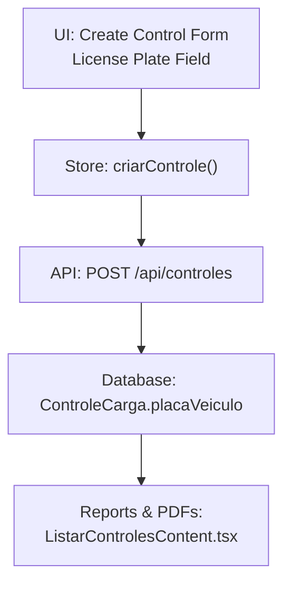
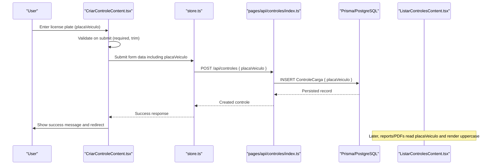
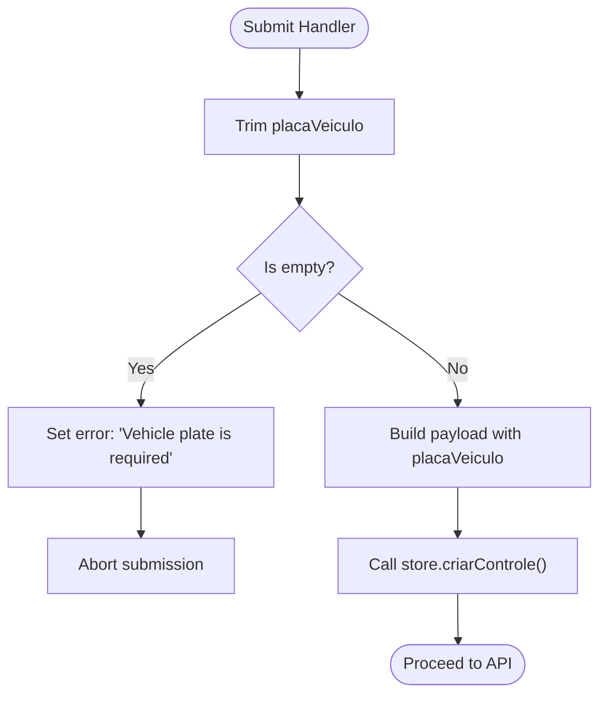
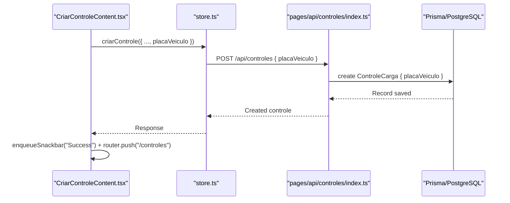
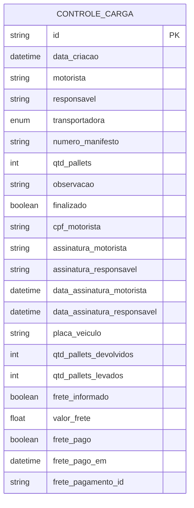
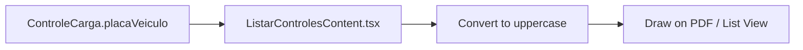
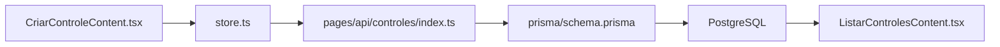

# Vehicle Information Entry

<cite>
**Referenced Files in This Document**
- [CriarControleContent.tsx](file://components/CriarControleContent.tsx)
- [criar-controle.tsx](file://pages/criar-controle.tsx)
- [store.ts](file://store/store.ts)
- [index.ts (controles API)](file://pages/api/controles/index.ts)
- [schema.prisma](file://prisma/schema.prisma)
- [ListarControlesContent.tsx](file://components/ListarControlesContent.tsx)
</cite>

## Table of Contents
1. [Introduction](#introduction)
2. [Project Structure](#project-structure)
3. [Core Components](#core-components)
4. [Architecture Overview](#architecture-overview)
5. [Detailed Component Analysis](#detailed-component-analysis)
6. [Dependency Analysis](#dependency-analysis)
7. [Performance Considerations](#performance-considerations)
8. [Troubleshooting Guide](#troubleshooting-guide)
9. [Conclusion](#conclusion)

## Introduction
This document explains the vehicle information entry section of the cargo control form, focusing on the license plate field (placaVeiculo). It covers validation rules, formatting expectations, and how the value flows through the application to be stored as part of a cargo control record. It also outlines how the field integrates with the overall form submission process and downstream usage such as PDF generation and reports.

## Project Structure
The vehicle information entry is implemented in the “Create Control” page and its content component. The flow spans:
- UI input and validation in the content component
- Store orchestration for submission
- API endpoint persistence
- Database schema storage
- Display and reporting in list/PDF views

**Diagram sources**
- [CriarControleContent.tsx:798-818](file://components/CriarControleContent.tsx#L798-L818)
- [store.ts:269-397](file://store/store.ts#L269-L397)
- [index.ts (controles API):64-116](file://pages/api/controles/index.ts#L64-L116)
- [schema.prisma:11-42](file://prisma/schema.prisma#L11-L42)
- [ListarControlesContent.tsx:840-840](file://components/ListarControlesContent.tsx#L840-L840)

**Section sources**
- [criar-controle.tsx:1-62](file://pages/criar-controle.tsx#L1-L62)
- [CriarControleContent.tsx:173-195](file://components/CriarControleContent.tsx#L173-L195)

## Core Components
- License plate input field: A required text field labeled “Placa do Veículo” with placeholder guidance and error display.
- Validation: On submit, the field is validated for non-empty trimmed value; errors are surfaced inline and via snackbar.
- Submission: The value is included in the payload sent to the store’s criarControle function, which forwards it to the backend API.
- Storage: The API persists placaVeiculo into the ControleCarga model.
- Usage: The value is displayed in lists and printed in PDFs, normalized to uppercase.

**Section sources**
- [CriarControleContent.tsx:314-316](file://components/CriarControleContent.tsx#L314-L316)
- [CriarControleContent.tsx:339-357](file://components/CriarControleContent.tsx#L339-L357)
- [store.ts:269-397](file://store/store.ts#L269-L397)
- [index.ts (controles API):64-116](file://pages/api/controles/index.ts#L64-L116)
- [schema.prisma:11-42](file://prisma/schema.prisma#L11-L42)
- [ListarControlesContent.tsx:840-840](file://components/ListarControlesContent.tsx#L840-L840)

## Architecture Overview
End-to-end flow from user input to database storage and downstream consumption:

**Diagram sources**
- [CriarControleContent.tsx:286-382](file://components/CriarControleContent.tsx#L286-L382)
- [store.ts:269-397](file://store/store.ts#L269-L397)
- [index.ts (controles API):64-116](file://pages/api/controles/index.ts#L64-L116)
- [schema.prisma:11-42](file://prisma/schema.prisma#L11-L42)
- [ListarControlesContent.tsx:840-840](file://components/ListarControlesContent.tsx#L840-L840)

## Detailed Component Analysis

### License Plate Field: Input and Validation
- Field definition: Required text input bound to formData.placaVeiculo with helper text for errors.
- Placeholder suggests a compact format without separators.
- Validation rule: On submit, if the trimmed value is empty, an error is set and submission stops.
- Error handling: Errors are shown inline and via a snackbar; clearing occurs when the user edits the field.

**Diagram sources**
- [CriarControleContent.tsx:314-316](file://components/CriarControleContent.tsx#L314-L316)
- [CriarControleContent.tsx:339-357](file://components/CriarControleContent.tsx#L339-L357)

**Section sources**
- [CriarControleContent.tsx:798-818](file://components/CriarControleContent.tsx#L798-L818)
- [CriarControleContent.tsx:286-382](file://components/CriarControleContent.tsx#L286-L382)

### Data Flow: From UI to Storage
- The form handler constructs a payload that includes placaVeiculo (trimmed).
- The store validates transportadora and other fields, then POSTs to /api/controles.
- The API creates a ControleCarga record, persisting placaVeiculo.
- After success, the UI shows a success message and navigates away.

**Diagram sources**
- [CriarControleContent.tsx:339-382](file://components/CriarControleContent.tsx#L339-L382)
- [store.ts:269-397](file://store/store.ts#L269-L397)
- [index.ts (controles API):64-116](file://pages/api/controles/index.ts#L64-L116)

**Section sources**
- [store.ts:269-397](file://store/store.ts#L269-L397)
- [index.ts (controles API):64-116](file://pages/api/controles/index.ts#L64-L116)

### Storage Model and Constraints
- The database model includes a nullable string field for the license plate.
- No server-side regex or length constraints are enforced at the schema level; validation is primarily client-side.
- Downstream consumers read this field directly from the persisted record.

**Diagram sources**
- [schema.prisma:11-42](file://prisma/schema.prisma#L11-L42)

**Section sources**
- [schema.prisma:11-42](file://prisma/schema.prisma#L11-L42)

### Display and Reporting Integration
- In list/PDF generation, the license plate is read from the control record and rendered in uppercase for consistency.
- This ensures consistent presentation across reports and printed documents.

**Diagram sources**
- [ListarControlesContent.tsx:840-840](file://components/ListarControlesContent.tsx#L840-L840)

**Section sources**
- [ListarControlesContent.tsx:840-840](file://components/ListarControlesContent.tsx#L840-L840)

## Dependency Analysis
- UI depends on local state for placaVeiculo and validation errors.
- Store orchestrates submission and handles success/error feedback.
- API maps request body to Prisma create call, including placaVeiculo.
- Schema defines the storage field type and nullability.
- Reporting components consume the stored value for display/printing.

**Diagram sources**
- [CriarControleContent.tsx:286-382](file://components/CriarControleContent.tsx#L286-L382)
- [store.ts:269-397](file://store/store.ts#L269-L397)
- [index.ts (controles API):64-116](file://pages/api/controles/index.ts#L64-L116)
- [schema.prisma:11-42](file://prisma/schema.prisma#L11-L42)
- [ListarControlesContent.tsx:840-840](file://components/ListarControlesContent.tsx#L840-L840)

**Section sources**
- [CriarControleContent.tsx:286-382](file://components/CriarControleContent.tsx#L286-L382)
- [store.ts:269-397](file://store/store.ts#L269-L397)
- [index.ts (controles API):64-116](file://pages/api/controles/index.ts#L64-L116)
- [schema.prisma:11-42](file://prisma/schema.prisma#L11-L42)
- [ListarControlesContent.tsx:840-840](file://components/ListarControlesContent.tsx#L840-L840)

## Performance Considerations
- Client-side validation prevents unnecessary network calls for invalid inputs.
- The field is a simple string; no heavy transformations occur before submission.
- Rendering in reports uses a straightforward uppercase conversion, which is negligible in cost.

[No sources needed since this section provides general guidance]

## Troubleshooting Guide
- Empty license plate:
  - Symptom: Submission blocked; inline error shown under the field; snackbar indicates errors.
  - Cause: Validation requires a non-empty trimmed value.
  - Resolution: Enter a valid plate number before submitting.
  - Section sources
    - [CriarControleContent.tsx:314-316](file://components/CriarControleContent.tsx#L314-L316)
    - [CriarControleContent.tsx:286-333](file://components/CriarControleContent.tsx#L286-L333)

- Unexpected case in reports:
  - Behavior: Reports render the plate in uppercase regardless of input casing.
  - Section sources
    - [ListarControlesContent.tsx:840-840](file://components/ListarControlesContent.tsx#L840-L840)

- Submission fails after valid input:
  - Check store logs for transportadora validation and payload formatting.
  - Verify API response status and messages.
  - Section sources
    - [store.ts:269-397](file://store/store.ts#L269-L397)
    - [index.ts (controles API):64-116](file://pages/api/controles/index.ts#L64-L116)

## Conclusion
The license plate field (placaVeiculo) is a required, client-side validated string captured during cargo control creation. It is submitted with the rest of the form data, persisted in the database, and later used in reports and PDFs where it is consistently displayed in uppercase. While there are no strict server-side format constraints, the UI enforces presence and trimming, ensuring clean data entry and reliable downstream usage.