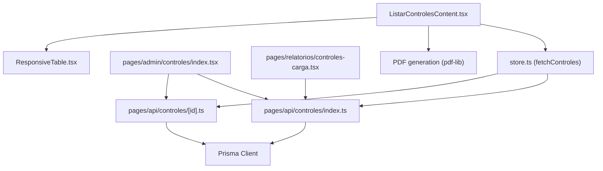
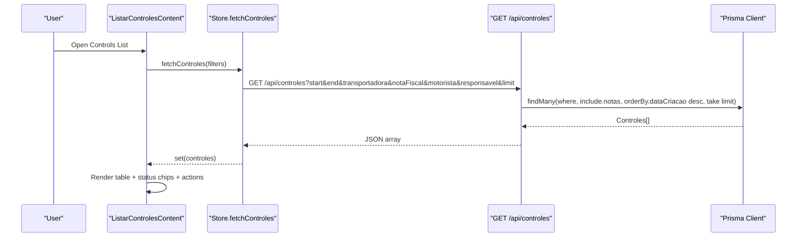
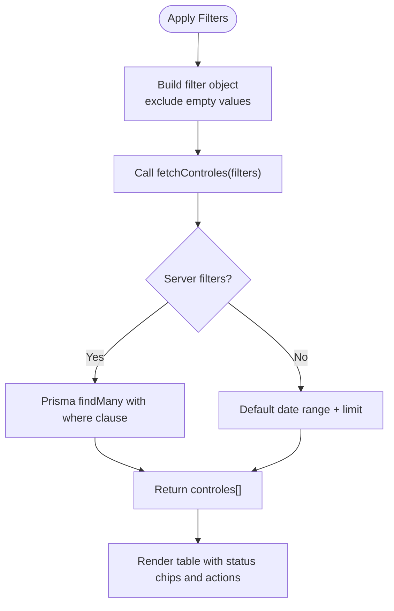
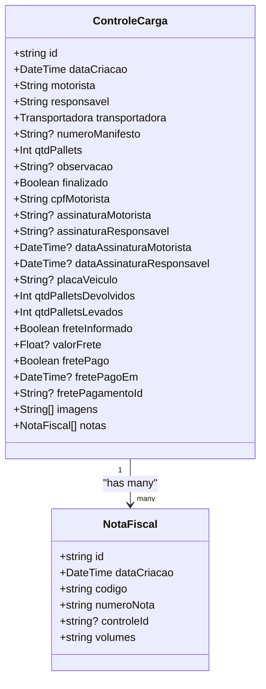
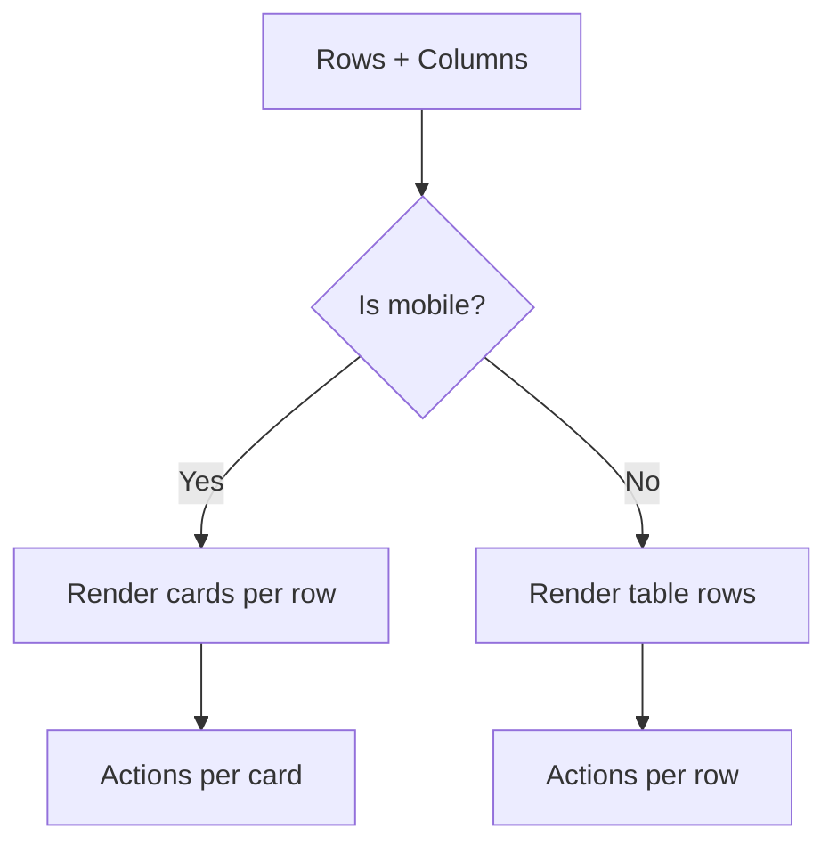
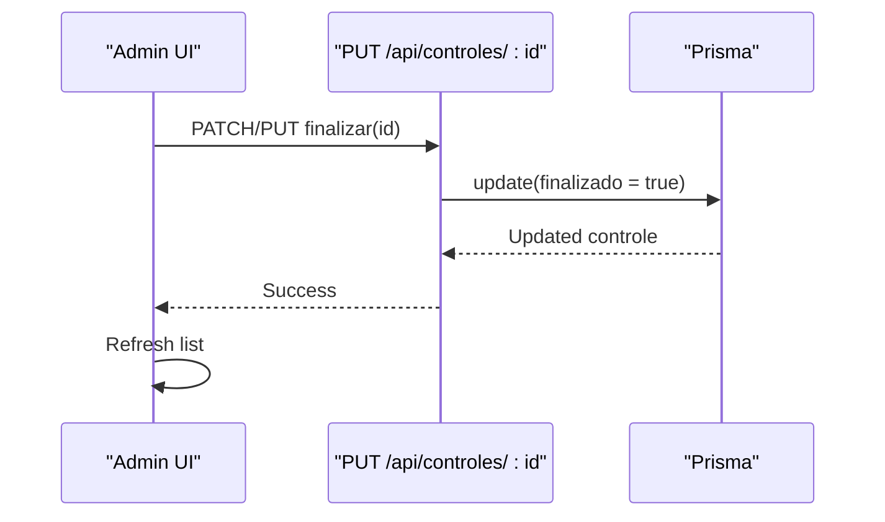
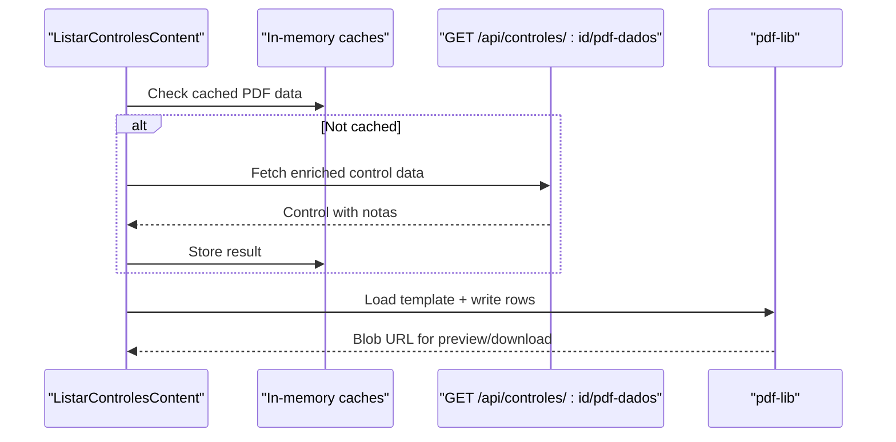
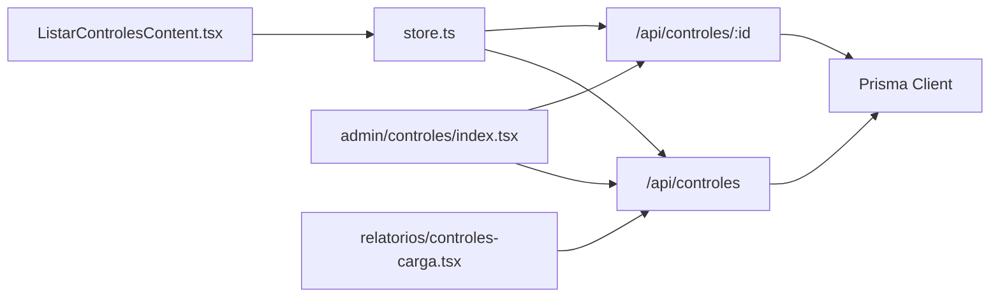

# Cargo Control Listing & Management

<cite>
**Referenced Files in This Document**
- [pages/listar-controles.tsx](file://pages/listar-controles.tsx)
- [components/ListarControlesContent.tsx](file://components/ListarControlesContent.tsx)
- [store/store.ts](file://store/store.ts)
- [pages/api/controles/index.ts](file://pages/api/controles/index.ts)
- [pages/api/controles/[id].ts](file://pages/api/controles/[id].ts)
- [prisma/schema.prisma](file://prisma/schema.prisma)
- [components/ResponsiveTable.tsx](file://components/ResponsiveTable.tsx)
- [pages/admin/controles/index.tsx](file://pages/admin/controles/index.tsx)
- [pages/relatorios/controles-carga.tsx](file://pages/relatorios/controles-carga.tsx)
</cite>

## Table of Contents
1. [Introduction](#introduction)
2. [Project Structure](#project-structure)
3. [Core Components](#core-components)
4. [Architecture Overview](#architecture-overview)
5. [Detailed Component Analysis](#detailed-component-analysis)
6. [Dependency Analysis](#dependency-analysis)
7. [Performance Considerations](#performance-considerations)
8. [Troubleshooting Guide](#troubleshooting-guide)
9. [Conclusion](#conclusion)
10. [Appendices](#appendices)

## Introduction
This document explains the cargo control listing and management features, including how controls are retrieved from the database, filtered, displayed, and updated. It covers table layout, sorting options, pagination, search, status indicators, bulk operations, export capabilities, performance considerations for large datasets, and real-time update strategies.

## Project Structure
The feature spans UI components, a global store, Next.js API routes, and the Prisma data model:
- Pages and components render the list, filters, actions, and PDF export.
- The store centralizes fetching and state for controls and related entities.
- API routes implement server-side filtering, creation, updates, and deletion.
- The Prisma schema defines the data model and relationships.

**Diagram sources**
- [components/ListarControlesContent.tsx:104-124](file://components/ListarControlesContent.tsx#L104-L124)
- [store/store.ts:125-168](file://store/store.ts#L125-L168)
- [pages/api/controles/index.ts:5-59](file://pages/api/controles/index.ts#L5-L59)
- [pages/api/controles/[id].ts:5-92](file://pages/api/controles/[id].ts#L5-L92)
- [prisma/schema.prisma:11-42](file://prisma/schema.prisma#L11-L42)
- [components/ResponsiveTable.tsx:20-46](file://components/ResponsiveTable.tsx#L20-L46)
- [pages/admin/controles/index.tsx:77-101](file://pages/admin/controles/index.tsx#L77-L101)
- [pages/relatorios/controles-carga.tsx:207-258](file://pages/relatorios/controles-carga.tsx#L207-L258)

**Section sources**
- [pages/listar-controles.tsx:1-4](file://pages/listar-controles.tsx#L1-L4)
- [components/ListarControlesContent.tsx:104-124](file://components/ListarControlesContent.tsx#L104-L124)
- [store/store.ts:125-168](file://store/store.ts#L125-L168)
- [pages/api/controles/index.ts:5-59](file://pages/api/controles/index.ts#L5-L59)
- [pages/api/controles/[id].ts:5-92](file://pages/api/controles/[id].ts#L5-L92)
- [prisma/schema.prisma:11-42](file://prisma/schema.prisma#L11-L42)
- [components/ResponsiveTable.tsx:20-46](file://components/ResponsiveTable.tsx#L20-L46)
- [pages/admin/controles/index.tsx:77-101](file://pages/admin/controles/index.tsx#L77-L101)
- [pages/relatorios/controles-carga.tsx:207-258](file://pages/relatorios/controles-carga.tsx#L207-L258)

## Core Components
- ListarControlesContent: Main listing component with filters, search, status chips, row actions, image capture, and PDF export. Uses a responsive table and preloads PDF data for quick rendering.
- Store (Zustand): Centralized fetchControles that builds query parameters and calls the API; also handles create/update/finalize and note linking.
- API Routes:
  - GET /api/controles: Server-side filtering by date range, transportadora, nota fiscal number, motorista, responsavel, and limit; includes associated notas.
  - PUT/DELETE /api/controles/:id: Update fields (including images), finalize, or delete.
- ResponsiveTable: Renders a traditional table on desktop and card-based layout on mobile.
- Admin Controles Page: Alternative admin view with search, edit modal, finalize action, and delete via API.
- Reports Page: Aggregated reporting with filters, charts, and bulk freight payment registration.

**Section sources**
- [components/ListarControlesContent.tsx:104-124](file://components/ListarControlesContent.tsx#L104-L124)
- [store/store.ts:125-168](file://store/store.ts#L125-L168)
- [pages/api/controles/index.ts:5-59](file://pages/api/controles/index.ts#L5-L59)
- [pages/api/controles/[id].ts:28-92](file://pages/api/controles/[id].ts#L28-L92)
- [components/ResponsiveTable.tsx:20-46](file://components/ResponsiveTable.tsx#L20-L46)
- [pages/admin/controles/index.tsx:77-101](file://pages/admin/controles/index.tsx#L77-L101)
- [pages/relatorios/controles-carga.tsx:207-258](file://pages/relatorios/controles-carga.tsx#L207-L258)

## Architecture Overview
End-to-end flow for listing cargo controls:

**Diagram sources**
- [components/ListarControlesContent.tsx:104-124](file://components/ListarControlesContent.tsx#L104-L124)
- [store/store.ts:125-168](file://store/store.ts#L125-L168)
- [pages/api/controles/index.ts:5-59](file://pages/api/controles/index.ts#L5-L59)
- [prisma/schema.prisma:11-42](file://prisma/schema.prisma#L11-L42)

## Detailed Component Analysis

### Listing UI: Filters, Search, Status, Actions, Pagination
- Filters: Date range (default last 2 days), transportadora, nota fiscal number, motorista, responsavel, and limit. Applied via fetchControles with sanitized non-empty values.
- Search: Local client-side search in the admin page; server-side contains search in the main listing route for motorista/responsavel/notaFiscal.
- Status Indicators: Chips rendered per row based on control status; supports ABERTO, EM_ANDAMENTO, FINALIZADO, CANCELADO in admin view.
- Sorting: Server-side sort by creation date descending; no multi-column sort exposed in current implementation.
- Pagination: Implemented via limit parameter to cap rows returned; no explicit page navigation UI in the main listing.

**Diagram sources**
- [components/ListarControlesContent.tsx:515-545](file://components/ListarControlesContent.tsx#L515-L545)
- [pages/api/controles/index.ts:5-59](file://pages/api/controles/index.ts#L5-L59)
- [store/store.ts:125-168](file://store/store.ts#L125-L168)

**Section sources**
- [components/ListarControlesContent.tsx:115-124](file://components/ListarControlesContent.tsx#L115-L124)
- [components/ListarControlesContent.tsx:515-545](file://components/ListarControlesContent.tsx#L515-L545)
- [pages/api/controles/index.ts:5-59](file://pages/api/controles/index.ts#L5-L59)
- [pages/admin/controles/index.tsx:77-101](file://pages/admin/controles/index.tsx#L77-L101)

### Data Retrieval and Presentation
- Store fetchControles constructs query string from filters and calls /api/controles with cache-busting headers.
- API endpoint applies date range, transportadora, nota fiscal substring match, motorista/responsavel substring matches, and returns ordered results with related notas.
- UI converts dates and attaches notes and auditor info for display.

**Diagram sources**
- [prisma/schema.prisma:11-42](file://prisma/schema.prisma#L11-L42)
- [prisma/schema.prisma:55-67](file://prisma/schema.prisma#L55-L67)

**Section sources**
- [store/store.ts:125-168](file://store/store.ts#L125-L168)
- [pages/api/controles/index.ts:5-59](file://pages/api/controles/index.ts#L5-L59)
- [components/ListarControlesContent.tsx:238-269](file://components/ListarControlesContent.tsx#L238-L269)

### Table Layout and Responsiveness
- Desktop: Traditional table with sticky header and hover effects.
- Mobile: Card-based layout with labeled fields per row.
- Columns can be hidden on mobile via configuration.

**Diagram sources**
- [components/ResponsiveTable.tsx:48-121](file://components/ResponsiveTable.tsx#L48-L121)
- [components/ResponsiveTable.tsx:123-212](file://components/ResponsiveTable.tsx#L123-L212)

**Section sources**
- [components/ResponsiveTable.tsx:20-46](file://components/ResponsiveTable.tsx#L20-L46)
- [components/ResponsiveTable.tsx:48-121](file://components/ResponsiveTable.tsx#L48-L121)
- [components/ResponsiveTable.tsx:123-212](file://components/ResponsiveTable.tsx#L123-L212)

### Bulk Operations and Status Updates
- Finalize single control via PUT /api/controles/:id with finalizado flag.
- Delete single control via DELETE /api/controles/:id.
- Admin page exposes edit modal, finalize button, and delete action.
- Reports page supports bulk freight payment registration for selected controls.

**Diagram sources**
- [pages/admin/controles/index.tsx:164-180](file://pages/admin/controles/index.tsx#L164-L180)
- [pages/api/controles/[id].ts:28-73](file://pages/api/controles/[id].ts#L28-L73)
- [store/store.ts:414-437](file://store/store.ts#L414-L437)

**Section sources**
- [pages/admin/controles/index.tsx:164-180](file://pages/admin/controles/index.tsx#L164-L180)
- [pages/api/controles/[id].ts:28-92](file://pages/api/controles/[id].ts#L28-L92)
- [store/store.ts:414-437](file://store/store.ts#L414-L437)
- [pages/relatorios/controles-carga.tsx:312-346](file://pages/relatorios/controles-carga.tsx#L312-L346)

### Export Capabilities
- PDF Romaneio: Generates a PDF using pdf-lib by loading a template and writing text for each nota fiscal linked to a control. Includes enrichment from external invoice lookup when possible.
- Preloading: PDF data is fetched per control with caching and in-flight deduplication to avoid redundant requests.

**Diagram sources**
- [components/ListarControlesContent.tsx:271-297](file://components/ListarControlesContent.tsx#L271-L297)
- [components/ListarControlesContent.tsx:605-774](file://components/ListarControlesContent.tsx#L605-L774)

**Section sources**
- [components/ListarControlesContent.tsx:271-297](file://components/ListarControlesContent.tsx#L271-L297)
- [components/ListarControlesContent.tsx:605-774](file://components/ListarControlesContent.tsx#L605-L774)

## Dependency Analysis
- UI depends on Zustand store for data fetching and mutation.
- Store depends on Next.js API routes for CRUD and filtering.
- API routes depend on Prisma Client and the Postgres database.
- Admin and Reports pages reuse the same API endpoints for consistency.

**Diagram sources**
- [components/ListarControlesContent.tsx:104-124](file://components/ListarControlesContent.tsx#L104-L124)
- [store/store.ts:125-168](file://store/store.ts#L125-L168)
- [pages/api/controles/index.ts:5-59](file://pages/api/controles/index.ts#L5-L59)
- [pages/api/controles/[id].ts:5-92](file://pages/api/controles/[id].ts#L5-L92)
- [pages/admin/controles/index.tsx:77-101](file://pages/admin/controles/index.tsx#L77-L101)
- [pages/relatorios/controles-carga.tsx:207-258](file://pages/relatorios/controles-carga.tsx#L207-L258)

**Section sources**
- [store/store.ts:125-168](file://store/store.ts#L125-L168)
- [pages/api/controles/index.ts:5-59](file://pages/api/controles/index.ts#L5-L59)
- [pages/api/controles/[id].ts:5-92](file://pages/api/controles/[id].ts#L5-L92)

## Performance Considerations
- Server-side filtering: Date range, transportadora, and substring searches reduce payload size.
- Limiting results: Use limit to cap rows; consider adding offset/pagination if needed.
- Indexes: Ensure indexes on frequently filtered columns (e.g., dataCriacao, finalizado).
- PDF preloading: In-memory cache and in-flight request deduplication prevent duplicate network calls.
- External enrichment: Invoice lookups are cached per key to minimize repeated calls.
- Real-time updates: Current implementation uses manual refresh or re-fetch after mutations; consider polling or WebSocket for live updates if required.

[No sources needed since this section provides general guidance]

## Troubleshooting Guide
- Filtering not applied: Verify filter values are non-empty before sending; check console logs for built query params.
- Empty list: Confirm date range is valid and within database records; ensure limit is not too small.
- Status not updating: Check PUT/PATCH to /api/controles/:id and response status; verify finalizado field is set.
- PDF generation fails: Validate template availability and enriched data presence; inspect error logs around PDF building.
- Image capture/save issues: Ensure PUT /api/controles/:id accepts images array and that base64 strings are valid.

**Section sources**
- [components/ListarControlesContent.tsx:515-545](file://components/ListarControlesContent.tsx#L515-L545)
- [pages/api/controles/[id].ts:28-92](file://pages/api/controles/[id].ts#L28-L92)
- [components/ListarControlesContent.tsx:605-774](file://components/ListarControlesContent.tsx#L605-L774)

## Conclusion
The cargo control listing and management system provides robust filtering, status visualization, and export capabilities. Server-side filtering and limiting help manage large datasets, while in-memory caching improves PDF generation performance. For real-time updates, consider introducing polling or event-driven mechanisms.

[No sources needed since this section summarizes without analyzing specific files]

## Appendices

### API Reference Summary
- GET /api/controles
  - Query params: start, end, transportadora, notaFiscal, motorista, responsavel, limit
  - Response: Array of controls with included notas
- PUT /api/controles/:id
  - Body fields: motorista, responsavel, transportadora, numeroManifesto, qtdPallets, observacao, finalizado, cpfMotorista, placaVeiculo, qtdPalletsDevolvidos, qtdPalletsLevados, freteInformado, valorFrete, imagens
  - Response: Updated control with notas
- DELETE /api/controles/:id
  - Response: 204 No Content on success

**Section sources**
- [pages/api/controles/index.ts:5-59](file://pages/api/controles/index.ts#L5-L59)
- [pages/api/controles/[id].ts:5-92](file://pages/api/controles/[id].ts#L5-L92)