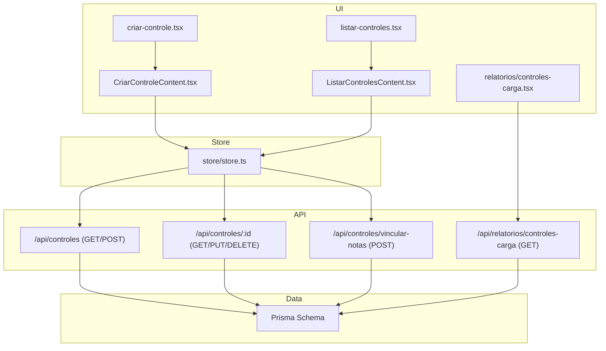
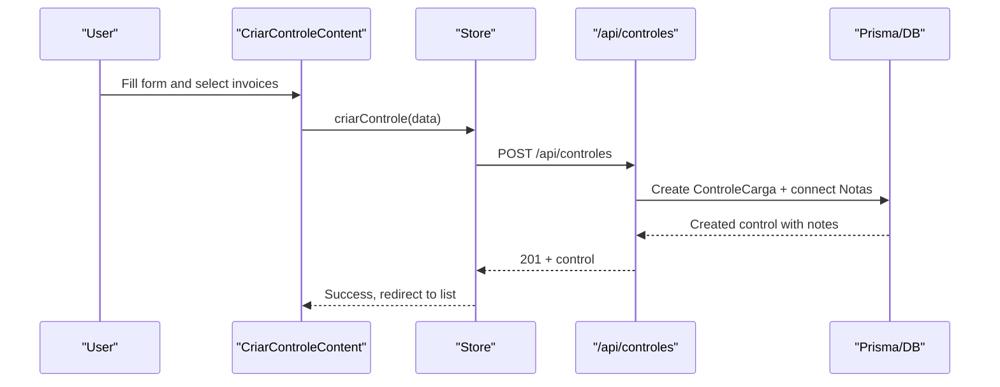
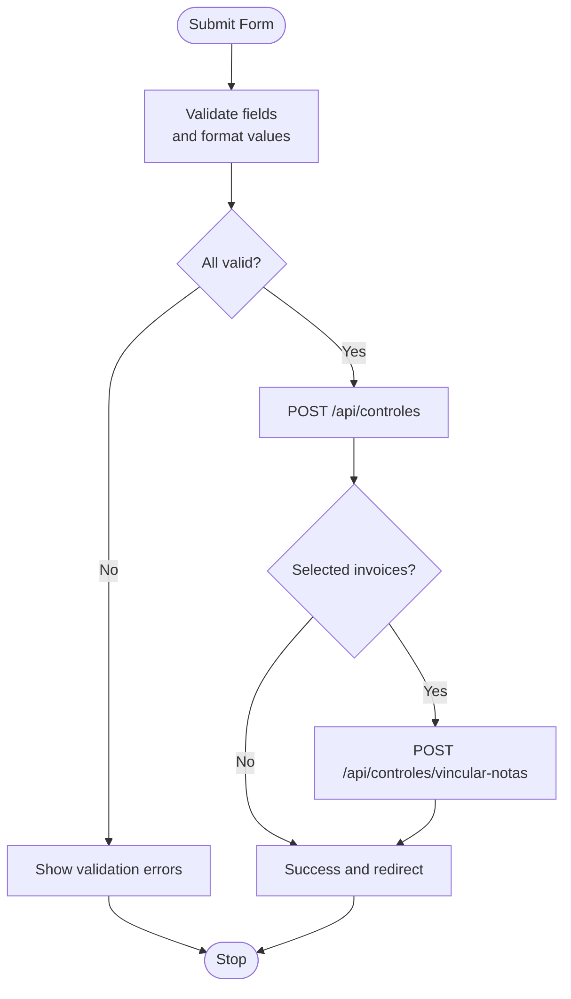
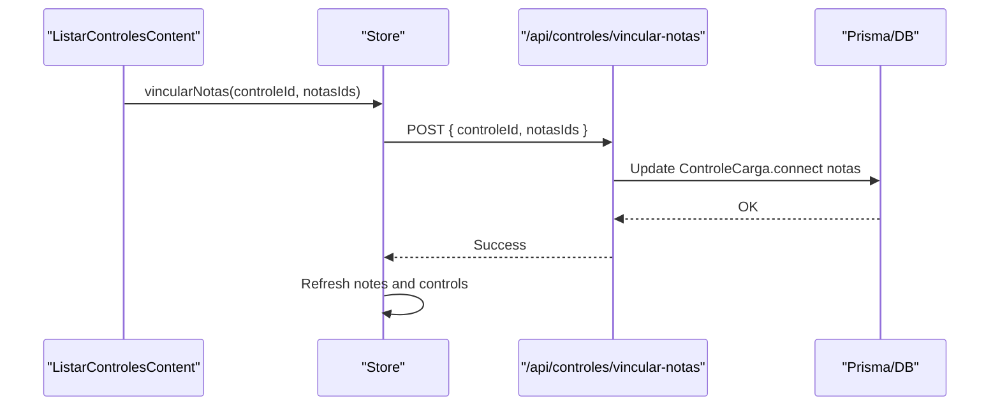
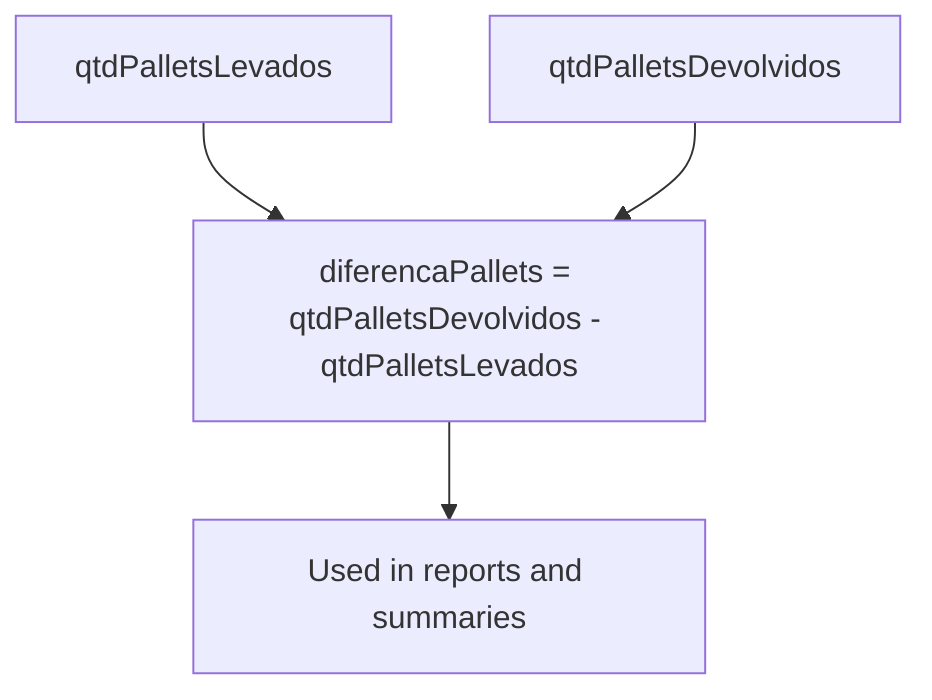
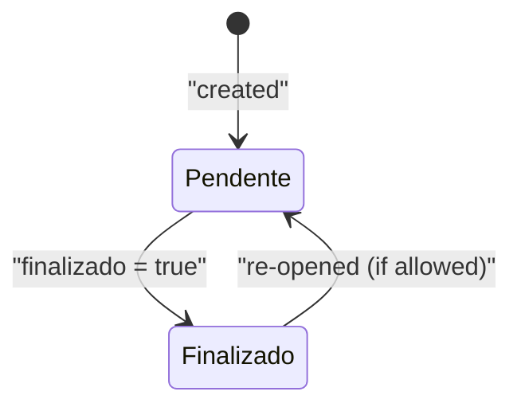
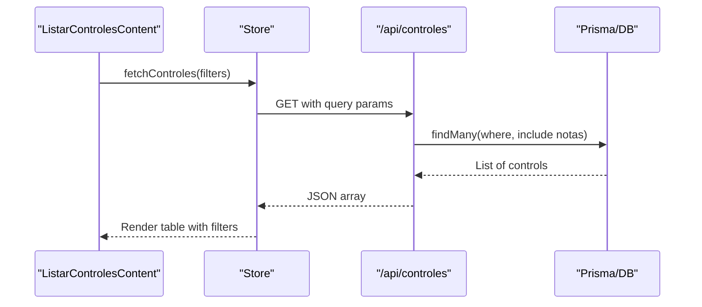
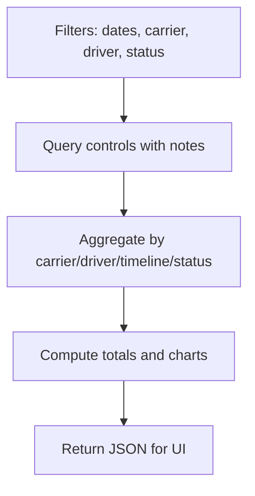
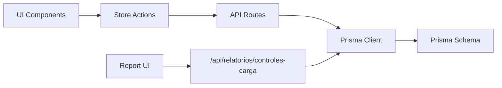

# Cargo Control Management

<cite>
**Referenced Files in This Document**
- [criar-controle.tsx](file://pages/criar-controle.tsx)
- [CriarControleContent.tsx](file://components/CriarControleContent.tsx)
- [listar-controles.tsx](file://pages/listar-controles.tsx)
- [ListarControlesContent.tsx](file://components/ListarControlesContent.tsx)
- [store/store.ts](file://store/store.ts)
- [pages/api/controles/index.ts](file://pages/api/controles/index.ts)
- [pages/api/controles/[id].ts](file://pages/api/controles/[id].ts)
- [pages/api/controles/vincular-notas.ts](file://pages/api/controles/vincular-notas.ts)
- [prisma/schema.prisma](file://prisma/schema.prisma)
- [pages/relatorios/controles-carga.tsx](file://pages/relatorios/controles-carga.tsx)
- [pages/api/relatorios/controles-carga.ts](file://pages/api/relatorios/controles-carga.ts)
</cite>

## Table of Contents
1. [Introduction](#introduction)
2. [Project Structure](#project-structure)
3. [Core Components](#core-components)
4. [Architecture Overview](#architecture-overview)
5. [Detailed Component Analysis](#detailed-component-analysis)
6. [Dependency Analysis](#dependency-analysis)
7. [Performance Considerations](#performance-considerations)
8. [Troubleshooting Guide](#troubleshooting-guide)
9. [Conclusion](#conclusion)

## Introduction
This document explains the cargo control management functionality end-to-end: creation, invoice linking, volume calculations, status tracking, listing and filtering, editing, reporting, data consistency, audit considerations, and bulk operations. It maps user flows to UI components, state store actions, API endpoints, and database models so both technical and non-technical readers can understand how cargo controls are created, linked to invoices (notas fiscais), tracked through their lifecycle, and reported on.

## Project Structure
Cargo control features span pages, components, a global store, API routes, and Prisma schema. The key areas are:
- Creation UI and flow: pages and component for creating a new cargo control
- Listing and filtering: pages and component for viewing and managing controls
- State and services: store for fetching, creating, updating, and linking
- API layer: Next.js API routes for CRUD and linking
- Data model: Prisma schema defining entities and relationships
- Reporting: report page and backend aggregation endpoint

**Diagram sources**
- [criar-controle.tsx:1-62](file://pages/criar-controle.tsx#L1-L62)
- [CriarControleContent.tsx:124-412](file://components/CriarControleContent.tsx#L124-L412)
- [listar-controles.tsx:1-4](file://pages/listar-controles.tsx#L1-L4)
- [ListarControlesContent.tsx:104-124](file://components/ListarControlesContent.tsx#L104-L124)
- [store/store.ts:76-168](file://store/store.ts#L76-L168)
- [pages/api/controles/index.ts:5-121](file://pages/api/controles/index.ts#L5-L121)
- [pages/api/controles/[id].ts:5-93](file://pages/api/controles/[id].ts#L5-L93)
- [pages/api/controles/vincular-notas.ts:4-31](file://pages/api/controles/vincular-notas.ts#L4-L31)
- [pages/api/relatorios/controles-carga.ts:9-203](file://pages/api/relatorios/controles-carga.ts#L9-L203)
- [prisma/schema.prisma:11-67](file://prisma/schema.prisma#L11-L67)

**Section sources**
- [criar-controle.tsx:1-62](file://pages/criar-controle.tsx#L1-L62)
- [listar-controles.tsx:1-4](file://pages/listar-controles.tsx#L1-L4)

## Core Components
- Creation workflow:
  - Page wrapper handles authentication and layout.
  - Content form collects driver, carrier, vehicle plate, pallets taken/returned, optional freight info, and selects invoices to link.
  - Validates required fields and formats values before submission.
  - Submits via store action which calls the create API and links selected invoices.
- Listing and filtering:
  - Loads controls with date range and filters (carrier, invoice number, driver, responsible).
  - Supports editing fields like quantities and status, capturing images, and generating PDFs.
  - Uses caching for PDF data to reduce repeated requests.
- Store:
  - Centralized state for notes, controls, carriers.
  - Methods to fetch, create, update, finalize, and link notes to controls.
  - Handles error states and re-fetching lists after mutations.
- APIs:
  - Create and list controls with filters.
  - Update control fields including finalization flag and freight-related fields.
  - Link multiple invoices to a control.
  - Report aggregation by carrier, driver, timeline, and totals.
- Data model:
  - ControleCarga holds core control fields, signatures, volumes, freight flags, and relations to NotaFiscal.
  - NotaFiscal stores invoice metadata and links back to a control when assigned.

**Section sources**
- [CriarControleContent.tsx:124-412](file://components/CriarControleContent.tsx#L124-L412)
- [ListarControlesContent.tsx:104-124](file://components/ListarControlesContent.tsx#L104-L124)
- [store/store.ts:76-168](file://store/store.ts#L76-L168)
- [pages/api/controles/index.ts:5-121](file://pages/api/controles/index.ts#L5-L121)
- [pages/api/controles/[id].ts:5-93](file://pages/api/controles/[id].ts#L5-L93)
- [pages/api/controles/vincular-notas.ts:4-31](file://pages/api/controles/vincular-notas.ts#L4-L31)
- [prisma/schema.prisma:11-67](file://prisma/schema.prisma#L11-L67)

## Architecture Overview
The system follows a layered architecture:
- UI layers (Next.js pages and React components) orchestrate user interactions.
- Store coordinates data fetching and mutation calls to API routes.
- API routes validate inputs, enforce business rules, and persist changes using Prisma.
- Database schema defines entities and relationships; indexes optimize queries.

**Diagram sources**
- [CriarControleContent.tsx:286-412](file://components/CriarControleContent.tsx#L286-L412)
- [store/store.ts:269-397](file://store/store.ts#L269-L397)
- [pages/api/controles/index.ts:64-116](file://pages/api/controles/index.ts#L64-L116)
- [prisma/schema.prisma:11-67](file://prisma/schema.prisma#L11-L67)

## Detailed Component Analysis

### Creation Workflow
- Inputs: driver name, CPF, phone, carrier, responsible person, vehicle plate, pallets taken/returned, optional freight value, and selected invoices.
- Validation:
  - Required fields enforced (driver, responsible, carrier, vehicle plate).
  - Non-negative pallet counts.
  - Freight value required only when carrier is “TERCEIRIZADA” and freight is informed.
- Submission:
  - Formats payload and calls store’s criarControle.
  - Store validates transportadora enum and sends POST to /api/controles.
  - On success, optionally links selected invoices via /api/controles/vincular-notas and refreshes lists.

**Diagram sources**
- [CriarControleContent.tsx:286-412](file://components/CriarControleContent.tsx#L286-L412)
- [store/store.ts:269-397](file://store/store.ts#L269-L397)
- [pages/api/controles/vincular-notas.ts:4-31](file://pages/api/controles/vincular-notas.ts#L4-L31)

**Section sources**
- [CriarControleContent.tsx:173-412](file://components/CriarControleContent.tsx#L173-L412)
- [store/store.ts:269-397](file://store/store.ts#L269-L397)
- [pages/api/controles/index.ts:64-116](file://pages/api/controles/index.ts#L64-L116)

### Invoice Linking
- During creation, users can select available invoices not yet linked to any control.
- After creation, the store attempts to link selected invoices via a dedicated endpoint.
- Separate endpoint supports linking later if needed.

**Diagram sources**
- [store/store.ts:399-412](file://store/store.ts#L399-L412)
- [pages/api/controles/vincular-notas.ts:4-31](file://pages/api/controles/vincular-notas.ts#L4-L31)

**Section sources**
- [store/store.ts:399-412](file://store/store.ts#L399-L412)
- [pages/api/controles/vincular-notas.ts:4-31](file://pages/api/controles/vincular-notas.ts#L4-L31)

### Volume Calculations
- Volumes are captured per control:
  - qtdPalletsLevados: pallets taken out
  - qtdPalletsDevolvidos: pallets returned
  - diferencaPallets: computed as devolvidos - levados in reports
- Invoices carry a volumes field used in PDF generation and reporting.

**Diagram sources**
- [pages/api/relatorios/controles-carga.ts:65-87](file://pages/api/relatorios/controles-carga.ts#L65-L87)
- [prisma/schema.prisma:11-42](file://prisma/schema.prisma#L11-L42)

**Section sources**
- [pages/api/relatorios/controles-carga.ts:65-87](file://pages/api/relatorios/controles-carga.ts#L65-L87)
- [prisma/schema.prisma:11-42](file://prisma/schema.prisma#L11-L42)

### Status Tracking
- Controls have a finalizado boolean indicating completion.
- Reports compute status labels based on this flag and aggregate counts.
- Editing allows toggling finalizado and other fields.

**Diagram sources**
- [pages/api/controles/[id].ts:28-77](file://pages/api/controles/[id].ts#L28-L77)
- [pages/api/relatorios/controles-carga.ts:41-51](file://pages/api/relatorios/controles-carga.ts#L41-L51)

**Section sources**
- [pages/api/controles/[id].ts:28-77](file://pages/api/controles/[id].ts#L28-L77)
- [pages/api/relatorios/controles-carga.ts:41-51](file://pages/api/relatorios/controles-carga.ts#L41-L51)

### Listing, Filtering, and Editing
- Default load shows last two days; filters include date range, carrier, invoice number, driver, responsible, and limit.
- Edit mode updates fields such as quantities, plates, observations, finalization, and images.
- PDF generation enriches invoice data from external sources and renders a printable manifest.

**Diagram sources**
- [ListarControlesContent.tsx:470-508](file://components/ListarControlesContent.tsx#L470-L508)
- [store/store.ts:125-168](file://store/store.ts#L125-L168)
- [pages/api/controles/index.ts:5-63](file://pages/api/controles/index.ts#L5-L63)

**Section sources**
- [ListarControlesContent.tsx:104-124](file://components/ListarControlesContent.tsx#L104-L124)
- [ListarControlesContent.tsx:470-508](file://components/ListarControlesContent.tsx#L470-L508)
- [store/store.ts:125-168](file://store/store.ts#L125-L168)
- [pages/api/controles/index.ts:5-63](file://pages/api/controles/index.ts#L5-L63)

### Reports and Bulk Operations
- Report endpoint aggregates controls by carrier and driver, computes totals, timelines, and status distribution.
- UI provides bulk selection of unpaid freight entries to mark them paid in one operation.
- Totals include pallets taken/returned, total invoices, freight amounts, and payment status.

**Diagram sources**
- [pages/api/relatorios/controles-carga.ts:9-203](file://pages/api/relatorios/controles-carga.ts#L9-L203)
- [pages/relatorios/controles-carga.tsx:207-258](file://pages/relatorios/controles-carga.tsx#L207-L258)

**Section sources**
- [pages/api/relatorios/controles-carga.ts:9-203](file://pages/api/relatorios/controles-carga.ts#L9-L203)
- [pages/relatorios/controles-carga.tsx:207-258](file://pages/relatorios/controles-carga.tsx#L207-L258)

## Dependency Analysis
- UI depends on store methods for all data operations.
- Store depends on API routes for persistence and retrieval.
- API routes depend on Prisma client and schema-defined enums and relations.
- Reports depend on aggregated queries over controls and related notes.

**Diagram sources**
- [store/store.ts:76-168](file://store/store.ts#L76-L168)
- [pages/api/controles/index.ts:5-121](file://pages/api/controles/index.ts#L5-L121)
- [pages/api/controles/[id].ts:5-93](file://pages/api/controles/[id].ts#L5-L93)
- [pages/api/relatorios/controles-carga.ts:9-203](file://pages/api/relatorios/controles-carga.ts#L9-L203)
- [prisma/schema.prisma:11-67](file://prisma/schema.prisma#L11-L67)

**Section sources**
- [store/store.ts:76-168](file://store/store.ts#L76-L168)
- [pages/api/controles/index.ts:5-121](file://pages/api/controles/index.ts#L5-L121)
- [pages/api/controles/[id].ts:5-93](file://pages/api/controles/[id].ts#L5-L93)
- [pages/api/relatorios/controles-carga.ts:9-203](file://pages/api/relatorios/controles-carga.ts#L9-L203)
- [prisma/schema.prisma:11-67](file://prisma/schema.prisma#L11-L67)

## Performance Considerations
- PDF data caching:
  - The listing component caches enriched invoice data per control to avoid repeated external lookups during PDF generation.
- Query limits:
  - Listing supports a limit parameter to cap results.
- Parallel loading:
  - Creation loads transporters, notes, and people in parallel to reduce initial load time.
- Indexes:
  - Schema includes indexes on frequently filtered fields like dataCriacao and finalizado.

[No sources needed since this section provides general guidance]

## Troubleshooting Guide
Common issues and where to investigate:
- Validation errors during creation:
  - Check required fields and freight value logic when carrier is “TERCEIRIZADA”.
- Authentication failures:
  - Store checks auth before certain operations; ensure session is active.
- Note linking failures:
  - Verify selected notes exist and are not already linked; check response from vincular-notas endpoint.
- Listing filter errors:
  - Ensure date filters are within supported ranges and that query parameters are correctly built.
- Report data discrepancies:
  - Confirm filters applied and that totals are computed from the same dataset.

**Section sources**
- [CriarControleContent.tsx:286-412](file://components/CriarControleContent.tsx#L286-L412)
- [store/store.ts:197-267](file://store/store.ts#L197-L267)
- [pages/api/controles/vincular-notas.ts:4-31](file://pages/api/controles/vincular-notas.ts#L4-L31)
- [store/store.ts:125-168](file://store/store.ts#L125-L168)
- [pages/api/relatorios/controles-carga.ts:9-203](file://pages/api/relatorios/controles-carga.ts#L9-L203)

## Conclusion
Cargo control management in this codebase provides a complete lifecycle: creation with robust validation, invoice linking, volume tracking, status transitions, listing with powerful filters, editing capabilities, and comprehensive reporting. The store centralizes state and orchestrates API calls, while API routes enforce business rules and persist data via Prisma. Reports offer actionable insights across carriers, drivers, timelines, and financial freight metrics. For best practices, ensure consistent validation at both UI and API layers, leverage caching for heavy operations like PDF generation, and use indexes to maintain performance as data grows.