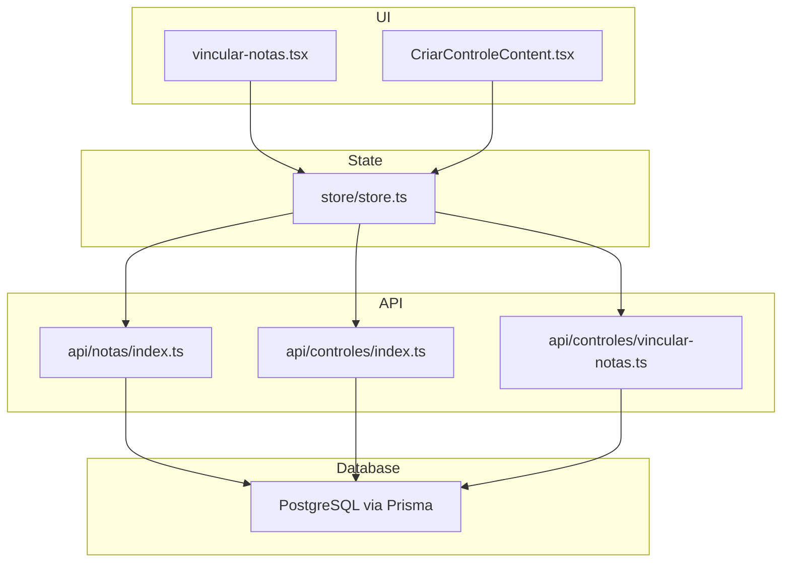
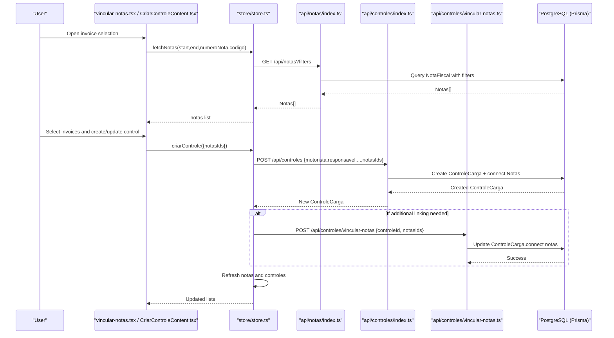
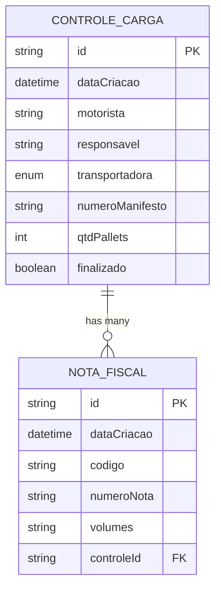
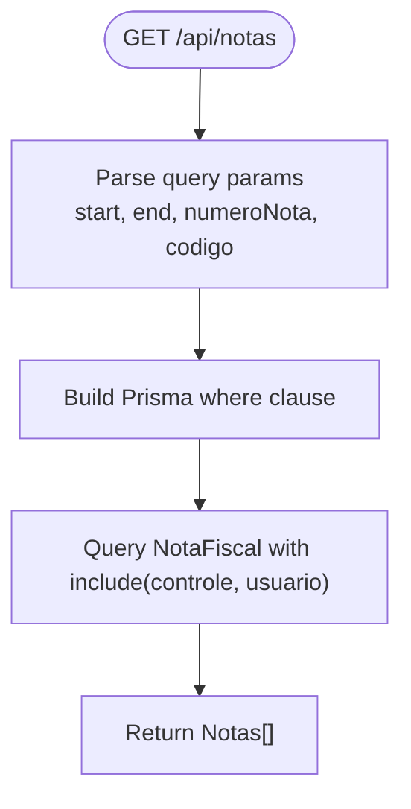
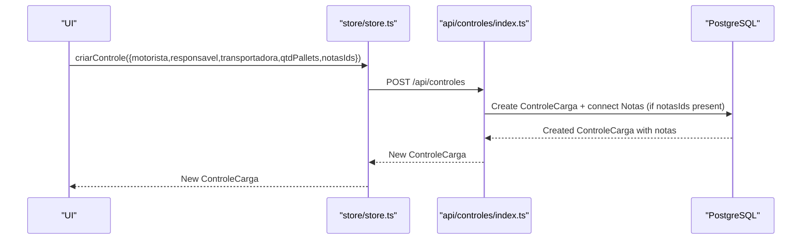
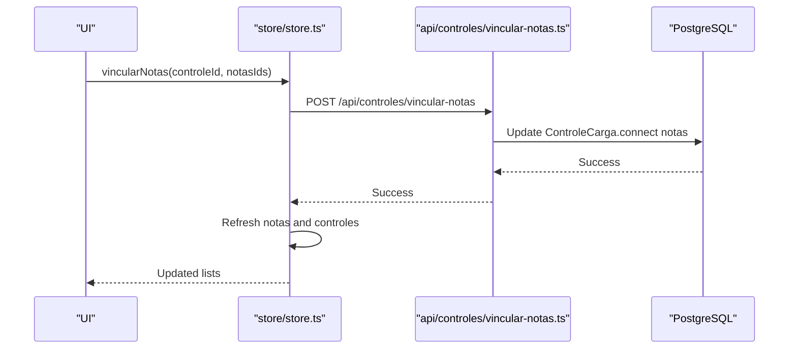
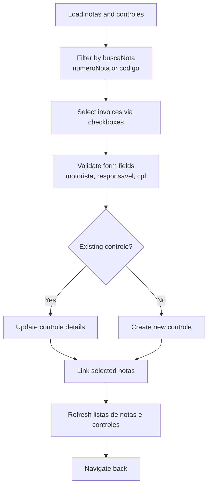
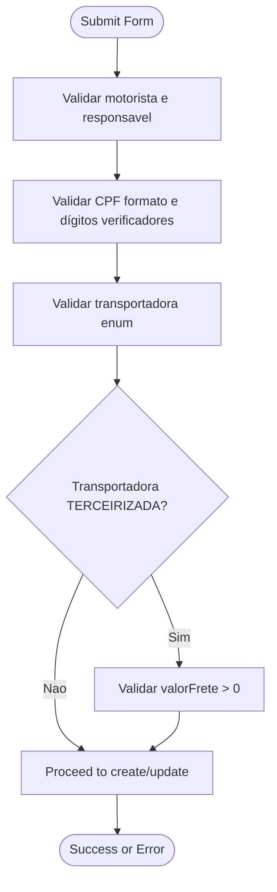
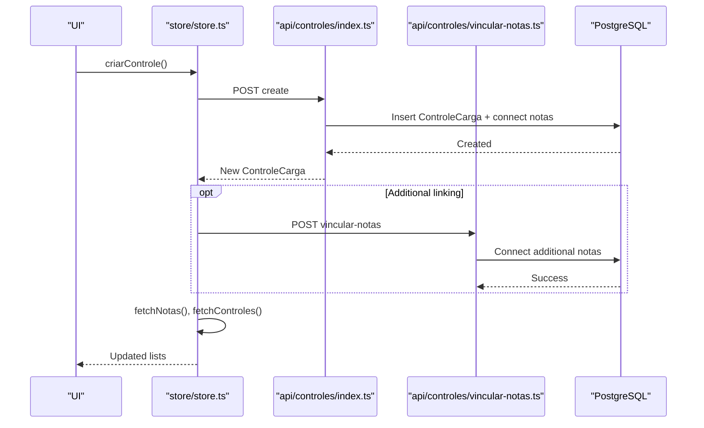
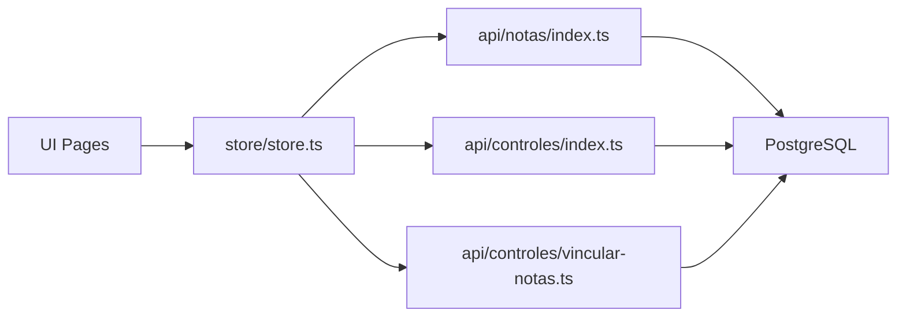

# Invoice Linking & Integration

<cite>
**Referenced Files in This Document**
- [schema.prisma](file://prisma/schema.prisma)
- [pages/api/notas/index.ts](file://pages/api/notas/index.ts)
- [pages/api/controles/index.ts](file://pages/api/controles/index.ts)
- [pages/api/controles/vincular-notas.ts](file://pages/api/controles/vincular-notas.ts)
- [store/store.ts](file://store/store.ts)
- [components/CriarControleContent.tsx](file://components/CriarControleContent.tsx)
- [pages/vincular-notas.tsx](file://pages/vincular-notas.tsx)
</cite>

## Table of Contents
1. Introduction
2. Project Structure
3. Core Components
4. Architecture Overview
5. Detailed Component Analysis
6. Dependency Analysis
7. Performance Considerations
8. Troubleshooting Guide
9. Conclusion

## Introduction
This document explains how invoices (Nota Fiscal) are fetched, filtered, and linked to cargo controls (Controle Carga). It covers the one-to-many relationship between a cargo control and its invoices, data consistency rules, the invoice selection interface, available filters, validation rules, examples of linking multiple invoices to a single cargo control, handling invoice status changes, and data synchronization across the application.

## Project Structure
The invoice-linking feature spans UI components, a state store, and API endpoints:
- Data model defines the relationship between Nota Fiscal and Controle Carga.
- API endpoints provide filtering for invoices and creation/linking of cargo controls with invoices.
- The store orchestrates fetching and linking operations.
- UI pages allow selecting and linking invoices during cargo control creation or editing.

**Diagram sources**
- [pages/vincular-notas.tsx:1-619](file://pages/vincular-notas.tsx#L1-L619)
- [components/CriarControleContent.tsx:1-800](file://components/CriarControleContent.tsx#L1-L800)
- [store/store.ts:1-567](file://store/store.ts#L1-L567)
- [pages/api/notas/index.ts:1-87](file://pages/api/notas/index.ts#L1-L87)
- [pages/api/controles/index.ts:1-121](file://pages/api/controles/index.ts#L1-L121)
- [pages/api/controles/vincular-notas.ts:1-31](file://pages/api/controles/vincular-notas.ts#L1-L31)

**Section sources**
- [schema.prisma:11-67](file://prisma/schema.prisma#L11-L67)
- [pages/api/notas/index.ts:1-87](file://pages/api/notas/index.ts#L1-L87)
- [pages/api/controles/index.ts:1-121](file://pages/api/controles/index.ts#L1-L121)
- [pages/api/controles/vincular-notas.ts:1-31](file://pages/api/controles/vincular-notas.ts#L1-L31)
- [store/store.ts:1-567](file://store/store.ts#L1-L567)
- [components/CriarControleContent.tsx:1-800](file://components/CriarControleContent.tsx#L1-L800)
- [pages/vincular-notas.tsx:1-619](file://pages/vincular-notas.tsx#L1-L619)

## Core Components
- Data model: Nota Fiscal and Controle Carga with a one-to-many relationship from Controle Carga to Nota Fiscal.
- Invoice fetch/filter API: Supports date range, invoice number, and code filters.
- Cargo control creation API: Accepts optional invoice IDs to link at creation time.
- Invoice linking API: Connects existing invoices to an existing cargo control.
- Store: Orchestrates fetching notes, creating controls, and linking notes; refreshes lists after changes.
- UI: Two primary flows:
  - Create/Edit cargo control with invoice selection and search.
  - Inline invoice selection during cargo control creation.

Key relationships and constraints:
- One cargo control can have many invoices.
- Each invoice belongs to at most one cargo control (via controleId).
- Filtering supports searching by invoice number and code.
- Creation supports linking zero or more invoices atomically.

**Section sources**
- [schema.prisma:11-67](file://prisma/schema.prisma#L11-L67)
- [pages/api/notas/index.ts:1-87](file://pages/api/notas/index.ts#L1-L87)
- [pages/api/controles/index.ts:1-121](file://pages/api/controles/index.ts#L1-L121)
- [pages/api/controles/vincular-notas.ts:1-31](file://pages/api/controles/vincular-notas.ts#L1-L31)
- [store/store.ts:51-74](file://store/store.ts#L51-L74)

## Architecture Overview
End-to-end flow for linking invoices to a cargo control:

**Diagram sources**
- [pages/vincular-notas.tsx:74-119](file://pages/vincular-notas.tsx#L74-L119)
- [store/store.ts:83-123](file://store/store.ts#L83-L123)
- [store/store.ts:269-397](file://store/store.ts#L269-L397)
- [pages/api/notas/index.ts:1-87](file://pages/api/notas/index.ts#L1-L87)
- [pages/api/controles/index.ts:64-116](file://pages/api/controles/index.ts#L64-L116)
- [pages/api/controles/vincular-notas.ts:1-31](file://pages/api/controles/vincular-notas.ts#L1-L31)

## Detailed Component Analysis

### Data Model and Relationships
- Controle Carga has a one-to-many relation to Nota Fiscal via a collection field.
- Nota Fiscal holds a foreign key controleId pointing to a single Controle Carga.
- This enforces that an invoice can be linked to only one cargo control at a time.

**Diagram sources**
- [schema.prisma:11-67](file://prisma/schema.prisma#L11-L67)

**Section sources**
- [schema.prisma:11-67](file://prisma/schema.prisma#L11-L67)

### Invoice Fetching and Filtering
- The invoice list endpoint supports:
  - Date range filter on creation date.
  - Partial match on invoice number (case-insensitive).
  - Partial match on internal code (case-insensitive).
- Results include related cargo control info and user who created the invoice.

**Diagram sources**
- [pages/api/notas/index.ts:1-87](file://pages/api/notas/index.ts#L1-L87)

**Section sources**
- [pages/api/notas/index.ts:1-87](file://pages/api/notas/index.ts#L1-L87)

### Creating a Cargo Control with Invoices
- The create endpoint accepts optional notasIds. When provided, it connects those invoices to the newly created cargo control in a single transactional operation.
- If no notasIds are provided, the control is created without invoice links.

**Diagram sources**
- [store/store.ts:269-397](file://store/store.ts#L269-L397)
- [pages/api/controles/index.ts:64-116](file://pages/api/controles/index.ts#L64-L116)

**Section sources**
- [pages/api/controles/index.ts:64-116](file://pages/api/controles/index.ts#L64-L116)
- [store/store.ts:269-397](file://store/store.ts#L269-L397)

### Linking Existing Invoices to a Cargo Control
- Dedicated endpoint to connect existing invoices to an existing cargo control using Prisma’s connect operation.
- Validates input and returns success or error messages.

**Diagram sources**
- [store/store.ts:399-412](file://store/store.ts#L399-L412)
- [pages/api/controles/vincular-notas.ts:1-31](file://pages/api/controles/vincular-notas.ts#L1-L31)

**Section sources**
- [pages/api/controles/vincular-notas.ts:1-31](file://pages/api/controles/vincular-notas.ts#L1-L31)
- [store/store.ts:399-412](file://store/store.ts#L399-L412)

### Invoice Selection Interface and Filters
- The invoice selection page loads all invoices and allows:
  - Searching by invoice number or code.
  - Toggling checkboxes to select invoices.
  - Indicating already-linked invoices with a chip label.
- On save, it either creates a new cargo control or updates an existing one, then links selected invoices.

**Diagram sources**
- [pages/vincular-notas.tsx:74-119](file://pages/vincular-notas.tsx#L74-L119)
- [pages/vincular-notas.tsx:229-327](file://pages/vincular-notas.tsx#L229-L327)
- [pages/vincular-notas.tsx:334-339](file://pages/vincular-notas.tsx#L334-L339)

**Section sources**
- [pages/vincular-notas.tsx:74-119](file://pages/vincular-notas.tsx#L74-L119)
- [pages/vincular-notas.tsx:229-327](file://pages/vincular-notas.tsx#L229-L327)
- [pages/vincular-notas.tsx:334-339](file://pages/vincular-notas.tsx#L334-L339)

### Validation Rules
- Form-level validations:
  - Motorista and Responsavel required.
  - CPF validated for length and checksum digits.
- Invoice-level validations:
  - Barcode format checks when scanning or entering manually.
  - Duplicate detection for scanned invoices within the session.
- Backend validations:
  - Required fields for cargo control creation.
  - Transportadora must be a valid enum value.
  - Optional freteInformado and valorFrete handled conditionally.

**Diagram sources**
- [pages/vincular-notas.tsx:134-227](file://pages/vincular-notas.tsx#L134-L227)
- [components/CriarControleContent.tsx:286-333](file://components/CriarControleContent.tsx#L286-L333)
- [store/store.ts:269-397](file://store/store.ts#L269-L397)

**Section sources**
- [pages/vincular-notas.tsx:134-227](file://pages/vincular-notas.tsx#L134-L227)
- [components/CriarControleContent.tsx:286-333](file://components/CriarControleContent.tsx#L286-L333)
- [store/store.ts:269-397](file://store/store.ts#L269-L397)

### Examples: Linking Multiple Invoices to a Single Cargo Control
- Scenario 1: Create a new cargo control and link multiple invoices at once.
  - Select multiple invoices in the invoice selection page.
  - Fill required fields (motorista, responsavel, cpf).
  - Confirm creation; backend creates the control and connects selected invoices.
- Scenario 2: Update an existing cargo control and add more invoices.
  - Load existing control details.
  - Add/remove invoices from selection.
  - Confirm update; backend updates control details and links selected invoices.

These flows are implemented through:
- Creation path: store.createControle -> api/controles POST with notasIds.
- Linking path: store.vincularNotas -> api/controles/vincular-notas POST.

**Section sources**
- [store/store.ts:269-397](file://store/store.ts#L269-L397)
- [store/store.ts:399-412](file://store/store.ts#L399-L412)
- [pages/api/controles/index.ts:64-116](file://pages/api/controles/index.ts#L64-L116)
- [pages/api/controles/vincular-notas.ts:1-31](file://pages/api/controles/vincular-notas.ts#L1-L31)

### Handling Invoice Status Changes
- There is no explicit “status” field on Nota Fiscal in the schema; linkage is represented by controleId presence.
- To reflect changes:
  - Linking sets controleId on the invoice.
  - Unlinking would require clearing controleId (not currently exposed via API).
- For reporting and display:
  - Filter controls by invoice number to see which controls contain specific invoices.
  - Use the invoice list to check if an invoice is already linked to another control.

**Section sources**
- [schema.prisma:55-67](file://prisma/schema.prisma#L55-L67)
- [pages/api/controles/index.ts:23-32](file://pages/api/controles/index.ts#L23-L32)
- [pages/vincular-notas.tsx:523-547](file://pages/vincular-notas.tsx#L523-L547)

### Data Synchronization Between Invoices and Cargo Controls
- After linking or updating, the store refreshes both invoice and control lists to keep UI consistent.
- The create flow optionally calls the linking endpoint if additional invoices need to be connected post-creation.
- Errors during linking do not abort the creation flow but are logged; subsequent refresh ensures eventual consistency.

**Diagram sources**
- [store/store.ts:269-397](file://store/store.ts#L269-L397)
- [store/store.ts:399-412](file://store/store.ts#L399-L412)

**Section sources**
- [store/store.ts:269-397](file://store/store.ts#L269-L397)
- [store/store.ts:399-412](file://store/store.ts#L399-L412)

## Dependency Analysis
- UI depends on the store for data operations and side effects.
- Store depends on API endpoints for persistence and retrieval.
- APIs depend on Prisma client to interact with PostgreSQL.
- Schema enforces referential integrity between Nota Fiscal and Controle Carga.

**Diagram sources**
- [pages/vincular-notas.tsx:1-619](file://pages/vincular-notas.tsx#L1-L619)
- [store/store.ts:1-567](file://store/store.ts#L1-L567)
- [pages/api/notas/index.ts:1-87](file://pages/api/notas/index.ts#L1-L87)
- [pages/api/controles/index.ts:1-121](file://pages/api/controles/index.ts#L1-L121)
- [pages/api/controles/vincular-notas.ts:1-31](file://pages/api/controles/vincular-notas.ts#L1-L31)

**Section sources**
- [store/store.ts:1-567](file://store/store.ts#L1-L567)
- [pages/api/notas/index.ts:1-87](file://pages/api/notas/index.ts#L1-L87)
- [pages/api/controles/index.ts:1-121](file://pages/api/controles/index.ts#L1-L121)
- [pages/api/controles/vincular-notas.ts:1-31](file://pages/api/controles/vincular-notas.ts#L1-L31)

## Performance Considerations
- Use date range filters to limit invoice queries to relevant periods.
- Leverage partial matching on invoice number and code for faster searches.
- Avoid unnecessary re-fetching; rely on store refresh only after mutations.
- Consider pagination for large invoice datasets if needed in future enhancements.

[No sources needed since this section provides general guidance]

## Troubleshooting Guide
Common issues and resolutions:
- Invoice not appearing in selection:
  - Verify filters (date range, invoice number, code).
  - Ensure the invoice exists and is not already linked to another control.
- Linking fails:
  - Check network responses and logs for errors.
  - Confirm that the cargo control ID and invoice IDs are valid.
- Duplicate invoice scan:
  - The UI prevents adding the same invoice twice in the session.
- CPF validation errors:
  - Ensure CPF has correct format and checksum digits.

**Section sources**
- [pages/api/notas/index.ts:1-87](file://pages/api/notas/index.ts#L1-L87)
- [pages/api/controles/vincular-notas.ts:1-31](file://pages/api/controles/vincular-notas.ts#L1-L31)
- [pages/vincular-notas.tsx:134-227](file://pages/vincular-notas.tsx#L134-L227)
- [store/store.ts:269-397](file://store/store.ts#L269-L397)

## Conclusion
The system provides a robust mechanism to fetch, filter, and link invoices to cargo controls with clear one-to-many relationships enforced by the database schema. The UI offers intuitive invoice selection with search and validation, while the store coordinates data operations and ensures synchronization across the application. By leveraging date-based filters and partial matching, users can efficiently manage large sets of invoices and maintain data consistency throughout the workflow.