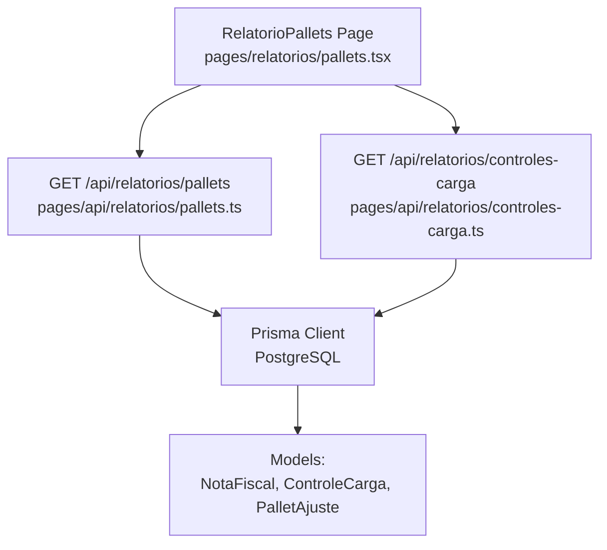
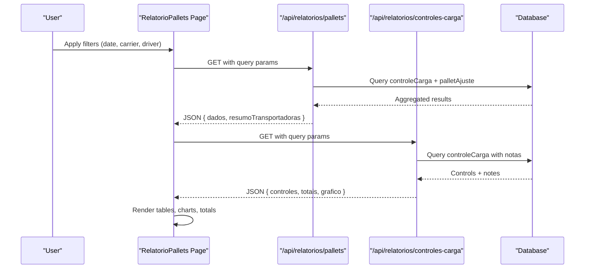
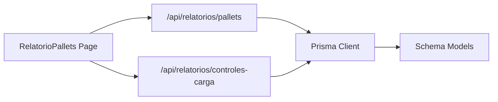
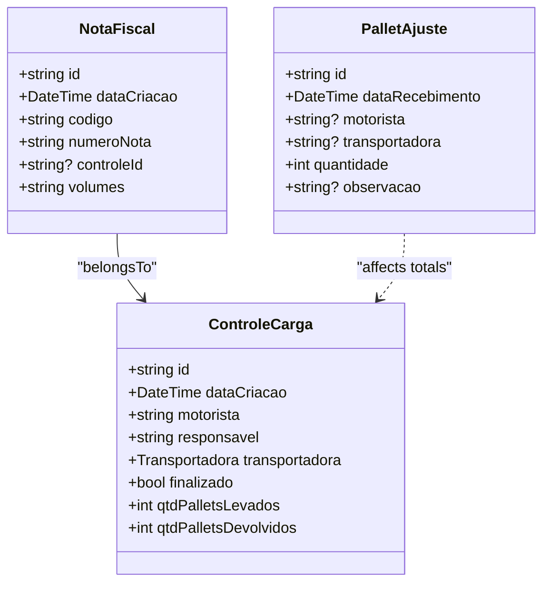
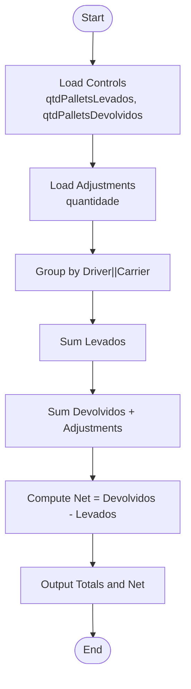

# Volume & Pallet Management

<cite>
**Referenced Files in This Document**
- [schema.prisma](file://prisma/schema.prisma)
- [controles-carga.ts](file://pages/api/relatorios/controles-carga.ts)
- [pallets.ts (API)](file://pages/api/relatorios/pallets.ts)
- [pallets.tsx (Report UI)](file://pages/relatorios/pallets.tsx)
- [controles.tsx (Page)](file://pages/controles.tsx)
</cite>

## Table of Contents
1. [Introduction](#introduction)
2. [Project Structure](#project-structure)
3. [Core Components](#core-components)
4. [Architecture Overview](#architecture-overview)
5. [Detailed Component Analysis](#detailed-component-analysis)
6. [Dependency Analysis](#dependency-analysis)
7. [Performance Considerations](#performance-considerations)
8. [Troubleshooting Guide](#troubleshooting-guide)
9. [Conclusion](#conclusion)
10. [Appendices](#appendices)

## Introduction
This document explains how the cargo control system manages volumes and pallets, including:
- How total volumes are derived from invoices (notes)
- How pallet quantities are tracked as picked up and returned
- How these metrics influence cargo control status
- Validation rules for volume inputs and automatic calculations
- Integration with inventory/logistics snapshots and downstream processes
- Examples for managing different types of volumes and pallets, handling partial shipments, and generating volume reports

## Project Structure
The volume and pallet management spans data models, API endpoints, and UI pages:
- Data model defines cargo controls, invoices, and pallet adjustments
- APIs aggregate totals and produce reports
- UI provides filtering, summaries, and PDF receipts for pallet adjustments

**Diagram sources**
- [pallets.tsx (Report UI):101-130](file://pages/relatorios/pallets.tsx#L101-L130)
- [pallets.ts (API):14-45](file://pages/api/relatorios/pallets.ts#L14-L45)
- [controles-carga.ts:14-51](file://pages/api/relatorios/controles-carga.ts#L14-L51)
- [schema.prisma:11-67](file://prisma/schema.prisma#L11-L67)

**Section sources**
- [schema.prisma:11-67](file://prisma/schema.prisma#L11-L67)
- [pallets.ts (API):14-45](file://pages/api/relatorios/pallets.ts#L14-L45)
- [controles-carga.ts:14-51](file://pages/api/relatorios/controles-carga.ts#L14-L51)
- [pallets.tsx (Report UI):101-130](file://pages/relatorios/pallets.tsx#L101-L130)

## Core Components
- Cargo Control (ControleCarga)
  - Tracks per-control pallet counts: qtdPalletsLevados (picked up), qtdPalletsDevolvidos (returned)
  - Status derived from finalizado flag
- Invoice (NotaFiscal)
  - Stores volumes per invoice via a string field volumes (default "1")
- Pallet Adjustment (PalletAjuste)
  - Records ad-hoc returns of pallets not tied to a specific control
- Reports
  - Aggregates totals by driver/carrier and computes net pallet differences
  - Produces summaries and timeline data for dashboards

Key fields and relationships:
- NotaFiscal.volumes: String representing number of volumes per invoice
- ControleCarga.qtdPalletsLevados/qtdPalletsDevolvidos: Integers tracking pallet movement
- PalletAjuste.quantidade: Integer adjustment added to returned pallets

**Section sources**
- [schema.prisma:11-67](file://prisma/schema.prisma#L11-L67)
- [schema.prisma:246-261](file://prisma/schema.prisma#L246-L261)

## Architecture Overview
End-to-end flow for volume and pallet reporting:
- UI filters by date range, carrier, and driver
- API queries database for controls and adjustments
- Aggregation computes totals and net differences
- Report UI displays summaries and detailed tables
- Optional PDF receipt generation for pallet adjustments

**Diagram sources**
- [pallets.tsx (Report UI):101-130](file://pages/relatorios/pallets.tsx#L101-L130)
- [pallets.ts (API):14-45](file://pages/api/relatorios/pallets.ts#L14-L45)
- [controles-carga.ts:14-51](file://pages/api/relatorios/controles-carga.ts#L14-L51)

## Detailed Component Analysis

### Data Model: Volumes and Pallets
- NotaFiscal.volumes
  - Type: String; default "1"
  - Represents the number of volumes associated with an invoice
- ControleCarga
  - qtdPalletsLevados: Number of pallets picked up
  - qtdPalletsDevolvidos: Number of pallets returned
  - finalizado: Boolean used to derive status
- PalletAjuste
  - quantidade: Number of pallets returned via ad-hoc adjustment
  - Links to user and optional driver/carrier metadata

Complexity considerations:
- Aggregation is O(n) over controls and adjustments
- Filtering by date and carrier reduces dataset size before aggregation

**Section sources**
- [schema.prisma:11-67](file://prisma/schema.prisma#L11-L67)
- [schema.prisma:246-261](file://prisma/schema.prisma#L246-L261)

### API: Pallets Report
- Filters: dataInicio, dataFim, transportadora, motorista
- Queries:
  - controleCarga selecting pallet counts
  - palletAjuste selecting quantities for adjustments
- Aggregation:
  - Groups by driver||carrier
  - Computes totalPalletsLevados, totalPalletsDevolvidos, totalPalletsLiquido
  - Builds carrier-level summary

Validation and error handling:
- Method check (GET only)
- Graceful fallback if palletAjuste table is missing or empty

**Section sources**
- [pallets.ts (API):14-45](file://pages/api/relatorios/pallets.ts#L14-L45)
- [pallets.ts (API):47-81](file://pages/api/relatorios/pallets.ts#L47-L81)
- [pallets.ts (API):83-151](file://pages/api/relatorios/pallets.ts#L83-L151)

### API: Cargo Controls Report
- Filters: dataInicio, dataFim, transportadora, motorista, status
- Queries:
  - controleCarga with related notas
- Aggregation:
  - Totals for pallets levados/devolvidos
  - Status counters (FINALIZADO/PENDENTE)
  - Carrier and driver summaries
  - Timeline labels and values

Status derivation:
- finalizado true => FINALIZADO
- finalizado false => PENDENTE

**Section sources**
- [controles-carga.ts:14-51](file://pages/api/relatorios/controles-carga.ts#L14-L51)
- [controles-carga.ts:53-152](file://pages/api/relatorios/controles-carga.ts#L53-L152)
- [controles-carga.ts:154-197](file://pages/api/relatorios/controles-caga.ts#L154-L197)

### UI: Pallets Report Page
- Filters: date range, carrier, driver
- Fetches data from both pallets and controls APIs
- Displays:
  - Carrier summary cards
  - Driver-level table with totals and net difference
- Features:
  - Optional pallet adjustment dialog
  - PDF receipt generation for adjustments
  - Availability check for pallet adjustment feature

Validation:
- Requires positive quantity for adjustments
- Checks availability endpoint to detect missing database table

**Section sources**
- [pallets.tsx (Report UI):101-130](file://pages/relatorios/pallets.tsx#L101-L130)
- [pallets.tsx (Report UI):136-174](file://pages/relatorios/pallets.tsx#L136-L174)
- [pallets.tsx (Report UI):391-431](file://pages/relatorios/pallets.tsx#L391-L431)

### Volume Calculation Logic
Volumes are stored per invoice as a string. When aggregating totals:
- If volumes are numeric strings, they can be parsed to integers for summation
- Default value is "1" when no explicit volume is set
- For reporting, ensure consistent parsing and validation to avoid NaN or invalid sums

Recommendations:
- Validate that volumes contain only digits
- Normalize empty or whitespace-only values to "1"
- Store validated integer values where possible to simplify calculations

**Section sources**
- [schema.prisma:55-67](file://prisma/schema.prisma#L55-L67)

### Pallet Quantities and Net Difference
- Net difference = totalPalletsDevolvidos - totalPalletsLevados
- Positive indicates more returned than picked up (surplus)
- Negative indicates fewer returned than picked up (shortage)

Adjustments:
- PalletAjuste entries add to totalPalletsDevolvidos for the corresponding driver/carrier grouping
- Useful for recording ad-hoc returns outside of a specific control

**Section sources**
- [pallets.ts (API):83-120](file://pages/api/relatorios/pallets.ts#L83-L120)
- [schema.prisma:246-261](file://prisma/schema.prisma#L246-L261)

### Impact on Cargo Control Status
- Status is derived from finalizado flag
- While pallet counts do not directly change status, they inform operational decisions:
  - Discrepancies may trigger follow-up actions
  - Finalization often occurs after reconciliation of pallets and signatures

**Section sources**
- [controles-carga.ts:41-45](file://pages/api/relatorios/controles-carga.ts#L41-L45)
- [schema.prisma:11-42](file://prisma/schema.prisma#L11-L42)

### Integration with Inventory Systems
- The codebase includes logistics snapshot models and synchronization mechanisms
- These enable linking orders and invoices to logistical states, which can influence:
  - Whether items are considered shipped or delivered
  - Reconciliation between expected vs actual volumes/pallets

Note: Specific integration points depend on external services and synchronization jobs not fully detailed here.

**Section sources**
- [schema.prisma:127-176](file://prisma/schema.prisma#L127-L176)

### Examples and Workflows

#### Managing Different Types of Volumes
- Invoices with single volume: default "1"
- Invoices with multiple volumes: store as numeric string (e.g., "5")
- Ensure consistent parsing across reports

#### Handling Partial Shipments
- Multiple invoices can be linked to a single control
- Sum volumes across all invoices for total shipment volume
- Track pallets levados/devolvidos per control to reconcile partial movements

#### Generating Volume Reports
- Use the pallets report page to filter by date, carrier, and driver
- Review carrier summaries and driver-level details
- Export or print PDF receipts for pallet adjustments

**Section sources**
- [pallets.tsx (Report UI):101-130](file://pages/relatorios/pallets.tsx#L101-L130)
- [pallets.ts (API):83-151](file://pages/api/relatorios/pallets.ts#L83-L151)

## Dependency Analysis
- UI depends on two API endpoints for comprehensive reporting
- APIs depend on Prisma client and PostgreSQL schema
- Schema defines relationships between controls, invoices, and adjustments

**Diagram sources**
- [pallets.tsx (Report UI):101-130](file://pages/relatorios/pallets.tsx#L101-L130)
- [pallets.ts (API):14-45](file://pages/api/relatorios/pallets.ts#L14-L45)
- [controles-carga.ts:14-51](file://pages/api/relatorios/controles-carga.ts#L14-L51)
- [schema.prisma:11-67](file://prisma/schema.prisma#L11-L67)

**Section sources**
- [pallets.ts (API):14-45](file://pages/api/relatorios/pallets.ts#L14-L45)
- [controles-carga.ts:14-51](file://pages/api/relatorios/controles-carga.ts#L14-L51)
- [schema.prisma:11-67](file://prisma/schema.prisma#L11-L67)

## Performance Considerations
- Filter early: apply date range and carrier/driver filters to reduce dataset size
- Index usage: ensure indexes on frequently filtered columns (dataCriacao, transportadora, motorista)
- Aggregation efficiency: group by composite keys (driver||carrier) to minimize repeated scans
- Avoid heavy computations in UI; rely on server-side aggregation

[No sources needed since this section provides general guidance]

## Troubleshooting Guide
Common issues and resolutions:
- Missing pallet adjustment table
  - Symptom: API returns 503 or empty adjustments
  - Resolution: Create the palletAjuste table using provided instructions or scripts
- Invalid volume values
  - Symptom: NaN or unexpected totals in reports
  - Resolution: Validate and normalize volumes to numeric strings; enforce minimum of "1"
- Incorrect status display
  - Symptom: Status does not match expectations
  - Resolution: Verify finalizado flag and ensure updates propagate correctly

**Section sources**
- [pallets.tsx (Report UI):136-174](file://pages/relatorios/pallets.tsx#L136-L174)
- [pallets.ts (API):71-81](file://pages/api/relatorios/pallets.ts#L71-L81)
- [controles-carga.ts:41-45](file://pages/api/relatorios/controles-carga.ts#L41-L45)

## Conclusion
The cargo control system provides robust tracking of volumes and pallets through clear data models, well-defined APIs, and a user-friendly report interface. By validating volume inputs, computing accurate totals and net differences, and integrating with logistics snapshots, the system supports informed decision-making for partial shipments, reconciliations, and operational workflows.

[No sources needed since this section summarizes without analyzing specific files]

## Appendices

### Class Diagram: Core Entities

**Diagram sources**
- [schema.prisma:11-67](file://prisma/schema.prisma#L11-L67)
- [schema.prisma:246-261](file://prisma/schema.prisma#L246-L261)

### Flowchart: Pallet Net Difference Calculation

**Diagram sources**
- [pallets.ts (API):83-120](file://pages/api/relatorios/pallets.ts#L83-L120)