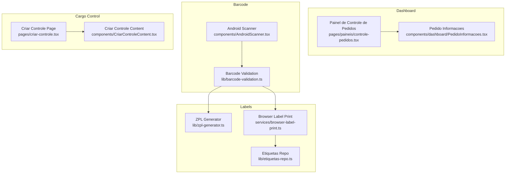
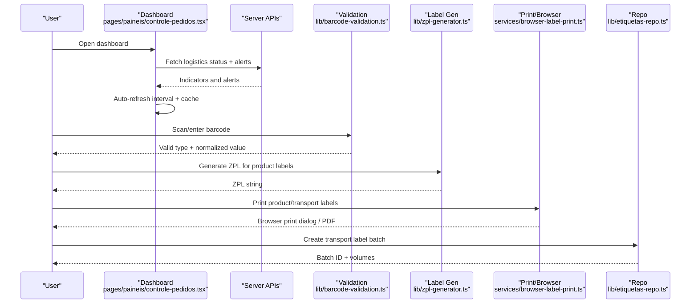
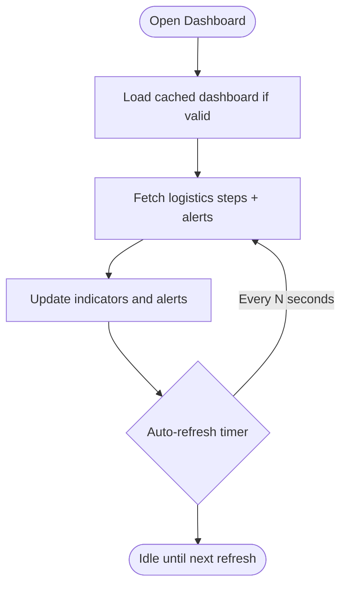
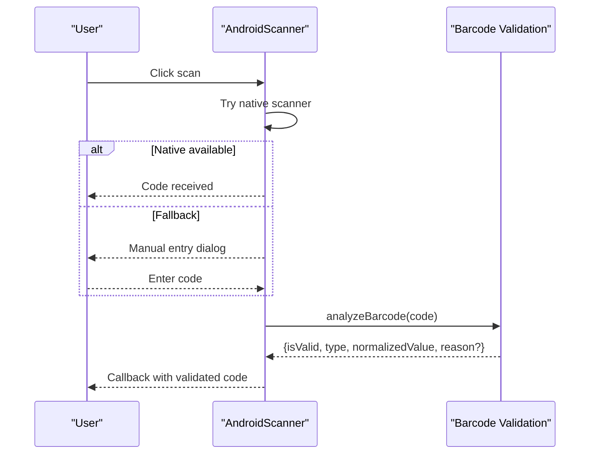
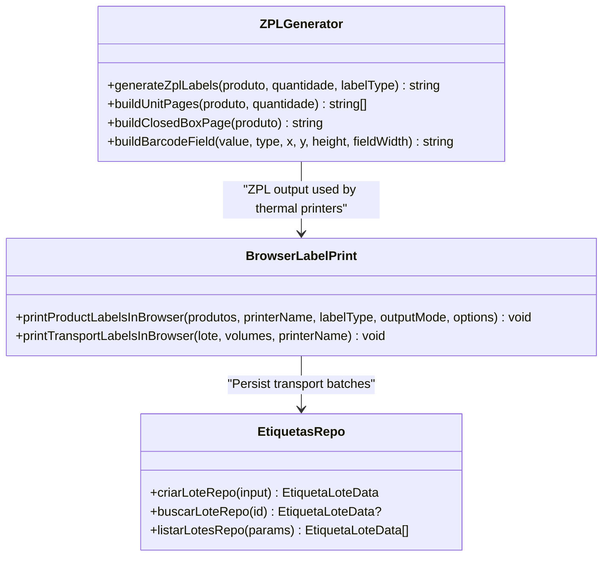
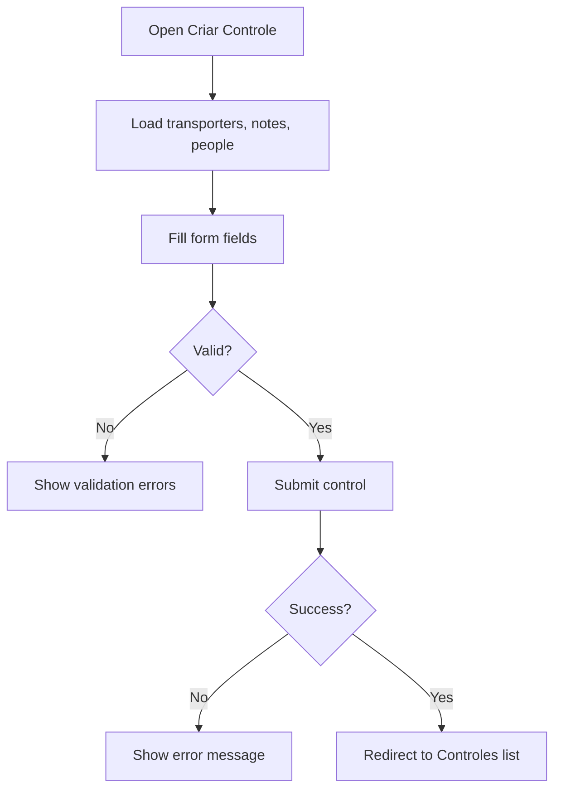
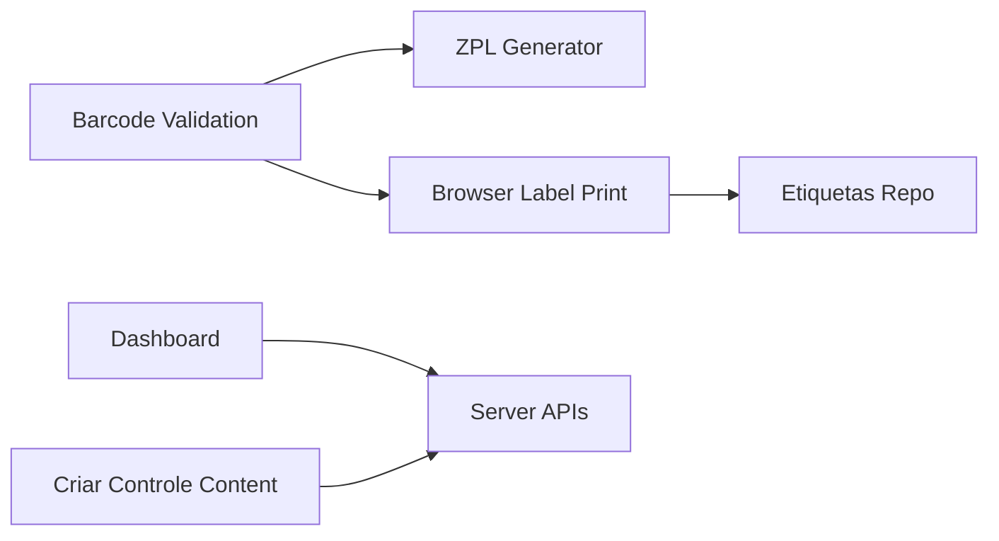

# Core Features

<cite>
**Referenced Files in This Document**
- [README.md](file://README.md)
- [pages/paineis/controle-pedidos.tsx](file://pages/paineis/controle-pedidos.tsx)
- [components/dashboard/PedidoInformacoes.tsx](file://components/dashboard/PedidoInformacoes.tsx)
- [components/AndroidScanner.tsx](file://components/AndroidScanner.tsx)
- [lib/barcode-validation.ts](file://lib/barcode-validation.ts)
- [lib/zpl-generator.ts](file://lib/zpl-generator.ts)
- [services/browser-label-print.ts](file://services/browser-label-print.ts)
- [lib/etiquetas-repo.ts](file://lib/etiquetas-repo.ts)
- [pages/criar-controle.tsx](file://pages/criar-controle.tsx)
- [components/CriarControleContent.tsx](file://components/CriarControleContent.tsx)
</cite>

## Table of Contents
1. Introduction
2. Project Structure
3. Core Components
4. Architecture Overview
5. Detailed Component Analysis
6. Dependency Analysis
7. Performance Considerations
8. Troubleshooting Guide
9. Conclusion

## Introduction
This document explains the core features of the Control Carga system with a focus on:
- Logistics dashboard with real-time order monitoring
- Barcode scanning and validation
- Label generation and printing (product and transport labels)
- Cargo control management
- Invoice processing integration points

It covers user workflows, technical implementation, examples, performance considerations, error handling, and UX optimizations for each feature.

## Project Structure
The application is a Next.js-based web system organized into pages, components, libraries, services, and data access layers. Key areas relevant to this documentation:
- Dashboard and logistics overview: pages/paineis/controle-pedidos.tsx and related components
- Barcode scanning and validation: components/AndroidScanner.tsx and lib/barcode-validation.ts
- Label generation/printing: lib/zpl-generator.ts and services/browser-label-print.ts
- Cargo control creation: pages/criar-controle.tsx and components/CriarControleContent.tsx
- Transport label batches and persistence: lib/etiquetas-repo.ts

**Diagram sources**
- [pages/paineis/controle-pedidos.tsx:1-266](file://pages/paineis/controle-pedidos.tsx#L1-L266)
- [components/dashboard/PedidoInformacoes.tsx:1-80](file://components/dashboard/PedidoInformacoes.tsx#L1-L80)
- [components/AndroidScanner.tsx:1-224](file://components/AndroidScanner.tsx#L1-L224)
- [lib/barcode-validation.ts:1-89](file://lib/barcode-validation.ts#L1-L89)
- [lib/zpl-generator.ts:1-171](file://lib/zpl-generator.ts#L1-L171)
- [services/browser-label-print.ts:1-800](file://services/browser-label-print.ts#L1-L800)
- [lib/etiquetas-repo.ts:1-309](file://lib/etiquetas-repo.ts#L1-L309)
- [pages/criar-controle.tsx:1-62](file://pages/criar-controle.tsx#L1-L62)
- [components/CriarControleContent.tsx:1-800](file://components/CriarControleContent.tsx#L1-L800)

**Section sources**
- [README.md:1-84](file://README.md#L1-L84)

## Core Components
- Logistics Dashboard: Real-time indicators for order stages and alerts; auto-refresh and local caching for resilience.
- Barcode Scanning & Validation: Native Android scanner fallback to manual entry; robust EAN-13/EAN-8/CODE128 detection and checksum validation.
- Label Generation & Printing: ZPL generation for thermal printers and browser-based HTML preview for A4 or custom sizes; transport label batch persistence.
- Cargo Control Management: Form-driven creation of cargo controls with driver, carrier, vehicle, pallets, and optional freight value; validation and error handling.
- Invoice Processing: Integration points via barcode scanning and cargo control linking; endpoints referenced by UI flows.

**Section sources**
- [pages/paineis/controle-pedidos.tsx:1-266](file://pages/paineis/controle-pedidos.tsx#L1-L266)
- [components/AndroidScanner.tsx:1-224](file://components/AndroidScanner.tsx#L1-L224)
- [lib/barcode-validation.ts:1-89](file://lib/barcode-validation.ts#L1-L89)
- [lib/zpl-generator.ts:1-171](file://lib/zpl-generator.ts#L1-L171)
- [services/browser-label-print.ts:1-800](file://services/browser-label-print.ts#L1-L800)
- [lib/etiquetas-repo.ts:1-309](file://lib/etiquetas-repo.ts#L1-L309)
- [components/CriarControleContent.tsx:1-800](file://components/CriarControleContent.tsx#L1-L800)

## Architecture Overview
High-level flow from user actions to backend and output devices:

**Diagram sources**
- [pages/paineis/controle-pedidos.tsx:100-188](file://pages/paineis/controle-pedidos.tsx#L100-L188)
- [lib/barcode-validation.ts:42-89](file://lib/barcode-validation.ts#L42-L89)
- [lib/zpl-generator.ts:149-171](file://lib/zpl-generator.ts#L149-L171)
- [services/browser-label-print.ts:109-184](file://services/browser-label-print.ts#L109-L184)
- [lib/etiquetas-repo.ts:176-226](file://lib/etiquetas-repo.ts#L176-L226)

## Detailed Component Analysis

### Logistics Dashboard (Real-Time Order Monitoring)
- Purpose: Display current order stages and alerts with auto-refresh and local caching for resilience.
- User workflow:
  - Open the dashboard page; it loads initial data and sets up periodic refresh.
  - View stage cards and alert summaries; details can be expanded per order.
- Technical highlights:
  - Uses a hook to manage current dashboard state with local storage cache keys.
  - Calls server endpoints for logistics steps and alerts with force refresh and timestamp parameters.
  - Auto-refresh interval configured; fullscreen mode attempted for kiosk-like usage.
  - Lazy loading of per-order details with concurrency limits and intersection observer to avoid unnecessary requests.

**Diagram sources**
- [pages/paineis/controle-pedidos.tsx:100-188](file://pages/paineis/controle-pedidos.tsx#L100-L188)
- [components/dashboard/PedidoInformacoes.tsx:14-26](file://components/dashboard/PedidoInformacoes.tsx#L14-L26)

**Section sources**
- [pages/paineis/controle-pedidos.tsx:1-266](file://pages/paineis/controle-pedidos.tsx#L1-L266)
- [components/dashboard/PedidoInformacoes.tsx:1-80](file://components/dashboard/PedidoInformacoes.tsx#L1-L80)

### Barcode Scanning and Validation
- Purpose: Capture barcodes via native Android scanner or manual input; validate formats and compute checksums.
- User workflow:
  - Tap scan button; if native scanner available, use it; otherwise open manual entry dialog.
  - On success, pass code to upstream logic (e.g., add invoice or lookup product).
- Technical highlights:
  - Detects EAN-13, EAN-8, CODE128; validates checksums; returns analysis result with reason for invalid codes.
  - Provides safe fallback when native interface is unavailable.

**Diagram sources**
- [components/AndroidScanner.tsx:46-74](file://components/AndroidScanner.tsx#L46-L74)
- [lib/barcode-validation.ts:25-89](file://lib/barcode-validation.ts#L25-L89)

**Section sources**
- [components/AndroidScanner.tsx:1-224](file://components/AndroidScanner.tsx#L1-L224)
- [lib/barcode-validation.ts:1-89](file://lib/barcode-validation.ts#L1-L89)

### Label Generation and Printing
- Purpose: Generate printable labels for products and transport volumes; support ZPL for thermal printers and HTML previews for browsers.
- User workflow:
  - Select product(s) and quantity; choose label type (unit, closed box, A4 variants).
  - Generate ZPL for direct printer or open browser preview to print/PDF.
  - For transport labels, create a batch with generated volume codes and print one label per volume.
- Technical highlights:
  - ZPL generator builds unit and closed-box pages with barcode fields and text splitting; sanitizes content.
  - Browser label printer creates styled HTML with JSBarcode SVGs; supports multiple layouts and copies per product.
  - Transport label repo persists batches and volumes with dynamic column handling for compatibility.

**Diagram sources**
- [lib/zpl-generator.ts:1-171](file://lib/zpl-generator.ts#L1-L171)
- [services/browser-label-print.ts:109-184](file://services/browser-label-print.ts#L109-L184)
- [lib/etiquetas-repo.ts:176-226](file://lib/etiquetas-repo.ts#L176-L226)

**Section sources**
- [lib/zpl-generator.ts:1-171](file://lib/zpl-generator.ts#L1-L171)
- [services/browser-label-print.ts:1-800](file://services/browser-label-print.ts#L1-L800)
- [lib/etiquetas-repo.ts:1-309](file://lib/etiquetas-repo.ts#L1-L309)

### Cargo Control Management
- Purpose: Create cargo controls that link invoices and capture logistics details (driver, carrier, vehicle, pallets, freight).
- User workflow:
  - Navigate to “Create Control”; form preloads transporters, notes, and people.
  - Fill required fields; select carrier; optionally set freight value for third-party carriers.
  - Submit to create control; navigate back to list upon success.
- Technical highlights:
  - Validates inputs (carrier, driver, responsible, plate, pallet counts, freight value).
  - Handles errors with friendly messages and redirects on session expiry.
  - Integrates with store functions to fetch data and create control.

**Diagram sources**
- [pages/criar-controle.tsx:14-59](file://pages/criar-controle.tsx#L14-L59)
- [components/CriarControleContent.tsx:286-412](file://components/CriarControleContent.tsx#L286-L412)

**Section sources**
- [pages/criar-controle.tsx:1-62](file://pages/criar-controle.tsx#L1-L62)
- [components/CriarControleContent.tsx:1-800](file://components/CriarControleContent.tsx#L1-L800)

### Invoice Processing Integration Points
- Barcode scanning captures invoice numbers or product codes; validated codes feed into downstream processes (e.g., linking notes to controls).
- The cargo control creation flow includes selecting notes to associate with the control, enabling invoice linkage.
- Transport label batches include note numbers and client info for traceability.

**Section sources**
- [components/AndroidScanner.tsx:46-74](file://components/AndroidScanner.tsx#L46-L74)
- [lib/barcode-validation.ts:42-89](file://lib/barcode-validation.ts#L42-L89)
- [components/CriarControleContent.tsx:221-244](file://components/CriarControleContent.tsx#L221-L244)
- [lib/etiquetas-repo.ts:176-226](file://lib/etiquetas-repo.ts#L176-L226)

## Dependency Analysis
Key dependencies and relationships:
- Dashboard depends on server endpoints and uses local cache keys for resilience.
- Barcode validation is central to both scanning and label generation.
- Label generation relies on validated barcodes and produces either ZPL or HTML for browser printing.
- Transport label repository abstracts database operations with dynamic column checks for compatibility.
- Cargo control creation composes multiple services (transporters, notes, people) and enforces business rules.

**Diagram sources**
- [lib/barcode-validation.ts:42-89](file://lib/barcode-validation.ts#L42-L89)
- [lib/zpl-generator.ts:149-171](file://lib/zpl-generator.ts#L149-L171)
- [services/browser-label-print.ts:109-184](file://services/browser-label-print.ts#L109-L184)
- [lib/etiquetas-repo.ts:176-226](file://lib/etiquetas-repo.ts#L176-L226)
- [pages/paineis/controle-pedidos.tsx:120-163](file://pages/paineis/controle-pedidos.tsx#L120-L163)
- [components/CriarControleContent.tsx:221-244](file://components/CriarControleContent.tsx#L221-L244)

**Section sources**
- [lib/barcode-validation.ts:1-89](file://lib/barcode-validation.ts#L1-L89)
- [lib/zpl-generator.ts:1-171](file://lib/zpl-generator.ts#L1-L171)
- [services/browser-label-print.ts:1-800](file://services/browser-label-print.ts#L1-L800)
- [lib/etiquetas-repo.ts:1-309](file://lib/etiquetas-repo.ts#L1-L309)
- [pages/paineis/controle-pedidos.tsx:1-266](file://pages/paineis/controle-pedidos.tsx#L1-L266)
- [components/CriarControleContent.tsx:1-800](file://components/CriarControleContent.tsx#L1-L800)

## Performance Considerations
- Dashboard:
  - Local storage caching reduces network calls; auto-refresh interval balances freshness vs load.
  - Concurrency limit for per-order detail requests prevents overwhelming the ERP.
- Barcode:
  - Lightweight regex and checksum calculations ensure fast validation.
- Labels:
  - ZPL generation batches labels per page to minimize printer overhead.
  - Browser label printing constructs minimal DOM and uses efficient SVG generation.
  - Repository writes batches and volumes in blocks to avoid parameter limits.
- Cargo Control:
  - Parallel fetching of transporters, notes, and people improves initial load time.
  - Validation occurs before submission to reduce round trips.

[No sources needed since this section provides general guidance]

## Troubleshooting Guide
Common issues and resolutions:
- Dashboard not updating:
  - Check network connectivity and endpoint responses; verify cache keys match filters.
  - Inspect console for errors during fetch; ensure credentials are included.
- Barcode invalid:
  - Use the analysis result’s reason to guide correction (e.g., wrong checksum, unsupported format).
  - Ensure scanner hardware is functioning; fall back to manual entry if needed.
- Label generation fails:
  - Validate that product has a registered barcode for the selected label type.
  - For ZPL, confirm printer compatibility and darkness settings.
  - For browser print, allow popups and check printer selection.
- Cargo control creation errors:
  - Review validation messages; ensure all required fields are filled.
  - If session expired, re-authenticate and retry.

**Section sources**
- [pages/paineis/controle-pedidos.tsx:120-163](file://pages/paineis/controle-pedidos.tsx#L120-L163)
- [lib/barcode-validation.ts:42-89](file://lib/barcode-validation.ts#L42-L89)
- [lib/zpl-generator.ts:149-171](file://lib/zpl-generator.ts#L149-L171)
- [services/browser-label-print.ts:109-184](file://services/browser-label-print.ts#L109-L184)
- [components/CriarControleContent.tsx:286-412](file://components/CriarControleContent.tsx#L286-L412)

## Conclusion
Control Carga integrates real-time logistics visibility, robust barcode handling, flexible label generation, and comprehensive cargo control management. The architecture emphasizes reliability through caching, concurrency limits, and resilient data access patterns. By following the workflows and guidelines above, users can efficiently monitor orders, validate barcodes, generate accurate labels, and manage cargo controls with confidence.

[No sources needed since this section summarizes without analyzing specific files]