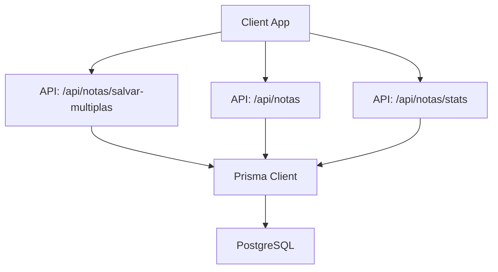
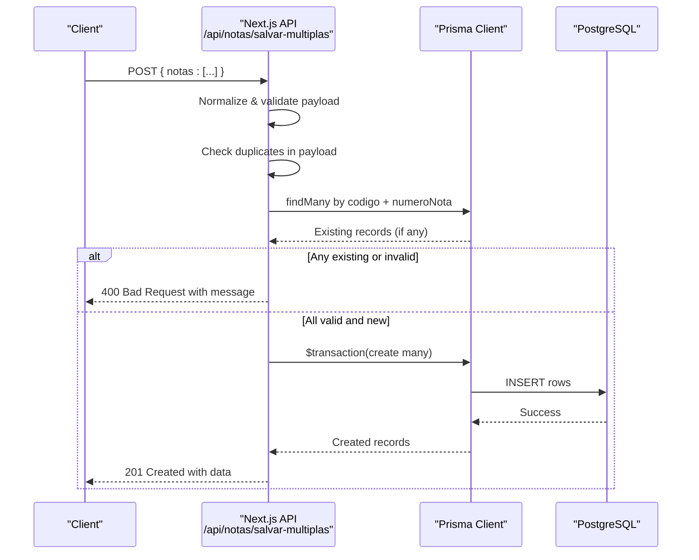
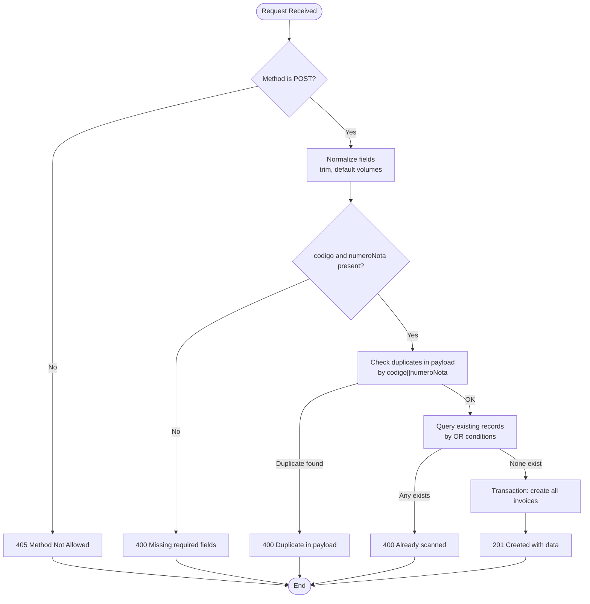
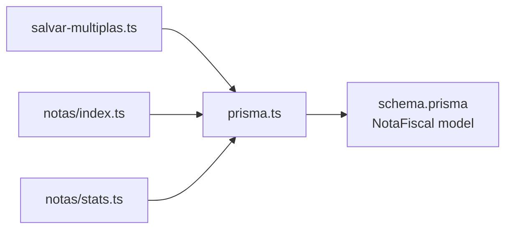

# Batch Invoice Processing

<cite>
**Referenced Files in This Document**
- [salvar-multiplas.ts](file://pages/api/notas/salvar-multiplas.ts)
- [index.ts](file://pages/api/notas/index.ts)
- [stats.ts](file://pages/api/notas/stats.ts)
- [schema.prisma](file://prisma/schema.prisma)
- [prisma.ts](file://lib/prisma.ts)
</cite>

## Table of Contents
1. Introduction
2. Project Structure
3. Core Components
4. Architecture Overview
5. Detailed Component Analysis
6. Dependency Analysis
7. Performance Considerations
8. Troubleshooting Guide
9. Conclusion

## Introduction
This document explains the batch invoice processing capabilities implemented in the system, focusing on bulk import workflows, multi-invoice validation, and database persistence. It covers the salvar-multiplas endpoint for creating multiple invoices in a single request, input normalization and validation rules, transactional writes with rollback behavior, and supporting endpoints for querying and statistics. Where applicable, it also references patterns used elsewhere in the codebase for batching and large dataset handling to guide performance and memory management strategies.

## Project Structure
The batch invoice feature is centered around Next.js API routes under pages/api/notas, with data access via Prisma and schema definitions in prisma/schema.prisma. Supporting utilities include a shared Prisma client singleton and related endpoints for listing notes and retrieving statistics.

**Diagram sources**
- [salvar-multiplas.ts:11-77](file://pages/api/notas/salvar-multiplas.ts#L11-L77)
- [index.ts:4-85](file://pages/api/notas/index.ts#L4-L85)
- [stats.ts:5-44](file://pages/api/notas/stats.ts#L5-L44)
- [prisma.ts:1-19](file://lib/prisma.ts#L1-L19)

**Section sources**
- [salvar-multiplas.ts:1-78](file://pages/api/notas/salvar-multiplas.ts#L1-L78)
- [index.ts:1-87](file://pages/api/notas/index.ts#L1-L87)
- [stats.ts:1-45](file://pages/api/notas/stats.ts#L1-L45)
- [schema.prisma:55-67](file://prisma/schema.prisma#L55-L67)
- [prisma.ts:1-19](file://lib/prisma.ts#L1-L19)

## Core Components
- salvar-multiplas endpoint: Accepts an array of invoice payloads, normalizes fields, validates uniqueness and required fields, checks existing records, and persists all new invoices atomically using a Prisma transaction.
- Notas list endpoint: Retrieves invoices with optional date range and text filters, including related control and user information.
- Notas stats endpoint: Returns counts of invoices created today and this month.
- Data model: NotaFiscal defines the invoice record structure and relationships.
- Prisma client: Singleton configuration for database access.

**Section sources**
- [salvar-multiplas.ts:11-77](file://pages/api/notas/salvar-multiplas.ts#L11-L77)
- [index.ts:9-81](file://pages/api/notas/index.ts#L9-L81)
- [stats.ts:10-39](file://pages/api/notas/stats.ts#L10-L39)
- [schema.prisma:55-67](file://prisma/schema.prisma#L55-L67)
- [prisma.ts:1-19](file://lib/prisma.ts#L1-L19)

## Architecture Overview
The batch workflow follows a clear sequence:
- The client sends a POST request with an array of invoice objects to /api/notas/salvar-multiplas.
- The server normalizes inputs, enforces business rules (required fields, duplicates), and verifies no existing invoices match the provided keys.
- All valid invoices are created within a single Prisma transaction to ensure atomicity; if any write fails, the entire batch is rolled back.
- On success, the server returns the created records; on failure, it returns appropriate error codes and messages.

**Diagram sources**
- [salvar-multiplas.ts:16-72](file://pages/api/notas/salvar-multiplas.ts#L16-L72)
- [schema.prisma:55-67](file://prisma/schema.prisma#L55-L67)

## Detailed Component Analysis

### salvar-multiplas Endpoint
Responsibilities:
- Enforce HTTP method (POST only).
- Parse and normalize invoice entries: trim strings, default volumes to "1", preserve usuarioId when present.
- Validate required fields: codigo and numeroNota must be present after normalization.
- Detect duplicates within the same request using a composite key of codigo||numeroNota.
- Prevent saving duplicates already stored in the database by querying existing records matching any of the provided keys.
- Persist all new invoices atomically using a Prisma transaction.

Error handling:
- 405 for unsupported methods.
- 400 for empty payload, missing required fields, duplicate entries in payload, or pre-existing records.
- 500 for unexpected server errors.

Return values:
- 201 with an array of created invoice records on success.

**Diagram sources**
- [salvar-multiplas.ts:11-77](file://pages/api/notas/salvar-multiplas.ts#L11-L77)

**Section sources**
- [salvar-multiplas.ts:11-77](file://pages/api/notas/salvar-multiplas.ts#L11-L77)

### Notas List Endpoint
Responsibilities:
- Support GET requests with optional query parameters: start/end date range, numeroNota (contains, case-insensitive), codigo (contains, case-insensitive).
- Build a dynamic where clause based on provided filters.
- Retrieve invoices with related controle and usuario details, ordered by creation date descending.

Error handling:
- 405 for non-GET methods.
- 500 for unexpected errors.

**Section sources**
- [index.ts:4-85](file://pages/api/notas/index.ts#L4-L85)

### Notas Stats Endpoint
Responsibilities:
- Return counts of invoices created today and this month using date boundaries.
- Uses parallel queries for efficiency.

Error handling:
- 405 for non-GET methods.
- 500 for unexpected errors.

**Section sources**
- [stats.ts:5-44](file://pages/api/notas/stats.ts#L5-L44)

### Data Model: NotaFiscal
Key fields and constraints relevant to batch processing:
- id: unique identifier.
- dataCriacao: timestamp for creation.
- codigo and numeroNota: core identifiers used for deduplication and lookups.
- controleId and usuarioId: optional relations to ControleCarga and Usuario.
- volumes: string field with default value "1".

Indexes:
- dataCriacao indexed for efficient time-based queries.

**Section sources**
- [schema.prisma:55-67](file://prisma/schema.prisma#L55-L67)

### Prisma Client Configuration
- Singleton pattern ensures a single Prisma instance per process.
- Logging enabled for query, error, and warn levels in development.
- Exported as default for reuse across API routes.

**Section sources**
- [prisma.ts:1-19](file://lib/prisma.ts#L1-L19)

## Dependency Analysis
- salvar-multiplas depends on Prisma client and NotaFiscal model for validation and persistence.
- Notas list and stats depend on Prisma client and NotaFiscal model for read operations.
- All endpoints rely on consistent error handling and status codes.

**Diagram sources**
- [salvar-multiplas.ts:1-77](file://pages/api/notas/salvar-multiplas.ts#L1-L77)
- [index.ts:1-85](file://pages/api/notas/index.ts#L1-L85)
- [stats.ts:1-44](file://pages/api/notas/stats.ts#L1-L44)
- [prisma.ts:1-19](file://lib/prisma.ts#L1-L19)
- [schema.prisma:55-67](file://prisma/schema.prisma#L55-L67)

**Section sources**
- [salvar-multiplas.ts:1-77](file://pages/api/notas/salvar-multiplas.ts#L1-L77)
- [index.ts:1-85](file://pages/api/notas/index.ts#L1-L85)
- [stats.ts:1-44](file://pages/api/notas/stats.ts#L1-L44)
- [prisma.ts:1-19](file://lib/prisma.ts#L1-L19)
- [schema.prisma:55-67](file://prisma/schema.prisma#L55-L67)

## Performance Considerations
- Atomic transactions: salvar-multiplas uses a single Prisma transaction to create all invoices, ensuring consistency and simplifying rollback on partial failures.
- Deduplication strategy: In-memory set for payload-level duplicates reduces unnecessary database calls.
- Query optimization: Notes list uses indexes on dataCriacao and supports filtered queries to reduce result sets.
- Parallel reads: Stats endpoint uses Promise.all to compute counts concurrently.

Patterns from other parts of the codebase for large datasets:
- Batching external data retrieval with limits and offsets to avoid memory spikes and timeouts.
- Using fixed batch sizes to balance throughput and resource usage.

Recommendations:
- For very large batches, consider chunking client-side into smaller arrays to fit within request size limits and improve reliability.
- Monitor response times and adjust batch sizes based on environment capacity.
- Leverage existing patterns seen in other endpoints that implement pagination and batch limits for robustness.

[No sources needed since this section provides general guidance]

## Troubleshooting Guide
Common issues and resolutions:
- Method not allowed: Ensure the request method matches the endpoint expectations (POST for salvar-multiplas, GET for list and stats).
- Empty or malformed payload: Provide a non-empty array of invoice objects with required fields.
- Duplicate entries: Remove duplicates within the payload; each combination of codigo and numeroNota must be unique per request.
- Pre-existing invoices: If any invoice already exists in the database, the entire request will fail; remove or update the conflicting entries before retrying.
- Server errors: Unexpected exceptions return 500; check logs and ensure database connectivity and Prisma configuration are correct.

Operational tips:
- Use the stats endpoint to verify ingestion volume over time.
- Use the list endpoint with filters to inspect recent imports and confirm data integrity.

**Section sources**
- [salvar-multiplas.ts:11-77](file://pages/api/notas/salvar-multiplas.ts#L11-L77)
- [index.ts:4-85](file://pages/api/notas/index.ts#L4-L85)
- [stats.ts:5-44](file://pages/api/notas/stats.ts#L5-L44)

## Conclusion
The batch invoice processing implementation provides a reliable, transactional mechanism to create multiple invoices in a single request, with strict validation and deduplication to maintain data integrity. Supporting endpoints enable querying and monitoring of invoice activity. By following established patterns for batching and leveraging database indexes, the system can handle substantial workloads while maintaining performance and consistency.

[No sources needed since this section summarizes without analyzing specific files]