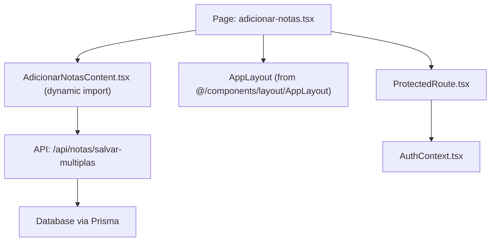
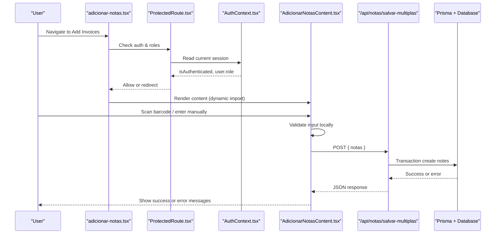
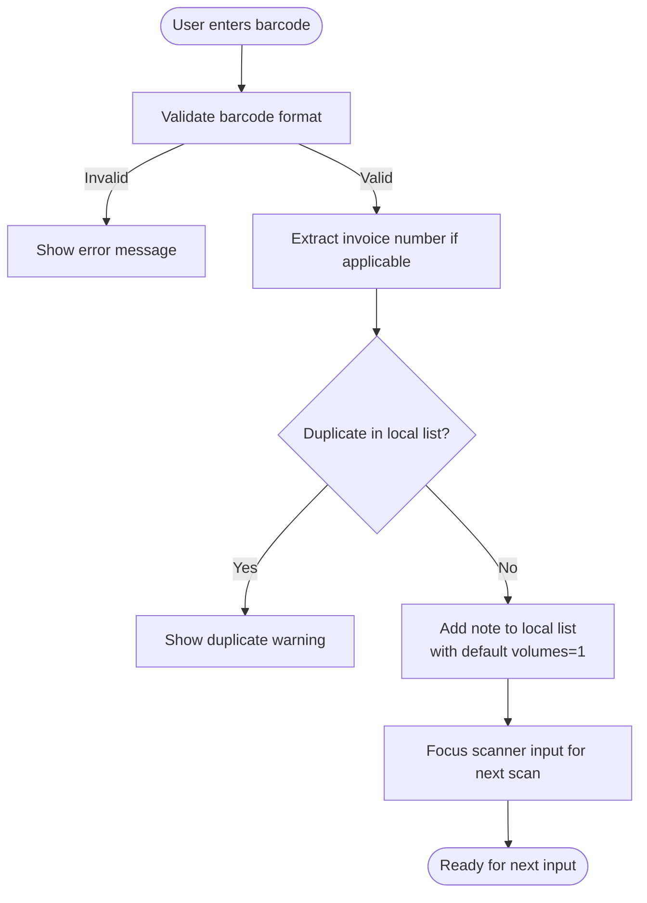
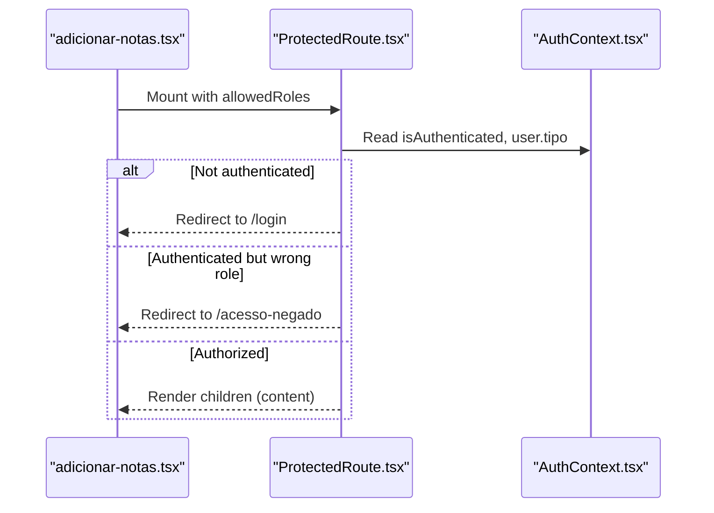
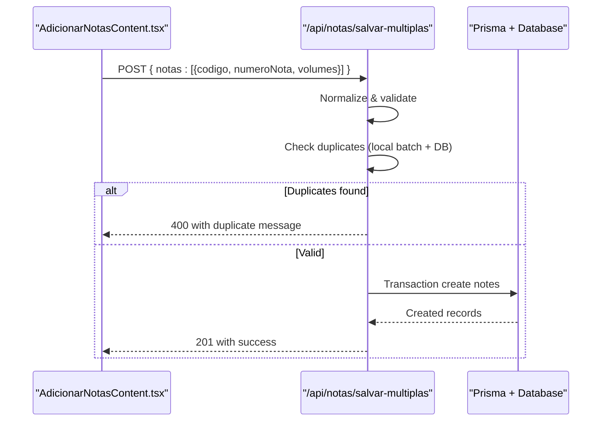
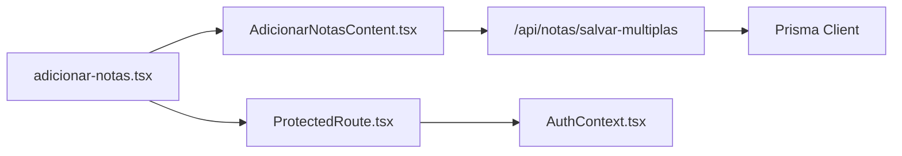

# Invoice Addition Workflow

<cite>
**Referenced Files in This Document**
- [adicionar-notas.tsx](file://pages/adicionar-notas.tsx)
- [AdicionarNotasContent.tsx](file://components/AdicionarNotasContent.tsx)
- [ProtectedRoute.tsx](file://components/ProtectedRoute.tsx)
- [AuthContext.tsx](file://contexts/AuthContext.tsx)
- [salvar-multiplas.ts](file://pages/api/notas/salvar-multiplas.ts)
- [store.ts](file://store/store.ts)
</cite>

## Table of Contents
1. [Introduction](#introduction)
2. [Project Structure](#project-structure)
3. [Core Components](#core-components)
4. [Architecture Overview](#architecture-overview)
5. [Detailed Component Analysis](#detailed-component-analysis)
6. [Dependency Analysis](#dependency-analysis)
7. [Performance Considerations](#performance-considerations)
8. [Troubleshooting Guide](#troubleshooting-guide)
9. [Conclusion](#conclusion)

## Introduction
This document explains the end-to-end workflow for adding invoices (notas fiscais) in the application. It covers the user interface flow, form validation, data entry patterns, submission process, and integration between the page wrapper and content components. It also documents authentication checks and role-based access control that protect the invoice addition feature.

## Project Structure
The invoice addition feature is implemented as a Next.js page that wraps a dynamic content component:
- Page wrapper: renders protected layout and loads the content component dynamically to avoid SSR issues.
- Content component: implements barcode scanning input, manual entry, real-time validation, list management, and bulk save.
- API endpoint: validates and persists multiple invoices in a single transaction.
- Authentication and authorization: ensure only authenticated users with allowed roles can access the page.

**Diagram sources**
- [adicionar-notas.tsx:1-49](file://pages/adicionar-notas.tsx#L1-L49)
- [AdicionarNotasContent.tsx:1-843](file://components/AdicionarNotasContent.tsx#L1-L843)
- [ProtectedRoute.tsx:1-79](file://components/ProtectedRoute.tsx#L1-L79)
- [AuthContext.tsx:1-508](file://contexts/AuthContext.tsx#L1-L508)
- [salvar-multiplas.ts:1-78](file://pages/api/notas/salvar-multiplas.ts#L1-L78)

**Section sources**
- [adicionar-notas.tsx:1-49](file://pages/adicionar-notas.tsx#L1-L49)
- [AdicionarNotasContent.tsx:1-843](file://components/AdicionarNotasContent.tsx#L1-L843)

## Core Components
- Page wrapper (adicionar-notas.tsx):
  - Dynamically imports AdicionarNotasContent to avoid SSR issues.
  - Uses ProtectedRoute to enforce authentication and role-based access for ADMIN, GERENTE, and USUARIO.
  - Wraps content in AppLayout with title and subtitle.

- Content component (AdicionarNotasContent.tsx):
  - Barcode scanner input field with Enter key support and focus management.
  - Manual note entry form with duplicate prevention.
  - Real-time validation for barcode format and volumes.
  - Local list state for notes being prepared for save.
  - Bulk save to backend via POST /api/notas/salvar-multiplas.
  - User feedback via snackbar notifications for success, warnings, and errors.

- ProtectedRoute.tsx:
  - Guards routes based on authentication status and allowed roles.
  - Redirects unauthenticated users to login and unauthorized users to an access denied page.

- AuthContext.tsx:
  - Manages authentication state, token expiration checks, and redirects.
  - Provides hooks used by pages and components to check loading and auth status.

- API salvar-multiplas.ts:
  - Validates payload, prevents duplicates within the batch and against existing records, and persists all notes atomically using a database transaction.

**Section sources**
- [adicionar-notas.tsx:1-49](file://pages/adicionar-notas.tsx#L1-L49)
- [AdicionarNotasContent.tsx:1-843](file://components/AdicionarNotasContent.tsx#L1-L843)
- [ProtectedRoute.tsx:1-79](file://components/ProtectedRoute.tsx#L1-L79)
- [AuthContext.tsx:1-508](file://contexts/AuthContext.tsx#L1-L508)
- [salvar-multiplas.ts:1-78](file://pages/api/notas/salvar-multiplas.ts#L1-L78)

## Architecture Overview
The invoice addition workflow follows a clear separation of concerns:
- UI layer: handles user interactions, local state, and immediate feedback.
- Authorization layer: ensures only permitted users can access the feature.
- API layer: enforces business rules (validation, deduplication) and persists data safely.

**Diagram sources**
- [adicionar-notas.tsx:1-49](file://pages/adicionar-notas.tsx#L1-L49)
- [ProtectedRoute.tsx:1-79](file://components/ProtectedRoute.tsx#L1-L79)
- [AuthContext.tsx:1-508](file://contexts/AuthContext.tsx#L1-L508)
- [AdicionarNotasContent.tsx:1-843](file://components/AdicionarNotasContent.tsx#L1-L843)
- [salvar-multiplas.ts:1-78](file://pages/api/notas/salvar-multiplas.ts#L1-L78)

## Detailed Component Analysis

### Page Wrapper: adicionar-notas.tsx
- Loads AdicionarNotasContent dynamically with ssr disabled to prevent hydration mismatches.
- Displays a loading indicator while dependencies load.
- Enforces role-based access via ProtectedRoute for ADMIN, GERENTE, and USUARIO.
- Renders inside AppLayout with appropriate title and subtitle.

Key behaviors:
- If authentication is still loading, shows a spinner.
- If not authorized, ProtectedRoute redirects accordingly.

**Section sources**
- [adicionar-notas.tsx:1-49](file://pages/adicionar-notas.tsx#L1-L49)

### Content Component: AdicionarNotasContent.tsx
Responsibilities:
- Input handling:
  - Barcode scanner input with autoFocus and Enter key processing.
  - Manual note number entry with validation and duplicate checks.
- Validation:
  - Barcode format validation supports numeric codes (DANFE 44 digits or short codes up to 20), alphanumeric with hyphens, and extracts invoice numbers from DANFE when possible.
  - Volume validation ensures positive integers before saving individual notes.
- Data entry patterns:
  - Scanned notes are added at the top of the list with default volumes set to 1 and marked as scanned.
  - Manual entries are added similarly but marked as non-scanned.
  - Duplicate detection prevents re-adding the same code or invoice number already present in the local list.
- List management:
  - Edit mode toggles per note to adjust volumes.
  - Remove single note or clear all notes with confirmation prompts.
  - Total volumes computed in real time.
- Submission:
  - Bulk save sends all local notes to /api/notas/salvar-multiplas.
  - Handles server-side duplicate detection and other errors with snackbar feedback.
  - On success, clears local state and provides success feedback.

Real-time validation feedback:
- Invalid barcode formats show error messages immediately.
- Duplicate scans trigger warning messages.
- Successful additions and saves show success messages.
- Errors during save display error messages.

**Diagram sources**
- [AdicionarNotasContent.tsx:98-164](file://components/AdicionarNotasContent.tsx#L98-L164)
- [AdicionarNotasContent.tsx:176-285](file://components/AdicionarNotasContent.tsx#L176-L285)

**Section sources**
- [AdicionarNotasContent.tsx:1-843](file://components/AdicionarNotasContent.tsx#L1-L843)

### Authentication and Role-Based Access Control
- ProtectedRoute:
  - Checks if the user is authenticated and has one of the allowed roles (ADMIN, GERENTE, USUARIO).
  - Redirects unauthenticated users to login and unauthorized users to an access denied route.
- AuthContext:
  - Maintains authentication state and performs periodic token validity checks.
  - Handles logout and redirects to login on session expiry or unauthorized events.

**Diagram sources**
- [ProtectedRoute.tsx:1-79](file://components/ProtectedRoute.tsx#L1-L79)
- [AuthContext.tsx:1-508](file://contexts/AuthContext.tsx#L1-L508)
- [adicionar-notas.tsx:1-49](file://pages/adicionar-notas.tsx#L1-L49)

**Section sources**
- [ProtectedRoute.tsx:1-79](file://components/ProtectedRoute.tsx#L1-L79)
- [AuthContext.tsx:1-508](file://contexts/AuthContext.tsx#L1-L508)
- [adicionar-notas.tsx:1-49](file://pages/adicionar-notas.tsx#L1-L49)

### API Integration: salvar-multiplas.ts
- Accepts POST with array of notes containing codigo, numeroNota, and optional volumes.
- Normalizes inputs and validates required fields.
- Prevents duplicates within the submitted batch and against existing records.
- Persists all notes atomically using a database transaction.
- Returns success with created records or descriptive error messages.

**Diagram sources**
- [AdicionarNotasContent.tsx:393-467](file://components/AdicionarNotasContent.tsx#L393-L467)
- [salvar-multiplas.ts:1-78](file://pages/api/notas/salvar-multiplas.ts#L1-L78)

**Section sources**
- [salvar-multiplas.ts:1-78](file://pages/api/notas/salvar-multiplas.ts#L1-L78)
- [AdicionarNotasContent.tsx:393-467](file://components/AdicionarNotasContent.tsx#L393-L467)

### Store Integration Notes
- The store exposes addNota for alternative flows and fetch operations; however, the primary invoice addition flow in this feature uses direct POST to /api/notas/salvar-multiplas from the content component.
- The store’s addNota includes its own authentication checks and error handling, which may be used by other features.

**Section sources**
- [store.ts:197-267](file://store/store.ts#L197-L267)

## Dependency Analysis
- Page depends on:
  - ProtectedRoute for authorization.
  - Dynamic import of AdicionarNotasContent to avoid SSR issues.
- Content component depends on:
  - MUI components for UI.
  - Snackbar for user feedback.
  - Local state for managing notes list.
  - API endpoint for persistence.
- API endpoint depends on:
  - Prisma client for database operations.
  - Transaction to ensure atomicity.

**Diagram sources**
- [adicionar-notas.tsx:1-49](file://pages/adicionar-notas.tsx#L1-L49)
- [AdicionarNotasContent.tsx:1-843](file://components/AdicionarNotasContent.tsx#L1-L843)
- [ProtectedRoute.tsx:1-79](file://components/ProtectedRoute.tsx#L1-L79)
- [AuthContext.tsx:1-508](file://contexts/AuthContext.tsx#L1-L508)
- [salvar-multiplas.ts:1-78](file://pages/api/notas/salvar-multiplas.ts#L1-L78)

**Section sources**
- [adicionar-notas.tsx:1-49](file://pages/adicionar-notas.tsx#L1-L49)
- [AdicionarNotasContent.tsx:1-843](file://components/AdicionarNotasContent.tsx#L1-L843)
- [ProtectedRoute.tsx:1-79](file://components/ProtectedRoute.tsx#L1-L79)
- [AuthContext.tsx:1-508](file://contexts/AuthContext.tsx#L1-L508)
- [salvar-multiplas.ts:1-78](file://pages/api/notas/salvar-multiplas.ts#L1-L78)

## Performance Considerations
- Dynamic import of AdicionarNotasContent reduces initial bundle size and avoids SSR-related issues.
- Local state management minimizes network calls until the user submits, improving responsiveness.
- Batch saving reduces round-trips to the server and leverages database transactions for consistency.
- Real-time validation occurs client-side to provide immediate feedback without unnecessary requests.

[No sources needed since this section provides general guidance]

## Troubleshooting Guide
Common issues and resolutions:
- Invalid barcode format:
  - Ensure the scanned code matches supported formats (numeric 44-digit DANFE or short numeric up to 20 digits; alphanumeric with hyphens).
  - Error messages will appear immediately; correct the input or rescan.
- Duplicate invoice:
  - If the same barcode or invoice number exists in the local list or database, a warning or error will be shown.
  - Remove the duplicate from the local list or use a different invoice.
- Save failures:
  - Network or server errors will display error messages.
  - Check connectivity and retry; inspect browser console for detailed logs.
- Authentication issues:
  - If redirected to login, re-authenticate.
  - If redirected to access denied, verify your role allows access to the invoice addition page.

**Section sources**
- [AdicionarNotasContent.tsx:98-164](file://components/AdicionarNotasContent.tsx#L98-L164)
- [AdicionarNotasContent.tsx:176-285](file://components/AdicionarNotasContent.tsx#L176-L285)
- [AdicionarNotasContent.tsx:393-467](file://components/AdicionarNotasContent.tsx#L393-L467)
- [ProtectedRoute.tsx:1-79](file://components/ProtectedRoute.tsx#L1-L79)
- [AuthContext.tsx:1-508](file://contexts/AuthContext.tsx#L1-L508)
- [salvar-multiplas.ts:1-78](file://pages/api/notas/salvar-multiplas.ts#L1-L78)

## Conclusion
The invoice addition workflow combines a responsive UI with robust validation and secure backend processing. Users can efficiently add invoices via barcode scanning or manual entry, receive immediate feedback, and submit batches reliably. Authentication and role-based access ensure only authorized personnel can perform these actions, while the API guarantees data integrity through validation and transactional persistence.

[No sources needed since this section summarizes without analyzing specific files]