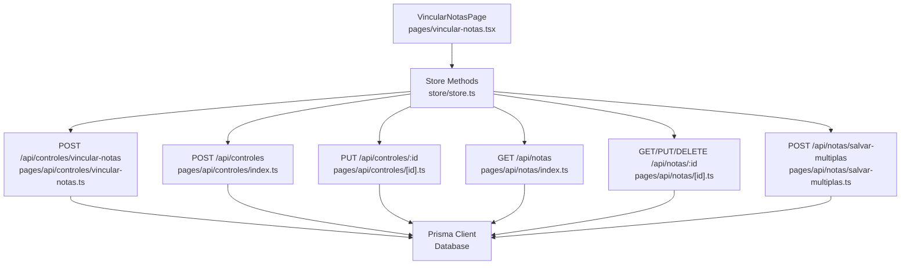
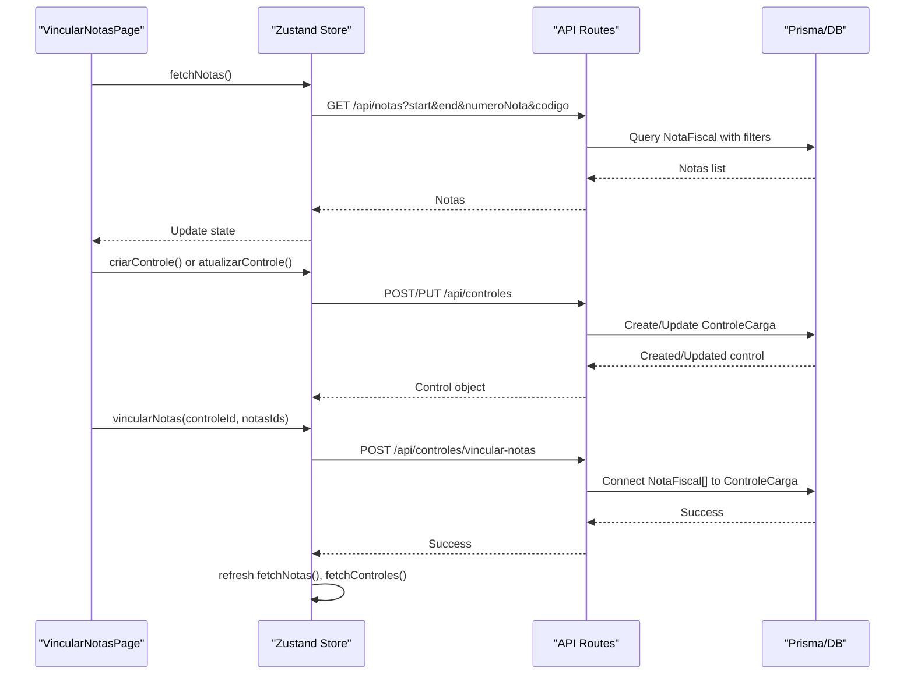
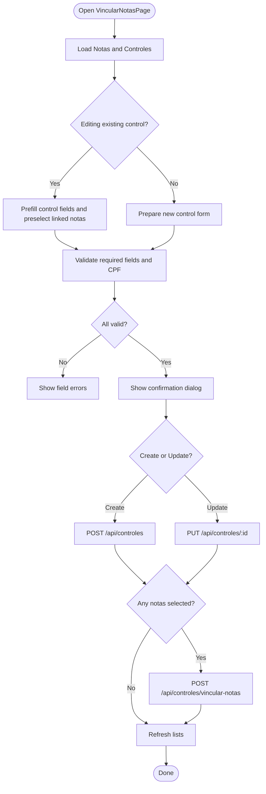
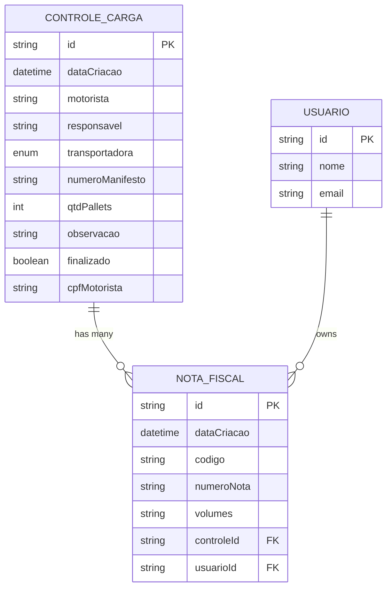

# Invoice Linking System

<cite>
**Referenced Files in This Document**
- [pages/api/controles/vincular-notas.ts](file://pages/api/controles/vincular-notas.ts)
- [pages/vincular-notas.tsx](file://pages/vincular-notas.tsx)
- [pages/api/notas/index.ts](file://pages/api/notas/index.ts)
- [pages/api/notas/[id].ts](file://pages/api/notas/[id].ts)
- [pages/api/notas/salvar-multiplas.ts](file://pages/api/notas/salvar-multiplas.ts)
- [store/store.ts](file://store/store.ts)
- [prisma/schema.prisma](file://prisma/schema.prisma)
- [pages/api/controles/index.ts](file://pages/api/controles/index.ts)
- [pages/api/controles/[id].ts](file://pages/api/controles/[id].ts)
</cite>

## Table of Contents
1. [Introduction](#introduction)
2. [Project Structure](#project-structure)
3. [Core Components](#core-components)
4. [Architecture Overview](#architecture-overview)
5. [Detailed Component Analysis](#detailed-component-analysis)
6. [Dependency Analysis](#dependency-analysis)
7. [Performance Considerations](#performance-considerations)
8. [Troubleshooting Guide](#troubleshooting-guide)
9. [Conclusion](#conclusion)

## Introduction
This document explains the invoice linking system that connects fiscal invoices (Nota Fiscal) to cargo controls (Controle de Carga). It covers:
- The vincular-notas functionality for linking multiple invoices to a single cargo control
- Search mechanisms to find existing cargo controls and invoices
- API endpoints used for invoice operations and relationship management
- Data validation rules applied during creation, updates, and linking
- Conflict resolution when an invoice is already linked to another control
- Batch linking workflows and user interface flows
- Audit trail considerations based on available data structures

The goal is to provide both technical and practical guidance for developers and operators using the system.

## Project Structure
The invoice linking feature spans UI pages, API routes, state management, and database models:
- UI page for selecting and linking invoices to a cargo control
- Store methods orchestrating API calls and local state updates
- API endpoints for listing, creating, updating, and deleting invoices and cargo controls
- Prisma schema defining relationships between NotaFiscal and ControleCarga

**Diagram sources**
- [pages/vincular-notas.tsx:1-619](file://pages/vincular-notas.tsx#L1-L619)
- [store/store.ts:76-567](file://store/store.ts#L76-L567)
- [pages/api/notas/index.ts:1-87](file://pages/api/notas/index.ts#L1-L87)
- [pages/api/notas/[id].ts:1-69](file://pages/api/notas/[id].ts#L1-L69)
- [pages/api/notas/salvar-multiplas.ts:1-78](file://pages/api/notas/salvar-multiplas.ts#L1-L78)
- [pages/api/controles/index.ts:1-121](file://pages/api/controles/index.ts#L1-L121)
- [pages/api/controles/[id].ts:1-93](file://pages/api/controles/[id].ts#L1-L93)
- [pages/api/controles/vincular-notas.ts:1-31](file://pages/api/controles/vincular-notas.ts#L1-L31)

**Section sources**
- [pages/vincular-notas.tsx:1-619](file://pages/vincular-notas.tsx#L1-L619)
- [store/store.ts:76-567](file://store/store.ts#L76-L567)
- [pages/api/notas/index.ts:1-87](file://pages/api/notas/index.ts#L1-L87)
- [pages/api/notas/[id].ts:1-69](file://pages/api/notas/[id].ts#L1-L69)
- [pages/api/notas/salvar-multiplas.ts:1-78](file://pages/api/notas/salvar-multiplas.ts#L1-L78)
- [pages/api/controles/index.ts:1-121](file://pages/api/controles/index.ts#L1-L121)
- [pages/api/controles/[id].ts:1-93](file://pages/api/controles/[id].ts#L1-L93)
- [pages/api/controles/vincular-notas.ts:1-31](file://pages/api/controles/vincular-notas.ts#L1-L31)

## Core Components
- VincularNotasPage: User interface for searching invoices, selecting them, validating driver/responsible fields, and linking selected invoices to a cargo control or creating a new one with links.
- Store methods: Encapsulate fetching notes and controls, creating/updating controls, and linking notes via API calls.
- API endpoints: Provide CRUD for invoices and controls, plus a dedicated endpoint for linking notes to a control.
- Database schema: Defines NotaFiscal and ControleCarga with a one-to-many relationship from control to invoices.

Key responsibilities:
- Search/filter invoices by date range, note number, and code
- Validate required fields (driver name, responsible person, CPF format)
- Create or update cargo controls with optional initial note links
- Link multiple notes to a control in batch
- Refresh local state after successful operations

**Section sources**
- [pages/vincular-notas.tsx:42-327](file://pages/vincular-notas.tsx#L42-L327)
- [store/store.ts:76-567](file://store/store.ts#L76-L567)
- [pages/api/notas/index.ts:1-87](file://pages/api/notas/index.ts#L1-L87)
- [pages/api/notas/[id].ts:1-69](file://pages/api/notas/[id].ts#L1-L69)
- [pages/api/notas/salvar-multiplas.ts:1-78](file://pages/api/notas/salvar-multiplas.ts#L1-L78)
- [pages/api/controles/index.ts:1-121](file://pages/api/controles/index.ts#L1-L121)
- [pages/api/controles/[id].ts:1-93](file://pages/api/controles/[id].ts#L1-L93)
- [pages/api/controles/vincular-notas.ts:1-31](file://pages/api/controles/vincular-notas.ts#L1-L31)
- [prisma/schema.prisma:11-67](file://prisma/schema.prisma#L11-L67)

## Architecture Overview
The system follows a typical Next.js API route pattern with a React frontend and Zustand store for state management. The core flow involves:
- Fetching invoices and cargo controls
- Validating inputs on the client side
- Creating or updating cargo controls
- Linking selected invoices to the control via a dedicated endpoint
- Refreshing lists to reflect changes

**Diagram sources**
- [pages/vincular-notas.tsx:229-327](file://pages/vincular-notas.tsx#L229-L327)
- [store/store.ts:269-412](file://store/store.ts#L269-L412)
- [pages/api/controles/index.ts:64-112](file://pages/api/controles/index.ts#L64-L112)
- [pages/api/controles/[id].ts:28-73](file://pages/api/controles/[id].ts#L28-L73)
- [pages/api/controles/vincular-notas.ts:4-29](file://pages/api/controles/vincular-notas.ts#L4-L29)
- [pages/api/notas/index.ts:4-81](file://pages/api/notas/index.ts#L4-L81)

## Detailed Component Analysis

### VincularNotasPage (UI)
Responsibilities:
- Load invoices and controls on mount
- Pre-fill control fields if editing an existing control
- Validate driver name, responsible person, and CPF format in real time
- Filter invoices by search term (note number or code)
- Present warnings when an invoice is already linked to another control
- Confirm before saving or updating
- Trigger create/update and link operations

Validation highlights:
- CPF validation includes length check, repeated digit detection, and checksum verification
- Required fields enforced before submission
- Transportadora selection constrained to allowed enum values

Conflict handling:
- UI shows a “Já vinculada” chip when an invoice is linked to a different control
- No explicit unlink operation; users must avoid selecting already-linked invoices or handle conflicts at the API level

**Diagram sources**
- [pages/vincular-notas.tsx:74-119](file://pages/vincular-notas.tsx#L74-L119)
- [pages/vincular-notas.tsx:134-227](file://pages/vincular-notas.tsx#L134-L227)
- [pages/vincular-notas.tsx:229-327](file://pages/vincular-notas.tsx#L229-L327)
- [pages/vincular-notas.tsx:334-339](file://pages/vincular-notas.tsx#L334-L339)
- [pages/vincular-notas.tsx:523-557](file://pages/vincular-notas.tsx#L523-L557)

**Section sources**
- [pages/vincular-notas.tsx:74-327](file://pages/vincular-notas.tsx#L74-L327)
- [pages/vincular-notas.tsx:334-339](file://pages/vincular-notas.tsx#L334-L339)
- [pages/vincular-notas.tsx:523-557](file://pages/vincular-notas.tsx#L523-L557)

### Store Methods (State and Orchestration)
Responsibilities:
- Fetch invoices with filtering parameters
- Fetch cargo controls with filters
- Create cargo controls with optional initial note links
- Update cargo controls
- Link notes to a control and refresh lists
- Delete individual invoices

Key behaviors:
- Enforces transportadora enum validation on creation
- Normalizes payload (trimming strings, converting numbers)
- Calls vincular-notas after creating a control if notes are provided
- Refreshes both notas and controles after linking

**Section sources**
- [store/store.ts:83-123](file://store/store.ts#L83-L123)
- [store/store.ts:125-168](file://store/store.ts#L125-L168)
- [store/store.ts:269-397](file://store/store.ts#L269-L397)
- [store/store.ts:399-412](file://store/store.ts#L399-L412)
- [store/store.ts:439-499](file://store/store.ts#L439-L499)
- [store/store.ts:501-565](file://store/store.ts#L501-L565)

### API: Invoices (Nota Fiscal)
Endpoints:
- GET /api/notas: List invoices with optional filters (date range, note number, code), including related control and user info
- GET/PUT/DELETE /api/notas/:id: Retrieve, update, or delete a specific invoice
- POST /api/notas/salvar-multiplas: Batch create invoices with duplicate prevention and transactional writes

Validation and conflict handling:
- Requires codigo and numeroNota for each invoice
- Prevents duplicates within the same request and against existing records
- Uses Prisma transactions to ensure all-or-nothing creation

**Section sources**
- [pages/api/notas/index.ts:4-81](file://pages/api/notas/index.ts#L4-L81)
- [pages/api/notas/[id].ts:4-69](file://pages/api/notas/[id].ts#L4-L69)
- [pages/api/notas/salvar-multiplas.ts:11-78](file://pages/api/notas/salvar-multiplas.ts#L11-L78)

### API: Cargo Controls (Controle de Carga)
Endpoints:
- GET /api/controles: List controls with optional filters (date range, transportadora, note number substring, driver name, responsible name), including associated notas
- POST /api/controles: Create a control with optional initial note links
- PUT /api/controles/:id: Update a control’s fields (including finalizado flag and freight-related fields)
- DELETE /api/controles/:id: Remove a control

Validation:
- Validates transportadora enum on update
- Generates sequential manifest number if not provided

**Section sources**
- [pages/api/controles/index.ts:5-121](file://pages/api/controles/index.ts#L5-L121)
- [pages/api/controles/[id].ts:5-93](file://pages/api/controles/[id].ts#L5-L93)

### API: Linking Notes to Controls (vincular-notas)
Endpoint:
- POST /api/controles/vincular-notas: Connect multiple nota IDs to a control

Behavior:
- Validates input presence and array type
- Uses Prisma relation connect to associate notes with the control
- Returns success message or error

Conflict handling:
- No explicit uniqueness enforcement per link; relies on relational model semantics
- UI warns about already-linked notes but does not prevent selection

**Section sources**
- [pages/api/controles/vincular-notas.ts:4-29](file://pages/api/controles/vincular-notas.ts#L4-L29)

### Data Model Relationships
- NotaFiscal has an optional controleId referencing ControleCarga
- ControleCarga has a one-to-many relation to NotaFiscal via notas
- Usuario relation exists for invoice ownership

**Diagram sources**
- [prisma/schema.prisma:11-67](file://prisma/schema.prisma#L11-L67)
- [prisma/schema.prisma:69-96](file://prisma/schema.prisma#L69-L96)

## Dependency Analysis
- Frontend depends on store methods for data fetching and mutations
- Store methods depend on API routes for persistence and business logic
- API routes depend on Prisma client for database operations
- Database schema defines constraints and relations that enforce integrity

Potential coupling points:
- UI assumes store method names and response shapes
- Store expects API responses to match expected types
- API routes rely on Prisma enums and relations

External dependencies:
- Prisma client for database access
- Next.js API routing
- Zustand for state management
- Material UI for components

**Section sources**
- [store/store.ts:76-567](file://store/store.ts#L76-L567)
- [pages/api/notas/index.ts:1-87](file://pages/api/notas/index.ts#L1-L87)
- [pages/api/notas/[id].ts:1-69](file://pages/api/notas/[id].ts#L1-L69)
- [pages/api/notas/salvar-multiplas.ts:1-78](file://pages/api/notas/salvar-multiplas.ts#L1-L78)
- [pages/api/controles/index.ts:1-121](file://pages/api/controles/index.ts#L1-L121)
- [pages/api/controles/[id].ts:1-93](file://pages/api/controles/[id].ts#L1-L93)
- [pages/api/controles/vincular-notas.ts:1-31](file://pages/api/controles/vincular-notas.ts#L1-L31)
- [prisma/schema.prisma:11-67](file://prisma/schema.prisma#L11-L67)

## Performance Considerations
- Filtering invoices by date range and text reduces payload size and improves UI responsiveness
- Using include in queries to load related entities minimizes round trips
- Batch creation of invoices uses transactions to reduce overhead and ensure consistency
- Avoid unnecessary re-renders by refreshing only required lists after operations

[No sources needed since this section provides general guidance]

## Troubleshooting Guide
Common issues and resolutions:
- Invalid transportadora value: Ensure the selected transportadora matches allowed enum values; the API validates this on update
- Duplicate invoice entries: The batch save endpoint prevents duplicates within the request and against existing records; verify codes and note numbers
- Already linked invoice: The UI marks such invoices; avoid selecting them unless you intend to link to the same control
- CPF validation failures: Ensure CPF has correct length and checksum; the UI performs real-time validation
- Authentication/session errors: Some store methods check authentication; handle 401 responses by prompting login
- Network or server errors: Check console logs and API responses; ensure credentials are included where required

Operational tips:
- Use the refresh button to reload invoice lists when data may have changed
- Confirm dialogs help prevent accidental updates or creations
- When creating a control with notes, ensure notes exist and are not already linked to another control

**Section sources**
- [pages/api/controles/[id].ts:47-50](file://pages/api/controles/[id].ts#L47-L50)
- [pages/api/notas/salvar-multiplas.ts:30-57](file://pages/api/notas/salvar-multiplas.ts#L30-L57)
- [pages/vincular-notas.tsx:523-557](file://pages/vincular-notas.tsx#L523-L557)
- [pages/vincular-notas.tsx:134-227](file://pages/vincular-notas.tsx#L134-L227)
- [store/store.ts:201-266](file://store/store.ts#L201-L266)

## Conclusion
The invoice linking system integrates a user-friendly interface with robust API endpoints and clear data relationships. It supports:
- Searching and filtering invoices
- Creating and updating cargo controls
- Batch linking multiple invoices to a single control
- Validation and conflict indicators in the UI

While the current implementation lacks explicit unlinking and detailed audit logging for linking actions, it provides a solid foundation for managing relationships between invoices and cargo controls. Future enhancements could include:
- Explicit unlinking capability with conflict resolution
- Comprehensive audit trails for linking/unlinking actions
- Enhanced conflict messaging and recovery flows
- Additional indexes or query optimizations for large datasets

[No sources needed since this section summarizes without analyzing specific files]