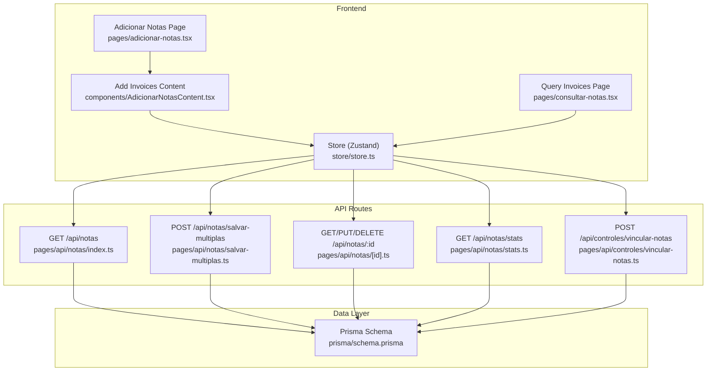
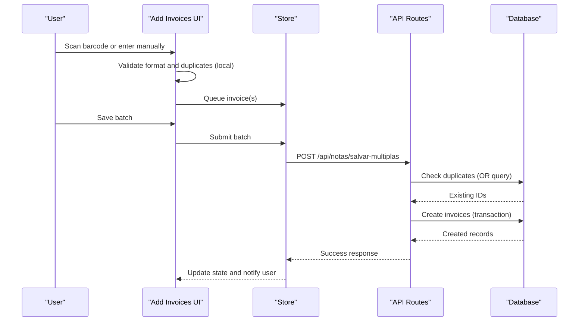
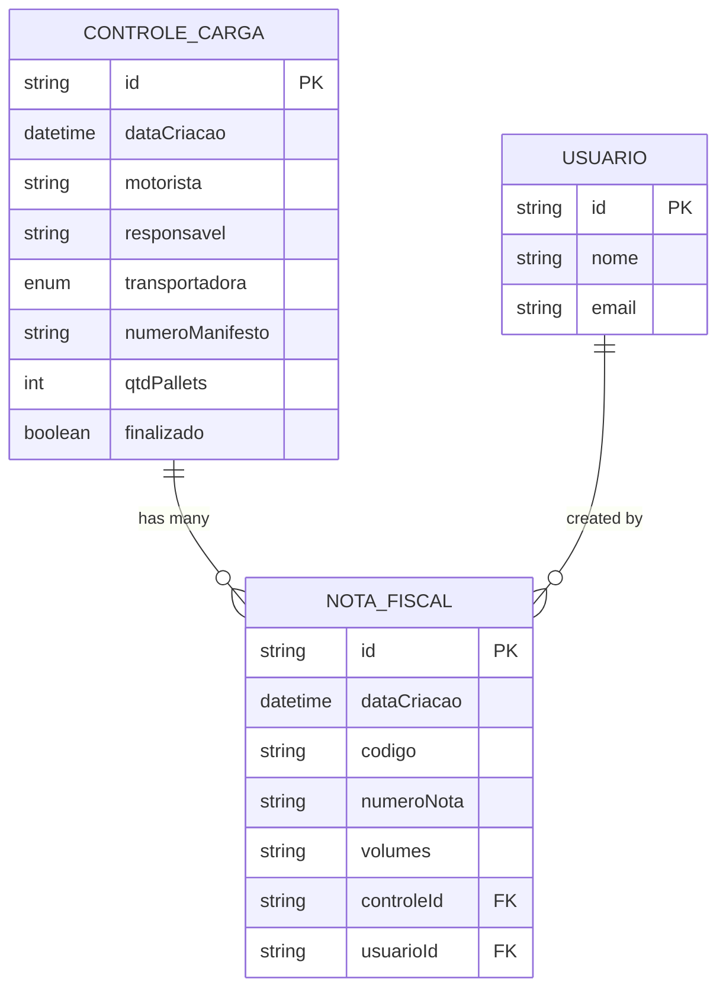
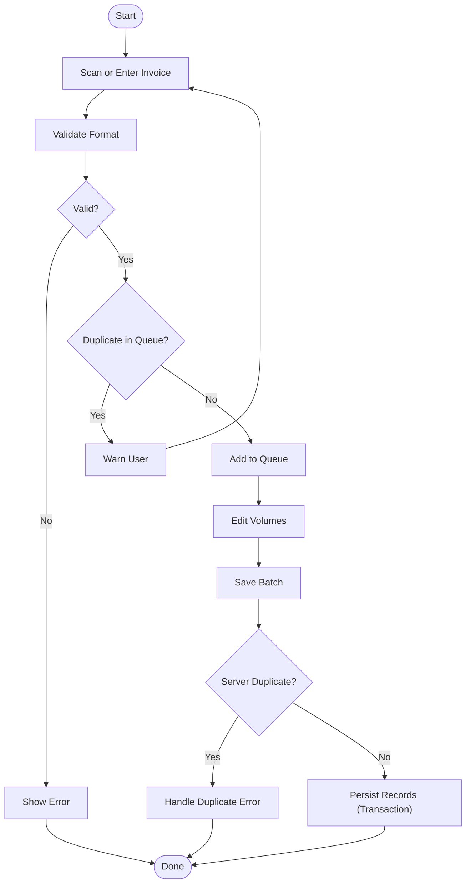
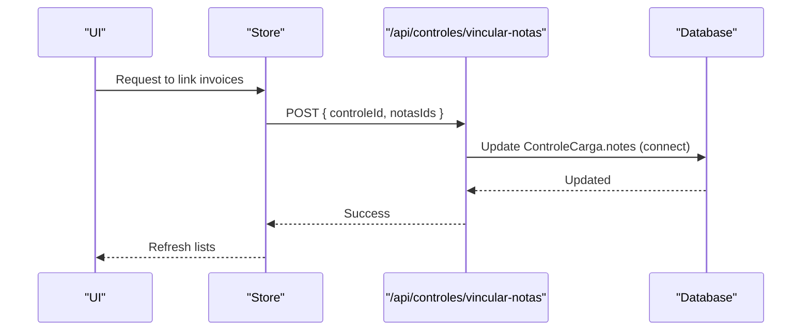
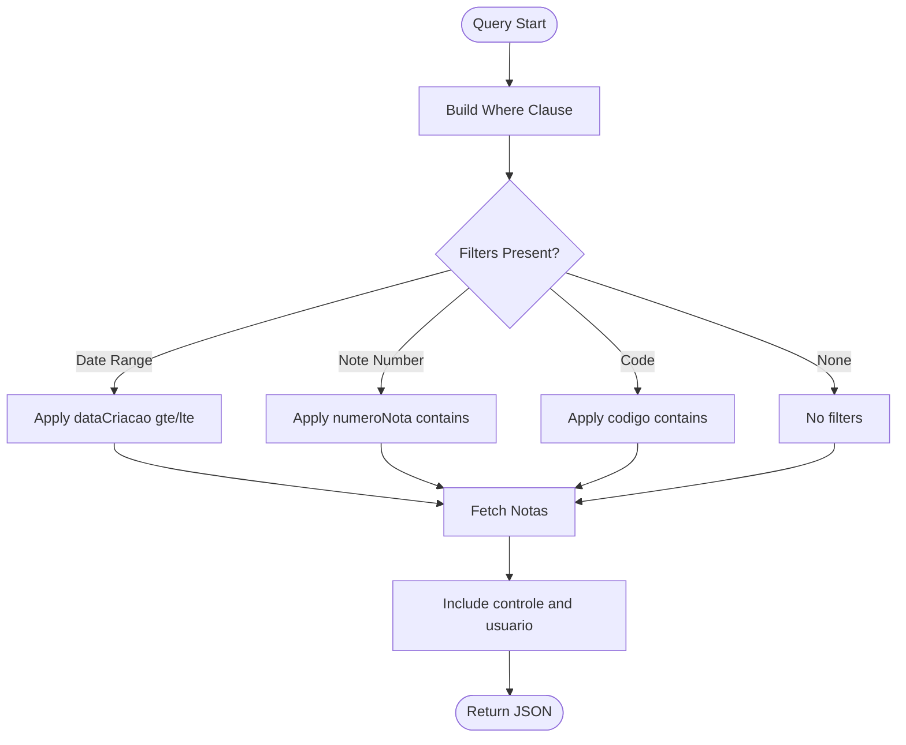
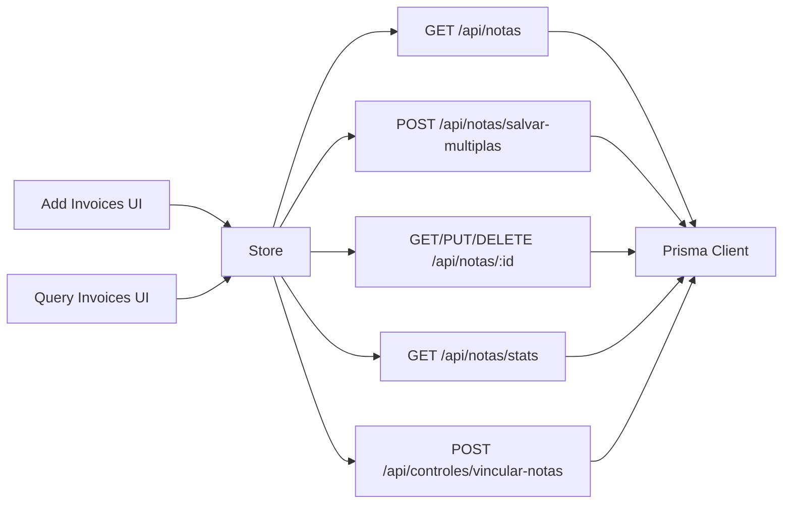

# Invoice Processing

<cite>
**Referenced Files in This Document**
- [schema.prisma](file://prisma/schema.prisma)
- [pages/api/notas/index.ts](file://pages/api/notas/index.ts)
- [pages/api/notas/salvar-multiplas.ts](file://pages/api/notas/salvar-multiplas.ts)
- [pages/api/notas/[id].ts](file://pages/api/notas/[id].ts)
- [pages/api/notas/stats.ts](file://pages/api/notas/stats.ts)
- [pages/api/controles/vincular-notas.ts](file://pages/api/controles/vincular-notas.ts)
- [components/AdicionarNotasContent.tsx](file://components/AdicionarNotasContent.tsx)
- [store/store.ts](file://store/store.ts)
- [pages/adicionar-notas.tsx](file://pages/adicionar-notas.tsx)
- [pages/consultar-notas.tsx](file://pages/consultar-notas.tsx)
</cite>

## Table of Contents
1. Introduction
2. Project Structure
3. Core Components
4. Architecture Overview
5. Detailed Component Analysis
6. Dependency Analysis
7. Performance Considerations
8. Troubleshooting Guide
9. Conclusion

## Introduction
This document explains the invoice (Nota Fiscal) processing features in the system, including how invoices are added, validated, linked to cargo controls, and queried. It covers data models, field mappings, business rules for fiscal compliance, batch processing, duplicate detection, error handling, audit logging, and integration points with external systems.

## Project Structure
Invoice processing spans frontend pages, a state store, Next.js API routes, and a Prisma data model:
- Frontend pages provide UI for adding and querying invoices and linking them to cargo controls.
- The store coordinates API calls and local state for invoices and cargo controls.
- API routes handle CRUD operations, filtering, statistics, and linking invoices to cargo controls.
- The Prisma schema defines the core entities and relationships.

**Diagram sources**
- [pages/adicionar-notas.tsx:1-49](file://pages/adicionar-notas.tsx#L1-L49)
- [components/AdicionarNotasContent.tsx:1-800](file://components/AdicionarNotasContent.tsx#L1-L800)
- [pages/consultar-notas.tsx:1-367](file://pages/consultar-notas.tsx#L1-L367)
- [store/store.ts:1-567](file://store/store.ts#L1-L567)
- [pages/api/notas/index.ts:1-87](file://pages/api/notas/index.ts#L1-L87)
- [pages/api/notas/salvar-multiplas.ts:1-78](file://pages/api/notas/salvar-multiplas.ts#L1-L78)
- [pages/api/notas/[id].ts:1-69](file://pages/api/notas/[id].ts#L1-L69)
- [pages/api/notas/stats.ts:1-45](file://pages/api/notas/stats.ts#L1-L45)
- [pages/api/controles/vincular-notas.ts:1-31](file://pages/api/controles/vincular-notas.ts#L1-L31)
- [prisma/schema.prisma:1-559](file://prisma/schema.prisma#L1-L559)

**Section sources**
- [pages/adicionar-notas.tsx:1-49](file://pages/adicionar-notas.tsx#L1-L49)
- [components/AdicionarNotasContent.tsx:1-800](file://components/AdicionarNotasContent.tsx#L1-L800)
- [pages/consultar-notas.tsx:1-367](file://pages/consultar-notas.tsx#L1-L367)
- [store/store.ts:1-567](file://store/store.ts#L1-L567)
- [pages/api/notas/index.ts:1-87](file://pages/api/notas/index.ts#L1-L87)
- [pages/api/notas/salvar-multiplas.ts:1-78](file://pages/api/notas/salvar-multiplas.ts#L1-L78)
- [pages/api/notas/[id].ts:1-69](file://pages/api/notas/[id].ts#L1-L69)
- [pages/api/notas/stats.ts:1-45](file://pages/api/notas/stats.ts#L1-L45)
- [pages/api/controles/vincular-notas.ts:1-31](file://pages/api/controles/vincular-notas.ts#L1-L31)
- [prisma/schema.prisma:1-559](file://prisma/schema.prisma#L1-L559)

## Core Components
- NotaFiscal model: stores invoice metadata (code, number, volumes), creation timestamp, optional user and cargo control links.
- ControleCarga model: represents a cargo control; has a one-to-many relationship with NotaFiscal via notas.
- API endpoints:
  - GET /api/notas: list invoices with filters (date range, note number, code).
  - POST /api/notas/salvar-multiplas: batch create invoices with duplicate detection and transactional writes.
  - GET/PUT/DELETE /api/notas/:id: single invoice operations.
  - GET /api/notas/stats: counts for today and month.
  - POST /api/controles/vincular-notas: link existing invoices to a cargo control.
- Frontend:
  - Add Invoices page and content component: barcode scanning, manual entry, validation, editing volumes, saving batches.
  - Query Invoices page: filter by date and number, view status (linked or available), delete.
- Store: orchestrates API calls, manages local state for invoices and cargo controls, and handles errors.

**Section sources**
- [prisma/schema.prisma:11-67](file://prisma/schema.prisma#L11-L67)
- [pages/api/notas/index.ts:1-87](file://pages/api/notas/index.ts#L1-L87)
- [pages/api/notas/salvar-multiplas.ts:1-78](file://pages/api/notas/salvar-multiplas.ts#L1-L78)
- [pages/api/notas/[id].ts:1-69](file://pages/api/notas/[id].ts#L1-L69)
- [pages/api/notas/stats.ts:1-45](file://pages/api/notas/stats.ts#L1-L45)
- [pages/api/controles/vincular-notas.ts:1-31](file://pages/api/controles/vincular-notas.ts#L1-L31)
- [components/AdicionarNotasContent.tsx:1-800](file://components/AdicionarNotasContent.tsx#L1-L800)
- [pages/consultar-notas.tsx:1-367](file://pages/consultar-notas.tsx#L1-L367)
- [store/store.ts:1-567](file://store/store.ts#L1-L567)

## Architecture Overview
The invoice processing flow integrates UI, state management, API routes, and database operations:
- Users add invoices via barcode scanner or manual input; the UI validates and queues entries.
- Batch save sends all queued invoices to the server, which performs duplicate checks and persists records atomically.
- Invoices can be linked to cargo controls through a dedicated endpoint.
- Queries support filtering by date ranges and identifiers; stats provide quick metrics.

**Diagram sources**
- [components/AdicionarNotasContent.tsx:176-285](file://components/AdicionarNotasContent.tsx#L176-L285)
- [components/AdicionarNotasContent.tsx:393-467](file://components/AdicionarNotasContent.tsx#L393-L467)
- [store/store.ts:197-267](file://store/store.ts#L197-L267)
- [pages/api/notas/salvar-multiplas.ts:11-72](file://pages/api/notas/salvar-multiplas.ts#L11-L72)

## Detailed Component Analysis

### Data Model and Field Mappings
- NotaFiscal fields:
  - id: unique identifier
  - dataCriacao: creation timestamp
  - codigo: invoice code (e.g., barcode or short code)
  - numeroNota: invoice number (extracted from barcode or entered manually)
  - volumes: string representing volume count (default "1")
  - controleId: optional link to cargo control
  - usuarioId: optional user who created it
- ControleCarga fields relevant to invoices:
  - notas: relation to NotaFiscal[]
- Relationships:
  - One cargo control can have many invoices (notas).
  - Optional user association for auditability.

**Diagram sources**
- [prisma/schema.prisma:11-67](file://prisma/schema.prisma#L11-L67)
- [prisma/schema.prisma:69-96](file://prisma/schema.prisma#L69-L96)

**Section sources**
- [prisma/schema.prisma:11-67](file://prisma/schema.prisma#L11-L67)
- [prisma/schema.prisma:69-96](file://prisma/schema.prisma#L69-L96)

### Invoice Addition Workflow
- Barcode scanning:
  - Validates barcode format (numeric DANFE or short codes).
  - Extracts invoice number from barcode when applicable.
  - Prevents duplicates locally before adding to queue.
- Manual entry:
  - Allows entering invoice number directly.
  - Checks for duplicates against current queue.
- Editing volumes:
  - Each invoice can be edited to set correct volume count.
- Saving:
  - Sends batch to backend; backend normalizes inputs, checks duplicates, and creates records atomically.

**Diagram sources**
- [components/AdicionarNotasContent.tsx:99-164](file://components/AdicionarNotasContent.tsx#L99-L164)
- [components/AdicionarNotasContent.tsx:176-285](file://components/AdicionarNotasContent.tsx#L176-L285)
- [components/AdicionarNotasContent.tsx:329-376](file://components/AdicionarNotasContent.tsx#L329-L376)
- [pages/api/notas/salvar-multiplas.ts:23-72](file://pages/api/notas/salvar-multiplas.ts#L23-L72)

**Section sources**
- [components/AdicionarNotasContent.tsx:99-164](file://components/AdicionarNotasContent.tsx#L99-L164)
- [components/AdicionarNotasContent.tsx:176-285](file://components/AdicionarNotasContent.tsx#L176-L285)
- [components/AdicionarNotasContent.tsx:329-376](file://components/AdicionarNotasContent.tsx#L329-L376)
- [pages/api/notas/salvar-multiplas.ts:23-72](file://pages/api/notas/salvar-multiplas.ts#L23-L72)

### Linking Invoices to Cargo Controls
- Endpoint: POST /api/controles/vincular-notas
- Inputs:
  - controleId: ID of the cargo control
  - notasIds: array of invoice IDs to link
- Behavior:
  - Updates the cargo control record to connect multiple invoices.
  - Returns success message on completion.

**Diagram sources**
- [pages/api/controles/vincular-notas.ts:4-25](file://pages/api/controles/vincular-notas.ts#L4-L25)
- [store/store.ts:399-412](file://store/store.ts#L399-L412)

**Section sources**
- [pages/api/controles/vincular-notas.ts:4-25](file://pages/api/controles/vincular-notas.ts#L4-L25)
- [store/store.ts:399-412](file://store/store.ts#L399-L412)

### Querying and Filtering Invoices
- GET /api/notas supports:
  - Date range filters (start/end)
  - Partial match on invoice number (numeroNota)
  - Partial match on code (codigo)
- Response includes related cargo control and user info for display.

**Diagram sources**
- [pages/api/notas/index.ts:9-79](file://pages/api/notas/index.ts#L9-L79)

**Section sources**
- [pages/api/notas/index.ts:9-79](file://pages/api/notas/index.ts#L9-L79)

### Statistics Endpoint
- GET /api/notas/stats returns:
  - notasHoje: count of invoices created today
  - notasMes: count of invoices created this month
- Uses date boundaries to compute counts efficiently.

**Section sources**
- [pages/api/notas/stats.ts:5-39](file://pages/api/notas/stats.ts#L5-L39)

### Single Invoice Operations
- GET /api/notas/:id: retrieve a specific invoice with related cargo control.
- PUT /api/notas/:id: update fields (codigo, numeroNota, volumes, controleId, usuarioId).
- DELETE /api/notas/:id: remove an invoice.

**Section sources**
- [pages/api/notas/[id].ts:11-67](file://pages/api/notas/[id].ts#L11-L67)

## Dependency Analysis
- Frontend components depend on the store for state and API orchestration.
- Store depends on API routes for persistence and queries.
- API routes depend on Prisma client to interact with the database.
- Data model enforces relationships between cargo controls and invoices.

**Diagram sources**
- [components/AdicionarNotasContent.tsx:393-467](file://components/AdicionarNotasContent.tsx#L393-L467)
- [store/store.ts:83-123](file://store/store.ts#L83-L123)
- [store/store.ts:197-267](file://store/store.ts#L197-L267)
- [store/store.ts:399-412](file://store/store.ts#L399-L412)
- [pages/api/notas/index.ts:1-87](file://pages/api/notas/index.ts#L1-L87)
- [pages/api/notas/salvar-multiplas.ts:1-78](file://pages/api/notas/salvar-multiplas.ts#L1-L78)
- [pages/api/notas/[id].ts:1-69](file://pages/api/notas/[id].ts#L1-L69)
- [pages/api/notas/stats.ts:1-45](file://pages/api/notas/stats.ts#L1-L45)
- [pages/api/controles/vincular-notas.ts:1-31](file://pages/api/controles/vincular-notas.ts#L1-L31)

**Section sources**
- [components/AdicionarNotasContent.tsx:393-467](file://components/AdicionarNotasContent.tsx#L393-L467)
- [store/store.ts:83-123](file://store/store.ts#L83-L123)
- [store/store.ts:197-267](file://store/store.ts#L197-L267)
- [store/store.ts:399-412](file://store/store.ts#L399-L412)
- [pages/api/notas/index.ts:1-87](file://pages/api/notas/index.ts#L1-L87)
- [pages/api/notas/salvar-multiplas.ts:1-78](file://pages/api/notas/salvar-multiplas.ts#L1-L78)
- [pages/api/notas/[id].ts:1-69](file://pages/api/notas/[id].ts#L1-L69)
- [pages/api/notas/stats.ts:1-45](file://pages/api/notas/stats.ts#L1-L45)
- [pages/api/controles/vincular-notas.ts:1-31](file://pages/api/controles/vincular-notas.ts#L1-L31)

## Performance Considerations
- Batch creation uses a database transaction to ensure atomicity and reduce round trips.
- Filtering leverages Prisma where clauses for efficient queries.
- Stats endpoint computes counts using date-bounded queries for performance.
- Avoid excessive re-renders by updating local state only after successful server responses.

[No sources needed since this section provides general guidance]

## Troubleshooting Guide
Common issues and resolutions:
- Invalid barcode format:
  - Ensure numeric codes are either 44 digits (DANFE) or up to 20 digits; alphanumeric with hyphens is also accepted.
  - See validation logic in the add invoices content.
- Duplicate invoice detection:
  - Local queue prevents immediate duplicates; server-side check prevents cross-session duplicates.
  - Errors return clear messages indicating duplication.
- Malformed invoice data:
  - Backend normalizes inputs and requires both code and invoice number; missing fields trigger validation errors.
- Authentication/session errors:
  - Store checks authentication before saving; session expiration triggers logout prompts.
- Linking failures:
  - Ensure valid controleId and notasIds; invalid payloads return validation errors.

**Section sources**
- [components/AdicionarNotasContent.tsx:99-164](file://components/AdicionarNotasContent.tsx#L99-L164)
- [components/AdicionarNotasContent.tsx:176-285](file://components/AdicionarNotasContent.tsx#L176-L285)
- [pages/api/notas/salvar-multiplas.ts:23-57](file://pages/api/notas/salvar-multiplas.ts#L23-L57)
- [store/store.ts:197-267](file://store/store.ts#L197-L267)
- [pages/api/controles/vincular-notas.ts:9-14](file://pages/api/controles/vincular-notas.ts#L9-L14)

## Conclusion
The invoice processing system provides robust capabilities for adding, validating, linking, and querying invoices. It enforces data integrity through local and server-side validations, supports batch operations with transactional safety, and offers clear error handling. While direct external fiscal system integration is not implemented in the analyzed files, the architecture allows future extensions for such integrations. Audit logging can be enhanced by leveraging existing user associations and access audit models present in the schema.

[No sources needed since this section summarizes without analyzing specific files]