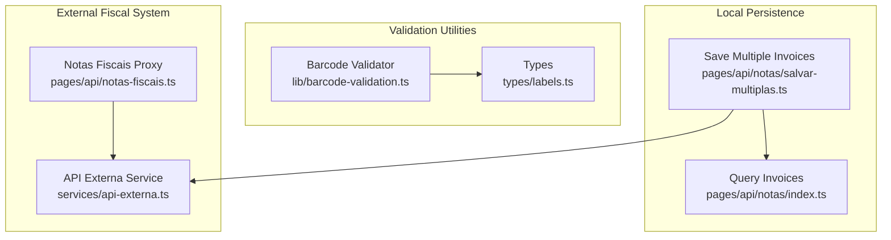
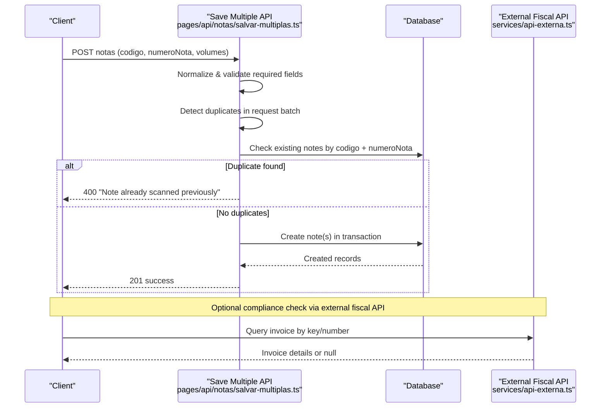
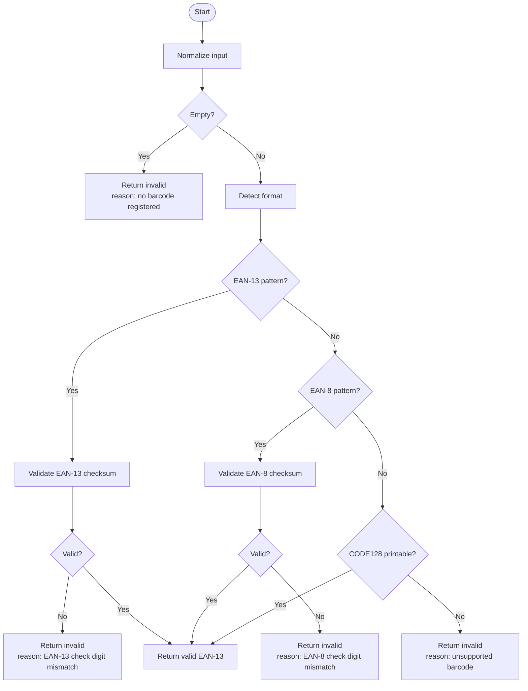
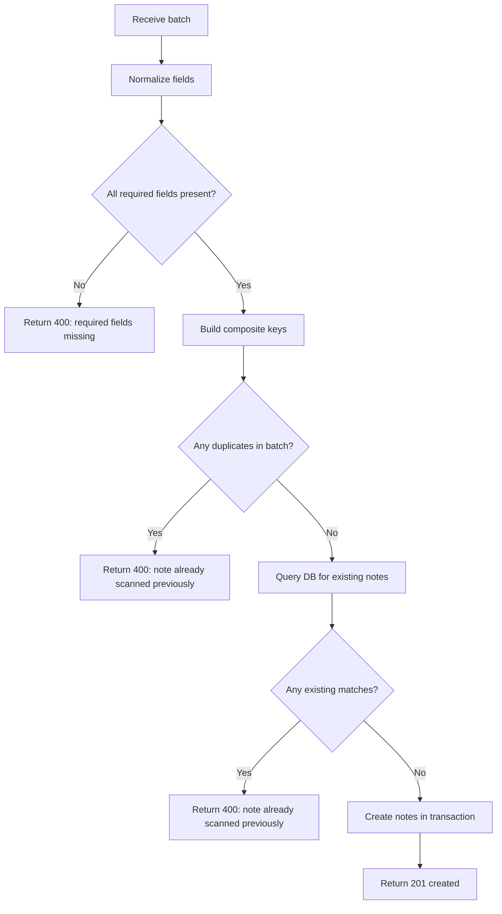
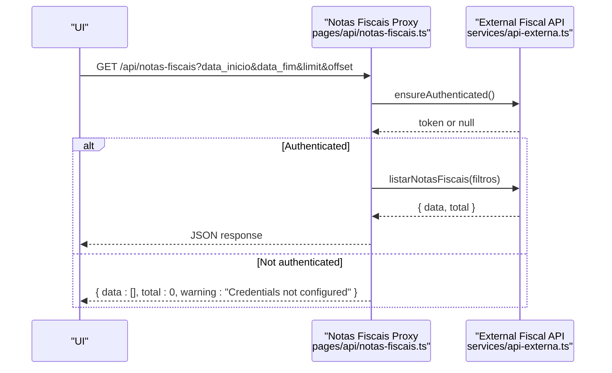
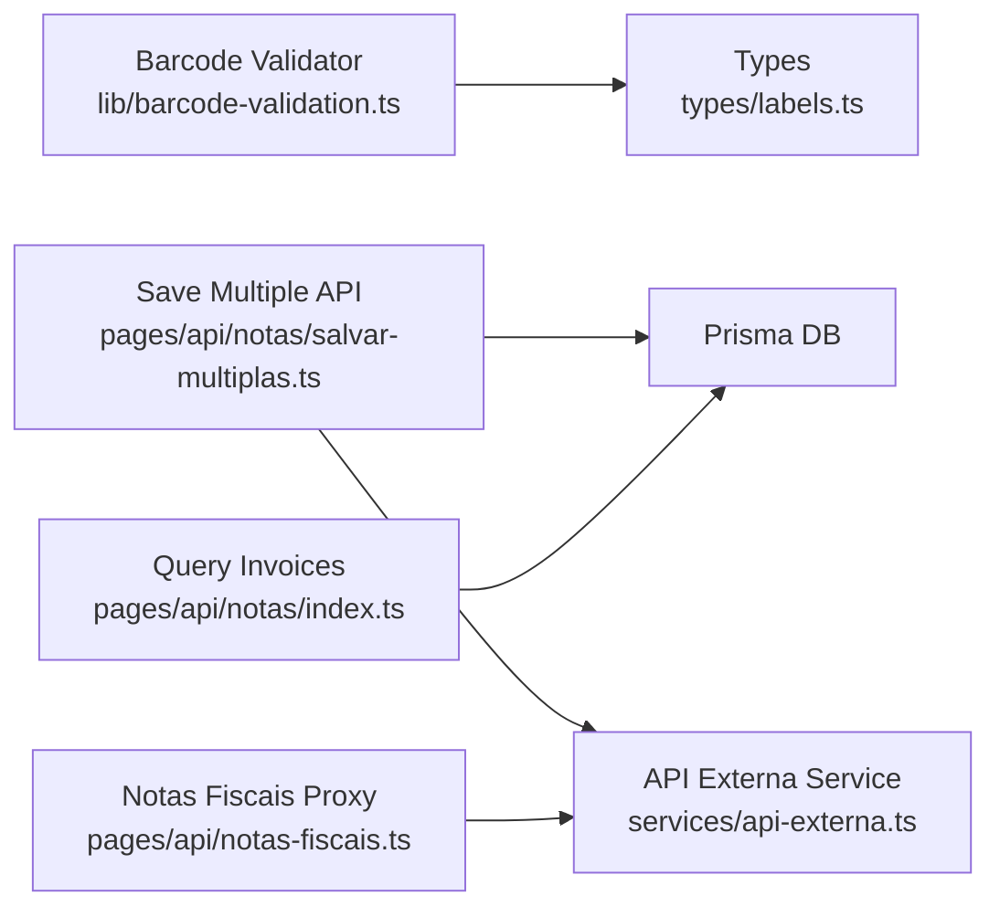

# Invoice Validation Rules

<cite>
**Referenced Files in This Document**
- [barcode-validation.ts](file://lib/barcode-validation.ts)
- [labels.ts](file://types/labels.ts)
- [index.ts](file://pages/api/notas/index.ts)
- [salvar-multiplas.ts](file://pages/api/notas/salvar-multiplas.ts)
- [notas-fiscais.ts](file://pages/api/notas-fiscais.ts)
- [api-externa.ts](file://services/api-externa.ts)
</cite>

## Table of Contents
1. Introduction
2. Project Structure
3. Core Components
4. Architecture Overview
5. Detailed Component Analysis
6. Dependency Analysis
7. Performance Considerations
8. Troubleshooting Guide
9. Conclusion

## Introduction
This document explains the invoice validation rules and business logic implemented in the system, focusing on barcode validation, fiscal number format checks, data integrity verification, duplicate detection, and compliance checks against external fiscal systems. It also documents the validation pipeline, error detection mechanisms, user feedback for invalid invoices, and recovery procedures when validations fail.

## Project Structure
The invoice validation flow spans several layers:
- Barcode validation utilities that normalize and validate scanned codes (EAN-13, EAN-8, CODE128).
- API endpoints that persist invoice records with basic validation and duplicate detection.
- External service integration to verify invoices against an external fiscal system.
- Shared types that define barcode formats and analysis results used across components.

**Diagram sources**
- [barcode-validation.ts:1-89](file://lib/barcode-validation.ts#L1-L89)
- [labels.ts:1-121](file://types/labels.ts#L1-L121)
- [index.ts:1-87](file://pages/api/notas/index.ts#L1-L87)
- [salvar-multiplas.ts:1-78](file://pages/api/notas/salvar-multiplas.ts#L1-L78)
- [notas-fiscais.ts:1-60](file://pages/api/notas-fiscais.ts#L1-L60)
- [api-externa.ts:1-800](file://services/api-externa.ts#L1-L800)

**Section sources**
- [barcode-validation.ts:1-89](file://lib/barcode-validation.ts#L1-L89)
- [labels.ts:1-121](file://types/labels.ts#L1-L121)
- [index.ts:1-87](file://pages/api/notas/index.ts#L1-L87)
- [salvar-multiplas.ts:1-78](file://pages/api/notas/salvar-multiplas.ts#L1-L78)
- [notas-fiscais.ts:1-60](file://pages/api/notas-fiscais.ts#L1-L60)
- [api-externa.ts:1-800](file://services/api-externa.ts#L1-L800)

## Core Components
- Barcode validator: Normalizes input, detects format (EAN-13, EAN-8, CODE128), validates checksums, and returns a structured analysis result with reason messages for failures.
- Invoice persistence endpoints: Validate required fields, enforce uniqueness per scan session, and create records atomically.
- External fiscal integration: Authenticates, queries, and retrieves invoice details from the external fiscal system, with robust error handling and fallback strategies.

Key responsibilities:
- Ensure scanned barcodes are valid before proceeding.
- Prevent duplicate invoice entries within a batch or database.
- Verify invoice existence and details against the external fiscal system.
- Provide clear error messages to guide users to correct issues.

**Section sources**
- [barcode-validation.ts:1-89](file://lib/barcode-validation.ts#L1-L89)
- [salvar-multiplas.ts:1-78](file://pages/api/notas/salvar-multiplas.ts#L1-L78)
- [api-externa.ts:1-800](file://services/api-externa.ts#L1-L800)

## Architecture Overview
The validation architecture combines local barcode checks, database constraints, and external fiscal verification.

**Diagram sources**
- [salvar-multiplas.ts:1-78](file://pages/api/notas/salvar-multiplas.ts#L1-L78)
- [api-externa.ts:1-800](file://services/api-externa.ts#L1-L800)

**Section sources**
- [salvar-multiplas.ts:1-78](file://pages/api/notas/salvar-multiplas.ts#L1-L78)
- [api-externa.ts:1-800](file://services/api-externa.ts#L1-L800)

## Detailed Component Analysis

### Barcode Validation Pipeline
- Input normalization: Trims whitespace and ensures non-null values.
- Format detection: Identifies EAN-13, EAN-8, or CODE128; unsupported formats are flagged.
- Checksum validation: Computes and verifies EAN-13/EAN-8 check digits.
- Result structure: Returns validity, type, normalized value, and optional reason for failure.

**Diagram sources**
- [barcode-validation.ts:1-89](file://lib/barcode-validation.ts#L1-L89)
- [labels.ts:1-121](file://types/labels.ts#L1-L121)

**Section sources**
- [barcode-validation.ts:1-89](file://lib/barcode-validation.ts#L1-L89)
- [labels.ts:1-121](file://types/labels.ts#L1-L121)

### Invoice Acceptance Rules and Duplicate Detection
- Required fields: Both code and invoice number must be present and trimmed.
- Batch-level duplicate detection: Uses a composite key of code + invoice number to prevent re-scanning within the same request.
- Database-level duplicate detection: Queries existing records to ensure global uniqueness before creation.
- Atomic creation: Creates multiple invoices in a single transaction to maintain consistency.

**Diagram sources**
- [salvar-multiplas.ts:1-78](file://pages/api/notas/salvar-multiplas.ts#L1-L78)

**Section sources**
- [salvar-multiplas.ts:1-78](file://pages/api/notas/salvar-multiplas.ts#L1-L78)

### Data Integrity Verification
- Field normalization: Ensures consistent formatting and trimming for code, invoice number, and volumes.
- Type safety: Enforces presence of mandatory fields and defaults for optional fields like volumes.
- Transactional writes: Guarantees all-or-nothing persistence for multiple invoices.

**Section sources**
- [salvar-multiplas.ts:1-78](file://pages/api/notas/salvar-multiplas.ts#L1-L78)

### Compliance Checks Against External Fiscal Systems
- Authentication: Obtains and manages tokens with retry blocking and expiration handling.
- Lookup strategies: Attempts multiple endpoints to find invoices by number, series, key, or identification field.
- Error resilience: Gracefully handles timeouts, 4xx/5xx responses, and authentication failures.
- Proxy endpoint: Aggregates external invoice listing with pagination and date filters.

**Diagram sources**
- [notas-fiscais.ts:1-60](file://pages/api/notas-fiscais.ts#L1-L60)
- [api-externa.ts:1-800](file://services/api-externa.ts#L1-L800)

**Section sources**
- [notas-fiscais.ts:1-60](file://pages/api/notas-fiscais.ts#L1-L60)
- [api-externa.ts:1-800](file://services/api-externa.ts#L1-L800)

### User Feedback for Invalid Invoices
- Barcode errors: Specific reasons indicate whether the barcode is empty, unsupported, or has a checksum mismatch.
- Validation errors: Clear messages for missing required fields and duplicate scans.
- External system warnings: When credentials are missing, the proxy returns a safe empty dataset with a warning.

Examples of expected behaviors:
- Empty barcode: Returns invalid with a reason indicating no barcode registered.
- EAN-13 with wrong check digit: Returns invalid with a reason specifying check digit mismatch.
- Duplicate scan: Returns 400 with a message indicating the note was already scanned.
- Missing credentials: Returns empty data with a warning about unconfigured credentials.

**Section sources**
- [barcode-validation.ts:1-89](file://lib/barcode-validation.ts#L1-L89)
- [salvar-multiplas.ts:1-78](file://pages/api/notas/salvar-multiplas.ts#L1-L78)
- [notas-fiscais.ts:1-60](file://pages/api/notas-fiscais.ts#L1-L60)

### Recovery Procedures for Failed Validations
- Retry external authentication: The service blocks repeated login attempts after failures and uses token expiration management.
- Fallback lookups: If direct lookup fails, the service tries alternative endpoints to locate invoices.
- Graceful degradation: When external credentials are missing, the system returns safe defaults instead of failing hard.

**Section sources**
- [api-externa.ts:1-800](file://services/api-externa.ts#L1-L800)

## Dependency Analysis
The validation pipeline depends on shared types and services:
- Barcode validation relies on label types to define formats and analysis results.
- Invoice persistence interacts with the database through Prisma.
- External compliance checks depend on the API externa service for authentication and querying.

**Diagram sources**
- [barcode-validation.ts:1-89](file://lib/barcode-validation.ts#L1-L89)
- [labels.ts:1-121](file://types/labels.ts#L1-L121)
- [salvar-multiplas.ts:1-78](file://pages/api/notas/salvar-multiplas.ts#L1-L78)
- [notas-fiscais.ts:1-60](file://pages/api/notas-fiscais.ts#L1-L60)
- [api-externa.ts:1-800](file://services/api-externa.ts#L1-L800)
- [index.ts:1-87](file://pages/api/notas/index.ts#L1-L87)

**Section sources**
- [barcode-validation.ts:1-89](file://lib/barcode-validation.ts#L1-L89)
- [labels.ts:1-121](file://types/labels.ts#L1-L121)
- [salvar-multiplas.ts:1-78](file://pages/api/notas/salvar-multiplas.ts#L1-L78)
- [notas-fiscais.ts:1-60](file://pages/api/notas-fiscais.ts#L1-L60)
- [api-externa.ts:1-800](file://services/api-externa.ts#L1-L800)
- [index.ts:1-87](file://pages/api/notas/index.ts#L1-L87)

## Performance Considerations
- Token caching and retry blocking reduce redundant authentication calls to the external system.
- Pagination and limits on external invoice listings prevent excessive payloads.
- Transactional writes ensure atomicity and minimize partial state inconsistencies.
- Early validation (required fields, duplicates) reduces unnecessary database and network calls.

[No sources needed since this section provides general guidance]

## Troubleshooting Guide
Common issues and resolutions:
- Barcode validation failures:
  - Empty or unsupported barcode: Ensure the scanner reads a supported format and the product has a registered barcode.
  - Check digit mismatch: Verify the scanned barcode matches the product’s registered EAN-13/EAN-8.
- Duplicate scan errors:
  - Remove duplicates from the batch or confirm if the invoice was already saved.
- External system connectivity:
  - Check credentials configuration; if missing, the proxy returns a warning and empty data.
  - Review authentication logs for blocked retries due to prior failures.

**Section sources**
- [barcode-validation.ts:1-89](file://lib/barcode-validation.ts#L1-L89)
- [salvar-multiplas.ts:1-78](file://pages/api/notas/salvar-multiplas.ts#L1-L78)
- [notas-fiscais.ts:1-60](file://pages/api/notas-fiscais.ts#L1-L60)
- [api-externa.ts:1-800](file://services/api-externa.ts#L1-L800)

## Conclusion
The system implements a robust invoice validation pipeline combining barcode validation, strict acceptance rules, duplicate detection, and external fiscal compliance checks. Clear error messages and resilient external integrations ensure reliable operations and actionable feedback for users. Proper configuration of external credentials and adherence to barcode standards are essential for successful validations.

[No sources needed since this section summarizes without analyzing specific files]