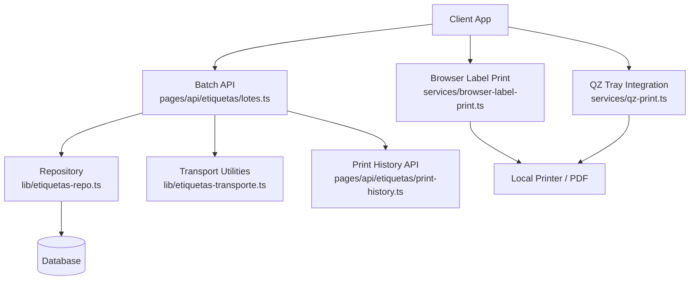
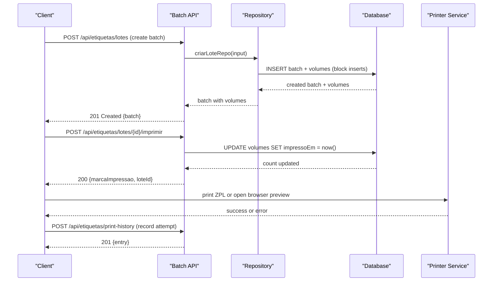
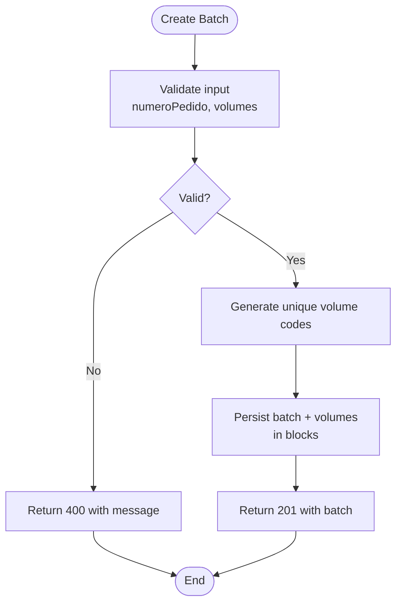
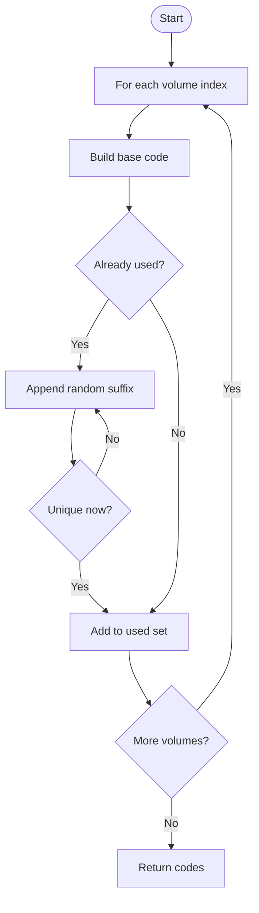
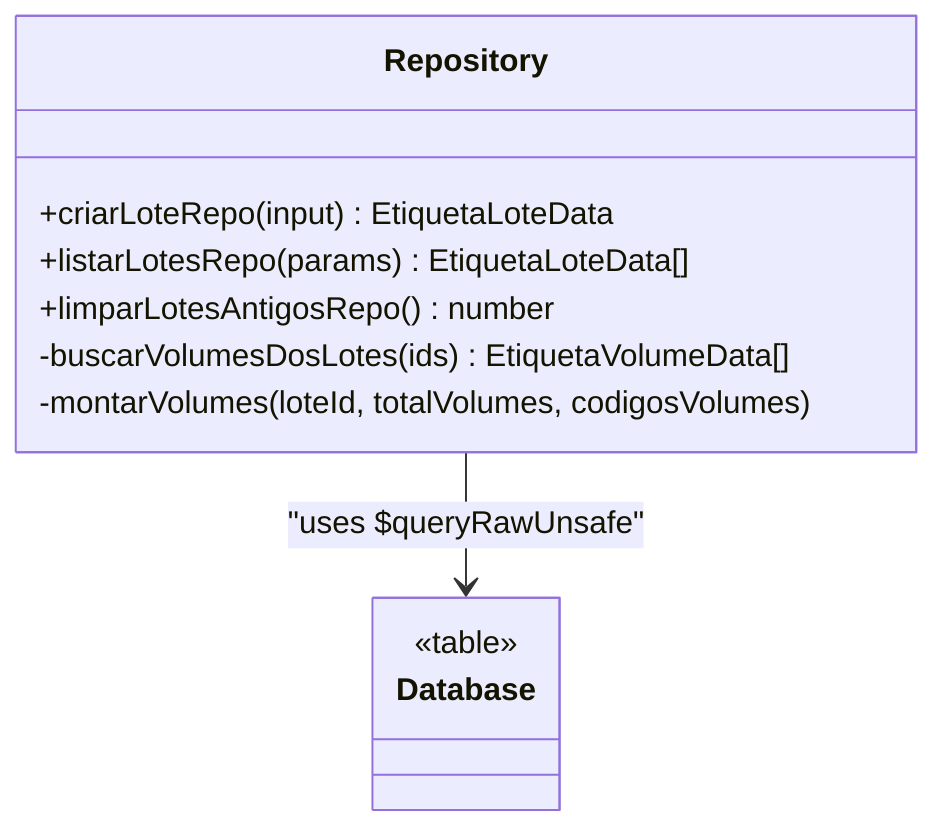
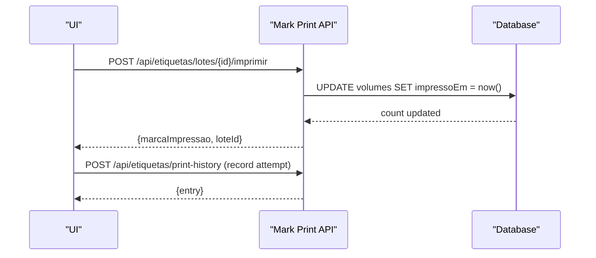
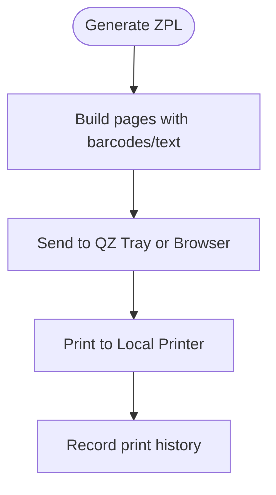
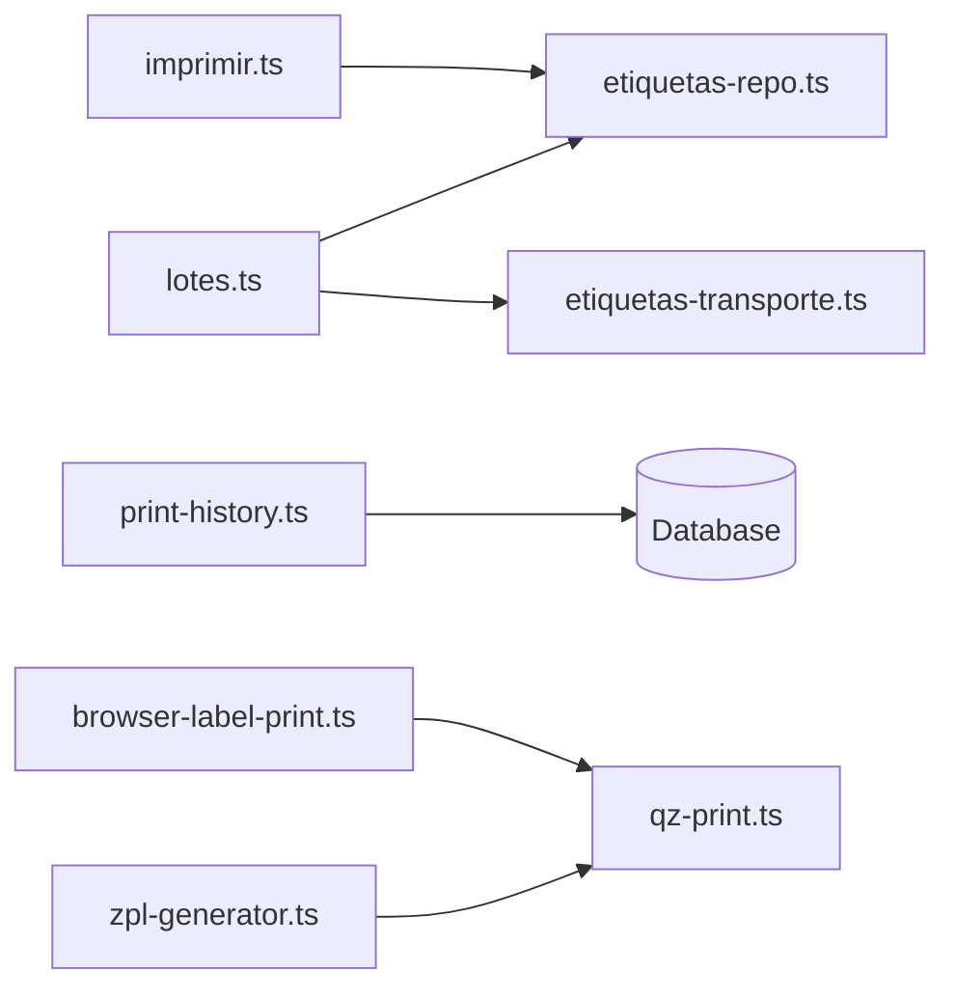

# Batch Processing & Queue Management

<cite>
**Referenced Files in This Document**
- [lotes.ts](file://pages/api/etiquetas/lotes.ts)
- [etiquetas-repo.ts](file://lib/etiquetas-repo.ts)
- [etiquetas-transporte.ts](file://lib/etiquetas-transporte.ts)
- [imprimir.ts](file://pages/api/etiquetas/lotes/[id]/imprimir.ts)
- [print-history.ts](file://pages/api/etiquetas/print-history.ts)
- [zpl-generator.ts](file://lib/zpl-generator.ts)
- [qz-print.ts](file://services/qz-print.ts)
- [browser-label-print.ts](file://services/browser-label-print.ts)
</cite>

## Table of Contents
1. Introduction
2. Project Structure
3. Core Components
4. Architecture Overview
5. Detailed Component Analysis
6. Dependency Analysis
7. Performance Considerations
8. Troubleshooting Guide
9. Conclusion
10. Appendices

## Introduction
This document explains how the system processes label batches end-to-end, focusing on efficient batch creation, progress tracking, error handling for individual failures, and queue-like patterns for high-volume operations. It covers the lifecycle from batch creation to completion, status monitoring via print history, and background processing patterns using browser-based printing and QZ Tray integration. Guidance is provided for implementing custom batch processors, monitoring progress, and scaling label generation.

## Project Structure
The batch label system spans API endpoints, repository logic, transport utilities, ZPL generation, and client-side printing:
- API endpoints create and list batches, mark prints, and record print history.
- Repository layer persists batches and volumes with safe SQL and block inserts.
- Transport utilities generate unique volume codes and validate inputs.
- ZPL generator builds printer-ready commands for product labels.
- Printing services handle local printers (QZ Tray) or browser-based print workflows.

**Diagram sources**
- [lotes.ts:17-37](file://pages/api/etiquetas/lotes.ts#L17-L37)
- [etiquetas-repo.ts:176-226](file://lib/etiquetas-repo.ts#L176-L226)
- [etiquetas-transporte.ts:84-108](file://lib/etiquetas-transporte.ts#L84-L108)
- [print-history.ts:8-47](file://pages/api/etiquetas/print-history.ts#L8-L47)
- [browser-label-print.ts:109-185](file://services/browser-label-print.ts#L109-L185)
- [qz-print.ts:148-157](file://services/qz-print.ts#L148-L157)

**Section sources**
- [lotes.ts:17-37](file://pages/api/etiquetas/lotes.ts#L17-L37)
- [etiquetas-repo.ts:176-226](file://lib/etiquetas-repo.ts#L176-L226)
- [etiquetas-transporte.ts:84-108](file://lib/etiquetas-transporte.ts#L84-L108)
- [print-history.ts:8-47](file://pages/api/etiquetas/print-history.ts#L8-L47)
- [browser-label-print.ts:109-185](file://services/browser-label-print.ts#L109-L185)
- [qz-print.ts:148-157](file://services/qz-print.ts#L148-L157)

## Core Components
- Batch creation endpoint: validates input, generates unique volume codes, creates a batch and its volumes, and returns the batch with associated volumes.
- Repository layer: performs safe column detection for optional fields, bulk inserts in blocks to avoid parameter limits, and maps rows to application types.
- Transport utilities: sanitize inputs, normalize transporters, and ensure global uniqueness of volume codes even on reprints.
- Print marking endpoint: marks all volumes in a batch as printed by updating timestamps.
- Print history endpoint: records each print attempt with user, product, barcode, printer, result, and error message.
- ZPL generator: produces Zebra printer commands for product labels, including multi-page layouts and barcode rendering.
- Printing services: integrate with QZ Tray for raw ZPL printing and provide browser-based HTML previews for A4 or small labels.

**Section sources**
- [lotes.ts:39-88](file://pages/api/etiquetas/lotes.ts#L39-L88)
- [etiquetas-repo.ts:176-226](file://lib/etiquetas-repo.ts#L176-L226)
- [etiquetas-transporte.ts:50-58](file://lib/etiquetas-transporte.ts#L50-L58)
- [etiquetas-transporte.ts:84-108](file://lib/etiquetas-transporte.ts#L84-L108)
- [imprimir.ts:29-40](file://pages/api/etiquetas/lotes/[id]/imprimir.ts#L29-L40)
- [print-history.ts:13-43](file://pages/api/etiquetas/print-history.ts#L13-L43)
- [zpl-generator.ts:149-170](file://lib/zpl-generator.ts#L149-L170)
- [qz-print.ts:148-157](file://services/qz-print.ts#L148-L157)
- [browser-label-print.ts:691-745](file://services/browser-label-print.ts#L691-L745)

## Architecture Overview
The system follows a request-driven batch lifecycle with clear separation between API orchestration, persistence, and printing:
- Clients call the batch creation API to start a new batch.
- The repository persists the batch and volumes efficiently using block inserts.
- Clients can retrieve batches and volumes for preview or printing.
- When printing, clients either use browser-based HTML previews or send ZPL via QZ Tray to local printers.
- Each print attempt is recorded in the print history for auditability and troubleshooting.

**Diagram sources**
- [lotes.ts:39-88](file://pages/api/etiquetas/lotes.ts#L39-L88)
- [imprimir.ts:29-40](file://pages/api/etiquetas/lotes/[id]/imprimir.ts#L29-L40)
- [print-history.ts:13-43](file://pages/api/etiquetas/print-history.ts#L13-L43)
- [qz-print.ts:148-157](file://services/qz-print.ts#L148-L157)
- [browser-label-print.ts:691-745](file://services/browser-label-print.ts#L691-L745)

## Detailed Component Analysis

### Batch Creation Flow
- Input validation ensures required fields and constraints (e.g., integer volumes > 0, max limit).
- Unique volume codes are generated; collisions are resolved by appending random suffixes.
- Batch and volumes are persisted in blocks to avoid database parameter limits.
- Errors include duplicate code conflicts and internal server errors.

**Diagram sources**
- [lotes.ts:39-88](file://pages/api/etiquetas/lotes.ts#L39-L88)
- [etiquetas-transporte.ts:84-108](file://lib/etiquetas-transporte.ts#L84-L108)
- [etiquetas-repo.ts:176-226](file://lib/etiquetas-repo.ts#L176-L226)

**Section sources**
- [lotes.ts:39-88](file://pages/api/etiquetas/lotes.ts#L39-L88)
- [etiquetas-transporte.ts:84-108](file://lib/etiquetas-transporte.ts#L84-L108)
- [etiquetas-repo.ts:176-226](file://lib/etiquetas-repo.ts#L176-L226)

### Volume Code Generation and Uniqueness
- Codes follow a readable format combining prefix, sanitized order number, and padded index.
- Existing codes are checked; if collision occurs, a short random suffix is appended until unique.
- This guarantees global uniqueness across reprints and concurrent requests.

**Diagram sources**
- [etiquetas-transporte.ts:84-108](file://lib/etiquetas-transporte.ts#L84-L108)

**Section sources**
- [etiquetas-transporte.ts:84-108](file://lib/etiquetas-transporte.ts#L84-L108)

### Repository Persistence and Memory Optimization
- Uses explicit SQL with dynamic columns to safely handle optional fields like CNPJ.
- Inserts volumes in blocks of 200 to prevent parameter limit overflows.
- Maps rows to typed objects and attaches volumes per batch efficiently.

**Diagram sources**
- [etiquetas-repo.ts:176-226](file://lib/etiquetas-repo.ts#L176-L226)
- [etiquetas-repo.ts:126-145](file://lib/etiquetas-repo.ts#L126-L145)
- [etiquetas-repo.ts:261-308](file://lib/etiquetas-repo.ts#L261-L308)

**Section sources**
- [etiquetas-repo.ts:176-226](file://lib/etiquetas-repo.ts#L176-L226)
- [etiquetas-repo.ts:126-145](file://lib/etiquetas-repo.ts#L126-L145)
- [etiquetas-repo.ts:261-308](file://lib/etiquetas-repo.ts#L261-L308)

### Print Marking and Status Monitoring
- Marking a batch updates all volumes’ print timestamp, enabling status tracking.
- Print history records each attempt with user context, product details, printer, result, and error messages.
- Clients can poll or query history to monitor progress and troubleshoot failures.

**Diagram sources**
- [imprimir.ts:29-40](file://pages/api/etiquetas/lotes/[id]/imprimir.ts#L29-L40)
- [print-history.ts:13-43](file://pages/api/etiquetas/print-history.ts#L13-L43)

**Section sources**
- [imprimir.ts:29-40](file://pages/api/etiquetas/lotes/[id]/imprimir.ts#L29-L40)
- [print-history.ts:13-43](file://pages/api/etiquetas/print-history.ts#L13-L43)

### ZPL Generation and Printing
- ZPL generator builds page layouts, barcodes, and text fields for product labels.
- QZ Tray integration sends raw ZPL to local printers with connection management and error parsing.
- Browser-based printing provides HTML previews for A4 or small labels, supporting multiple layout variants.

**Diagram sources**
- [zpl-generator.ts:149-170](file://lib/zpl-generator.ts#L149-L170)
- [qz-print.ts:148-157](file://services/qz-print.ts#L148-L157)
- [browser-label-print.ts:691-745](file://services/browser-label-print.ts#L691-L745)
- [print-history.ts:13-43](file://pages/api/etiquetas/print-history.ts#L13-L43)

**Section sources**
- [zpl-generator.ts:149-170](file://lib/zpl-generator.ts#L149-L170)
- [qz-print.ts:148-157](file://services/qz-print.ts#L148-L157)
- [browser-label-print.ts:691-745](file://services/browser-label-print.ts#L691-L745)
- [print-history.ts:13-43](file://pages/api/etiquetas/print-history.ts#L13-L43)

### High-Volume Operations and Background Patterns
- Use block inserts in repository to avoid parameter limits and reduce memory pressure.
- Prefer browser-based previews for large batches to offload rendering to the client.
- For direct printing, send ZPL in chunks via QZ Tray and record each attempt in history.
- Implement retry logic at the client level for transient network or printer errors.

[No sources needed since this section provides general guidance]

## Dependency Analysis
Key dependencies and relationships:
- API endpoints depend on repository functions for persistence and transport utilities for validation and code generation.
- Repository depends on Prisma raw queries for safe and efficient data access.
- Printing services depend on QZ Tray or browser APIs to interact with local printers.
- Print history endpoint depends on authentication and role checks before recording attempts.

**Diagram sources**
- [lotes.ts:39-88](file://pages/api/etiquetas/lotes.ts#L39-L88)
- [etiquetas-repo.ts:176-226](file://lib/etiquetas-repo.ts#L176-L226)
- [etiquetas-transporte.ts:84-108](file://lib/etiquetas-transporte.ts#L84-L108)
- [imprimir.ts:29-40](file://pages/api/etiquetas/lotes/[id]/imprimir.ts#L29-L40)
- [print-history.ts:13-43](file://pages/api/etiquetas/print-history.ts#L13-L43)
- [zpl-generator.ts:149-170](file://lib/zpl-generator.ts#L149-L170)
- [qz-print.ts:148-157](file://services/qz-print.ts#L148-L157)
- [browser-label-print.ts:691-745](file://services/browser-label-print.ts#L691-L745)

**Section sources**
- [lotes.ts:39-88](file://pages/api/etiquetas/lotes.ts#L39-L88)
- [etiquetas-repo.ts:176-226](file://lib/etiquetas-repo.ts#L176-L226)
- [etiquetas-transporte.ts:84-108](file://lib/etiquetas-transporte.ts#L84-L108)
- [imprimir.ts:29-40](file://pages/api/etiquetas/lotes/[id]/imprimir.ts#L29-L40)
- [print-history.ts:13-43](file://pages/api/etiquetas/print-history.ts#L13-L43)
- [zpl-generator.ts:149-170](file://lib/zpl-generator.ts#L149-L170)
- [qz-print.ts:148-157](file://services/qz-print.ts#L148-L157)
- [browser-label-print.ts:691-745](file://services/browser-label-print.ts#L691-L745)

## Performance Considerations
- Block inserts: Repository uses fixed-size blocks (e.g., 200) to insert volumes, preventing parameter limit issues and reducing memory overhead.
- Dynamic column selection: Avoids schema mismatch errors when optional columns are missing, ensuring stable performance across environments.
- Barcode analysis: Validates and normalizes barcodes early to fail fast and avoid unnecessary processing.
- Browser rendering: Offloads heavy HTML/CSS rendering to the client for large batches, improving server responsiveness.
- QZ Tray connection reuse: Maintains websocket connections to minimize latency during repeated prints.

[No sources needed since this section provides general guidance]

## Troubleshooting Guide
Common issues and resolutions:
- Duplicate volume codes: Occurs when reprinting orders; handled by appending random suffixes to ensure uniqueness.
- Missing optional columns: Repository detects presence of optional columns (e.g., CNPJ) and adjusts SQL dynamically.
- QZ Tray not installed or unauthorized: Error parsing distinguishes installation, authorization, and connectivity issues with actionable messages.
- Print history failures: Ensure required fields are present and user has proper roles; check authentication and permissions.

**Section sources**
- [lotes.ts:82-88](file://pages/api/etiquetas/lotes.ts#L82-L88)
- [etiquetas-repo.ts:61-82](file://lib/etiquetas-repo.ts#L61-L82)
- [qz-print.ts:159-204](file://services/qz-print.ts#L159-L204)
- [print-history.ts:13-43](file://pages/api/etiquetas/print-history.ts#L13-L43)

## Conclusion
The batch label system provides robust, scalable processing through validated inputs, unique code generation, efficient persistence, and flexible printing options. Status monitoring via print history and resilient error handling enable reliable operation under high-volume conditions. By leveraging block inserts, dynamic schemas, and client-side rendering, the system maintains performance and stability while supporting diverse printing workflows.

[No sources needed since this section summarizes without analyzing specific files]

## Appendices

### Implementing Custom Batch Processors
- Extend the repository layer to support additional batch attributes or custom volume metadata.
- Integrate with external systems by enriching transport utilities with mapping functions.
- Use print history to log custom metrics or outcomes for analytics.

[No sources needed since this section provides general guidance]

### Monitoring Batch Progress
- Poll the batch listing endpoint to retrieve recent batches and their volumes.
- Query print history to track successful and failed print attempts per user and printer.
- Use marking endpoint to update batch status after successful prints.

**Section sources**
- [lotes.ts:91-111](file://pages/api/etiquetas/lotes.ts#L91-L111)
- [print-history.ts:13-43](file://pages/api/etiquetas/print-history.ts#L13-L43)
- [imprimir.ts:29-40](file://pages/api/etiquetas/lotes/[id]/imprimir.ts#L29-L40)

### Handling Large-Scale Label Generation
- Generate ZPL in chunks and stream to QZ Tray to avoid memory spikes.
- Use browser previews for massive batches to distribute rendering load.
- Implement retries with exponential backoff for transient errors in printing or network calls.

[No sources needed since this section provides general guidance]