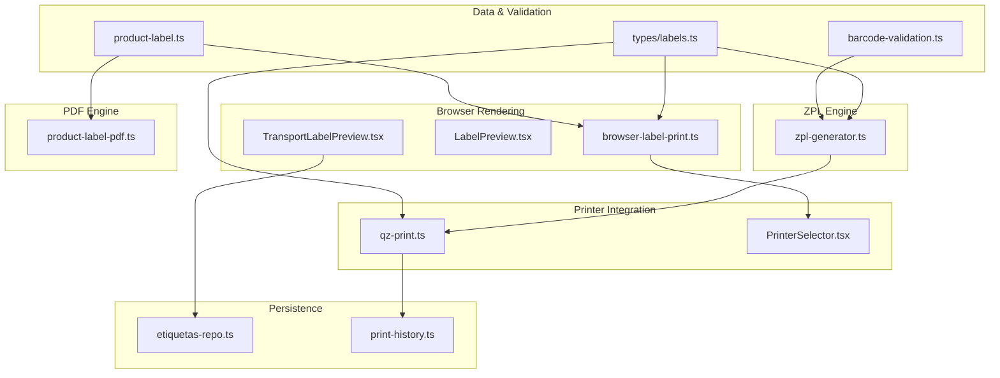
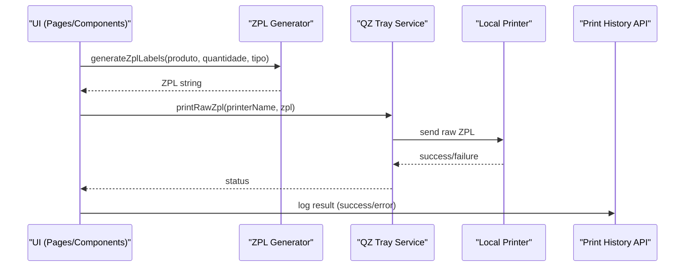
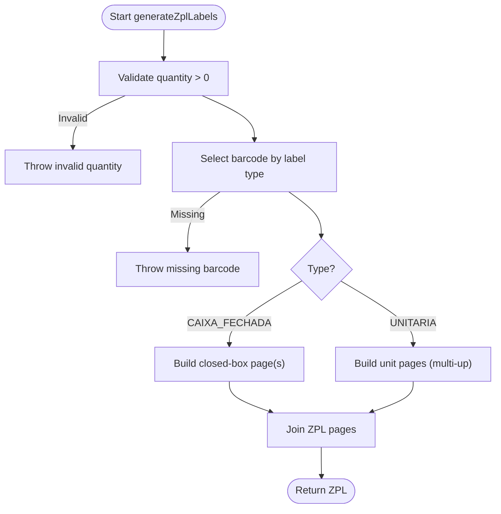
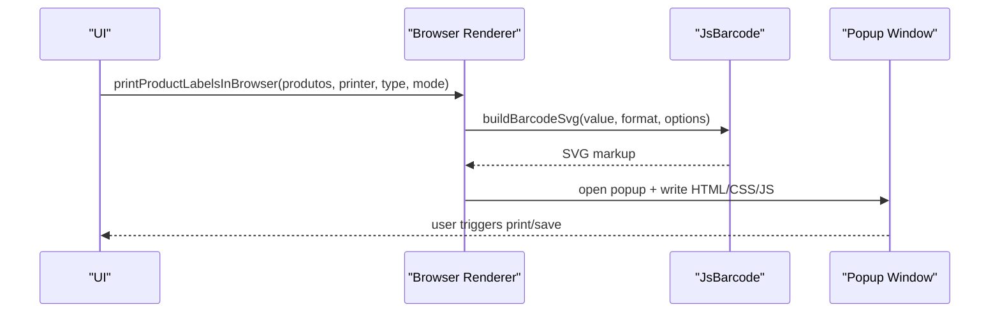
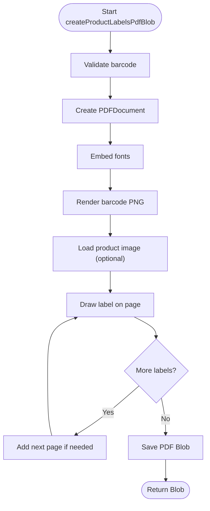
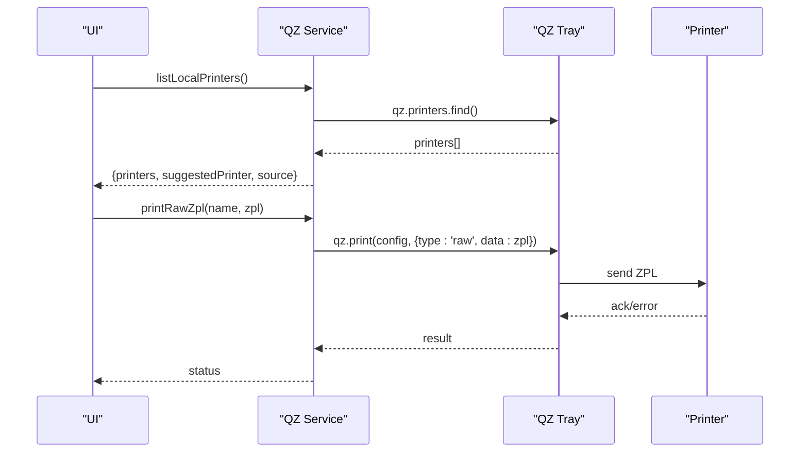
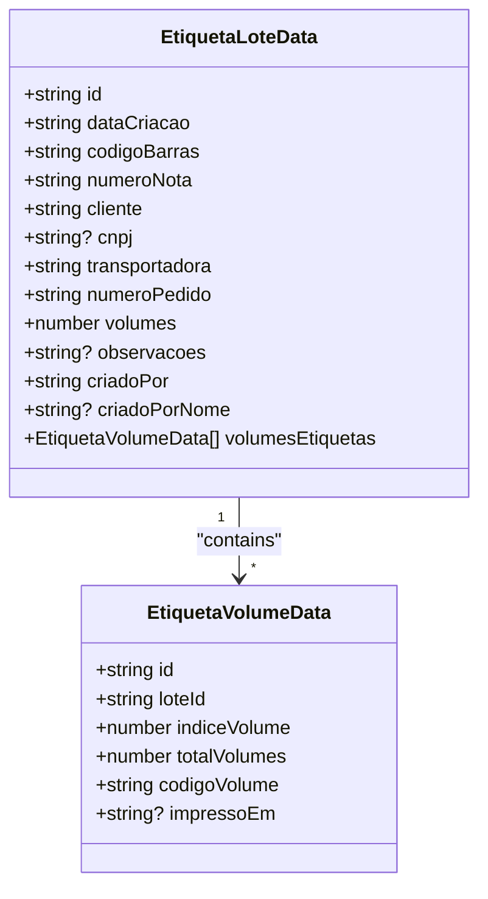
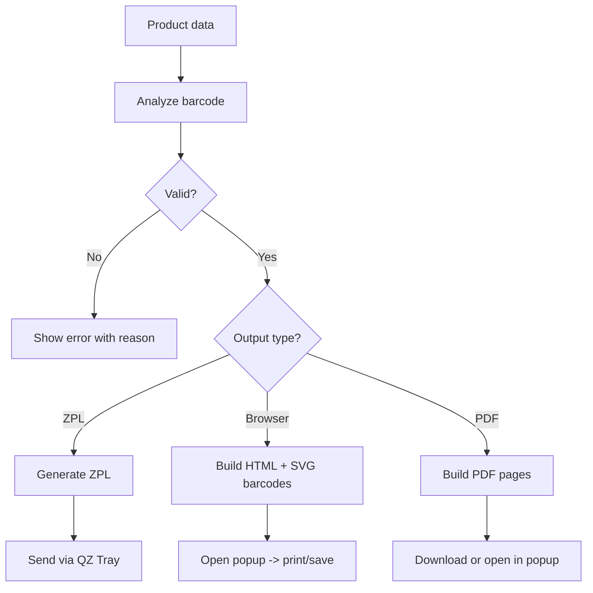
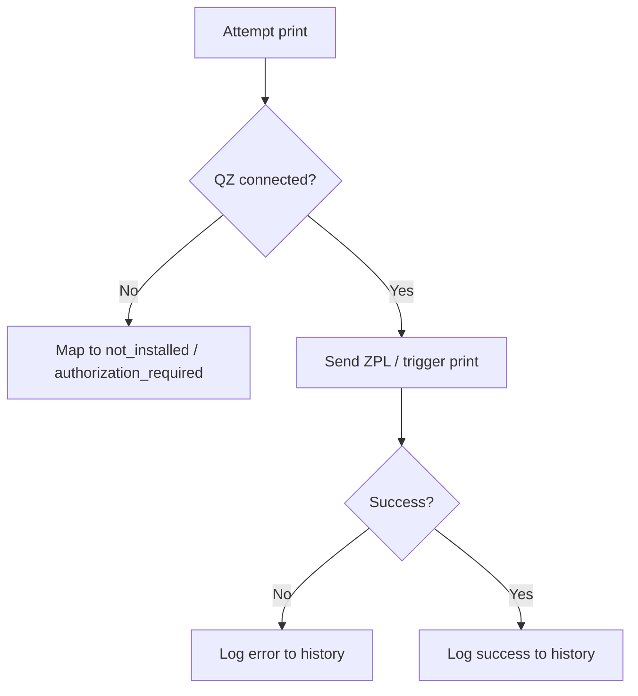
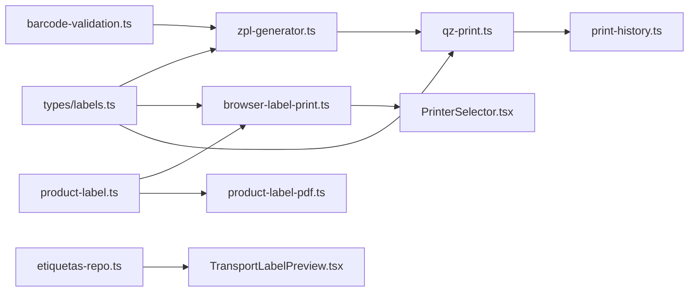

# Label Generation & Printing

<cite>
**Referenced Files in This Document**
- [zpl-generator.ts](file://lib/zpl-generator.ts)
- [barcode-validation.ts](file://lib/barcode-validation.ts)
- [product-label.ts](file://lib/product-label.ts)
- [qz-print.ts](file://services/qz-print.ts)
- [browser-label-print.ts](file://services/browser-label-print.ts)
- [product-label-pdf.ts](file://services/product-label-pdf.ts)
- [LabelPreview.tsx](file://components/labels/LabelPreview.tsx)
- [TransportLabelPreview.tsx](file://components/labels/TransportLabelPreview.tsx)
- [PrinterSelector.tsx](file://components/labels/PrinterSelector.tsx)
- [etiquetas-repo.ts](file://lib/etiquetas-repo.ts)
- [print-history.ts](file://pages/api/etiquetas/print-history.ts)
- [labels.ts](file://types/labels.ts)
</cite>

## Table of Contents
1. Introduction
2. Project Structure
3. Core Components
4. Architecture Overview
5. Detailed Component Analysis
6. Dependency Analysis
7. Performance Considerations
8. Troubleshooting Guide
9. Conclusion

## Introduction
This document explains the label generation and printing system used to produce product labels, closed-box labels, A4 product labels, and transport volume labels. It covers ZPL template generation for Zebra printers via QZ Tray, browser-based preview and print, PDF generation, batch processing, printer integration, template customization, print queue management, and error handling.

## Project Structure
The labeling system is split into:
- Data models and validation: barcode analysis and type detection
- ZPL generation: Zebra Programming Language templates for direct printer output
- Browser rendering: HTML/CSS/JS previews and native browser print
- PDF generation: client-side PDF creation for A4 product labels
- Printer integration: QZ Tray connection, printer discovery, and raw ZPL sending
- Transport labels: batched volume labels with per-volume barcodes
- UI components: label previews and printer selection
- Persistence: transport label batches and print history

**Diagram sources**
- [zpl-generator.ts:1-171](file://lib/zpl-generator.ts#L1-L171)
- [barcode-validation.ts:1-89](file://lib/barcode-validation.ts#L1-L89)
- [product-label.ts:1-7](file://lib/product-label.ts#L1-L7)
- [browser-label-print.ts:1-800](file://services/browser-label-print.ts#L1-L800)
- [product-label-pdf.ts:1-402](file://services/product-label-pdf.ts#L1-L402)
- [qz-print.ts:1-205](file://services/qz-print.ts#L1-L205)
- [LabelPreview.tsx:1-298](file://components/labels/LabelPreview.tsx#L1-L298)
- [TransportLabelPreview.tsx:1-186](file://components/labels/TransportLabelPreview.tsx#L1-L186)
- [PrinterSelector.tsx:1-96](file://components/labels/PrinterSelector.tsx#L1-L96)
- [etiquetas-repo.ts:1-309](file://lib/etiquetas-repo.ts#L1-L309)
- [print-history.ts:1-48](file://pages/api/etiquetas/print-history.ts#L1-L48)
- [labels.ts:1-121](file://types/labels.ts#L1-L121)

**Section sources**
- [zpl-generator.ts:1-171](file://lib/zpl-generator.ts#L1-L171)
- [qz-print.ts:1-205](file://services/qz-print.ts#L1-L205)
- [browser-label-print.ts:1-800](file://services/browser-label-print.ts#L1-L800)
- [product-label-pdf.ts:1-402](file://services/product-label-pdf.ts#L1-L402)
- [etiquetas-repo.ts:1-309](file://lib/etiquetas-repo.ts#L1-L309)
- [print-history.ts:1-48](file://pages/api/etiquetas/print-history.ts#L1-L48)
- [labels.ts:1-121](file://types/labels.ts#L1-L121)

## Core Components
- Barcode validation and normalization: validates EAN-13/EAN-8 checksums and detects supported formats; returns normalized values for consistent rendering.
- ZPL generator: builds Zebra command sequences for unit labels, closed-box labels, and multi-up layouts; supports text wrapping and centering.
- Browser label renderer: generates HTML/CSS/JS previews and triggers native browser print or PDF export; supports multiple A4 layouts and copies per product.
- PDF generator: creates A4 product labels with embedded images and barcodes using pdf-lib; supports single and multi-product batches.
- QZ Tray integration: connects to local QZ Tray, discovers printers, selects Zebra-compatible printers, and sends raw ZPL commands.
- Transport label batch: persists batches and per-volume codes, renders previews, and supports printing one label per volume.
- Print history: records successful/failed prints with user context, product details, and error messages.

**Section sources**
- [barcode-validation.ts:1-89](file://lib/barcode-validation.ts#L1-L89)
- [zpl-generator.ts:1-171](file://lib/zpl-generator.ts#L1-L171)
- [browser-label-print.ts:1-800](file://services/browser-label-print.ts#L1-L800)
- [product-label-pdf.ts:1-402](file://services/product-label-pdf.ts#L1-L402)
- [qz-print.ts:1-205](file://services/qz-print.ts#L1-L205)
- [etiquetas-repo.ts:1-309](file://lib/etiquetas-repo.ts#L1-L309)
- [print-history.ts:1-48](file://pages/api/etiquetas/print-history.ts#L1-L48)

## Architecture Overview
The system supports two primary output paths:
- Direct ZPL to Zebra printers via QZ Tray
- Browser-based HTML/PDF for general printers or PDF export

**Diagram sources**
- [zpl-generator.ts:149-171](file://lib/zpl-generator.ts#L149-L171)
- [qz-print.ts:148-157](file://services/qz-print.ts#L148-L157)
- [print-history.ts:8-47](file://pages/api/etiquetas/print-history.ts#L8-L47)

## Detailed Component Analysis

### ZPL Template Generation
- Validates barcodes before generating ZPL; throws descriptive errors for invalid or unsupported codes.
- Supports unit labels (multiple per page), closed-box labels (single large label), and configurable darkness.
- Text splitting and centering ensure readable labels across different widths.

**Diagram sources**
- [zpl-generator.ts:149-171](file://lib/zpl-generator.ts#L149-L171)
- [zpl-generator.ts:78-121](file://lib/zpl-generator.ts#L78-L121)
- [zpl-generator.ts:123-147](file://lib/zpl-generator.ts#L123-L147)

**Section sources**
- [zpl-generator.ts:1-171](file://lib/zpl-generator.ts#L1-L171)
- [barcode-validation.ts:42-89](file://lib/barcode-validation.ts#L42-L89)

### Browser-Based Label Preview and Print
- Generates HTML with embedded SVG barcodes and CSS grid layouts for various label sizes and orientations.
- Opens a dedicated window with toolbar actions to print or save as PDF.
- Supports multiple products and copies per product; calculates sheets based on layout.

**Diagram sources**
- [browser-label-print.ts:109-185](file://services/browser-label-print.ts#L109-L185)
- [browser-label-print.ts:16-41](file://services/browser-label-print.ts#L16-L41)

**Section sources**
- [browser-label-print.ts:1-800](file://services/browser-label-print.ts#L1-L800)

### PDF Generation for A4 Product Labels
- Builds A4 pages with two labels per page, embedding product images and barcodes.
- Provides download and print-in-popup flows; supports multi-product batches.

**Diagram sources**
- [product-label-pdf.ts:101-225](file://services/product-label-pdf.ts#L101-L225)
- [product-label-pdf.ts:227-350](file://services/product-label-pdf.ts#L227-L350)

**Section sources**
- [product-label-pdf.ts:1-402](file://services/product-label-pdf.ts#L1-L402)

### QZ Tray Integration and Printer Management
- Connects to QZ Tray with secure certificate handling and signature endpoint support.
- Discovers local printers via QZ, fallback to OS defaults or server-provided list.
- Sends raw ZPL to selected printer; parses errors into user-friendly statuses.

**Diagram sources**
- [qz-print.ts:52-63](file://services/qz-print.ts#L52-L63)
- [qz-print.ts:85-146](file://services/qz-print.ts#L85-L146)
- [qz-print.ts:148-157](file://services/qz-print.ts#L148-L157)
- [qz-print.ts:159-205](file://services/qz-print.ts#L159-L205)

**Section sources**
- [qz-print.ts:1-205](file://services/qz-print.ts#L1-L205)
- [PrinterSelector.tsx:1-96](file://components/labels/PrinterSelector.tsx#L1-L96)

### Transport Label Batch Processing
- Creates batches with per-volume unique codes; stores metadata and volumes.
- Renders per-volume previews with CODE128 barcodes and order/client info.
- Uses dynamic column queries to handle optional fields safely.

**Diagram sources**
- [labels.ts:85-109](file://types/labels.ts#L85-L109)
- [etiquetas-repo.ts:93-122](file://lib/etiquetas-repo.ts#L93-L122)

**Section sources**
- [etiquetas-repo.ts:1-309](file://lib/etiquetas-repo.ts#L1-L309)
- [TransportLabelPreview.tsx:1-186](file://components/labels/TransportLabelPreview.tsx#L1-L186)
- [labels.ts:85-109](file://types/labels.ts#L85-L109)

### Label Creation Workflow (Product Data to Printable Formats)
- Input: product data including barcode(s), name, brand, original code, image URL.
- Validation: analyze barcode to determine format and normalize value.
- Output options:
  - ZPL for Zebra printers via QZ Tray
  - Browser HTML preview for immediate print or PDF export
  - Client-side PDF for A4 product labels
- Batch: repeat labels per quantity; group into pages/sheets based on layout.

**Diagram sources**
- [barcode-validation.ts:42-89](file://lib/barcode-validation.ts#L42-L89)
- [zpl-generator.ts:149-171](file://lib/zpl-generator.ts#L149-L171)
- [browser-label-print.ts:109-185](file://services/browser-label-print.ts#L109-L185)
- [product-label-pdf.ts:101-225](file://services/product-label-pdf.ts#L101-L225)

**Section sources**
- [barcode-validation.ts:1-89](file://lib/barcode-validation.ts#L1-L89)
- [zpl-generator.ts:1-171](file://lib/zpl-generator.ts#L1-L171)
- [browser-label-print.ts:1-800](file://services/browser-label-print.ts#L1-L800)
- [product-label-pdf.ts:1-402](file://services/product-label-pdf.ts#L1-L402)

### Multi-Format Printing Support
- Unit labels: small, three-up layout for ZPL; compact view in browser.
- Closed-box labels: larger single label with box quantity info.
- A4 product labels: horizontal or vertical layouts; double-width landscape option.
- Transport labels: per-volume CODE128 labels with order/client details.

**Section sources**
- [zpl-generator.ts:78-147](file://lib/zpl-generator.ts#L78-L147)
- [browser-label-print.ts:43-107](file://services/browser-label-print.ts#L43-L107)
- [product-label-pdf.ts:101-225](file://services/product-label-pdf.ts#L101-L225)
- [TransportLabelPreview.tsx:1-186](file://components/labels/TransportLabelPreview.tsx#L1-L186)

### Print Queue Management
- The system does not implement an explicit print queue; it sends jobs directly to the selected printer.
- For reliability, ensure the printer is ready and QZ Tray is connected before sending jobs.
- Use retries and user feedback when connection fails.

[No sources needed since this section provides general guidance]

### Error Handling for Failed Prints
- QZ Tray errors are parsed into user-friendly statuses: not installed, authorization required, or generic error.
- Invalid barcodes raise descriptive errors before any print attempt.
- Print history API logs outcomes with user context and error messages for auditability.

**Diagram sources**
- [qz-print.ts:159-205](file://services/qz-print.ts#L159-L205)
- [print-history.ts:8-47](file://pages/api/etiquetas/print-history.ts#L8-L47)

**Section sources**
- [qz-print.ts:159-205](file://services/qz-print.ts#L159-L205)
- [print-history.ts:1-48](file://pages/api/etiquetas/print-history.ts#L1-L48)
- [barcode-validation.ts:42-89](file://lib/barcode-validation.ts#L42-L89)

## Dependency Analysis
Key dependencies and relationships:
- ZPL generator depends on barcode validation and label types.
- Browser renderer depends on JsBarcode and product formatting utilities.
- PDF generator depends on pdf-lib and JsBarcode for images.
- QZ service depends on qz-tray and environment configuration for certificates/signatures.
- Transport label repo uses Prisma raw SQL for safe column presence checks and bulk inserts.
- Print history API depends on authentication and Prisma model.

**Diagram sources**
- [zpl-generator.ts:1-171](file://lib/zpl-generator.ts#L1-L171)
- [barcode-validation.ts:1-89](file://lib/barcode-validation.ts#L1-L89)
- [product-label.ts:1-7](file://lib/product-label.ts#L1-L7)
- [browser-label-print.ts:1-800](file://services/browser-label-print.ts#L1-L800)
- [product-label-pdf.ts:1-402](file://services/product-label-pdf.ts#L1-L402)
- [qz-print.ts:1-205](file://services/qz-print.ts#L1-L205)
- [PrinterSelector.tsx:1-96](file://components/labels/PrinterSelector.tsx#L1-L96)
- [etiquetas-repo.ts:1-309](file://lib/etiquetas-repo.ts#L1-L309)
- [TransportLabelPreview.tsx:1-186](file://components/labels/TransportLabelPreview.tsx#L1-L186)
- [print-history.ts:1-48](file://pages/api/etiquetas/print-history.ts#L1-L48)
- [labels.ts:1-121](file://types/labels.ts#L1-L121)

**Section sources**
- [labels.ts:1-121](file://types/labels.ts#L1-L121)
- [qz-print.ts:1-205](file://services/qz-print.ts#L1-L205)
- [etiquetas-repo.ts:1-309](file://lib/etiquetas-repo.ts#L1-L309)

## Performance Considerations
- Avoid generating excessively large ZPL strings; use multi-up layouts to reduce pages.
- Reuse validated barcode data to prevent repeated parsing.
- For PDF generation, limit image resolution and avoid loading unnecessary assets.
- Batch database operations for transport labels to minimize round trips.
- Cache preferred printer selection locally to reduce re-discovery overhead.

[No sources needed since this section provides general guidance]

## Troubleshooting Guide
Common issues and resolutions:
- QZ Tray not found: install and keep the application open; verify certificate and signature settings.
- Authorization required: grant site permission in QZ Tray and ensure certificate is configured.
- No printers detected: reconnect QZ Tray, try default printer fallback, or use server-provided printer list.
- Invalid barcode: correct the product barcode and ensure proper format (EAN-13/EAN-8/CODE128).
- Print failures: check printer connectivity, driver compatibility, and review print history for error messages.

**Section sources**
- [qz-print.ts:159-205](file://services/qz-print.ts#L159-L205)
- [print-history.ts:8-47](file://pages/api/etiquetas/print-history.ts#L8-L47)
- [barcode-validation.ts:42-89](file://lib/barcode-validation.ts#L42-L89)

## Conclusion
The labeling system provides robust support for generating ZPL templates, previewing labels in the browser, producing PDFs, and integrating with Zebra printers through QZ Tray. It includes comprehensive validation, flexible layouts, batch processing for transport labels, and reliable error handling with print history logging. Use the provided components and services to customize templates, manage printers, and streamline label workflows across multiple formats.