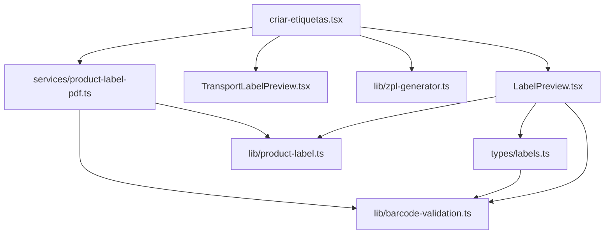
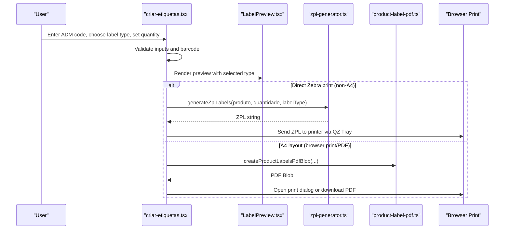
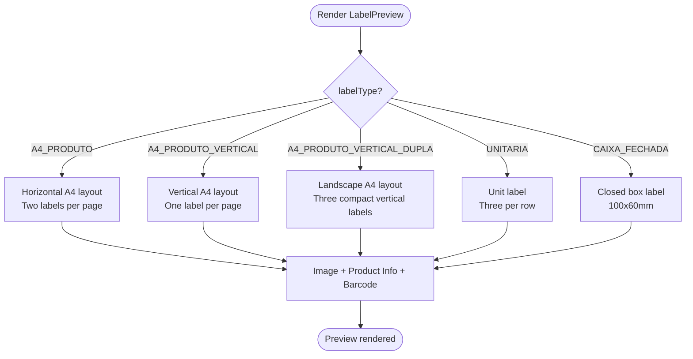
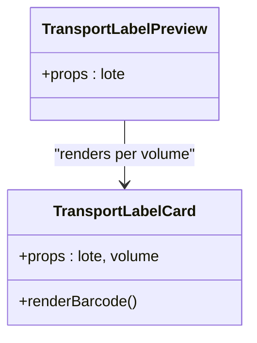
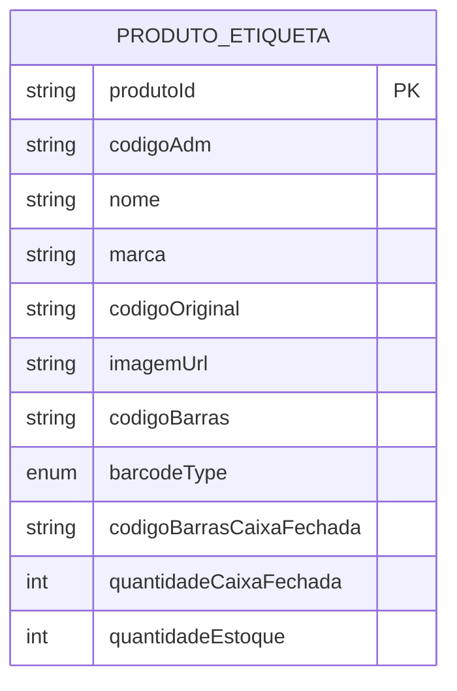
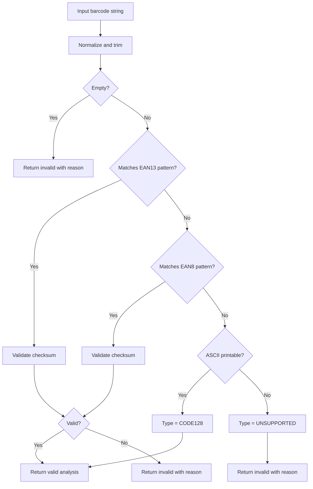
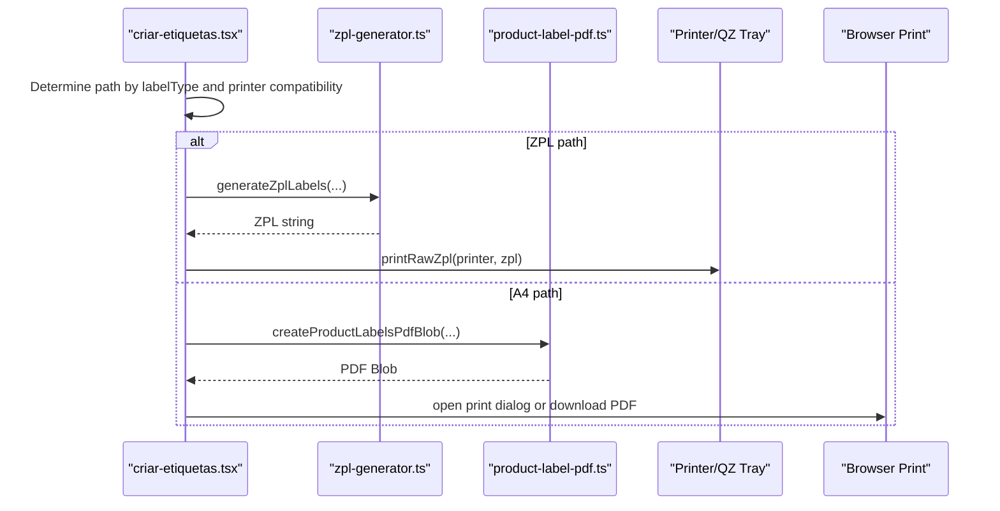
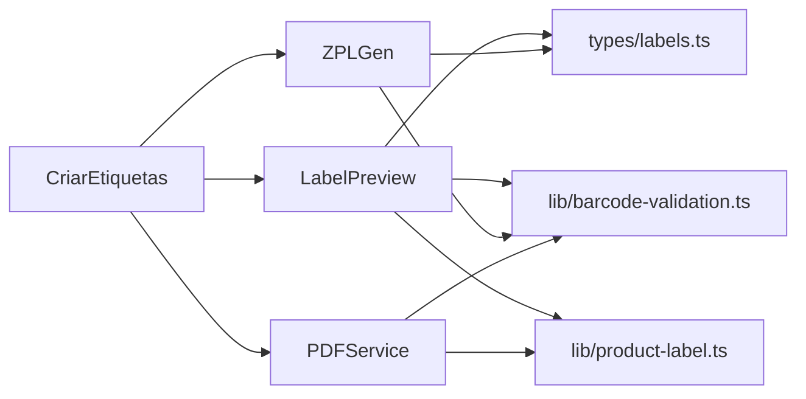

# Label Templates & Design

<cite>
**Referenced Files in This Document**
- [LabelPreview.tsx](file://components/labels/LabelPreview.tsx)
- [TransportLabelPreview.tsx](file://components/labels/TransportLabelPreview.tsx)
- [labels.ts](file://types/labels.ts)
- [barcode-validation.ts](file://lib/barcode-validation.ts)
- [product-label.ts](file://lib/product-label.ts)
- [label-products-catalog.ts](file://lib/label-products-catalog.ts)
- [zpl-generator.ts](file://lib/zpl-generator.ts)
- [product-label-pdf.ts](file://services/product-label-pdf.ts)
- [criar-etiquetas.tsx](file://pages/criar-etiquetas.tsx)
</cite>

## Table of Contents
1. [Introduction](#introduction)
2. [Project Structure](#project-structure)
3. [Core Components](#core-components)
4. [Architecture Overview](#architecture-overview)
5. [Detailed Component Analysis](#detailed-component-analysis)
6. [Dependency Analysis](#dependency-analysis)
7. [Performance Considerations](#performance-considerations)
8. [Troubleshooting Guide](#troubleshooting-guide)
9. [Conclusion](#conclusion)
10. [Appendices](#appendices)

## Introduction
This document explains how label templates are designed and customized for product labels and transport labels. It covers the supported label types, their intended use cases, the LabelPreview component structure, styling options, responsive behavior, template properties (product information display, barcode rendering, image handling, layout), and guidance for customization and extending templates for different product categories.

## Project Structure
The label system is composed of:
- UI preview components that render a visual representation of labels on screen
- Type definitions for products and label formats
- Barcode validation utilities to detect and validate barcodes
- ZPL generator for direct printer output
- PDF generation service for A4-based layouts
- Page orchestration that ties search, preview, printing, and PDF export together

**Diagram sources**
- [criar-etiquetas.tsx:1-558](file://pages/criar-etiquetas.tsx#L1-L558)
- [LabelPreview.tsx:1-298](file://components/labels/LabelPreview.tsx#L1-L298)
- [TransportLabelPreview.tsx:1-186](file://components/labels/TransportLabelPreview.tsx#L1-L186)
- [labels.ts:1-121](file://types/labels.ts#L1-L121)
- [barcode-validation.ts:1-89](file://lib/barcode-validation.ts#L1-L89)
- [product-label.ts:1-7](file://lib/product-label.ts#L1-L7)
- [zpl-generator.ts:1-171](file://lib/zpl-generator.ts#L1-L171)
- [product-label-pdf.ts:1-402](file://services/product-label-pdf.ts#L1-L402)

**Section sources**
- [criar-etiquetas.tsx:1-558](file://pages/criar-etiquetas.tsx#L1-L558)
- [LabelPreview.tsx:1-298](file://components/labels/LabelPreview.tsx#L1-L298)
- [TransportLabelPreview.tsx:1-186](file://components/labels/TransportLabelPreview.tsx#L1-L186)
- [labels.ts:1-121](file://types/labels.ts#L1-L121)
- [barcode-validation.ts:1-89](file://lib/barcode-validation.ts#L1-L89)
- [product-label.ts:1-7](file://lib/product-label.ts#L1-L7)
- [zpl-generator.ts:1-171](file://lib/zpl-generator.ts#L1-L171)
- [product-label-pdf.ts:1-402](file://services/product-label-pdf.ts#L1-L402)

## Core Components
- LabelPreview: Renders previews for UNITARIA, CAIXA_FECHADA, A4_PRODUTO, A4_PRODUTO_VERTICAL, and A4_PRODUTO_VERTICAL_DUPLA. It adapts layout and sizing based on label type and quantity.
- TransportLabelPreview: Renders transport labels per volume with order info, carrier name, and CODE128 barcode.
- Barcode validation: Detects EAN13, EAN8, CODE128, or unsupported values and validates checksums.
- Product label formatting: Formats internal product codes for display.
- ZPL generator: Produces Zebra Printer Language commands for direct printing.
- PDF service: Generates A4-based PDFs for browser print/export.

**Section sources**
- [LabelPreview.tsx:1-298](file://components/labels/LabelPreview.tsx#L1-L298)
- [TransportLabelPreview.tsx:1-186](file://components/labels/TransportLabelPreview.tsx#L1-L186)
- [barcode-validation.ts:1-89](file://lib/barcode-validation.ts#L1-L89)
- [product-label.ts:1-7](file://lib/product-label.ts#L1-L7)
- [zpl-generator.ts:1-171](file://lib/zpl-generator.ts#L1-L171)
- [product-label-pdf.ts:1-402](file://services/product-label-pdf.ts#L1-L402)

## Architecture Overview
The label flow starts from the page where users search by internal code, select a label type and quantity, preview the label, and then either print directly via QZ Tray/ZPL or open a browser print/PDF view for A4 layouts.

**Diagram sources**
- [criar-etiquetas.tsx:85-100](file://pages/criar-etiquetas.tsx#L85-L100)
- [criar-etiquetas.tsx:235-276](file://pages/criar-etiquetas.tsx#L235-L276)
- [zpl-generator.ts:149-171](file://lib/zpl-generator.ts#L149-L171)
- [product-label-pdf.ts:101-225](file://services/product-label-pdf.ts#L101-L225)

## Detailed Component Analysis

### Supported Label Types and Use Cases
- UNITARIA: Small unit label; three labels per row on ZPL pages. Used for individual items.
- CAIXA_FECHADA: Closed box label sized for 100 x 60 mm; shows “CAIXA FECHADA - X UN”. Uses the closed-box barcode when available.
- A4_PRODUTO: Horizontal A4 layout with two labels per page (18 x 11 cm). Suitable for standard printers and PDF export.
- A4_PRODUTO_VERTICAL: Vertical A4 layout with one label per page (15 x 21 cm). Photo on top, details below.
- A4_PRODUTO_VERTICAL_DUPLA: Landscape A4 layout with three compact vertical labels per page (8 x 14 cm each).

These behaviors are driven by the LabelType union and conditional rendering logic in the preview and printing paths.

**Section sources**
- [labels.ts:2-7](file://types/labels.ts#L2-L7)
- [LabelPreview.tsx:117-148](file://components/labels/LabelPreview.tsx#L117-L148)
- [criar-etiquetas.tsx:347-360](file://pages/criar-etiquetas.tsx#L347-L360)

### LabelPreview Component Structure
- Props: produto (product data), quantidade (number of labels), labelType (one of the five types).
- Layout selection:
  - For A4 types, renders single-column grids with specific aspect ratios and spacing.
  - For UNITARIA and CAIXA_FECHADA, uses multi-column grid layouts responsive across breakpoints.
- Content:
  - Image area with fallback text when no image is present.
  - Product fields: ADM code (formatted), brand, original code, description.
  - Barcode area with a visual barcode stripe and human-readable value.
- Responsive behavior:
  - Uses CSS Grid and clamp() font sizes to adapt to screen width.
  - Compact mode for DUPLA variant reduces size and padding.

**Diagram sources**
- [LabelPreview.tsx:117-298](file://components/labels/LabelPreview.tsx#L117-L298)

**Section sources**
- [LabelPreview.tsx:12-115](file://components/labels/LabelPreview.tsx#L12-L115)
- [LabelPreview.tsx:117-298](file://components/labels/LabelPreview.tsx#L117-L298)

### TransportLabelPreview Component Structure
- Displays per-volume transport labels with order number, carrier name, invoice number, client/CNPJ, and CODE128 barcode.
- Uses JsBarcode to render CODE128 barcodes within SVG elements.
- Responsive grid layout for multiple volumes.

**Diagram sources**
- [TransportLabelPreview.tsx:1-186](file://components/labels/TransportLabelPreview.tsx#L1-L186)

**Section sources**
- [TransportLabelPreview.tsx:1-186](file://components/labels/TransportLabelPreview.tsx#L1-L186)

### Template Properties and Data Model
- ProdutoEtiqueta includes:
  - Identification: produtoId, codigoAdm, nome, marca, codigoOriginal
  - Images: imagemUrl
  - Barcodes: codigoBarras, barcodeType, codigoBarrasCaixaFechada
  - Packaging: quantidadeCaixaFechada
  - Stock: quantidadeEstoque
- Catalog mapping transforms catalog entries into label-ready objects and analyzes barcodes.

**Diagram sources**
- [labels.ts:9-21](file://types/labels.ts#L9-L21)
- [label-products-catalog.ts:14-29](file://lib/label-products-catalog.ts#L14-L29)

**Section sources**
- [labels.ts:9-21](file://types/labels.ts#L9-L21)
- [label-products-catalog.ts:1-54](file://lib/label-products-catalog.ts#L1-L54)

### Barcode Rendering and Validation
- The system detects barcode format (EAN13, EAN8, CODE128) and validates checksums.
- Invalid or unsupported barcodes produce user-facing warnings and prevent printing.
- For A4 PDFs, barcodes are generated via JsBarcode and embedded into the PDF.
- For ZPL, barcodes are encoded using Zebra-specific commands.

**Diagram sources**
- [barcode-validation.ts:42-89](file://lib/barcode-validation.ts#L42-L89)

**Section sources**
- [barcode-validation.ts:1-89](file://lib/barcode-validation.ts#L1-L89)
- [zpl-generator.ts:48-76](file://lib/zpl-generator.ts#L48-L76)
- [product-label-pdf.ts:60-75](file://services/product-label-pdf.ts#L60-L75)

### Styling Options and Responsive Behavior
- LabelPreview uses MUI theme tokens and CSS Grid for layout.
- Font sizes adapt via clamp() for readability across devices.
- Aspect ratios define label proportions for accurate preview.
- Compact mode reduces padding and sizes for DUPLA variant.
- A4 layouts enforce fixed aspect ratios to match physical paper dimensions.

**Section sources**
- [LabelPreview.tsx:22-35](file://components/labels/LabelPreview.tsx#L22-L35)
- [LabelPreview.tsx:139-148](file://components/labels/LabelPreview.tsx#L139-L148)
- [LabelPreview.tsx:152-218](file://components/labels/LabelPreview.tsx#L152-L218)
- [LabelPreview.tsx:219-245](file://components/labels/LabelPreview.tsx#L219-L245)

### Printing Paths and Output Formats
- Direct Zebra printing:
  - Uses ZPL generator to build label commands for UNITARIA and CAIXA_FECHADA.
  - Sends ZPL to local printers via QZ Tray integration.
- Browser print/PDF:
  - A4_PRODUTO, A4_PRODUTO_VERTICAL, A4_PRODUTO_VERTICAL_DUPLA use browser print or PDF generation.
  - PDF service creates precise A4 layouts with images and barcodes.

**Diagram sources**
- [criar-etiquetas.tsx:85-100](file://pages/criar-etiquetas.tsx#L85-L100)
- [criar-etiquetas.tsx:235-276](file://pages/criar-etiquetas.tsx#L235-L276)
- [zpl-generator.ts:149-171](file://lib/zpl-generator.ts#L149-L171)
- [product-label-pdf.ts:101-225](file://services/product-label-pdf.ts#L101-L225)

**Section sources**
- [criar-etiquetas.tsx:235-276](file://pages/criar-etiquetas.tsx#L235-L276)
- [zpl-generator.ts:149-171](file://lib/zpl-generator.ts#L149-L171)
- [product-label-pdf.ts:101-225](file://services/product-label-pdf.ts#L101-L225)

## Dependency Analysis
- LabelPreview depends on:
  - types/labels.ts for data contracts
  - lib/barcode-validation.ts for barcode detection
  - lib/product-label.ts for ADM code formatting
- ZPL generator depends on:
  - lib/barcode-validation.ts for barcode analysis
  - types/labels.ts for product and label type
- PDF service depends on:
  - lib/barcode-validation.ts for barcode analysis
  - lib/product-label.ts for ADM formatting
  - pdf-lib for PDF creation
- Page orchestrates all flows and integrates QZ Tray for direct printing.

**Diagram sources**
- [LabelPreview.tsx:1-5](file://components/labels/LabelPreview.tsx#L1-L5)
- [zpl-generator.ts:1-3](file://lib/zpl-generator.ts#L1-L3)
- [product-label-pdf.ts:1-6](file://services/product-label-pdf.ts#L1-L6)
- [criar-etiquetas.tsx:30-45](file://pages/criar-etiquetas.tsx#L30-L45)

**Section sources**
- [LabelPreview.tsx:1-5](file://components/labels/LabelPreview.tsx#L1-L5)
- [zpl-generator.ts:1-3](file://lib/zpl-generator.ts#L1-L3)
- [product-label-pdf.ts:1-6](file://services/product-label-pdf.ts#L1-L6)
- [criar-etiquetas.tsx:30-45](file://pages/criar-etiquetas.tsx#L30-L45)

## Performance Considerations
- Avoid excessive re-renders by memoizing barcode analysis and computed values at the page level.
- For large quantities, batch ZPL pages efficiently and avoid unnecessary DOM operations in previews.
- PDF generation can be heavy; open in a new window/tab to prevent blocking the main tab.
- Image loading should be optimized (scaling before embedding) to reduce memory usage during PDF creation.

[No sources needed since this section provides general guidance]

## Troubleshooting Guide
Common issues and resolutions:
- Invalid barcode:
  - EAN13/EAN8 checksum mismatch or unsupported format will block printing.
  - Resolution: Update product barcode in the source data or correct the value.
- Missing closed-box barcode:
  - CAIXA_FECHADA requires a dedicated barcode field; otherwise, printing is blocked.
  - Resolution: Provide codigoBarrasCaixaFechada for the product.
- QZ Tray not connected:
  - Ensure QZ Tray is installed and authorized; refresh printers list.
  - Resolution: Install QZ Tray, authorize the site, and retry.
- A4 print scaling:
  - When using browser print for A4 layouts, ensure scale is set to 100% or “Actual size” to preserve label dimensions.
  - Resolution: Adjust print settings in the browser’s print dialog.

**Section sources**
- [criar-etiquetas.tsx:434-452](file://pages/criar-etiquetas.tsx#L434-L452)
- [barcode-validation.ts:42-89](file://lib/barcode-validation.ts#L42-L89)
- [zpl-generator.ts:154-167](file://lib/zpl-generator.ts#L154-L167)

## Conclusion
The label system supports multiple label types tailored to different operational needs, from small unit labels to A4-based layouts for standard printers. The LabelPreview component provides an accurate visual representation with responsive design, while robust barcode validation ensures print reliability. Customization points include adjusting layouts, adding fields, and creating specialized templates for product categories by extending the data model and preview components.

[No sources needed since this section summarizes without analyzing specific files]

## Appendices

### How to Customize Label Appearance
- Adjust styles in LabelPreview:
  - Modify aspect ratios, borders, paddings, and typography to fit new label sizes.
  - Use clamp() for scalable fonts and CSS Grid for flexible layouts.
- Extend content:
  - Add new fields to ProdutoEtiqueta and update preview rendering logic.
  - For PDF outputs, extend drawLabel functions to include additional text or images.
- Create specialized templates:
  - Introduce new LabelType values and branch logic in preview/printing paths.
  - Implement corresponding ZPL or PDF layout rules for the new type.

**Section sources**
- [LabelPreview.tsx:117-298](file://components/labels/LabelPreview.tsx#L117-L298)
- [product-label-pdf.ts:120-225](file://services/product-label-pdf.ts#L120-L225)
- [zpl-generator.ts:78-147](file://lib/zpl-generator.ts#L78-L147)

### Adding New Fields to Templates
- Extend the data model:
  - Add new properties to ProdutoEtiqueta in types/labels.ts.
- Update preview and PDF:
  - Render new fields in LabelPreview and adjust layout accordingly.
  - Include new fields in PDF generation functions to ensure they appear on printed labels.
- Update catalog mapping if sourcing from external data:
  - Map new fields in label-products-catalog.ts transformation.

**Section sources**
- [labels.ts:9-21](file://types/labels.ts#L9-L21)
- [label-products-catalog.ts:14-29](file://lib/label-products-catalog.ts#L14-L29)
- [product-label-pdf.ts:154-192](file://services/product-label-pdf.ts#L154-L192)

### Creating Specialized Templates for Different Product Categories
- Define category-specific LabelType values and UI options.
- Implement category-aware rendering in LabelPreview:
  - Conditional blocks for category-specific fields and layouts.
- Implement category-specific ZPL or PDF layouts:
  - Adjust dimensions, fields, and barcode placement per category requirements.
- Provide clear user guidance:
  - Show alerts or instructions for print settings and label selection.

**Section sources**
- [criar-etiquetas.tsx:347-360](file://pages/criar-etiquetas.tsx#L347-L360)
- [LabelPreview.tsx:117-298](file://components/labels/LabelPreview.tsx#L117-L298)
- [product-label-pdf.ts:101-225](file://services/product-label-pdf.ts#L101-L225)