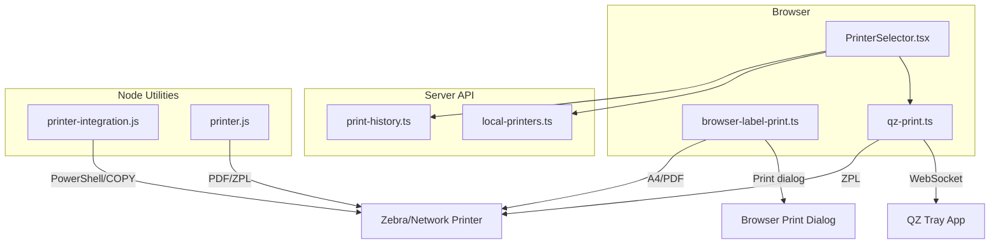
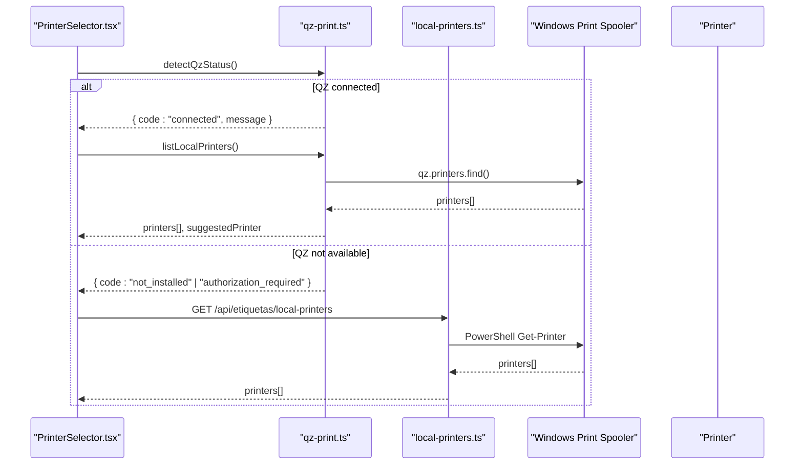
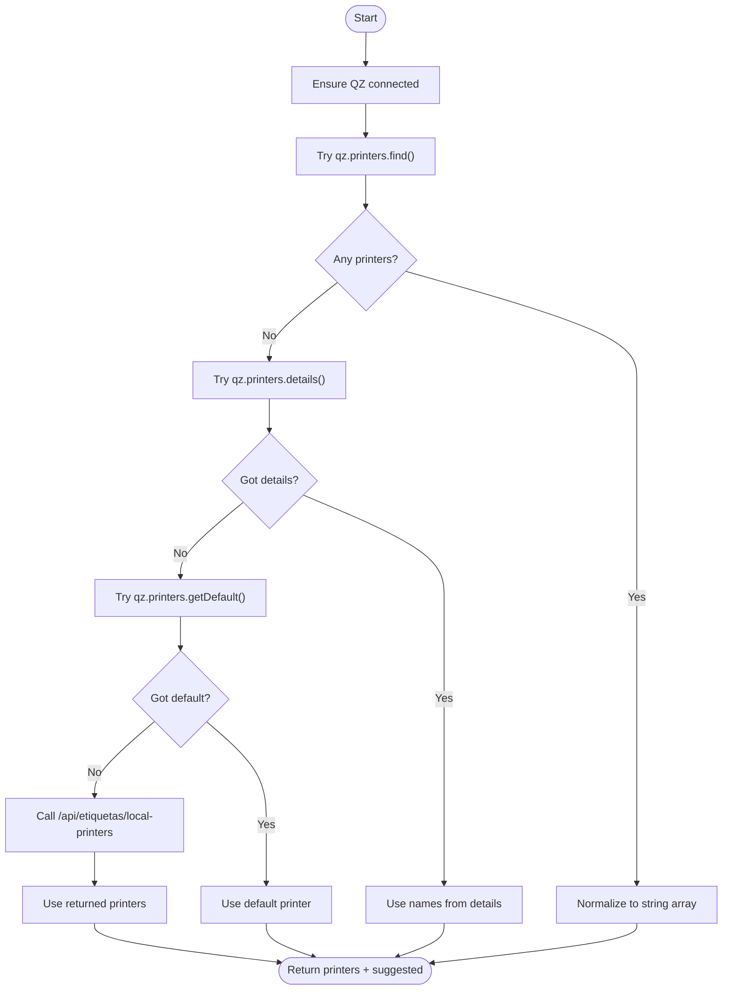
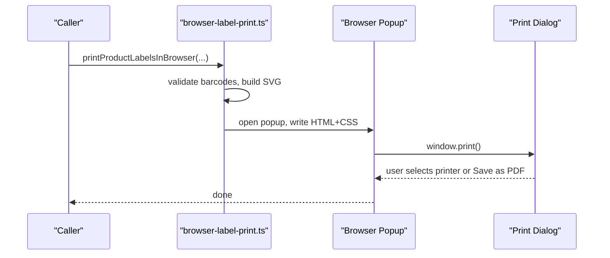
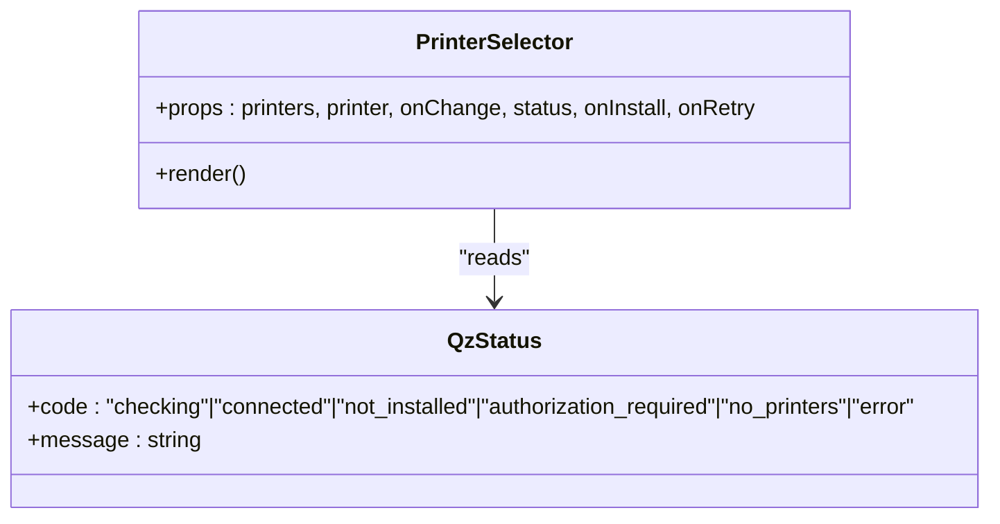
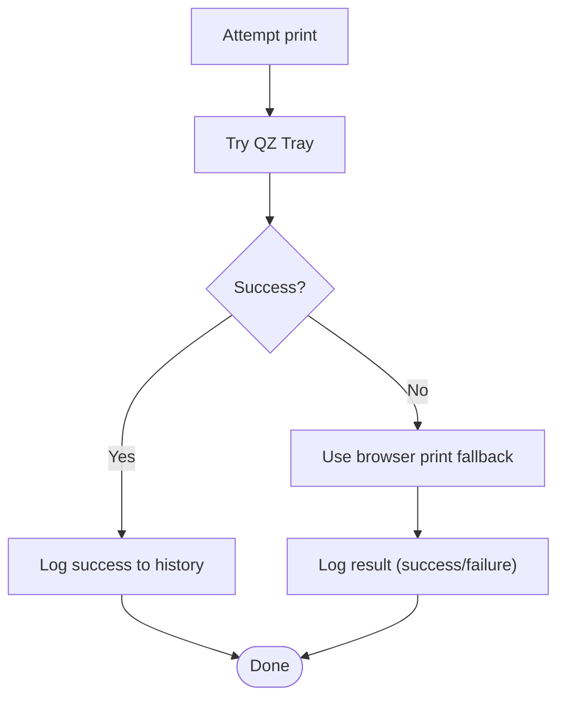
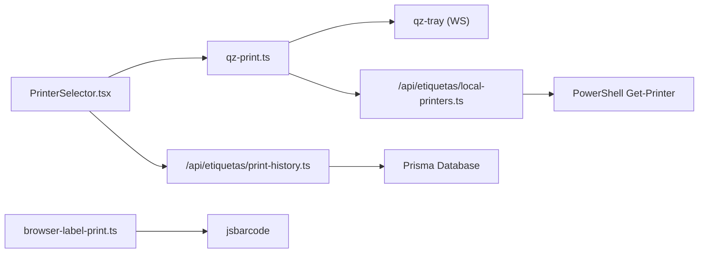

# Printing Integration & Methods

<cite>
**Referenced Files in This Document**
- [PrinterSelector.tsx](file://components/labels/PrinterSelector.tsx)
- [qz-print.ts](file://services/qz-print.ts)
- [browser-label-print.ts](file://services/browser-label-print.ts)
- [local-printers.ts](file://pages/api/etiquetas/local-printers.ts)
- [print-history.ts](file://pages/api/etiquetas/print-history.ts)
- [printer-integration.js](file://utils/printer-integration.js)
- [printer.js](file://utils/printer.js)
- [labels.ts](file://types/labels.ts)
- [qz-tray.d.ts](file://types/qz-tray.d.ts)
</cite>

## Table of Contents
1. Introduction
2. Project Structure
3. Core Components
4. Architecture Overview
5. Detailed Component Analysis
6. Dependency Analysis
7. Performance Considerations
8. Troubleshooting Guide
9. Conclusion
10. Appendices

## Introduction
This document explains the printing integration methods implemented in the project, focusing on:
- Direct printer communication via QZ Tray for ZPL/Zebra printers
- Browser-based printing fallbacks for general printers and A4 labels
- Local printer detection and selection
- Printer management through a UI component
- Print job queuing and error recovery mechanisms
- Configuration, connection troubleshooting, and performance considerations for high-volume scenarios
- Setup instructions for QZ Tray installation, browser permissions, and network printer configuration

## Project Structure
The printing system is composed of client-side services, server-side APIs, and UI components:
- Client-side QZ Tray integration and status detection
- Browser-based label rendering and print dialogs
- Server-side local printer discovery (Windows PowerShell)
- Print history logging to the database
- Utility modules for Node-side ZPL generation and direct printing (for server contexts)

**Diagram sources**
- [PrinterSelector.tsx:1-96](file://components/labels/PrinterSelector.tsx#L1-L96)
- [qz-print.ts:1-205](file://services/qz-print.ts#L1-L205)
- [browser-label-print.ts:109-684](file://services/browser-label-print.ts#L109-L684)
- [local-printers.ts:16-49](file://pages/api/etiquetas/local-printers.ts#L16-L49)
- [print-history.ts:8-47](file://pages/api/etiquetas/print-history.ts#L8-L47)
- [printer-integration.js:76-130](file://utils/printer-integration.js#L76-L130)
- [printer.js:87-121](file://utils/printer.js#L87-L121)

**Section sources**
- [PrinterSelector.tsx:1-96](file://components/labels/PrinterSelector.tsx#L1-L96)
- [qz-print.ts:1-205](file://services/qz-print.ts#L1-L205)
- [browser-label-print.ts:109-684](file://services/browser-label-print.ts#L109-L684)
- [local-printers.ts:16-49](file://pages/api/etiquetas/local-printers.ts#L16-L49)
- [print-history.ts:8-47](file://pages/api/etiquetas/print-history.ts#L8-L47)
- [printer-integration.js:76-130](file://utils/printer-integration.js#L76-L130)
- [printer.js:87-121](file://utils/printer.js#L87-L121)

## Core Components
- QZ Tray integration: connects via WebSocket, detects status, lists printers, sends raw ZPL, and persists preferred printer.
- Browser-based printing: builds HTML with barcodes and styles, opens a popup, and triggers the browser print dialog; supports A4 product labels and transport labels.
- Local printer detection: falls back to a server endpoint that queries Windows printers via PowerShell when QZ Tray cannot list printers.
- Printer selector UI: shows status alerts, install/retry actions, and a dropdown to choose between ZPL-compatible and generic printers.
- Print history: logs each attempt with success or failure details for auditing and recovery.
- Node utilities: generate PDFs and ZPL and send them directly to printers in server environments.

**Section sources**
- [qz-print.ts:18-157](file://services/qz-print.ts#L18-L157)
- [browser-label-print.ts:109-684](file://services/browser-label-print.ts#L109-L684)
- [local-printers.ts:16-49](file://pages/api/etiquetas/local-printers.ts#L16-L49)
- [print-history.ts:8-47](file://pages/api/etiquetas/print-history.ts#L8-L47)
- [printer-integration.js:76-130](file://utils/printer-integration.js#L76-L130)
- [printer.js:87-121](file://utils/printer.js#L87-L121)

## Architecture Overview
The system uses a hybrid approach:
- Primary path: QZ Tray communicates with Zebra/ZDesigner printers using raw ZPL commands over a secure WebSocket.
- Fallback path: If QZ Tray is unavailable or not suitable, the browser renders labels as HTML and uses the native print dialog to print to any installed printer or save as PDF.
- Detection path: The app attempts to enumerate printers via QZ Tray; if none are found, it queries a server endpoint that uses PowerShell to list Windows printers.

**Diagram sources**
- [qz-print.ts:52-146](file://services/qz-print.ts#L52-L146)
- [local-printers.ts:16-49](file://pages/api/etiquetas/local-printers.ts#L16-L49)
- [PrinterSelector.tsx:39-85](file://components/labels/PrinterSelector.tsx#L39-L85)

## Detailed Component Analysis

### QZ Tray Integration (Direct ZPL Printing)
- Connection and security: configures certificate and signature handling, then connects via WebSocket with multiple host/port options and keep-alive settings.
- Status detection: attempts to connect and returns a normalized status indicating whether QZ Tray is installed, authorized, or needs attention.
- Printer enumeration: tries multiple strategies (find, details, default) and falls back to server-side Windows printer listing if needed.
- Raw ZPL printing: creates a printer config and sends raw command data to the selected printer.
- Preferred printer persistence: saves and retrieves the user’s last used printer from localStorage.

**Diagram sources**
- [qz-print.ts:52-146](file://services/qz-print.ts#L52-L146)
- [local-printers.ts:16-49](file://pages/api/etiquetas/local-printers.ts#L16-L49)

**Section sources**
- [qz-print.ts:18-157](file://services/qz-print.ts#L18-L157)
- [qz-tray.d.ts:1-44](file://types/qz-tray.d.ts#L1-L44)

### Browser-Based Printing Fallback
- Label generation: constructs HTML with embedded CSS and SVG barcodes for product and transport labels. Supports multiple layouts (A4 horizontal/vertical/double).
- Print flow: opens a new window, writes the formatted content, and invokes the browser print dialog. Users can print or save as PDF.
- Validation: validates barcode formats before generating labels and throws descriptive errors for unsupported codes.

**Diagram sources**
- [browser-label-print.ts:109-684](file://services/browser-label-print.ts#L109-L684)

**Section sources**
- [browser-label-print.ts:109-684](file://services/browser-label-print.ts#L109-L684)

### PrinterSelector Component
- Displays status alerts based on QZ Tray state (not installed, authorization required, connected but no printers).
- Provides actions to download QZ Tray and retry connection.
- Renders a dropdown of detected printers, marking ZPL-compatible ones as recommended.
- Persists user preference for the next session.

**Diagram sources**
- [PrinterSelector.tsx:1-96](file://components/labels/PrinterSelector.tsx#L1-L96)
- [labels.ts:67-78](file://types/labels.ts#L67-L78)

**Section sources**
- [PrinterSelector.tsx:1-96](file://components/labels/PrinterSelector.tsx#L1-L96)
- [labels.ts:67-78](file://types/labels.ts#L67-L78)

### Local Printer Detection (Server-Side)
- Endpoint authenticates and authorizes users, then executes PowerShell to list installed printers.
- Returns a deduplicated list of printer names to the client for display and selection.

**Section sources**
- [local-printers.ts:16-49](file://pages/api/etiquetas/local-printers.ts#L16-L49)

### Print Job Queuing and Error Recovery
- Queueing: there is no explicit in-memory queue in the analyzed files. For high-volume scenarios, consider batching requests and serializing prints to avoid overwhelming the spooler.
- Error recovery:
  - QZ Tray status parsing normalizes common errors into actionable states (not installed, authorization required, other errors).
  - Browser fallback ensures printing still works even without QZ Tray.
  - Print history records outcomes and messages for later review and retries.

**Diagram sources**
- [qz-print.ts:159-205](file://services/qz-print.ts#L159-L205)
- [print-history.ts:8-47](file://pages/api/etiquetas/print-history.ts#L8-L47)
- [browser-label-print.ts:109-684](file://services/browser-label-print.ts#L109-L684)

**Section sources**
- [qz-print.ts:159-205](file://services/qz-print.ts#L159-L205)
- [print-history.ts:8-47](file://pages/api/etiquetas/print-history.ts#L8-L47)

### Node Utilities for Server-Side Printing
- Direct ZPL sending: writes temporary ZPL files and uses PowerShell or COPY to send to printers.
- PDF generation: builds PDFs and can print via pdf-to-printer.
- These utilities are useful for server-initiated jobs or batch operations outside the browser.

**Section sources**
- [printer-integration.js:76-130](file://utils/printer-integration.js#L76-L130)
- [printer.js:87-121](file://utils/printer.js#L87-L121)

## Dependency Analysis
- Client dependencies:
  - qz-tray library for WebSocket communication and printer control
  - jsbarcode for barcode SVG generation in browser
  - MUI components for UI elements in PrinterSelector
- Server dependencies:
  - Next.js API routes for authentication and printer listing
  - Prisma for storing print history
  - PowerShell execution for Windows printer enumeration
- External integrations:
  - QZ Tray application running locally
  - Windows print spooler and installed printers

**Diagram sources**
- [PrinterSelector.tsx:1-96](file://components/labels/PrinterSelector.tsx#L1-L96)
- [qz-print.ts:1-205](file://services/qz-print.ts#L1-L205)
- [browser-label-print.ts:1-10](file://services/browser-label-print.ts#L1-L10)
- [local-printers.ts:16-49](file://pages/api/etiquetas/local-printers.ts#L16-L49)
- [print-history.ts:8-47](file://pages/api/etiquetas/print-history.ts#L8-L47)

**Section sources**
- [qz-print.ts:1-205](file://services/qz-print.ts#L1-L205)
- [browser-label-print.ts:1-10](file://services/browser-label-print.ts#L1-L10)
- [local-printers.ts:16-49](file://pages/api/etiquetas/local-printers.ts#L16-L49)
- [print-history.ts:8-47](file://pages/api/etiquetas/print-history.ts#L8-L47)

## Performance Considerations
- High-volume printing:
  - Prefer QZ Tray for ZPL to minimize overhead compared to browser rendering.
  - Batch label generation on the client side and send fewer, larger payloads where possible.
  - Avoid opening many browser popups simultaneously; reuse a single popup or queue jobs.
- Network and spooler load:
  - Use keep-alive and minimal retries in QZ connection settings to reduce churn.
  - Serialize concurrent prints to the same printer to prevent spooler contention.
- Memory and CPU:
  - Limit the number of labels per page in browser mode to reduce DOM size.
  - Validate barcodes early to fail fast and avoid unnecessary rendering.

[No sources needed since this section provides general guidance]

## Troubleshooting Guide
- QZ Tray not installed:
  - Status indicates “not_installed”; prompt to download and run QZ Tray.
  - Ensure the app remains open and the site is authorized in QZ Tray.
- Authorization required:
  - Certificate/signature mismatch or unauthorized site; configure certificate and signature endpoints as implemented.
- No printers found:
  - If QZ Tray reports no printers, the system falls back to server-side Windows printer listing.
  - Verify printer drivers and network connectivity.
- Print failures:
  - Check print history for error messages and retry with appropriate action (reconnect, change printer, or use browser fallback).
- Browser print issues:
  - Ensure popups are allowed and the target printer is configured in the browser’s print dialog.

**Section sources**
- [qz-print.ts:159-205](file://services/qz-print.ts#L159-L205)
- [PrinterSelector.tsx:39-85](file://components/labels/PrinterSelector.tsx#L39-L85)
- [print-history.ts:8-47](file://pages/api/etiquetas/print-history.ts#L8-L47)

## Conclusion
The printing subsystem combines robust QZ Tray integration for direct ZPL printing with reliable browser-based fallbacks. It provides clear status feedback, automatic printer detection, and persistent preferences. Print history enables auditing and recovery. For high-volume environments, prefer QZ Tray, serialize prints, and leverage server-side utilities when necessary.

[No sources needed since this section summarizes without analyzing specific files]

## Appendices

### Setup Instructions

- Install QZ Tray:
  - Download and install QZ Tray on the client machine.
  - Keep the application open during printing sessions.
- Configure browser permissions:
  - Allow popups for the application domain to enable browser-based printing.
  - Ensure HTTPS or trusted origins for QZ Tray WebSocket connections.
- Network printer configuration:
  - Install printer drivers on the client machine so they appear in the OS printer list.
  - For Zebra/ZDesigner printers, ensure they are set as default or selectable by name for optimal ZPL compatibility.

[No sources needed since this section provides general guidance]