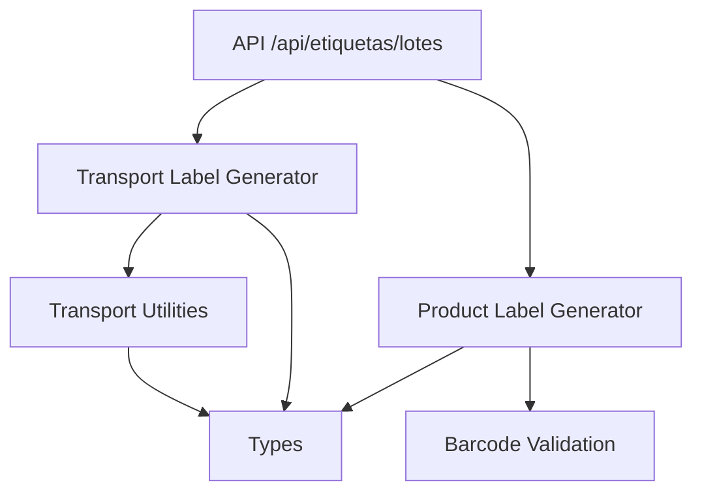
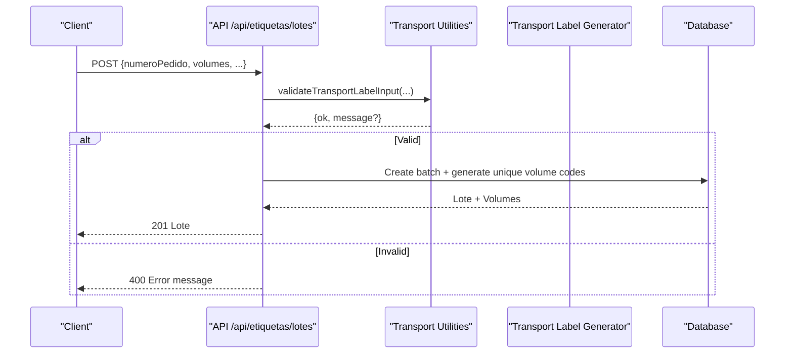
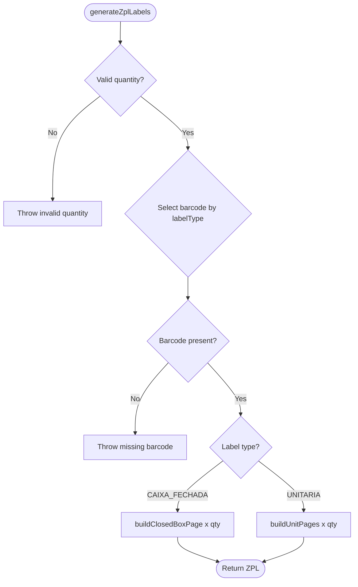
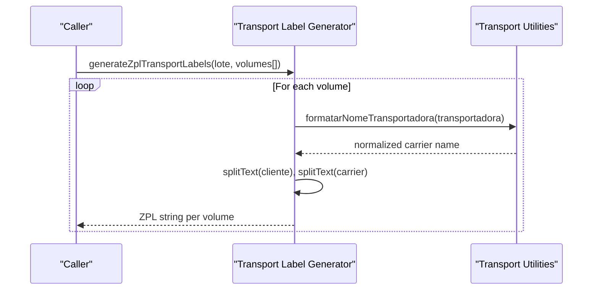
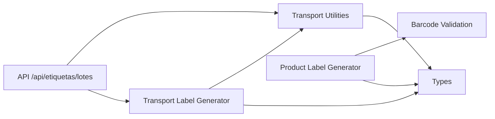

# ZPL Code Generation

<cite>
**Referenced Files in This Document**
- [zpl-generator.ts](file://lib/zpl-generator.ts)
- [zpl-transport.ts](file://lib/zpl-transport.ts)
- [barcode-validation.ts](file://lib/barcode-validation.ts)
- [labels.ts](file://types/labels.ts)
- [etiquetas-transporte.ts](file://lib/etiquetas-transporte.ts)
- [lotes.ts](file://pages/api/etiquetas/lotes.ts)
</cite>

## Table of Contents
1. Introduction
2. Project Structure
3. Core Components
4. Architecture Overview
5. Detailed Component Analysis
6. Dependency Analysis
7. Performance Considerations
8. Troubleshooting Guide
9. Conclusion

## Introduction
This document explains the Zebra Programming Language (ZPL) code generation system used to produce product labels and transport labels. It covers how product data is transformed into ZPL commands, barcode encoding, text formatting, graphics rendering, template variables, output formatting options, batch processing, error handling, and debugging strategies. The system supports unit labels, closed-box labels, and transport labels with shipping information.

## Project Structure
The ZPL generation logic is implemented as a set of focused modules:
- Product label generator: builds unit and closed-box labels from product data
- Transport label generator: builds shipping labels from order/volume data
- Barcode validation: validates and detects barcode formats
- Types: shared interfaces for products, volumes, and labels
- Transport utilities: volume code generation, transport name mapping, and input normalization
- API endpoint: orchestrates transport label batch creation and persistence

**Diagram sources**
- [lotes.ts:17-37](file://pages/api/etiquetas/lotes.ts#L17-L37)
- [zpl-transport.ts:13-59](file://lib/zpl-transport.ts#L13-L59)
- [zpl-generator.ts:149-170](file://lib/zpl-generator.ts#L149-L170)
- [barcode-validation.ts:42-88](file://lib/barcode-validation.ts#L42-L88)
- [labels.ts:1-121](file://types/labels.ts#L1-L121)
- [etiquetas-transporte.ts:32-48](file://lib/etiquetas-transporte.ts#L32-L48)

**Section sources**
- [lotes.ts:17-37](file://pages/api/etiquetas/lotes.ts#L17-L37)
- [zpl-generator.ts:149-170](file://lib/zpl-generator.ts#L149-L170)
- [zpl-transport.ts:13-59](file://lib/zpl-transport.ts#L13-L59)
- [barcode-validation.ts:42-88](file://lib/barcode-validation.ts#L42-L88)
- [labels.ts:1-121](file://types/labels.ts#L1-L121)
- [etiquetas-transporte.ts:32-48](file://lib/etiquetas-transporte.ts#L32-L48)

## Core Components
- Product label generator: Builds unit and closed-box ZPL pages, including barcode placement, centered text, and page layout. Supports EAN-13, EAN-8, and CODE128 barcodes.
- Transport label generator: Builds shipping labels with order number, client, CNPJ/CPF, carrier, and per-volume codes. Includes QR code for quick scanning.
- Barcode validation: Validates EAN-13/EAN-8 checksums and detects supported formats; returns normalized values and reasons for invalid inputs.
- Transport utilities: Normalizes transport names, generates unique volume codes, and maps external logistics data to label fields.
- Types: Shared interfaces for product labels, volumes, and analysis results.

Key responsibilities:
- Data sanitization and safe string handling for ZPL
- Text splitting and centering for readable labels
- Barcode selection based on label type
- Page construction with consistent dimensions and print darkness
- Batch generation for multiple units or volumes

**Section sources**
- [zpl-generator.ts:11-170](file://lib/zpl-generator.ts#L11-L170)
- [zpl-transport.ts:9-70](file://lib/zpl-transport.ts#L9-L70)
- [barcode-validation.ts:25-88](file://lib/barcode-validation.ts#L25-L88)
- [etiquetas-transporte.ts:32-108](file://lib/etiquetas-transporte.ts#L32-L108)
- [labels.ts:1-121](file://types/labels.ts#L1-L121)

## Architecture Overview
The system follows a layered approach:
- API layer receives requests and validates inputs
- Business logic layers transform domain data into ZPL command strings
- Utility layers handle barcode validation, text formatting, and transport name mapping
- Output is either returned directly (product labels) or persisted and later retrieved (transport labels)

**Diagram sources**
- [lotes.ts:28-88](file://pages/api/etiquetas/lotes.ts#L28-L88)
- [etiquetas-transporte.ts:110-128](file://lib/etiquetas-transporte.ts#L110-L128)

## Detailed Component Analysis

### Product Label Generator
Responsibilities:
- Validate and select barcode based on label type
- Split product name into lines fitting label width
- Center text and place barcodes at calculated positions
- Build unit label pages (multiple units per page) and closed-box label pages
- Assemble ZPL pages with consistent dimensions and print darkness

Key functions:
- sanitizeZpl: Removes control characters and normalizes whitespace
- splitText: Splits text into lines respecting max line length and max lines
- buildBarcodeField: Generates ZPL barcode field for EAN-13, EAN-8, or CODE128
- buildUnitLabel/buildUnitPages: Creates unit labels and paginates across columns
- buildClosedBoxPage: Creates a larger box label with quantity info
- generateZplLabels: Entry point that selects flow based on label type

Template variables and formatting:
- Product name, brand, ADM code, and barcode value are sanitized and formatted
- Text is centered using computed offsets
- Barcodes use module widths and heights appropriate for label size
- Pages include header/footer-like elements via fixed Y positions

Batch processing:
- Units are grouped up to three per page, repeating until all quantities are covered
- Closed-box labels repeat once per requested quantity

Error handling:
- Throws errors for invalid quantities, missing barcodes, or unsupported formats
- Uses barcode validation to detect invalid EAN checksums

Performance considerations:
- Minimal string concatenation per page
- Reuses common calculations for centering and positioning
- Avoids heavy operations inside loops

**Diagram sources**
- [zpl-generator.ts:149-170](file://lib/zpl-generator.ts#L149-L170)
- [zpl-generator.ts:78-121](file://lib/zpl-generator.ts#L78-L121)
- [zpl-generator.ts:123-147](file://lib/zpl-generator.ts#L123-L147)

**Section sources**
- [zpl-generator.ts:11-170](file://lib/zpl-generator.ts#L11-L170)
- [barcode-validation.ts:42-88](file://lib/barcode-validation.ts#L42-L88)

### Transport Label Generator
Responsibilities:
- Format order, client, CNPJ/CPF, carrier, and date
- Generate per-volume labels with unique volume codes
- Include QR code for quick scanning and barcode for volume code
- Support batch generation for multiple volumes

Key functions:
- generateZplTransportLabel: Builds a single transport label ZPL
- generateZplTransportLabels: Builds multiple labels for a batch
- formatDataAtual: Formats current date for the label
- Utilizes transport utilities for name mapping and text splitting

Template variables and formatting:
- Order number displayed prominently with QR code
- Carrier name split into multiple lines if needed
- Volume index and total shown clearly
- Optional NF number and CNPJ/CPF appended when available

Batch processing:
- Maps over volumes array to produce concatenated ZPL for all volumes

Error handling:
- Throws when no volumes provided

**Diagram sources**
- [zpl-transport.ts:13-70](file://lib/zpl-transport.ts#L13-L70)
- [etiquetas-transporte.ts:32-48](file://lib/etiquetas-transporte.ts#L32-L48)

**Section sources**
- [zpl-transport.ts:9-70](file://lib/zpl-transport.ts#L9-L70)
- [etiquetas-transporte.ts:32-48](file://lib/etiquetas-transporte.ts#L32-L48)

### Barcode Validation
Responsibilities:
- Detect supported barcode formats (EAN-13, EAN-8, CODE128)
- Validate checksums for EAN-13 and EAN-8
- Normalize input and return structured analysis results

Key functions:
- isValidEan13/isValidEan8: Check digit verification
- detectBarcodeType: Determines format based on content rules
- analyzeBarcode: Returns validity, type, normalized value, and reason

Complexity:
- O(n) where n is barcode length for checksum calculation
- Constant-time checks for format detection

Error handling:
- Returns detailed reasons for invalid inputs, enabling user feedback

**Section sources**
- [barcode-validation.ts:25-88](file://lib/barcode-validation.ts#L25-L88)

### Transport Utilities
Responsibilities:
- Normalize transport names to canonical values
- Sanitize order numbers and format documents (CNPJ/CPF)
- Generate unique volume codes with collision handling
- Map external logistics data to label fields

Key functions:
- formatarNomeTransportadora: Maps enum-like values to display names
- sanitizeNumeroPedido: Cleans and caps order number length
- gerarCodigoVolume/gerarCodigosVolumes: Produces unique codes with random suffixes on collision
- mapearDadosPedidoParaEtiqueta: Extracts and enriches fields from external payloads

Batch processing:
- Generates arrays of unique volume codes for entire batches

Error handling:
- Returns validation result objects for input checks

**Section sources**
- [etiquetas-transporte.ts:32-108](file://lib/etiquetas-transporte.ts#L32-L108)
- [etiquetas-transporte.ts:110-128](file://lib/etiquetas-transporte.ts#L110-L128)
- [etiquetas-transporte.ts:207-349](file://lib/etiquetas-transporte.ts#L207-L349)

### API Endpoint for Transport Labels
Responsibilities:
- Authenticate and authorize users
- Validate inputs and normalize transporters
- Generate unique volume codes considering existing ones
- Persist batch and return created lote

Flow:
- POST creates a new batch, ensuring uniqueness and returning 201
- GET lists recent batches with pagination
- Handles duplicate key errors and internal server errors

**Section sources**
- [lotes.ts:17-112](file://pages/api/etiquetas/lotes.ts#L17-L112)

## Dependency Analysis
- zpl-generator.ts depends on barcode-validation.ts and types/labels.ts
- zpl-transport.ts depends on etiquetas-transporte.ts, zpl-generator.ts, and types/labels.ts
- etiquetas-transporte.ts defines shared constants and utilities used by zpl-transport.ts and the API
- API endpoint uses etiquetas-transporte.ts for validation and code generation, and persists via repository

**Diagram sources**
- [lotes.ts:17-37](file://pages/api/etiquetas/lotes.ts#L17-L37)
- [zpl-transport.ts:1-70](file://lib/zpl-transport.ts#L1-L70)
- [zpl-generator.ts:1-170](file://lib/zpl-generator.ts#L1-L170)
- [barcode-validation.ts:1-89](file://lib/barcode-validation.ts#L1-L89)
- [labels.ts:1-121](file://types/labels.ts#L1-L121)
- [etiquetas-transporte.ts:1-350](file://lib/etiquetas-transporte.ts#L1-L350)

**Section sources**
- [lotes.ts:17-112](file://pages/api/etiquetas/lotes.ts#L17-L112)
- [zpl-transport.ts:1-70](file://lib/zpl-transport.ts#L1-L70)
- [zpl-generator.ts:1-170](file://lib/zpl-generator.ts#L1-L170)
- [barcode-validation.ts:1-89](file://lib/barcode-validation.ts#L1-L89)
- [labels.ts:1-121](file://types/labels.ts#L1-L121)
- [etiquetas-transporte.ts:1-350](file://lib/etiquetas-transporte.ts#L1-L350)

## Performance Considerations
- Keep label templates minimal: avoid excessive text wrapping and large images
- Use efficient text splitting and centering to reduce recomputation
- Prefer batch generation for multiple units or volumes to minimize overhead
- Cache repeated computations like page dimensions and darkness settings
- Validate inputs early to fail fast and avoid unnecessary processing
- For large batches, consider streaming or chunking responses if exposed via API

[No sources needed since this section provides general guidance]

## Troubleshooting Guide
Common issues and resolutions:
- Invalid quantity: Ensure integer greater than zero for product labels
- Missing barcode: Verify product has a registered barcode for the selected label type
- Unsupported barcode: Confirm barcode format is EAN-13, EAN-8, or CODE128 and passes checksums
- Duplicate volume codes: Existing codes are considered; system appends random suffixes to ensure uniqueness
- No volumes for transport labels: Provide at least one volume to generate labels
- Unauthorized access: Ensure authenticated user with allowed roles

Debugging approaches:
- Inspect generated ZPL by logging intermediate command arrays before joining
- Validate barcode analysis results to confirm detected type and normalized value
- Check transport name mapping to ensure correct carrier display
- Review API error responses for validation messages and status codes

**Section sources**
- [zpl-generator.ts:149-170](file://lib/zpl-generator.ts#L149-L170)
- [zpl-transport.ts:61-70](file://lib/zpl-transport.ts#L61-L70)
- [barcode-validation.ts:42-88](file://lib/barcode-validation.ts#L42-L88)
- [lotes.ts:28-88](file://pages/api/etiquetas/lotes.ts#L28-L88)

## Conclusion
The ZPL generation system provides robust support for product and transport labels with strong validation, flexible formatting, and batch capabilities. By leveraging barcode validation, text splitting, and transport utilities, it ensures reliable label outputs suitable for printing workflows. Proper error handling and debugging practices help maintain high quality and operational stability.

[No sources needed since this section summarizes without analyzing specific files]