# Dashboard Architecture

<cite>
**Referenced Files in This Document**
- [pages/index.tsx](file://pages/index.tsx)
- [contexts/AuthContext.tsx](file://contexts/AuthContext.tsx)
- [hooks/useCurrentDashboard.ts](file://hooks/useCurrentDashboard.ts)
- [lib/dashboard-freshness.ts](file://lib/dashboard-freshness.ts)
- [lib/dashboard-external-cache.ts](file://lib/dashboard-external-cache.ts)
- [components/dashboard/ExpedicaoCards.tsx](file://components/dashboard/ExpedicaoCards.tsx)
- [components/dashboard/ResumoStatusPedidos.tsx](file://components/dashboard/ResumoStatusPedidos.tsx)
- [services/api.ts](file://services/api.ts)
- [pages/api/dashboard/logistica-inicial.ts](file://pages/api/dashboard/logistica-inicial.ts)
- [lib/logistica-snapshot.ts](file://lib/logistica-snapshot.ts)
</cite>

## Table of Contents
1. [Introduction](#introduction)
2. [Project Structure](#project-structure)
3. [Core Components](#core-components)
4. [Architecture Overview](#architecture-overview)
5. [Detailed Component Analysis](#detailed-component-analysis)
6. [Dependency Analysis](#dependency-analysis)
7. [Performance Considerations](#performance-considerations)
8. [Troubleshooting Guide](#troubleshooting-guide)
9. [Conclusion](#conclusion)

## Introduction
This document explains the Logistics Dashboard architecture with a focus on component hierarchy, state management patterns, and data flow between the main dashboard page, custom hooks, and utility libraries. It covers authentication via React Context, local storage caching strategies, auto-refresh with configurable intervals, error handling, loading states, and performance optimizations such as memoization with useMemo and useCallback. It also details real-time updates, background synchronization, and offline capabilities.

## Project Structure
The dashboard is implemented as a Next.js application:
- The main dashboard page orchestrates UI, user interactions, and data fetching.
- A React Context provides authentication state across the app.
- Custom hooks encapsulate reusable logic for dashboard state and freshness.
- Utility libraries handle external API caching, snapshot synchronization, and data normalization.
- Serverless API endpoints aggregate and cache dashboard payloads from external systems.

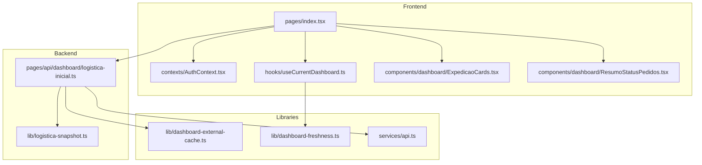

**Diagram sources**
- [pages/index.tsx:1-1200](file://pages/index.tsx#L1-L1200)
- [contexts/AuthContext.tsx:65-508](file://contexts/AuthContext.tsx#L65-L508)
- [hooks/useCurrentDashboard.ts:1-32](file://hooks/useCurrentDashboard.ts#L1-L32)
- [components/dashboard/ExpedicaoCards.tsx:1-278](file://components/dashboard/ExpedicaoCards.tsx#L1-L278)
- [components/dashboard/ResumoStatusPedidos.tsx:1-18](file://components/dashboard/ResumoStatusPedidos.tsx#L1-L18)
- [pages/api/dashboard/logistica-inicial.ts:782-800](file://pages/api/dashboard/logistica-inicial.ts#L782-L800)
- [lib/logistica-snapshot.ts:543-800](file://lib/logistica-snapshot.ts#L543-L800)
- [lib/dashboard-external-cache.ts:1-92](file://lib/dashboard-external-cache.ts#L1-L92)
- [lib/dashboard-freshness.ts:1-24](file://lib/dashboard-freshness.ts#L1-L24)
- [services/api.ts:1-175](file://services/api.ts#L1-L175)

**Section sources**
- [pages/index.tsx:1-1200](file://pages/index.tsx#L1-L1200)
- [pages/api/dashboard/logistica-inicial.ts:782-800](file://pages/api/dashboard/logistica-inicial.ts#L782-L800)

## Core Components
- Main dashboard page: manages authentication checks, period filters, data fetching, auto-refresh, and UI rendering.
- AuthContext: centralizes login/logout, session validation, and redirects based on user roles.
- useCurrentDashboard hook: wraps state updates with freshness rules and persists to localStorage for offline resilience.
- ExpedicaoCards and ResumoStatusPedidos: present stage cards, alerts, and pending items.
- API service: Axios instance with interceptors for credentials and 401 handling.
- Server endpoint: aggregates external data, caches responses, and returns structured dashboard payloads.
- Snapshot sync: background process that normalizes and stores latest logistics snapshots.

**Section sources**
- [pages/index.tsx:384-606](file://pages/index.tsx#L384-L606)
- [contexts/AuthContext.tsx:65-508](file://contexts/AuthContext.tsx#L65-L508)
- [hooks/useCurrentDashboard.ts:1-32](file://hooks/useCurrentDashboard.ts#L1-L32)
- [components/dashboard/ExpedicaoCards.tsx:118-278](file://components/dashboard/ExpedicaoCards.tsx#L118-L278)
- [components/dashboard/ResumoStatusPedidos.tsx:1-18](file://components/dashboard/ResumoStatusPedidos.tsx#L1-L18)
- [services/api.ts:20-175](file://services/api.ts#L20-L175)
- [pages/api/dashboard/logistica-inicial.ts:782-800](file://pages/api/dashboard/logistica-inicial.ts#L782-L800)
- [lib/logistica-snapshot.ts:543-800](file://lib/logistica-snapshot.ts#L543-L800)

## Architecture Overview
The dashboard follows a layered architecture:
- Presentation layer (React components) renders status cards, alerts, and detail modals.
- State layer uses React Context for auth and custom hooks for dashboard data with freshness-aware persistence.
- Data layer includes serverless API endpoints that fetch from external ERP services, cache results, and return normalized payloads.
- Background synchronization writes snapshots to the database for reliability and future reads.

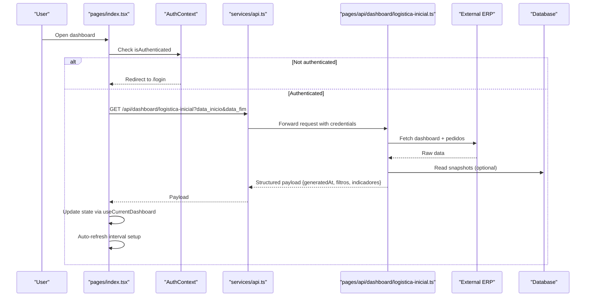

**Diagram sources**
- [pages/index.tsx:419-606](file://pages/index.tsx#L419-L606)
- [contexts/AuthContext.tsx:95-191](file://contexts/AuthContext.tsx#L95-L191)
- [services/api.ts:46-115](file://services/api.ts#L46-L115)
- [pages/api/dashboard/logistica-inicial.ts:782-800](file://pages/api/dashboard/logistica-inicial.ts#L782-L800)
- [lib/logistica-snapshot.ts:543-800](file://lib/logistica-snapshot.ts#L543-L800)

## Detailed Component Analysis

### Authentication Flow with React Context
- AuthProvider initializes state and loads user session by calling protected endpoints.
- Login posts credentials; after success, it calls /api/auth/me to confirm session and sets HTTP-only cookies.
- Logout clears state and navigates to login.
- Periodic token expiration checks run every few minutes when authenticated.

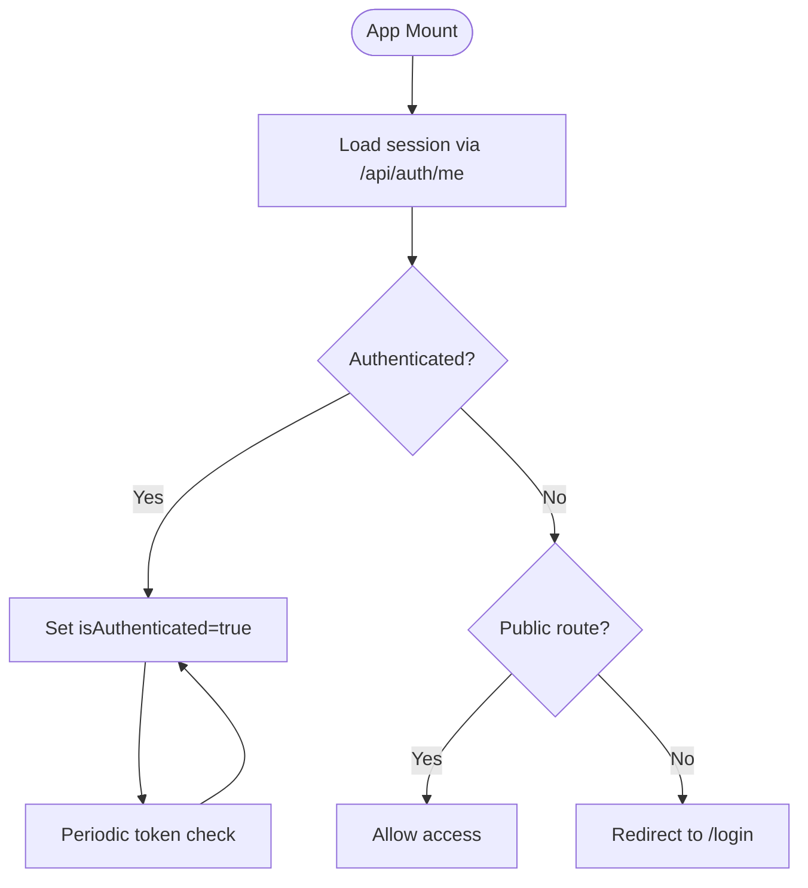

**Diagram sources**
- [contexts/AuthContext.tsx:95-191](file://contexts/AuthContext.tsx#L95-L191)
- [contexts/AuthContext.tsx:228-338](file://contexts/AuthContext.tsx#L228-L338)
- [contexts/AuthContext.tsx:340-380](file://contexts/AuthContext.tsx#L340-L380)
- [contexts/AuthContext.tsx:445-480](file://contexts/AuthContext.tsx#L445-L480)

**Section sources**
- [contexts/AuthContext.tsx:65-508](file://contexts/AuthContext.tsx#L65-L508)

### Dashboard Page: State Management and Data Flow
- Uses useAuth to guard routes and redirect unauthenticated users.
- Manages period filters (start/end dates), applies them to queries, and triggers refreshes.
- Loads dashboard data via Promise.allSettled to avoid blocking UI on secondary endpoints (alerts and daily summary).
- Stores dashboard state using useCurrentDashboard, which enforces freshness rules and persists to localStorage.
- Sets up an auto-refresh interval and visibility change handler to keep data fresh without excessive requests.

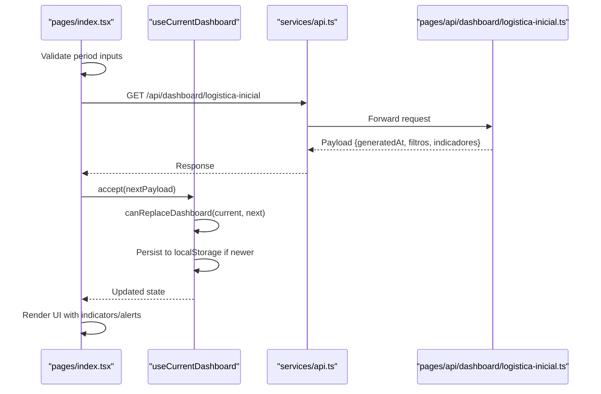

**Diagram sources**
- [pages/index.tsx:425-564](file://pages/index.tsx#L425-L564)
- [hooks/useCurrentDashboard.ts:5-31](file://hooks/useCurrentDashboard.ts#L5-L31)
- [lib/dashboard-freshness.ts:6-23](file://lib/dashboard-freshness.ts#L6-L23)
- [services/api.ts:46-115](file://services/api.ts#L46-L115)
- [pages/api/dashboard/logistica-inicial.ts:782-800](file://pages/api/dashboard/logistica-inicial.ts#L782-L800)

**Section sources**
- [pages/index.tsx:384-606](file://pages/index.tsx#L384-L606)
- [hooks/useCurrentDashboard.ts:1-32](file://hooks/useCurrentDashboard.ts#L1-L32)
- [lib/dashboard-freshness.ts:1-24](file://lib/dashboard-freshness.ts#L1-L24)

### Auto-Refresh Mechanism with Configurable Intervals
- The dashboard defines a constant interval (in milliseconds) for periodic refresh.
- On tab visibility change, it checks last sync time and only refreshes if the interval has elapsed.
- Manual refresh forces cache bypass by appending force and timestamp parameters.

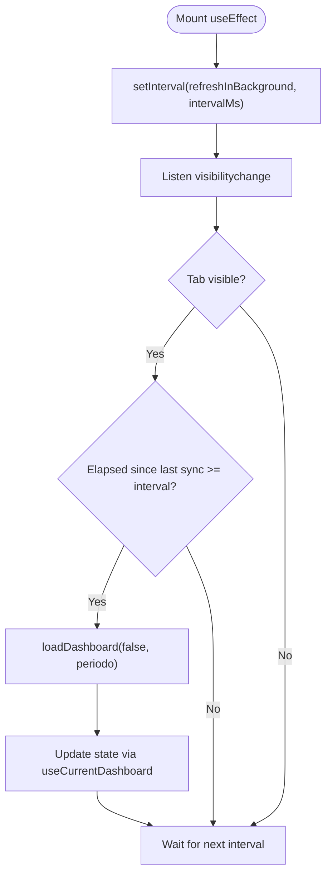

**Diagram sources**
- [pages/index.tsx:566-606](file://pages/index.tsx#L566-L606)

**Section sources**
- [pages/index.tsx:566-606](file://pages/index.tsx#L566-L606)

### Local Storage Caching Strategy and Offline Capabilities
- useCurrentDashboard compares incoming payloads against current state and localStorage using generatedAt timestamps and filter matching.
- If a newer saved payload exists, it replaces current state to maintain consistency across tabs.
- On initial load, the dashboard page reads cached values to render quickly before network requests complete.

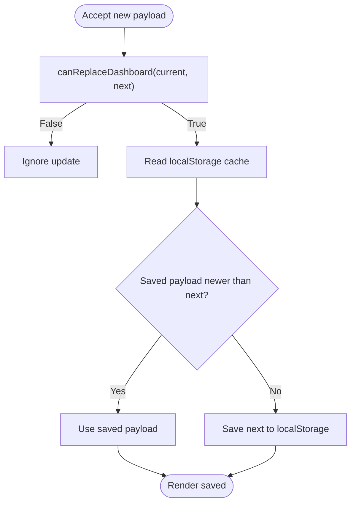

**Diagram sources**
- [hooks/useCurrentDashboard.ts:5-31](file://hooks/useCurrentDashboard.ts#L5-L31)
- [lib/dashboard-freshness.ts:6-23](file://lib/dashboard-freshness.ts#L6-L23)
- [pages/index.tsx:566-584](file://pages/index.tsx#L566-L584)

**Section sources**
- [hooks/useCurrentDashboard.ts:1-32](file://hooks/useCurrentDashboard.ts#L1-L32)
- [lib/dashboard-freshness.ts:1-24](file://lib/dashboard-freshness.ts#L1-L24)
- [pages/index.tsx:566-584](file://pages/index.tsx#L566-L584)

### Real-Time Updates and Background Synchronization
- The dashboard performs background synchronization by periodically refreshing data and updating state without blocking UI.
- Secondary endpoints (alerts and daily summary) are fetched concurrently and do not block primary dashboard rendering.
- Server-side snapshot synchronization consolidates external data and persists changes to the database for reliable reads.

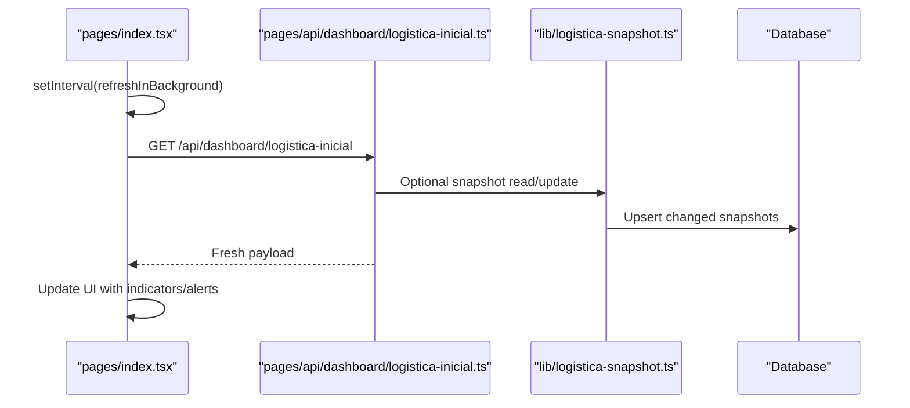

**Diagram sources**
- [pages/index.tsx:566-606](file://pages/index.tsx#L566-L606)
- [pages/api/dashboard/logistica-inicial.ts:782-800](file://pages/api/dashboard/logistica-inicial.ts#L782-L800)
- [lib/logistica-snapshot.ts:543-800](file://lib/logistica-snapshot.ts#L543-L800)

**Section sources**
- [pages/index.tsx:504-564](file://pages/index.tsx#L504-L564)
- [lib/logistica-snapshot.ts:543-800](file://lib/logistica-snapshot.ts#L543-L800)

### Error Handling Patterns
- Transient errors (e.g., external API unavailable) are detected and suppressed to avoid showing persistent errors.
- Non-transient errors set a user-visible message while keeping the UI responsive.
- Axios interceptors handle 401 responses by dispatching unauthorized events and redirecting to login.

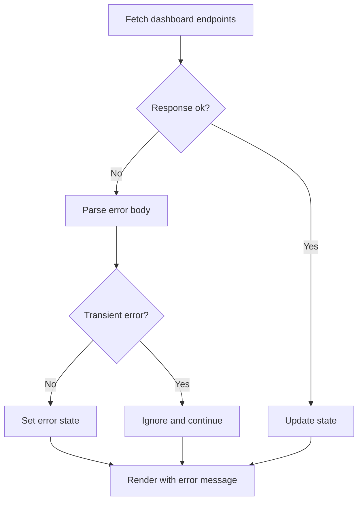

**Diagram sources**
- [pages/index.tsx:471-564](file://pages/index.tsx#L471-L564)
- [services/api.ts:94-115](file://services/api.ts#L94-L115)
- [services/api.ts:135-164](file://services/api.ts#L135-L164)

**Section sources**
- [pages/index.tsx:471-564](file://pages/index.tsx#L471-L564)
- [services/api.ts:94-115](file://services/api.ts#L94-L115)
- [services/api.ts:135-164](file://services/api.ts#L135-L164)

### Loading States Management
- Initial loading shows a spinner until authentication resolves.
- Primary dashboard loading toggles a loading state; secondary data (alerts, daily summary) does not block first paint.
- Refreshing state indicates manual or background refresh actions.

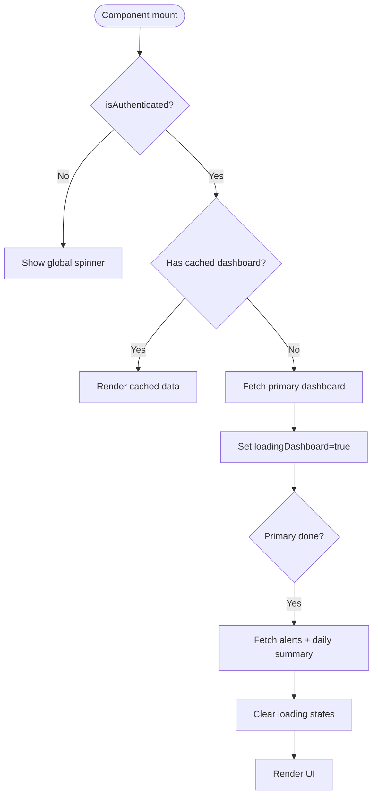

**Diagram sources**
- [pages/index.tsx:419-564](file://pages/index.tsx#L419-L564)
- [pages/index.tsx:940-948](file://pages/index.tsx#L940-L948)

**Section sources**
- [pages/index.tsx:419-564](file://pages/index.tsx#L419-L564)
- [pages/index.tsx:940-948](file://pages/index.tsx#L940-L948)

### Performance Optimizations: Memoization with useMemo and useCallback
- useMemo computes derived lists (indicadores ordenados, alertas, totais) to avoid recomputation on re-renders.
- useCallback memoizes functions like loadDashboard and fetchPedidoDetalhe to stabilize dependencies and prevent unnecessary re-renders.
- Concurrency limits and caching reduce external API load and improve responsiveness.

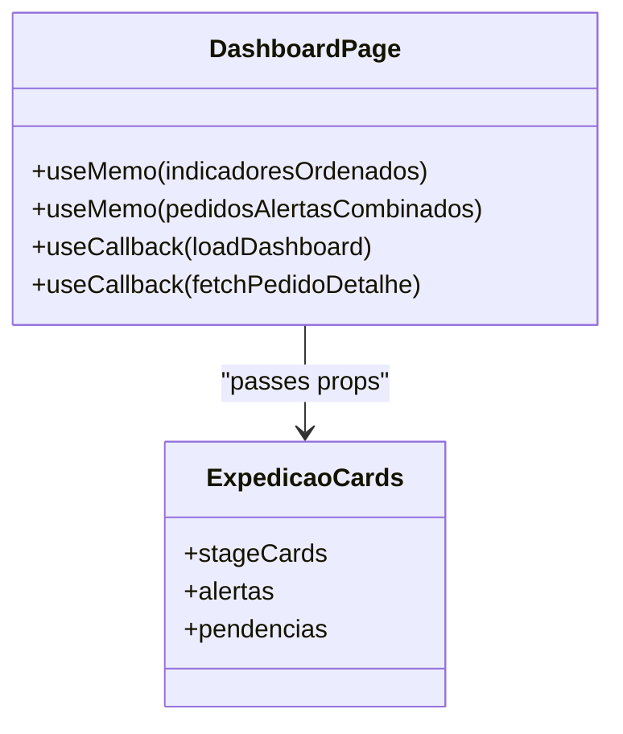

**Diagram sources**
- [pages/index.tsx:615-637](file://pages/index.tsx#L615-L637)
- [pages/index.tsx:700-725](file://pages/index.tsx#L700-L725)
- [components/dashboard/ExpedicaoCards.tsx:118-278](file://components/dashboard/ExpedicaoCards.tsx#L118-L278)

**Section sources**
- [pages/index.tsx:615-637](file://pages/index.tsx#L615-L637)
- [pages/index.tsx:700-725](file://pages/index.tsx#L700-L725)
- [components/dashboard/ExpedicaoCards.tsx:118-278](file://components/dashboard/ExpedicaoCards.tsx#L118-L278)

## Dependency Analysis
- The dashboard page depends on AuthContext for authentication, useCurrentDashboard for state persistence, and UI components for presentation.
- The server endpoint depends on external API services and snapshot synchronization to build consistent payloads.
- Libraries provide caching and freshness logic to ensure efficient and correct updates.

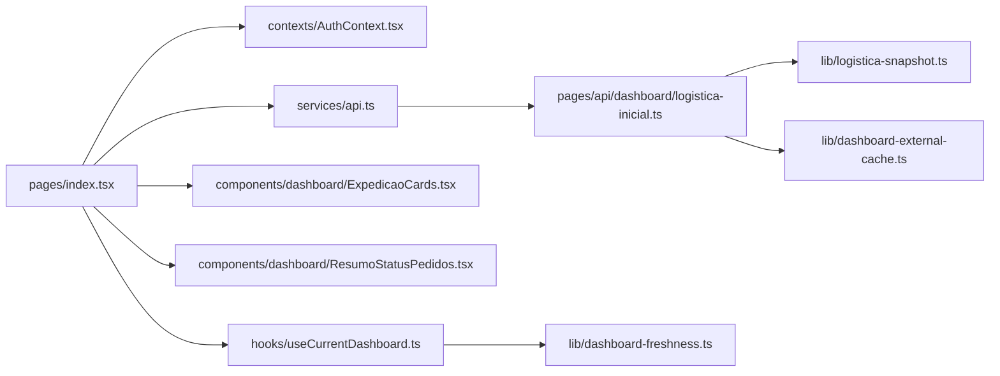

**Diagram sources**
- [pages/index.tsx:1-1200](file://pages/index.tsx#L1-L1200)
- [contexts/AuthContext.tsx:65-508](file://contexts/AuthContext.tsx#L65-L508)
- [hooks/useCurrentDashboard.ts:1-32](file://hooks/useCurrentDashboard.ts#L1-L32)
- [components/dashboard/ExpedicaoCards.tsx:1-278](file://components/dashboard/ExpedicaoCards.tsx#L1-L278)
- [components/dashboard/ResumoStatusPedidos.tsx:1-18](file://components/dashboard/ResumoStatusPedidos.tsx#L1-L18)
- [services/api.ts:1-175](file://services/api.ts#L1-L175)
- [pages/api/dashboard/logistica-inicial.ts:782-800](file://pages/api/dashboard/logistica-inicial.ts#L782-L800)
- [lib/logistica-snapshot.ts:543-800](file://lib/logistica-snapshot.ts#L543-L800)
- [lib/dashboard-external-cache.ts:1-92](file://lib/dashboard-external-cache.ts#L1-L92)
- [lib/dashboard-freshness.ts:1-24](file://lib/dashboard-freshness.ts#L1-L24)

**Section sources**
- [pages/index.tsx:1-1200](file://pages/index.tsx#L1-L1200)
- [pages/api/dashboard/logistica-inicial.ts:782-800](file://pages/api/dashboard/logistica-inicial.ts#L782-L800)

## Performance Considerations
- Use concurrency limits when fetching external data to avoid overwhelming APIs.
- Cache responses with TTL and staleness windows to reduce redundant requests.
- Memoize expensive computations and stable callbacks to minimize re-renders.
- Prefer offloading heavy processing to server endpoints and snapshots for reliability.

[No sources needed since this section provides general guidance]

## Troubleshooting Guide
- If the dashboard shows persistent errors, check transient error detection and ensure non-transient messages are displayed.
- For authentication issues, verify cookie handling and 401 interceptor behavior.
- For stale data, inspect localStorage cache keys and generatedAt comparisons.
- For slow updates, review auto-refresh intervals and visibility change handlers.

**Section sources**
- [pages/index.tsx:471-564](file://pages/index.tsx#L471-L564)
- [services/api.ts:94-115](file://services/api.ts#L94-L115)
- [services/api.ts:135-164](file://services/api.ts#L135-L164)
- [hooks/useCurrentDashboard.ts:5-31](file://hooks/useCurrentDashboard.ts#L5-L31)

## Conclusion
The Logistics Dashboard combines React Context-based authentication, custom hooks for state management with freshness-aware persistence, and robust server-side aggregation and caching. It supports real-time updates through configurable auto-refresh, handles errors gracefully, and optimizes performance with memoization and concurrency controls. The architecture ensures a responsive UI even under network variability and provides offline resilience via local storage caching.

[No sources needed since this section summarizes without analyzing specific files]