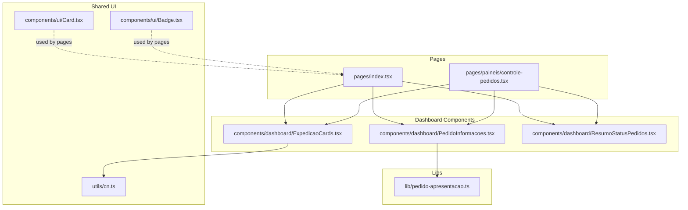
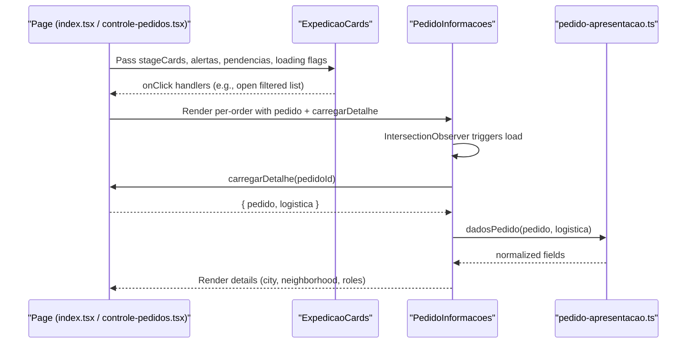
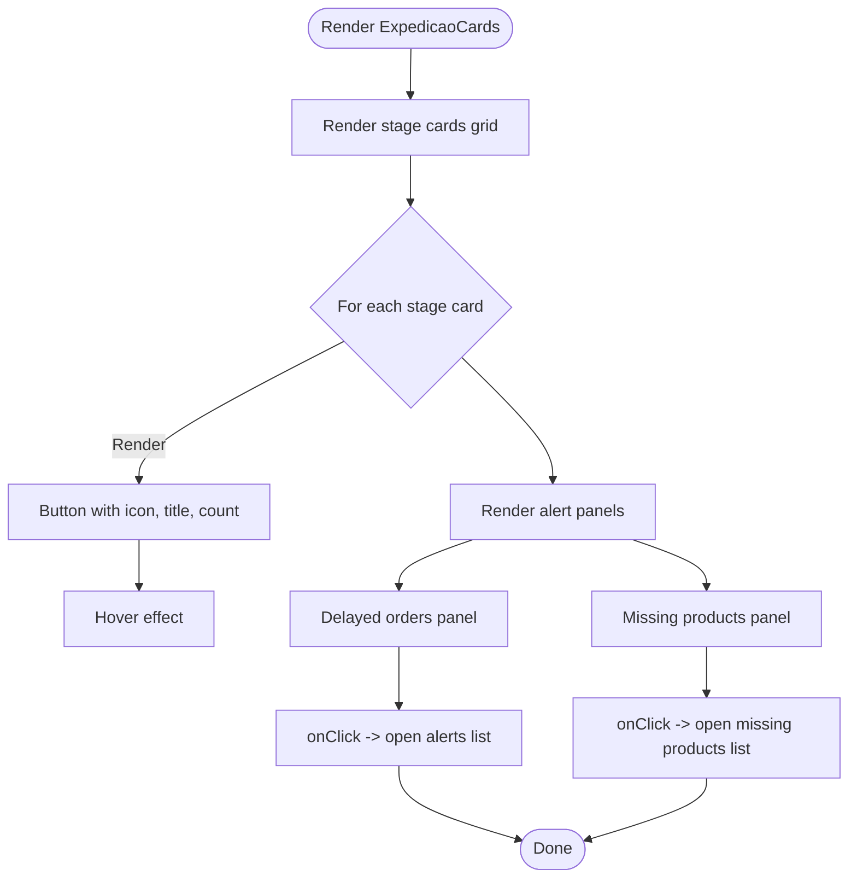
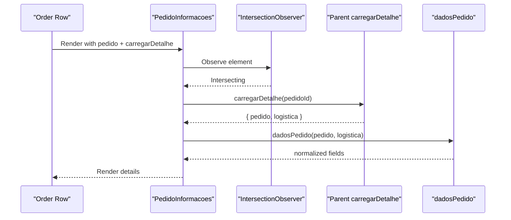
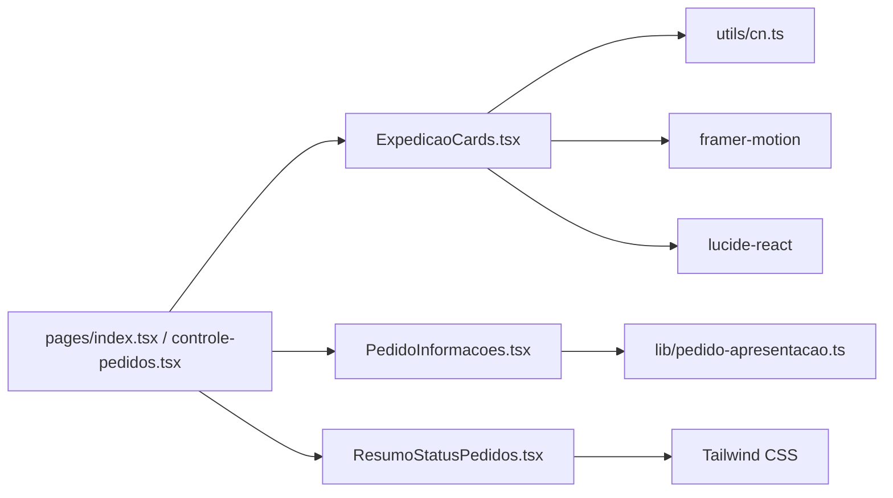

# Dashboard Components

<cite>
**Referenced Files in This Document**
- [ExpedicaoCards.tsx](file://components/dashboard/ExpedicaoCards.tsx)
- [PedidoInformacoes.tsx](file://components/dashboard/PedidoInformacoes.tsx)
- [ResumoStatusPedidos.tsx](file://components/dashboard/ResumoStatusPedidos.tsx)
- [pedido-apresentacao.ts](file://lib/pedido-apresentacao.ts)
- [index.tsx](file://pages/index.tsx)
- [controle-pedidos.tsx](file://pages/paineis/controle-pedidos.tsx)
- [Card.tsx](file://components/ui/Card.tsx)
- [Badge.tsx](file://components/ui/Badge.tsx)
- [cn.ts](file://utils/cn.ts)
</cite>

## Table of Contents
1. Introduction
2. Project Structure
3. Core Components
4. Architecture Overview
5. Detailed Component Analysis
6. Dependency Analysis
7. Performance Considerations
8. Troubleshooting Guide
9. Conclusion

## Introduction
This document explains the dashboard UI components that present order cards, detailed order information, and status summaries. It focuses on:
- ExpedicaoCards: displays stage cards with counts and two alert panels (delayed orders and missing products).
- PedidoInformacoes: lazily loads and shows detailed order info such as city, neighborhood, separator, and checker.
- ResumoStatusPedidos: renders a compact grid summary of order statuses.

It also covers props, state management, event handling, styling approaches, responsive design, accessibility, composition strategies, usage examples, customization options, integration points, and performance optimizations like virtual scrolling and lazy loading.

## Project Structure
The dashboard components are located under components/dashboard and are consumed by pages that compose the main dashboards. Shared UI primitives live under components/ui and utilities under utils. Data normalization for order details is provided by lib/pedido-apresentacao.ts.

**Diagram sources**
- [index.tsx:1046-1089](file://pages/index.tsx#L1046-L1089)
- [controle-pedidos.tsx:230-257](file://pages/paineis/controle-pedidos.tsx#L230-L257)
- [ExpedicaoCards.tsx:118-137](file://components/dashboard/ExpedicaoCards.tsx#L118-L137)
- [PedidoInformacoes.tsx:28-64](file://components/dashboard/PedidoInformacoes.tsx#L28-L64)
- [ResumoStatusPedidos.tsx:3-15](file://components/dashboard/ResumoStatusPedidos.tsx#L3-L15)
- [Card.tsx:15-20](file://components/ui/Card.tsx#L15-L20)
- [Badge.tsx:15-31](file://components/ui/Badge.tsx#L15-L31)
- [cn.ts:4-6](file://utils/cn.ts#L4-L6)
- [pedido-apresentacao.ts:1-25](file://lib/pedido-apresentacao.ts#L1-L25)

**Section sources**
- [index.tsx:1046-1089](file://pages/index.tsx#L1046-L1089)
- [controle-pedidos.tsx:230-257](file://pages/paineis/controle-pedidos.tsx#L230-L257)
- [ExpedicaoCards.tsx:118-137](file://components/dashboard/ExpedicaoCards.tsx#L118-L137)
- [PedidoInformacoes.tsx:28-64](file://components/dashboard/PedidoInformacoes.tsx#L28-L64)
- [ResumoStatusPedidos.tsx:3-15](file://components/dashboard/ResumoStatusPedidos.tsx#L3-L15)
- [Card.tsx:15-20](file://components/ui/Card.tsx#L15-L20)
- [Badge.tsx:15-31](file://components/ui/Badge.tsx#L15-L31)
- [cn.ts:4-6](file://utils/cn.ts#L4-L6)
- [pedido-apresentacao.ts:1-25](file://lib/pedido-apresentacao.ts#L1-L25)

## Core Components
- ExpedicaoCards: Renders a responsive grid of stage cards plus two alert panels. Supports loading states, wide layout mode, and click handlers to navigate to filtered lists.
- PedidoInformacoes: Lazily fetches order details when visible, normalizes data, and displays key fields. Uses an IntersectionObserver to avoid unnecessary requests.
- ResumoStatusPedidos: Displays a simple grid of status totals, filtering out zero or non-relevant entries.

Key responsibilities:
- Present operational metrics clearly with visual hierarchy and status indicators.
- Provide accessible, keyboard-friendly interactive elements.
- Compose with shared UI primitives for consistent look and feel.

**Section sources**
- [ExpedicaoCards.tsx:40-47](file://components/dashboard/ExpedicaoCards.tsx#L40-L47)
- [ExpedicaoCards.tsx:118-137](file://components/dashboard/ExpedicaoCards.tsx#L118-L137)
- [PedidoInformacoes.tsx:28-64](file://components/dashboard/PedidoInformacoes.tsx#L28-L64)
- [ResumoStatusPedidos.tsx:3-15](file://components/dashboard/ResumoStatusPedidos.tsx#L3-L15)

## Architecture Overview
The dashboard composes these components at the page level. The parent pages provide data and callbacks; the components render UI and emit events via props. PedidoInformacoes coordinates with a data normalization helper to present consistent fields regardless of source shape.

**Diagram sources**
- [index.tsx:1046-1089](file://pages/index.tsx#L1046-L1089)
- [controle-pedidos.tsx:230-257](file://pages/paineis/controle-pedidos.tsx#L230-L257)
- [PedidoInformacoes.tsx:28-64](file://components/dashboard/PedidoInformacoes.tsx#L28-L64)
- [pedido-apresentacao.ts:1-25](file://lib/pedido-apresentacao.ts#L1-L25)

## Detailed Component Analysis

### ExpedicaoCards
Purpose:
- Display stage cards with counts and icons.
- Show two alert panels: delayed orders and missing products.
- Support loading states and wide layout mode.

Props:
- stageCards: Array of card items with key, title, total, icon, optional iconClassName, colorClass, optional background styles, and onClick handler.
- alertas: Object with naoSeparado, naoConferido, naoEmbarcado, total, and onClick.
- pendencias: Object with total, pedidos array, and onClick.
- loadingStages: Boolean to show spinner in stage cards.
- loadingSecondary: Boolean to show placeholders in alert panels.
- wideLayout: Boolean to force a different grid layout.

State and behavior:
- No internal state; purely presentational based on props.
- Animations via motion library for entrance effects.
- Responsive grid using Tailwind classes; switches between 2/3/5 columns depending on breakpoints and wideLayout.

Event handling:
- Each stage card button calls its onClick to navigate or filter.
- Alert panels call their respective onClick to open related lists.

Accessibility:
- Buttons are semantic and focusable.
- Loading spinners include aria-label for screen readers.
- Visual emphasis uses color and motion; ensure sufficient contrast and consider reducing motion for users who prefer it.

Styling approach:
- Tailwind utility classes combined with cn() for conditional classes.
- Gradients and shadows for depth; subtle hover lift effects.
- Optional custom background colors/images per card.

Usage examples:
- Main dashboard passes computed stageCards and alert summaries from aggregated data.
- Control panel uses wideLayout and precomputed totals.

Integration points:
- Parent pages compute totals and build stageCards arrays.
- Click handlers typically open filtered order lists.

Performance considerations:
- Keep stageCards small and memoized if derived from large datasets.
- Avoid heavy computations inside render; precompute in parent.

**Diagram sources**
- [ExpedicaoCards.tsx:59-116](file://components/dashboard/ExpedicaoCards.tsx#L59-L116)
- [ExpedicaoCards.tsx:140-274](file://components/dashboard/ExpedicaoCards.tsx#L140-L274)

**Section sources**
- [ExpedicaoCards.tsx:40-47](file://components/dashboard/ExpedicaoCards.tsx#L40-L47)
- [ExpedicaoCards.tsx:59-116](file://components/dashboard/ExpedicaoCards.tsx#L59-L116)
- [ExpedicaoCards.tsx:118-137](file://components/dashboard/ExpedicaoCards.tsx#L118-L137)
- [ExpedicaoCards.tsx:140-274](file://components/dashboard/ExpedicaoCards.tsx#L140-L274)
- [index.tsx:1046-1089](file://pages/index.tsx#L1046-L1089)
- [controle-pedidos.tsx:230-257](file://pages/paineis/controle-pedidos.tsx#L230-L257)

### PedidoInformacoes
Purpose:
- Show detailed order information (city, neighborhood, separator, checker) for a given order.
- Lazy-load details only when the component enters the viewport.

Props:
- pedido: Partial order object including pedidoId and optional fallback fields.
- carregarDetalhe: Async function that returns { pedido, logistica } for the given ID.

State and behavior:
- Local state tracks normalized informacoes and situacao ('carregando', 'pronto', 'erro').
- Uses IntersectionObserver to trigger loading when visible; falls back to immediate load if observer is unavailable.
- Debounces rapid re-schedules via a queue to limit concurrent ERP queries.

Data normalization:
- Calls dadosPedido to merge fields from pedido and logistica, extracting city, neighborhood, UF, separator name, and checker name.

Error handling:
- On error, sets situacao to 'erro' and displays a user-friendly message.

Accessibility:
- Semantic HTML structure; text content conveys meaning without relying solely on visuals.

Styling approach:
- Compact grid layout with Tailwind classes; small font sizes for dense information.

Usage example:
- Pages render one instance per order row, passing the current pedido and a fetch function.

Integration points:
- carregarDetalhe is implemented by the parent page to call the appropriate API endpoint.

Performance considerations:
- IntersectionObserver avoids off-screen requests.
- Queue limits concurrent requests to reduce server load.
- Memoize carregarDetalhe in parent to prevent recreation.

**Diagram sources**
- [PedidoInformacoes.tsx:28-64](file://components/dashboard/PedidoInformacoes.tsx#L28-L64)
- [pedido-apresentacao.ts:1-25](file://lib/pedido-apresentacao.ts#L1-L25)

**Section sources**
- [PedidoInformacoes.tsx:28-64](file://components/dashboard/PedidoInformacoes.tsx#L28-L64)
- [pedido-apresentacao.ts:1-25](file://lib/pedido-apresentacao.ts#L1-L25)

### ResumoStatusPedidos
Purpose:
- Display a compact grid of order status totals.

Props:
- itens: Array of { codigo, titulo, total }.

Behavior:
- Filters out zero totals and certain non-relevant codes.
- Responsive grid adapts across breakpoints.

Accessibility:
- Uses section and heading to describe the summary region.

Styling approach:
- Simple bordered tiles with clear typography hierarchy.

Usage example:
- Pages pass aggregated status items to render quick overview.

**Section sources**
- [ResumoStatusPedidos.tsx:1-15](file://components/dashboard/ResumoStatusPedidos.tsx#L1-L15)

## Dependency Analysis
- ExpedicaoCards depends on:
  - Tailwind classes and cn utility for class merging.
  - Motion library for animations.
  - Lucide icons for visual indicators.
- PedidoInformacoes depends on:
  - IntersectionObserver for lazy loading.
  - dadosPedido for field normalization.
- ResumoStatusPedidos is self-contained with minimal dependencies.

Shared UI primitives:
- Card and Badge provide consistent base styles used across pages.

**Diagram sources**
- [ExpedicaoCards.tsx:1-3](file://components/dashboard/ExpedicaoCards.tsx#L1-L3)
- [PedidoInformacoes.tsx:1-2](file://components/dashboard/PedidoInformacoes.tsx#L1-L2)
- [pedido-apresentacao.ts:1-25](file://lib/pedido-apresentacao.ts#L1-L25)
- [cn.ts:4-6](file://utils/cn.ts#L4-L6)
- [index.tsx:1046-1089](file://pages/index.tsx#L1046-L1089)
- [controle-pedidos.tsx:230-257](file://pages/paineis/controle-pedidos.tsx#L230-L257)

**Section sources**
- [ExpedicaoCards.tsx:1-3](file://components/dashboard/ExpedicaoCards.tsx#L1-L3)
- [PedidoInformacoes.tsx:1-2](file://components/dashboard/PedidoInformacoes.tsx#L1-L2)
- [pedido-apresentacao.ts:1-25](file://lib/pedido-apresentacao.ts#L1-L25)
- [cn.ts:4-6](file://utils/cn.ts#L4-L6)
- [index.tsx:1046-1089](file://pages/index.tsx#L1046-L1089)
- [controle-pedidos.tsx:230-257](file://pages/paineis/controle-pedidos.tsx#L230-L257)

## Performance Considerations
- Virtual scrolling for large datasets:
  - For long lists of orders, wrap rows with a virtualizer (e.g., react-window or @tanstack/virtual) to render only visible items.
  - Combine with PedidoInformacoes’ IntersectionObserver to further reduce off-screen requests.
- Lazy loading of order details:
  - PedidoInformacoes already defers fetching until visible; ensure carregarDetalhe is memoized and debounced where appropriate.
- Request limiting:
  - PedidoInformacoes queues requests and caps concurrent calls; tune the limit based on server capacity.
- Memoization:
  - Memoize expensive computations in parent pages (e.g., stageCards, totals) to avoid re-renders.
- Styling performance:
  - Prefer Tailwind utilities; avoid excessive inline styles or dynamic class generation inside tight loops.

[No sources needed since this section provides general guidance]

## Troubleshooting Guide
Common issues and resolutions:
- PedidoInformacoes shows “Indisponível”:
  - Indicates an error during detail fetch. Verify carregarDetalhe implementation and network connectivity.
- PedidoInformacoes stuck on “Carregando...”:
  - Ensure IntersectionObserver is available or fallback path executes. Check that carregarDetalhe resolves successfully.
- ExpedicaoCards not updating:
  - Confirm parent pages update stageCards and alert props when data changes. Validate loading flags to reflect actual state.
- Responsiveness issues:
  - Verify Tailwind breakpoints and container widths. Use wideLayout only when appropriate for the page context.

**Section sources**
- [PedidoInformacoes.tsx:66-78](file://components/dashboard/PedidoInformacoes.tsx#L66-L78)
- [ExpedicaoCards.tsx:104-110](file://components/dashboard/ExpedicaoCards.tsx#L104-L110)
- [ExpedicaoCards.tsx:140-274](file://components/dashboard/ExpedicaoCards.tsx#L140-L274)

## Conclusion
These dashboard components provide a cohesive, responsive, and accessible interface for monitoring order flow and status. They integrate cleanly with page-level logic, leverage shared UI primitives, and implement thoughtful performance patterns such as lazy loading and request queuing. By following the usage examples and recommendations here, you can extend and customize them effectively while maintaining consistency and performance.

[No sources needed since this section summarizes without analyzing specific files]